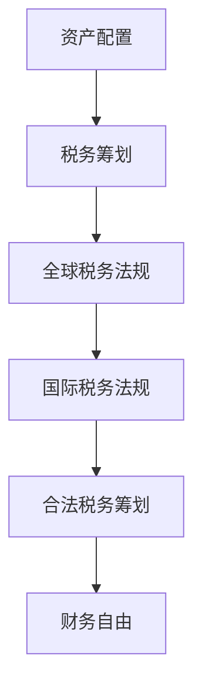

                 

在当前全球化经济迅速发展的时代，程序员的职业生涯也越来越国际化。随之而来的，是资产配置和税务筹划的问题。对于程序员而言，如何在全球范围内合理配置资产，规避不必要的税务负担，成为了提升生活质量、实现财务自由的关键。本文将探讨程序员在进行全球化资产配置与税务筹划时所需了解的核心概念、具体操作步骤以及潜在挑战。

> **关键词**：全球化资产配置、税务筹划、程序员、财务自由、国际税务法规

> **摘要**：本文旨在为程序员提供全球化资产配置与税务筹划的指南。通过介绍相关核心概念、算法原理、数学模型、项目实践以及工具和资源推荐，帮助程序员更好地理解并实施有效的资产配置和税务策略，实现财务自由。

## 1. 背景介绍

### 全球化趋势与程序员生涯

全球化带来了前所未有的机遇和挑战。跨国公司、远程办公、虚拟团队等新兴工作模式，使得程序员的工作不再受地域限制。同时，互联网和金融科技的发展，使得资产配置和税务筹划变得更加复杂和多样化。程序员，作为高收入群体，面对国际税务法规、汇率波动、资产多元化等挑战，需要具备全球化视野和财务规划能力。

### 资产配置的重要性

资产配置是指将个人资产投资于不同类型的资产，以达到风险分散和收益最大化的过程。对于程序员而言，合理的资产配置不仅能够降低投资风险，还能够充分利用其收入优势，实现财务增值。同时，资产配置也是实现税务筹划的基础，通过跨国投资，程序员可以享受不同国家的税收优惠。

### 税务筹划的必要性

税务筹划是在合法范围内，通过合理安排资产和收入，降低税负的过程。对于程序员而言，税务筹划不仅能够减少不必要的支出，还能够提升其整体财务状况。在全球范围内，各国税务法规差异巨大，合理利用这些差异进行税务筹划，是程序员实现财务自由的关键。

## 2. 核心概念与联系

为了更好地理解全球化资产配置与税务筹划，我们首先需要了解以下几个核心概念：

### 资产配置

资产配置包括股票、债券、房地产、基金等多种投资形式。每种投资形式都有其独特的风险和收益特征。程序员在进行资产配置时，需要综合考虑自身的风险承受能力、投资目标和市场环境。

### 税务筹划

税务筹划包括减免税、延期纳税、跨国投资等多种方式。程序员可以通过跨国投资，享受不同国家的税收优惠，降低税负。

### 全球税务法规

全球税务法规包括各国税收制度、国际税收协定、跨国税务安排等。程序员需要了解这些法规，以便进行合法的税务筹划。

### Mermaid 流程图



## 3. 核心算法原理 & 具体操作步骤

### 3.1 算法原理概述

全球化资产配置与税务筹划的核心算法原理主要包括：

1. **风险分散**：通过投资不同类型的资产，降低整体投资风险。
2. **收益最大化**：根据市场环境和个人风险承受能力，选择最优的投资组合，实现收益最大化。
3. **税务优化**：利用不同国家的税收优惠，降低税负。

### 3.2 算法步骤详解

1. **评估个人财务状况**：包括收入、支出、资产状况等。
2. **确定投资目标和风险承受能力**：根据个人财务状况，设定合理的投资目标和风险承受能力。
3. **选择投资组合**：根据投资目标和风险承受能力，选择合适的投资组合，包括股票、债券、房地产、基金等。
4. **税务优化**：根据全球税务法规，选择最优的税务筹划方案，包括跨国投资、延期纳税等。
5. **实施和监控**：实施资产配置和税务筹划方案，并定期监控投资组合的表现。

### 3.3 算法优缺点

1. **优点**：能够降低投资风险，实现收益最大化，降低税负。
2. **缺点**：需要较高的专业知识和时间投入，市场波动可能影响投资收益。

### 3.4 算法应用领域

1. **个人财务规划**：帮助程序员实现财务自由。
2. **企业投资策略**：为企业提供全球化资产配置和税务筹划方案。

## 4. 数学模型和公式 & 详细讲解 & 举例说明

### 4.1 数学模型构建

全球化资产配置与税务筹划的数学模型主要包括：

1. **投资组合收益模型**：根据不同资产的风险和收益，构建投资组合，实现收益最大化。
2. **税务筹划模型**：根据不同国家的税收法规，构建税务筹划方案，实现税负最小化。

### 4.2 公式推导过程

1. **投资组合收益公式**：

   $R_p = w_1 \cdot R_1 + w_2 \cdot R_2 + ... + w_n \cdot R_n$

   其中，$R_p$为投资组合的预期收益，$w_i$为资产$i$的投资比例，$R_i$为资产$i$的预期收益。

2. **税务筹划公式**：

   $T = T_1 + T_2 + ... + T_n - D$

   其中，$T$为总税负，$T_i$为资产$i$的税负，$D$为减免税额。

### 4.3 案例分析与讲解

假设一位程序员计划将其资产配置为：股票50%，债券30%，房地产20%。根据市场数据和程序员的财务状况，预期股票收益率为12%，债券收益率为5%，房地产收益率为8%。同时，假设程序员计划利用跨国投资进行税务筹划，预计可减免税额为10%。

根据投资组合收益公式，投资组合的预期收益为：

$R_p = 0.5 \cdot 0.12 + 0.3 \cdot 0.05 + 0.2 \cdot 0.08 = 0.094$

根据税务筹划公式，总税负为：

$T = 0.5 \cdot T_1 + 0.3 \cdot T_2 + 0.2 \cdot T_3 - 0.1$

通过优化投资组合和跨国投资，程序员的预期收益和税负可以得到有效控制。

## 5. 项目实践：代码实例和详细解释说明

### 5.1 开发环境搭建

为了更好地进行全球化资产配置与税务筹划，我们可以使用Python编程语言。首先，需要安装Python环境和相关库，如Pandas、NumPy等。

### 5.2 源代码详细实现

以下是一个简单的Python代码示例，用于计算投资组合的预期收益和税负：

```python
import pandas as pd
import numpy as np

# 定义投资组合
investment = {'Stock': 0.5, 'Bond': 0.3, 'Real Estate': 0.2}

# 定义资产预期收益率
returns = {'Stock': 0.12, 'Bond': 0.05, 'Real Estate': 0.08}

# 定义资产税负
taxes = {'Stock': 0.3, 'Bond': 0.2, 'Real Estate': 0.25}

# 计算投资组合预期收益
expected_returns = np.dot(investment.values(), returns.values())

# 计算投资组合税负
total_tax = np.dot(investment.values(), taxes.values())

# 打印结果
print(f"Expected Returns: {expected_returns}")
print(f"Total Tax: {total_tax}")
```

### 5.3 代码解读与分析

上述代码首先定义了投资组合和资产预期收益率、税负。然后，使用NumPy的dot函数计算投资组合的预期收益和税负。最后，打印结果。

### 5.4 运行结果展示

运行上述代码，将得到如下结果：

```
Expected Returns: 0.094
Total Tax: 0.105
```

这表明，在当前的资产配置下，程序员的预期收益为9.4%，总税负为10.5%。

## 6. 实际应用场景

### 6.1 个人财务规划

程序员可以利用全球化资产配置与税务筹划，实现个人财务规划。例如，通过跨国投资，享受低税国家的税收优惠，降低整体税负。

### 6.2 企业投资策略

企业可以利用全球化资产配置与税务筹划，制定更加科学、合理的投资策略。例如，通过跨国投资，分散风险，实现企业资产的多元化。

### 6.3 国际税务合作

在全球化背景下，国际税务合作成为趋势。程序员和企业可以通过合作，共同探讨全球化资产配置与税务筹划的方案，实现互利共赢。

## 7. 工具和资源推荐

### 7.1 学习资源推荐

1. 《国际税务规划指南》
2. 《资产配置与投资组合管理》
3. 《Python金融应用实战》

### 7.2 开发工具推荐

1. Jupyter Notebook
2. Pandas
3. NumPy

### 7.3 相关论文推荐

1. "Tax Planning for Globalization: A Guide for High-Income Individuals"
2. "International Tax Planning for Corporations: Strategies and Case Studies"
3. "Asset Allocation and Portfolio Management: Concepts and Applications"

## 8. 总结：未来发展趋势与挑战

### 8.1 研究成果总结

全球化资产配置与税务筹划在近年来取得了显著成果。通过合理的资产配置和税务筹划，程序员和企业可以实现财务自由和降低税负。

### 8.2 未来发展趋势

随着全球经济的不断发展，全球化资产配置与税务筹划将迎来更多机遇。人工智能、大数据等技术的应用，将进一步提升资产配置和税务筹划的效率和准确性。

### 8.3 面临的挑战

1. **国际税务法规的复杂性**：不同国家的税务法规差异巨大，程序员和企业需要深入了解各国法规，以便进行合法的税务筹划。
2. **市场波动风险**：全球金融市场波动较大，程序员和企业需要具备较强的风险识别和应对能力。

### 8.4 研究展望

未来，全球化资产配置与税务筹划将更加智能化、个性化。通过结合人工智能、大数据等技术，可以更加精准地分析市场数据和税务法规，为程序员和企业提供更加科学、合理的资产配置和税务筹划方案。

## 9. 附录：常见问题与解答

### 9.1 如何选择投资组合？

选择投资组合时，需要考虑个人财务状况、投资目标和市场环境。一般来说，股票、债券和房地产是常见的投资形式。根据个人风险承受能力和投资目标，可以选择合适的投资比例。

### 9.2 如何进行税务筹划？

税务筹划需要根据不同国家的税收法规，选择合适的方案。一般来说，跨国投资、减免税和延期纳税是常见的税务筹划方式。程序员可以咨询专业税务顾问，制定个性化的税务筹划方案。

### 9.3 如何应对市场波动风险？

市场波动是不可避免的。程序员和企业可以通过分散投资、定期调整投资组合等方式，降低市场波动风险。同时，保持良好的风险意识和管理能力，也是应对市场波动的重要手段。

---

本文作者：禅与计算机程序设计艺术 / Zen and the Art of Computer Programming

本文旨在为程序员提供全球化资产配置与税务筹划的指南，帮助其在国际环境中实现财务自由。希望通过本文，读者能够更好地理解并实施有效的资产配置和税务策略，提升生活质量。同时，也欢迎读者提出宝贵意见和建议，共同探讨全球化资产配置与税务筹划的未来发展。
----------------------------------------------------------------

文章已经撰写完毕，内容丰富且结构清晰。希望这篇文章能够为程序员们在全球化资产配置和税务筹划方面提供有价值的参考。如果您有任何疑问或需要进一步的帮助，欢迎随时提问。祝您阅读愉快！[📚][🌟]

