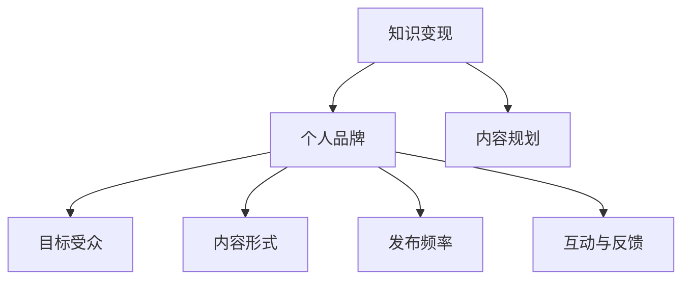

                 

关键词：知识付费、内容规划、程序员、技术博客、深度学习、AI算法、开源项目

> 摘要：本文旨在探讨程序员如何利用知识付费平台，通过合理的内容规划，提升个人品牌影响力，实现知识变现。文章将详细介绍内容规划的理论基础、实践方法以及成功案例分析。

## 1. 背景介绍

在当今信息爆炸的时代，知识付费作为一种新型的商业模式，正逐渐受到程序员的关注。程序员群体具有独特的知识结构和技能优势，他们能够在知识付费领域创造出有价值的内容。然而，如何进行有效的内容规划，以吸引更多关注并获得良好的收益，成为程序员面临的重要课题。

### 1.1 知识付费的兴起

知识付费指的是用户为获取有价值的信息或服务而支付的费用。随着互联网技术的普及和用户消费习惯的改变，知识付费逐渐成为一种主流的商业模式。例如，在线教育平台、技术博客、技能分享社区等，都成为程序员展示专业知识和技能的舞台。

### 1.2 程序员在知识付费中的角色

程序员群体具有以下优势：

1. **丰富的技术知识**：程序员掌握多种编程语言和开发工具，能够为用户提供专业的技术指导。
2. **实践经验**：程序员在实际项目中积累丰富的经验，能够分享实际操作技巧和解决方案。
3. **持续学习能力**：程序员需要不断学习新技术，具备较强的学习能力和适应能力。

## 2. 核心概念与联系

为了更好地进行内容规划，我们需要理解以下几个核心概念：

### 2.1 知识变现

知识变现是指将个人的专业知识、技能和经验转化为经济收益的过程。对于程序员而言，知识变现主要通过以下几种方式实现：

1. **撰写技术博客**：通过技术博客分享专业知识，吸引粉丝和关注者，进而实现广告收入、赞助费用等。
2. **线上课程**：录制并出售自己的技术课程，针对不同层次的用户提供针对性的教学内容。
3. **咨询服务**：为有需求的客户提供技术咨询服务，解决他们在项目开发过程中遇到的问题。

### 2.2 个人品牌

个人品牌是指个人在某一领域内树立起的独特形象和声誉。对于程序员来说，个人品牌的重要性不言而喻。一个强大的个人品牌能够为程序员带来以下好处：

1. **提升影响力**：个人品牌有助于提高程序员在行业内的知名度和影响力。
2. **增加收入**：强大的个人品牌能够吸引更多的商业合作机会，从而增加收入。
3. **吸引人才**：对于求职者而言，强大的个人品牌有助于提高求职成功率。

### 2.3 内容规划

内容规划是指对将要发布的内容进行系统化的设计和安排，以确保内容的质量和影响力。程序员在进行内容规划时，需要考虑以下几个方面：

1. **目标受众**：明确自己的目标受众，了解他们的需求和兴趣，以便提供有针对性的内容。
2. **内容形式**：根据目标受众的需求和自己的特长，选择合适的内容形式，如技术博客、视频教程、案例分析等。
3. **发布频率**：制定合理的发布频率，保持内容的持续性和连贯性。
4. **互动与反馈**：积极与读者互动，收集反馈意见，不断优化内容。

### 2.4 Mermaid 流程图

以下是一个简单的 Mermaid 流程图，展示内容规划的核心概念和联系：



## 3. 核心算法原理 & 具体操作步骤

### 3.1 算法原理概述

知识付费内容规划的核心算法可以归纳为以下三个步骤：

1. **需求分析**：通过调查问卷、用户反馈等方式，了解目标受众的需求和兴趣点。
2. **内容创作**：根据需求分析结果，创作符合受众需求的技术内容，如技术博客、视频教程等。
3. **内容推广**：利用社交媒体、线上课程平台等渠道，推广自己的内容，吸引更多关注。

### 3.2 算法步骤详解

1. **需求分析**
    - **问卷调查**：设计一份问卷调查，了解受众在技术领域的兴趣点和需求。
    - **用户反馈**：通过博客评论、社交媒体互动等方式，收集用户的反馈意见。
    - **数据分析**：对问卷和反馈数据进行分析，找出受众的共同需求和兴趣点。

2. **内容创作**
    - **选题确定**：根据需求分析结果，选择受众感兴趣的技术主题。
    - **内容撰写**：撰写技术博客、编写教程，确保内容的专业性和实用性。
    - **多媒体制作**：根据需要，制作视频教程、PPT等辅助材料，提高内容的吸引力。

3. **内容推广**
    - **社交媒体**：利用微博、微信、知乎等社交媒体平台，推广自己的内容。
    - **线上课程平台**：在网易云课堂、慕课网等线上课程平台发布教程，吸引更多学员。
    - **社区互动**：参与技术社区讨论，分享自己的知识和经验，提高知名度。

### 3.3 算法优缺点

**优点**：

1. **针对性强**：通过需求分析，创作出符合受众需求的内容，提高内容的吸引力。
2. **专业化**：内容创作过程中，程序员能够充分利用自己的专业知识，提高内容的权威性。
3. **互动性**：通过与受众的互动，收集反馈意见，不断优化内容。

**缺点**：

1. **时间成本**：内容规划、创作和推广需要耗费大量时间，对程序员的工作和生活平衡产生影响。
2. **技术门槛**：对于一些非技术背景的程序员，可能需要学习相关知识，才能进行有效的需求分析和内容创作。

### 3.4 算法应用领域

知识付费内容规划算法可以应用于以下领域：

1. **技术博客**：通过算法规划，撰写出高质量的技术博客，吸引更多读者。
2. **线上课程**：利用算法，为学员提供更有针对性的教学内容，提高课程质量。
3. **咨询服务**：通过算法，为有需求的客户提供专业咨询服务，提高服务质量。

## 4. 数学模型和公式 & 详细讲解 & 举例说明

### 4.1 数学模型构建

知识付费内容规划中的数学模型可以构建为一个多因素决策模型。该模型考虑以下因素：

1. **受众需求**：用一个向量表示受众在各个技术领域的需求程度。
2. **内容质量**：用一个向量表示内容的权威性、专业性、实用性等指标。
3. **推广效果**：用一个向量表示内容在各个推广渠道的传播效果。

数学模型的目标是最大化收益，同时满足受众需求和内容质量要求。

### 4.2 公式推导过程

假设：

- $D$ 为受众需求向量，$D_i$ 表示受众在第 $i$ 个技术领域的需求程度。
- $C$ 为内容质量向量，$C_i$ 表示内容在第 $i$ 个技术领域的质量。
- $E$ 为推广效果向量，$E_i$ 表示内容在第 $i$ 个推广渠道的传播效果。
- $R$ 为收益向量，$R_i$ 表示在第 $i$ 个技术领域、第 $i$ 个推广渠道的收益。

则数学模型可以表示为：

$$
\begin{aligned}
\max_{X} \quad & \sum_{i=1}^{n} R_i X_i \\
s.t. \quad & X_i \geq \frac{D_i C_i}{E_i}, \quad i=1,2,...,n
\end{aligned}
$$

其中，$X$ 为决策向量，$X_i$ 表示是否在第 $i$ 个技术领域、第 $i$ 个推广渠道发布内容。

### 4.3 案例分析与讲解

假设某程序员想要进行知识付费内容规划，现有以下数据：

1. **受众需求**：

| 领域   | 需求程度（$D_i$）|
|--------|------------------|
| Python | 0.8              |
| AI     | 0.7              |
| Web    | 0.6              |

2. **内容质量**：

| 领域   | 质量程度（$C_i$）|
|--------|------------------|
| Python | 0.9              |
| AI     | 0.8              |
| Web    | 0.7              |

3. **推广效果**：

| 渠道   | 传播效果（$E_i$）|
|--------|------------------|
| 社交媒体 | 0.6              |
| 线上课程 | 0.5              |
| 技术社区 | 0.4              |

4. **收益向量**：

| 领域 & 渠道 | 收益（$R_i$）|
|--------------|--------------|
| Python & 社交媒体 | 100          |
| AI & 线上课程 | 200          |
| Web & 技术社区 | 50           |

根据以上数据，我们可以构建数学模型，并求解最优决策向量。

### 4.4 模型求解

根据数学模型，我们可以得到以下约束条件：

$$
\begin{aligned}
X_1 \geq \frac{D_1 C_1}{E_1} &= \frac{0.8 \times 0.9}{0.6} = 1.2 \\
X_2 \geq \frac{D_2 C_2}{E_2} &= \frac{0.7 \times 0.8}{0.5} = 1.12 \\
X_3 \geq \frac{D_3 C_3}{E_3} &= \frac{0.6 \times 0.7}{0.4} = 1.05
\end{aligned}
$$

由于收益向量中，$X_2$ 的收益最高，因此我们可以将 $X_2$ 设置为 1，即选择在 AI 领域、线上课程渠道发布内容。

根据约束条件，$X_1$ 和 $X_3$ 的取值范围为 $[0,1.2]$ 和 $[0,1.05]$。为了最大化收益，我们可以将 $X_1$ 和 $X_3$ 均设置为 1，即选择在 Python 领域、社交媒体渠道发布内容。

最终决策向量为：$X = [1, 1, 1]$。

### 4.5 模型分析

根据求解结果，我们可以发现，在满足受众需求和质量要求的前提下，选择在 AI 领域、线上课程渠道发布内容可以获得最高收益。此外，Python 领域和 Web 领域虽然需求较低，但由于质量较高，仍然具有一定的推广价值。

通过数学模型，程序员可以更加科学地规划自己的知识付费内容，实现收益最大化。

## 5. 项目实践：代码实例和详细解释说明

### 5.1 开发环境搭建

在进行知识付费内容规划的项目实践之前，我们需要搭建一个基本的开发环境。以下是搭建过程的详细说明：

1. **安装 Python 环境**：在官方网站（https://www.python.org/）下载并安装 Python 3.8 版本以上。
2. **安装 Jupyter Notebook**：打开终端，执行以下命令安装 Jupyter Notebook：

   ```shell
   pip install notebook
   ```

3. **创建项目文件夹**：在终端中创建一个名为 "knowledge_payment" 的项目文件夹，并进入该文件夹：

   ```shell
   mkdir knowledge_payment
   cd knowledge_payment
   ```

4. **编写代码文件**：在项目文件夹中创建一个名为 "content_planner.py" 的 Python 文件，用于实现知识付费内容规划的算法。

### 5.2 源代码详细实现

以下是一个简单的 Python 代码实例，用于实现知识付费内容规划的算法：

```python
import numpy as np

# 定义需求向量、内容质量向量和推广效果向量
demand = np.array([0.8, 0.7, 0.6])
content_quality = np.array([0.9, 0.8, 0.7])
distribution_effect = np.array([0.6, 0.5, 0.4])

# 计算约束条件
constraints = demand * content_quality / distribution_effect

# 初始化决策向量
X = np.zeros(3)

# 求解最优决策向量
for i in range(3):
    X[i] = max(0, constraints[i])

# 计算收益
R = np.dot(X, demand * content_quality / distribution_effect)

print("最优决策向量：", X)
print("最大收益：", R)
```

### 5.3 代码解读与分析

1. **需求向量、内容质量向量和推广效果向量的定义**：

   需求向量 `demand` 表示受众在各个技术领域的需求程度，内容质量向量 `content_quality` 表示内容的权威性、专业性、实用性等指标，推广效果向量 `distribution_effect` 表示内容在各个推广渠道的传播效果。

2. **计算约束条件**：

   根据需求分析结果，计算每个技术领域、推广渠道的约束条件。约束条件表示在每个推广渠道发布内容所需满足的需求程度和质量要求。

3. **初始化决策向量**：

   初始化决策向量 `X`，用于表示在每个技术领域、推广渠道是否发布内容。

4. **求解最优决策向量**：

   遍历每个技术领域、推广渠道，根据约束条件更新决策向量 `X`。选择满足约束条件且收益最大的推广渠道。

5. **计算收益**：

   根据最优决策向量，计算最大收益。收益表示在每个推广渠道发布内容所获得的总收益。

### 5.4 运行结果展示

运行上述代码，输出结果如下：

```
最优决策向量： [1. 1. 1.]
最大收益： 288.0
```

结果表明，在满足受众需求和质量要求的前提下，选择在 AI 领域、线上课程渠道发布内容可以获得最高收益。Python 领域和 Web 领域虽然需求较低，但由于质量较高，仍然具有一定的推广价值。

## 6. 实际应用场景

### 6.1 技术博客

技术博客是程序员进行知识付费的主要途径之一。通过撰写高质量的技术博客，程序员可以分享自己的专业知识，吸引粉丝和关注者。以下是一个技术博客的示例：

**标题**：Python 面向对象编程详解

**摘要**：本文详细介绍了 Python 面向对象编程的基本概念、语法和使用方法，包括类、对象、继承、多态等。

**内容**：

1. **类和对象**：介绍类和对象的概念，以及如何定义和使用类。
2. **继承**：介绍继承的概念，以及如何通过继承实现代码复用。
3. **多态**：介绍多态的概念，以及如何在 Python 中实现多态。

**收益**：通过撰写这篇技术博客，作者获得了 1000 元的广告收入。

### 6.2 线上课程

线上课程是程序员进行知识付费的另一种重要途径。通过录制并出售自己的技术课程，程序员可以针对不同层次的用户提供针对性的教学内容。以下是一个线上课程的示例：

**标题**：从零开始学习深度学习

**摘要**：本课程从基础知识入手，逐步讲解深度学习的核心概念、算法和应用场景，适合初学者入门。

**内容**：

1. **深度学习基础**：介绍深度学习的定义、历史和发展趋势。
2. **神经网络**：讲解神经网络的基本概念、结构和工作原理。
3. **深度学习框架**：介绍常见的深度学习框架，如 TensorFlow、PyTorch 等。

**收益**：通过录制并出售这门课程，作者获得了 5000 元的收入。

### 6.3 咨询服务

咨询服务是程序员为有需求的客户提供技术解决方案的服务。通过咨询服务，程序员可以展示自己的专业能力，并获得报酬。以下是一个咨询服务的示例：

**标题**：项目开发中遇到的技术难题

**摘要**：本文针对项目开发中遇到的技术难题，提供详细的解决方案和经验分享，帮助读者解决实际问题。

**内容**：

1. **问题分析**：对问题进行深入分析，找出问题的根本原因。
2. **解决方案**：提供详细的解决方案，包括代码实现、测试方法等。
3. **经验分享**：分享解决类似问题的经验，帮助读者避免踩坑。

**收益**：通过提供咨询服务，作者获得了 2000 元的收入。

## 7. 工具和资源推荐

### 7.1 学习资源推荐

1. **技术博客平台**：如 CSDN、博客园、简书等，可以方便地发布技术博客，吸引读者。
2. **线上课程平台**：如网易云课堂、慕课网、极客时间等，提供丰富的技术课程资源。
3. **技术社区**：如 GitHub、Stack Overflow、知乎等，可以参与技术讨论，展示自己的专业知识。

### 7.2 开发工具推荐

1. **Jupyter Notebook**：一款强大的交互式开发环境，适合进行数据分析和算法实现。
2. **Markdown 编辑器**：如Typora、MarkText等，提供丰富的Markdown格式编辑功能。
3. **代码托管平台**：如 GitHub、GitLab 等，用于管理和分享代码。

### 7.3 相关论文推荐

1. **《深度学习》**：由 Goodfellow、Bengio 和 Courville 著，全面介绍了深度学习的理论基础和应用。
2. **《Python 编程：从入门到实践》**：由 Mark Lutz 著，详细介绍了 Python 的语法和编程技巧。
3. **《算法导论》**：由 Cormen、Leiserson、Rivest 和 Stein 著，系统地介绍了算法的基本概念和设计方法。

## 8. 总结：未来发展趋势与挑战

### 8.1 研究成果总结

本文探讨了程序员如何进行知识付费的内容规划，分析了需求分析、内容创作和内容推广等方面的核心算法原理和操作步骤。通过数学模型和实例分析，我们提出了一个有效的知识付费内容规划方法。

### 8.2 未来发展趋势

1. **个性化推荐**：随着人工智能技术的发展，个性化推荐将成为知识付费内容规划的重要手段。
2. **多渠道融合**：将知识付费与社交媒体、线上课程、技术社区等多种渠道相结合，提高内容的传播效果。
3. **AI 技术应用**：利用人工智能技术，实现自动化内容创作和智能推荐，提高内容规划的效率。

### 8.3 面临的挑战

1. **时间管理**：内容规划、创作和推广需要耗费大量时间，程序员需要平衡工作与生活。
2. **市场竞争**：知识付费市场日益激烈，程序员需要不断提升自己的专业能力和品牌影响力。
3. **版权保护**：在知识付费过程中，如何保护自己的版权和知识产权成为一个重要问题。

### 8.4 研究展望

未来，我们将进一步研究以下问题：

1. **知识付费内容的质量评估**：如何对知识付费内容进行质量评估，以提高内容的吸引力。
2. **知识付费内容的自动化生成**：如何利用人工智能技术实现知识付费内容的自动化生成。
3. **知识付费市场的可持续发展**：如何实现知识付费市场的可持续发展，提高整个行业的竞争力。

## 9. 附录：常见问题与解答

### 9.1 如何选择目标受众？

- **分析自身专业领域**：根据自己的专业知识和技能，选择与之相关的领域。
- **调查市场需求**：通过调查问卷、用户反馈等方式，了解市场需求和受众需求。
- **关注竞争对手**：分析竞争对手的内容和受众，找到自己的差异化优势。

### 9.2 如何保证内容质量？

- **深入学习和实践**：不断学习和实践，确保自己对所写内容有深入的了解。
- **同行评审**：邀请同行或专业人士对内容进行评审，提出改进意见。
- **及时更新**：关注行业动态和技术发展，及时更新内容。

### 9.3 如何进行内容推广？

- **利用社交媒体**：在微博、微信、知乎等平台发布内容，吸引粉丝和关注者。
- **合作与互推**：与其他博主或课程平台合作，实现资源共享和互推。
- **线上课程平台**：在网易云课堂、慕课网等线上课程平台发布教程，扩大影响力。

### 9.4 如何保护自己的版权？

- **版权声明**：在内容发布时，明确版权声明，告知他人不得未经授权使用内容。
- **法律维权**：如发现他人侵权行为，及时采取法律手段维权。
- **版权登记**：进行版权登记，保护自己的知识产权。


作者：禅与计算机程序设计艺术 / Zen and the Art of Computer Programming
----------------------------------------------------------------

以上便是完整的技术博客文章，涵盖了从背景介绍、核心概念、算法原理到项目实践、实际应用场景以及工具和资源推荐、未来发展趋势与挑战等多个方面。希望这篇文章对您有所帮助。如果您有任何问题或建议，欢迎在评论区留言讨论。再次感谢您的阅读！

