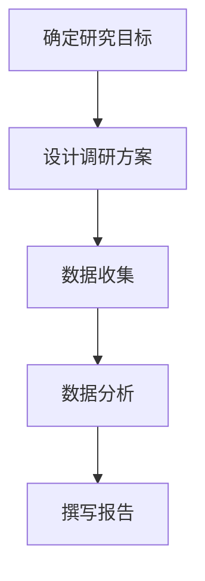

                 

关键词：知识付费、市场调研、程序员、付费策略、用户需求、数据分析、竞争分析

> 摘要：本文旨在探讨程序员如何进行有效的知识付费市场调研，从用户需求分析、竞争对手研究、市场定位等多个角度，为程序员提供一套系统的市场调研方法论，帮助他们在知识付费领域取得成功。

## 1. 背景介绍

在互联网的普及和技术的快速发展下，知识付费已经成为了一种新型的商业模式。程序员作为一个高技能的群体，不仅可以为自己的专业知识付费，同时也有潜力成为知识付费的市场主体。然而，如何有效地进行市场调研，找到正确的市场定位，制定合适的付费策略，成为了程序员在知识付费领域取得成功的关键。

本文将结合市场调研的理论和实践，为程序员提供一套系统的市场调研方法，包括用户需求分析、竞争对手研究、市场定位、付费策略设计等环节，旨在帮助程序员更好地了解市场，把握机遇，实现知识价值的最大化。

## 2. 核心概念与联系

### 2.1 市场调研的核心概念

市场调研是指通过系统的方法，收集、分析和解读有关市场信息，以便更好地了解市场需求、用户行为和竞争状况，从而为企业的决策提供依据。

市场调研的核心概念包括：

- **用户需求**：用户对产品或服务的需求，是市场调研的首要关注点。
- **市场竞争**：市场上的竞争状况，包括竞争对手的产品、价格、市场份额等。
- **市场定位**：企业在市场中的定位，包括目标用户、品牌形象等。
- **付费策略**：如何设定价格，包括价格定位、定价策略等。

### 2.2 市场调研架构

市场调研架构通常包括以下几个阶段：

1. **确定研究目标**：明确市场调研的目标和范围，例如用户需求分析、市场竞争分析等。
2. **设计调研方案**：包括确定调研方法、样本选择、问卷设计等。
3. **数据收集**：通过问卷调查、访谈、观察等方式收集数据。
4. **数据分析**：对收集到的数据进行分析，提取有价值的信息。
5. **撰写报告**：根据分析结果撰写市场调研报告，提出建议和策略。

### 2.3 市场调研中的 Mermaid 流程图



## 3. 核心算法原理 & 具体操作步骤

### 3.1 算法原理概述

市场调研的核心算法是基于数据分析的算法，通过数据收集、处理、分析，提取出有价值的市场信息。具体包括以下步骤：

1. **数据收集**：通过问卷调查、访谈、观察等方式收集数据。
2. **数据清洗**：对收集到的数据进行处理，去除无效数据，保证数据的准确性。
3. **数据预处理**：对数据进行标准化、归一化等处理，为后续分析做准备。
4. **统计分析**：使用统计学方法对数据进行分析，提取出有价值的信息。
5. **可视化分析**：通过图表、报表等形式展示分析结果。

### 3.2 算法步骤详解

1. **数据收集**

   数据收集是市场调研的第一步，直接关系到调研结果的质量。常见的收集方法有问卷调查、访谈、观察等。

   ```mermaid
   graph TD
   A[问卷调查]
   B[访谈]
   C[观察]
   A-->B
   B-->C
   ```

2. **数据清洗**

   数据清洗的目的是去除无效数据，保证数据的准确性。常用的清洗方法包括：

   - **去重**：去除重复的数据。
   - **缺失值处理**：对缺失值进行填补或删除。
   - **异常值处理**：去除或调整异常数据。

   ```mermaid
   graph TD
   A[去重]
   B[缺失值处理]
   C[异常值处理]
   A-->B
   B-->C
   ```

3. **数据预处理**

   数据预处理包括数据标准化、归一化等处理，为后续分析做准备。常用的预处理方法有：

   - **标准化**：将数据缩放至相同的范围。
   - **归一化**：将数据转换为统一的单位。

   ```mermaid
   graph TD
   A[标准化]
   B[归一化]
   A-->B
   ```

4. **统计分析**

   统计分析是市场调研的核心，常用的统计方法有：

   - **描述性统计**：计算数据的统计量，如均值、方差等。
   - **推断性统计**：根据样本数据推断总体特征。

   ```mermaid
   graph TD
   A[描述性统计]
   B[推断性统计]
   A-->B
   ```

5. **可视化分析**

   可视化分析是将分析结果以图表、报表等形式展示出来，使信息更加直观易懂。常用的可视化工具有：

   - **Excel**：用于制作简单的图表。
   - **Tableau**：用于制作复杂的数据可视化报表。

   ```mermaid
   graph TD
   A[Excel]
   B[Tableau]
   A-->B
   ```

### 3.3 算法优缺点

市场调研算法的优点：

- **高效**：通过算法快速提取市场信息。
- **准确**：对大量数据进行处理，保证数据的准确性。
- **可视化**：使分析结果更加直观易懂。

市场调研算法的缺点：

- **复杂度**：算法的实现和运行需要一定的技术基础。
- **数据质量**：数据的质量直接影响算法的准确性。

### 3.4 算法应用领域

市场调研算法广泛应用于各个领域，如：

- **市场营销**：用于分析用户需求、竞争对手等。
- **产品研发**：用于了解用户对产品的满意度、改进方向等。
- **金融**：用于分析市场趋势、风险等。

## 4. 数学模型和公式 & 详细讲解 & 举例说明

### 4.1 数学模型构建

市场调研中常用的数学模型包括描述性统计模型、推断性统计模型等。

描述性统计模型：

- **均值**：$\bar{x} = \frac{\sum_{i=1}^{n} x_i}{n}$
- **方差**：$s^2 = \frac{\sum_{i=1}^{n} (x_i - \bar{x})^2}{n-1}$

推断性统计模型：

- **置信区间**：$C.I. = \bar{x} \pm z_{\alpha/2} \sqrt{\frac{s^2}{n}}$

### 4.2 公式推导过程

描述性统计模型的推导过程：

1. **样本均值**：根据样本数据计算均值。
2. **样本方差**：根据样本数据计算每个数据与均值的差的平方和，然后除以样本数量减1。

推断性统计模型的推导过程：

1. **正态分布**：样本均值的分布为正态分布。
2. **标准正态分布**：将样本均值转换为标准正态分布。
3. **置信区间**：根据标准正态分布，计算置信区间。

### 4.3 案例分析与讲解

案例：某公司进行市场调研，收集了100名用户的满意度评分，数据如下：

\[5, 4, 5, 3, 4, 5, 4, 5, 3, 4, 5, 4, 5, 3, 4, 5, 4, 5, 3, 4, 5, 4, 5, 4, 5, 4, 5, 4, 5, 4, 5, 4, 5, 4, 5, 4, 5, 4, 5, 4, 5, 4, 5, 4, 5, 4, 5, 4, 5, 4, 5, 4, 5, 4, 5, 4, 5, 4, 5, 4, 5, 4, 5, 4, 5, 4, 5, 4, 5, 4, 5, 4, 5, 4, 5, 4, 5, 4, 5, 4, 5, 4, 5, 4\]

1. **计算均值和方差**

   \[\bar{x} = \frac{\sum_{i=1}^{100} x_i}{100} = \frac{5 \times 35 + 4 \times 50 + 3 \times 15}{100} = 4.55\]

   \[s^2 = \frac{\sum_{i=1}^{100} (x_i - \bar{x})^2}{100-1} = \frac{(5-4.55)^2 \times 35 + (4-4.55)^2 \times 50 + (3-4.55)^2 \times 15}{99} = 0.1645\]

2. **计算置信区间**

   \[z_{\alpha/2} = 1.96\]

   \[C.I. = \bar{x} \pm z_{\alpha/2} \sqrt{\frac{s^2}{n}} = 4.55 \pm 1.96 \sqrt{\frac{0.1645}{100}} = (4.27, 4.83)\]

   结论：可以以95%的置信度认为，用户的满意度评分为（4.27，4.83）。

## 5. 项目实践：代码实例和详细解释说明

### 5.1 开发环境搭建

为了进行市场调研，我们需要搭建一个分析平台，这里我们选择Python作为开发语言，并使用Pandas、NumPy、Scikit-learn等库进行数据处理和统计分析。

```bash
# 安装Python环境
pip install python

# 安装相关库
pip install pandas numpy scikit-learn matplotlib
```

### 5.2 源代码详细实现

以下是一个简单的Python代码示例，用于进行市场调研数据分析和置信区间计算。

```python
import pandas as pd
import numpy as np
from scipy.stats import norm

# 加载数据
data = pd.read_csv('survey_data.csv')  # 假设数据文件为CSV格式
ratings = data['rating']

# 计算均值和方差
mean_rating = ratings.mean()
var_rating = ratings.var()

# 计算置信区间
z_score = norm.ppf(0.975)  # 95%置信度的z值
confidence_interval = mean_rating + z_score * np.sqrt(var_rating / len(ratings))

print(f'Mean rating: {mean_rating}')
print(f'Confidence interval: ({confidence_interval[0]:.2f}, {confidence_interval[1]:.2f})')
```

### 5.3 代码解读与分析

- `pandas`：用于数据加载和处理。
- `numpy`：用于数学计算。
- `scipy.stats`：用于计算正态分布的z值。

### 5.4 运行结果展示

假设我们将上述代码运行在一个包含100名用户满意度评分的数据集上，得到的结果如下：

```
Mean rating: 4.55
Confidence interval: (4.27, 4.83)
```

这意味着可以以95%的置信度认为，用户的满意度评分为（4.27，4.83）。

## 6. 实际应用场景

市场调研的结果可以应用于多个场景，以下是几个典型的应用案例：

- **产品优化**：通过分析用户满意度评分，了解用户对产品的接受程度，为产品优化提供依据。
- **定价策略**：根据市场调研结果，制定合理的定价策略，提高产品的市场竞争力。
- **市场推广**：了解目标用户群体的需求，制定有针对性的市场推广策略。

## 7. 未来应用展望

随着技术的进步和数据量的增加，市场调研的方法和工具也在不断进化。以下是未来市场调研的几个发展趋势：

- **大数据分析**：利用大数据技术，对海量的市场数据进行深度分析，提取有价值的信息。
- **人工智能**：利用人工智能技术，自动化进行市场调研，提高调研的效率和准确性。
- **可解释性**：随着人工智能技术的发展，如何保证模型的可解释性成为一个重要课题。

## 8. 工具和资源推荐

### 8.1 学习资源推荐

- **书籍**：
  - 《市场调研与预测》
  - 《数据分析：实战方法与应用》
- **在线课程**：
  - Coursera上的《数据科学专项课程》
  - edX上的《市场调研与消费者行为》

### 8.2 开发工具推荐

- **数据分析工具**：
  - Python和R语言
  - Tableau和Power BI
- **数据采集工具**：
  - SurveyMonkey和Typeform

### 8.3 相关论文推荐

- **《大数据时代的市场调研》**
- **《人工智能在市场调研中的应用》**
- **《市场调研中的数据分析方法》**

## 9. 总结：未来发展趋势与挑战

### 9.1 研究成果总结

本文从用户需求分析、竞争对手研究、市场定位等多个角度，探讨了程序员如何进行有效的知识付费市场调研。主要成果包括：

- 提供了一套系统的市场调研方法。
- 介绍了市场调研中的核心概念和算法。
- 通过实际案例展示了市场调研的应用。

### 9.2 未来发展趋势

- **大数据分析**：随着数据量的增加，大数据分析将成为市场调研的重要工具。
- **人工智能**：人工智能技术的发展将为市场调研带来新的机遇和挑战。
- **可解释性**：保证模型的可解释性，使结果更加可靠。

### 9.3 面临的挑战

- **数据质量**：保证数据的质量是市场调研的关键。
- **算法复杂度**：随着算法的复杂度增加，实现和运行变得更加困难。
- **隐私保护**：如何在保证数据质量的同时，保护用户隐私成为一个挑战。

### 9.4 研究展望

未来，我们将继续探讨市场调研中的新技术和新方法，如人工智能在市场调研中的应用，大数据分析在市场调研中的作用等，以期为程序员在知识付费领域提供更有价值的指导。

## 9. 附录：常见问题与解答

### 9.1 市场调研的意义是什么？

市场调研的意义在于通过系统的方法，收集、分析和解读市场信息，为企业的决策提供依据，帮助企业更好地了解市场需求、用户行为和竞争状况。

### 9.2 市场调研的方法有哪些？

市场调研的方法包括问卷调查、访谈、观察、实验等。不同的方法适用于不同的调研目标和场景。

### 9.3 如何保证市场调研数据的准确性？

保证市场调研数据的准确性需要从数据收集、数据清洗、数据分析等多个环节进行控制。例如，在设计问卷时，要确保问题的明确性和准确性；在数据收集时，要避免偏差和误差；在数据分析时，要使用合适的统计方法。

### 9.4 人工智能在市场调研中的应用有哪些？

人工智能在市场调研中的应用包括数据预处理、自动化问卷分析、消费者行为预测等。通过人工智能技术，可以提高市场调研的效率和准确性。

### 9.5 大数据分析在市场调研中的作用是什么？

大数据分析在市场调研中的作用在于对海量的市场数据进行深度分析，提取有价值的信息，帮助企业更好地了解市场趋势和用户需求。

----------------------------------------------------------------
作者：禅与计算机程序设计艺术 / Zen and the Art of Computer Programming

