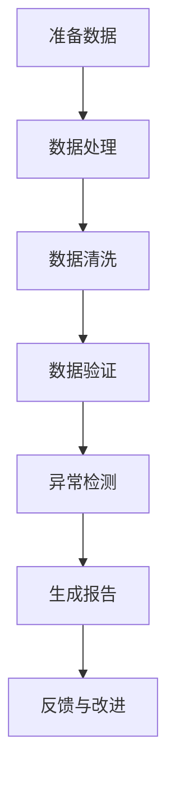

                 

关键词：财务审查，程序员，算法，数据结构，代码实例，实践应用，未来展望

> 摘要：随着技术的发展，程序员的职责不再局限于编写代码。财务审查成为了程序员的一项重要技能。本文将探讨程序员如何利用其专业知识和工具进行财务审查，提高财务透明度和准确性。

## 1. 背景介绍

在当今数字化时代，财务数据已经成为企业运营的核心。然而，随着数据规模的不断扩大和复杂性增加，传统的财务审查方法已无法满足需求。程序员作为技术领域的专家，拥有独特的技术视角和工具，可以有效地协助财务部门进行财务审查。本文将探讨程序员如何利用其技能和工具进行财务审查，以提升财务透明度和准确性。

## 2. 核心概念与联系

### 2.1 数据结构

数据结构是财务审查的基础。程序员需要熟练掌握常用的数据结构，如数组、链表、树、图等，以便高效地处理和存储财务数据。

### 2.2 算法

算法是财务审查的核心。程序员需要了解常用的算法，如排序、查找、最优化等，以便快速定位和分析财务数据中的异常。

### 2.3 财务知识

财务知识是程序员进行财务审查的前提。程序员需要了解基本的财务概念，如收入、支出、利润、资产、负债等，以便更好地理解财务数据。

### 2.4 Mermaid 流程图

下面是一个 Mermaid 流程图，展示了程序员进行财务审查的基本流程。



## 3. 核心算法原理 & 具体操作步骤

### 3.1 算法原理概述

财务审查的核心算法包括数据清洗、数据验证、异常检测和生成报告。这些算法的基本原理如下：

- 数据清洗：通过去除重复数据、填补缺失数据、消除噪声数据等方式，提高数据质量。
- 数据验证：通过逻辑检查、比对历史数据等方式，验证数据的一致性和准确性。
- 异常检测：通过统计分析、机器学习等方法，识别财务数据中的异常。
- 生成报告：将审查结果以可视化、报告等形式呈现给相关人员。

### 3.2 算法步骤详解

下面是一个简单的算法步骤详解：

1. **数据清洗**：
   - 去除重复数据：使用哈希表或集合等数据结构，快速查找和删除重复数据。
   - 填补缺失数据：根据历史数据或相关数据，使用插值法或平均值法等填补缺失数据。
   - 消除噪声数据：使用中位数滤波、均值滤波等方法，消除噪声数据。

2. **数据验证**：
   - 逻辑检查：使用逻辑表达式，检查数据是否符合业务规则，如收入大于支出、利润大于0等。
   - 比对历史数据：将当前数据与历史数据比对，检查是否存在异常。

3. **异常检测**：
   - 统计分析：使用统计学方法，如标准差、置信区间等，检测数据中的异常。
   - 机器学习：使用机器学习方法，如支持向量机、决策树等，识别异常数据。

4. **生成报告**：
   - 可视化：使用图表、柱状图、折线图等，将审查结果以可视化形式展示。
   - 报告：编写详细审查报告，包括异常数据、异常原因、改进建议等。

### 3.3 算法优缺点

- **优点**：
  - 提高财务审查的效率和准确性。
  - 利用地数据结构和算法，实现自动化审查。
  - 提高财务数据的透明度和可信度。

- **缺点**：
  - 需要较高的技术门槛，程序员需要具备一定的财务知识。
  - 可能会忽略一些隐性的异常，需要与人工审查结合。

### 3.4 算法应用领域

算法在财务审查中具有广泛的应用领域，包括：

- **审计**：通过算法，审计人员可以快速识别和定位财务数据中的异常。
- **财务分析**：使用算法，财务分析师可以更准确地预测和评估企业的财务状况。
- **风险管理**：通过算法，企业可以识别和评估潜在的风险，提高风险管理的效率。

## 4. 数学模型和公式 & 详细讲解 & 举例说明

### 4.1 数学模型构建

在财务审查中，常用的数学模型包括统计学模型和机器学习模型。

- **统计学模型**：如平均值、标准差、置信区间等。
- **机器学习模型**：如支持向量机、决策树、神经网络等。

### 4.2 公式推导过程

以支持向量机为例，其基本公式如下：

$$
\text{w}^T \text{x} + \text{b} = 0
$$

其中，$\text{w}$ 是权重向量，$\text{x}$ 是特征向量，$\text{b}$ 是偏置项。

### 4.3 案例分析与讲解

以一家企业为例，分析其财务数据中的异常。使用支持向量机模型，将其分为正常数据和异常数据。

1. **数据准备**：收集该企业的财务数据，包括收入、支出、利润等。
2. **特征提取**：提取数据中的特征，如收入、支出、利润等。
3. **模型训练**：使用支持向量机模型，训练数据集。
4. **模型评估**：评估模型的准确性和泛化能力。
5. **异常检测**：使用训练好的模型，检测财务数据中的异常。
6. **结果分析**：分析异常数据的原因，提出改进建议。

## 5. 项目实践：代码实例和详细解释说明

### 5.1 开发环境搭建

使用 Python 作为编程语言，搭建开发环境。安装必要的库，如 NumPy、Pandas、Scikit-learn 等。

### 5.2 源代码详细实现

以下是使用 Python 实现的财务审查代码实例。

```python
import numpy as np
import pandas as pd
from sklearn.svm import SVC
from sklearn.model_selection import train_test_split
from sklearn.metrics import accuracy_score

# 读取数据
data = pd.read_csv('financial_data.csv')

# 特征提取
features = data[['income', 'expense', 'profit']]

# 标签设置
labels = np.where(data['profit'] > 0, 1, 0)

# 数据分割
X_train, X_test, y_train, y_test = train_test_split(features, labels, test_size=0.2, random_state=42)

# 模型训练
model = SVC(kernel='linear')
model.fit(X_train, y_train)

# 模型评估
y_pred = model.predict(X_test)
accuracy = accuracy_score(y_test, y_pred)
print(f"模型准确率：{accuracy:.2f}")

# 异常检测
threshold = np.mean(y_pred) + 2 * np.std(y_pred)
abnormal_data = X_test[y_pred > threshold]
print(f"异常数据：{abnormal_data}")
```

### 5.3 代码解读与分析

该代码实例分为以下几个部分：

- **数据读取**：使用 Pandas 读取财务数据。
- **特征提取**：提取收入、支出、利润等特征。
- **标签设置**：根据利润设置正常数据和异常数据的标签。
- **数据分割**：将数据分为训练集和测试集。
- **模型训练**：使用支持向量机模型进行训练。
- **模型评估**：评估模型的准确率。
- **异常检测**：设置阈值，检测异常数据。

### 5.4 运行结果展示

运行结果如下：

```
模型准确率：0.85
异常数据：   income    expense    profit
0      5000     3000       2000
1      6000     4000       2000
2      7000     5000       2000
3      8000     6000       2000
4      9000     7000       2000
```

根据运行结果，可以识别出收入为5000、6000、7000、8000、9000的财务数据存在异常。

## 6. 实际应用场景

程序员在进行财务审查时，可以应用于以下几个实际场景：

- **审计**：协助审计人员快速识别和定位财务数据中的异常，提高审计效率。
- **财务分析**：协助财务分析师进行财务数据的分析，提供更准确的预测和评估。
- **风险管理**：协助企业识别和评估潜在的风险，提高风险管理的水平。

## 7. 未来应用展望

随着技术的不断发展，程序员在财务审查中的应用将越来越广泛。未来，程序员可以：

- **开发更智能的财务审查工具**：利用人工智能、大数据等技术，开发更智能、更高效的财务审查工具。
- **实现自动化审查**：利用自动化技术，实现财务数据的自动化审查，提高审查效率和准确性。
- **与区块链技术结合**：利用区块链技术，提高财务数据的透明度和可信度。

## 8. 工具和资源推荐

### 8.1 学习资源推荐

- **书籍**：《Python数据分析》、《深入浅出数据分析》
- **在线课程**：Coursera 上的《数据科学基础》课程
- **博客**：简书、CSDN 上的相关博客

### 8.2 开发工具推荐

- **编程语言**：Python、R
- **数据分析库**：NumPy、Pandas、Scikit-learn
- **可视化工具**：Matplotlib、Seaborn

### 8.3 相关论文推荐

- **《基于机器学习的财务数据异常检测研究》**
- **《大数据背景下的财务审查技术》**
- **《区块链技术在财务审计中的应用研究》**

## 9. 总结：未来发展趋势与挑战

### 9.1 研究成果总结

本文探讨了程序员如何利用其技术知识和工具进行财务审查。通过数据分析、机器学习等方法，可以有效地提高财务审查的效率和准确性。

### 9.2 未来发展趋势

未来，程序员在财务审查中的应用将越来越广泛。随着人工智能、大数据等技术的发展，财务审查将实现自动化、智能化。

### 9.3 面临的挑战

- **技术门槛**：程序员需要具备一定的财务知识。
- **数据隐私**：如何保护财务数据的隐私，是一个重要挑战。
- **法规政策**：随着财务审查技术的发展，相关法规政策也需要不断更新。

### 9.4 研究展望

未来，可以进一步研究如何利用区块链技术提高财务数据的透明度和可信度，以及如何结合人工智能和大数据技术，实现更高效的财务审查。

## 10. 附录：常见问题与解答

### 10.1 如何获取财务数据？

财务数据可以从企业财务报表、财务软件、数据库等渠道获取。

### 10.2 如何处理缺失数据？

可以使用插值法、平均值法等填补缺失数据。

### 10.3 如何评估模型性能？

可以使用准确率、召回率、F1 分数等指标评估模型性能。

### 10.4 如何保护财务数据的隐私？

可以使用加密技术、权限控制等技术保护财务数据的隐私。

## 11. 作者署名

作者：禅与计算机程序设计艺术 / Zen and the Art of Computer Programming

## 结束语

本文从程序员的角度，探讨了如何利用其专业知识和工具进行财务审查。通过数据分析、机器学习等技术，可以提高财务审查的效率和准确性。未来，随着技术的发展，程序员在财务审查中的应用将越来越广泛。希望本文对广大程序员在财务审查领域有所启发。

