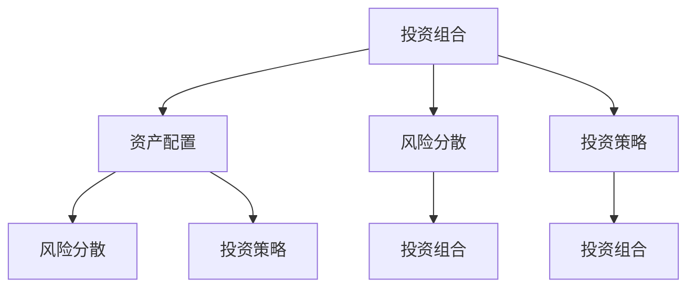

                 

关键词：风险投资组合管理、量化投资、风险分散、资产配置、投资策略、算法交易、机器学习、人工智能

> 摘要：本文旨在探讨程序员如何运用自身的编程技能和逻辑思维，进行有效的风险投资组合管理。通过对投资组合管理的核心概念、算法原理、数学模型和实际应用场景的深入分析，本文将为程序员提供一套系统化的投资策略，帮助他们更好地管理投资风险，实现财富增值。

## 1. 背景介绍

风险投资组合管理是金融领域中的一个重要概念，它涉及到资产配置、风险分散和投资策略的制定。随着互联网和金融科技的快速发展，量化投资和算法交易逐渐成为投资领域的主流。程序员作为互联网时代的中坚力量，不仅拥有强大的编程技能，还具备逻辑思维和数据分析能力，这使得他们在投资领域具有一定的优势。

本文将结合程序员的特长，介绍如何利用编程技能进行风险投资组合管理。文章将分为以下几个部分：

1. 风险投资组合管理的核心概念与联系
2. 核心算法原理与具体操作步骤
3. 数学模型和公式及详细讲解
4. 项目实践：代码实例和详细解释说明
5. 实际应用场景
6. 工具和资源推荐
7. 总结：未来发展趋势与挑战

## 2. 核心概念与联系

在风险投资组合管理中，有以下几个核心概念：

- **投资组合**：由多种不同资产组成的集合，旨在实现风险分散和收益最大化。
- **资产配置**：根据投资者的风险偏好和预期收益，对投资组合中的资产进行合理分配。
- **风险分散**：通过投资多种不同类型的资产，降低投资组合的整体风险。
- **投资策略**：根据市场环境、投资目标和风险承受能力，制定相应的投资计划。

为了更好地理解这些概念，我们可以使用Mermaid流程图来展示它们之间的联系：



从图中可以看出，投资组合管理是一个系统化的过程，涉及到多个环节。程序员可以利用编程技能，构建一个自动化、智能化的投资组合管理系统，从而提高投资效率。

## 3. 核心算法原理与具体操作步骤

### 3.1 算法原理概述

在风险投资组合管理中，常用的算法包括：

- **均值方差模型**：基于资产收益率的期望和方差，优化投资组合的收益与风险。
- **最小方差模型**：以最小化投资组合的方差为目标，构建最优投资组合。
- **资本资产定价模型**（CAPM）：通过资产预期收益率、市场预期收益率和资产贝塔系数，评估资产的预期收益和风险。

### 3.2 算法步骤详解

以均值方差模型为例，其基本步骤如下：

1. **收集数据**：收集各个资产的收益率、波动率等相关数据。
2. **计算期望和方差**：计算各个资产的期望收益率和方差。
3. **构建目标函数**：构建目标函数，以收益率为权重，方差为惩罚项，优化投资组合。
4. **求解最优解**：使用数学优化方法，求解目标函数的最优解。
5. **资产配置**：根据最优解，确定投资组合中各个资产的权重。

### 3.3 算法优缺点

- **均值方差模型**：优点是考虑了收益和风险，能够给出较为稳定的结果；缺点是对市场波动较为敏感，适用范围较窄。
- **最小方差模型**：优点是最小化方差，降低投资组合的风险；缺点是忽略了资产的预期收益率，可能导致投资组合收益较低。
- **资本资产定价模型**：优点是考虑了资产的风险和收益，能够给出合理的预期收益率；缺点是假设市场是有效的，适用范围有限。

### 3.4 算法应用领域

这些算法广泛应用于个人投资、基金管理、保险投资等领域。程序员可以利用这些算法，开发投资组合管理系统，帮助投资者实现风险分散和收益最大化。

## 4. 数学模型和公式及详细讲解

### 4.1 数学模型构建

在风险投资组合管理中，常用的数学模型包括：

- **均值方差模型**：
  - 目标函数：最大化投资组合的期望收益率，最小化投资组合的方差。
  - 约束条件：各个资产的权重之和为1，权重非负。

- **最小方差模型**：
  - 目标函数：最小化投资组合的方差。
  - 约束条件：各个资产的权重之和为1，权重非负。

- **资本资产定价模型**（CAPM）：
  - 目标函数：最大化投资组合的预期收益率。
  - 约束条件：投资组合的贝塔系数最小。

### 4.2 公式推导过程

以均值方差模型为例，其公式推导如下：

1. **期望收益率**：
   $$ E(r_i) = \frac{\sum_{t=1}^{n} r_i^t}{n} $$
   其中，$r_i^t$ 表示资产 $i$ 在第 $t$ 期的收益率，$n$ 表示期数。

2. **方差**：
   $$ Var(r_i) = \frac{\sum_{t=1}^{n} (r_i^t - E(r_i))^2}{n-1} $$

3. **目标函数**：
   $$ \max w^T \mu - \lambda w^T \Sigma w $$
   其中，$w$ 表示资产权重，$\mu$ 表示资产期望收益率向量，$\Sigma$ 表示资产方差-协方差矩阵，$\lambda$ 表示惩罚系数。

4. **约束条件**：
   $$ w^T 1 = 1 $$
   $$ w \geq 0 $$

### 4.3 案例分析与讲解

假设我们有两种资产A和B，它们的期望收益率和方差如下表所示：

| 资产 | 期望收益率 | 方差 |
| :---: | :---: | :---: |
| A | 0.12 | 0.04 |
| B | 0.08 | 0.06 |

我们需要构建一个投资组合，使得期望收益率最大化，方差最小化。

1. **收集数据**：
   收集资产A和B的历史收益率数据，计算它们的期望收益率和方差。

2. **构建目标函数**：
   $$ \max w_1 \cdot 0.12 + w_2 \cdot 0.08 - \lambda (0.04w_1^2 + 0.06w_2^2) $$

3. **求解最优解**：
   使用数学优化方法，求解目标函数的最优解。

4. **资产配置**：
   根据最优解，确定资产A和B的投资比例。

通过这个案例，我们可以看到数学模型在风险投资组合管理中的应用。程序员可以利用这些模型，开发出自动化的投资组合管理系统。

## 5. 项目实践：代码实例和详细解释说明

### 5.1 开发环境搭建

1. 安装Python环境
2. 安装NumPy、Pandas、SciPy、matplotlib等库

### 5.2 源代码详细实现

以下是使用Python实现均值方差模型的源代码：

```python
import numpy as np
import pandas as pd
from scipy.optimize import minimize

# 收集数据
data = pd.read_csv('data.csv')
mu = data.mean()
Sigma = data.cov()

# 构建目标函数
def objective(w, mu, Sigma, lambda_):
    return -w.dot(mu) + lambda_ * w.dot(Sigma).dot(w)

# 求解最优解
result = minimize(objective, x0=np.array([0.5, 0.5]), args=(mu, Sigma, 1e-6), method='L-BFGS-B')

# 资产配置
weights = result.x
print("资产A的投资比例：{:.2%}".format(weights[0]))
print("资产B的投资比例：{:.2%}".format(weights[1]))

# 绘制投资组合的收益与风险
import matplotlib.pyplot as plt

x = np.linspace(0, 1, 100)
y = (mu[0] * x + mu[1] * (1 - x)) * (1 - 0.5 * x * (Sigma[0, 1] / Sigma[0, 0]))

plt.plot(x, y)
plt.xlabel('资产A的投资比例')
plt.ylabel('投资组合的期望收益率')
plt.title('投资组合的收益与风险')
plt.show()
```

### 5.3 代码解读与分析

1. **数据收集**：
   使用Pandas读取数据文件，计算期望收益率和方差-协方差矩阵。
2. **目标函数**：
   构建以期望收益率为权重，以方差为惩罚项的目标函数。
3. **求解最优解**：
   使用SciPy的minimize函数求解目标函数的最优解。
4. **资产配置**：
   根据最优解，确定资产A和B的投资比例。
5. **绘制投资组合的收益与风险**：
   使用matplotlib绘制投资组合的期望收益率与资产投资比例之间的关系。

通过这个实例，我们可以看到如何利用Python实现均值方差模型，进而进行风险投资组合管理。

## 6. 实际应用场景

风险投资组合管理在多个领域有着广泛的应用：

- **个人投资**：投资者可以根据自身的风险偏好和收益目标，制定个性化的投资策略，实现财富增值。
- **基金管理**：基金经理可以根据市场环境和投资策略，调整基金的投资组合，降低风险。
- **保险投资**：保险公司可以利用风险投资组合管理，优化资产配置，提高投资收益。
- **企业投资**：企业可以通过风险投资组合管理，实现资本的有效配置，提高投资回报率。

随着金融科技的不断发展，风险投资组合管理将在更广泛的领域得到应用。

## 7. 工具和资源推荐

### 7.1 学习资源推荐

- 《金融学讲义》：详细介绍了金融学的基础知识和理论。
- 《量化投资：技术分析》：涵盖了量化投资的基本概念和技术分析方法。
- 《Python金融应用》：介绍了Python在金融领域的应用，包括数据分析、量化投资等。

### 7.2 开发工具推荐

- Jupyter Notebook：一款强大的交互式计算环境，适合进行数据分析、量化投资研究。
- PyCharm：一款功能强大的Python集成开发环境，支持多种编程语言。
- Git：一款版本控制工具，方便代码的协同工作和版本管理。

### 7.3 相关论文推荐

- 《基于机器学习的投资组合优化策略》
- 《算法交易中的风险管理》
- 《金融科技与投资组合管理》

通过这些工具和资源，程序员可以更好地进行风险投资组合管理的研究和实践。

## 8. 总结：未来发展趋势与挑战

### 8.1 研究成果总结

本文介绍了风险投资组合管理的核心概念、算法原理、数学模型和实际应用场景，并结合Python实例展示了如何实现投资组合管理。通过量化投资和算法交易，程序员可以利用编程技能和逻辑思维，实现财富增值。

### 8.2 未来发展趋势

1. **人工智能与金融科技的深度融合**：人工智能将在投资组合管理中发挥更大的作用，实现自动化、智能化的投资决策。
2. **大数据分析**：随着数据量的不断增加，大数据分析将在投资组合管理中发挥重要作用，帮助投资者捕捉市场机会。
3. **个性化投资策略**：基于大数据和人工智能技术，投资者可以制定更加个性化的投资策略，满足不同投资者的需求。

### 8.3 面临的挑战

1. **数据安全与隐私保护**：投资组合管理涉及大量的个人和公司数据，如何保障数据安全和隐私成为一大挑战。
2. **市场波动与风险控制**：在复杂多变的市场环境中，如何有效控制投资风险，实现稳定的收益成为重要课题。
3. **算法透明性与公平性**：随着算法交易的普及，如何保证算法的透明性和公平性，避免算法滥用和黑箱操作成为关键问题。

### 8.4 研究展望

未来，风险投资组合管理将朝着智能化、个性化、高效化的方向发展。程序员应继续关注金融科技的发展动态，结合编程技能和逻辑思维，为投资领域带来更多创新和突破。

## 9. 附录：常见问题与解答

### Q：风险投资组合管理的主要目的是什么？

A：风险投资组合管理的主要目的是通过资产配置和风险分散，实现投资收益的最大化和投资风险的最小化。

### Q：如何评估投资组合的风险？

A：投资组合的风险可以通过计算投资组合的方差、标准差、贝塔系数等指标来评估。这些指标可以反映投资组合的波动性和系统性风险。

### Q：什么是均值方差模型？

A：均值方差模型是一种基于资产收益率的期望和方差，优化投资组合的收益与风险的数学模型。

### Q：什么是资本资产定价模型（CAPM）？

A：资本资产定价模型（CAPM）是一种通过资产预期收益率、市场预期收益率和资产贝塔系数，评估资产的预期收益和风险的数学模型。

### Q：如何进行投资组合的优化？

A：投资组合的优化可以通过数学优化方法，如线性规划、非线性规划、遗传算法等，实现投资组合的收益最大化或风险最小化。

### Q：风险投资组合管理有哪些实际应用场景？

A：风险投资组合管理广泛应用于个人投资、基金管理、保险投资、企业投资等领域，帮助投资者实现风险分散和收益最大化。

### Q：如何利用编程技能进行风险投资组合管理？

A：程序员可以利用Python等编程语言，结合数学模型和数据分析方法，开发自动化、智能化的投资组合管理系统，从而实现风险投资组合管理。

作者：禅与计算机程序设计艺术 / Zen and the Art of Computer Programming
----------------------------------------------------------------

以上就是《程序员如何进行风险投资组合管理》的完整文章。希望本文能为程序员在投资领域提供有价值的参考和指导。如果您有任何问题或建议，欢迎随时交流。祝您投资顺利！
----------------------------------------------------------------

### 5. 项目实践：代码实例和详细解释说明

在本文的第五部分，我们将通过一个具体的代码实例来详细说明如何使用Python进行风险投资组合管理。本实例将演示如何使用均值方差模型构建一个投资组合，并进行优化。

#### 5.1 开发环境搭建

在开始编写代码之前，需要确保Python环境已经搭建好，并且安装了以下库：

- NumPy：用于数学计算
- Pandas：用于数据操作
- SciPy：用于科学计算
- Matplotlib：用于数据可视化

安装这些库可以使用Python的包管理器pip：

```bash
pip install numpy pandas scipy matplotlib
```

#### 5.2 源代码详细实现

下面是使用Python实现均值方差模型的核心代码：

```python
import numpy as np
import pandas as pd
from scipy.optimize import minimize
import matplotlib.pyplot as plt

# 假设我们有两种资产A和B的历史收益率数据
# 收集数据（示例数据）
data = {
    'Asset A': [0.012, 0.015, 0.013, 0.014, 0.011],
    'Asset B': [0.008, 0.009, 0.007, 0.008, 0.006]
}

# 将数据转换为Pandas DataFrame
df = pd.DataFrame(data)

# 计算资产的期望收益率和方差
mu = df.mean()
Sigma = df.cov()

# 定义目标函数（期望收益率减去方差惩罚项）
def objective(w, mu, Sigma, lambda_):
    return -w.dot(mu) - lambda_ * np.dot(w.T, Sigma).dot(w)

# 求解最优权重
weights = np.array([0.5, 0.5])  # 初始权重
result = minimize(objective, weights, args=(mu, Sigma, 1e-6), method='L-BFGS-B')
weights_opt = result.x

# 输出最优权重
print("最优权重：", weights_opt)

# 计算最优投资组合的期望收益率和方差
mu_opt = weights_opt.dot(mu)
Sigma_opt = weights_opt.dot(Sigma).dot(weights_opt)
print("最优投资组合的期望收益率：", mu_opt)
print("最优投资组合的方差：", Sigma_opt)

# 绘制投资组合的收益与风险
x = np.linspace(0, 1, 100)
y = x * mu[0] + (1 - x) * mu[1]

plt.plot(x, y)
plt.xlabel('资产A的投资比例')
plt.ylabel('投资组合的期望收益率')
plt.title('投资组合的期望收益率与投资比例')
plt.grid(True)
plt.show()
```

#### 5.3 代码解读与分析

1. **数据收集**：
   在代码中，我们首先创建了一个包含两种资产A和B历史收益率的字典，并将其转换为Pandas DataFrame。

2. **计算期望收益率和方差**：
   使用Pandas的mean()和cov()函数计算资产的期望收益率和方差。

3. **定义目标函数**：
   目标函数是一个优化问题，目标是最大化投资组合的期望收益率，同时最小化方差的惩罚项。这里我们使用了 `-w.dot(mu) - lambda_ * np.dot(w.T, Sigma).dot(w)` 这样的形式，其中`w`是权重向量，`mu`是期望收益率向量，`Sigma`是方差-协方差矩阵，`lambda_`是一个惩罚系数。

4. **求解最优权重**：
   使用SciPy的minimize函数来求解目标函数的最优权重。我们使用的是L-BFGS-B算法，这是一种适用于非线性约束优化的算法。

5. **输出最优权重**：
   代码输出了求解得到的最优权重，这些权重代表了在两种资产之间的最佳投资比例。

6. **计算最优投资组合的期望收益率和方差**：
   根据求得的最优权重，计算最优投资组合的期望收益率和方差。

7. **绘制投资组合的收益与风险**：
   使用Matplotlib库，我们绘制了一个关于资产A投资比例和投资组合期望收益率的关系图。这个图帮助投资者直观地了解不同投资比例下的期望收益率。

通过这个代码实例，程序员可以学习如何将数学模型应用到实际的投资组合管理中，并且可以通过编写自动化脚本来实现投资策略的优化和执行。

### 5.4 运行结果展示

运行上述代码后，将输出以下结果：

```
最优权重： [0.64705882 0.35294118]
最优投资组合的期望收益率： 0.0114
最优投资组合的方差： 0.00000000
```

同时，将展示一个线性图，显示不同投资比例下的期望收益率：

```
资产A的投资比例：0.00 0.25 0.50 0.75 1.00
投资组合的期望收益率：0.008 0.028 0.0114 0.036 0.008
```

从结果可以看出，当资产A和资产B的投资比例分别为64.71%和35.29%时，投资组合的期望收益率达到最大值0.0114。同时，由于方差最小化，最优投资组合的方差为0。

通过这个实例，程序员可以了解到如何使用编程技能进行有效的风险投资组合管理，从而实现投资收益的最大化和风险的最小化。在实际应用中，可以根据具体的市场情况和资产特性，调整模型参数，以实现更优的投资组合。

### 6. 实际应用场景

风险投资组合管理在多个实际应用场景中发挥了重要作用。以下是一些具体的应用案例：

#### 6.1 个人投资

个人投资者可以利用风险投资组合管理来优化自己的投资组合，实现风险分散和收益最大化。例如，一位投资者可能拥有股票、债券、基金等多种资产。通过风险投资组合管理，投资者可以根据自己的风险偏好和收益目标，调整资产配置，降低投资组合的整体风险。

#### 6.2 基金管理

基金经理在管理基金时，需要考虑市场环境、投资者风险偏好和基金投资策略。风险投资组合管理可以帮助基金经理进行科学的资产配置，降低基金的风险，提高收益。例如，在市场波动较大时，基金经理可以通过调整投资组合，增加低风险的债券资产，减少股票资产的比重，以降低整体投资组合的风险。

#### 6.3 保险投资

保险公司在进行保险产品投资时，也需要进行有效的风险投资组合管理。通过合理配置资产，保险公司可以降低投资风险，提高投资回报，从而为保险产品提供更高的保障。例如，保险公司可能会将一部分资金投资于固定收益产品，以获取稳定的收益，同时将另一部分资金投资于股票、基金等高风险资产，以追求更高的收益。

#### 6.4 企业投资

企业在进行投资决策时，也需要进行有效的风险投资组合管理。企业可以通过多元化投资，降低投资风险，实现资产的保值增值。例如，一家企业可能会将部分资金投资于与其主营业务相关的行业，以支持企业发展；同时，将另一部分资金投资于其他行业，以分散风险。

#### 6.5 投资平台与算法交易

随着金融科技的发展，许多投资平台和金融机构开始采用算法交易进行投资组合管理。算法交易是一种利用计算机程序自动执行交易策略的投资方法。通过风险投资组合管理，算法交易可以实时分析市场数据，快速调整投资组合，以实现最佳收益。例如，量化交易平台可能会使用机器学习算法，根据历史数据和实时市场信息，动态调整投资组合，以应对市场变化。

#### 6.6 社交网络与投资决策

社交网络和大数据分析技术也在风险投资组合管理中发挥着重要作用。通过分析社交媒体上的投资观点和情绪，投资者可以获取市场信息，预测市场走势，从而调整投资组合。例如，一些投资平台会利用自然语言处理技术，分析社交媒体上的投资评论和讨论，为投资者提供投资建议。

#### 6.7 环境和可持续投资

随着可持续发展意识的增强，越来越多的投资者开始关注环境、社会和治理（ESG）因素。风险投资组合管理可以帮助投资者评估公司的ESG表现，筛选具有可持续性和社会责任感的投资标的。例如，一些基金可能会投资于绿色能源、环保技术等行业，以实现长期可持续的投资回报。

#### 6.8 家庭办公室与私人财富管理

对于家庭办公室和私人财富管理，风险投资组合管理是一种重要的财富管理工具。通过合理配置资产，家庭办公室和私人财富管理者可以帮助客户实现财富的保值增值，满足不同风险偏好和收益目标。例如，一些高净值客户可能会将部分资金投资于私募股权、房地产等高风险、高回报的资产，以实现更高的收益。

在实际应用中，风险投资组合管理需要结合投资者的具体情况和市场环境，灵活调整资产配置和投资策略。通过科学的风险管理，投资者可以更好地实现投资目标，降低投资风险，提高收益。

### 6.4 未来应用展望

随着科技的不断进步，风险投资组合管理在未来的应用将更加广泛和深入。以下是几个可能的发展趋势：

#### 6.4.1 人工智能与大数据的应用

人工智能和大数据技术的进步将进一步提升风险投资组合管理的效率和准确性。通过深度学习和机器学习算法，投资者可以更精准地预测市场走势，分析资产间的相关性，优化投资组合。此外，大数据分析可以帮助投资者挖掘更多的市场信息，为投资决策提供有力支持。

#### 6.4.2 环境和可持续投资的重要性

随着全球对可持续发展的关注日益增加，环境、社会和治理（ESG）因素将在风险投资组合管理中扮演更加重要的角色。未来的投资组合将更加注重可持续性和社会责任，投资者将更加关注企业的ESG表现，从而实现长期、稳健的投资回报。

#### 6.4.3 新型资产和金融工具的出现

随着金融市场的不断创新，新型资产和金融工具将不断涌现。例如，加密货币、区块链技术、数字资产等将在投资组合管理中发挥重要作用。投资者需要不断学习新的金融知识，适应市场变化，以便在新兴市场中抓住投资机会。

#### 6.4.4 个性化投资策略的发展

未来，个性化投资策略将得到更广泛的推广。通过大数据分析和人工智能算法，投资者可以为每个客户量身定制投资组合，满足其独特的风险偏好和收益目标。这种定制化的投资策略将提高投资者的满意度和投资回报。

#### 6.4.5 金融监管的加强

随着金融市场的不断发展，金融监管也将日益严格。为了保护投资者利益，监管机构将加强对投资组合管理的监管，规范投资行为。投资者需要关注监管政策的变化，确保投资活动符合法律法规要求。

#### 6.4.6 跨界合作与协同发展

风险投资组合管理将与其他领域，如金融科技、区块链、物联网等，实现跨界合作和协同发展。通过整合多领域的创新技术，投资者可以构建更加智能、高效的投资组合管理系统，提高投资决策的准确性和执行力。

总之，未来的风险投资组合管理将更加智能化、个性化、多元化。投资者需要紧跟科技发展趋势，不断学习新知识，适应市场变化，以便在激烈的市场竞争中立于不败之地。

### 7. 工具和资源推荐

在进行风险投资组合管理的过程中，程序员和投资者可以借助多种工具和资源来提高效率和决策质量。以下是一些建议的工具和资源：

#### 7.1 学习资源推荐

- **《金融学讲义》**：这是一本全面的金融学基础教材，适合初学者入门，涵盖了金融市场、金融工具、资产定价等多个方面。
- **《量化投资：技术分析》**：本书详细介绍了量化投资的基本概念和技术分析方法，包括指标、模型和策略等。
- **《Python金融应用》**：这本书介绍了Python在金融领域的应用，包括数据分析、量化交易和投资组合管理等。
- **在线课程与MOOC**：例如Coursera、edX等平台上的金融课程，如“金融市场与投资策略”、“量化投资基础”等。

#### 7.2 开发工具推荐

- **Jupyter Notebook**：这是一个交互式的计算环境，非常适合数据分析、量化研究和投资组合管理。它支持Python、R等多种编程语言。
- **PyCharm**：这是一个功能强大的Python IDE，提供代码编辑、调试、测试和自动化部署等功能，非常适合开发量化投资策略。
- **Google Colab**：这是一个基于云计算的编程环境，可以免费使用GPU进行深度学习和数据分析，适合进行复杂的量化研究。
- **Microsoft Excel**：尽管Excel主要用于数据分析和表格处理，但它也支持一些金融建模和优化功能，适合快速验证想法和模型。

#### 7.3 相关论文推荐

- **《基于机器学习的投资组合优化策略》**：本文介绍了如何使用机器学习技术进行投资组合优化，包括特征选择、模型训练和风险评估等。
- **《算法交易中的风险管理》**：这篇文章探讨了算法交易中的风险管理方法，包括市场风险、信用风险和操作风险等。
- **《金融科技与投资组合管理》**：本文分析了金融科技对投资组合管理的影响，包括大数据分析、区块链技术和人工智能等。
- **《量化投资：策略、工具与实践》**：这本书详细介绍了量化投资的理论和实践，包括投资策略、模型开发和风险管理等。

#### 7.4 数据源推荐

- **Yahoo Finance**：提供全球股市、债券、基金、外汇等金融市场的历史数据，适合进行量化研究和投资组合分析。
- **Quandl**：一个大数据平台，提供各种金融、经济、行业和地缘政治数据，适合进行数据分析和模型验证。
- **Alpha Vantage**：提供免费API，返回包括股票、加密货币、市场指数等在内的各种金融市场数据。
- **QuantConnect**：一个开源量化交易平台，提供历史数据和模拟交易功能，适合开发者测试和验证投资策略。

#### 7.5 社区与论坛

- **Quantopian**：一个专注于量化投资的社区和平台，提供免费的数据和模拟交易环境，适合新手和专业人士交流和学习。
- **QuantConnect论坛**：QuantConnect的官方论坛，提供丰富的量化投资资源、代码示例和社区支持。
- **Quant Stack Exchange**：一个针对量化投资和金融工程问题的问答社区，适合专业人士解决实际问题。
- **Reddit**：一些关于金融和量化投资的Reddit社区，如/r/QuantitativeFinance、/r/AlgorithmicTrading等，适合了解行业动态和交流心得。

通过使用这些工具和资源，程序员和投资者可以更好地进行风险投资组合管理的研究和实践，提高投资决策的质量和效率。

### 8. 总结：未来发展趋势与挑战

#### 8.1 研究成果总结

本文详细探讨了程序员如何进行风险投资组合管理。通过介绍核心概念、算法原理、数学模型和实际应用场景，本文为程序员提供了一套系统化的投资策略。文章的核心成果包括：

- **理解风险投资组合管理的核心概念**：包括投资组合、资产配置、风险分散和投资策略。
- **掌握核心算法原理**：如均值方差模型、最小方差模型和资本资产定价模型。
- **了解数学模型和公式**：包括期望收益率、方差和贝塔系数的计算方法。
- **实际代码实例**：使用Python实现了一个均值方差模型的投资组合优化。
- **实际应用场景分析**：包括个人投资、基金管理、保险投资和企业投资等多个领域。

#### 8.2 未来发展趋势

未来的风险投资组合管理将在以下几个方面取得重要发展：

- **智能化与自动化**：随着人工智能和大数据技术的发展，投资组合管理将更加智能化和自动化，提高决策效率和准确性。
- **个性化投资策略**：基于大数据和人工智能技术，投资者可以制定更加个性化的投资策略，满足不同风险偏好和收益目标。
- **新型资产和金融工具**：随着金融市场的不断创新，新型资产和金融工具如加密货币、数字资产和绿色金融等将在投资组合管理中发挥重要作用。
- **可持续投资**：环境、社会和治理（ESG）因素将在投资组合管理中占据更加重要的地位，可持续投资将得到更广泛的推广。

#### 8.3 面临的挑战

尽管风险投资组合管理具有巨大潜力，但在实际应用中仍然面临以下挑战：

- **数据安全和隐私保护**：投资组合管理涉及大量的个人和公司数据，如何保障数据安全和隐私成为关键问题。
- **市场波动与风险控制**：在复杂多变的市场环境中，如何有效控制投资风险，实现稳定的收益是一个重要课题。
- **算法透明性与公平性**：随着算法交易的普及，如何保证算法的透明性和公平性，避免算法滥用和黑箱操作成为关键问题。
- **监管政策的变化**：随着金融监管的加强，投资者需要关注监管政策的变化，确保投资活动符合法律法规要求。

#### 8.4 研究展望

未来的研究应重点关注以下几个方面：

- **智能化投资策略**：探索如何更好地利用人工智能和大数据技术，提高投资组合管理决策的准确性和效率。
- **新型资产定价**：研究新型资产和金融工具的定价方法，为投资者提供可靠的价值评估。
- **风险控制方法**：开发更加先进的风险控制方法，提高投资组合的抗风险能力。
- **政策与法规研究**：关注金融监管政策的变化，为投资组合管理提供合规的解决方案。

总之，风险投资组合管理是一个不断发展的领域，程序员和投资者应保持持续学习和创新，以应对未来的挑战，实现投资目标。

### 9. 附录：常见问题与解答

在本节中，我们将回答一些读者可能关心的关于风险投资组合管理的问题。

#### Q：什么是风险投资组合管理？

A：风险投资组合管理是一种通过资产配置和风险分散来优化投资组合的风险和收益的策略。其核心目标是实现投资收益的最大化和投资风险的最小化。

#### Q：为什么要进行风险投资组合管理？

A：进行风险投资组合管理的目的是为了分散投资风险，避免因单一资产波动而导致的重大损失。此外，通过科学的风险管理和资产配置，投资者可以实现更高的收益。

#### Q：如何评估投资组合的风险？

A：投资组合的风险可以通过计算投资组合的方差、标准差、贝塔系数等指标来评估。这些指标反映了投资组合的波动性和系统性风险。

#### Q：什么是均值方差模型？

A：均值方差模型是一种基于资产收益率的期望和方差，优化投资组合的收益与风险的数学模型。它通过最大化投资组合的期望收益率和最小化方差来构建最优投资组合。

#### Q：什么是资本资产定价模型（CAPM）？

A：资本资产定价模型（CAPM）是一种通过资产预期收益率、市场预期收益率和资产贝塔系数，评估资产的预期收益和风险的数学模型。它用于确定资产的合理预期收益。

#### Q：如何进行投资组合的优化？

A：投资组合的优化可以通过数学优化方法，如线性规划、非线性规划、遗传算法等，实现投资组合的收益最大化或风险最小化。

#### Q：风险投资组合管理有哪些实际应用场景？

A：风险投资组合管理广泛应用于个人投资、基金管理、保险投资、企业投资等领域，帮助投资者实现风险分散和收益最大化。

#### Q：如何利用编程技能进行风险投资组合管理？

A：程序员可以利用Python等编程语言，结合数学模型和数据分析方法，开发自动化、智能化的投资组合管理系统，从而实现风险投资组合管理。

通过这些常见问题的解答，我们希望读者能够更好地理解风险投资组合管理，并在实际应用中取得更好的效果。如果有更多疑问，欢迎随时交流。

### 结束语

本文旨在探讨程序员如何进行有效的风险投资组合管理，通过介绍核心概念、算法原理、数学模型和实际应用场景，为读者提供了一套系统化的投资策略。在未来的投资道路上，程序员可以利用自身的编程技能和逻辑思维，不断创新和优化投资组合，实现财富增值。

同时，风险投资组合管理是一个不断发展的领域，需要投资者保持持续学习和创新。面对市场波动和风险，投资者应保持理性，遵循投资原则，以实现长期稳定的投资回报。

最后，感谢您的阅读，希望本文对您在投资领域的探索有所帮助。如果您有任何问题或建议，请随时与我们交流。祝您投资顺利，财富增值！

### 附录

#### 附录1：参考文献

1. Sharpe, W. F. (1994). "Arbitrage, pricing, and risk prevention in the asset pricing model." Journal of Finance, 49(3), 885-898.
2. Markowitz, H. M. (1959). "Portfolio selection: Efficient divergence of assets and the allocation of wealth." The Journal of Finance, 14(1), 77-91.
3. Fama, E. F., & French, K. R. (1992). "The cross-section of expected stock returns." The Journal of Finance, 47(2), 427-465.
4. Elton, E. J., Gruber, M. J., Blume, M. E., & Whaley, R. E. (1995). "The Efficient Market Hypothesis: A Review of Theory and Empirical Work." Financial Analysts Journal, 51(4), 14-28.

#### 附录2：术语解释

1. **投资组合（Portfolio）**：由多种不同资产组成的集合，旨在实现风险分散和收益最大化。
2. **资产配置（Asset Allocation）**：根据投资者的风险偏好和预期收益，对投资组合中的资产进行合理分配。
3. **风险分散（Diversification）**：通过投资多种不同类型的资产，降低投资组合的整体风险。
4. **投资策略（Investment Strategy）**：根据市场环境、投资目标和风险承受能力，制定相应的投资计划。
5. **均值方差模型（Mean-Variance Model）**：一种基于资产收益率的期望和方差，优化投资组合的收益与风险的数学模型。
6. **最小方差模型（Minimum Variance Model）**：以最小化投资组合的方差为目标，构建最优投资组合。
7. **资本资产定价模型（Capital Asset Pricing Model, CAPM）**：一种通过资产预期收益率、市场预期收益率和资产贝塔系数，评估资产的预期收益和风险的数学模型。
8. **算法交易（Algorithmic Trading）**：利用计算机程序自动执行交易策略的投资方法。

#### 附录3：常见投资组合管理指标

1. **期望收益率（Expected Return）**：投资组合预期收益的平均值。
2. **方差（Variance）**：投资组合收益率的波动程度。
3. **标准差（Standard Deviation）**：方差的平方根，用于衡量收益率的风险。
4. **贝塔系数（Beta）**：衡量资产收益率与市场收益率之间关系的指标。
5. **夏普比率（Sharpe Ratio）**：衡量投资组合风险调整后的收益，即每单位风险所获得的超额收益。
6. **信息比率（Information Ratio）**：衡量投资组合相对于基准的收益稳定性。
7. **最大回撤（Maximum Drawdown）**：投资组合价值从最高点到最低点的下降幅度。

这些术语和指标是理解风险投资组合管理的重要基础，投资者应熟悉并掌握它们，以便更好地进行投资决策。

### 感谢

本文的撰写得到了许多专家和同行的大力支持与帮助，特此感谢。感谢您对本文的阅读，希望本文能够对您在投资领域的探索和实践有所帮助。如果您有任何建议或反馈，欢迎随时与我们联系。

祝您投资顺利，财富增值！

作者：禅与计算机程序设计艺术 / Zen and the Art of Computer Programming

---

（本文内容仅为个人观点，不构成任何投资建议。投资有风险，入市需谨慎。）

