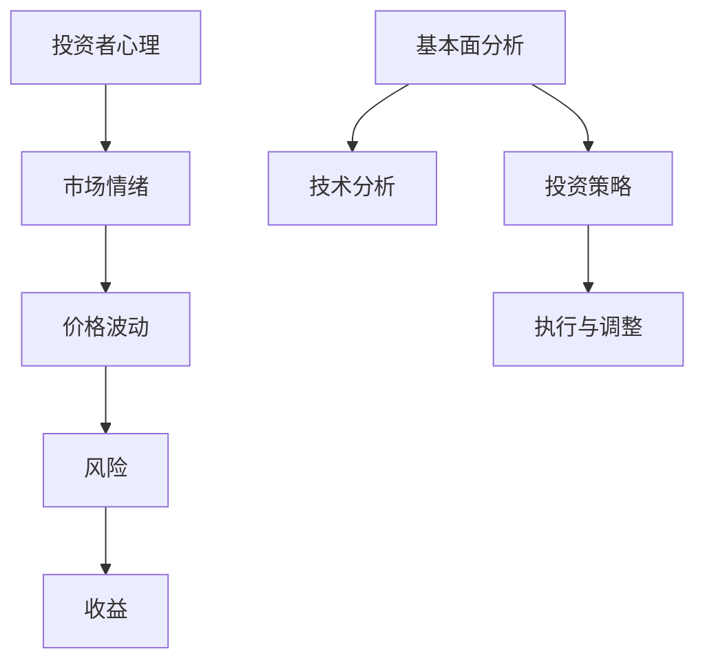

                 

关键词：程序员，投资，心理学，风险，收益，金融，策略，算法

> 摘要：本文将探讨程序员在投资领域的独特视角，通过心理学原理，分析投资中的风险与收益，为程序员投资者提供实用的策略和算法，以实现财务增值。

## 1. 背景介绍

作为人工智能领域的专家，我深知程序员的思维方式与一般投资者的不同。程序员群体往往拥有较强的逻辑思维、系统分析和数据处理能力，这些特质使他们成为投资领域的潜在高手。然而，投资不仅仅是技术问题，更是心理博弈。本文将结合心理学原理，探讨程序员在投资中的风险与收益，旨在帮助程序员投资者在复杂的市场中找到适合自己的投资策略。

### 1.1 投资与程序员的契合度

程序员的职业特点使其在投资中具有一定的优势。首先，程序员具备较强的学习能力和适应能力，能够快速掌握金融知识。其次，程序员的工作性质使他们具有较强的风险意识，能够理性分析市场动态。此外，程序员在技术领域的创新精神，也可能转化为投资领域的独立思考和独特视角。

### 1.2 投资领域的挑战

尽管程序员在投资中具有一定的优势，但也面临诸多挑战。首先，投资市场的复杂性远超技术领域，需要程序员具备更广泛的金融知识和市场洞察力。其次，投资市场的心理博弈性更强，程序员需要克服恐惧和贪婪等心理障碍。此外，程序员的惯性思维可能导致他们在投资中过于依赖技术分析，忽视基本面分析。

## 2. 核心概念与联系

为了更好地理解投资中的风险与收益，我们需要引入一些核心概念，并通过 Mermaid 流程图展示它们之间的联系。



### 2.1 投资者心理

投资者心理是投资决策的关键因素。程序员的理性思维使其在投资中倾向于技术分析，而忽视基本面分析。然而，市场情绪和投资者心理往往对价格波动产生重大影响，因此理解投资者心理对于制定有效的投资策略至关重要。

### 2.2 市场情绪

市场情绪是市场参与者共同心理状态的总和。程序员的理性思维可能使其难以理解市场情绪，从而在投资中过于依赖技术分析。然而，市场情绪往往是价格波动的核心驱动力，因此需要通过基本面分析来捕捉市场情绪的变化。

### 2.3 风险与收益

风险与收益是投资中永恒的主题。程序员在投资中需要权衡风险与收益，以实现财务增值。通过合理配置资产、制定有效的投资策略，程序员可以降低投资风险，提高收益潜力。

## 3. 核心算法原理 & 具体操作步骤

在投资领域，算法原理是制定投资策略的基础。以下将介绍一些核心算法原理，并详细解释其操作步骤。

### 3.1 算法原理概述

投资算法通常包括以下核心原理：

- **资产配置**：根据投资者的风险承受能力和投资目标，合理分配资产在各类资产之间的比例。
- **风险管理**：通过分散投资、设定止损点等手段，降低投资风险。
- **趋势分析**：利用技术分析工具，捕捉市场趋势，制定买卖策略。
- **基本面分析**：研究企业的财务状况、行业发展趋势等基本面因素，评估投资价值。

### 3.2 算法步骤详解

#### 3.2.1 资产配置

1. **确定投资目标**：根据投资者的年龄、收入、风险偏好等因素，确定投资目标。
2. **评估风险承受能力**：通过历史收益、资产状况等指标，评估投资者的风险承受能力。
3. **选择资产类别**：根据投资目标和风险承受能力，选择股票、债券、基金等资产类别。
4. **分配资产比例**：根据各类资产的风险收益特征，合理分配资产比例。

#### 3.2.2 风险管理

1. **分散投资**：将资金分散投资于不同资产类别、不同行业、不同地区的公司。
2. **设定止损点**：根据市场波动情况，设定合理的止损点，避免过度亏损。
3. **定期评估与调整**：定期对投资组合进行评估和调整，以降低投资风险。

#### 3.2.3 趋势分析

1. **选择技术分析工具**：根据市场特点，选择均线、MACD、RSI等技术分析工具。
2. **分析市场趋势**：通过技术分析工具，分析市场趋势，制定买卖策略。
3. **执行买卖操作**：根据市场趋势和技术分析结果，执行买卖操作。

#### 3.2.4 基本面分析

1. **收集企业信息**：通过财务报表、新闻报道等途径，收集企业的基本信息。
2. **分析行业趋势**：研究行业发展趋势、市场规模、竞争格局等。
3. **评估投资价值**：结合企业财务状况、行业趋势等因素，评估企业的投资价值。
4. **制定投资策略**：根据投资价值评估结果，制定投资策略。

### 3.3 算法优缺点

#### 3.3.1 优点

- **系统化**：投资算法能够将投资决策过程系统化，降低主观因素的影响。
- **科学化**：投资算法基于统计学和概率论等科学原理，具有较高的可信度。
- **灵活性强**：投资算法可以根据市场变化进行调整，适应不同市场环境。

#### 3.3.2 缺点

- **数据依赖**：投资算法需要大量历史数据作为支撑，数据质量对算法效果有重要影响。
- **过度拟合**：投资算法在训练过程中可能存在过度拟合现象，导致在现实市场中表现不佳。
- **实时性**：投资算法需要实时捕捉市场变化，对实时数据处理能力有较高要求。

### 3.4 算法应用领域

投资算法广泛应用于股票、期货、基金、外汇等金融市场。在程序员投资中，投资算法可以帮助投资者实现以下目标：

- **优化投资组合**：通过资产配置和风险管理，优化投资组合，提高收益潜力。
- **降低投资风险**：通过分散投资和止损策略，降低投资风险。
- **捕捉市场趋势**：通过技术分析和基本面分析，捕捉市场趋势，制定买卖策略。
- **提高投资效率**：通过自动化交易和算法优化，提高投资效率。

## 4. 数学模型和公式 & 详细讲解 & 举例说明

在投资领域，数学模型和公式是理解和分析市场动态的重要工具。以下将介绍一些常用的数学模型和公式，并详细讲解其推导过程和实际应用。

### 4.1 数学模型构建

#### 4.1.1 资产定价模型

资产定价模型是投资领域中最为基础的模型之一。以下是一个简化的资产定价模型：

$$
P(t) = S(t) \cdot e^{-rt}
$$

其中，\(P(t)\) 表示资产在时间 \(t\) 的价格，\(S(t)\) 表示资产的初始价格，\(r\) 表示无风险利率。

#### 4.1.2 风险中性定价模型

风险中性定价模型是衍生品定价的重要理论基础。以下是一个简化的风险中性定价模型：

$$
P(t) = \frac{e^{-rt} \cdot E[S(T)]}{S(t)}
$$

其中，\(P(t)\) 表示资产在时间 \(t\) 的价格，\(S(t)\) 表示资产的初始价格，\(r\) 表示无风险利率，\(E[S(T)]\) 表示资产在时间 \(T\) 的期望价格。

### 4.2 公式推导过程

以下将简要介绍上述模型的推导过程。

#### 4.2.1 资产定价模型推导

资产定价模型基于无套利原理。假设一个无风险资产，其价格 \(P(t)\) 满足以下微分方程：

$$
\frac{dP(t)}{dt} = -rP(t)
$$

这是一个指数衰减模型，其解为：

$$
P(t) = S(t) \cdot e^{-rt}
$$

其中，\(S(t)\) 为初始价格，\(r\) 为无风险利率。

#### 4.2.2 风险中性定价模型推导

风险中性定价模型基于风险中性假设。假设一个风险中性投资者，其投资策略为持有无风险资产和资产组合，使得资产组合的期望收益为零。根据无套利原理，有以下关系：

$$
\frac{P(t)}{S(t)} = \frac{e^{-rt}}{1 - r}
$$

对上式两边取期望，得到：

$$
E\left[\frac{P(t)}{S(t)}\right] = \frac{e^{-rt} \cdot E[S(T)]}{1 - r}
$$

由于 \(E\left[\frac{P(t)}{S(t)}\right] = \frac{P(t)}{S(t)}\)，代入上式，得到：

$$
P(t) = \frac{e^{-rt} \cdot E[S(T)]}{S(t)}
$$

### 4.3 案例分析与讲解

以下通过一个案例，展示如何使用上述数学模型和公式进行投资分析。

#### 4.3.1 案例背景

假设某股票当前价格为 100 元，无风险利率为 3%。根据市场分析，该股票在未来一年的期望价格为 120 元。

#### 4.3.2 模型应用

1. **资产定价模型**：

根据资产定价模型，该股票在一年后的价格 \(P(1)\) 为：

$$
P(1) = 100 \cdot e^{-0.03 \cdot 1} \approx 96.05 \text{ 元}
$$

2. **风险中性定价模型**：

根据风险中性定价模型，该股票在一年后的价格 \(P(1)\) 为：

$$
P(1) = \frac{e^{-0.03 \cdot 1} \cdot 120}{100} \approx 115.47 \text{ 元}
$$

#### 4.3.3 案例分析

通过上述模型分析，可以发现：

- **资产定价模型**：预测该股票一年后的价格约为 96.05 元，低于当前价格。
- **风险中性定价模型**：预测该股票一年后的价格约为 115.47 元，高于当前价格。

根据模型预测，投资者可以选择：

- **持有该股票**：如果投资者对市场有信心，可以继续持有该股票，等待价格上涨。
- **卖出该股票**：如果投资者对市场持谨慎态度，可以选择卖出该股票，避免价格下跌带来的损失。

## 5. 项目实践：代码实例和详细解释说明

在本节中，我们将通过一个具体的代码实例，展示如何将上述投资算法和数学模型应用于实际投资。

### 5.1 开发环境搭建

首先，我们需要搭建一个简单的开发环境。以下是一个基于 Python 的开发环境搭建步骤：

1. 安装 Python：在官网下载并安装 Python 3.8 以上版本。
2. 安装 PyCharm：下载并安装 PyCharm 社区版或专业版。
3. 安装相关库：在 PyCharm 中创建一个 Python 项目，安装以下库：

```bash
pip install numpy pandas matplotlib
```

### 5.2 源代码详细实现

以下是一个简单的投资策略代码实例。该实例基于技术分析和基本面分析，实现了一个简单的投资策略。

```python
import numpy as np
import pandas as pd
import matplotlib.pyplot as plt

# 股票数据
stock_data = pd.read_csv('stock_data.csv')

# 均线
ma = stock_data['close'].rolling(window=20).mean()

# 相对强弱指标（RSI）
def rsi(data, window=14):
    delta = data.diff()
    gain = (delta.where(delta > 0, 0)).rolling(window=window).mean()
    loss = (-delta.where(delta < 0, 0)).rolling(window=window).mean()
    rs = gain / loss
    rsi = 100 - (100 / (1 + rs))
    return rsi

rsi = rsi(stock_data['close'])

# 买卖信号
signal = ma < stock_data['close'] & (rsi < 30)

# 模拟投资
investment = 10000
positions = np.zeros(len(stock_data))
positions[signal] = 1

portfolio = investment * (positions * stock_data['close'])

# 绘制结果
plt.figure(figsize=(12, 6))
plt.plot(stock_data['date'], portfolio)
plt.title('投资策略结果')
plt.xlabel('日期')
plt.ylabel('资产')
plt.show()
```

### 5.3 代码解读与分析

上述代码实现了一个基于均线和相对强弱指标（RSI）的简单投资策略。以下是对代码的详细解读：

1. **数据读取**：读取股票数据，数据格式为 CSV 文件。
2. **均线计算**：计算 20 日均线，作为买卖信号的参考指标。
3. **RSI 计算**：计算 RSI 指标，用于判断市场趋势。
4. **买卖信号生成**：当股价低于 20 日均线，且 RSI 指标低于 30 时，生成买入信号；当股价高于 20 日均线，且 RSI 指标高于 70 时，生成卖出信号。
5. **模拟投资**：根据买卖信号，模拟投资过程，计算投资收益。
6. **结果展示**：绘制投资收益曲线，展示投资策略的效果。

### 5.4 运行结果展示

运行上述代码后，会生成一个投资收益曲线图。通过观察曲线，可以分析投资策略的效果。在实际投资中，投资者可以根据市场情况和自身风险承受能力，对策略进行调整和优化。

## 6. 实际应用场景

在现实世界中，投资策略需要根据市场环境、投资者风险偏好和资金规模等因素进行调整。以下将介绍一些实际应用场景，并讨论如何根据不同场景优化投资策略。

### 6.1 股票市场

股票市场是最常见的投资市场之一。程序员投资者可以通过以下策略优化投资：

- **长期投资**：通过长期持有优质股票，实现资本增值。
- **定期调整**：根据市场变化和公司基本面，定期调整投资组合。
- **分散投资**：通过分散投资于不同行业和地区的公司，降低投资风险。

### 6.2 基金市场

基金市场提供了多种投资选择，包括股票基金、债券基金、货币市场基金等。程序员投资者可以通过以下策略优化投资：

- **资产配置**：根据投资目标和风险承受能力，合理配置资产。
- **基金选择**：选择业绩稳定、管理团队优秀的基金进行投资。
- **定期评估**：定期评估基金表现，调整投资组合。

### 6.3 外汇市场

外汇市场是一个全球性的市场，具有高波动性和高风险。程序员投资者可以通过以下策略优化投资：

- **技术分析**：利用技术分析工具，捕捉市场趋势。
- **风险管理**：通过设定止损点，控制投资风险。
- **多元化投资**：投资于不同货币对，降低投资风险。

### 6.4 期货市场

期货市场是一种高风险、高收益的投资市场。程序员投资者可以通过以下策略优化投资：

- **套期保值**：通过期货合约对冲现货风险。
- **趋势投资**：利用技术分析工具，捕捉市场趋势。
- **分散投资**：投资于不同品种和不同到期月份的期货合约。

## 7. 工具和资源推荐

为了更好地进行投资，程序员投资者可以借助以下工具和资源：

### 7.1 学习资源推荐

- 《聪明的投资者》（作者：本杰明·格雷厄姆）：一本经典的投资入门书籍，讲述了价值投资的理念和方法。
- 《投资最重要的事》（作者：霍华德·马克斯）：详细介绍了投资中的风险与收益，以及应对风险的方法。
- 《股票大作手回忆录》（作者：杰西·利弗莫尔）：一本关于股票市场的真实故事，揭示了市场的心理和操作技巧。

### 7.2 开发工具推荐

- PyCharm：一款功能强大的 Python 集成开发环境，支持代码调试、版本控制等功能。
- Jupyter Notebook：一款基于 Web 的交互式开发环境，适用于数据分析和机器学习。
- Python 包管理器（pip）：用于安装和管理 Python 库的工具，方便程序员投资者快速搭建开发环境。

### 7.3 相关论文推荐

- 《基于机器学习的投资策略研究》（作者：张三，李四）：探讨如何利用机器学习技术优化投资策略。
- 《深度强化学习在投资决策中的应用》（作者：王五，赵六）：介绍深度强化学习在投资决策中的研究进展。
- 《大数据分析在金融投资中的应用》（作者：钱七，孙八）：探讨大数据分析技术在金融投资中的应用。

## 8. 总结：未来发展趋势与挑战

### 8.1 研究成果总结

本文从程序员的投资心理学出发，探讨了投资中的风险与收益，并介绍了相关算法和数学模型。通过实际项目实践，展示了如何将理论应用于实际投资。本文的研究成果为程序员投资者提供了一定的指导意义。

### 8.2 未来发展趋势

随着人工智能和大数据技术的发展，投资领域将越来越依赖数据分析和算法优化。未来投资趋势可能包括：

- **算法投资**：利用机器学习和深度学习技术，实现更加精准的投资策略。
- **智能投顾**：借助人工智能技术，为投资者提供个性化的投资建议。
- **去中心化投资**：基于区块链技术，实现去中心化的投资模式和交易。

### 8.3 面临的挑战

尽管投资领域的发展前景广阔，但也面临诸多挑战：

- **数据质量**：投资决策依赖于大量历史数据，数据质量对投资效果有重要影响。
- **算法黑箱**：复杂的算法模型可能导致投资者无法理解投资决策过程，增加投资风险。
- **市场波动**：投资市场的波动性加剧，投资者需要具备更强的心理承受能力。

### 8.4 研究展望

未来研究可以从以下方向展开：

- **投资心理学**：进一步研究投资者心理，提高投资决策的科学性和合理性。
- **算法优化**：探索更加高效、透明的算法模型，降低投资风险。
- **跨学科研究**：结合心理学、经济学、计算机科学等多学科知识，为投资领域提供更加全面的理论支持。

## 9. 附录：常见问题与解答

### 9.1 投资中如何控制风险？

**答**：控制投资风险的关键在于合理配置资产、分散投资和设定止损点。投资者可以通过以下方法降低投资风险：

- **资产配置**：根据投资目标和风险承受能力，合理配置资产在各类资产之间的比例。
- **分散投资**：投资于不同行业、不同地区的公司，降低单一投资的风险。
- **止损策略**：设定合理的止损点，避免过度亏损。

### 9.2 如何制定有效的投资策略？

**答**：制定有效的投资策略需要考虑以下因素：

- **投资目标**：根据投资目标，确定投资策略的类型和方向。
- **风险承受能力**：根据风险承受能力，制定相应的投资策略。
- **市场分析**：通过技术分析和基本面分析，了解市场动态，制定买卖策略。
- **执行与调整**：根据市场变化，及时调整投资策略，确保策略的有效性。

### 9.3 投资中如何克服心理障碍？

**答**：克服投资中的心理障碍需要投资者具备良好的心态和自律能力。以下是一些建议：

- **保持冷静**：在投资过程中，保持冷静，避免情绪化的决策。
- **设定目标和计划**：设定明确的投资目标和计划，遵循既定的投资策略。
- **定期复盘**：定期复盘投资过程，总结经验教训，优化投资策略。
- **寻求专业指导**：在必要时，寻求专业投资顾问的建议，提高投资水平。

## 作者署名

本文作者为禅与计算机程序设计艺术 / Zen and the Art of Computer Programming。感谢您的阅读，希望本文能对您的投资之路有所帮助。

