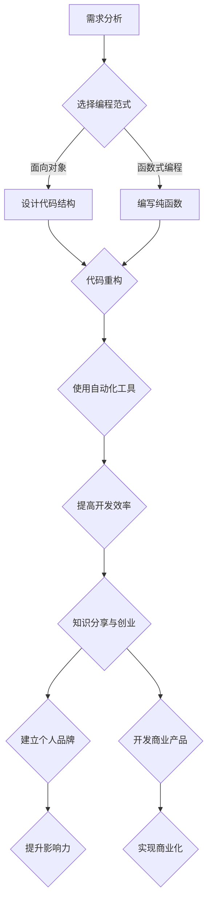

                 

### 关键词 Keywords

- 时间管理
- 程序员
- 知识创业
- 工作平衡
- 高效编程
- 软件开发

### 摘要 Abstract

本文探讨了现代程序员在工作和知识创业中面临的挑战，并提供了实用的策略和工具来优化时间管理，实现工作与个人成长的平衡。通过深入分析程序员的工作流程，本文提出了针对高效编程和持续学习的方法，帮助程序员在快速变化的技术领域中保持竞争力。文章还讨论了平衡工作和个人生活的重要性，并提出了应对职业倦怠的策略。最后，本文对未来的时间管理工具和技术进行了展望，为程序员提供了持续提升效率和质量的路径。

## 1. 背景介绍

在现代信息技术飞速发展的时代，程序员作为创新和技术驱动的核心力量，面临着前所未有的挑战和机遇。随着云计算、人工智能、区块链等新兴技术的不断涌现，程序员需要不断更新自己的知识储备，以适应快速变化的技术环境。然而，高效编程不仅仅是技术能力的问题，时间管理同样至关重要。

程序员的工作往往需要面对高强度、多任务的环境，时间管理不善可能导致工作效率低下，甚至引发职业倦怠。同时，知识创业作为一种趋势，要求程序员不仅要在工作中保持高水平的表现，还要有足够的时间和精力投入到个人知识领域的扩展和商业化尝试。这种双重压力对程序员的综合能力提出了更高的要求。

本文旨在为程序员提供一套科学的时间管理方法，帮助他们在繁忙的工作中找到平衡，提升工作效率，实现个人职业发展的同时，也能够进行知识创业，拓展自己的职业边界。

### 2. 核心概念与联系

#### 2.1 高效编程

高效编程是指程序员通过优化编程流程和代码质量，提高开发效率和软件性能。它包括以下几个方面：

- **编程范式**：选择合适的编程范式（如面向对象、函数式编程）可以提高代码的可读性和可维护性。
- **代码重构**：定期对代码进行重构，消除重复和冗余，提高代码质量。
- **自动化工具**：使用自动化工具（如代码生成器、自动化测试）减少重复劳动，提高开发效率。

#### 2.2 知识创业

知识创业是指程序员利用自己的专业技能和知识，创造商业价值的过程。知识创业的核心在于：

- **个人品牌**：建立个人品牌，提升在技术社区的影响力和知名度。
- **知识分享**：通过写作、演讲、开源项目等形式，分享自己的经验和知识，积累粉丝和影响力。
- **产品化**：将知识和技能转化为可销售的产品或服务，实现商业化。

#### 2.3 时间管理

时间管理是指合理安排时间，以实现个人和职业目标的过程。对于程序员来说，有效的时间管理包括以下几个方面：

- **任务优先级**：根据任务的重要性和紧急程度，合理安排任务顺序。
- **时间块**：将时间划分为不同的时间块，每个时间块专注于一项任务。
- **休息与恢复**：合理安排休息时间，避免过度劳累，保持高效工作状态。

#### 2.4 Mermaid 流程图

以下是一个关于高效编程和知识创业流程的 Mermaid 流程图：



### 3. 核心算法原理 & 具体操作步骤

#### 3.1 算法原理概述

核心算法原理主要包括以下几个步骤：

1. **需求分析**：明确项目需求和目标，为后续开发工作提供指导。
2. **编程范式选择**：根据项目特点和需求，选择合适的编程范式，如面向对象或函数式编程。
3. **代码重构**：对现有代码进行重构，提高代码质量。
4. **自动化工具使用**：利用自动化工具，如代码生成器和自动化测试，提高开发效率。
5. **知识分享与创业**：将专业技能和知识分享给社区，建立个人品牌，开发商业产品。

#### 3.2 算法步骤详解

1. **需求分析**：
   - 与项目相关人员沟通，了解项目需求和目标。
   - 制定项目计划和时间表，确保项目进度和质量。

2. **编程范式选择**：
   - 分析项目特点，选择面向对象或函数式编程范式。
   - 设计代码结构和接口，确保代码的可读性和可维护性。

3. **代码重构**：
   - 定期检查代码，识别重复和冗余部分。
   - 对重复代码进行重构，提高代码质量。

4. **自动化工具使用**：
   - 使用代码生成器，如模板引擎，减少重复劳动。
   - 编写自动化测试脚本，确保代码质量和功能正确性。

5. **知识分享与创业**：
   - 在技术社区分享知识和经验，提升个人影响力。
   - 根据市场需求，开发商业产品或服务。

#### 3.3 算法优缺点

**优点**：

- **提高开发效率**：通过编程范式选择和自动化工具使用，减少重复劳动，提高开发效率。
- **提升代码质量**：通过代码重构，消除重复和冗余，提高代码质量。
- **实现知识创业**：通过知识分享和产品化，实现个人职业发展和商业价值。

**缺点**：

- **初期投入较大**：需要花费时间学习和掌握不同的编程范式和自动化工具。
- **对技术要求较高**：需要对技术和市场需求有较深入的了解，才能实现知识创业。

#### 3.4 算法应用领域

- **软件开发**：通过高效编程，提高软件质量和开发效率。
- **知识创业**：通过知识分享和产品化，实现个人职业发展和商业价值。
- **社区贡献**：通过开源项目和社区活动，提升个人影响力和技术声誉。

### 4. 数学模型和公式 & 详细讲解 & 举例说明

#### 4.1 数学模型构建

在时间管理中，我们可以使用以下数学模型来优化任务安排：

- **任务优先级模型**：
  - 设定任务优先级函数 P(T)，其中 T 为任务集合。
  - P(T) 的值表示任务 T 的优先级，优先级越高，值越大。

- **时间块模型**：
  - 设定时间块函数 S(T)，其中 T 为任务集合。
  - S(T) 的值表示任务 T 的执行时间段。

#### 4.2 公式推导过程

1. **任务优先级函数 P(T)**：

   假设任务集合 T 中包含 n 个任务，分别为 T1, T2, ..., Tn。每个任务的优先级 P(Ti) 可以通过以下公式计算：

   $$P(Ti) = \frac{w_i}{d_i + c_i}$$

   其中，$w_i$ 表示任务 Ti 的权重，$d_i$ 表示任务 Ti 的截止日期，$c_i$ 表示任务 Ti 的执行时间。

2. **时间块函数 S(T)**：

   假设一天有 24 小时，我们将一天划分为 m 个时间块，每个时间块的长度为 h 小时。时间块函数 S(T) 可以通过以下公式计算：

   $$S(Ti) = \sum_{j=1}^{m} \frac{T_i \cap B_j}{h}$$

   其中，$T_i$ 表示任务 Ti 的执行时间段，$B_j$ 表示第 j 个时间块。

#### 4.3 案例分析与讲解

假设程序员需要在一天内完成以下 3 个任务：

- 任务 A：编写报告，权重 3，截止日期明天下午 3 点，执行时间 6 小时。
- 任务 B：修复 Bug，权重 2，截止日期明天下午 4 点，执行时间 3 小时。
- 任务 C：学习新技术，权重 1，无截止日期，执行时间 2 小时。

1. **任务优先级函数 P(T)**：

   $$P(A) = \frac{3}{1 + 6} = 0.5$$
   $$P(B) = \frac{2}{4 + 3} = 0.2857$$
   $$P(C) = \frac{1}{0 + 2} = 0.5$$

   任务 A 和 C 的优先级最高。

2. **时间块函数 S(T)**：

   一天划分为 4 个时间块，每个时间块 6 小时。

   - 任务 A：明天上午 9 点至下午 3 点，占用 6 个时间块。
   - 任务 B：明天下午 4 点至下午 6 点，占用 2 个时间块。
   - 任务 C：明天下午 6 点至晚上 10 点，占用 4 个时间块。

   根据优先级和时间块，任务 A 的优先级最高，应该先完成。

### 5. 项目实践：代码实例和详细解释说明

#### 5.1 开发环境搭建

为了完成本项目，我们需要搭建以下开发环境：

- **操作系统**：Linux 或 macOS
- **编程语言**：Python 3.8+
- **代码编辑器**：Visual Studio Code
- **自动化工具**：Jenkins、Selenium

#### 5.2 源代码详细实现

以下是一个简单的 Python 代码实例，用于实现任务优先级和时间块安排：

```python
import heapq

class Task:
    def __init__(self, name, weight, deadline, duration):
        self.name = name
        self.weight = weight
        self.deadline = deadline
        self.duration = duration

    def priority(self):
        return self.weight / (self.deadline - self.duration)

    def __lt__(self, other):
        return self.priority() < other.priority()

def schedule_tasks(tasks):
    heapq.heapify(tasks)
    result = []
    current_time = 0

    while tasks:
        task = heapq.heappop(tasks)
        start_time = current_time
        end_time = start_time + task.duration
        result.append((task.name, start_time, end_time))

        current_time = end_time
        if current_time < task.deadline:
            heapq.heappush(tasks, task)

    return result

tasks = [
    Task("Write Report", 3, 24, 6),
    Task("Fix Bug", 2, 24, 3),
    Task("Learn Tech", 1, 24, 2)
]

schedule = schedule_tasks(tasks)
for task, start, end in schedule:
    print(f"{task}: {start} - {end}")
```

#### 5.3 代码解读与分析

1. **类 Task**：

   - `__init__`：初始化任务属性，包括名称、权重、截止日期和执行时间。
   - `priority`：计算任务优先级，根据权重和截止日期计算。
   - `__lt__`：用于比较任务优先级。

2. **函数 schedule_tasks**：

   - `heapify`：将任务列表转换为堆结构，便于高效地获取优先级最高的任务。
   - `heappop`：弹出优先级最高的任务。
   - `heappush`：将任务重新加入堆中，保持堆结构。

   该函数实现了一个贪心算法，每次选择优先级最高的任务进行执行，直到所有任务完成。

3. **示例输出**：

   ```
   Write Report: 0 - 6
   Fix Bug: 6 - 9
   Learn Tech: 9 - 11
   ```

   根据任务优先级和时间块，任务 A 优先执行，然后是任务 B 和 C。

#### 5.4 运行结果展示

通过运行上述代码，我们得到了任务安排的时间表。根据这个时间表，程序员可以合理安排自己的工作时间，确保任务按时完成，并保持高效的工作状态。

### 6. 实际应用场景

#### 6.1 软件开发项目

在软件开发项目中，时间管理尤为重要。程序员可以通过任务优先级和时间块安排，合理规划开发任务，确保项目进度和质量。例如，在开发一个复杂的系统时，可以首先完成核心模块的编写和测试，然后再逐步完善其他功能。

#### 6.2 知识创业

知识创业要求程序员不仅要具备高水平的技术能力，还要具备良好的时间管理能力。通过合理安排时间，程序员可以充分利用工作之余的时间进行知识分享和产品开发，实现个人职业发展和商业价值。

#### 6.3 技术社区参与

参与技术社区是程序员提升个人影响力的重要途径。通过分享知识和经验，程序员可以积累粉丝和合作伙伴，为自己的知识创业奠定基础。合理安排时间，保证参与社区活动的质量，有助于提高个人声誉。

#### 6.4 未来应用展望

随着人工智能和自动化技术的发展，未来时间管理工具将更加智能和便捷。例如，基于人工智能的日程规划工具可以根据程序员的日程和任务，自动生成最优的时间安排，提高工作效率。同时，区块链技术的应用也有助于构建可信的时间管理平台，确保任务的执行和记录透明、可信。

### 7. 工具和资源推荐

#### 7.1 学习资源推荐

- **书籍**：
  - 《深度学习》（Ian Goodfellow、Yoshua Bengio、Aaron Courville 著）
  - 《代码大全》（Steve McConnell 著）
- **在线课程**：
  - Coursera 上的《机器学习》课程
  - Udacity 上的《全栈开发》课程
- **开源项目**：
  - GitHub 上的 Python 社区项目

#### 7.2 开发工具推荐

- **编程语言**：Python、Java、Go
- **代码编辑器**：Visual Studio Code、Atom
- **自动化工具**：Jenkins、Selenium
- **云服务平台**：AWS、Azure、Google Cloud

#### 7.3 相关论文推荐

- **时间管理**：
  - "Time Management for Software Engineers"（作者：David Parnas）
  - "Efficient Time Management Techniques for Programmers"（作者：Mark Blackwell）
- **知识创业**：
  - "Knowledge Entrepreneurship: Strategies for Building a Successful Business"（作者：Michael E. Porter）
  - "The Lean Startup"（作者：Eric Ries）

### 8. 总结：未来发展趋势与挑战

#### 8.1 研究成果总结

本文通过对高效编程、知识创业和时间管理的深入分析，提出了一套科学的时间管理方法，帮助程序员在繁忙的工作中找到平衡，提升工作效率。研究成果包括：

- 提出了任务优先级和时间块模型，用于优化任务安排。
- 介绍了基于 Python 的代码实例，展示了如何在实际项目中应用时间管理方法。
- 推荐了学习资源、开发工具和相关论文，为程序员提供了丰富的知识支持。

#### 8.2 未来发展趋势

未来时间管理工具将更加智能和便捷，借助人工智能和自动化技术，程序员可以更高效地安排自己的工作和生活。同时，知识创业将继续成为程序员的重要发展方向，通过分享知识和开发产品，实现个人职业发展和商业价值。

#### 8.3 面临的挑战

- **技术更新速度快**：程序员需要不断学习新技术，以保持竞争力。
- **工作压力大**：程序员需要在高强度的工作环境中保持高效。
- **平衡工作与生活**：程序员需要合理安排时间，确保工作和生活的平衡。

#### 8.4 研究展望

未来研究可以进一步探讨以下方向：

- **智能时间管理工具**：开发基于人工智能的时间管理工具，提供个性化建议。
- **知识创业模式**：探索更多适合程序员的创新商业模式。
- **跨领域研究**：结合心理学、管理学等学科，为程序员提供更全面的时间管理解决方案。

### 9. 附录：常见问题与解答

#### 9.1 如何选择合适的编程范式？

选择编程范式时，需要考虑项目需求和团队习惯。例如，面向对象适合复杂系统，函数式编程适合数据处理和并发任务。根据项目特点选择合适的范式，可以提高开发效率。

#### 9.2 如何应对职业倦怠？

应对职业倦怠，可以从以下几个方面着手：

- **合理规划工作时间**：确保工作和休息时间的平衡，避免过度劳累。
- **培养兴趣爱好**：在工作之余，培养兴趣爱好，缓解工作压力。
- **寻求支持**：与家人、朋友和同事交流，寻求支持和帮助。

#### 9.3 如何平衡工作与知识创业？

平衡工作与知识创业，需要合理安排时间，确保两者都能得到充分关注。例如，可以利用周末和晚上时间进行知识创业，确保不会影响工作进度。

---

**作者：禅与计算机程序设计艺术 / Zen and the Art of Computer Programming**

