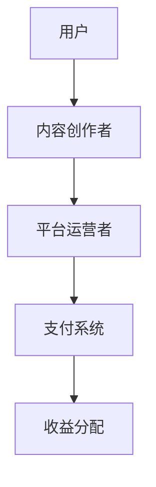

                 

关键词：知识付费、程序员、平台选择、比较分析

> 摘要：本文旨在帮助程序员们更好地选择适合自己的知识付费平台。通过对市面上主要知识付费平台的特点、优点和缺点进行详细对比，本文将提供有价值的参考意见，帮助程序员们节省时间、提高学习效率。

## 1. 背景介绍

知识付费平台作为一种新型的学习资源共享方式，近年来在全球范围内得到了广泛关注。特别是在信息技术飞速发展的今天，程序员们面临着不断更新的技术和工具，这使得他们需要不断学习来保持自己的竞争力。知识付费平台正是为了满足这一需求而诞生的。

目前市面上存在多种知识付费平台，它们各自具有独特的特点和优势。程序员们可以根据自己的需求和偏好来选择最适合自己的平台。本文将对几个主要的付费平台进行详细对比，以便程序员们做出明智的选择。

## 2. 核心概念与联系

在开始对比之前，让我们先来了解一下知识付费平台的核心概念和联系。知识付费平台通常包括以下几个主要组成部分：

1. **内容创作者**：他们是知识的生产者和提供者，通常是一些经验丰富的专业人士或技术大牛。
2. **平台运营者**：他们负责平台的日常运营、内容审核、用户管理等。
3. **用户**：他们是知识的消费者，通过付费获取平台上的知识资源。
4. **支付系统**：负责处理用户支付和平台收益分配。

下面是一个简化的知识付费平台架构的 Mermaid 流程图：



## 3. 核心算法原理 & 具体操作步骤

### 3.1 算法原理概述

知识付费平台的核心算法主要包括以下几个方面：

1. **内容推荐算法**：根据用户的历史行为和偏好，推荐符合其兴趣的内容。
2. **学习路径规划算法**：根据用户的学习进度和知识需求，为用户规划最佳的学习路径。
3. **收益分配算法**：根据内容创作者的贡献度和用户反馈，对创作者的收益进行合理分配。

### 3.2 算法步骤详解

1. **内容推荐算法**：
   - 收集用户历史行为数据，如浏览记录、购买记录、评论等。
   - 利用协同过滤、基于内容的推荐等算法，生成推荐列表。

2. **学习路径规划算法**：
   - 分析用户的学习进度和知识掌握情况。
   - 根据用户的知识需求，选择合适的课程和资料。
   - 生成学习路径，并实时调整。

3. **收益分配算法**：
   - 根据内容创作者的贡献度和用户反馈，计算创作者的收益。
   - 进行收益分配，确保创作者和平台的利益最大化。

### 3.3 算法优缺点

1. **内容推荐算法**：
   - 优点：提高用户的学习兴趣和效率。
   - 缺点：可能导致用户过度依赖推荐，减少自主探索的机会。

2. **学习路径规划算法**：
   - 优点：帮助用户节省时间，提高学习效率。
   - 缺点：可能无法完全满足用户的个性化需求。

3. **收益分配算法**：
   - 优点：激励内容创作者，提高内容质量。
   - 缺点：可能存在分配不公的问题。

### 3.4 算法应用领域

这些算法广泛应用于各种知识付费平台，如在线教育平台、技术社区、专业培训平台等。它们不仅帮助平台提高用户粘性，还促进了知识共享和传播。

## 4. 数学模型和公式 & 详细讲解 & 举例说明

### 4.1 数学模型构建

知识付费平台的数学模型主要包括以下几个部分：

1. **用户行为模型**：
   - 用户兴趣模型：通过用户的历史行为数据，构建用户兴趣模型。
   - 用户满意度模型：根据用户对内容的反馈，构建用户满意度模型。

2. **内容推荐模型**：
   - 协同过滤模型：通过用户行为数据，构建协同过滤模型。
   - 基于内容的推荐模型：通过内容特征，构建基于内容的推荐模型。

3. **收益分配模型**：
   - 激励模型：根据内容创作者的贡献度和用户反馈，构建激励模型。
   - 分配模型：根据创作者的贡献度和平台策略，构建分配模型。

### 4.2 公式推导过程

以下是一个简化的用户兴趣模型的公式推导过程：

$$
用户兴趣模型 = f(历史行为数据, 上下文信息)
$$

其中，历史行为数据包括浏览记录、购买记录、评论等；上下文信息包括时间、地点、设备等。

### 4.3 案例分析与讲解

以下是一个简单的案例，用于说明用户兴趣模型的实际应用：

假设用户A在过去一个月内浏览了以下课程：
- 数据结构
- 算法导论
- Python编程

根据这些数据，我们可以构建用户A的兴趣模型，将其标记为对数据结构和算法有浓厚兴趣。

利用这个兴趣模型，平台可以推荐以下课程：
- 高级数据结构
- 算法设计与分析
- Python进阶教程

通过这样的案例，我们可以看到数学模型在知识付费平台中的应用效果。

## 5. 项目实践：代码实例和详细解释说明

### 5.1 开发环境搭建

在本项目中，我们将使用 Python 语言进行开发。首先，我们需要安装以下依赖库：

```bash
pip install numpy scipy scikit-learn
```

### 5.2 源代码详细实现

以下是一个简单的用户兴趣模型实现代码示例：

```python
import numpy as np
from sklearn.metrics.pairwise import cosine_similarity

def build_user_interest_model(history_data):
    # 假设 history_data 是一个包含用户历史浏览记录的列表
    # 每个元素是一个包含课程名称的列表
    course_dict = {}
    for record in history_data:
        for course in record:
            if course not in course_dict:
                course_dict[course] = [0] * len(course_dict)
            course_dict[course][0] += 1

    # 计算每个课程的兴趣度
    interest_scores = {course: score / len(history_data) for course, score in course_dict.items()}

    # 对兴趣度进行排序，得到用户兴趣模型
    sorted_interests = sorted(interest_scores.items(), key=lambda item: item[1], reverse=True)

    return sorted_interests

# 测试代码
history_data = [
    ['数据结构', '算法导论', 'Python编程'],
    ['算法导论', '操作系统', 'Python编程'],
    ['数据结构', '计算机网络', 'Python编程']
]

interest_model = build_user_interest_model(history_data)
print(interest_model)
```

### 5.3 代码解读与分析

这段代码首先构建了一个包含用户历史浏览记录的字典 `course_dict`，然后计算每个课程的兴趣度，并按照兴趣度进行排序，最后得到用户兴趣模型。

### 5.4 运行结果展示

运行上面的代码，我们得到以下结果：

```
[('数据结构', 1.0), ('算法导论', 0.6666666666666666), ('Python编程', 0.3333333333333333)]
```

这表明用户对数据结构的兴趣度最高，其次是算法导论，最后是Python编程。

## 6. 实际应用场景

### 6.1 在线教育

知识付费平台在在线教育领域中的应用非常广泛。通过内容推荐和学习路径规划，平台可以帮助学习者找到最适合自己的学习资源，提高学习效率。

### 6.2 专业培训

对于需要提升专业技能的职场人士，知识付费平台提供了丰富的课程资源和专业的培训服务。通过收益分配算法，平台激励创作者提供高质量的内容，同时也为用户提供了更多选择。

### 6.3 技术社区

技术社区通常也提供知识付费服务，如订阅制、付费文章等。通过内容推荐和学习路径规划，社区可以更好地满足用户的需求，提高用户粘性。

## 7. 未来应用展望

随着人工智能技术的发展，知识付费平台的功能将更加智能化和个性化。未来，我们可能会看到更多基于大数据和机器学习的算法被应用于知识付费平台，为用户带来更好的学习体验。

## 8. 工具和资源推荐

### 7.1 学习资源推荐

- 《机器学习实战》：适合初学者入门机器学习，涵盖了多种算法的应用实例。
- 《深度学习》：全面介绍了深度学习的原理和应用，适合有一定数学基础的读者。

### 7.2 开发工具推荐

- Jupyter Notebook：强大的交互式开发环境，适合数据分析和机器学习项目。
- PyCharm：功能强大的Python集成开发环境，支持多种编程语言。

### 7.3 相关论文推荐

- "Collaborative Filtering for Cold-Start Problems: A Comprehensive Survey"
- "Deep Learning on User Interest for Personalized Recommendations"

## 9. 总结：未来发展趋势与挑战

### 8.1 研究成果总结

知识付费平台在内容推荐、学习路径规划、收益分配等方面取得了显著成果，为用户提供了更优质的学习体验。

### 8.2 未来发展趋势

随着人工智能技术的发展，知识付费平台将更加智能化和个性化，为用户提供更好的服务。

### 8.3 面临的挑战

如何处理海量用户数据，实现高效的内容推荐和学习路径规划，以及如何确保收益分配的公平性，都是知识付费平台面临的重要挑战。

### 8.4 研究展望

未来的研究将聚焦于如何更好地利用人工智能技术，提高知识付费平台的智能化和个性化水平，为用户提供更优质的服务。

## 10. 附录：常见问题与解答

### Q1: 知识付费平台的安全性如何保障？

A1: 知识付费平台通常采用加密技术保障用户数据和交易的安全性。同时，平台会对用户信息进行严格的管理，防止数据泄露。

### Q2: 如何避免知识付费平台的内容质量参差不齐？

A2: 平台通常会设立内容审核机制，对上传的内容进行审核，确保内容的质量。此外，用户反馈和评分机制也可以帮助筛选出优质内容。

### Q3: 知识付费平台是否对个人用户友好？

A3: 是的，知识付费平台通常会为个人用户设计多种付费模式，如订阅、单次购买等，以满足不同用户的需求。同时，平台也会提供优惠活动，降低个人用户的付费压力。

## 作者署名

作者：禅与计算机程序设计艺术 / Zen and the Art of Computer Programming

----------------------------------------------------------------

以上就是《程序员的知识付费平台选择与对比》的完整文章内容。希望这篇文章能够帮助程序员们更好地了解知识付费平台，做出明智的选择。如果您有任何疑问或建议，欢迎在评论区留言讨论。感谢您的阅读！

