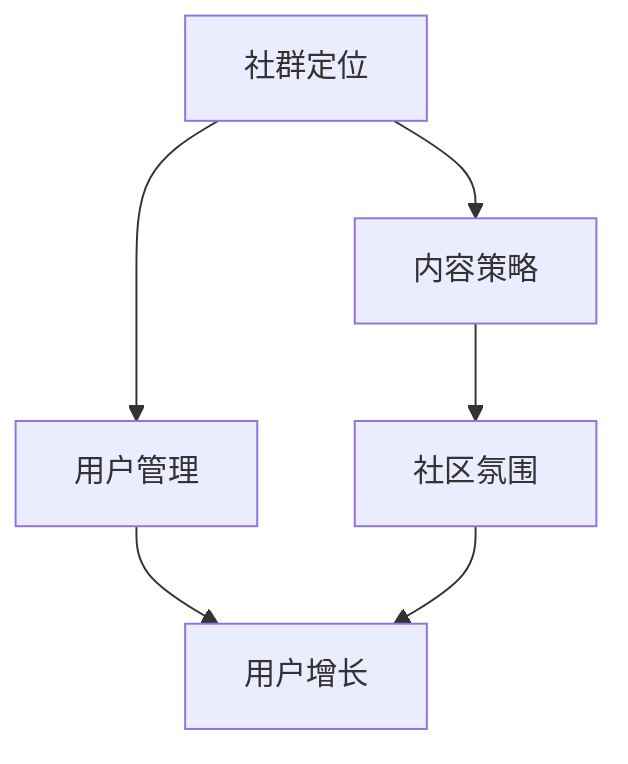

                 

关键词：知识社群、程序员、运营、用户增长、社区建设

> 摘要：本文将深入探讨程序员知识社群运营的策略与实践，从零开始，逐步实现社群从零到1万用户的跨越，提供实用的方法和经验，帮助程序员打造一个活跃、有益的在线社区。

## 1. 背景介绍

随着互联网的普及，知识社群成为了知识传播和创新的重要平台。对于程序员来说，构建一个知识社群不仅可以分享和获取技术知识，还能促进职业发展，建立个人品牌，扩大人脉网络。然而，运营一个成功的知识社群并非易事，需要明确的战略规划、持续的内容输出、有效的用户管理和社区氛围的建设。

本文将结合笔者在知识社群运营方面的经验，提供一套从零到1万用户的运营方法论，帮助程序员更好地运营自己的知识社群。

### 1.1 知识社群的重要性

- **知识传播**：程序员社群可以为技术知识的普及和传承提供一个良好的平台。
- **职业发展**：通过社群，程序员可以展示自己的技术能力和项目经验，提升职业竞争力。
- **社区氛围**：活跃的社群可以吸引更多志同道合的人加入，形成积极向上的交流氛围。

### 1.2 运营挑战

- **内容持续输出**：保持高质量的内容输出是吸引和留住用户的关键。
- **用户管理**：如何有效管理用户，提升用户活跃度和参与度，是运营中的重要问题。
- **社区氛围**：营造良好的社群氛围，避免负面言论和低质量内容，是运营中的难点。

## 2. 核心概念与联系

下面我们通过一个Mermaid流程图来展示知识社群运营的核心概念和相互联系。



### 2.1 社群定位

社群的定位是运营的基础，决定了社群的目标和用户群体。准确的社群定位有助于吸引对特定主题感兴趣的用户，并保持内容的聚焦。

### 2.2 内容策略

内容策略决定了社群的核心价值，高质量的内容可以吸引并留住用户。内容策略包括内容的类型、频率和质量控制。

### 2.3 用户管理

用户管理包括用户引导、激励和成长计划，通过有效的用户管理，可以提升用户的活跃度和忠诚度。

### 2.4 社区氛围

社区氛围决定了用户的体验和满意度。一个积极、健康、有活力的社区氛围可以增强用户的归属感和参与感。

### 2.5 用户增长

用户增长是社群运营的重要目标，通过有效的推广和活动，可以吸引更多的用户加入社群。

## 3. 核心算法原理 & 具体操作步骤

### 3.1 算法原理概述

知识社群运营的核心算法主要涉及以下几个步骤：

1. **社群定位**：确定社群的主题和目标用户。
2. **内容策略**：制定内容生产计划，确保内容的质量和多样性。
3. **用户管理**：建立用户档案，提供个性化服务。
4. **社区氛围**：通过活动和规则，营造积极向上的社区文化。
5. **用户增长**：通过多种渠道推广社群，增加用户数量。

### 3.2 算法步骤详解

#### 3.2.1 社群定位

1. **确定主题**：根据个人兴趣和专业领域确定社群的主题。
2. **分析目标用户**：了解目标用户的需求和偏好。
3. **制定社群愿景和目标**：明确社群的长期发展方向和愿景。

#### 3.2.2 内容策略

1. **内容类型**：确定内容的类型，如技术博客、教程、案例分析等。
2. **内容频率**：制定内容发布计划，确保内容的持续性和稳定性。
3. **内容质量**：确保内容的专业性和可读性，避免低质量内容。

#### 3.2.3 用户管理

1. **用户档案**：建立用户档案，记录用户的基本信息和互动历史。
2. **个性化服务**：根据用户档案提供个性化的内容和活动推荐。
3. **用户成长计划**：制定用户成长计划，激励用户参与社群活动。

#### 3.2.4 社区氛围

1. **社区规则**：制定明确的社区规则，规范用户行为。
2. **活动组织**：定期组织线上或线下活动，增强社区凝聚力。
3. **用户反馈**：及时收集用户反馈，优化社区体验。

#### 3.2.5 用户增长

1. **内部推广**：利用社群内部资源和活动，吸引更多用户加入。
2. **外部推广**：通过社交媒体、技术论坛等渠道推广社群。
3. **合作交流**：与其他社群或企业合作，扩大社群影响力。

### 3.3 算法优缺点

#### 优点

- **针对性**：通过社群定位，可以吸引对特定主题感兴趣的用户，提高社群的精准度。
- **可持续性**：持续的内容输出和用户管理可以保证社群的活跃度和持续发展。
- **灵活性**：算法可以根据用户反馈和社群动态进行调整，提高运营效果。

#### 缺点

- **初期投入**：社群的初期建设需要大量的时间和资源投入。
- **管理难度**：用户管理和社区氛围的建设需要持续的关注和投入。
- **用户流失**：如果内容质量不高或社区氛围不佳，可能会导致用户流失。

### 3.4 算法应用领域

算法可以广泛应用于各类知识社群，如技术社群、学术社群、兴趣爱好社群等。通过合理的社群定位和运营策略，可以有效提升社群的价值和用户满意度。

## 4. 数学模型和公式 & 详细讲解 & 举例说明

在知识社群运营中，数学模型和公式可以帮助我们更科学地制定运营策略和评估运营效果。以下是一个简单的数学模型，用于计算社群的用户增长。

### 4.1 数学模型构建

假设社群在时间$t$时刻的用户数为$N(t)$，初始用户数为$N(0)$，每月增长率为$r$，则用户增长模型可以表示为：

$$
N(t) = N(0) \times (1 + r)^t
$$

其中，$r$ 是一个介于0和1之间的常数，表示每月的增长比例。

### 4.2 公式推导过程

1. **确定增长率**：首先，我们需要根据社群的实际情况确定每月的增长率$r$。这可以通过历史数据或市场调研得到。

2. **建立增长模型**：根据确定的增长率$r$，建立用户增长模型$N(t) = N(0) \times (1 + r)^t$。

3. **预测未来用户数**：通过该模型，我们可以预测在未来的某个时间$t$社群的用户数量。

### 4.3 案例分析与讲解

假设一个社群的初始用户数为1000人，每月增长率为5%，我们需要预测6个月后社群的用户数量。

1. **确定参数**：$N(0) = 1000$，$r = 0.05$。

2. **建立模型**：$N(t) = 1000 \times (1 + 0.05)^t$。

3. **计算**：当$t = 6$时，$N(6) = 1000 \times (1 + 0.05)^6 \approx 1284$。

因此，6个月后社群的用户数量预计为1284人。

### 4.4 模型优化

虽然上述模型简单实用，但在实际运营中，用户增长可能受到多种因素的影响，如活动效果、内容质量等。为了提高模型的准确性，可以考虑引入更多变量，构建更复杂的数学模型。例如，可以加入活动效果系数$e$，将模型扩展为：

$$
N(t) = N(0) \times (1 + r \times e(t))
$$

其中，$e(t)$ 表示在时间$t$的的活动效果系数，可以根据实际活动效果进行调整。

## 5. 项目实践：代码实例和详细解释说明

### 5.1 开发环境搭建

在进行知识社群的代码实例实现前，我们需要搭建一个合适的开发环境。以下是基本的开发环境搭建步骤：

1. **安装Python环境**：在本地计算机上安装Python 3.x版本。
2. **安装Django框架**：使用pip命令安装Django框架。
   ```bash
   pip install django
   ```
3. **创建Django项目**：使用Django创建一个新的项目。
   ```bash
   django-admin startproject knowledge_community
   ```
4. **创建应用**：在项目中创建一个应用用于处理社群相关功能。
   ```bash
   python manage.py startapp community
   ```

### 5.2 源代码详细实现

以下是实现知识社群的核心功能之一——用户注册的代码实例。

#### 5.2.1 models.py

```python
# community/models.py

from django.db import models
from django.contrib.auth.models import User

class CommunityMember(models.Model):
    user = models.OneToOneField(User, on_delete=models.CASCADE)
    join_date = models.DateTimeField(auto_now_add=True)
    bio = models.TextField(max_length=500, blank=True)
```

#### 5.2.2 views.py

```python
# community/views.py

from django.shortcuts import render, redirect
from .models import CommunityMember
from django.contrib.auth import authenticate, login

def register(request):
    if request.method == 'POST':
        username = request.POST['username']
        password = request.POST['password']
        user = authenticate(username=username, password=password)
        if user is not None:
            login(request, user)
            CommunityMember.objects.create(user=user)
            return redirect('home')
        else:
            return render(request, 'register.html', {'error': 'Invalid credentials'})
    else:
        return render(request, 'register.html')
```

#### 5.2.3 URLs.py

```python
# community/urls.py

from django.urls import path
from .views import register

urlpatterns = [
    path('register/', register, name='register'),
]
```

### 5.3 代码解读与分析

#### 5.3.1 模型层（models.py）

在模型层，我们定义了一个名为`CommunityMember`的模型，它与Django内置的`User`模型进行一对一关联。这个关联模型包含了用户的加入日期和自我介绍信息。

#### 5.3.2 视图层（views.py）

视图层负责处理用户的注册逻辑。当用户提交注册表单时，会调用`register`函数。这个函数首先验证用户名和密码是否匹配，然后创建一个`CommunityMember`对象与认证后的用户关联。如果注册成功，用户将被重定向到主页。

#### 5.3.3 路由层（urls.py）

路由层用于将URL映射到相应的视图函数。在这个例子中，我们将注册页面映射到`register`视图函数。

### 5.4 运行结果展示

在完成上述代码后，我们需要运行Django项目。以下是如何启动项目的步骤：

1. **配置数据库**：根据项目需求配置数据库，通常为SQLite。
2. **迁移数据库**：生成数据库表结构。
   ```bash
   python manage.py makemigrations community
   python manage.py migrate
   ```
3. **启动服务器**：运行Django开发服务器。
   ```bash
   python manage.py runserver
   ```

完成后，用户可以通过浏览器访问`http://127.0.0.1:8000/register/`来访问注册页面，并按照提示完成注册。

## 6. 实际应用场景

### 6.1 技术社群

技术社群是知识社群的典型代表，如GitHub、Stack Overflow等。这些社群通过提供技术问题解答、代码分享、项目协作等功能，帮助程序员解决实际问题，提高技术能力。

### 6.2 学术社群

学术社群聚焦于某个专业领域，如机器学习、人工智能等。这类社群通过论文分享、学术讨论、研讨会等形式，促进学术研究和知识的传播。

### 6.3 兴趣爱好社群

兴趣爱好社群如编程挑战、游戏开发等，为拥有共同兴趣的人提供了一个交流和学习的平台。这类社群通过举办活动、分享经验、共同创作等形式，增强用户的归属感和参与感。

## 7. 未来应用展望

### 7.1 人工智能的融入

随着人工智能技术的发展，知识社群有望更加智能化。例如，通过自然语言处理技术，可以为用户提供更加个性化的内容推荐和服务。

### 7.2 社群平台的多样化

未来，知识社群平台将更加多样化，满足不同用户的需求。除了线上社区，还将出现更多线下活动、虚拟现实（VR）等形式，为用户提供丰富的互动体验。

### 7.3 社群经济的崛起

知识社群将成为数字经济的重要组成部分。通过社群，程序员可以开展在线课程、技术咨询、项目合作等业务，实现知识的变现。

## 8. 总结：未来发展趋势与挑战

### 8.1 研究成果总结

本文通过深入的探讨，总结了知识社群运营的核心策略和实践方法，提供了从零到1万用户的运营路径。研究结果表明，社群的定位、内容策略、用户管理、社区氛围和用户增长是运营成功的关键因素。

### 8.2 未来发展趋势

- **智能化**：人工智能技术的融入，将提升社群的运营效率和用户体验。
- **多样化**：社群平台将更加多样化，满足不同用户的需求。
- **社群经济**：知识社群将成为数字经济的重要组成部分。

### 8.3 面临的挑战

- **内容质量**：持续的高质量内容输出是社群运营的核心挑战。
- **用户管理**：如何有效管理用户，提升用户活跃度和忠诚度，是运营中的难点。
- **社区氛围**：营造良好的社区氛围，避免负面言论和低质量内容，是运营的难点。

### 8.4 研究展望

未来，知识社群运营研究应关注以下方向：

- **智能化运营策略**：探索人工智能在社群运营中的应用。
- **用户增长模型优化**：构建更加精准和有效的用户增长模型。
- **社群生态构建**：研究如何构建可持续发展的社群生态系统。

## 9. 附录：常见问题与解答

### 9.1 如何选择社群定位？

选择社群定位时，首先要考虑个人兴趣和专业领域，其次要分析目标用户的需求和偏好。一个明确的定位有助于吸引对特定主题感兴趣的用户，提高社群的专业性和凝聚力。

### 9.2 如何保持高质量内容输出？

保持高质量内容输出需要持续的学习和积累，同时建立内容审核机制，确保内容的准确性、专业性和可读性。此外，可以鼓励社群成员参与内容创作，丰富内容来源。

### 9.3 如何管理用户？

通过建立用户档案，提供个性化服务，制定用户成长计划等方式，可以有效管理用户。同时，建立用户反馈机制，及时了解用户需求和满意度，不断优化社群服务。

### 9.4 如何营造良好的社区氛围？

制定明确的社区规则，组织积极向上的活动，鼓励用户积极参与和互动，可以营造良好的社区氛围。此外，及时处理负面言论和违规行为，维护社区秩序。

作者：禅与计算机程序设计艺术 / Zen and the Art of Computer Programming
------------------------------------------------------------------------

