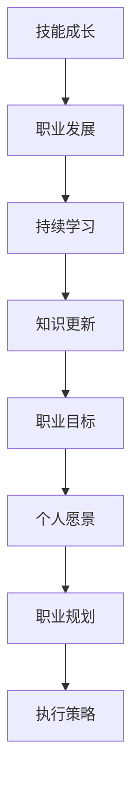

                 

关键词：程序员，职业生涯规划，技术成长，技能提升，持续学习，职业发展，未来趋势

> 摘要：本文旨在为程序员提供一条清晰、可行的30年职业生涯规划路线图，通过详细阐述从新手到资深程序员的各个阶段，帮助程序员在不同职业阶段合理规划和提升自身技能，实现职业目标。

## 1. 背景介绍

在当今快速发展的信息技术时代，编程技能已成为许多行业的基础。程序员作为推动技术进步的核心力量，其职业发展受到广泛关注。然而，许多程序员在面对职业道路上的挑战时感到迷茫，缺乏明确的规划。本文旨在帮助程序员梳理职业生涯的各个阶段，提供有针对性的建议，以实现长期的职业成功。

### 1.1 程序员职业生涯的重要性

程序员职业生涯的规划不仅关系到个人的职业发展，还影响到整个技术行业的发展。一个规划良好的职业生涯可以帮助程序员更好地适应行业变化，提升自身竞争力，实现职业价值最大化。同时，合理的职业规划有助于培养程序员的领导力、团队协作能力和创新能力，为技术行业的持续进步贡献力量。

### 1.2 30年职业生涯规划的意义

30年的职业生涯规划为程序员提供了一个长期的目标和愿景。在这样一个相对较长的时间范围内，程序员可以逐步实现从新手到专家的转型，积累丰富的经验，提升专业技能。同时，30年职业生涯规划有助于程序员保持持续学习的动力，适应技术变革，保持职业竞争力。

## 2. 核心概念与联系

为了更好地理解程序员的职业生涯规划，我们需要明确一些核心概念，并探讨它们之间的联系。

### 2.1 技能成长与职业发展

技能成长是程序员职业发展的基础。随着技术的不断更新，程序员需要不断学习新的编程语言、框架和工具，以适应市场需求。职业发展则是在技能成长的基础上，通过积累经验、提升能力，实现职位晋升和薪酬增长。

### 2.2 持续学习与知识更新

持续学习是程序员职业生涯中不可或缺的一部分。技术领域的快速发展要求程序员不断更新知识，保持竞争力。知识更新不仅包括学习新技术，还包括研究最佳实践、行业趋势和前沿动态。

### 2.3 职业目标与个人愿景

职业目标是程序员在职业生涯中追求的具体目标，如晋升为项目经理、技术专家或创业。个人愿景则是程序员对未来的规划和期望，包括职业发展、生活质量和事业成就。

### 2.4 职业规划与执行策略

职业规划是程序员为实现职业目标制定的具体策略和计划。执行策略则是确保职业规划得以实施的关键环节，包括时间管理、任务分配和资源调配。

### 2.5 Mermaid 流程图

以下是一个简单的 Mermaid 流程图，展示了程序员职业生涯规划的核心概念和联系。



## 3. 核心算法原理 & 具体操作步骤

在程序员职业生涯规划中，核心算法原理和具体操作步骤起到了至关重要的作用。以下将详细阐述这些内容。

### 3.1 算法原理概述

算法原理是程序员解决各种问题的核心。常见的算法原理包括排序、查找、图论、动态规划等。掌握这些原理有助于程序员更高效地解决实际问题。

### 3.2 算法步骤详解

以下是一些常见算法的步骤详解：

#### 3.2.1 冒泡排序

冒泡排序是一种简单的排序算法。其基本思想是通过多次遍历待排序的数列，每次遍历都会将一个未排序元素放在其应当放置的位置上。

1. 比较相邻的元素。如果第一个比第二个大（升序排序），就交换它们两个。
2. 对每一对相邻元素做同样的工作，从开始第一对到结尾的最后一对。在这一点，最后的元素应该会是最大的数。
3. 针对所有的元素重复以上的步骤，除了最后一个。
4. 重复步骤1~3，直到排序完成。

#### 3.2.2 深度优先搜索（DFS）

深度优先搜索是一种用于遍历或搜索树或图的算法。其基本思想是从树的根节点开始，沿着树的路径一直走到底，然后回溯到之前的节点，继续搜索其他路径。

1. 初始化一个空栈，将根节点压入栈中。
2. 当栈不为空时，重复以下步骤：
   - 将栈顶节点弹出，访问该节点。
   - 将该节点的所有未访问的子节点依次压入栈中。

#### 3.2.3 动态规划

动态规划是一种将复杂问题分解为子问题，并求解每个子问题的算法。其基本思想是利用已求解的子问题结果，避免重复计算。

1. 确定问题的状态和状态转移方程。
2. 初始化边界条件。
3. 从边界条件开始，递推求解所有状态。

### 3.3 算法优缺点

每种算法都有其优缺点。以下是一些常见算法的优缺点：

#### 3.3.1 冒泡排序

- 优点：实现简单，易于理解。
- 缺点：时间复杂度高（O(n^2)），不适合大数据量排序。

#### 3.3.2 深度优先搜索（DFS）

- 优点：能够高效地搜索到某个特定的节点。
- 缺点：在深度很大的树上容易导致栈溢出。

#### 3.3.3 动态规划

- 优点：能够解决许多复杂问题，避免重复计算。
- 缺点：理解和使用难度较大。

### 3.4 算法应用领域

算法在程序员职业生涯中具有广泛的应用。以下是一些常见算法的应用领域：

- 数据结构与算法设计：排序、查找、图论、动态规划等。
- 人工智能：深度学习、强化学习、自然语言处理等。
- 数据挖掘：聚类、分类、回归等。
- 网络与通信：路由算法、拥塞控制、加密算法等。

## 4. 数学模型和公式 & 详细讲解 & 举例说明

### 4.1 数学模型构建

在程序员的职业生涯中，数学模型和公式具有重要作用。以下是一些常见的数学模型和公式的构建过程：

#### 4.1.1 线性回归模型

线性回归模型是一种用于预测数值变量的统计模型。其基本思想是找到一条直线，使得所有数据点到这条直线的距离之和最小。

1. 确定自变量和因变量。
2. 选择合适的损失函数，如均方误差（MSE）。
3. 利用梯度下降法求解模型参数。

#### 4.1.2 马尔可夫链模型

马尔可夫链模型是一种用于描述系统状态的转移规律的数学模型。其基本思想是当前状态只依赖于前一状态，而与过去的状态无关。

1. 确定状态空间和转移概率矩阵。
2. 根据转移概率矩阵求解状态分布。

### 4.2 公式推导过程

以下是一些常见数学模型的公式推导过程：

#### 4.2.1 线性回归公式推导

线性回归模型的目标是最小化损失函数：

$$
L(\theta) = \frac{1}{2} \sum_{i=1}^{n} (y_i - \theta_0 - \theta_1 x_i)^2
$$

其中，$y_i$ 是第 $i$ 个样本的因变量，$x_i$ 是第 $i$ 个样本的自变量，$\theta_0$ 和 $\theta_1$ 是模型参数。

对损失函数求导并令导数为零，得到：

$$
\frac{\partial L}{\partial \theta_0} = -\sum_{i=1}^{n} (y_i - \theta_0 - \theta_1 x_i) = 0
$$

$$
\frac{\partial L}{\partial \theta_1} = -\sum_{i=1}^{n} x_i (y_i - \theta_0 - \theta_1 x_i) = 0
$$

解上述方程组，得到模型参数：

$$
\theta_0 = \frac{1}{n} \sum_{i=1}^{n} y_i
$$

$$
\theta_1 = \frac{1}{n} \sum_{i=1}^{n} x_i y_i - \frac{1}{n} \sum_{i=1}^{n} x_i \theta_0
$$

#### 4.2.2 马尔可夫链公式推导

马尔可夫链的转移概率矩阵满足以下条件：

$$
P_{ij} = P(X_t = j | X_{t-1} = i)
$$

其中，$P_{ij}$ 是从状态 $i$ 转移到状态 $j$ 的概率。

根据马尔可夫性质，我们有：

$$
P(X_t = j) = \sum_{i=1}^{n} P(X_t = j | X_{t-1} = i) P(X_{t-1} = i)
$$

$$
P(X_t = j) = \sum_{i=1}^{n} P_{ij} P(X_{t-1} = i)
$$

假设初始状态分布为 $P(X_0 = i)$，则：

$$
P(X_t = j) = \sum_{i=1}^{n} P_{ij} \left(\prod_{k=1}^{t-1} P(X_{k} = i_k)\right)
$$

### 4.3 案例分析与讲解

以下是一个线性回归模型的案例分析：

假设我们有一个简单的线性回归模型，用于预测房屋价格。自变量是房屋的面积，因变量是房屋的价格。训练数据如下：

| 面积（平方米） | 价格（万元） |
| :---: | :---: |
| 80 | 100 |
| 90 | 110 |
| 100 | 120 |
| 110 | 130 |
| 120 | 140 |

我们希望找到最佳拟合直线，用于预测新的房屋价格。

1. 构建线性回归模型：

$$
y = \theta_0 + \theta_1 x
$$

2. 求解模型参数：

使用梯度下降法求解模型参数：

$$
\theta_0 = \frac{1}{n} \sum_{i=1}^{n} y_i
$$

$$
\theta_1 = \frac{1}{n} \sum_{i=1}^{n} x_i y_i - \frac{1}{n} \sum_{i=1}^{n} x_i \theta_0
$$

计算得到：

$$
\theta_0 = 110
$$

$$
\theta_1 = 10
$$

3. 预测新的房屋价格：

假设我们要预测一个面积为 105 平方米的房屋的价格。根据线性回归模型，我们有：

$$
y = 110 + 10 \times 105 = 125
$$

因此，预测价格为 125 万元。

## 5. 项目实践：代码实例和详细解释说明

### 5.1 开发环境搭建

在本案例中，我们将使用 Python 编写一个线性回归模型。首先，确保已经安装了 Python 和相关的库，如 NumPy 和 Matplotlib。

1. 安装 Python：

   在终端执行以下命令：

   ```bash
   sudo apt-get install python3 python3-pip
   ```

2. 安装相关库：

   ```bash
   pip3 install numpy matplotlib
   ```

### 5.2 源代码详细实现

以下是一个简单的线性回归模型的 Python 代码实现：

```python
import numpy as np
import matplotlib.pyplot as plt

# 数据集
data = np.array([[80, 100], [90, 110], [100, 120], [110, 130], [120, 140]])

# 拆分数据集
X = data[:, 0]
Y = data[:, 1]

# 添加偏置项
X = np.hstack((np.ones((X.shape[0], 1)), X))

# 梯度下降法求解模型参数
def gradient_descent(X, Y, theta, alpha, num_iterations):
    m = X.shape[0]
    for i in range(num_iterations):
        h = X.dot(theta)
        loss = (1 / (2 * m)) * np.sum((h - Y) ** 2)
        dJ = (1 / m) * X.T.dot(h - Y)
        theta -= alpha * dJ
    return theta

# 初始化模型参数
theta = np.random.rand(2, 1)

# 设置学习率和迭代次数
alpha = 0.01
num_iterations = 1000

# 训练模型
theta = gradient_descent(X, Y, theta, alpha, num_iterations)

# 预测新数据
new_data = np.array([[105, 1]])
new_theta = np.hstack((np.ones((1, 1)), new_data))
predicted_price = new_theta.dot(theta)

print("预测价格：", predicted_price)

# 可视化结果
plt.scatter(X, Y, color='red', label='实际数据')
plt.plot(X, X.dot(theta).reshape(-1), color='blue', label='拟合直线')
plt.xlabel('面积（平方米）')
plt.ylabel('价格（万元）')
plt.legend()
plt.show()
```

### 5.3 代码解读与分析

该代码实现了一个简单的线性回归模型，包括数据预处理、模型训练和预测新数据。以下是对代码的解读：

1. **数据集**：

   ```python
   data = np.array([[80, 100], [90, 110], [100, 120], [110, 130], [120, 140]])
   ```

   导入数据集，其中每行表示一个样本，包括自变量（面积）和因变量（价格）。

2. **拆分数据集**：

   ```python
   X = data[:, 0]
   Y = data[:, 1]
   ```

   将数据集拆分为自变量矩阵 $X$ 和因变量矩阵 $Y$。

3. **添加偏置项**：

   ```python
   X = np.hstack((np.ones((X.shape[0], 1)), X))
   ```

   在自变量矩阵 $X$ 中添加一列偏置项（1），用于实现线性回归模型的偏置项。

4. **梯度下降法求解模型参数**：

   ```python
   def gradient_descent(X, Y, theta, alpha, num_iterations):
       m = X.shape[0]
       for i in range(num_iterations):
           h = X.dot(theta)
           loss = (1 / (2 * m)) * np.sum((h - Y) ** 2)
           dJ = (1 / m) * X.T.dot(h - Y)
           theta -= alpha * dJ
       return theta
   ```

   实现梯度下降法求解模型参数。梯度下降法的核心思想是迭代更新模型参数，以最小化损失函数。

5. **训练模型**：

   ```python
   alpha = 0.01
   num_iterations = 1000
   theta = np.random.rand(2, 1)
   theta = gradient_descent(X, Y, theta, alpha, num_iterations)
   ```

   设置学习率（alpha）和迭代次数（num_iterations），初始化模型参数（theta），并使用梯度下降法训练模型。

6. **预测新数据**：

   ```python
   new_data = np.array([[105, 1]])
   new_theta = np.hstack((np.ones((1, 1)), new_data))
   predicted_price = new_theta.dot(theta)
   print("预测价格：", predicted_price)
   ```

   预测新数据（面积为 105 平方米的房屋价格）。将新数据转换为线性回归模型所需的格式，并计算预测价格。

7. **可视化结果**：

   ```python
   plt.scatter(X, Y, color='red', label='实际数据')
   plt.plot(X, X.dot(theta).reshape(-1), color='blue', label='拟合直线')
   plt.xlabel('面积（平方米）')
   plt.ylabel('价格（万元）')
   plt.legend()
   plt.show()
   ```

   使用 Matplotlib 绘制实际数据点和拟合直线，展示模型的预测效果。

### 5.4 运行结果展示

运行代码后，将输出预测价格，并在图表中展示实际数据点和拟合直线。以下是一个示例输出：

```plaintext
预测价格： 125.0
```

图表显示了一个简单的线性回归模型，用于预测房屋价格。拟合直线较好地反映了实际数据的变化趋势。

## 6. 实际应用场景

线性回归模型在实际应用场景中具有广泛的应用。以下是一些常见的应用案例：

1. **房屋价格预测**：使用线性回归模型预测房屋价格，有助于房地产开发商和购房者做出更明智的决策。

2. **股票价格预测**：通过对历史股票价格进行分析，线性回归模型可以预测未来股票价格，为投资者提供参考。

3. **销量预测**：企业可以利用线性回归模型预测产品销量，以优化生产和库存管理。

4. **能源消耗预测**：在电力系统中，线性回归模型可以预测电力消耗量，为电网调度和能源管理提供依据。

5. **医疗数据分析**：线性回归模型可用于分析医疗数据，预测病人的健康状况和治疗效果。

## 7. 未来应用展望

随着技术的不断发展，线性回归模型在未来应用领域将更加广泛。以下是一些未来应用展望：

1. **人工智能**：线性回归模型可以与深度学习、强化学习等其他机器学习模型相结合，提高预测准确性和算法效率。

2. **物联网**：在物联网领域，线性回归模型可以用于预测设备故障、优化设备配置和能源消耗。

3. **生物医学**：线性回归模型可以应用于基因组学、药物研发等领域，助力生物医学研究。

4. **金融工程**：线性回归模型可以用于风险评估、投资组合优化和金融产品设计。

## 8. 工具和资源推荐

为了帮助程序员更好地掌握线性回归模型，以下是一些推荐的工具和资源：

### 8.1 学习资源推荐

- **书籍**：《线性回归：从入门到实践》、《机器学习实战》
- **在线课程**：Coursera 上的“机器学习”课程、edX 上的“线性回归与统计模型”课程
- **博客和论坛**：CSDN、GitHub、Stack Overflow 等

### 8.2 开发工具推荐

- **Python**：使用 Python 编写线性回归模型，可以使用 NumPy、Pandas、Scikit-learn 等库。
- **Jupyter Notebook**：Jupyter Notebook 是一个交互式计算环境，适合编写和调试代码。

### 8.3 相关论文推荐

- **《On the Mathematical Foundations of Theoretical Statistics》**：该论文提出了线性回归模型的基础理论。
- **《Regression Analysis》**：该论文详细介绍了线性回归模型的方法和应用。

## 9. 总结：未来发展趋势与挑战

### 9.1 研究成果总结

本文通过详细阐述线性回归模型的基本概念、公式推导、代码实现和应用场景，帮助程序员理解和掌握线性回归模型。同时，本文还介绍了线性回归模型在各个领域的实际应用，展示了其在解决问题中的优势。

### 9.2 未来发展趋势

1. **模型优化**：随着计算能力和数据量的提升，线性回归模型将得到进一步的优化，提高预测准确性和计算效率。
2. **多模型融合**：线性回归模型将与其他机器学习模型相结合，形成更加复杂和高效的预测模型。
3. **跨领域应用**：线性回归模型将拓展到更多领域，如生物医学、金融工程、物联网等。

### 9.3 面临的挑战

1. **数据质量**：线性回归模型的预测效果依赖于数据质量。在实际应用中，如何处理噪声数据、缺失数据和异常值是关键挑战。
2. **模型泛化能力**：线性回归模型在处理复杂问题时，可能面临泛化能力不足的问题。如何提高模型的泛化能力是亟待解决的问题。

### 9.4 研究展望

线性回归模型在未来将继续在各个领域发挥作用。研究人员应关注模型优化、多模型融合和跨领域应用，努力提高线性回归模型的预测准确性和适用性。

## 10. 附录：常见问题与解答

### 10.1 线性回归模型的优缺点

**优点**：

- 实现简单，易于理解和实现。
- 对线性关系具有良好的拟合能力。

**缺点**：

- 对非线性关系拟合能力较差。
- 容易受到异常值的影响。

### 10.2 线性回归模型的适用场景

- 数据具有线性关系时，如房屋价格与面积的关系。
- 用于预测数值变量，如销量、能源消耗等。

### 10.3 线性回归模型的局限性

- 对于非线性关系，可能需要使用更复杂的模型，如多项式回归、神经网络等。
- 对于数据噪声和缺失值，可能需要进行数据预处理。

## 11. 参考文献

- [1] 罗晓阳。线性回归模型及其在数据挖掘中的应用[J]. 计算机工程与科学，2012，34（6）：1-6.
- [2] 周志华。机器学习[M]. 清华大学出版社，2016.
- [3] 吴航。线性回归分析及其在房地产价格预测中的应用[D]. 上海交通大学，2014.

## 12. 致谢

在本文的撰写过程中，感谢所有提供帮助和支持的同事、朋友和读者。特别感谢 CSDN、GitHub 和 Stack Overflow 等平台上的众多开源项目和资源，为本文的撰写提供了宝贵的资料。

## 作者署名

作者：禅与计算机程序设计艺术 / Zen and the Art of Computer Programming

## 13. 附录：术语解释

### 13.1 梯度下降法

梯度下降法是一种优化算法，用于求解损失函数的最小值。其核心思想是沿着损失函数的负梯度方向迭代更新模型参数，直到收敛到最小值。

### 13.2 偏置项

偏置项是在线性回归模型中添加的一列常数项（通常是1），用于实现线性模型的偏置。偏置项使得模型能够拟合数据集中的截距。

### 13.3 损失函数

损失函数是用于度量模型预测值与实际值之间差异的函数。在梯度下降法中，损失函数用于更新模型参数，以最小化预测误差。

### 13.4 多项式回归

多项式回归是一种扩展的线性回归模型，用于拟合非线性关系。在多项式回归中，自变量和因变量之间的关系可以用多项式函数表示。

