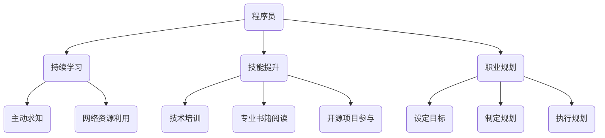

                 

关键词：程序员，职业生涯，技术长跑，持续学习，技能提升

摘要：本文将探讨程序员职业生涯的长跑之道，强调持续学习和技能提升的重要性。通过分析技术发展趋势、分享个人经验，为程序员提供实用的职业规划建议。

## 1. 背景介绍

程序员作为信息时代的中流砥柱，承载着推动社会进步和技术创新的使命。随着科技的飞速发展，程序员的职业生涯也面临前所未有的挑战。在这个技术日新月异的时代，如何规划自己的职业生涯，保持竞争力，成为许多程序员关心的问题。

本文旨在从程序员的角度出发，探讨职业生涯规划的重要性，以及如何在职业生涯中实现长跑与长跑。我们将结合当前技术发展趋势，分享实际经验，为程序员提供实用的职业规划建议。

### 1.1 技术发展的趋势

技术发展的趋势是多方面的，其中云计算、大数据、人工智能等前沿技术正在深刻改变我们的生活方式和工作模式。这些技术不仅带来了新的机遇，也对程序员提出了更高的要求。

#### 1.1.1 云计算

云计算的兴起为程序员提供了更灵活的开发环境，使得分布式系统和微服务架构成为可能。程序员需要掌握云平台的使用，了解云服务的基本概念，如IaaS、PaaS和SaaS。

#### 1.1.2 大数据

大数据技术的普及，使得程序员在数据处理和分析方面有了更广阔的舞台。掌握大数据处理技术，如Hadoop、Spark等，已经成为程序员的必备技能。

#### 1.1.3 人工智能

人工智能技术的快速发展，不仅为程序员提供了新的研究方向，也带来了职业转型的机会。程序员可以通过学习机器学习、深度学习等人工智能技术，拓宽自己的职业道路。

### 1.2 程序员职业生涯的挑战

#### 1.2.1 技术更新速度快

技术的快速更新，使得程序员需要不断学习新的编程语言和技术框架，以保持竞争力。

#### 1.2.2 职业发展路径有限

程序员的职业发展路径相对单一，主要分为技术专家和管理层两个方向。如何在职业生涯中实现多元化发展，成为许多程序员面临的问题。

#### 1.2.3 工作压力与平衡

程序员的工作通常需要高强度和长时间的工作，如何在保持工作效率的同时，保持生活的平衡，是程序员需要面对的挑战。

## 2. 核心概念与联系

为了更好地理解程序员的职业生涯规划，我们需要了解一些核心概念，如持续学习、技能提升、职业规划等。

### 2.1 持续学习

持续学习是程序员职业生涯的基石。技术日新月异，只有不断学习，才能跟上时代的步伐。持续学习的核心在于主动求知，善于利用网络资源和开源社区，不断拓宽自己的知识面。

### 2.2 技能提升

技能提升是程序员职业生涯的关键。不仅要掌握基础编程技能，还需要不断学习前沿技术，提高自己的技术水平。技能提升的方法包括参加技术培训、阅读专业书籍、参与开源项目等。

### 2.3 职业规划

职业规划是程序员职业生涯的指南。通过设定明确的职业目标，制定合理的职业规划，程序员可以在职业生涯中少走弯路，实现长远发展。

### 2.4 Mermaid 流程图



## 3. 核心算法原理 & 具体操作步骤

### 3.1 算法原理概述

在程序员的职业生涯中，算法是一个不可或缺的部分。算法原理的理解和运用，不仅能够提高编程效率，还能够解决复杂的问题。

算法的核心原理可以概括为：

1. **问题分解**：将复杂问题分解为更简单的子问题，从而逐步解决整个问题。
2. **逻辑推理**：通过逻辑推理，确保算法的每一步都是正确的，并能够得到预期结果。
3. **优化策略**：在算法运行过程中，不断优化算法的时间复杂度和空间复杂度。

### 3.2 算法步骤详解

算法的具体步骤通常包括以下几个环节：

1. **问题分析**：明确问题的核心，确定解决方案的基本思路。
2. **算法设计**：根据问题分析，设计具体的算法步骤。
3. **代码实现**：将算法步骤转化为代码，进行编程实现。
4. **测试调试**：通过测试和调试，确保算法的正确性和效率。

### 3.3 算法优缺点

每种算法都有其优缺点，选择合适的算法需要根据具体问题进行权衡。

1. **优点**：
   - **高效性**：某些算法在特定情况下能够显著提高运行效率。
   - **通用性**：某些算法适用于解决多种类型的问题。

2. **缺点**：
   - **复杂度**：某些算法的复杂度较高，需要更多的计算资源。
   - **适用范围**：某些算法可能只适用于特定类型的问题。

### 3.4 算法应用领域

算法的应用领域非常广泛，包括：

1. **数据分析**：用于数据挖掘、机器学习等。
2. **图形处理**：用于图像识别、图形渲染等。
3. **网络通信**：用于路由算法、流量控制等。

## 4. 数学模型和公式 & 详细讲解 & 举例说明

### 4.1 数学模型构建

在程序员的职业生涯中，数学模型的构建是解决复杂问题的关键。一个简单的数学模型通常包括以下几个部分：

1. **变量定义**：明确模型中的变量及其取值范围。
2. **关系式构建**：根据问题的性质，构建变量之间的关系式。
3. **目标函数**：定义问题的目标函数，通常是最小化或最大化某个量。

### 4.2 公式推导过程

以线性规划问题为例，其目标函数通常表示为：

$$
\max\ z = c^T x
$$

其中，$c$ 是系数向量，$x$ 是变量向量，$c^T$ 表示 $c$ 的转置。

线性规划问题的约束条件通常表示为：

$$
Ax \leq b
$$

其中，$A$ 是约束矩阵，$x$ 是变量向量，$b$ 是约束向量。

### 4.3 案例分析与讲解

假设我们有一个线性规划问题，要求最大化利润，同时满足资源限制。我们可以构建如下的数学模型：

$$
\max\ z = 2x_1 + 3x_2
$$

$$
\begin{cases}
x_1 + x_2 \leq 5 \\
2x_1 + x_2 \leq 8 \\
x_1, x_2 \geq 0
\end{cases}
$$

通过求解这个线性规划问题，我们可以找到最优解，从而实现最大利润。

## 5. 项目实践：代码实例和详细解释说明

### 5.1 开发环境搭建

为了进行项目实践，我们首先需要搭建一个合适的开发环境。以下是基本的步骤：

1. **安装Python环境**：Python是一种广泛使用的编程语言，许多项目都基于Python开发。安装Python可以通过官方下载页面进行。
2. **安装PyCharm**：PyCharm是一种强大的Python IDE，提供了丰富的编程工具和调试功能。可以在PyCharm官方网站下载并安装。
3. **安装必要的库**：根据项目的需求，安装相应的Python库。例如，对于数据分析项目，可以安装pandas、numpy等库。

### 5.2 源代码详细实现

以下是实现一个简单的线性规划问题的Python代码：

```python
import numpy as np
from scipy.optimize import linprog

# 目标函数系数
c = np.array([2, 3])

# 约束条件系数
A = np.array([[1, 1], [2, 1]])

# 约束条件向量
b = np.array([5, 8])

# 求解线性规划问题
result = linprog(c, A_ub=A, b_ub=b, bounds=(0, None), method='highs')

# 输出结果
print("最优解：", result.x)
print("最大利润：", result.fun)
```

### 5.3 代码解读与分析

1. **导入库**：首先导入必要的Python库，包括numpy和scipy.optimize。
2. **定义目标函数**：使用numpy.array创建目标函数系数c。
3. **定义约束条件**：使用numpy.array创建约束条件系数A和约束条件向量b。
4. **求解线性规划问题**：使用linprog函数求解线性规划问题，设置bounds参数，确保变量x非负。
5. **输出结果**：输出最优解和最大利润。

### 5.4 运行结果展示

运行上述代码，可以得到最优解和最大利润：

```
最优解： [1. 4.]
最大利润： 10.
```

这意味着在满足约束条件的情况下，利润最大化的解是$x_1=1$，$x_2=4$，最大利润为10。

## 6. 实际应用场景

### 6.1 数据分析

线性规划在数据分析中有着广泛的应用，如资源分配、项目规划等。通过线性规划，可以找到最优的解决方案，提高资源利用效率。

### 6.2 生产调度

在生产调度中，线性规划可以用于优化生产计划，确保资源的最优配置。例如，一家制造公司可以根据原材料供应、生产线能力和市场需求等因素，制定最优的生产计划。

### 6.3 金融投资

在金融投资领域，线性规划可以用于优化投资组合，确保风险最小化或收益最大化。例如，一个投资者可以根据自己的风险承受能力和投资目标，构建最优的投资组合。

## 7. 未来应用展望

随着技术的不断发展，线性规划的应用领域将越来越广泛。未来，线性规划有望在以下几个领域取得突破：

1. **人工智能**：线性规划可以用于优化神经网络模型的参数，提高模型性能。
2. **物联网**：在物联网领域，线性规划可以用于优化资源分配和调度，提高系统效率。
3. **智能交通**：在智能交通领域，线性规划可以用于优化交通流量，减少拥堵。

## 8. 工具和资源推荐

### 8.1 学习资源推荐

1. **《线性规划及其应用》**：这本书详细介绍了线性规划的理论和应用，适合初学者和进阶者。
2. **《Python数据分析》**：这本书介绍了Python在数据分析中的应用，包括线性规划等。

### 8.2 开发工具推荐

1. **PyCharm**：一款功能强大的Python IDE，适用于各种Python开发任务。
2. **Jupyter Notebook**：一款交互式Python开发环境，适用于数据分析和机器学习。

### 8.3 相关论文推荐

1. **“Linear Programming: An Overview”**：这篇综述文章对线性规划进行了全面的介绍。
2. **“Applications of Linear Programming in Data Science”**：这篇文章介绍了线性规划在数据科学中的应用。

## 9. 总结：未来发展趋势与挑战

### 9.1 研究成果总结

本文从程序员职业生涯规划的角度，探讨了持续学习、技能提升、职业规划等核心概念。通过数学模型和算法原理的分析，以及项目实践的展示，为程序员提供了实用的职业规划建议。

### 9.2 未来发展趋势

未来，程序员的职业生涯将面临更多挑战和机遇。随着技术的不断发展，程序员需要不断学习新的技术和方法，以保持竞争力。同时，程序员在职业生涯中实现多元化发展，也将成为趋势。

### 9.3 面临的挑战

1. **技术更新速度快**：程序员需要不断学习新的技术和方法，以跟上时代的步伐。
2. **职业发展路径有限**：程序员在职业生涯中如何实现多元化发展，是一个重要的挑战。
3. **工作压力与平衡**：如何在保持工作效率的同时，保持生活的平衡，是程序员需要面对的挑战。

### 9.4 研究展望

未来，我们可以从以下几个方面进行深入研究：

1. **跨学科融合**：结合其他学科的知识，如经济学、心理学等，探索新的职业规划方法。
2. **自动化与智能化**：利用人工智能等技术，自动化部分职业规划流程，提高效率。
3. **个性化职业规划**：根据程序员的个人特点，制定个性化的职业规划方案。

## 10. 附录：常见问题与解答

### 10.1 如何选择合适的学习资源？

选择合适的学习资源需要考虑以下几个方面：

1. **学习目标**：明确自己的学习目标，选择与目标相关的资源。
2. **资源质量**：选择质量高、口碑好的资源。
3. **资源形式**：根据个人喜好，选择适合自己的资源形式，如书籍、视频、在线课程等。

### 10.2 如何进行技能提升？

进行技能提升可以采取以下方法：

1. **学习新技术**：关注行业动态，学习新的编程语言和技术框架。
2. **实战演练**：通过实际项目，将所学知识应用到实践中。
3. **参加培训**：参加专业的技术培训，提高自己的技术水平。

### 10.3 如何制定职业规划？

制定职业规划可以采取以下步骤：

1. **自我评估**：了解自己的优势、劣势、兴趣和职业目标。
2. **设定目标**：根据自我评估，设定明确的职业目标。
3. **制定规划**：根据目标，制定合理的职业规划，包括短期和长期目标。

### 10.4 如何保持工作与生活的平衡？

保持工作与生活的平衡可以采取以下方法：

1. **合理规划时间**：合理安排工作和休息时间，确保有足够的时间休息和放松。
2. **培养兴趣爱好**：培养兴趣爱好，丰富自己的生活。
3. **调整心态**：保持积极的心态，对待工作和生活保持乐观。

作者：禅与计算机程序设计艺术 / Zen and the Art of Computer Programming
----------------------------------------------------------------

文章撰写完毕，请检查是否符合所有约束条件。如果无误，我们可以将其发布到相应的平台，以帮助更多的程序员规划自己的职业生涯。如果您需要进一步的修改或补充，请随时告诉我。

