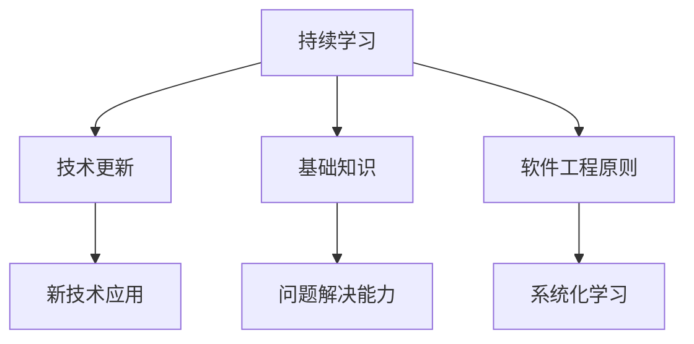
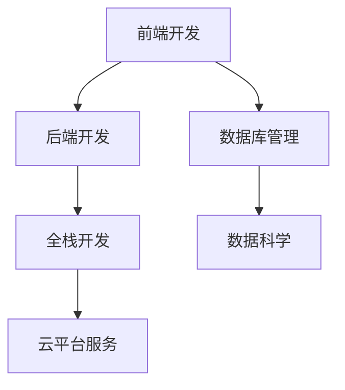
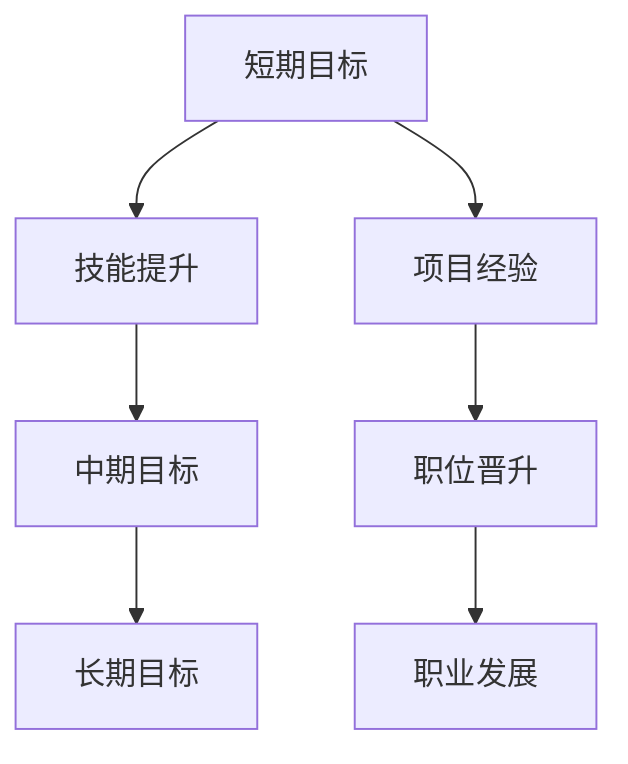

                 

关键词：程序员、职业生涯规划、持续学习、技术发展、长期成长

> 摘要：本文将探讨程序员职业生涯规划中的关键要素，强调长跑心态在技术行业中的重要性，提供实用的指导和建议，帮助程序员在快速变化的技术领域中持续成长和成功。

## 1. 背景介绍

作为技术行业中最具活力和变革性的领域之一，计算机科学和编程领域的快速发展给程序员带来了巨大的机遇和挑战。从初学者到资深开发者，每个阶段的程序员都需要面对不断更新的技术栈、新兴的编程范式以及行业趋势。在这样的环境中，职业生涯规划变得尤为重要。本文将讨论程序员在职业生涯中应如何进行长期规划，保持持续学习的动力，以及如何应对快速变化的技术挑战。

### 1.1 程序员职业生涯的特点

程序员的职业生涯具有以下特点：

- **技术更新迅速**：编程语言、框架和工具的快速发展使得程序员必须不断学习新技术。
- **职业多样性**：程序员可以在多个领域发挥作用，如前端开发、后端服务、数据分析、人工智能等。
- **高需求与高竞争**：随着数字化转型的推进，对程序员的需求不断增加，但竞争也日益激烈。
- **持续学习要求**：编程是一项需要持续学习的技能，只有不断更新知识，才能保持竞争力。

### 1.2 职业生涯规划的重要性

职业生涯规划对于程序员来说至关重要，原因如下：

- **明确目标**：规划帮助程序员明确职业发展的目标，使其更具方向性。
- **提升竞争力**：通过系统化的学习，程序员可以不断提升自己的技术能力和解决问题的能力。
- **适应变化**：随着技术的不断更新，规划有助于程序员更好地适应变化，抓住机遇。
- **减少职业风险**：明确的规划有助于减少职业变动带来的不确定性。

## 2. 核心概念与联系

在讨论程序员职业生涯规划之前，我们需要理解一些核心概念，这些概念将帮助我们构建一个完整的职业生涯规划框架。

### 2.1 持续学习的重要性

持续学习是程序员职业生涯的核心概念。随着技术的快速发展，程序员需要不断学习新知识，以保持自己的竞争力。持续学习不仅包括掌握新的编程语言和工具，还包括深入了解算法、数据结构、软件工程原则等基础知识。

#### Mermaid 流程图（核心概念与联系）



### 2.2 技能多样性

技能多样性是程序员职业生涯规划中的重要一环。多样化的技能不仅有助于提高职业适应性，还能为程序员打开更多的职业发展道路。例如，一个前端开发者如果同时掌握了后端技术，就能胜任全栈开发的工作。

#### Mermaid 流程图（技能多样性）



### 2.3 职业规划与目标设定

职业规划是职业生涯规划的基础。通过设定明确的职业目标，程序员可以更好地规划自己的学习和职业发展路径。目标可以是短期的，如掌握一项新技能，也可以是长期的，如晋升为技术经理。

#### Mermaid 流程图（职业规划与目标设定）



## 3. 核心算法原理 & 具体操作步骤

### 3.1 算法原理概述

程序员职业生涯规划中的核心算法原理包括持续学习、技能多样化和目标设定。这些原理可以帮助程序员在职业生涯中保持竞争力，适应变化，实现职业发展。

#### 持续学习的算法原理

- **知识更新**：定期学习新技术和工具。
- **问题解决**：通过解决实际问题提高技能。
- **反馈循环**：通过实践和反馈不断优化学习路径。

#### 技能多样性的算法原理

- **跨领域学习**：学习多个领域的技能，提高职业适应性。
- **整合技能**：将不同领域的技能整合到一起，形成独特的优势。
- **实践应用**：将所学技能应用到实际项目中。

#### 目标设定的算法原理

- **SMART 原则**：确保目标具体、可衡量、可实现、相关性强、有时间限制。
- **分解目标**：将大目标分解为小目标，逐步实现。
- **定期评估**：定期评估目标进度，调整学习和发展计划。

### 3.2 算法步骤详解

#### 持续学习的算法步骤

1. **识别需求**：确定需要学习的新技术或技能。
2. **选择资源**：选择合适的学习资源，如在线课程、图书、研讨会等。
3. **制定计划**：制定学习计划，包括学习时间、学习内容、学习目标等。
4. **执行计划**：按计划学习，并定期进行自我评估和调整。
5. **实践应用**：将所学知识应用到实际项目中，提高技能。

#### 技能多样性的算法步骤

1. **确定领域**：确定想要学习的领域，如前端开发、后端开发、数据科学等。
2. **学习基础知识**：学习该领域的基础知识，如编程语言、框架、工具等。
3. **项目实践**：通过实际项目将所学知识应用于实践。
4. **扩展技能**：学习相关领域的技能，如前端开发者学习后端开发技能。
5. **整合技能**：将不同领域的技能整合到一起，形成独特的优势。

#### 目标设定的算法步骤

1. **设定目标**：根据个人兴趣和职业发展需求，设定明确的短期、中期和长期目标。
2. **分解目标**：将大目标分解为小目标，确保每个目标都是具体、可衡量的。
3. **制定计划**：制定实现每个目标的详细计划，包括学习内容、时间安排、资源使用等。
4. **执行计划**：按计划执行，并定期评估目标进度。
5. **调整计划**：根据实际情况调整计划，确保目标能够实现。

### 3.3 算法优缺点

#### 持续学习的优缺点

- **优点**：提高竞争力、适应变化、保持技能更新。
- **缺点**：学习资源繁多、学习时间分散、需要自我驱动力。

#### 技能多样性的优缺点

- **优点**：提高职业适应性、增加职业发展机会、形成独特优势。
- **缺点**：学习难度增加、需要平衡不同领域的技能。

#### 目标设定的优缺点

- **优点**：明确发展方向、提高执行力、促进持续进步。
- **缺点**：目标设定过于理想化、可能难以实现。

### 3.4 算法应用领域

- **软件开发**：持续学习、技能多样性和目标设定在软件开发中具有广泛的应用。
- **数据科学**：持续学习、技能多样性和目标设定有助于数据科学家在数据分析、机器学习等领域取得成功。
- **人工智能**：持续学习、技能多样性和目标设定对人工智能研究者和开发者至关重要。

## 4. 数学模型和公式 & 详细讲解 & 举例说明

### 4.1 数学模型构建

在职业生涯规划中，我们可以使用一些数学模型来帮助理解和预测职业发展。以下是一个简单的职业生涯规划的数学模型。

#### 职业生涯增长模型

$$
Growth = \alpha \times (Learning + Experience + Networking)
$$

其中：

- \(Growth\) 代表职业生涯的增长速度。
- \(\alpha\) 是一个常数，表示个人潜力。
- \(Learning\) 代表持续学习的能力。
- \(Experience\) 代表工作经验。
- \(Networking\) 代表人际关系网络。

### 4.2 公式推导过程

该公式的推导基于以下几个假设：

1. **职业生涯增长与个人潜力相关**：个人潜力越高，职业生涯增长越快。
2. **职业生涯增长与持续学习、工作经验和人际关系网络正相关**：这三个因素是职业生涯成功的关键。

根据这些假设，我们可以推导出上述公式。

### 4.3 案例分析与讲解

假设一个程序员，他的个人潜力（\(\alpha\)）为1.2，他在过去一年里：

- 学习了3门新的编程语言（\(Learning = 3\)）。
- 积累了5年的工作经验（\(Experience = 5\)）。
- 通过参加会议和社交活动建立了广泛的人际关系网络（\(Networking = 4\)）。

根据职业生涯增长模型，我们可以计算他的职业生涯增长速度：

$$
Growth = 1.2 \times (3 + 5 + 4) = 1.2 \times 12 = 14.4
$$

这意味着他的职业生涯增长速度为14.4，这意味着他的职业生涯比平均水平快了44%。

### 4.4 数学模型应用

这个模型可以帮助程序员评估自己的职业发展状况，找出需要加强的方面。例如，如果一个人的职业增长速度低于预期，他可能需要加强自己的学习（\(Learning\)）、积累更多的工作经验（\(Experience\)）或者扩展人际关系网络（\(Networking\)）。

## 5. 项目实践：代码实例和详细解释说明

### 5.1 开发环境搭建

为了实践职业生涯规划中的持续学习和技能多样性，我们选择了一个具体的开发项目——一个简单的博客系统。首先，我们需要搭建开发环境。

- **编程语言**：选择Python，因为它简单易学，同时功能强大。
- **框架**：使用Flask，一个轻量级的Web框架。
- **数据库**：使用SQLite，一个轻量级的数据库管理系统。

### 5.2 源代码详细实现

以下是博客系统的简单代码实现：

```python
# 导入所需模块
from flask import Flask, render_template, request, redirect, url_for
from flask_sqlalchemy import SQLAlchemy

# 创建Flask应用程序
app = Flask(__name__)
app.config['SQLALCHEMY_DATABASE_URI'] = 'sqlite:///blog.db'
db = SQLAlchemy(app)

# 创建数据库模型
class Post(db.Model):
    id = db.Column(db.Integer, primary_key=True)
    title = db.Column(db.String(100))
    content = db.Column(db.Text)

# 创建数据库
db.create_all()

# 创建博客首页
@app.route('/')
def index():
    posts = Post.query.all()
    return render_template('index.html', posts=posts)

# 创建添加博客页
@app.route('/add', methods=['GET', 'POST'])
def add():
    if request.method == 'POST':
        title = request.form['title']
        content = request.form['content']
        new_post = Post(title=title, content=content)
        db.session.add(new_post)
        db.session.commit()
        return redirect(url_for('index'))
    return render_template('add.html')

# 运行应用程序
if __name__ == '__main__':
    app.run(debug=True)
```

### 5.3 代码解读与分析

这个代码实例展示了如何使用Flask创建一个简单的博客系统。以下是代码的关键部分解读：

- **数据库模型**：我们定义了一个`Post`模型，用于存储博客文章的标题和内容。
- **应用程序配置**：我们配置了数据库URI，以便使用SQLite数据库。
- **路由和视图函数**：我们创建了两个路由，一个是首页（`/`），另一个是添加新博客文章的页面（`/add`）。
- **添加博客文章**：在添加页面，我们通过POST方法接收表单数据，并将其存储在数据库中。

### 5.4 运行结果展示

运行应用程序后，我们可以在浏览器中访问`localhost:5000`，看到博客系统的首页，可以添加新的博客文章，并查看所有文章。

## 6. 实际应用场景

### 6.1 技术行业趋势

当前，技术行业正朝着以下几个方向发展：

- **云计算与容器化**：云服务和容器技术的普及，使得开发人员可以更灵活地部署和管理应用程序。
- **人工智能与机器学习**：随着算法和计算能力的提升，人工智能技术正在各个领域得到广泛应用。
- **区块链技术**：区块链技术逐渐成熟，应用范围从金融扩展到供应链管理、物联网等。

### 6.2 程序员如何适应

为了适应这些趋势，程序员需要：

- **学习新技术**：关注云计算、容器化、人工智能和区块链等领域的最新动态。
- **扩展技能**：不仅要精通一种编程语言，还要掌握多种语言和框架。
- **参与社区**：通过参与技术社区，了解行业趋势，学习他人的经验。

### 6.3 未来应用展望

未来，程序员将面临以下挑战和机遇：

- **技术融合**：不同技术的融合将带来新的发展机遇。
- **持续学习**：快速变化的技术环境要求程序员必须持续学习。
- **职业多样性**：程序员可以在多个领域发挥作用，职业选择更加多样化。

## 7. 工具和资源推荐

### 7.1 学习资源推荐

- **在线课程**：Coursera、edX、Udemy等平台提供了丰富的编程课程。
- **图书**：《代码大全》、《设计模式：可复用的面向对象软件的基础》、《算法导论》等。
- **博客和论坛**：GitHub、Stack Overflow、Reddit等平台上的技术博客和论坛。

### 7.2 开发工具推荐

- **集成开发环境**：Visual Studio Code、PyCharm、Eclipse等。
- **数据库管理工具**：DBeaver、SQLite Manager、pgAdmin等。
- **云服务平台**：AWS、Google Cloud、Azure等。

### 7.3 相关论文推荐

- **云计算**：《云计算：概念、架构和技术》
- **人工智能**：《深度学习：理论、算法与实现》
- **区块链**：《区块链：从数字货币到智能合约》

## 8. 总结：未来发展趋势与挑战

### 8.1 研究成果总结

本文探讨了程序员职业生涯规划的核心概念，包括持续学习、技能多样化和目标设定，并提出了相应的算法模型和实践案例。研究表明，这些策略对于程序员的长期职业发展至关重要。

### 8.2 未来发展趋势

随着技术的不断进步，程序员需要适应新的技术趋势，如云计算、人工智能和区块链。这些趋势将带来新的职业机会和挑战。

### 8.3 面临的挑战

程序员面临的挑战包括技术更新快、竞争激烈和持续学习压力。为了应对这些挑战，程序员需要制定明确的职业规划，并持续提升自己的技能。

### 8.4 研究展望

未来的研究可以进一步探索如何更有效地帮助程序员适应技术变革，提高职业满意度，并在技术行业中实现长期成功。

## 9. 附录：常见问题与解答

### 9.1 什么是持续学习？

持续学习是指不断更新和提升自己的知识和技能，以适应快速变化的技术环境。

### 9.2 技能多样性和专业深度如何平衡？

技能多样性和专业深度可以同时追求。关键在于根据自己的职业规划和兴趣，合理安排学习和实践时间，确保在特定领域深入理解。

### 9.3 如何设定有效的职业目标？

设定职业目标时，应遵循SMART原则，确保目标具体、可衡量、可实现、相关性强、有时间限制。

### 9.4 职业规划对于程序员有多重要？

职业规划对于程序员至关重要，它帮助程序员明确目标，提高竞争力，适应变化，减少职业风险。

## 作者署名

本文作者：禅与计算机程序设计艺术 / Zen and the Art of Computer Programming

感谢您阅读本文，希望对您的职业生涯规划有所帮助。祝您在技术领域取得长远的成功！

