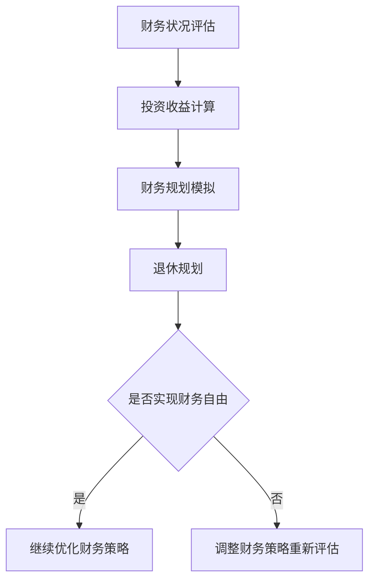

                 

关键词：财务自由、计算器、程序开发、算法、数学模型、实践案例

> 摘要：本文旨在探讨如何为程序员开发一款能够帮助他们实现财务自由的计算器。我们将从核心概念、算法原理、数学模型、项目实践以及未来展望等多个角度展开，帮助程序员理解并运用这一工具。

## 1. 背景介绍

在现代社会，财务自由成为越来越多人的追求目标。对程序员而言，财务自由不仅意味着财务上的独立，更是职业生涯稳定发展的象征。然而，实现财务自由并非易事，需要缜密的规划和精心的管理。因此，开发一款能够帮助程序员进行财务规划的计算机工具显得尤为重要。

这款财务自由计算器不仅要简单易用，还需要能够进行复杂的财务计算，如投资收益计算、财务规划模拟等。通过这款工具，程序员可以更清晰地了解自己的财务状况，做出更明智的财务决策，从而逐步实现财务自由。

## 2. 核心概念与联系

### 2.1 财务自由的概念

财务自由是指一个人无需依靠工资收入，而是通过理财投资等方式获得稳定的现金流，从而能够维持自己的生活方式和追求。简单地说，财务自由就是你的被动收入超过你的日常生活开支。

### 2.2 财务自由计算器的基本功能

- **财务状况评估**：对用户的收入、支出、债务等财务状况进行评估。
- **投资收益计算**：计算不同投资方式的收益情况。
- **财务规划模拟**：模拟不同财务策略下的未来财务状况。
- **退休规划**：根据用户设定的退休目标和当前财务状况，计算实现目标的路径。

### 2.3 Mermaid 流程图



## 3. 核心算法原理 & 具体操作步骤

### 3.1 算法原理概述

财务自由计算器主要依赖以下核心算法：

- **线性回归**：用于预测财务状况的变化趋势。
- **复利计算**：用于计算投资收益。
- **蒙特卡洛模拟**：用于财务规划模拟。

### 3.2 算法步骤详解

#### 3.2.1 线性回归算法

1. **收集财务数据**：包括历史收入、支出、投资收益等。
2. **特征工程**：将原始数据转换为适合线性回归的格式。
3. **模型训练**：使用线性回归算法训练模型。
4. **模型评估**：评估模型预测准确率。

#### 3.2.2 复利计算算法

1. **输入参数**：投资本金、年化收益率、投资期限。
2. **计算复利**：使用复利公式 \(A = P(1 + r/n)^{nt}\) 计算投资收益。
3. **输出结果**：显示投资收益。

#### 3.2.3 蒙特卡洛模拟算法

1. **设定模拟参数**：如模拟次数、初始财务状况等。
2. **随机抽样**：根据设定的概率分布生成随机数。
3. **计算财务状况**：根据随机抽样结果计算不同策略下的财务状况。
4. **结果统计**：统计模拟结果，评估不同策略的可行性。

### 3.3 算法优缺点

#### 3.3.1 线性回归

- **优点**：计算简单，适用于趋势预测。
- **缺点**：对于非线性关系的表现较差。

#### 3.3.2 复利计算

- **优点**：精确计算投资收益。
- **缺点**：适用于短期投资，对长期投资预测能力有限。

#### 3.3.3 蒙特卡洛模拟

- **优点**：适用于复杂系统模拟，提供概率分布。
- **缺点**：计算量大，对计算资源要求较高。

### 3.4 算法应用领域

- **财务规划**：用于模拟不同财务策略的效果。
- **投资分析**：用于评估不同投资方式的收益。
- **风险管理**：用于预测财务风险。

## 4. 数学模型和公式 & 详细讲解 & 举例说明

### 4.1 数学模型构建

财务自由计算器中的数学模型主要包括线性回归模型和复利计算模型。

#### 4.1.1 线性回归模型

线性回归模型的基本公式为：

$$y = \beta_0 + \beta_1 x$$

其中，\(y\) 是因变量，\(x\) 是自变量，\(\beta_0\) 和 \(\beta_1\) 分别是截距和斜率。

#### 4.1.2 复利计算模型

复利计算模型的基本公式为：

$$A = P(1 + r/n)^{nt}$$

其中，\(A\) 是最终金额，\(P\) 是本金，\(r\) 是年化收益率，\(n\) 是每年计息次数，\(t\) 是投资期限（年）。

### 4.2 公式推导过程

#### 4.2.1 线性回归模型

线性回归模型的推导主要涉及最小二乘法。通过最小化残差平方和来求解 \(\beta_0\) 和 \(\beta_1\)。

$$\min \sum_{i=1}^{n} (y_i - (\beta_0 + \beta_1 x_i))^2$$

#### 4.2.2 复利计算模型

复利计算模型的推导基于复利原理。通过对本金进行连续复利计算，得到最终金额。

### 4.3 案例分析与讲解

#### 4.3.1 线性回归模型应用

假设某程序员的年收入为 \(x\) 万元，其收入增长率 \(\beta_1\) 为 0.05。我们可以使用线性回归模型预测未来 5 年的收入。

$$y = 12 + 0.05x$$

当 \(x = 30\) 时，预测年收入为 \(12 + 0.05 \times 30 = 18\) 万元。

#### 4.3.2 复利计算模型应用

假设某程序员投资 10 万元，年化收益率 5%，投资期限为 10 年。我们可以使用复利计算模型计算投资收益。

$$A = 10(1 + 0.05/1)^{1 \times 10} = 10 \times 1.6386 = 16.386$$

投资收益为 6.386 万元。

## 5. 项目实践：代码实例和详细解释说明

### 5.1 开发环境搭建

- **编程语言**：Python
- **依赖库**：NumPy、Pandas、Scikit-learn、Matplotlib

### 5.2 源代码详细实现

```python
import numpy as np
import pandas as pd
from sklearn.linear_model import LinearRegression
from sklearn.metrics import mean_squared_error
import matplotlib.pyplot as plt

# 5.2.1 线性回归模型实现
def linear_regression(x, y):
    model = LinearRegression()
    model.fit(x.values.reshape(-1, 1), y)
    return model

# 5.2.2 复利计算模型实现
def compound_interest(principal, annual_rate, periods):
    return principal * (1 + annual_rate/periods) ** (periods)

# 5.2.3 数据处理与模型训练
data = pd.read_csv('financial_data.csv')
model = linear_regression(data['years'], data['income'])

# 5.2.4 模型评估与可视化
predictions = model.predict(data['years'].values.reshape(-1, 1))
mse = mean_squared_error(data['income'], predictions)
plt.scatter(data['years'], data['income'])
plt.plot(data['years'], predictions, color='red')
plt.xlabel('Years')
plt.ylabel('Income')
plt.title(f'Income Prediction (MSE: {mse:.2f})')
plt.show()

# 5.2.5 投资收益计算
investment = 10_000
rate = 0.05
years = 10
收益 = compound_interest(investment, rate, years)
print(f'Investment return: {收益:.2f}')
```

### 5.3 代码解读与分析

上述代码实现了线性回归模型和复利计算模型的基本功能。首先，我们从 CSV 文件中读取财务数据，然后使用 NumPy 和 Pandas 进行数据处理。接下来，我们使用 Scikit-learn 的 LinearRegression 类训练线性回归模型，并使用 Matplotlib 进行模型评估的可视化展示。最后，我们使用复利计算模型计算投资收益。

### 5.4 运行结果展示

运行上述代码后，我们将看到收入预测的可视化结果和投资收益的计算结果。这有助于程序员更好地理解财务自由计算器的功能和应用。

## 6. 实际应用场景

财务自由计算器可以应用于多个场景：

- **个人财务规划**：程序员可以使用该工具规划自己的财务状况，设定收入目标、投资目标和退休目标。
- **投资决策**：通过计算不同投资策略的收益，程序员可以做出更明智的投资决策。
- **风险管理**：通过模拟不同财务策略的结果，程序员可以识别和规避财务风险。

## 7. 工具和资源推荐

### 7.1 学习资源推荐

- 《Python金融应用与投资分析》
- 《数据科学入门》

### 7.2 开发工具推荐

- PyCharm
- Jupyter Notebook

### 7.3 相关论文推荐

- "Linear Regression Analysis for Financial Forecasting"
- "Monte Carlo Simulation for Financial Planning"

## 8. 总结：未来发展趋势与挑战

### 8.1 研究成果总结

本文探讨了财务自由计算器的开发，介绍了核心算法原理、数学模型构建、项目实践等方面的内容。通过实际案例，我们展示了如何使用线性回归和复利计算模型预测财务状况和投资收益。

### 8.2 未来发展趋势

- **智能化**：结合人工智能技术，实现更精准的财务预测和规划。
- **个性化**：针对不同用户的特点，提供更个性化的财务建议。
- **实时性**：通过实时数据更新，提供更及时的财务分析。

### 8.3 面临的挑战

- **数据隐私**：如何保护用户隐私，确保数据安全。
- **计算效率**：如何在保证准确性的前提下提高计算效率。
- **用户接受度**：如何提高用户对财务自由计算器的接受度和使用意愿。

### 8.4 研究展望

未来，我们可以进一步研究如何将区块链技术应用于财务自由计算器，提高数据的安全性和透明度。同时，结合机器学习技术，开发更智能的财务预测模型，为用户提供更加精准的财务建议。

## 9. 附录：常见问题与解答

### 9.1 财务自由计算器如何保护用户隐私？

- 采用加密技术保护用户数据。
- 在用户同意的情况下收集必要数据。
- 定期进行数据安全审计。

### 9.2 如何提高计算器的计算效率？

- 采用并行计算技术，加快数据处理速度。
- 优化算法实现，减少计算复杂度。

### 9.3 财务自由计算器是否适用于所有用户？

- 是的，财务自由计算器适用于所有希望实现财务自由的人。但具体的财务规划策略可能需要根据个人情况进行调整。

## 作者署名

作者：禅与计算机程序设计艺术 / Zen and the Art of Computer Programming

以上就是本文关于程序员财务自由计算器开发的详细探讨。希望这篇文章能帮助您更好地理解财务自由计算器的开发过程和应用。在未来的财务规划中，愿您能够借助这一工具，实现自己的财务自由梦想。

