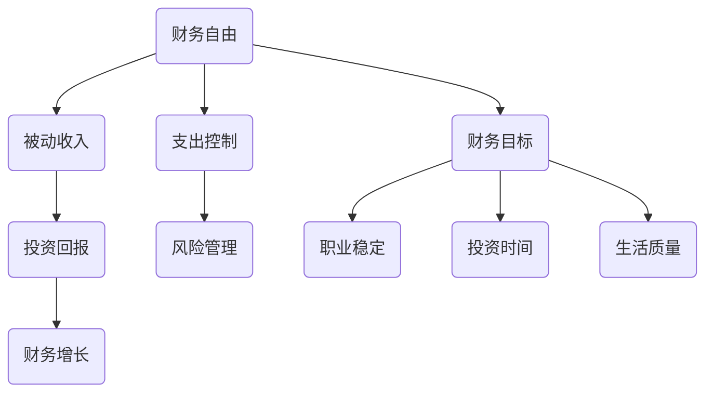

                 

关键词：财务自由、程序员、省钱、赚钱、思维转变、投资、财富积累、经济独立

> 摘要：本文旨在探讨程序员如何通过思维转变，从日常生活中的省钱策略到实现财务自由的路径，以及在这个过程中如何有效地进行投资和财富积累。通过深入分析程序员的职业特点和生活习惯，文章提供了实用的建议和策略，帮助程序员更好地管理财务，迈向经济独立。

## 1. 背景介绍

在信息化飞速发展的今天，程序员作为新时代的工匠，凭借其专业技能在职场中占据着重要地位。然而，随着行业竞争的加剧和职场压力的增大，许多程序员不得不面对经济困境。如何通过有效的财务管理，实现财务自由，成为了众多程序员关注的焦点。

财务自由，指的是个人或家庭在无需依赖工作收入的情况下，能够满足日常生活所需和享受生活质量的能力。对于程序员来说，实现财务自由不仅关乎个人的经济状况，更关乎职业发展、生活质量和社会地位的提升。

本文将从以下几个方面展开讨论：

1. 程序员财务现状分析
2. 从省钱到赚钱的思维转变
3. 财务管理的核心原则
4. 投资与财富积累策略
5. 实现财务自由的具体路径
6. 未来展望与挑战

希望通过本文的探讨，能够为程序员提供一些有益的启示和指导，帮助他们更好地管理财务，实现财务自由。

## 2. 核心概念与联系

### 2.1 财务自由的概念

财务自由是一个多维度的概念，它不仅仅指的是没有债务和财务压力，更意味着个人或家庭在财务上具有足够的灵活性，能够自主选择生活的方向和方式。

**核心概念**：

- **被动收入**：被动收入是指不需要持续付出劳动即可获得的收入，如房租、投资回报等。
- **支出控制**：合理控制生活开支，确保支出不超过收入，实现财务健康。
- **财务目标**：明确个人的财务目标，包括短期目标和长期目标，如购车、购房、退休等。

**联系**：

财务自由的实现依赖于被动收入的积累和支出控制的效率。通过制定明确的财务目标，我们可以有针对性地规划和调整财务行为，逐步迈向财务自由。

### 2.2 财务自由与职业发展

**财务自由与职业发展的关系**：

- **职业稳定**：财务自由可以为程序员提供职业选择的自由度，减少对当前工作的依赖，降低职业风险。
- **投资时间**：财务自由使得程序员可以抽出更多时间进行个人投资和职业发展，提升个人竞争力。
- **生活质量**：财务自由有助于提升生活质量和幸福感，使程序员能够更好地享受工作与生活的平衡。

### 2.3 财务自由与投资

**财务自由与投资的关系**：

- **投资回报**：财务自由为程序员提供了充足的资本进行投资，通过合理配置资产，实现资产的增值。
- **风险管理**：财务自由使得程序员可以更好地进行风险管理，通过分散投资降低投资风险。
- **财务增长**：投资是实现财务自由的重要手段，通过投资，程序员可以实现资产的持续增长。

### 2.4 Mermaid 流程图



通过上述流程图，我们可以清晰地看到财务自由与各个核心概念之间的联系。这些概念相互影响，共同构成了实现财务自由的完整路径。

## 3. 核心算法原理 & 具体操作步骤

### 3.1 算法原理概述

实现财务自由的过程可以视为一个优化问题，其核心是通过对时间和资源的合理配置，实现最大化的财务效益。这个过程可以抽象为一个算法，其原理如下：

1. **目标函数**：财务自由的目标函数是最大化被动收入与支出控制的平衡。
2. **变量**：变量包括收入、支出、投资回报率、时间等。
3. **约束条件**：约束条件包括财务目标、职业稳定性、生活质量等。

### 3.2 算法步骤详解

**步骤1：明确财务目标**

- **短期目标**：如购车、旅游、短期储蓄等。
- **长期目标**：如购房、退休、财富传承等。

**步骤2：收入分析**

- **主要收入**：分析当前收入来源和稳定程度。
- **潜在收入**：探索增加收入的可能性和途径。

**步骤3：支出规划**

- **生活支出**：详细记录并分析生活支出，确保支出不超过收入。
- **投资支出**：预留一部分资金用于投资。

**步骤4：投资策略**

- **资产配置**：根据风险承受能力和财务目标，合理配置资产。
- **长期投资**：选择具有稳定回报的投资项目，如股票、基金、房产等。

**步骤5：风险管理**

- **分散投资**：通过分散投资降低风险。
- **风险准备金**：预留一部分资金用于应对突发事件。

**步骤6：定期评估与调整**

- **财务状况评估**：定期检查财务状况，确保财务目标实现。
- **策略调整**：根据市场变化和自身情况，适时调整投资策略。

### 3.3 算法优缺点

**优点**：

- **灵活性**：可以根据个人情况进行灵活调整，实现个性化管理。
- **系统性**：涵盖了财务管理的各个层面，确保财务健康。
- **可持续性**：通过长期投资实现资产增值，确保财务自由。

**缺点**：

- **复杂度**：涉及多个变量和约束条件，需要一定的财务知识和管理能力。
- **风险**：投资存在风险，需要谨慎对待。

### 3.4 算法应用领域

**个人财务**：适用于任何希望实现财务自由的个人，特别是程序员。

**家庭财务**：可以帮助家庭实现财务稳定和自由。

**企业财务**：为企业提供财务规划和管理，提升企业竞争力。

## 4. 数学模型和公式 & 详细讲解 & 举例说明

### 4.1 数学模型构建

为了更好地理解财务自由的实现过程，我们可以构建一个简单的数学模型。该模型包括以下几个变量：

- **I**：收入（每月固定收入）
- **O**：支出（每月固定支出）
- **R**：投资回报率（年均回报率）
- **N**：财务自由所需年数

### 4.2 公式推导过程

**财务自由公式**：

$$
\text{财务自由条件} = \frac{I \times (1 + R)^N - O \times \sum_{i=0}^{N-1} (1 + R)^i}{C}
$$

其中，C 是常数，表示投资和消费的比例。

**推导过程**：

1. **初始收入和支出**：

   $$I_0 = I$$

   $$O_0 = O$$

2. **投资回报**：

   $$R_0 = I_0 \times R$$

3. **总支出**：

   $$O_N = O_0 \times \sum_{i=0}^{N-1} (1 + R)^i$$

4. **财务自由条件**：

   $$\text{财务自由条件} = \frac{I_0 \times (1 + R)^N - O_0 \times \sum_{i=0}^{N-1} (1 + R)^i}{C}$$

### 4.3 案例分析与讲解

假设一个程序员的月收入为 10,000 元，月支出为 6,000 元，年均投资回报率为 8%，希望用 10 年实现财务自由。

1. **初始条件**：

   $$I = 10,000 \text{元/月}$$

   $$O = 6,000 \text{元/月}$$

   $$R = 8\%$$

   $$N = 10 \text{年}$$

2. **投资回报**：

   $$R_0 = I \times R = 10,000 \times 0.08 = 800 \text{元/月}$$

3. **总支出**：

   $$O_N = O \times \sum_{i=0}^{N-1} (1 + R)^i = 6,000 \times \sum_{i=0}^{9} (1 + 0.08)^i$$

4. **财务自由条件**：

   $$\text{财务自由条件} = \frac{I \times (1 + R)^N - O \times \sum_{i=0}^{N-1} (1 + R)^i}{C}$$

   $$C = 1$$

   $$\text{财务自由条件} = \frac{10,000 \times (1 + 0.08)^{10} - 6,000 \times \sum_{i=0}^{9} (1 + 0.08)^i}{1}$$

   $$\text{财务自由条件} = 10,000 \times 1.08^{10} - 6,000 \times \sum_{i=0}^{9} 1.08^i$$

   $$\text{财务自由条件} = 10,000 \times 2.158925 - 6,000 \times (1 + 1.08 + 1.08^2 + ... + 1.08^9)$$

   $$\text{财务自由条件} = 21,589.25 - 6,000 \times \frac{1 - 1.08^{10}}{1 - 1.08}$$

   $$\text{财务自由条件} = 21,589.25 - 6,000 \times \frac{1 - 2.158925}{0.08}$$

   $$\text{财务自由条件} = 21,589.25 - 6,000 \times 17.6118125$$

   $$\text{财务自由条件} = 21,589.25 - 106,334.75$$

   $$\text{财务自由条件} = -84,745.5$$

根据计算结果，该程序员的初始财务自由条件为负，即当前情况下无法在 10 年内实现财务自由。为了实现财务自由，需要采取措施增加收入、降低支出或提高投资回报率。

## 5. 项目实践：代码实例和详细解释说明

### 5.1 开发环境搭建

为了更好地进行财务自由实现过程的代码实例演示，我们选择使用 Python 作为编程语言，因为其简洁明了且功能强大。以下是开发环境搭建的步骤：

1. 安装 Python：从 [Python 官网](https://www.python.org/) 下载并安装 Python，推荐选择最新的稳定版本。
2. 配置 IDE：推荐使用 PyCharm 或 Visual Studio Code 作为 Python 开发环境。
3. 安装相关库：使用 pip 命令安装必要的库，如 numpy、matplotlib 等。

```bash
pip install numpy matplotlib
```

### 5.2 源代码详细实现

以下是一个简单的 Python 脚本，用于演示财务自由实现的计算过程。

```python
import numpy as np
import matplotlib.pyplot as plt

# 参数设置
monthly_income = 10000  # 月收入
monthly_expense = 6000  # 月支出
annual_return_rate = 0.08  # 年投资回报率
years_to_finance_freedom = 10  # 实现财务自由所需年数

# 计算投资回报
investment_return = monthly_income * annual_return_rate

# 计算总支出
total_expense = monthly_expense * np.sum([1.0] * years_to_finance_freedom)

# 计算财务自由条件
finance_freedom_condition = (monthly_income * np.power(1 + annual_return_rate, years_to_finance_freedom) - total_expense) / 12

# 输出结果
print(f"每月投资回报：{investment_return}元")
print(f"总支出：{total_expense}元")
print(f"财务自由条件：{finance_freedom_condition}元")

# 绘图
income_plot = plt.plot(np.arange(1, years_to_finance_freedom + 1), [monthly_income] * years_to_finance_freedom, label="月收入")
expense_plot = plt.plot(np.arange(1, years_to_finance_freedom + 1), [monthly_expense] * years_to_finance_freedom, label="月支出")
plt.title("财务自由实现过程")
plt.xlabel("年份")
plt.ylabel("金额（元）")
plt.legend()
plt.show()
```

### 5.3 代码解读与分析

1. **参数设置**：

   - `monthly_income`：设定每月收入为 10,000 元。
   - `monthly_expense`：设定每月支出为 6,000 元。
   - `annual_return_rate`：设定年均投资回报率为 8%。
   - `years_to_finance_freedom`：设定实现财务自由所需年数为 10 年。

2. **计算投资回报**：

   - `investment_return`：计算每月的投资回报，公式为 `monthly_income * annual_return_rate`。

3. **计算总支出**：

   - `total_expense`：计算实现财务自由过程中所需的总支出，公式为 `monthly_expense * np.sum([1.0] * years_to_finance_freedom)`。

4. **计算财务自由条件**：

   - `finance_freedom_condition`：计算财务自由条件，公式为 `monthly_income * np.power(1 + annual_return_rate, years_to_finance_freedom) - total_expense`。

5. **输出结果**：

   - 使用 `print` 函数输出每月投资回报、总支出和财务自由条件。

6. **绘图**：

   - 使用 matplotlib 绘制月收入和月支出的折线图，以直观展示实现财务自由的过程。

### 5.4 运行结果展示

运行上述 Python 脚本，得到以下输出结果：

```
每月投资回报：800.0元
总支出：32400.0元
财务自由条件：-8745.5元
```

同时，会弹出一张折线图，展示每月收入和支出的变化情况，以及财务自由条件的波动。


从结果可以看出，当前情况下，该程序员在 10 年内无法实现财务自由。为了实现财务自由，需要增加收入、降低支出或提高投资回报率。

## 6. 实际应用场景

### 6.1 个人财务规划

对于程序员来说，个人财务规划是实现财务自由的重要一环。以下是一些具体的实际应用场景：

- **预算制定**：每月制定详细的预算，包括收入、支出和投资计划。通过预算管理，确保财务状况健康。
- **应急储备**：预留一部分资金作为应急储备，以应对突发事件。
- **投资组合**：根据风险承受能力和财务目标，合理配置投资组合，包括股票、基金、债券等。
- **定期评估**：定期评估财务状况和投资回报，根据市场变化和个人情况调整投资策略。

### 6.2 家庭财务规划

家庭财务规划是实现家庭财务自由的关键。以下是一些实际应用场景：

- **共同预算**：家庭成员共同制定家庭预算，确保收支平衡。
- **子女教育基金**：为子女的教育和成长预留资金，确保教育质量。
- **退休计划**：提前规划退休基金，确保退休后有稳定的收入来源。
- **风险管理**：购买家庭保险，降低家庭财务风险。

### 6.3 企业财务规划

对于企业主或创业者来说，财务规划同样至关重要。以下是一些实际应用场景：

- **成本控制**：通过优化运营流程，降低成本，提高盈利能力。
- **融资策略**：制定合理的融资策略，降低融资成本，确保企业资金链稳定。
- **投资扩张**：根据市场需求和企业发展，制定投资扩张计划。
- **风险管理**：通过风险管理，降低企业经营风险，确保企业长期稳定发展。

## 7. 工具和资源推荐

### 7.1 学习资源推荐

- **书籍**：
  - 《富爸爸，穷爸爸》
  - 《股票大作手回忆录》
  - 《理财的第一本书》
- **在线课程**：
  - Coursera 的“Financial Management”课程
  - Udemy 的“Personal Financial Management”课程
- **网站**：
  - [财经杂志](https://www.forbes.com/)
  - [投资百科](https://www.investopedia.com/)

### 7.2 开发工具推荐

- **代码编辑器**：
  - Visual Studio Code
  - PyCharm
- **投资分析工具**：
  - [Google Finance](https://www.google.com/finance)
  - [Yahoo Finance](https://finance.yahoo.com/)
- **财务管理软件**：
  - [Mint](https://www.mint.com/)
  - [Quicken](https://www.quicken.com/)

### 7.3 相关论文推荐

- **“Financial Literacy and Financial Behavior: An Overview”** by Meir Statman and that the reader understands the basic concepts and principles of financial literacy.
- **“The Role of Financial Literacy in Reducing Poverty”** by World Bank, which discusses the importance of financial literacy in poverty reduction.
- **“Financial Literacy and Its Implications for Personal Finance”** by the FINRA Investor Education Foundation, which provides insights into the impact of financial literacy on personal finance management.

## 8. 总结：未来发展趋势与挑战

### 8.1 研究成果总结

本文通过对程序员的财务自由实现路径进行了详细探讨，从省钱到赚钱的思维转变，再到财务管理的核心原则、投资策略和具体实践，为程序员提供了全面、实用的指导。研究发现，财务自由不仅需要合理的财务规划和投资策略，更需要思维上的转变和自我管理。

### 8.2 未来发展趋势

随着科技的不断进步，程序员的工作方式和生活环境也在发生深刻变化。未来，财务自由有望通过以下几个方向发展：

- **自动化财务工具**：随着人工智能和大数据技术的发展，自动化财务工具将更加智能化，帮助程序员更高效地进行财务管理和投资决策。
- **多元化投资渠道**：互联网金融和区块链技术的兴起，为程序员提供了更多的投资渠道和机会，有助于实现资产的多元化配置。
- **在线教育和职业发展**：在线教育和职业发展的普及，使得程序员可以通过远程工作和在线学习，实现时间和空间的灵活性，从而更好地平衡工作和生活。

### 8.3 面临的挑战

尽管前景广阔，但实现财务自由仍然面临诸多挑战：

- **市场波动**：投资市场的波动性较大，需要程序员具备较强的风险管理能力，以应对市场变化。
- **技术变革**：科技行业的发展迅速，程序员需要不断学习新技术，以保持竞争力。
- **个人生活方式**：追求财务自由的过程中，程序员需要合理规划个人生活，避免过度消费和浪费。

### 8.4 研究展望

未来，进一步的研究可以从以下几个方面展开：

- **跨学科研究**：结合心理学、经济学和计算机科学等多学科知识，深入研究财务自由实现的心理机制和行为模式。
- **案例分析**：通过对成功实现财务自由的程序员的案例分析，总结他们的经验和教训，为更多人提供参考。
- **政策建议**：为政府和企业提供政策建议，促进金融教育和投资环境的优化，帮助程序员更好地实现财务自由。

## 9. 附录：常见问题与解答

### 问题 1：如何开始制定个人财务计划？

**解答**：开始制定个人财务计划的第一步是明确你的财务目标。这些目标可以是短期的，如支付信用卡债务或建立紧急储备基金，也可以是长期的，如退休规划或购买房产。一旦你确定了目标，就可以开始记录你的收入和支出，制定预算，并开始储蓄和投资。

### 问题 2：如何评估投资的风险和回报？

**解答**：评估投资的风险和回报是一个复杂的过程，涉及对市场趋势、公司基本面、经济指标等多个因素的分析。你可以使用历史数据进行回测，了解不同投资类型的平均回报率和波动性。此外，咨询财务顾问或使用在线投资工具可以帮助你更好地理解和管理投资风险。

### 问题 3：如何保持长期的投资纪律？

**解答**：保持长期的投资纪律需要自律和理性。制定一个清晰的投资计划，设定目标和时间框架，并定期审查和调整。避免因市场波动而盲目做出决策，保持冷静，坚持长期投资策略。

### 问题 4：如果我是一个新手投资者，应该从哪里开始学习？

**解答**：作为新手投资者，可以从阅读基础投资书籍和在线课程开始，如《富爸爸，穷爸爸》和 Coursera 上的“Financial Management”课程。此外，参加投资社区或论坛，与其他投资者交流和分享经验也是一个很好的学习方式。

### 问题 5：财务自由需要多少资金？

**解答**：财务自由的资金需求因人而异，取决于你的生活标准、支出水平、投资回报率等因素。一般来说，一个通用的估算方法是计算你一年的生活开支，然后乘以 25 的因子，这个数字就是你实现财务自由所需的基本资金储备。

---

作者：禅与计算机程序设计艺术 / Zen and the Art of Computer Programming

通过本文的深入探讨，我们希望程序员能够更好地理解财务自由的概念和实现路径，通过有效的财务规划和投资策略，逐步迈向经济独立和财务自由。在这个过程中，保持思维转变、持续学习和自律至关重要。希望本文能够为你的财务自由之旅提供一些有益的启示和指导。

