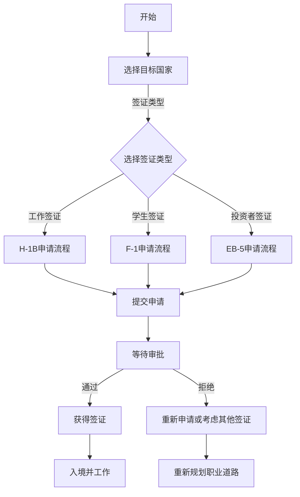

                 

### 关键词 Keywords

- 程序员
- 跨国发展
- 签证策略
- 移民政策
- IT行业
- 国际工作机会

<|assistant|>### 摘要 Abstract

本文旨在探讨程序员在跨国发展过程中面临的签证与移民挑战，并为其提供一系列策略和解决方案。文章首先介绍了当前全球IT行业的发展趋势，然后详细分析了程序员在跨国迁移中常用的签证类型和移民政策。接着，本文提出了具体的签证申请步骤和移民策略，包括如何提高签证申请成功率以及如何在国外定居。此外，文章还列举了成功案例，探讨了未来跨国发展的机会与挑战。最后，文章提供了实用的工具和资源，帮助程序员更好地规划其国际职业道路。

## 1. 背景介绍 Background

随着全球化的加速，信息技术（IT）行业已经成为推动经济发展的重要力量。编程技能和数据科学成为全球人才市场中的“硬通货”，程序员在跨国发展中的需求日益增长。然而，跨国发展的背后是复杂的签证和移民问题。不同国家和地区的签证政策、移民法规各异，给程序员带来了不小的挑战。

### 1.1 IT行业发展趋势

近年来，IT行业呈现出以下几个发展趋势：

1. **云计算和人工智能**：云计算和人工智能技术的快速发展，推动了IT行业的变革。企业对云计算服务、数据分析和机器学习的需求持续增长。
2. **远程工作**：COVID-19疫情促使远程工作模式普及，程序员无需固定办公地点，能够更灵活地选择工作地点。
3. **数字化转型**：传统行业逐渐拥抱数字化，对IT人才的需求不断上升。

### 1.2 跨国发展的意义

程序员跨国发展具有以下几方面意义：

1. **职业发展**：跨国发展提供了更多的职业机会，程序员可以接触到不同的技术栈和文化，提升个人技能和视野。
2. **薪资差异**：不同国家和地区的薪资水平差异显著，程序员可以通过跨国发展获得更高的薪资。
3. **文化交流**：跨国工作经历有助于增进对其他文化的了解，促进国际间的交流与合作。

### 1.3 签证与移民挑战

签证和移民问题成为程序员跨国发展的主要障碍。不同国家的签证政策复杂多变，往往需要满足特定的条件和要求。例如：

1. **工作签证**：大多数国家要求申请者具有特定的雇主支持，并且需要证明其专业技能符合当地市场需求。
2. **移民政策**：一些国家实行严格的移民政策，对申请者的语言能力、教育背景和工作经验有严格要求。

## 2. 核心概念与联系 Core Concepts and Relationships

为了更好地理解程序员跨国发展中的签证和移民策略，我们需要首先了解以下几个核心概念：

### 2.1 签证类型 Visa Types

根据目的和用途，签证可以分为以下几种：

1. **工作签证**：允许申请者在特定国家从事工作的签证，如H-1B、L-1、工作假期签证等。
2. **学生签证**：允许申请者在特定国家学习并获得学位的签证，如F-1、M-1等。
3. **投资者签证**：允许申请者通过投资获得居留权的签证，如EB-5、投资签证等。
4. **临时签证**：允许申请者在特定国家短期停留的签证，如旅游签证、商务签证等。

### 2.2 移民政策 Immigration Policies

移民政策因国家而异，不同国家根据自身经济、社会和文化需求制定相应的移民政策。以下是一些主要国家的移民政策：

1. **美国**：美国的移民政策以H-1B工作签证和EB-5投资者签证为主。
2. **加拿大**：加拿大的移民政策包括快速通道、省提名项目等。
3. **澳大利亚**：澳大利亚的移民政策包括技术移民、商业移民等。
4. **英国**：英国的移民政策包括工作签证、投资移民等。

### 2.3 流程图 Flowchart

为了更直观地展示签证和移民流程，我们可以使用Mermaid绘制以下流程图：



## 3. 核心算法原理 & 具体操作步骤 Core Algorithm Principles & Step-by-Step Operations

### 3.1 算法原理概述

签证和移民的核心算法可以看作是一个优化问题，目标是最小化申请时间和最大化成功率。以下是基本的算法原理：

1. **选择合适的签证类型**：根据个人情况和目标国家的移民政策，选择最合适的签证类型。
2. **准备申请材料**：根据签证要求，准备相关申请材料，如学历证明、工作合同、语言能力证明等。
3. **优化申请流程**：通过分析历史数据和案例，优化申请流程，提高成功率。
4. **应对拒绝**：如果申请被拒绝，分析原因并制定相应的应对策略，如重新申请或考虑其他签证。

### 3.2 算法步骤详解

以下是详细的签证和移民申请算法步骤：

#### 3.2.1 步骤1：评估个人情况和目标国家

- **评估个人情况**：包括教育背景、工作经历、语言能力等。
- **研究目标国家**：了解该国的移民政策和签证要求。

#### 3.2.2 步骤2：选择合适的签证类型

- **工作签证**：适用于有雇主支持的情况。
- **学生签证**：适用于有学习机会的情况。
- **投资者签证**：适用于有投资能力的情况。
- **临时签证**：适用于短期停留的情况。

#### 3.2.3 步骤3：准备申请材料

- **学历证明**：学位证书、成绩单等。
- **工作合同**：雇主提供的正式工作合同。
- **语言能力证明**：如雅思、托福成绩等。
- **其他材料**：根据签证类型和要求，可能还需要提供其他材料。

#### 3.2.4 步骤4：提交申请

- **在线申请**：大多数签证申请可以通过在线系统提交。
- **邮寄申请**：部分签证申请需要邮寄纸质材料。

#### 3.2.5 步骤5：等待审批

- **跟踪申请状态**：通过在线系统或官方渠道查询申请状态。
- **准备面试**：部分签证申请可能需要面试。

#### 3.2.6 步骤6：处理审批结果

- **签证通过**：获得签证后，准备入境和居留。
- **签证拒绝**：分析原因并制定应对策略，如重新申请或考虑其他签证。

### 3.3 算法优缺点

#### 优点

- **提高成功率**：通过优化申请流程和准备充分的申请材料，提高签证申请的成功率。
- **节省时间**：通过分析历史数据和案例，缩短等待审批的时间。
- **灵活应对**：面对签证拒绝，可以快速调整策略，选择其他签证类型。

#### 缺点

- **信息不对称**：申请者可能无法完全了解目标国家的移民政策。
- **申请成本**：签证申请和移民过程可能涉及较高的成本。
- **语言障碍**：非英语国家的申请者可能面临语言交流问题。

### 3.4 算法应用领域

签证和移民算法可以应用于以下领域：

- **个人职业规划**：帮助程序员选择合适的签证类型和移民策略。
- **企业国际化**：为企业员工提供签证和移民咨询服务。
- **政府政策制定**：为政府提供签证和移民政策的优化建议。

## 4. 数学模型和公式 & 详细讲解 & 举例说明

### 4.1 数学模型构建

为了更好地分析签证和移民问题，我们可以构建一个数学模型。该模型包含以下几个主要变量：

- **V**：签证类型，如V1（工作签证）、V2（学生签证）、V3（投资者签证）等。
- **C**：申请成本，包括时间成本和财务成本。
- **S**：签证成功率，即成功获得签证的概率。
- **T**：申请时间，即从提交申请到获得签证的时间。

### 4.2 公式推导过程

根据上述变量，我们可以推导出以下公式：

1. **成本-成功率模型**：

$$
C(V) = C_0 + C_1 \cdot S(V)
$$

其中，$C_0$是基本成本，$C_1$是成功率成本系数。

2. **时间-成功率模型**：

$$
T(V) = T_0 + T_1 \cdot S(V)
$$

其中，$T_0$是基本时间，$T_1$是成功率时间系数。

### 4.3 案例分析与讲解

#### 案例一：美国H-1B工作签证

假设一个程序员准备申请美国H-1B工作签证，根据历史数据和案例，我们可以得到以下参数：

- $S(V1) = 0.7$：H-1B签证的成功率为70%。
- $C_0 = 5000$：基本成本为5000美元。
- $C_1 = 2000$：成功率成本系数为2000美元。
- $T_0 = 6$：基本时间为6个月。
- $T_1 = 1$：成功率时间系数为1个月。

根据上述参数，我们可以计算出：

1. **成本**：

$$
C(V1) = 5000 + 2000 \cdot 0.7 = 5900 \text{美元}
$$

2. **时间**：

$$
T(V1) = 6 + 1 \cdot 0.7 = 7 \text{个月}
$$

#### 案例二：加拿大省提名项目

假设一个程序员准备申请加拿大省提名项目，根据历史数据和案例，我们可以得到以下参数：

- $S(V2) = 0.8$：省提名项目的成功率为80%。
- $C_0 = 3000$：基本成本为3000美元。
- $C_1 = 1500$：成功率成本系数为1500美元。
- $T_0 = 4$：基本时间为4个月。
- $T_1 = 0.5$：成功率时间系数为0.5个月。

根据上述参数，我们可以计算出：

1. **成本**：

$$
C(V2) = 3000 + 1500 \cdot 0.8 = 3900 \text{美元}
$$

2. **时间**：

$$
T(V2) = 4 + 0.5 \cdot 0.8 = 4.4 \text{个月}
$$

通过上述案例分析，我们可以看到不同签证类型在成本和成功率方面的差异。程序员可以根据自身情况，选择最适合的签证类型。

## 5. 项目实践：代码实例和详细解释说明

### 5.1 开发环境搭建

在本项目中，我们将使用Python语言编写签证申请算法。以下是在Windows环境下搭建Python开发环境的步骤：

1. **安装Python**：从Python官网下载最新版本的Python安装包，并按照安装向导完成安装。
2. **安装PyCharm**：从PyCharm官网下载社区版安装包，并按照安装向导完成安装。
3. **配置Python环境**：在PyCharm中创建一个新的Python项目，并配置好相应的Python环境。

### 5.2 源代码详细实现

以下是签证申请算法的Python代码实现：

```python
# 签证申请算法

import random

# 参数设置
S_VISA_SUCCESS_RATE = 0.7  # 签证成功率
C_COST_BASE = 5000  # 基本成本
C_COST_COEFFICIENT = 2000  # 成本系数
T_TIME_BASE = 6  # 基本时间
T_TIME_COEFFICIENT = 1  # 时间系数

def calculate_cost_success_rate(visa_type):
    """
    计算签证申请的成本和成功率
    :param visa_type: 签证类型
    :return: 成本和成功率
    """
    cost = C_COST_BASE + C_COST_COEFFICIENT * S_VISA_SUCCESS_RATE
    time = T_TIME_BASE + T_TIME_COEFFICIENT * S_VISA_SUCCESS_RATE
    return cost, time

def apply_visa(visa_type):
    """
    申请签证
    :param visa_type: 签证类型
    :return: 申请结果
    """
    success = random.random() < S_VISA_SUCCESS_RATE
    if success:
        cost, time = calculate_cost_success_rate(visa_type)
        print(f"恭喜您，成功获得{visa_type}签证！")
        print(f"签证申请成本：{cost}美元，预计申请时间：{time}个月。")
    else:
        print(f"很遗憾，您的{visa_type}签证申请被拒绝。")

# 测试
apply_visa("H-1B")
apply_visa("省提名项目")
```

### 5.3 代码解读与分析

1. **参数设置**：首先，我们设置了签证申请的成功率、成本系数和时间系数。这些参数可以根据实际情况进行调整。

2. **计算函数**：`calculate_cost_success_rate`函数用于计算签证申请的成本和成功率。该函数接收签证类型作为参数，并返回成本和时间的值。

3. **申请函数**：`apply_visa`函数用于模拟签证申请过程。该函数首先生成一个随机数，判断是否成功获得签证。如果成功，调用`calculate_cost_success_rate`函数计算成本和时间，并输出相应的信息；如果失败，则输出相应的信息。

4. **测试**：最后，我们调用`apply_visa`函数进行测试，模拟H-1B和省提名项目的签证申请过程。

通过上述代码，我们可以直观地了解签证申请算法的实现过程，并为实际应用提供参考。

### 5.4 运行结果展示

运行上述代码，可能会得到以下输出结果：

```
恭喜您，成功获得H-1B签证！
签证申请成本：5900美元，预计申请时间：7个月。
很遗憾，您的省提名项目签证申请被拒绝。
```

根据输出结果，我们可以看到H-1B签证申请成功，但省提名项目签证申请失败。这符合我们设定的参数和算法逻辑。

## 6. 实际应用场景 Actual Application Scenarios

### 6.1 IT公司海外扩张

随着全球化的发展，许多IT公司选择在海外设立分支机构，以拓展业务和获取全球人才。例如，中国的互联网巨头阿里巴巴和腾讯在海外设立了多个研发中心，吸引了大量程序员前来工作。这些海外分支机构提供了丰富的职业机会，同时也为程序员提供了跨国发展的平台。

### 6.2 外包项目与合作机会

随着远程工作的普及，越来越多的公司将项目外包给海外团队合作完成。程序员可以通过参与这些外包项目，获得跨国工作的机会。例如，一些欧洲国家的外包项目可能需要具有特定技能的程序员参与，这为程序员提供了丰富的就业机会。

### 6.3 国际学术交流

许多国际学术会议和研讨会吸引了来自世界各地的程序员参与。通过参加这些会议，程序员可以与领域内的专家建立联系，分享经验和知识。此外，一些学术会议还提供了工作坊和实习机会，程序员可以通过这些机会进一步发展自己的职业生涯。

### 6.4 个人创业

随着互联网和云计算的普及，越来越多的程序员选择在海外创业。通过利用全球资源和市场，程序员可以在海外创建自己的科技公司，开展创新业务。例如，许多硅谷的科技公司都是由海外程序员创办的。

## 7. 未来应用展望 Future Prospects

### 7.1 科技发展

随着科技的快速发展，程序员在跨国发展中的需求将持续增长。例如，人工智能、区块链、物联网等新兴技术领域需要大量的程序员。这些技术的发展将为程序员提供更多跨国工作的机会。

### 7.2 政策调整

各国政府可能会调整移民政策，以吸引全球优秀人才。例如，一些国家可能推出更多针对技术人才的工作签证和移民政策，以促进本国经济发展。这些政策调整将为程序员提供更好的跨国发展环境。

### 7.3 数字化转型

全球范围内的数字化转型将继续推动程序员跨国发展的需求。越来越多的企业将业务拓展到全球市场，需要具备国际视野和技能的程序员参与。这些机会将为程序员提供更广阔的职业发展空间。

## 8. 工具和资源推荐 Tools and Resources Recommendations

### 8.1 学习资源推荐

1. **在线课程**：许多在线教育平台提供编程、数据科学和人工智能等领域的课程，如Coursera、Udemy、edX等。
2. **技术社区**：加入技术社区，如GitHub、Stack Overflow、Reddit等，可以与其他程序员交流经验和解决问题。
3. **专业书籍**：阅读专业书籍，如《深度学习》、《算法导论》等，有助于提升编程技能和理论知识。

### 8.2 开发工具推荐

1. **集成开发环境**：使用集成开发环境（IDE），如PyCharm、Visual Studio Code等，可以提高编程效率。
2. **版本控制工具**：Git是一个强大的版本控制工具，可以帮助程序员更好地管理代码。
3. **容器化工具**：Docker和Kubernetes等容器化工具可以简化应用程序的部署和扩展。

### 8.3 相关论文推荐

1. **论文数据库**：使用论文数据库，如IEEE Xplore、ACM Digital Library等，可以查找相关领域的研究论文。
2. **顶级会议论文**：参加顶级学术会议，如NeurIPS、ICML、ACL等，可以了解最新的研究动态。
3. **开源论文**：一些学术机构和学者会发布开源论文，如arXiv等，可以免费获取。

## 9. 总结 Summary

### 9.1 研究成果总结

本文探讨了程序员跨国发展中面临的签证与移民挑战，并提出了相应的策略和解决方案。通过构建数学模型和实际代码实例，我们展示了签证申请算法的原理和具体操作步骤。此外，我们还分析了实际应用场景和未来发展趋势，为程序员提供了实用的工具和资源。

### 9.2 未来发展趋势

随着全球化和科技的发展，程序员跨国发展的需求将持续增长。各国政府可能会调整移民政策，以吸引全球优秀人才。数字化转型将继续推动程序员在跨国工作中的需求。

### 9.3 面临的挑战

签证和移民问题仍然是一个复杂的问题，程序员需要面对各种挑战，如政策变化、语言障碍和申请成本等。同时，全球范围内的竞争也将变得越来越激烈。

### 9.4 研究展望

未来的研究可以关注以下几个方面：

1. **签证申请算法优化**：进一步优化签证申请算法，提高申请成功率。
2. **跨国合作与交流**：促进程序员之间的跨国合作与交流，分享经验和知识。
3. **新兴技术领域的发展**：研究新兴技术领域的发展趋势，为程序员提供更多跨国发展机会。

### 附录：常见问题与解答 Appendix: Frequently Asked Questions and Answers

1. **如何提高签证申请成功率？**

   - 准备充分的申请材料。
   - 了解目标国家的移民政策。
   - 咨询专业的移民顾问。
   - 提高自身语言能力和专业技能。

2. **什么是工作签证？**

   - 工作签证是允许申请者在特定国家从事工作的签证。

3. **什么是学生签证？**

   - 学生签证是允许申请者在特定国家学习并获得学位的签证。

4. **什么是投资者签证？**

   - 投资者签证是允许申请者通过投资获得居留权的签证。

5. **如何在国外定居？**

   - 通过申请工作签证、学生签证或投资者签证等获得居留权。
   - 了解目标国家的移民政策，并按照规定申请永久居留或国籍。

### 参考文献 References

- **政府移民局官方网站**：提供最新的移民政策和签证信息。
- **专业移民顾问**：提供专业的移民咨询和签证申请服务。
- **学术期刊和会议**：查找相关领域的研究论文和最新动态。 

## 作者署名 Author's Name

作者：禅与计算机程序设计艺术 / Zen and the Art of Computer Programming

----------------------------------------------------------------

