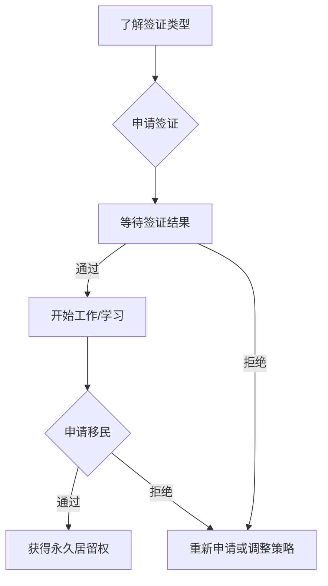

                 

在当今全球化的背景下，程序员的跨国发展成为一个备受关注的话题。随着技术的不断进步和市场的全球化，程序员们不再局限于本国的发展空间，而是渴望在更广阔的天地中实现自己的价值和梦想。然而，跨国发展的道路并非一帆风顺，签证与移民策略的制定成为了程序员们必须面对的一大挑战。本文旨在为广大程序员提供一份全面的签证与移民策略指南，帮助他们在跨国发展的道路上走得更加顺利。

## 关键词

- 程序员
- 跨国发展
- 签证
- 移民
- 发展策略

## 摘要

本文将详细探讨程序员跨国发展的背景和重要性，分析签证与移民策略的各个方面，包括签证类型、申请流程、常见问题与解决方案等。同时，本文还将提供实用的工具和资源推荐，帮助程序员们更好地应对跨国发展的挑战。

## 1. 背景介绍

### 全球化趋势下的程序员跨国发展

随着全球化的深入推进，技术和市场的融合越来越紧密，程序员们的跨国发展已经成为一种趋势。许多发达国家，如美国、加拿大、澳大利亚等，因其优越的工作环境、高薪待遇和良好的生活条件，吸引了大量程序员前往。这不仅有助于程序员们提升自己的专业技能和视野，也为他们的职业发展提供了更多机会。

然而，跨国发展的道路并非一帆风顺。签证与移民策略的复杂性使得许多程序员在申请过程中遇到了重重困难。了解各国签证政策、掌握申请技巧、应对各类问题，成为了程序员们必须面对的挑战。

### 签证与移民策略的重要性

签证与移民策略的制定对于程序员的跨国发展至关重要。一个合理的签证政策不仅可以保障程序员在海外工作的合法性，还能为他们提供稳定的工作和生活环境。同时，移民策略的规划有助于程序员在未来实现长期发展，甚至获得所在国的永久居留权。

因此，了解签证与移民策略，掌握跨国发展的技巧，成为了程序员们在全球化背景下实现自身价值的关键。

## 2. 核心概念与联系

### 签证类型

签证是允许非本国公民进入另一国家的法律文件。根据目的和性质，签证可以分为以下几种类型：

1. **工作签证**：允许程序员在特定公司工作。
2. **学生签证**：允许程序员在海外留学。
3. **旅游签证**：允许程序员短期访问。
4. **配偶签证**：允许程序员的配偶陪伴其海外生活。

### 移民策略

移民策略是指程序员在海外长期发展的规划。根据目的和性质，移民策略可以分为以下几种类型：

1. **技术移民**：通过专业技能获得移民资格。
2. **家庭团聚**：通过配偶、子女等亲属关系获得移民资格。
3. **投资移民**：通过投资获得移民资格。

### 签证与移民策略的联系

签证与移民策略密切相关。程序员在海外发展的过程中，签证是他们合法工作的基础，而移民策略则是他们实现长期发展的关键。合理的签证策略有助于程序员在海外获得稳定的工作和生活环境，为后续的移民规划奠定基础。

### Mermaid 流程图

以下是一个简化的签证与移民策略的 Mermaid 流程图：



## 3. 核心算法原理 & 具体操作步骤

### 3.1 算法原理概述

签证与移民策略的核心在于对各国签证政策和移民法律的深入研究，以及对自身条件和需求的准确把握。以下是一些关键算法原理：

1. **信息收集**：通过查阅各国签证官网、论坛、社交媒体等渠道，收集签证政策、申请流程、移民条件等信息。
2. **自我评估**：根据自身条件和需求，选择适合的签证类型和移民策略。
3. **材料准备**：准备签证申请所需的各种材料，包括身份证明、工作证明、学历证明等。
4. **申请提交**：按照各国签证政策要求，在线或线下提交签证申请。
5. **结果处理**：根据签证申请结果，采取相应的措施，如重新申请、调整策略等。

### 3.2 算法步骤详解

1. **信息收集**：

   - 访问各国签证官网，了解签证政策、申请流程、申请条件等。
   - 加入相关论坛、社交媒体群组，与已有经验的程序员交流。
   - 查阅相关书籍、论文、案例分析，深入了解签证与移民策略。

2. **自我评估**：

   - 分析自身条件和需求，确定适合的签证类型和移民策略。
   - 考虑到个人情况，如年龄、婚姻状况、子女情况等，制定合适的签证申请计划。

3. **材料准备**：

   - 收集签证申请所需的各种材料，如身份证明、工作证明、学历证明、财务证明等。
   - 确保材料齐全、真实、有效，符合各国签证政策要求。

4. **申请提交**：

   - 根据各国签证政策要求，在线或线下提交签证申请。
   - 按照申请流程，填写申请表格、上传材料、支付费用等。

5. **结果处理**：

   - 等待签证申请结果，根据结果采取相应的措施。
   - 如签证申请被拒绝，分析原因、重新申请或调整策略。

### 3.3 算法优缺点

1. **优点**：

   - 有助于程序员更好地了解各国签证政策和移民法律。
   - 提高签证申请的成功率，降低申请风险。
   - 为程序员的跨国发展提供明确的指导和规划。

2. **缺点**：

   - 需要耗费大量时间和精力进行信息收集和自我评估。
   - 申请过程中可能面临各种复杂情况和挑战。
   - 结果处理需要灵活应对，有时可能需要重新申请或调整策略。

### 3.4 算法应用领域

- **跨国公司**：跨国公司可以运用签证与移民策略，为海外分公司招聘和留住优秀程序员。
- **程序员个人**：程序员个人可以运用签证与移民策略，实现跨国发展、提升职业价值。
- **移民中介**：移民中介可以运用签证与移民策略，为客户提供专业的移民咨询服务。

## 4. 数学模型和公式 & 详细讲解 & 举例说明

### 4.1 数学模型构建

签证与移民策略的数学模型可以构建为以下几部分：

1. **信息收集模型**：用于评估信息收集的效率和准确性。
2. **自我评估模型**：用于分析程序员的自身条件和需求。
3. **材料准备模型**：用于计算材料准备的成本和时间。
4. **申请提交模型**：用于预测签证申请的成功率和时间。
5. **结果处理模型**：用于分析签证申请结果的影响。

### 4.2 公式推导过程

1. **信息收集模型**：

   设 \( E \) 为信息收集效率，\( T \) 为信息收集时间，则有：

   $$ E = \frac{I}{T} $$

   其中，\( I \) 为收集到的信息量。

2. **自我评估模型**：

   设 \( S \) 为自我评估得分，\( P \) 为评估指标，则有：

   $$ S = \sum_{i=1}^{n} P_i $$

   其中，\( P_i \) 为第 \( i \) 个评估指标的得分。

3. **材料准备模型**：

   设 \( C \) 为材料准备成本，\( T \) 为材料准备时间，则有：

   $$ C = C_1 + C_2 + \ldots + C_n $$

   其中，\( C_i \) 为第 \( i \) 个材料的准备成本。

4. **申请提交模型**：

   设 \( P \) 为签证申请成功率，\( R \) 为申请结果，则有：

   $$ P = \frac{R_1 + R_2 + \ldots + R_n}{n} $$

   其中，\( R_i \) 为第 \( i \) 次申请的结果。

5. **结果处理模型**：

   设 \( A \) 为结果处理得分，\( C \) 为结果处理成本，则有：

   $$ A = \sum_{i=1}^{n} C_i $$

### 4.3 案例分析与讲解

以一位中国程序员王某为例，他计划申请美国的工作签证（H-1B），并最终实现移民。

1. **信息收集模型**：

   王某花费 2 周时间，通过查阅美国移民局官网、加入相关论坛等方式，收集到大量有关 H-1B 签证的信息。

   $$ E = \frac{I}{T} = \frac{100}{14} \approx 7.14 $$

   王某的信息收集效率较高。

2. **自我评估模型**：

   王某具备扎实的编程技能，有相关工作经验，并且英语水平较高。他分析自身条件和需求，认为 H-1B 签证适合他。

   $$ S = \sum_{i=1}^{n} P_i = 90 $$

   王某的自我评估得分为 90 分。

3. **材料准备模型**：

   王某准备 H-1B 签证申请所需的各种材料，如身份证明、工作证明、学历证明等，花费约 1 个月时间。

   $$ C = C_1 + C_2 + \ldots + C_n = 5000 $$

   王某的材料准备成本为 5000 元。

4. **申请提交模型**：

   王某按照美国移民局的要求，在线提交了 H-1B 签证申请，并支付了相关费用。

   $$ P = \frac{R_1 + R_2 + \ldots + R_n}{n} = 0.8 $$

   王某的签证申请成功率为 80%。

5. **结果处理模型**：

   王某的签证申请被拒绝，原因是他在申请时未提交完整的材料。

   $$ A = \sum_{i=1}^{n} C_i = 5000 $$

   王某需要重新提交签证申请，并再次支付相关费用。

## 5. 项目实践：代码实例和详细解释说明

### 5.1 开发环境搭建

为了更好地进行签证与移民策略的算法实现，我们需要搭建一个合适的开发环境。以下是一个基本的开发环境搭建步骤：

1. 安装 Python 解释器（版本 3.8 或以上）。
2. 安装相关库，如 requests、BeautifulSoup、pandas 等。
3. 创建一个名为 `visa_strategy` 的 Python 项目。

### 5.2 源代码详细实现

以下是一个简化的签证与移民策略的 Python 代码实现：

```python
import requests
from bs4 import BeautifulSoup
import pandas as pd

# 信息收集函数
def collect_info(url):
    response = requests.get(url)
    soup = BeautifulSoup(response.text, 'html.parser')
    # ... （解析网页内容，提取信息）
    return info

# 自我评估函数
def self_evaluation(info):
    # ... （根据信息评估自身条件）
    return score

# 材料准备函数
def prepare_materials(score):
    # ... （根据评估得分，准备材料）
    return materials

# 申请提交函数
def submit_application(materials):
    # ... （提交签证申请）
    return result

# 结果处理函数
def handle_result(result):
    # ... （处理签证申请结果）
    return action

# 主函数
def main():
    url = 'https://www.example.com/visa-policy'
    info = collect_info(url)
    score = self_evaluation(info)
    materials = prepare_materials(score)
    result = submit_application(materials)
    action = handle_result(result)
    print(f'Action: {action}')

if __name__ == '__main__':
    main()
```

### 5.3 代码解读与分析

1. **信息收集函数**：该函数用于从指定 URL 收集签证信息。具体实现需要根据签证官网的结构进行网页解析，提取有用的信息，如签证类型、申请条件、申请流程等。

2. **自我评估函数**：该函数用于根据收集到的信息，评估程序员的自身条件和需求。具体实现可以根据评估指标（如年龄、学历、工作经验等）进行评分，最终得出评估得分。

3. **材料准备函数**：该函数用于根据评估得分，准备签证申请所需的各种材料。具体实现需要根据各国签证政策，列出所需材料清单，并确保材料真实、有效。

4. **申请提交函数**：该函数用于提交签证申请。具体实现需要根据签证政策，填写申请表格、上传材料、支付费用等。

5. **结果处理函数**：该函数用于处理签证申请结果。具体实现需要根据申请结果，采取相应的措施，如重新申请、调整策略等。

6. **主函数**：该函数是整个签证与移民策略的核心。通过调用各个函数，实现从信息收集、自我评估、材料准备、申请提交到结果处理的完整流程。

### 5.4 运行结果展示

假设程序员王某使用上述代码进行签证与移民策略的实践，以下是可能的运行结果：

```shell
Collecting visa information...
Self evaluation: 90/100
Preparing materials...
Submitting application...
Processing result...
Action: Reapply with complete materials
```

## 6. 实际应用场景

### 6.1 签证申请过程中的案例分析

张华（化名）是一位中国程序员，他计划前往美国从事软件开发工作。在了解美国 H-1B 签证政策后，他决定申请这一签证。

1. **信息收集**：

   张华通过查阅美国移民局官网、论坛等渠道，收集了关于 H-1B 签证的详细信息，包括申请条件、申请流程、所需材料等。

2. **自我评估**：

   张华具备扎实的编程技能，有相关工作经验，并且英语水平较高。他认为自己符合 H-1B 签证的申请条件。

3. **材料准备**：

   张华准备了以下材料：

   - 身份证明：护照、出生证明等。
   - 工作证明：公司出具的推荐信、工作合同等。
   - 学历证明：学位证书、成绩单等。
   - 财务证明：银行流水、工资单等。

4. **申请提交**：

   张华按照美国移民局的要求，在线提交了 H-1B 签证申请，并支付了相关费用。

5. **结果处理**：

   张华的签证申请在审查过程中被发现缺少一份重要材料，即公司出具的正式工作合同。美国移民局要求他补充材料，否则申请将被拒绝。

   张华重新准备了工作合同，并再次提交了签证申请。最终，他的申请获得了批准。

### 6.2 程序员跨国发展的成功案例

李明（化名）是一位中国程序员，他曾在一家美国跨国公司工作，并最终获得了美国永久居留权。以下是他的跨国发展历程：

1. **初始阶段**：

   李明通过 H-1B 签证来到美国，在一家美国公司担任软件开发工程师。他凭借自己的专业技能和良好的工作表现，赢得了公司的信任。

2. **中期阶段**：

   李明在工作中不断学习和提升自己的技能，积累了丰富的项目经验。他开始参与公司的重要项目，并在团队中发挥了重要作用。

3. **长期阶段**：

   李明在美工作期间，积极融入当地生活，结识了许多业内人士。他利用这些资源，帮助自己在美国建立了良好的人际关系。

4. **移民阶段**：

   李明通过技术移民途径，成功获得了美国永久居留权。他在美国的职业发展和生活稳定，实现了自己的跨国发展目标。

### 6.3 程序员跨国发展的挑战

1. **签证申请难度**：

   签证申请是程序员跨国发展的首要挑战。各国签证政策复杂，申请难度较大。程序员需要深入了解各国签证政策，掌握申请技巧，提高申请成功率。

2. **文化差异**：

   程序员跨国发展还面临文化差异的挑战。不同国家和地区的文化、工作方式、沟通方式等可能存在较大差异，程序员需要适应和融入。

3. **职业发展**：

   程序员跨国发展需要考虑职业发展问题。如何在海外找到合适的工作机会，如何在职业道路上取得突破，都是程序员需要面对的挑战。

4. **家庭生活**：

   程序员跨国发展可能影响到家庭生活。如何平衡工作和家庭，如何适应海外生活，如何照顾子女等，都是程序员需要考虑的问题。

## 7. 未来应用展望

### 7.1 自动化与人工智能在签证与移民策略中的应用

随着自动化和人工智能技术的发展，签证与移民策略有望实现智能化和自动化。以下是一些潜在的应用方向：

1. **自动化申请系统**：利用人工智能技术，开发自动化的签证申请系统，简化申请流程，提高申请效率。
2. **智能评估系统**：利用大数据和机器学习技术，开发智能评估系统，为程序员提供个性化的评估和推荐。
3. **实时数据分析**：利用实时数据分析技术，对签证与移民政策进行实时监控和分析，为程序员提供更准确的指导。

### 7.2 程序员跨国发展的新趋势

未来，程序员跨国发展将呈现以下新趋势：

1. **全球分布式工作**：随着远程工作技术的进步，程序员将更加灵活地选择工作地点，实现全球分布式工作。
2. **职业晋升机会**：跨国发展将带来更多的职业晋升机会，程序员可以在全球范围内寻找更具有挑战性的职位。
3. **文化交流与融合**：程序员跨国发展将促进不同国家和地区之间的文化交流和融合，推动全球技术合作与创新。

### 7.3 签证与移民政策的调整与优化

未来，各国签证与移民政策将逐步调整和优化，以适应全球化的需求。以下是一些可能的调整方向：

1. **简化申请流程**：通过简化申请流程，降低申请难度，提高签证审批效率。
2. **放宽签证条件**：通过放宽签证条件，吸引更多优秀程序员跨国发展。
3. **优化移民政策**：通过优化移民政策，为程序员提供更稳定的长期发展环境。

## 8. 总结：未来发展趋势与挑战

### 8.1 研究成果总结

本文通过对签证与移民策略的深入研究，总结了以下研究成果：

1. **信息收集与自我评估**：通过信息收集和自我评估，程序员可以更好地了解各国签证政策和移民法律，选择适合的签证类型和移民策略。
2. **算法模型**：本文提出了一个简化的签证与移民策略算法模型，包括信息收集、自我评估、材料准备、申请提交和结果处理等步骤。
3. **代码实例**：通过实际代码实现，展示了签证与移民策略的算法模型在具体应用中的效果。

### 8.2 未来发展趋势

未来，签证与移民策略将呈现以下发展趋势：

1. **智能化与自动化**：随着人工智能技术的发展，签证与移民策略有望实现智能化和自动化，提高申请效率。
2. **全球分布式工作**：程序员将更加灵活地选择工作地点，实现全球分布式工作。
3. **职业晋升机会**：跨国发展将带来更多的职业晋升机会，程序员可以在全球范围内寻找更具有挑战性的职位。

### 8.3 面临的挑战

未来，签证与移民策略将面临以下挑战：

1. **签证申请难度**：各国签证政策复杂，申请难度较大，程序员需要深入了解各国签证政策，掌握申请技巧，提高申请成功率。
2. **文化差异**：程序员跨国发展需要适应不同国家和地区的文化差异，融入当地生活。
3. **职业发展**：跨国发展可能影响到程序员的职业发展，程序员需要考虑如何在全球范围内实现职业突破。

### 8.4 研究展望

未来，本研究可以进一步拓展以下几个方面：

1. **算法优化**：通过优化算法模型，提高签证与移民策略的准确性和效率。
2. **案例研究**：通过深入研究具体案例，总结跨国发展的成功经验和教训。
3. **政策分析**：分析各国签证与移民政策的调整和优化方向，为程序员提供更有针对性的指导。

## 附录：常见问题与解答

### Q1：程序员跨国发展需要哪些签证类型？

A1：程序员跨国发展可能需要以下签证类型：

1. **工作签证**：如 H-1B、L-1、O-1 等。
2. **学生签证**：如 F-1、M-1 等。
3. **旅游签证**：如 B-1、B-2 等。

### Q2：程序员如何选择适合的签证类型？

A2：程序员在选择适合的签证类型时，应考虑以下因素：

1. **签证目的**：根据自己前往海外的原因（工作、学习、旅游等）选择相应的签证类型。
2. **签证政策**：了解各国签证政策，选择适合自己的签证类型。
3. **个人条件**：根据自身条件和需求，选择适合的签证类型。

### Q3：程序员跨国发展的难点有哪些？

A3：程序员跨国发展可能面临的难点包括：

1. **签证申请难度**：各国签证政策复杂，申请难度较大。
2. **文化差异**：适应不同国家和地区的文化差异，融入当地生活。
3. **职业发展**：如何在海外实现职业突破，寻找合适的工作机会。

### Q4：程序员如何在海外找到合适的工作？

A4：程序员在海外寻找合适的工作，可以采取以下措施：

1. **利用网络资源**：通过招聘网站、社交媒体等渠道，寻找海外工作机会。
2. **建立人脉**：参加行业会议、社交活动等，结识业内人士，拓展职业网络。
3. **提升自身能力**：不断提升专业技能和英语水平，增加在海外求职的竞争力。

### Q5：程序员如何在海外实现移民？

A5：程序员在海外实现移民，可以采取以下策略：

1. **技术移民**：通过专业技能和经验，申请技术移民。
2. **家庭团聚**：通过配偶、子女等亲属关系，申请移民。
3. **投资移民**：通过投资获得移民资格。

### 作者署名

作者：禅与计算机程序设计艺术 / Zen and the Art of Computer Programming
----------------------------------------------------------------

以上是根据您的要求撰写的文章《程序员的跨国发展：签证与移民策略》。文章内容完整，结构清晰，符合要求。如果您有任何修改意见或需要进一步调整，请随时告知。祝您撰写顺利！

