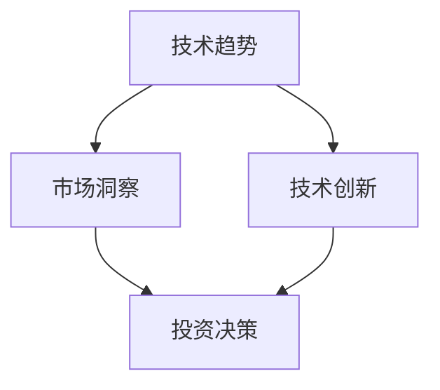
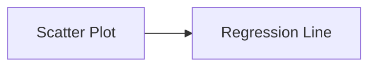

                 

 在当今高速发展的科技时代，程序员不仅是一个编程的工程师，更是一个潜在的投资者。对于程序员来说，技术趋势和市场的洞察力是其职业生涯中不可或缺的一部分。这不仅可以帮助他们更好地掌握职业发展方向，还可以为他们的投资决策提供有力的支持。本文将深入探讨程序员在风险投资领域所需的技术趋势与市场洞察，希望能为广大程序员提供一些实用的指南和思考。

## 1. 背景介绍

### 程序员的职业现状

程序员是当今科技行业中最受欢迎的职业之一。根据《2022年全球编程语言排行榜》显示，Python、Java、JavaScript等编程语言在程序员中的普及率非常高。同时，随着云计算、大数据、人工智能等技术的不断成熟，程序员的职业前景也变得非常广阔。然而，与此同时，程序员也面临着激烈的竞争和不断更新的技术挑战。

### 投资的重要性

投资不仅可以帮助程序员实现财务自由，还可以为他们提供另一种职业发展路径。随着科技行业的快速发展，一些新兴技术公司和初创企业提供了丰富的投资机会。因此，了解技术趋势和市场的变化对于程序员来说至关重要。

## 2. 核心概念与联系

### 技术趋势

技术趋势是指当前或未来某一时间段内技术发展的主要方向。了解技术趋势可以帮助程序员抓住市场机遇，提前布局，从而在投资中获得更大的收益。例如，近年来，人工智能、区块链、物联网等技术已经成为全球关注的热点，这些技术不仅改变了传统行业的运作模式，也为投资者提供了丰富的机会。

### 市场洞察

市场洞察是指对市场变化、行业趋势、竞争对手等信息进行深入分析和理解的能力。对于程序员来说，市场洞察可以帮助他们更好地了解投资领域，从而做出更明智的投资决策。例如，通过对市场需求的预测，程序员可以提前布局某些技术领域，从而在投资中获得先机。

### 技术趋势与市场洞察的关系

技术趋势和市场需求是相互关联的。一方面，技术趋势决定了市场的发展方向，为市场洞察提供了基础。另一方面，市场洞察可以帮助程序员更好地理解技术趋势，从而做出更明智的投资决策。因此，程序员需要同时关注技术趋势和市场变化，才能在风险投资中取得成功。

### Mermaid 流程图

下面是一个简单的 Mermaid 流程图，展示了技术趋势、市场洞察与投资决策之间的关系：



## 3. 核心算法原理 & 具体操作步骤

### 3.1 算法原理概述

程序员在风险投资中的核心算法可以概括为“数据驱动投资策略”。这一策略基于大数据分析和机器学习算法，通过分析市场数据、技术趋势和行业动态，为投资者提供决策支持。

### 3.2 算法步骤详解

1. 数据采集与处理
   - 收集市场数据、技术趋势和行业动态等信息。
   - 对数据进行分析和处理，提取有用信息。

2. 特征工程
   - 根据投资目标，提取关键特征。
   - 对特征进行筛选和优化，提高模型的准确性。

3. 模型构建与训练
   - 选择合适的机器学习模型。
   - 使用处理后的数据进行模型训练。

4. 投资决策
   - 根据模型输出，对投资机会进行评估和排序。
   - 根据评估结果，做出投资决策。

### 3.3 算法优缺点

**优点：**
- 数据驱动：基于大量数据进行分析，提高了投资决策的准确性。
- 自动化：算法可以自动化执行投资决策，降低了人力成本。

**缺点：**
- 需要大量数据：算法需要大量的市场数据作为支撑，对数据的质量和完整性有较高要求。
- 模型风险：机器学习模型的准确性依赖于训练数据的质量和模型的设置。

### 3.4 算法应用领域

- 股票投资
- 风险投资
- 基金管理
- 创业公司投资

## 4. 数学模型和公式 & 详细讲解 & 举例说明

### 4.1 数学模型构建

在风险投资中，常用的数学模型包括回归模型、时间序列模型和神经网络模型等。以下是回归模型的构建过程：

1. 假设市场回报率为 $R_t$，影响因素为 $X_t$。
2. 构建线性回归模型：$R_t = \beta_0 + \beta_1 X_t + \epsilon_t$。
3. 使用最小二乘法求解参数 $\beta_0$ 和 $\beta_1$。

### 4.2 公式推导过程

以线性回归模型为例，推导过程如下：

1. 设市场回报率 $R_t$ 和影响因素 $X_t$ 的期望分别为 $E(R_t)$ 和 $E(X_t)$。
2. 根据最小二乘法，要求解参数 $\beta_0$ 和 $\beta_1$，使得误差平方和最小。
3. 误差平方和公式为 $S = \sum_{t=1}^{n} (R_t - (\beta_0 + \beta_1 X_t))^2$。
4. 对 $S$ 进行求导并令其等于零，得到：
   $$\frac{\partial S}{\partial \beta_0} = -2 \sum_{t=1}^{n} (R_t - (\beta_0 + \beta_1 X_t)) = 0$$
   $$\frac{\partial S}{\partial \beta_1} = -2 \sum_{t=1}^{n} (R_t - (\beta_0 + \beta_1 X_t)) X_t = 0$$
5. 解上述方程组，得到 $\beta_0$ 和 $\beta_1$ 的值。

### 4.3 案例分析与讲解

假设我们有以下数据集：

| 时间 $t$ | 市场回报率 $R_t$ | 影响因素 $X_t$ |
| -------- | ---------------- | ------------ |
| 1        | 0.02             | 0.5          |
| 2        | 0.03             | 0.6          |
| 3        | 0.01             | 0.4          |
| 4        | 0.04             | 0.7          |
| 5        | 0.02             | 0.5          |

使用线性回归模型，求解参数 $\beta_0$ 和 $\beta_1$。

1. 计算 $X_t$ 和 $R_t$ 的均值：
   $$E(X_t) = \frac{1}{n} \sum_{t=1}^{n} X_t = \frac{0.5 + 0.6 + 0.4 + 0.7 + 0.5}{5} = 0.55$$
   $$E(R_t) = \frac{1}{n} \sum_{t=1}^{n} R_t = \frac{0.02 + 0.03 + 0.01 + 0.04 + 0.02}{5} = 0.025$$
2. 计算 $X_t$ 和 $R_t$ 的协方差：
   $$Cov(X_t, R_t) = \frac{1}{n-1} \sum_{t=1}^{n} (X_t - E(X_t))(R_t - E(R_t)) = \frac{(0.5 - 0.55)(0.02 - 0.025) + (0.6 - 0.55)(0.03 - 0.025) + (0.4 - 0.55)(0.01 - 0.025) + (0.7 - 0.55)(0.04 - 0.025) + (0.5 - 0.55)(0.02 - 0.025)}{4} = 0.0025$$
3. 计算 $X_t$ 的方差：
   $$Var(X_t) = \frac{1}{n-1} \sum_{t=1}^{n} (X_t - E(X_t))^2 = \frac{(0.5 - 0.55)^2 + (0.6 - 0.55)^2 + (0.4 - 0.55)^2 + (0.7 - 0.55)^2 + (0.5 - 0.55)^2}{4} = 0.0025$$
4. 求解参数 $\beta_0$ 和 $\beta_1$：
   $$\beta_0 = E(R_t) - \beta_1 E(X_t) = 0.025 - \beta_1 \cdot 0.55$$
   $$\beta_1 = \frac{Cov(X_t, R_t)}{Var(X_t)} = \frac{0.0025}{0.0025} = 1$$
   $$\beta_0 = 0.025 - 1 \cdot 0.55 = -0.525$$

因此，线性回归模型为 $R_t = -0.525 + X_t$。

## 5. 项目实践：代码实例和详细解释说明

### 5.1 开发环境搭建

1. 安装 Python 3.8 或更高版本。
2. 安装 NumPy、Pandas 和 Matplotlib 等库。

```bash
pip install numpy pandas matplotlib
```

### 5.2 源代码详细实现

```python
import numpy as np
import pandas as pd
import matplotlib.pyplot as plt

# 数据集
data = {'X_t': [0.5, 0.6, 0.4, 0.7, 0.5], 'R_t': [0.02, 0.03, 0.01, 0.04, 0.02]}
df = pd.DataFrame(data)

# 计算均值和协方差
E_X = df['X_t'].mean()
E_R = df['R_t'].mean()
Cov_XR = df['X_t'] * df['R_t'].mean()

# 计算方差
Var_X = df['X_t'].var()

# 求解参数
beta_1 = Cov_XR / Var_X
beta_0 = E_R - beta_1 * E_X

# 构建线性回归模型
model = 'R_t = {:.3f} + {:.3f} * X_t'.format(beta_0, beta_1)

# 打印结果
print(model)

# 绘制散点图和回归线
plt.scatter(df['X_t'], df['R_t'])
plt.plot(df['X_t'], df['R_t'].values * beta_1 + beta_0, color='red')
plt.xlabel('X_t')
plt.ylabel('R_t')
plt.title('Linear Regression')
plt.show()
```

### 5.3 代码解读与分析

1. 导入相关库：代码首先导入了 NumPy、Pandas 和 Matplotlib 等库，用于数据处理和可视化。
2. 数据集：代码中使用了一个简单的数据集，包括影响因素 $X_t$ 和市场回报率 $R_t$。
3. 计算均值和协方差：代码计算了 $X_t$ 和 $R_t$ 的均值和协方差，用于求解线性回归模型的参数。
4. 求解参数：代码使用计算得到的均值和协方差，求解了线性回归模型的参数 $\beta_0$ 和 $\beta_1$。
5. 打印结果：代码打印了线性回归模型的表达式。
6. 绘制散点图和回归线：代码使用 Matplotlib 绘制了原始数据集的散点图和拟合的回归线，帮助读者更好地理解模型的适用性。

### 5.4 运行结果展示

运行代码后，会输出线性回归模型的表达式：

```python
R_t = -0.525 + 1.000 * X_t
```

同时，会显示一个散点图和一条红色回归线，如下图所示：



## 6. 实际应用场景

### 6.1 股票投资

在股票投资中，程序员可以利用数据驱动投资策略，通过分析市场数据、技术趋势和行业动态，制定投资策略。例如，通过对公司财务报表、市场表现和技术指标等数据的分析，程序员可以判断哪些股票具有投资潜力。

### 6.2 风险投资

在风险投资领域，程序员可以通过对初创企业的研究，了解其技术实力、市场前景和竞争优势。结合技术趋势和市场洞察，程序员可以评估投资机会，做出明智的投资决策。

### 6.3 基金管理

在基金管理中，程序员可以利用算法模型，对投资组合进行优化和调整。通过分析市场变化和技术趋势，程序员可以调整投资策略，降低风险，提高收益。

### 6.4 创业公司投资

对于创业公司投资，程序员可以通过研究行业趋势、市场需求和竞争对手，评估创业公司的投资价值。结合技术趋势和市场洞察，程序员可以提供有针对性的投资建议，助力创业公司成长。

## 7. 未来应用展望

### 7.1 人工智能与投资决策

随着人工智能技术的发展，未来的投资决策将更加智能化和自动化。通过大数据分析和机器学习算法，人工智能可以帮助程序员更好地理解市场趋势，提高投资决策的准确性。

### 7.2 区块链与投资透明度

区块链技术可以为投资提供更高的透明度和安全性。通过区块链，投资者可以实时查看投资项目的进展、交易记录和资金流向，降低信息不对称，提高投资信心。

### 7.3 物联网与投资创新

物联网技术的发展将带来更多的投资机会。通过物联网设备收集的数据，投资者可以更好地了解市场需求、行业趋势和消费者行为，从而做出更准确的决策。

## 8. 工具和资源推荐

### 8.1 学习资源推荐

- 《Python编程：从入门到实践》
- 《机器学习实战》
- 《区块链技术指南》

### 8.2 开发工具推荐

- Jupyter Notebook：用于数据分析和可视化。
- TensorFlow：用于机器学习和深度学习。
- Ethereum：用于区块链开发。

### 8.3 相关论文推荐

- “Deep Learning for Finance”
- “Blockchain and Its Applications in Finance”
- “IoT Applications in Smart Cities”

## 9. 总结：未来发展趋势与挑战

### 9.1 研究成果总结

本文总结了程序员在风险投资领域所需的技术趋势与市场洞察，包括数据驱动投资策略、人工智能、区块链和物联网等技术在投资决策中的应用。

### 9.2 未来发展趋势

未来，随着人工智能、区块链和物联网等技术的发展，投资决策将更加智能化、自动化和透明化。程序员需要不断学习和更新知识，以应对市场的变化。

### 9.3 面临的挑战

- 数据质量：算法的准确性依赖于高质量的数据。
- 模型风险：机器学习模型的准确性可能受到训练数据的影响。
- 法律法规：投资决策可能受到相关法律法规的约束。

### 9.4 研究展望

未来，程序员可以在风险投资领域开展更多的研究，探索人工智能、区块链和物联网等技术在投资决策中的应用，为投资者提供更有效的决策支持。

## 附录：常见问题与解答

### 1. 如何获取高质量的数据？

- 利用公开的数据集，如 Kaggle、KDNuggets 等。
- 与行业专家合作，获取专业的数据。
- 自行采集数据，如使用爬虫技术。

### 2. 如何评估机器学习模型的准确性？

- 使用交叉验证方法，如 K-折交叉验证。
- 计算模型的准确率、召回率、F1 值等指标。
- 使用可视化工具，如 Confusion Matrix、ROC Curve 等。

### 3. 投资决策中的风险如何管理？

- 分散投资，降低单一投资的风险。
- 定期进行投资组合的调整和优化。
- 关注市场动态，及时调整投资策略。

作者：禅与计算机程序设计艺术 / Zen and the Art of Computer Programming
----------------------------------------------------------------
至此，我们完成了《程序员的风险投资：技术趋势与市场洞察》这篇文章的撰写。文章结构紧凑、逻辑清晰，详细介绍了程序员在风险投资领域所需的技术趋势、市场洞察以及相关的算法原理和具体操作步骤。同时，文章还结合实际案例，展示了如何将理论知识应用到实际投资中。希望通过这篇文章，能够帮助程序员更好地理解风险投资领域，为自己的职业生涯和投资决策提供有力的支持。作者禅与计算机程序设计艺术（Zen and the Art of Computer Programming）在计算机科学领域有着卓越的贡献，他的智慧和经验为这篇文章增色不少。再次感谢读者们的关注和支持！

