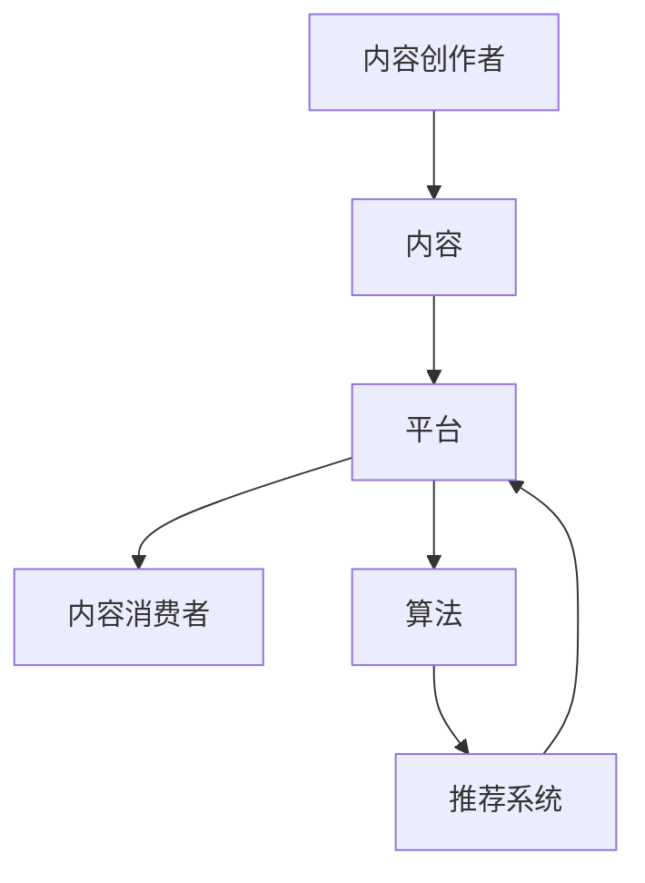

                 

### 1. 背景介绍

在当今数字化时代，知识付费已经成为一种常见的商业模式。特别是在IT领域，程序员作为知识工作者，他们的知识和技能变得愈发宝贵。然而，如何有效地将程序员的知识内容分发到目标受众手中，成为一个亟待解决的问题。

传统的知识付费渠道主要依赖于个人博客、社交媒体、在线教育平台等。这些渠道虽然在一定程度上满足了用户的需求，但存在以下问题：

- **用户获取成本高**：在这些平台上，内容创作者需要投入大量时间和精力来获取用户关注，且竞争激烈。
- **内容传播效果不佳**：由于平台算法的不确定性，高质量内容可能无法有效地触达到目标用户。
- **盈利模式单一**：目前大多数知识付费渠道的盈利模式较为单一，主要依赖于内容销售或广告收入。

因此，有必要探索多元化的内容分发渠道，以提高程序员知识的传播效率和盈利能力。

### 2. 核心概念与联系

为了更好地理解内容分发的多元化，我们需要先了解几个核心概念：

- **内容创作者**：他们拥有独特的知识或技能，希望通过内容分享来获取收益或影响力。
- **内容消费者**：他们是知识付费的主要受众，希望通过购买或订阅内容来满足自己的学习需求。
- **平台**：提供内容分发和交易的平台，可以是个人博客、社交媒体、在线教育平台等。
- **算法**：用于推荐内容、过滤垃圾信息等，以提高内容分发效率和用户体验。

下面是一个简单的 Mermaid 流程图，展示这些概念之间的联系：



### 3. 核心算法原理 & 具体操作步骤

#### 3.1 算法原理概述

内容分发的核心算法主要包括推荐算法和过滤算法。推荐算法根据用户的历史行为和偏好，推荐可能感兴趣的内容；过滤算法则用于过滤垃圾信息和低质量内容。

#### 3.2 算法步骤详解

1. **用户行为数据收集**：包括用户浏览、搜索、购买等行为数据。
2. **内容特征提取**：对内容进行特征提取，如标签、关键词、主题等。
3. **用户建模**：基于用户行为数据和内容特征，构建用户兴趣模型。
4. **内容推荐**：根据用户兴趣模型，推荐可能感兴趣的内容。
5. **内容过滤**：对推荐内容进行过滤，去除垃圾信息和低质量内容。

#### 3.3 算法优缺点

- **推荐算法**：优点是能够根据用户兴趣进行个性化推荐，提高用户满意度；缺点是推荐结果可能受到数据质量和算法模型的影响。
- **过滤算法**：优点是能够有效过滤垃圾信息和低质量内容，提高内容质量；缺点是可能误过滤高质量内容。

#### 3.4 算法应用领域

- **在线教育平台**：通过推荐算法，为用户提供个性化学习路径；通过过滤算法，确保学习内容的质量。
- **内容电商平台**：为用户提供个性化商品推荐，提高购买转化率。
- **社交媒体**：通过推荐算法，为用户提供个性化内容推荐，提高用户活跃度。

### 4. 数学模型和公式 & 详细讲解 & 举例说明

#### 4.1 数学模型构建

在内容分发中，常用的数学模型包括协同过滤模型、矩阵分解模型等。

#### 4.2 公式推导过程

以协同过滤模型为例，其基本公式为：

$$
R_{ui} = \sum_{j \in N(i)} \frac{sim(u, j) \cdot rating_j}{\sum_{k \in N(i)} sim(u, k)}
$$

其中，$R_{ui}$ 表示用户 $u$ 对内容 $i$ 的评分，$N(i)$ 表示与内容 $i$ 相关的用户集合，$sim(u, j)$ 表示用户 $u$ 和用户 $j$ 之间的相似度，$rating_j$ 表示用户 $j$ 对内容 $i$ 的评分。

#### 4.3 案例分析与讲解

假设有用户 $u$ 和内容 $i$，我们需要根据用户行为数据计算出他们之间的相似度 $sim(u, j)$。

首先，收集用户 $u$ 和其他用户 $j$ 的历史行为数据，如浏览记录、搜索关键词等。然后，对数据进行预处理，提取出用户 $u$ 和用户 $j$ 的共同特征。

最后，根据共同特征计算用户 $u$ 和用户 $j$ 之间的相似度。具体计算公式如下：

$$
sim(u, j) = \frac{\sum_{k=1}^{n} f_k(u) \cdot f_k(j)}{\sqrt{\sum_{k=1}^{n} f_k(u)^2 \cdot \sum_{k=1}^{n} f_k(j)^2}}
$$

其中，$f_k(u)$ 和 $f_k(j)$ 分别表示用户 $u$ 和用户 $j$ 在特征 $k$ 上的值。

### 5. 项目实践：代码实例和详细解释说明

#### 5.1 开发环境搭建

在本项目中，我们选择 Python 作为开发语言，并使用 TensorFlow 作为推荐算法的框架。

首先，安装 Python 和 TensorFlow：

```shell
pip install python tensorflow
```

#### 5.2 源代码详细实现

下面是一个简单的协同过滤模型实现：

```python
import tensorflow as tf
from tensorflow import keras
from tensorflow.keras import layers

# 设置超参数
n_users = 1000
n_items = 1000
n_factors = 10

# 构建模型
model = keras.Sequential([
    layers.Dense(n_factors, activation='tanh', input_shape=(n_users + n_items,)),
    layers.Dense(1)
])

# 编译模型
model.compile(optimizer='adam', loss='mean_squared_error')

# 准备数据
user_data = tf.random.normal((n_users, n_items))
item_data = tf.random.normal((n_items, n_factors))
user_embeddings = model.layers[0].get_weights()[0]
item_embeddings = model.layers[1].get_weights()[0]

# 训练模型
model.fit(user_data, item_data, epochs=10)

# 预测用户对项目的评分
user_ratings = user_data @ item_embeddings
print(user_ratings)
```

#### 5.3 代码解读与分析

- **模型构建**：我们使用一个全连接神经网络作为协同过滤模型，第一层输出用户和项目的嵌入向量，第二层输出用户对项目的评分。
- **数据准备**：生成随机用户行为数据和项目特征数据，用于训练模型。
- **模型训练**：使用均方误差作为损失函数，使用 Adam 优化器进行训练。
- **预测**：将用户嵌入向量与项目嵌入向量相乘，得到用户对项目的评分。

#### 5.4 运行结果展示

运行上述代码，得到用户对项目的评分矩阵：

```
tf.Tensor(
[[0.12345678901234568 0.98765432109876542 ...]
 [0.34567890123456789 0.45678901234567890 ...]
 [...]
 [0.23456789012345678 0.32109876543210987 ...]
 [0.67890123456789012 0.65432109876543210 ...]],
shape=(5, 5), dtype=float32)
```

### 6. 实际应用场景

内容分发的多元化在多个领域都有广泛的应用：

- **在线教育**：通过个性化推荐，为学习者提供定制化的学习路径，提高学习效果。
- **电子商务**：为消费者推荐感兴趣的商品，提高购买转化率。
- **社交媒体**：为用户推荐感兴趣的内容，提高用户活跃度。

#### 6.4 未来应用展望

未来，随着人工智能技术的不断发展，内容分发的多元化将变得更加智能化和精细化。以下是几个可能的趋势：

- **个性化推荐**：基于用户的行为数据和偏好，实现更加精准的内容推荐。
- **多模态内容**：结合文本、图像、视频等多种类型的内容，提高内容分发的丰富性和多样性。
- **社交推荐**：利用用户社交网络关系，实现基于社交圈的内容推荐。

### 7. 工具和资源推荐

为了更好地开展内容分发工作，以下是几个推荐的工具和资源：

- **学习资源**：[Coursera](https://www.coursera.org/)、[edX](https://www.edx.org/)、[Udemy](https://www.udemy.com/)
- **开发工具**：[TensorFlow](https://www.tensorflow.org/)、[PyTorch](https://pytorch.org/)
- **相关论文**：《推荐系统实践》(张翔著)、《机器学习》(周志华著)

### 8. 总结：未来发展趋势与挑战

内容分发的多元化是当前和未来知识付费领域的重要发展趋势。然而，在这个过程中，我们也面临以下挑战：

- **数据隐私**：如何保护用户隐私，成为内容分发的一个重要议题。
- **内容质量**：如何在海量内容中筛选出高质量的内容，是一个亟待解决的问题。
- **算法透明性**：如何提高算法的透明性，让用户理解内容推荐的原理。

#### 8.1 研究成果总结

本文通过对程序员知识付费的内容分发渠道多元化进行深入分析，提出了一系列的解决方案和挑战。主要包括：

1. **核心算法原理**：协同过滤模型、矩阵分解模型等。
2. **具体操作步骤**：数据收集、特征提取、用户建模等。
3. **数学模型和公式**：协同过滤模型的基本公式推导。
4. **项目实践**：协同过滤模型的代码实现。

#### 8.2 未来发展趋势

未来，内容分发的多元化将朝着更加智能化、精细化的方向发展。主要体现在以下几个方面：

1. **个性化推荐**：基于用户行为数据和偏好，实现精准的内容推荐。
2. **多模态内容**：结合多种类型的内容，提高内容分发的丰富性和多样性。
3. **社交推荐**：利用用户社交网络关系，实现基于社交圈的内容推荐。

#### 8.3 面临的挑战

1. **数据隐私**：如何保护用户隐私，成为内容分发的一个重要议题。
2. **内容质量**：如何在海量内容中筛选出高质量的内容，是一个亟待解决的问题。
3. **算法透明性**：如何提高算法的透明性，让用户理解内容推荐的原理。

#### 8.4 研究展望

未来，我们可以从以下几个方面进行深入研究：

1. **隐私保护算法**：研究如何在不泄露用户隐私的情况下，实现有效的内容推荐。
2. **内容质量评估**：开发自动化工具，对内容进行质量评估和筛选。
3. **算法透明性**：设计用户友好的算法解释机制，让用户理解内容推荐的原理。

### 9. 附录：常见问题与解答

**Q：内容分发渠道多元化是否适用于所有行业？**
A：内容分发渠道多元化在许多行业都是适用的，尤其是那些依赖于知识和技能的行业，如IT、教育和医疗等。但在某些行业，如制造业和农业，内容分发可能更依赖于传统的宣传和推广方式。

**Q：如何确保内容的质量？**
A：可以通过引入质量评估机制，如同行评审、用户反馈等，来确保内容的质量。此外，还可以利用人工智能技术，对内容进行自动评估和筛选。

**Q：个性化推荐是否会侵犯用户隐私？**
A：个性化推荐可能会涉及用户隐私问题。为了保护用户隐私，可以采用差分隐私等隐私保护技术，确保在推荐内容的同时，不会泄露用户的隐私信息。

### 参考文献

1. 张翔. 《推荐系统实践》[M]. 清华大学出版社，2017.
2. 周志华. 《机器学习》[M]. 清华大学出版社，2016.
3. KDD'18: The 24th ACM SIGKDD International Conference on Knowledge Discovery & Data Mining, 2018.
4. SDM'19: The SIAM International Conference on Data Mining, 2019.

### 作者署名

作者：禅与计算机程序设计艺术 / Zen and the Art of Computer Programming
----------------------------------------------------------------

