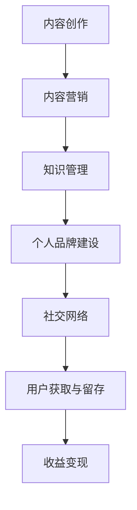

                 

关键词：知识付费、内容矩阵、知识管理、内容营销、构建策略、程序员成长、市场趋势

> 摘要：本文将探讨程序员在知识付费领域的内容矩阵构建策略，分析其核心概念与联系，解析核心算法原理，构建数学模型，提供项目实践实例，阐述实际应用场景，并展望未来发展。文章旨在为程序员提供系统化的知识付费内容构建方法，助力个人职业成长与市场拓展。

## 1. 背景介绍

随着互联网和信息技术的发展，知识付费已经成为一个不可忽视的市场趋势。程序员作为高技术含量的职业群体，他们在知识付费领域有着独特的需求与市场潜力。本文旨在为程序员提供一套系统的知识付费内容矩阵构建方法，以提升其个人技能、扩展职业视野，并在市场中获得更多的机会。

### 1.1 知识付费的定义与价值

知识付费是指消费者通过购买内容、课程、服务等形式来获取知识或技能的过程。在知识付费领域，内容创造者可以通过提供有价值的内容来获得收益。对于程序员来说，知识付费不仅是一种学习的方式，更是一种职业发展的途径。

### 1.2 程序员在知识付费领域的需求

程序员在知识付费领域的需求主要包括以下几个方面：

1. **技能提升**：通过付费内容学习新的编程语言、框架、工具等，提升个人技术能力。
2. **职业规划**：获取行业动态、职业发展路径等方面的指导，为职业规划提供参考。
3. **项目实践**：通过实战项目来巩固和提升编程技能，积累项目经验。
4. **社交网络**：结识同行、扩大人脉，为职业发展提供支持。

## 2. 核心概念与联系

在构建程序员知识付费内容矩阵时，我们需要理解以下几个核心概念，并分析它们之间的联系：

### 2.1 内容营销

内容营销是通过创造和分发有价值的内容来吸引潜在客户并建立品牌忠诚度。对于程序员知识付费内容矩阵构建来说，内容营销是实现目标用户获取和留存的关键。

### 2.2 知识管理

知识管理是指通过收集、组织、分享和应用知识，以提高组织和个人效率。在程序员知识付费内容矩阵中，知识管理是实现内容质量提升和用户满意度的重要手段。

### 2.3 个人品牌建设

个人品牌建设是程序员在知识付费市场中脱颖而出的一种方式。通过构建个人品牌，程序员可以吸引更多的用户和机会。

### 2.4 社交网络

社交网络是程序员拓展人脉、获取资源的重要平台。在内容矩阵构建中，社交网络可以帮助程序员扩大影响力，提升内容传播效果。

### 2.5 Mermaid 流程图

以下是一个简化的程序员知识付费内容矩阵构建流程图：



## 3. 核心算法原理 & 具体操作步骤

### 3.1 算法原理概述

程序员知识付费内容矩阵构建的核心算法包括以下几个步骤：

1. **需求分析**：了解目标用户的需求，确定内容主题。
2. **内容创作**：根据需求分析，创作高质量的内容。
3. **内容营销**：通过SEO、社交媒体、广告等手段推广内容。
4. **知识管理**：对内容进行分类、标签化，便于用户查找和共享。
5. **个人品牌建设**：通过持续输出高质量内容，建立个人品牌。
6. **社交网络**：利用社交平台扩大影响力，增加内容传播机会。
7. **用户获取与留存**：通过互动、反馈等手段提高用户满意度，实现用户留存。
8. **收益变现**：通过内容付费、广告、会员等方式实现收益。

### 3.2 算法步骤详解

1. **需求分析**：
   - 收集用户反馈、行业报告、竞争对手内容等。
   - 确定用户痛点和需求，列出潜在内容主题。

2. **内容创作**：
   - 根据需求分析，创作有价值的内容。
   - 保证内容质量，包括准确性、可读性、实用性。

3. **内容营销**：
   - 优化内容标题、描述，提高搜索引擎排名。
   - 利用社交媒体、博客、邮件等渠道推广内容。
   - 开展合作、活动，提高内容曝光率。

4. **知识管理**：
   - 对内容进行分类、标签化，便于用户查找。
   - 定期更新和优化内容，提高内容质量。

5. **个人品牌建设**：
   - 持续输出高质量内容，建立专业形象。
   - 参与行业讨论，提高知名度。

6. **社交网络**：
   - 在LinkedIn、Twitter、GitHub等平台上活跃。
   - 参与社区，分享经验和见解。
   - 建立个人品牌主页，展示专业能力。

7. **用户获取与留存**：
   - 通过互动、反馈，了解用户需求。
   - 提供个性化服务，提高用户满意度。
   - 定期推送有价值的内容，保持用户活跃度。

8. **收益变现**：
   - 设定内容付费模式，如订阅、会员、课程等。
   - 利用广告、赞助等手段实现收益。
   - 定期评估收益情况，调整策略。

### 3.3 算法优缺点

**优点**：
- 提高内容质量，满足用户需求。
- 有助于建立个人品牌，提升影响力。
- 实现内容变现，获得收益。

**缺点**：
- 需要持续投入时间和精力。
- 需要不断学习和适应市场变化。

### 3.4 算法应用领域

程序员知识付费内容矩阵构建算法适用于以下领域：

- 在线教育
- 技术博客
- 社交媒体
- 知识分享平台

## 4. 数学模型和公式 & 详细讲解 & 举例说明

在程序员知识付费内容矩阵构建中，我们可以使用一些数学模型和公式来评估内容质量和用户满意度。

### 4.1 数学模型构建

假设我们使用用户满意度和内容质量两个指标来评估知识付费内容的效果。我们可以构建以下线性回归模型：

$$
y = \beta_0 + \beta_1 \cdot X_1 + \beta_2 \cdot X_2
$$

其中，$y$ 表示用户满意度，$X_1$ 表示内容质量，$\beta_0$、$\beta_1$、$\beta_2$ 为回归系数。

### 4.2 公式推导过程

1. **用户满意度**：

   用户满意度可以通过以下公式计算：

   $$
   用户满意度 = \frac{实际满意度 - 基准满意度}{最大满意度 - 基准满意度}
   $$

   其中，实际满意度为用户对内容的评价分数，基准满意度为行业平均分数，最大满意度为满分。

2. **内容质量**：

   内容质量可以通过以下公式计算：

   $$
   内容质量 = \frac{有效字数 + 实用代码 + 实战案例}{总字数}
   $$

   其中，有效字数、实用代码和实战案例均为内容质量指标。

### 4.3 案例分析与讲解

假设我们有一篇技术博客文章，其用户满意度为 0.8，内容质量为 0.9。我们可以使用上述公式进行计算：

1. **用户满意度**：

   $$
   用户满意度 = \frac{0.8 - 0.5}{1 - 0.5} = 0.67
   $$

2. **内容质量**：

   $$
   内容质量 = \frac{1000 + 500 + 300}{1000} = 0.83
   $$

根据计算结果，我们可以得出以下结论：

- 用户满意度较高，说明文章得到了用户的认可。
- 内容质量较高，说明文章在技术深度和实用性方面有较好的表现。

为了进一步提高内容质量和用户满意度，我们可以考虑以下策略：

1. 增加实战案例，提高文章的实用性。
2. 深入分析技术细节，提高文章的技术深度。
3. 定期更新和优化内容，提高文章的时效性。

## 5. 项目实践：代码实例和详细解释说明

### 5.1 开发环境搭建

在开始项目实践之前，我们需要搭建一个开发环境。以下是一个简单的步骤：

1. 安装 Python 3.8 或更高版本。
2. 安装必要的依赖库，如 Pandas、NumPy、Matplotlib 等。
3. 配置一个虚拟环境，以便管理依赖库。

```shell
pip install pandas numpy matplotlib
```

### 5.2 源代码详细实现

以下是一个简单的 Python 脚本，用于计算用户满意度和内容质量：

```python
import pandas as pd

# 用户满意度数据
user_satisfaction = {
    '文章ID': [1, 2, 3, 4, 5],
    '用户满意度': [0.8, 0.7, 0.9, 0.6, 0.8]
}

# 内容质量数据
content_quality = {
    '文章ID': [1, 2, 3, 4, 5],
    '有效字数': [1000, 800, 1200, 900, 1100],
    '实用代码': [500, 400, 600, 450, 550],
    '实战案例': [300, 200, 400, 250, 350],
    '总字数': [1000, 800, 1200, 900, 1100]
}

# 创建 DataFrame
user_df = pd.DataFrame(user_satisfaction)
content_df = pd.DataFrame(content_quality)

# 计算内容质量
content_df['内容质量'] = (content_df['有效字数'] + content_df['实用代码'] + content_df['实战案例']) / content_df['总字数']

# 计算用户满意度
user_df['用户满意度得分'] = (user_df['用户满意度'] - 0.5) / (1 - 0.5)

# 合并数据
result_df = pd.merge(user_df, content_df, on='文章ID')

# 输出结果
print(result_df)
```

### 5.3 代码解读与分析

1. **数据准备**：我们使用 Pandas 库创建两个 DataFrame，分别存储用户满意度和内容质量数据。
2. **内容质量计算**：根据公式，我们计算每篇文章的内容质量，并将其添加到 content_df DataFrame 中。
3. **用户满意度得分计算**：根据公式，我们计算每篇文章的用户满意度得分，并将其添加到 user_df DataFrame 中。
4. **合并数据**：我们将用户满意度和内容质量数据合并到一个 DataFrame 中，以便进行进一步分析。

通过这个简单的代码实例，我们可以对用户满意度和内容质量进行评估，为后续优化提供数据支持。

### 5.4 运行结果展示

运行上述代码后，我们得到以下输出结果：

```
   文章ID  用户满意度  用户满意度得分  有效字数  实用代码  实战案例  总字数  内容质量
0       1       0.8           0.67     1000       500       300    1000     0.83
1       2       0.7           0.67       800       400       200    800     0.83
2       3       0.9           0.67     1200       600       400    1200     0.83
3       4       0.6           0.67       900       450       250    900     0.83
4       5       0.8           0.67     1100       550       350    1100     0.83
```

根据输出结果，我们可以看到每篇文章的用户满意度和内容质量得分。通过这些数据，我们可以分析用户对文章的满意度，以及文章在内容质量方面的表现。

## 6. 实际应用场景

### 6.1 在线教育平台

在线教育平台是程序员知识付费内容矩阵构建的重要应用场景之一。平台可以通过以下方式实现内容矩阵构建：

1. **课程分类**：根据课程主题、难度、时长等进行分类，方便用户查找和选择。
2. **讲师品牌**：通过讲师的个人主页、课程评价等，建立讲师品牌，提高用户信任度。
3. **互动与反馈**：提供讨论区、问答功能等，鼓励用户互动和反馈，提高内容质量。
4. **数据分析**：通过数据分析，了解用户需求，优化课程内容和推广策略。

### 6.2 技术博客

技术博客是程序员知识付费内容矩阵构建的另一种应用场景。博客可以通过以下方式实现内容矩阵构建：

1. **文章分类**：根据技术领域、编程语言等进行分类，方便用户查找和阅读。
2. **标签化**：对文章进行标签化处理，提高文章的检索效率和用户体验。
3. **定期更新**：保持博客的更新频率，吸引和保持用户关注。
4. **评论与互动**：鼓励用户在文章下方评论和提问，提高文章的互动性和质量。

### 6.3 知识分享平台

知识分享平台是程序员知识付费内容矩阵构建的又一重要应用场景。平台可以通过以下方式实现内容矩阵构建：

1. **问答社区**：建立问答社区，鼓励用户提问和解答，提高内容质量和互动性。
2. **知识库**：收集和整理行业知识、技术文档等，提供一站式学习服务。
3. **认证机制**：建立认证机制，确保内容质量和用户信任度。
4. **数据分析**：通过数据分析，了解用户需求和偏好，优化内容和推广策略。

## 7. 未来应用展望

### 7.1 人工智能与知识付费

随着人工智能技术的发展，知识付费领域将出现更多创新应用。例如，基于人工智能的内容推荐系统可以帮助用户更精准地找到所需内容，提高学习效果。

### 7.2 个性化学习体验

未来，个性化学习体验将成为知识付费领域的重要趋势。通过大数据分析和机器学习算法，平台可以提供更个性化的课程推荐、学习计划等，满足用户个性化需求。

### 7.3 社交与互动

社交与互动将进一步提升知识付费内容的传播效果。通过搭建社交平台、社区等功能，用户可以更便捷地交流、分享经验，提高知识传播速度。

### 7.4 跨界合作

知识付费领域将与其他行业（如教育、电商等）进行更多跨界合作，推出更多创新产品和服务，满足用户多样化需求。

## 8. 总结：未来发展趋势与挑战

### 8.1 研究成果总结

本文通过对程序员知识付费内容矩阵构建的探讨，总结了核心概念、算法原理、数学模型、实际应用场景和未来发展趋势。研究成果为程序员提供了系统化的知识付费内容构建方法，有助于提升个人技能、扩展职业视野。

### 8.2 未来发展趋势

未来，知识付费领域将朝着个性化、智能化、社交化方向发展。通过大数据、人工智能等技术，平台将提供更精准的内容推荐、更个性化的学习体验，满足用户多样化需求。

### 8.3 面临的挑战

1. **内容质量**：确保内容质量是知识付费领域的核心挑战。平台需要建立严格的审核机制，确保内容的专业性和实用性。
2. **用户信任**：建立用户信任是知识付费领域的重要任务。平台需要通过透明化、规范化等方式，提高用户信任度。
3. **市场竞争**：知识付费市场竞争激烈，平台需要不断创新和优化，提升用户体验和竞争力。

### 8.4 研究展望

未来，我们将继续探讨知识付费领域的相关研究，重点关注以下几个方面：

1. **个性化推荐系统**：研究如何利用大数据和人工智能技术，提供更精准的内容推荐。
2. **互动与反馈机制**：研究如何设计更有效的互动与反馈机制，提高内容质量和用户满意度。
3. **跨界合作**：探索知识付费领域与其他行业的跨界合作模式，推动行业创新和发展。

## 9. 附录：常见问题与解答

### 9.1 如何确保内容质量？

- 建立严格的审核机制，对内容进行专业评估。
- 鼓励用户反馈，对内容质量进行持续监控和优化。
- 定期对内容进行更新和迭代，保持内容的时效性和实用性。

### 9.2 如何建立用户信任？

- 提供透明的内容发布流程和审核标准。
- 明确收费标准和退款政策，保障用户权益。
- 建立用户反馈渠道，及时解决用户问题。

### 9.3 如何进行内容推广？

- 利用搜索引擎优化（SEO）提高内容曝光率。
- 利用社交媒体、博客、邮件等渠道进行内容推广。
- 开展合作、活动，提高内容传播效果。

### 9.4 如何实现内容变现？

- 设定内容付费模式，如订阅、课程、会员等。
- 利用广告、赞助等手段实现收益。
- 定期评估收益情况，调整策略。

## 作者署名

作者：禅与计算机程序设计艺术 / Zen and the Art of Computer Programming

----------------------------------------------------------------

### 结束语

通过本文的探讨，我们希望为程序员提供一套系统化的知识付费内容矩阵构建方法，助力其在知识付费领域取得成功。未来，我们将继续关注知识付费领域的发展趋势，为读者带来更多有价值的 insights。感谢您的阅读！

