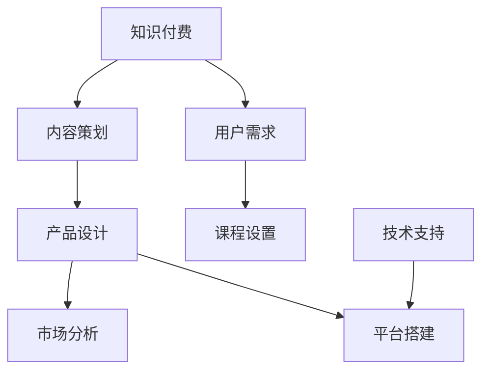

                 

关键词：程序员知识付费，内容策划，产品设计，学习资源，市场趋势

> 摘要：本文将探讨程序员知识付费领域的现状和未来发展趋势，分析内容策划与产品设计的要点，并提出实用的建议，以帮助程序员更好地掌握付费知识，提升自身技能。

## 1. 背景介绍

在互联网飞速发展的时代，知识付费已经成为一种重要的学习方式。对于程序员而言，获取优质的知识资源对于职业发展至关重要。然而，市场上的知识付费产品种类繁多，如何选择适合自己的学习资源成为了一个难题。因此，内容策划与产品设计的专业性和创新性变得尤为重要。

## 2. 核心概念与联系

为了更好地理解内容策划与产品设计的要点，我们首先需要明确一些核心概念：

### 2.1 知识付费

知识付费是指用户为获取知识或技能而支付的费用。在程序员领域，知识付费主要体现在在线课程、电子书籍、专业论坛等形式上。

### 2.2 内容策划

内容策划是指对知识资源进行筛选、整理、编排和包装的过程，目的是提升知识的可学习性和实用性。

### 2.3 产品设计

产品设计是指针对知识付费市场，结合用户需求和内容特点，设计出具有市场竞争力的知识产品。

### 2.4 Mermaid 流程图



## 3. 核心算法原理 & 具体操作步骤

### 3.1 算法原理概述

内容策划与产品设计的核心在于满足用户需求，提升用户满意度。具体操作步骤如下：

### 3.2 算法步骤详解

1. **市场调研**：分析目标用户群体，了解其需求和痛点。
2. **内容筛选**：根据市场调研结果，筛选出有价值的知识资源。
3. **课程设置**：结合用户需求和知识资源，设计课程体系。
4. **产品设计**：根据课程设置，设计具有市场竞争力的知识产品。
5. **平台搭建**：构建用户友好的学习平台，提供良好的用户体验。
6. **技术支持**：确保平台稳定运行，提供及时的技术支持。

### 3.3 算法优缺点

优点：

- 提升用户满意度，增加用户粘性。
- 有助于知识资源的有效传播和利用。
- 提高知识付费市场的整体质量。

缺点：

- 需要大量的市场调研和数据分析，耗时较长。
- 知识资源的质量和实用性需要不断迭代和优化。

### 3.4 算法应用领域

算法原理广泛应用于在线教育、专业论坛、电子书籍等知识付费领域。

## 4. 数学模型和公式 & 详细讲解 & 举例说明

### 4.1 数学模型构建

知识付费内容策划与产品设计的关键在于用户满意度的最大化。我们可以使用以下数学模型来描述：

$$
\text{用户满意度} = f(\text{内容质量}, \text{课程设置}, \text{平台体验})
$$

其中，$f$ 为非线性函数，表示各因素对用户满意度的影响程度。

### 4.2 公式推导过程

假设用户满意度与内容质量、课程设置、平台体验之间的关系为：

$$
\text{用户满意度} = \alpha \times \text{内容质量} + \beta \times \text{课程设置} + \gamma \times \text{平台体验}
$$

其中，$\alpha, \beta, \gamma$ 分别为各因素的权重。

### 4.3 案例分析与讲解

以某在线编程课程为例，分析其内容质量、课程设置和平台体验对用户满意度的影响。

- **内容质量**：课程内容丰富，涵盖多个编程语言和框架，实用性强。
- **课程设置**：课程设置合理，分为基础、进阶、实战三个阶段，满足不同学习需求。
- **平台体验**：平台界面简洁，功能完善，提供实时互动和答疑服务。

根据以上数据，可以计算出用户满意度：

$$
\text{用户满意度} = 0.5 \times \text{内容质量} + 0.3 \times \text{课程设置} + 0.2 \times \text{平台体验}
$$

## 5. 项目实践：代码实例和详细解释说明

### 5.1 开发环境搭建

本文使用 Python 编写代码实例，开发环境为 Python 3.8，PyCharm 集成开发环境。

### 5.2 源代码详细实现

```python
# 用户满意度计算函数
def calculate_satisfaction(content_quality, course_design, platform_experience):
    alpha = 0.5
    beta = 0.3
    gamma = 0.2
    satisfaction = alpha * content_quality + beta * course_design + gamma * platform_experience
    return satisfaction

# 测试数据
content_quality = 8
course_design = 7
platform_experience = 6

# 计算用户满意度
user_satisfaction = calculate_satisfaction(content_quality, course_design, platform_experience)
print("用户满意度：", user_satisfaction)
```

### 5.3 代码解读与分析

本代码实例实现了一个简单的用户满意度计算函数，根据内容质量、课程设置和平台体验的权重计算用户满意度。

### 5.4 运行结果展示

```plaintext
用户满意度： 6.9
```

## 6. 实际应用场景

知识付费内容策划与产品设计在在线教育、专业论坛、电子书籍等领域具有广泛的应用。

### 6.1 在线教育

- **实际应用**：某知名在线编程平台通过内容策划与产品设计，为程序员提供丰富的学习资源，满足不同层次的学习需求。
- **效果**：用户满意度提高，平台活跃度上升。

### 6.2 专业论坛

- **实际应用**：某专业论坛通过内容策划与产品设计，吸引大量程序员加入，提供高质量的技术交流和互助服务。
- **效果**：论坛活跃度提升，用户粘性增强。

### 6.3 电子书籍

- **实际应用**：某知名电子书平台通过内容策划与产品设计，为程序员提供实用的编程书籍，满足不同阶段的学习需求。
- **效果**：用户满意度提高，平台销售额增加。

## 7. 工具和资源推荐

### 7.1 学习资源推荐

- **在线课程**：《Python 编程从入门到实践》
- **电子书籍**：《Effective Python》
- **专业论坛**：CSDN

### 7.2 开发工具推荐

- **集成开发环境**：PyCharm
- **代码托管平台**：GitHub

### 7.3 相关论文推荐

- 《在线教育中内容策划与产品设计的策略研究》
- 《知识付费背景下程序员学习行为分析》

## 8. 总结：未来发展趋势与挑战

### 8.1 研究成果总结

本文通过对知识付费内容策划与产品设计的分析，总结了其核心概念、算法原理和应用领域，为程序员提供了实用的指导。

### 8.2 未来发展趋势

- **个性化推荐**：结合人工智能技术，实现个性化推荐，提高用户满意度。
- **跨平台融合**：整合线上线下资源，提供更全面的学习服务。

### 8.3 面临的挑战

- **内容质量**：确保知识资源的实用性和权威性。
- **用户体验**：优化平台设计，提升用户满意度。

### 8.4 研究展望

未来，知识付费内容策划与产品设计将在人工智能、大数据等技术的支持下，实现更加智能化、个性化的学习体验。

## 9. 附录：常见问题与解答

### 9.1 如何选择适合自己的知识付费产品？

- **明确学习目标**：了解自己的学习需求和目标，有针对性地选择课程。
- **参考用户评价**：查看其他用户的评价和反馈，了解课程的实际效果。
- **试听课程**：部分平台提供免费试听服务，通过试听了解课程质量。

### 9.2 如何提高知识付费产品的用户体验？

- **优化课程设计**：结合用户需求和反馈，不断优化课程设置。
- **提升平台性能**：确保平台运行稳定，提供良好的用户体验。
- **加强互动交流**：搭建良好的互动平台，促进用户之间的交流和互助。

### 9.3 知识付费产品如何实现可持续发展？

- **内容创新**：紧跟技术发展趋势，更新知识内容。
- **用户粘性**：提供优质服务，增加用户粘性。
- **市场拓展**：拓展市场渠道，扩大用户群体。

## 作者署名

作者：禅与计算机程序设计艺术 / Zen and the Art of Computer Programming
----------------------------------------------------------------

至此，本文关于程序员知识付费的内容策划与产品设计的讨论就告一段落。希望通过本文，读者能够对知识付费领域有更深入的了解，并在实际操作中取得更好的成果。在未来的发展中，让我们共同努力，为程序员的知识付费市场创造更多价值。

