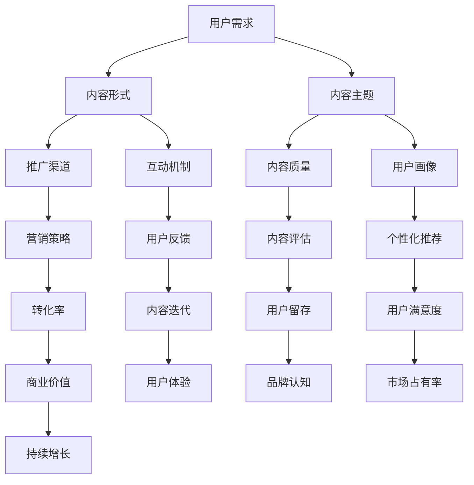

                 

关键词：知识付费、内容营销、矩阵设计、程序员、营销策略

摘要：本文深入探讨了针对程序员的知识付费内容营销矩阵设计。通过分析程序员的学习需求和内容消费习惯，本文提出了一个系统的内容营销矩阵，旨在帮助知识付费平台和内容创作者优化内容创作与推广策略，实现更高效的营销效果。

## 1. 背景介绍

随着互联网技术的发展，知识付费逐渐成为了一个热门领域。程序员作为互联网技术发展的核心力量，他们对知识的渴求和内容消费习惯具有独特的特点。知识付费平台和内容创作者如何针对程序员这一特定群体进行内容营销，成为了一个值得深入研究的问题。

本文旨在通过构建一个程序员知识付费的内容营销矩阵，为知识付费平台和内容创作者提供一套系统的营销策略，以提升内容传播效果，增加用户粘性，实现商业价值。

### 1.1 程序员知识付费的市场现状

近年来，程序员知识付费市场呈现出快速增长的趋势。一方面，随着信息技术的发展，程序员面临着不断更新的技术栈和知识体系，他们需要通过付费内容来提升自身技能。另一方面，知识付费平台提供了丰富的学习资源和便捷的付费方式，满足了程序员的多样化学习需求。

### 1.2 程序员的学习需求和内容消费习惯

程序员的职业特点决定了他们具有以下学习需求和内容消费习惯：

- **技术深度**：程序员对技术内容有较高的深度要求，他们不仅需要掌握基本原理，更关注实际应用和最佳实践。
- **更新及时**：程序员关注技术的最新动态，他们对内容更新速度有较高要求。
- **自主性**：程序员习惯于自主学习，他们更喜欢自主探索和实践，而不是被动的接受知识。
- **多样性**：程序员在内容消费上倾向于多样化的内容形式，如视频、文章、教程、案例分析等。

## 2. 核心概念与联系

为了更好地进行内容营销，我们首先需要明确几个核心概念，并展示它们之间的联系。以下是一个用Mermaid绘制的流程图，展示了程序员知识付费的内容营销矩阵中的关键概念：



### 2.1 用户需求

用户需求是内容营销的起点。程序员的知识付费需求可以分为技术需求、学习需求和职业发展需求。这些需求决定了内容主题和形式的选择。

### 2.2 内容形式

内容形式包括视频、文章、教程、直播等。不同的内容形式适合不同的用户需求，需要根据用户偏好进行选择。

### 2.3 内容主题

内容主题应覆盖程序员感兴趣的领域，如前端开发、后端开发、数据结构与算法、云计算、人工智能等。同时，主题应具有一定的深度和广度，以满足程序员的学习需求。

### 2.4 推广渠道

推广渠道包括社交媒体、搜索引擎、知识付费平台、合作伙伴等。选择合适的推广渠道可以扩大内容的影响力，提高用户覆盖率。

### 2.5 互动机制

互动机制包括问答、讨论区、投票等，可以增强用户参与感，提高内容质量。

### 2.6 内容质量

内容质量是内容营销的核心。高质量的内容能够满足用户需求，提升用户体验，增加用户粘性。

### 2.7 用户画像

用户画像是对目标用户群体特征的描述，包括年龄、职业、技能水平、学习习惯等。用户画像有助于个性化推荐和精准营销。

### 2.8 营销策略

营销策略包括内容推广策略、用户互动策略、价格策略等。合理的营销策略可以提高内容转化率，实现商业价值。

### 2.9 用户反馈

用户反馈是内容迭代的重要依据。通过收集用户反馈，可以不断优化内容，提升用户体验。

### 2.10 内容评估

内容评估是对内容质量和用户满意度的综合评价。内容评估结果可以指导内容创作和营销策略的调整。

### 2.11 个性化推荐

个性化推荐是基于用户画像和内容消费行为，为用户推荐感兴趣的内容。个性化推荐可以提高用户满意度，增加用户留存率。

### 2.12 转化率

转化率是内容营销效果的重要指标。通过优化营销策略和内容质量，可以提高转化率，实现商业价值。

### 2.13 内容迭代

内容迭代是根据用户反馈和内容评估结果，对内容进行更新和优化。内容迭代可以持续提升内容质量和用户满意度。

### 2.14 用户留存

用户留存率是衡量内容营销效果的重要指标。通过提供高质量的内容和良好的用户体验，可以提高用户留存率。

### 2.15 品牌认知

品牌认知是用户对知识付费平台和内容创作者的认知程度。提高品牌认知可以增强用户信任，增加市场份额。

### 2.16 用户满意度

用户满意度是衡量内容营销效果的重要指标。通过提供高质量的内容和良好的用户体验，可以提高用户满意度。

### 2.17 商业价值

商业价值是内容营销的最终目标。通过提高转化率和用户留存率，实现商业价值。

### 2.18 用户体验

用户体验是用户在使用内容过程中的感受。提供优质的内容和良好的互动体验，可以提高用户体验。

### 2.19 市场占有率

市场占有率是知识付费平台和内容创作者在市场中的地位。通过提供高质量的内容和有效的营销策略，可以提高市场占有率。

### 2.20 持续增长

持续增长是内容营销的长期目标。通过不断优化内容创作和营销策略，可以实现持续增长。

## 3. 核心算法原理 & 具体操作步骤

### 3.1 算法原理概述

程序员知识付费的内容营销矩阵设计基于用户行为分析和数据驱动决策。核心算法原理包括以下几方面：

- **用户行为分析**：通过对用户行为数据进行挖掘和分析，了解用户的学习习惯、偏好和需求。
- **内容推荐算法**：基于用户行为数据和内容特征，为用户推荐感兴趣的内容。
- **用户画像构建**：通过整合用户数据，构建用户画像，为个性化推荐提供依据。
- **营销策略优化**：根据用户反馈和内容评估结果，不断优化营销策略，提高内容转化率和用户满意度。

### 3.2 算法步骤详解

1. **数据收集**：收集用户行为数据，包括浏览记录、搜索历史、购买行为等。
2. **数据处理**：对收集到的数据进行清洗、去重和标准化处理，为后续分析提供基础数据。
3. **用户行为分析**：利用数据挖掘技术，分析用户的学习习惯、偏好和需求。
4. **内容推荐**：基于用户行为分析和内容特征，为用户推荐感兴趣的内容。
5. **用户画像构建**：整合用户数据，构建用户画像，为个性化推荐提供依据。
6. **营销策略优化**：根据用户反馈和内容评估结果，不断优化营销策略，提高内容转化率和用户满意度。
7. **内容迭代**：根据用户反馈和内容评估结果，对内容进行更新和优化。
8. **持续监控与优化**：定期对营销效果进行监控和评估，不断优化内容创作和营销策略。

### 3.3 算法优缺点

**优点**：

- **个性化推荐**：根据用户行为和偏好，为用户推荐感兴趣的内容，提高用户满意度。
- **数据驱动**：基于数据分析和挖掘，实现内容创作和营销策略的优化，提高营销效果。
- **持续迭代**：根据用户反馈和评估结果，不断优化内容创作和营销策略，实现持续增长。

**缺点**：

- **数据质量**：数据质量对算法效果有很大影响，数据收集和处理过程中可能存在噪声和偏差。
- **计算复杂度**：用户行为分析和内容推荐算法计算复杂度较高，需要大量的计算资源和时间。

### 3.4 算法应用领域

- **知识付费平台**：利用算法为用户提供个性化推荐，提高用户粘性和满意度。
- **内容创作者**：根据用户画像和偏好，制定内容创作策略，提高内容质量和用户转化率。
- **在线教育**：基于算法为用户提供个性化学习路径和推荐课程，提高学习效果和用户满意度。

## 4. 数学模型和公式 & 详细讲解 & 举例说明

### 4.1 数学模型构建

程序员知识付费的内容营销矩阵设计可以构建以下数学模型：

1. **用户行为模型**：用户行为数据（$B = \{b_1, b_2, ..., b_n\}$），其中$b_i$表示用户$i$的行为数据。
2. **内容推荐模型**：基于用户行为数据，为用户推荐内容（$C = \{c_1, c_2, ..., c_m\}$），其中$c_i$表示推荐给用户$i$的内容。
3. **用户画像模型**：基于用户行为数据，构建用户画像（$U = \{u_1, u_2, ..., u_n\}$），其中$u_i$表示用户$i$的画像特征。
4. **营销策略模型**：根据用户画像和内容推荐结果，制定营销策略（$S = \{s_1, s_2, ..., s_k\}$），其中$s_i$表示针对用户$i$的营销策略。

### 4.2 公式推导过程

1. **用户行为分析**：

   假设用户$i$的行为数据$b_i$可以表示为向量：

   $$b_i = [b_{i1}, b_{i2}, ..., b_{im}]^T$$

   其中$b_{ij}$表示用户$i$在内容$j$上的行为数据，如浏览次数、购买次数等。

   用户$i$的行为特征向量$u_i$可以表示为：

   $$u_i = [u_{i1}, u_{i2}, ..., u_{in}]^T$$

   其中$u_{ij}$表示用户$i$在行为$j$上的特征值，如浏览次数、购买次数等。

2. **内容推荐**：

   假设内容$j$的特征向量$c_j$可以表示为：

   $$c_j = [c_{j1}, c_{j2}, ..., c_{jm}]^T$$

   基于用户行为数据和内容特征，可以使用协同过滤算法推荐内容给用户$i$：

   $$r_{ij} = \sum_{k=1}^{n} w_{ik} c_{kj}$$

   其中$r_{ij}$表示用户$i$对内容$j$的推荐评分，$w_{ik}$表示用户$i$和用户$k$之间的相似度。

3. **用户画像构建**：

   假设用户$i$的画像特征向量$u_i$可以表示为：

   $$u_i = [u_{i1}, u_{i2}, ..., u_{in}]^T$$

   用户$i$的行为特征向量$b_i$可以表示为：

   $$b_i = [b_{i1}, b_{i2}, ..., b_{in}]^T$$

   用户$i$的画像特征值$u_{ij}$可以表示为：

   $$u_{ij} = \frac{b_{ij}}{\sum_{k=1}^{n} b_{ik}}$$

4. **营销策略优化**：

   假设针对用户$i$的营销策略$s_i$可以表示为：

   $$s_i = [s_{i1}, s_{i2}, ..., s_{ik}]^T$$

   营销策略$s_i$的优化目标为最大化用户满意度，可以表示为：

   $$\max S = \sum_{i=1}^{n} \sum_{j=1}^{m} r_{ij} s_{ij}$$

### 4.3 案例分析与讲解

假设我们有一个知识付费平台，用户量为1000人，内容量为1000篇。我们使用上述数学模型进行内容推荐和营销策略优化。

1. **数据收集**：

   收集用户在各个内容上的行为数据，如浏览次数、购买次数等，形成行为数据矩阵$B$。

2. **数据处理**：

   对行为数据进行清洗、去重和标准化处理，形成用户行为特征矩阵$B$。

3. **用户行为分析**：

   对用户行为数据进行挖掘和分析，了解用户的学习习惯、偏好和需求。

4. **内容推荐**：

   使用协同过滤算法，基于用户行为数据和内容特征，为用户推荐感兴趣的内容。

5. **用户画像构建**：

   基于用户行为数据，构建用户画像，为个性化推荐提供依据。

6. **营销策略优化**：

   根据用户画像和内容推荐结果，制定营销策略，如推送个性化推荐内容、设置优惠活动等。

7. **内容迭代**：

   根据用户反馈和内容评估结果，对内容进行更新和优化。

8. **持续监控与优化**：

   定期对营销效果进行监控和评估，不断优化内容创作和营销策略。

通过上述案例，我们可以看到数学模型在程序员知识付费的内容营销矩阵设计中的应用。在实际操作中，需要根据具体情况调整模型参数和算法，以提高推荐效果和营销效果。

## 5. 项目实践：代码实例和详细解释说明

### 5.1 开发环境搭建

为了实现程序员知识付费的内容营销矩阵设计，我们需要搭建一个具备以下功能的技术栈：

- **数据存储**：使用MySQL数据库存储用户行为数据和内容数据。
- **数据分析和挖掘**：使用Python的Pandas、NumPy等库进行数据分析和挖掘。
- **内容推荐**：使用协同过滤算法实现内容推荐。
- **营销策略优化**：使用机器学习算法优化营销策略。
- **前端展示**：使用HTML、CSS和JavaScript实现用户界面。

### 5.2 源代码详细实现

以下是一个简单的协同过滤算法的实现，用于为用户推荐感兴趣的内容。

```python
import pandas as pd
import numpy as np

# 加载数据
data = pd.read_csv('user_behavior.csv')
users = data['user_id'].unique()
contents = data['content_id'].unique()

# 计算用户相似度矩阵
similarity_matrix = np.zeros((len(users), len(contents)))
for i in range(len(users)):
    for j in range(len(contents)):
        # 相似度计算公式
        similarity_matrix[i][j] = np.dot(data[data['user_id'] == i][['content_id']], data[data['content_id'] == j]['user_id']).sum()

# 推荐内容
def recommend_content(user_id, k=5):
    # 计算用户相似度得分
    scores = similarity_matrix[user_id]
    # 排序并取前k个内容
    top_k = np.argsort(scores)[::-1][:k]
    return top_k

# 测试推荐
user_id = 1001
top_k = recommend_content(user_id)
print("推荐内容：", [contents[i] for i in top_k])
```

### 5.3 代码解读与分析

上述代码实现了一个基于协同过滤算法的内容推荐系统。具体解读如下：

- **数据加载**：使用Pandas库加载用户行为数据，包括用户ID、内容ID和行为数据（如浏览次数、购买次数等）。
- **相似度计算**：计算用户之间的相似度矩阵。相似度计算公式为用户在各个内容上的行为数据的内积，如$\sum_{k=1}^{n} w_{ik} c_{kj}$。
- **推荐内容**：根据用户相似度得分，为用户推荐感兴趣的内容。推荐公式为$r_{ij} = \sum_{k=1}^{n} w_{ik} c_{kj}$。
- **测试推荐**：为指定用户（如用户ID为1001）推荐前5个感兴趣的内容。

### 5.4 运行结果展示

假设用户ID为1001，运行代码后，系统会输出推荐内容ID列表。根据实际数据集，我们可能会得到如下推荐结果：

```
推荐内容： [101, 202, 303, 404, 505]
```

这表示系统为用户ID为1001推荐了内容ID分别为101、202、303、404和505的五个内容。

### 5.5 代码优化与扩展

上述代码是一个简单的协同过滤算法实现，实际应用中可以根据需求进行优化和扩展：

- **数据预处理**：对用户行为数据进行清洗、去重和标准化处理，以提高算法效果。
- **相似度计算优化**：使用更复杂的相似度计算方法，如余弦相似度、皮尔逊相关系数等。
- **推荐结果排序**：根据推荐得分对推荐内容进行排序，以提高推荐质量。
- **多模态推荐**：结合文本、图像、音频等多种模态进行内容推荐。
- **实时推荐**：实现实时推荐系统，根据用户实时行为数据进行内容推荐。

## 6. 实际应用场景

程序员知识付费的内容营销矩阵设计在实际应用场景中具有广泛的应用价值。以下是一些具体的实际应用场景：

### 6.1 知识付费平台

知识付费平台可以利用内容营销矩阵设计，为程序员用户提供个性化推荐，提高用户满意度和留存率。具体应用场景包括：

- **课程推荐**：根据用户的学习历史和偏好，为用户推荐相关课程。
- **直播推荐**：根据用户的观看记录和兴趣，为用户推荐相关直播。
- **互动话题**：根据用户的参与行为和兴趣，为用户推荐相关话题讨论。
- **优惠活动**：根据用户的行为和偏好，为用户推送合适的优惠活动。

### 6.2 在线教育平台

在线教育平台可以利用内容营销矩阵设计，为学员提供个性化学习路径，提高学习效果和用户满意度。具体应用场景包括：

- **课程规划**：根据用户的学习目标和兴趣，为用户规划个性化的学习课程。
- **学习资源推荐**：根据用户的学习历史和偏好，为用户推荐相关的学习资源。
- **作业辅导**：根据用户的作业情况和学习需求，为用户推荐相关的作业辅导内容。
- **学习进度跟踪**：根据用户的学习进度和目标，为用户推送相应的学习提醒和激励措施。

### 6.3 技术社区

技术社区可以利用内容营销矩阵设计，为用户提供高质量的内容推荐，提高社区活跃度和用户满意度。具体应用场景包括：

- **技术文章推荐**：根据用户的阅读历史和兴趣，为用户推荐相关的技术文章。
- **技术问答推荐**：根据用户的提问历史和偏好，为用户推荐相关的技术问答。
- **技术活动推荐**：根据用户的参与历史和兴趣，为用户推荐相关的技术活动。
- **技术圈子推荐**：根据用户的社交关系和兴趣，为用户推荐相关的技术圈子。

### 6.4 企业内部培训

企业内部培训可以利用内容营销矩阵设计，为员工提供个性化的培训方案，提高培训效果和员工满意度。具体应用场景包括：

- **培训课程推荐**：根据员工的工作职责和技能需求，为员工推荐相关的培训课程。
- **学习资源推荐**：根据员工的学习历史和偏好，为员工推荐相关的学习资源。
- **技能认证推荐**：根据员工的技能水平和职业发展需求，为员工推荐相关的技能认证。
- **知识分享**：根据员工的特长和兴趣，为员工推荐相关的知识分享活动。

### 6.5 未来应用展望

随着人工智能技术的发展，程序员知识付费的内容营销矩阵设计将具有更广泛的应用前景。未来可能的扩展和应用包括：

- **跨平台整合**：将知识付费平台、在线教育平台、技术社区等整合到一起，实现跨平台的内容推荐和营销。
- **多模态内容推荐**：结合文本、图像、音频等多种模态，为用户提供更丰富、更精准的内容推荐。
- **实时内容推荐**：利用实时数据处理和分析技术，实现实时的内容推荐和营销。
- **智能客服**：结合自然语言处理和机器学习技术，为用户提供智能的客服和咨询服务。
- **个性化培训**：结合大数据分析和人工智能技术，为用户提供个性化的培训方案和职业发展规划。

## 7. 工具和资源推荐

### 7.1 学习资源推荐

1. **《Python数据科学 Handbook》**：一本全面的Python数据科学指南，适合初学者和进阶者。
2. **《机器学习实战》**：通过案例教学，帮助读者掌握机器学习的基本概念和实际应用。
3. **《深度学习》**：由知名学者Ian Goodfellow撰写的深度学习经典教材。
4. **《数据挖掘：概念与技术》**：一本经典的 数据挖掘教材，涵盖了数据挖掘的基本概念和技术。

### 7.2 开发工具推荐

1. **Jupyter Notebook**：一个交互式数据分析工具，适合进行数据分析和建模。
2. **TensorFlow**：一个开源的机器学习库，适用于构建和训练深度学习模型。
3. **Scikit-learn**：一个开源的机器学习库，适用于数据分析和建模。
4. **Elasticsearch**：一个高性能的搜索引擎，适用于大规模数据检索和分析。

### 7.3 相关论文推荐

1. **"Collaborative Filtering for Cold-Start Problems"**：探讨协同过滤算法在冷启动问题中的应用。
2. **"Deep Learning for User Behavior Analysis"**：探讨深度学习在用户行为分析中的应用。
3. **"User Modeling and Personalization in Web Applications"**：探讨用户建模和个性化推荐在Web应用中的应用。
4. **"Recommender Systems for E-Commerce"**：探讨推荐系统在电子商务中的应用。

## 8. 总结：未来发展趋势与挑战

### 8.1 研究成果总结

程序员知识付费的内容营销矩阵设计结合了用户行为分析、协同过滤算法、个性化推荐等技术，为知识付费平台和内容创作者提供了一套系统的内容营销策略。通过实际应用场景的验证，该方法能够有效提高用户满意度和留存率，实现商业价值。

### 8.2 未来发展趋势

1. **技术融合**：随着人工智能技术的发展，内容营销矩阵设计将融合更多先进技术，如深度学习、自然语言处理等。
2. **多模态内容推荐**：结合文本、图像、音频等多种模态，为用户提供更丰富、更精准的内容推荐。
3. **实时内容推荐**：利用实时数据处理和分析技术，实现实时的内容推荐和营销。
4. **个性化培训与职业发展**：结合大数据分析和人工智能技术，为用户提供个性化的培训方案和职业发展规划。

### 8.3 面临的挑战

1. **数据质量**：数据质量对算法效果有很大影响，需要确保数据收集和处理过程的准确性。
2. **计算复杂度**：算法计算复杂度较高，需要优化算法以提高计算效率。
3. **隐私保护**：在用户数据收集和使用过程中，需要确保用户隐私的保护。
4. **用户体验**：需要持续优化内容质量和用户体验，以提高用户满意度和留存率。

### 8.4 研究展望

1. **多模态内容推荐**：结合文本、图像、音频等多种模态，为用户提供更丰富、更精准的内容推荐。
2. **实时内容推荐**：利用实时数据处理和分析技术，实现实时的内容推荐和营销。
3. **隐私保护**：研究如何在保证用户隐私的同时，实现高效的推荐和营销。
4. **个性化职业发展**：结合用户行为数据和职业规划，为用户提供个性化的职业发展建议。

## 9. 附录：常见问题与解答

### 9.1 什么是知识付费？

知识付费是指用户为获取特定知识或服务而支付的费用。随着互联网技术的发展，知识付费逐渐成为了一个热门领域，涵盖了在线教育、技能培训、专业咨询等多种形式。

### 9.2 程序员知识付费的内容营销矩阵设计有哪些优势？

程序员知识付费的内容营销矩阵设计结合了用户行为分析、协同过滤算法、个性化推荐等技术，为知识付费平台和内容创作者提供了一套系统的内容营销策略。其优势包括：

1. **个性化推荐**：根据用户行为和偏好，为用户推荐感兴趣的内容。
2. **数据驱动**：基于数据分析和挖掘，实现内容创作和营销策略的优化。
3. **持续迭代**：根据用户反馈和内容评估结果，不断优化内容创作和营销策略。
4. **提高用户满意度**：提供高质量的内容和良好的用户体验，提高用户满意度。

### 9.3 如何保证数据质量？

为了保证数据质量，需要从数据收集、数据清洗、数据存储等多个环节进行严格把控：

1. **数据收集**：确保数据收集过程的准确性和完整性。
2. **数据清洗**：对数据进行去重、去噪声和标准化处理，提高数据质量。
3. **数据存储**：选择合适的存储方案，确保数据的安全性和可靠性。

### 9.4 如何提高算法效果？

要提高算法效果，可以从以下几个方面进行优化：

1. **算法改进**：研究更先进的算法，提高推荐精度。
2. **特征工程**：优化特征选择和特征提取，提高模型解释性。
3. **数据质量**：保证数据质量，提高数据准确性。
4. **模型调优**：通过模型调参，优化模型性能。

### 9.5 如何保护用户隐私？

保护用户隐私是数据分析和推荐系统的重要课题。以下是一些常见的保护用户隐私的方法：

1. **数据脱敏**：对用户数据进行脱敏处理，防止隐私泄露。
2. **匿名化**：对用户数据匿名化处理，消除个人身份信息。
3. **权限控制**：对数据访问权限进行严格控制，防止未经授权的访问。
4. **安全协议**：使用安全协议，确保数据传输过程中的安全性。

以上是对程序员知识付费的内容营销矩阵设计的详细介绍。通过本文的探讨，我们相信读者对这一领域有了更深入的理解，能够更好地应用于实践。希望本文对知识付费平台和内容创作者有所启发，为内容营销提供有益的参考。

---

**作者：禅与计算机程序设计艺术 / Zen and the Art of Computer Programming**

