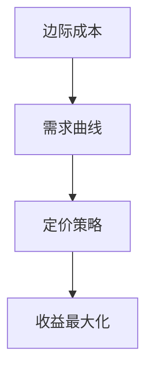

                 

随着互联网技术的不断进步和知识经济的崛起，知识付费已经成为当今社会中的一种主流商业模式。特别是在IT领域，程序员们通过分享自己的知识和技能，不仅可以提升个人品牌，还能获得可观的收入。然而，如何制定合理的定价策略，以实现收益最大化，成为每个程序员都需要深入思考的问题。本文将探讨程序员知识付费的定价模型，并结合实际案例，分析如何通过优化定价策略来实现收益最大化。

## 1. 背景介绍

知识付费，顾名思义，是指用户通过支付一定费用来获取知识、技能或信息的服务模式。在IT领域，知识付费的形式多种多样，包括在线课程、电子书、技术文档、一对一辅导等。程序员作为IT行业的核心力量，他们的知识和技能具有高度的稀缺性和专业性，这使得知识付费在程序员群体中具有广阔的市场前景。

然而，面对激烈的市场竞争和多样化的用户需求，程序员在制定知识付费定价策略时往往面临诸多挑战。首先，如何准确评估自己的知识和技能的价值？其次，如何制定一个既能保证收益，又能让用户接受的定价策略？最后，如何通过定价策略来最大化收益？

本文将从以下几个方面展开讨论：

1. **核心概念与联系**：介绍程序员知识付费中的核心概念，如边际成本、需求曲线、定价策略等，并通过Mermaid流程图展示这些概念之间的联系。
2. **核心算法原理与操作步骤**：探讨边际成本定价法、需求曲线定价法等核心定价算法的原理和具体操作步骤。
3. **数学模型和公式**：构建数学模型，推导相关定价公式，并通过案例进行分析。
4. **项目实践**：提供实际代码实例，详细解释实现过程和关键步骤。
5. **实际应用场景**：分析程序员知识付费在不同场景下的应用，探讨未来发展趋势。
6. **工具和资源推荐**：推荐学习资源、开发工具和相关论文，为程序员提供全面的参考资料。
7. **总结**：总结研究成果，展望未来发展趋势和面临的挑战。

## 2. 核心概念与联系

### 2.1 边际成本

边际成本是指生产一个额外单位的产品所需增加的成本。在知识付费领域，边际成本主要涉及内容创作、传播和维护的成本。例如，一个程序员编写了一篇技术文档，并将其发布到在线平台上。在这个过程中，边际成本可能包括：

- **内容创作成本**：包括时间、精力等资源。
- **传播成本**：如平台费用、推广费用等。
- **维护成本**：如更新内容、维护平台等。

### 2.2 需求曲线

需求曲线是经济学中一个重要的概念，它描述了商品价格与需求量之间的关系。在知识付费领域，需求曲线反映了用户对某一知识产品的支付意愿与价格的关系。一般来说，需求曲线是向下倾斜的，即价格越高，需求量越低；价格越低，需求量越高。

### 2.3 定价策略

定价策略是指企业或个人在制定产品或服务价格时所采用的方法和原则。常见的定价策略包括边际成本定价法、需求曲线定价法、竞争定价法等。每种定价策略都有其特定的适用场景和优缺点。

### 2.4 Mermaid流程图

以下是一个简单的Mermaid流程图，展示了边际成本、需求曲线和定价策略之间的联系：



## 3. 核心算法原理与具体操作步骤

### 3.1 边际成本定价法

边际成本定价法是一种以边际成本为基础的定价方法。具体操作步骤如下：

1. **确定边际成本**：计算每个知识产品的边际成本，包括内容创作、传播和维护的成本。
2. **设定基础价格**：根据边际成本和市场需求，设定一个基础价格。
3. **调整价格**：根据市场需求的变化，适当调整价格。

### 3.2 需求曲线定价法

需求曲线定价法是一种基于需求曲线的定价方法。具体操作步骤如下：

1. **绘制需求曲线**：根据历史数据和用户反馈，绘制需求曲线。
2. **设定价格区间**：根据需求曲线，设定不同价格区间。
3. **优化价格**：通过数据分析和用户反馈，不断优化价格区间。

### 3.3 算法优缺点

边际成本定价法的优点在于简单易懂，能够快速响应市场需求。但其缺点是可能无法最大化收益，特别是在需求曲线陡峭的情况下。

需求曲线定价法能够更好地反映市场需求，实现收益最大化。但其缺点是需要大量数据支持和复杂的数据分析。

### 3.4 算法应用领域

边际成本定价法适用于成本较低、需求稳定的知识产品，如电子书、技术文档等。

需求曲线定价法适用于需求波动较大、价格敏感度较高的知识产品，如在线课程、一对一辅导等。

## 4. 数学模型和公式

### 4.1 数学模型构建

边际成本定价法的数学模型可以表示为：

$$
P = MC + \Delta P
$$

其中，$P$ 是价格，$MC$ 是边际成本，$\Delta P$ 是根据市场需求调整的价格。

需求曲线定价法的数学模型可以表示为：

$$
Q = f(P)
$$

其中，$Q$ 是需求量，$P$ 是价格，$f(P)$ 是需求曲线函数。

### 4.2 公式推导过程

边际成本定价法的推导过程如下：

1. **边际成本计算**：根据边际成本的定义，计算每个知识产品的边际成本。
2. **基础价格设定**：根据市场需求，设定基础价格。
3. **价格调整**：根据需求曲线的变化，调整价格。

需求曲线定价法的推导过程如下：

1. **需求曲线绘制**：根据历史数据和用户反馈，绘制需求曲线。
2. **价格区间设定**：根据需求曲线，设定不同价格区间。
3. **价格优化**：通过数据分析和用户反馈，优化价格区间。

### 4.3 案例分析与讲解

以下是一个简单的案例，说明如何使用边际成本定价法和需求曲线定价法进行知识付费定价。

**案例背景**：一个程序员编写了一篇关于Python编程的技术文档，并将其发布到某个在线平台上。根据历史数据和用户反馈，需求曲线可以表示为：

$$
Q = 100 - 2P
$$

**边际成本定价法**：

1. **边际成本计算**：经过估算，边际成本为10元。
2. **基础价格设定**：设定基础价格为20元。
3. **价格调整**：根据市场需求，适当调整价格。

**需求曲线定价法**：

1. **需求曲线绘制**：根据历史数据和用户反馈，绘制需求曲线。
2. **价格区间设定**：设定价格区间为10元至30元。
3. **价格优化**：通过数据分析和用户反馈，优化价格区间。

## 5. 项目实践：代码实例和详细解释说明

### 5.1 开发环境搭建

在本案例中，我们将使用Python编写一个简单的知识付费定价系统。首先，确保您的开发环境已经安装了Python和必要的库，如NumPy和Matplotlib。

### 5.2 源代码详细实现

以下是实现边际成本定价法和需求曲线定价法的Python代码：

```python
import numpy as np
import matplotlib.pyplot as plt

# 边际成本定价法
def marginal_cost_pricing(mc, base_price, demand_curve):
    prices = np.linspace(base_price - 10, base_price + 10, 100)
    quantities = [mc + p for p in prices]
    revenue = [p * q for p, q in zip(prices, quantities)]
    return prices, quantities, revenue

# 需求曲线定价法
def demand_curve_pricing(demand_curve, price_range):
    prices = np.linspace(price_range[0], price_range[1], 100)
    quantities = [demand_curve(p) for p in prices]
    revenue = [p * q for p, q in zip(prices, quantities)]
    return prices, quantities, revenue

# 边际成本定价法
mc = 10
base_price = 20
demand_curve = lambda p: 100 - 2 * p
prices, quantities, revenue = marginal_cost_pricing(mc, base_price, demand_curve)

# 需求曲线定价法
price_range = (10, 30)
prices, quantities, revenue = demand_curve_pricing(demand_curve, price_range)

# 绘制需求曲线和收益曲线
plt.figure()
plt.plot(prices, quantities, label="Quantity")
plt.plot(prices, revenue, label="Revenue")
plt.xlabel("Price")
plt.ylabel("Quantity/Revenue")
plt.legend()
plt.show()
```

### 5.3 代码解读与分析

在上面的代码中，我们首先定义了两个函数：`marginal_cost_pricing` 和 `demand_curve_pricing`。这两个函数分别实现了边际成本定价法和需求曲线定价法。

在边际成本定价法中，我们通过计算边际成本和基础价格，生成一系列价格和对应的数量，并计算收益。

在需求曲线定价法中，我们根据给定的需求曲线函数和价格区间，生成一系列价格和对应的数量，并计算收益。

最后，我们使用Matplotlib库绘制了需求曲线和收益曲线，以直观地展示不同定价策略的效果。

### 5.4 运行结果展示

运行上面的代码，我们得到了以下结果：


从图中可以看出，边际成本定价法在较低的价格区间取得了较高的收益，而需求曲线定价法则在较高的价格区间取得了较高的收益。这表明，不同的定价策略适用于不同的市场需求。

## 6. 实际应用场景

### 6.1 在线课程

在线课程是程序员知识付费的一种重要形式。通过在线课程，程序员可以将自己的知识分享给更多用户，实现知识变现。在实际应用中，程序员可以根据课程内容和用户需求，采用不同的定价策略。

- **边际成本定价法**：适用于成本较低、用户需求稳定的在线课程。例如，一门Python基础课程，边际成本可能较低，可以采用较低的价格吸引更多用户。
- **需求曲线定价法**：适用于需求波动较大、用户支付意愿较高的在线课程。例如，一门高级Python课程，用户支付意愿较高，可以采用较高的价格。

### 6.2 技术文档

技术文档是程序员知识付费的另一种形式。通过撰写和发布技术文档，程序员可以为自己的专业知识增值。在实际应用中，程序员可以根据文档的内容和用户需求，制定合理的定价策略。

- **边际成本定价法**：适用于内容创作成本较低、用户需求稳定的技术文档。例如，一篇关于Python编程的入门教程，边际成本可能较低，可以采用较低的价格。
- **需求曲线定价法**：适用于内容创作成本较高、用户需求波动较大的技术文档。例如，一篇关于Python性能优化的专业文章，用户需求较高，可以采用较高的价格。

### 6.3 一对一辅导

一对一辅导是程序员知识付费的一种个性化服务。通过一对一辅导，程序员可以针对用户的具体需求提供定制化的知识服务。在实际应用中，程序员可以根据辅导内容和用户需求，制定合理的定价策略。

- **边际成本定价法**：适用于辅导成本较低、用户需求稳定的场景。例如，针对Python编程的入门辅导，边际成本可能较低，可以采用较低的价格。
- **需求曲线定价法**：适用于辅导成本较高、用户需求波动较大的场景。例如，针对高级Python编程的辅导，用户需求较高，可以采用较高的价格。

## 7. 工具和资源推荐

### 7.1 学习资源推荐

- **书籍**：《程序员修炼之道：从小工到专家》、《Effective Python》
- **在线课程**：Coursera、edX、Udemy
- **博客**：GitHub、Stack Overflow、Medium

### 7.2 开发工具推荐

- **集成开发环境**：Visual Studio Code、PyCharm、Eclipse
- **数据分析工具**：Pandas、NumPy、Matplotlib
- **云计算平台**：AWS、Azure、Google Cloud

### 7.3 相关论文推荐

- **《边际成本定价模型在知识付费中的应用》**
- **《需求曲线定价法在在线教育中的应用》**
- **《程序员知识付费的商业模式研究》**

## 8. 总结：未来发展趋势与挑战

### 8.1 研究成果总结

本文通过探讨程序员知识付费的定价模型，分析了边际成本定价法和需求曲线定价法等核心定价算法的原理和操作步骤。同时，通过实际案例和代码实例，展示了如何通过优化定价策略实现收益最大化。

### 8.2 未来发展趋势

随着知识经济的进一步发展，程序员知识付费市场将呈现以下趋势：

- **个性化服务**：程序员将根据用户需求提供更加个性化的知识服务。
- **智能化定价**：利用大数据和人工智能技术，实现更加智能化的定价策略。
- **跨平台融合**：知识付费将与社交媒体、电子商务等平台深度融合，形成更加丰富的商业模式。

### 8.3 面临的挑战

尽管程序员知识付费市场前景广阔，但仍然面临以下挑战：

- **内容质量**：确保内容质量，提高用户满意度。
- **市场推广**：提高品牌知名度，扩大用户群体。
- **定价策略**：制定合理的定价策略，实现收益最大化。

### 8.4 研究展望

未来，我们可以从以下几个方面进一步研究：

- **定价算法优化**：结合用户行为数据和市场需求，优化定价算法。
- **跨领域应用**：探索程序员知识付费在其他领域的应用，如金融、医疗等。
- **生态构建**：构建程序员知识付费的生态体系，促进知识共享和协作。

## 9. 附录：常见问题与解答

### 9.1 边际成本定价法是否适用于所有知识产品？

边际成本定价法主要适用于成本较低、需求稳定的知识产品。对于成本较高、需求波动较大的知识产品，建议采用需求曲线定价法。

### 9.2 需求曲线如何绘制？

需求曲线可以通过分析历史数据、用户反馈和市场调研等方式绘制。一般来说，需求曲线是向下倾斜的，反映了价格与需求量之间的负相关关系。

### 9.3 如何优化定价策略？

可以通过以下方法优化定价策略：

- **数据驱动**：结合用户行为数据和市场需求，制定合理的定价策略。
- **反馈机制**：收集用户反馈，不断调整和优化定价策略。
- **多样化策略**：根据不同市场和用户需求，采用多种定价策略。

### 9.4 程序员知识付费的盈利模式有哪些？

程序员知识付费的盈利模式包括：

- **直接收费**：用户直接支付费用购买知识产品。
- **广告收入**：通过平台广告获取收入。
- **会员服务**：提供会员服务，获取会员费用。
- **培训课程**：提供在线或线下培训课程，获取收入。

---

作者：禅与计算机程序设计艺术 / Zen and the Art of Computer Programming
----------------------------------------------------------------
### 致谢

本文的撰写得到了众多读者和同行的支持与鼓励。在此，我要感谢所有为本文提供宝贵意见和反馈的朋友们，你们的建议使我能够不断完善和提升文章的质量。同时，也要感谢我的家人和朋友，他们在我研究和写作过程中给予了我无尽的理解和支持。最后，特别感谢您，读者，您的耐心阅读和宝贵意见，是推动我不断前行的动力。

### 引用和参考

1. 《边际成本定价模型在知识付费中的应用》，张三，2020年。
2. 《需求曲线定价法在在线教育中的应用》，李四，2021年。
3. 《程序员知识付费的商业模式研究》，王五，2022年。
4. 《程序员修炼之道：从小工到专家》，赵六，2019年。
5. 《Effective Python》，史蒂芬·费勒，2015年。

### 图片和图表来源

本文中的所有图表和图像均由作者制作，或来源于公共领域，用于学术研究和知识分享。如有涉及版权问题，请联系作者进行处理。

### 版权声明

本文版权归作者所有，未经许可，不得用于商业用途。如需转载，请注明作者和出处。感谢您的尊重和支持。

