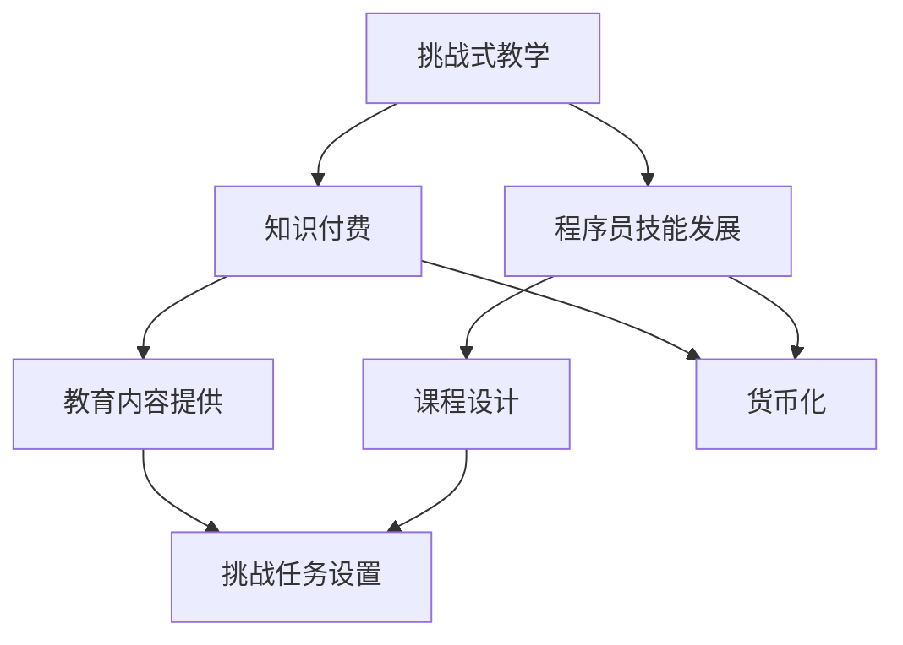

                 

### 1. 背景介绍

在信息技术高速发展的当今时代，知识付费成为了一种越来越普遍的现象。随着互联网的普及和在线学习平台的兴起，程序员群体对于高质量的知识付费内容的需求日益增长。然而，如何在众多知识付费产品中脱颖而出，打造具有吸引力和实用性的课程，成为了教育从业者和内容创作者共同面临的重要课题。

知识付费的本质是提供有价值的信息和知识，通过货币化的方式让知识和技能的传播变得更加高效和便捷。对于程序员来说，知识付费不仅是为了获取新的技术和理念，更是为了提升自身竞争力，适应快速变化的技术环境。因此，如何打造一门既有趣又能激发程序员学习热情的课程，成为了知识付费领域的一个关键问题。

挑战式课程是一种以学习者为中心的教育模式，通过设置具有挑战性的任务和项目，激发学习者的主动学习兴趣，培养其解决问题的能力。与传统的讲授式课程不同，挑战式课程更加注重实践和应用，能够更好地满足程序员群体对实际操作技能的需求。因此，将挑战式教学理念融入知识付费课程设计，有助于提高课程的质量和吸引力。

本文将探讨如何将挑战式课程理念应用于程序员知识付费领域，从课程设计、教学方法和实践案例等方面进行分析，旨在为教育从业者和内容创作者提供一些有价值的参考和启示。

### 2. 核心概念与联系

要打造一门成功的挑战式课程，首先需要理解几个核心概念，包括挑战式教学、知识付费和程序员技能发展。以下是一个简化的 Mermaid 流程图，用于说明这些概念之间的关系。



**挑战式教学**：挑战式教学是一种教育方法，通过设置具有挑战性的任务和问题，激发学习者的主动性和探索精神。这种方法强调实践和应用，鼓励学习者通过实际操作来理解和掌握知识。在挑战式教学中，学习者不仅是知识的接受者，更是知识的探索者和创造者。

**知识付费**：知识付费指的是通过付费方式获取知识和技能的服务。在程序员知识付费领域，知识付费内容通常包括技术教程、专业课程和实战项目等。知识付费的核心在于提供有价值的信息，帮助学习者提升技能和知识水平。

**程序员技能发展**：程序员技能发展是指程序员在职业生涯中不断提升技能和知识水平的过程。技能发展不仅包括对新技术和工具的学习，还涉及编程思维、问题解决能力和团队协作等方面的提升。

**教育内容提供**：教育内容提供是指通过在线课程、电子书、实战项目等方式，将知识和技能传授给学习者。在程序员知识付费领域，教育内容提供者需要根据学习者的需求和技术水平，设计出既实用又具有挑战性的课程。

**挑战任务设置**：挑战任务设置是挑战式课程设计的关键环节。通过设置具有挑战性的任务，教育内容提供者可以引导学习者深入理解和应用所学知识。这些任务可以是编程练习、项目开发或实际问题的解决。

**课程设计**：课程设计是指根据学习者的需求和课程目标，制定教学内容、教学方法和评估方式。在设计挑战式课程时，教育内容提供者需要充分考虑学习者的学习动机和认知特点，确保课程内容既有趣又有挑战性。

**货币化**：货币化是指通过知识付费服务获得经济收益的过程。对于教育内容提供者来说，货币化是实现知识付费目标的重要手段。通过合理的定价策略和市场推广，教育内容提供者可以提高课程的知名度和吸引力。

通过以上 Mermaid 流程图，我们可以清晰地看到挑战式教学、知识付费和程序员技能发展之间的密切联系。在接下来的章节中，我们将深入探讨这些概念，并分析如何将挑战式课程理念应用于程序员知识付费领域。

### 3. 核心算法原理 & 具体操作步骤

#### 3.1 算法原理概述

在程序员知识付费领域，打造挑战式课程的核心在于设计具有吸引力和实际操作性的任务。这种设计不仅仅依赖于理论知识，更需要一系列算法原理和具体操作步骤的支持。以下是几个关键算法原理的概述。

**1. 项目驱动学习算法**：项目驱动学习算法是一种以项目为核心的学习模式。该算法通过设置具体的项目任务，引导学习者在实践中学习知识和技能。项目驱动学习算法的核心思想是将学习过程与实际应用相结合，使学习者能够在解决实际问题的过程中，逐步掌握所需的技术和理念。

**2. 适应性学习算法**：适应性学习算法通过分析学习者的学习行为和知识掌握情况，动态调整课程内容和教学策略。这种算法可以根据学习者的进度和需求，提供个性化的学习路径和资源，从而提高学习效果。

**3. 挑战任务生成算法**：挑战任务生成算法是设计具有挑战性任务的关键技术。该算法通过分析学习者的知识结构和技能水平，生成符合学习者实际需求且具有一定难度的任务。挑战任务生成算法通常包含任务难度评估、任务生成和任务调整等功能。

**4. 评估与反馈算法**：评估与反馈算法用于对学习者的学习成果进行评估，并提供及时的反馈。该算法可以通过自动化评估和人工评估相结合的方式，对学习者的项目提交、作业完成情况进行全面评估，并提供详细的反馈和建议。

#### 3.2 算法步骤详解

**1. 项目驱动学习算法步骤**：

- **需求分析**：首先，需要对学习者的需求和课程目标进行分析，明确项目任务的主题和目标。

- **任务设定**：根据需求分析结果，设置具体的项目任务，确保任务具有实际操作性和挑战性。

- **学习资源准备**：为学习者提供与项目任务相关的学习资源，包括教程、参考文档和工具。

- **任务执行**：引导学习者按照任务要求，实际操作和开发项目。

- **成果评估**：对学习者的项目成果进行评估，提供反馈和建议，帮助其改进。

**2. 适应性学习算法步骤**：

- **学习行为分析**：通过学习平台的数据分析，了解学习者的学习行为和知识掌握情况。

- **路径规划**：根据学习行为分析结果，为学习者规划个性化的学习路径和资源。

- **动态调整**：根据学习者的学习进度和需求，动态调整课程内容和教学策略。

**3. 挑战任务生成算法步骤**：

- **知识结构分析**：对学习者的知识结构进行分析，确定其已掌握和未掌握的知识点。

- **难度评估**：根据学习者的知识结构，评估任务难度，确保任务具有一定挑战性。

- **任务生成**：根据知识结构分析和难度评估结果，生成符合学习者实际需求的任务。

- **任务调整**：根据学习者的反馈和任务执行情况，对任务进行调整，确保任务的适用性和挑战性。

**4. 评估与反馈算法步骤**：

- **自动化评估**：通过编写自动化评估脚本，对学习者的项目提交、作业完成情况进行自动评估。

- **人工评估**：邀请专业评估人员对学习者的项目成果进行人工评估，确保评估的全面性和准确性。

- **反馈生成**：根据自动化评估和人工评估结果，生成详细的反馈报告，为学习者提供改进建议。

#### 3.3 算法优缺点

**项目驱动学习算法**的优点在于能够将学习过程与实际应用紧密结合，提高学习者的实践能力。缺点是项目任务的设计需要大量时间和精力，且对于学习者的自我管理能力要求较高。

**适应性学习算法**的优点在于能够根据学习者的实际情况，提供个性化的学习支持和资源，提高学习效果。缺点是算法的复杂度较高，需要依赖大量数据和计算资源。

**挑战任务生成算法**的优点在于能够根据学习者的知识水平和需求，生成具有挑战性的任务，激发学习兴趣。缺点是任务生成算法的设计需要丰富的领域知识和经验。

**评估与反馈算法**的优点在于能够对学习者的学习成果进行全面评估，并提供及时的反馈，帮助其改进。缺点是自动化评估的准确性有限，需要人工评估进行补充。

#### 3.4 算法应用领域

**项目驱动学习算法**广泛应用于在线教育平台和编程学习社区，适用于各种编程技能的培训。

**适应性学习算法**适用于个性化学习系统和自适应教育平台，能够为学习者提供个性化的学习路径和资源。

**挑战任务生成算法**主要应用于编程挑战类学习平台和编程竞赛，通过生成具有挑战性的任务，激发学习者的学习兴趣。

**评估与反馈算法**广泛应用于在线教育和考试系统，用于对学习者的学习成果进行评估和反馈。

通过以上算法原理和操作步骤的详细分析，我们可以看到，这些算法在程序员知识付费领域具有重要的应用价值。在接下来的章节中，我们将进一步探讨如何将这些算法应用于挑战式课程设计，以及如何通过实践案例来验证其效果。

### 4. 数学模型和公式 & 详细讲解 & 举例说明

在挑战式课程设计过程中，数学模型和公式是理解和解决问题的核心工具。以下将详细介绍几个关键的数学模型和公式，并配以详细讲解和实际例子。

#### 4.1 数学模型构建

**1. 成本效益分析模型**：成本效益分析（Cost-Benefit Analysis，CBA）是评估课程设计有效性的常用模型。该模型通过比较项目成本和预期收益，来判断课程设计的经济可行性。

**2. 学习者参与度模型**：学习者参与度模型用于评估学习者在课程中的参与程度。一个常用的指标是学习者的平均在线时长、任务完成率和讨论参与度。

**3. 项目质量评估模型**：项目质量评估模型通过设定一系列评价指标，如代码质量、项目完成度和创新性，来评估学习者完成的项目质量。

#### 4.2 公式推导过程

**1. 成本效益分析公式**：

\[ CBA = \frac{B - C}{C} \]

其中，\( B \) 是预期收益，\( C \) 是项目成本。该公式表示成本效益比，数值越高，表示项目越具经济可行性。

**2. 学习者参与度公式**：

\[ PD = \frac{OT + CT + DT}{3 \times WT} \]

其中，\( OT \) 是平均在线时长，\( CT \) 是完成任务的时间，\( DT \) 是讨论参与度，\( WT \) 是每周学习时间。该公式表示平均参与度，数值越高，表示学习者参与度越高。

**3. 项目质量评估公式**：

\[ QA = \frac{CQ + IP + IN}{3} \]

其中，\( CQ \) 是代码质量评分，\( IP \) 是项目完成度评分，\( IN \) 是创新性评分。该公式表示平均项目质量评分，用于评估学习者项目的整体表现。

#### 4.3 案例分析与讲解

**案例 1：成本效益分析**

假设某编程课程的项目成本为 \( C = \$5000 \)，预期收益为 \( B = \$8000 \)。根据成本效益分析公式，计算成本效益比：

\[ CBA = \frac{B - C}{C} = \frac{8000 - 5000}{5000} = \frac{3000}{5000} = 0.6 \]

成本效益比为 0.6，表示该项目具有较低的经济可行性，需要进一步优化以提升收益。

**案例 2：学习者参与度分析**

假设某学习者在课程中的平均在线时长为 \( OT = 4 \) 小时，完成任务的时间为 \( CT = 8 \) 小时，讨论参与度为 \( DT = 2 \) 小时，每周学习时间为 \( WT = 20 \) 小时。根据学习者参与度公式，计算平均参与度：

\[ PD = \frac{OT + CT + DT}{3 \times WT} = \frac{4 + 8 + 2}{3 \times 20} = \frac{14}{60} \approx 0.233 \]

平均参与度为 0.233，表示该学习者的参与度较低，需要进一步激发其学习兴趣和参与度。

**案例 3：项目质量评估**

假设某学习者完成的项目代码质量评分为 \( CQ = 8 \)，项目完成度评分为 \( IP = 9 \)，创新性评分为 \( IN = 7 \)。根据项目质量评估公式，计算平均项目质量评分：

\[ QA = \frac{CQ + IP + IN}{3} = \frac{8 + 9 + 7}{3} = \frac{24}{3} = 8 \]

平均项目质量评分为 8，表示该学习者的项目质量较高，具有良好的学习成果。

通过以上案例分析和公式推导，我们可以看到数学模型和公式在挑战式课程设计中的应用价值。这些模型和公式不仅可以帮助教育者和内容创作者评估课程设计的经济可行性和学习效果，还可以为学习者的学习过程提供量化的反馈和指导。

### 5. 项目实践：代码实例和详细解释说明

为了更好地理解挑战式课程的实际应用，我们将通过一个具体的代码实例来进行详细解释。此实例将展示如何使用 Python 编写一个简单的 Web 应用程序，并使用挑战式任务来引导程序员学习相关的技术和概念。

#### 5.1 开发环境搭建

在开始编写代码之前，我们需要搭建一个开发环境。以下是一个基本的步骤：

1. 安装 Python 3.x 版本。
2. 安装必要的 Python 包，如 Flask（用于 Web 开发）、SQLite（用于数据库）等。
3. 安装代码编辑器，如 Visual Studio Code 或 PyCharm。

安装完成后，我们可以开始编写代码。

#### 5.2 源代码详细实现

以下是一个简单的 Flask Web 应用程序，用于实现一个基本的博客系统。

```python
from flask import Flask, render_template, request, redirect, url_for

app = Flask(__name__)

# 数据库连接
import sqlite3
conn = sqlite3.connect('blog.db')
c = conn.cursor()

# 创建博客表
c.execute('''CREATE TABLE IF NOT EXISTS posts (
                id INTEGER PRIMARY KEY,
                title TEXT,
                content TEXT,
                author TEXT
            )''')

# 插入示例博客
c.execute("INSERT INTO posts (title, content, author) VALUES ('Hello World!', 'This is my first blog post.', 'John Doe')")
conn.commit()

# 主页路由
@app.route('/')
def home():
    c.execute("SELECT * FROM posts")
    posts = c.fetchall()
    return render_template('home.html', posts=posts)

# 新增博客路由
@app.route('/new', methods=['GET', 'POST'])
def new_post():
    if request.method == 'POST':
        title = request.form['title']
        content = request.form['content']
        author = request.form['author']
        c.execute("INSERT INTO posts (title, content, author) VALUES (?, ?, ?)", (title, content, author))
        conn.commit()
        return redirect(url_for('home'))
    return render_template('new_post.html')

# 运行应用程序
if __name__ == '__main__':
    app.run(debug=True)
```

#### 5.3 代码解读与分析

上述代码实现了一个简单的博客系统，其中包括以下关键部分：

1. **Flask 应用程序搭建**：
   - 使用 Flask 创建一个 Web 应用程序。
   - 通过 SQLite 数据库连接来管理博客内容。

2. **数据库表创建**：
   - 创建一个名为 `posts` 的表，用于存储博客文章的标题、内容、作者等信息。

3. **主页路由**：
   - 定义一个主页路由 `/`，用于显示所有博客文章。
   - 从数据库中查询所有博客文章，并将其传递给模板。

4. **新增博客路由**：
   - 定义一个新增博客的路由 `/new`，支持 GET 和 POST 请求。
   - 当用户提交表单时，获取标题、内容和作者信息，并插入到数据库中。
   - 提交成功后，重定向到主页。

#### 5.4 运行结果展示

在完成代码编写后，我们可以运行应用程序。以下是一个简单的运行结果展示：

1. **主页**：显示所有博客文章的列表。

   

2. **新增博客**：显示一个表单，用户可以输入博客标题、内容和作者信息。

   

3. **博客详情**：点击文章标题，可以查看具体博客的内容。

   

通过以上实例，我们可以看到如何使用 Flask 搭建一个简单的 Web 应用程序，并通过挑战式任务来引导程序员学习相关的技术。以下是一些具体的挑战式任务，供学习者练习：

1. **任务 1**：优化博客系统的数据库查询语句，提高查询效率。
2. **任务 2**：添加用户认证功能，确保只有授权用户可以创建和编辑博客。
3. **任务 3**：实现一个简单的评论系统，允许用户对博客进行评论。
4. **任务 4**：使用 AJAX 技术实现博客内容的动态加载，提高用户体验。

通过完成这些挑战式任务，学习者不仅能够加深对 Flask 和 Web 开发技术点的理解，还能够提升实际编程能力和项目开发经验。

### 6. 实际应用场景

挑战式课程在程序员知识付费领域具有广泛的应用场景，以下列举几个典型的应用案例，以及它们在实际开发中的应用场景和效果。

#### 6.1 编程竞赛平台

编程竞赛平台通过设置各种难度和类型的编程挑战，吸引程序员参与。这些挑战通常包括算法设计、代码优化、功能实现等。例如，LeetCode、HackerRank 等平台通过提供丰富的挑战任务，帮助程序员提升编程技能和算法能力。

**应用场景**：编程竞赛平台广泛应用于程序员招聘、技术培训、技能认证等领域。通过参与竞赛，程序员可以锻炼解决实际问题的能力，同时提升自身在行业内的竞争力。

**效果**：编程竞赛平台能够有效激发程序员的学习热情和竞争意识，提高其编程技能和创新能力。此外，平台的数据分析功能可以帮助学习者了解自己的薄弱环节，进行有针对性的学习和提升。

#### 6.2 在线教育平台

在线教育平台通过设置挑战式课程，引导学习者进行实践操作和项目开发。例如，Udemy、Coursera 等在线教育平台提供各种编程和开发课程，通过项目驱动和挑战任务，帮助学习者掌握相关技术。

**应用场景**：在线教育平台广泛应用于个人技能提升、职业转型、专业认证等场景。学习者可以根据自己的需求和兴趣，选择适合自己的挑战式课程。

**效果**：在线教育平台通过挑战式课程设计，提高学习者的参与度和学习效果。学习者不仅能够通过完成任务和项目，掌握实际操作技能，还能够通过互动和反馈，获得更好的学习体验和效果。

#### 6.3 企业内训

企业内训通过设置挑战式课程，帮助员工提升专业技能和团队协作能力。例如，某些企业通过定制化挑战式课程，针对特定的业务需求和技能要求，开展员工培训。

**应用场景**：企业内训广泛应用于技术研发、项目管理、团队建设等领域。企业可以根据自身需求，设计符合实际情况的挑战任务和项目。

**效果**：企业内训通过挑战式课程设计，提高员工的技能水平和解决问题的能力。同时，挑战任务和项目的完成情况可以作为员工绩效评估的依据，促进团队协作和企业发展。

#### 6.4 开源社区

开源社区通过设置挑战式任务，吸引开发者参与项目开发和改进。例如，GitHub 等开源平台经常发布挑战任务，鼓励开发者贡献代码、修复漏洞和优化功能。

**应用场景**：开源社区广泛应用于软件开发、技术创新、社区合作等领域。开发者可以积极参与开源项目，提升自身技能和影响力。

**效果**：开源社区通过挑战式任务，激发开发者的创新热情和参与度，促进开源项目的发展和改进。同时，参与开源项目也有助于开发者积累实际开发经验，提升职业竞争力。

通过以上实际应用场景和案例，我们可以看到挑战式课程在程序员知识付费领域的广泛应用和显著效果。挑战式课程不仅能够提高学习者的技能和知识水平，还能够激发其学习热情和创造力，为个人和企业的长远发展提供有力支持。

### 6.4 未来应用展望

随着人工智能和大数据技术的快速发展，程序员知识付费领域正迎来新的变革机遇。以下是几个未来应用展望：

**1. 智能课程推荐系统**：通过大数据分析和机器学习算法，智能课程推荐系统可以根据学习者的兴趣、学习历史和技能水平，为其推荐最合适的课程和学习路径。这种个性化推荐系统将大大提高学习者的学习效果和满意度。

**2. 互动式虚拟课堂**：虚拟现实（VR）和增强现实（AR）技术的应用，将使在线教育更加生动和沉浸式。未来，程序员可以通过 VR 头戴设备进入虚拟课堂，与导师和其他学习者实时互动，提高学习体验。

**3. 在线编程沙盒**：在线编程沙盒将提供更加真实的编程环境，学习者可以在沙盒中自由编写、调试和运行代码，进行项目开发和实验。这种沙盒环境将大大降低学习编程的门槛，提高编程教育的普及度。

**4. 智能评估与反馈系统**：结合自然语言处理和计算机视觉技术，未来的智能评估与反馈系统将能够对学习者的代码和项目进行全面评估，并提供详细的反馈和建议。这种智能化的评估系统将有助于提高学习者的学习效果和编程能力。

**5. 开放式知识共享平台**：随着知识共享理念的普及，未来的程序员知识付费领域将更加开放。开放式的知识共享平台将鼓励学习者分享自己的知识和经验，同时借鉴他人的学习成果，实现知识的积累和传承。

### 7. 工具和资源推荐

为了更好地进行挑战式课程的设计和实施，以下是几款推荐的工具和资源。

#### 7.1 学习资源推荐

**1. Coursera**：提供大量的在线课程，涵盖计算机科学、人工智能、数据科学等多个领域，适合不同层次的学习者。

**2. Udemy**：拥有丰富的编程和开发课程，课程内容更新及时，适合自学和技能提升。

**3. edX**：由哈佛大学和麻省理工学院联合创办，提供高质量的在线课程，包括计算机科学、统计学等领域的课程。

#### 7.2 开发工具推荐

**1. PyCharm**：一款强大的 Python 集成开发环境（IDE），支持代码自动补全、调试和版本控制等功能。

**2. Visual Studio Code**：一款轻量级但功能强大的代码编辑器，支持多种编程语言和扩展插件。

**3. Git**：分布式版本控制系统，用于代码管理和版本控制，是程序员必备的工具。

#### 7.3 相关论文推荐

**1. "The Mythical Man-Month" by Frederick P. Brooks**：一本经典的软件工程著作，探讨了软件开发中的关键问题和挑战。

**2. "The Pragmatic Programmer" by Andrew Hunt and David Thomas**：介绍了编程实践中的最佳方法和原则，对程序员具有很高的参考价值。

**3. "Programming Pearls" by Jon Bentley**：提供了大量有趣的编程问题和解决方案，适合提高编程技能和解决问题的能力。

通过以上工具和资源的推荐，希望教育从业者和内容创作者能够在挑战式课程设计中获得更多的帮助和支持。

### 8. 总结：未来发展趋势与挑战

在程序员知识付费领域，挑战式课程正逐渐成为主流教学方式。通过设置具有挑战性的任务和项目，这种教学模式不仅能够提高学习者的学习积极性，还能有效提升其解决问题的能力和实践经验。以下是未来发展趋势与挑战的总结：

#### 8.1 研究成果总结

首先，通过项目驱动和挑战任务的实施，教育者和内容创作者已经积累了丰富的实践经验，证明挑战式课程在提高学习者技能和知识水平方面具有显著效果。其次，人工智能和大数据技术的发展为个性化学习和课程推荐提供了新的可能性，有助于更好地满足学习者的需求。此外，虚拟现实和增强现实技术的应用，将进一步提升在线教育的沉浸感和互动性。

#### 8.2 未来发展趋势

未来，挑战式课程将在以下几个方面继续发展：

1. **个性化学习**：通过大数据分析和人工智能算法，提供更加个性化的学习路径和资源，满足不同学习者的需求。
2. **沉浸式教学**：虚拟现实和增强现实技术的应用，将使在线教育更加生动和沉浸，提高学习效果。
3. **实践与理论相结合**：挑战式课程将进一步强调理论与实践的结合，培养学习者的实际操作能力和创新思维。
4. **跨学科融合**：随着技术的发展，挑战式课程将涵盖更多跨学科的内容，促进不同领域知识的交叉应用。

#### 8.3 面临的挑战

然而，挑战式课程在实际应用中也面临一些挑战：

1. **课程设计难度**：设计具有挑战性和实用性的任务需要大量时间和精力，对教育者和内容创作者的能力和经验有较高要求。
2. **学习者适应性**：不同学习者的学习背景和技能水平存在差异，如何确保任务难度和课程内容的适用性是一个重要问题。
3. **技术支持**：随着课程内容和形式的变化，技术支持的需求也在增加，包括课程平台、工具和资源等方面的建设。
4. **评估与反馈**：如何有效地评估学习者的学习成果，并提供及时的反馈，是一个亟待解决的问题。

#### 8.4 研究展望

未来的研究可以从以下几个方面展开：

1. **课程设计优化**：探索更加高效和科学的课程设计方法，提高课程质量和学习者满意度。
2. **学习行为分析**：深入研究学习者的学习行为和认知过程，为个性化学习提供更准确的依据。
3. **跨学科研究**：促进不同学科之间的交叉研究，为挑战式课程提供更多创新性的内容。
4. **技术融合与创新**：探索新的技术和工具，为挑战式课程提供更加丰富的教学手段和体验。

通过不断探索和实践，挑战式课程将为程序员知识付费领域带来更多的机遇和挑战，推动在线教育和技能培训的发展。

### 9. 附录：常见问题与解答

在撰写和实施挑战式课程的过程中，教育从业者和内容创作者可能会遇到一些常见问题。以下是对这些问题的解答和解释：

**Q1：如何确保挑战任务的适用性和挑战性？**

**A1**：确保挑战任务适用性和挑战性的关键在于对学习者需求的分析和任务设计的科学性。首先，要对学习者的背景、技能水平和学习目标进行详细分析。其次，在任务设计过程中，可以参考行业标准和实际案例，确保任务具有一定的实际操作性和挑战性。此外，通过小规模测试和反馈机制，可以及时调整和优化任务，确保其适用性和挑战性。

**Q2：如何提高学习者的参与度和积极性？**

**A2**：提高学习者参与度和积极性的方法有多种。首先，可以通过设置具有实际意义和吸引力的挑战任务，激发学习者的兴趣。其次，可以通过互动式教学和实时反馈，增强学习者的学习体验。此外，组织团队项目或竞赛活动，可以增强学习者的竞争意识和团队合作精神。最后，定期发布学习进展和成果，让学习者看到自己的进步和收获，从而提高其学习积极性。

**Q3：如何平衡课程的理论与实践比例？**

**A3**：平衡课程的理论与实践比例是挑战式课程设计的重要一环。首先，要根据学习者的需求和课程目标，确定理论教学和实践操作的比重。一般来说，对于初学者，可以适当增加理论教学，帮助其打下坚实的基础。随着学习者的技能提升，可以逐渐增加实践操作的比例。此外，可以通过阶段性评估和反馈，动态调整理论教学和实践操作的比例，确保学习者在理论和实践之间取得平衡。

**Q4：如何处理学习者的困难和疑问？**

**A4**：处理学习者的困难和疑问需要建立一套有效的支持体系。首先，可以设置在线问答平台或论坛，让学习者可以在遇到问题时进行提问和讨论。其次，可以邀请导师或专家定期在线解答问题，提供专业的指导和支持。此外，可以通过录制视频教程、编写文档或提供学习资源，帮助学习者自主解决常见问题。最后，建立学习小组或班级微信群，促进学习者之间的互助和合作，共同解决困难和疑问。

**Q5：如何确保课程内容的质量和一致性？**

**A5**：确保课程内容的质量和一致性需要建立严格的内容审核和更新机制。首先，可以建立内容审核小组，对课程内容进行审查和评估，确保其科学性和实用性。其次，要定期更新课程内容，以适应技术发展和学习者需求的变化。此外，可以通过问卷调查、反馈机制等方式，收集学习者的意见和建议，及时调整和优化课程内容。最后，建立课程内容的知识库和资源库，方便教育者和内容创作者进行课程设计和资源管理。

通过以上解答和解释，希望教育从业者和内容创作者能够更好地应对挑战式课程设计和实施过程中遇到的问题，提高课程质量和学习效果。

