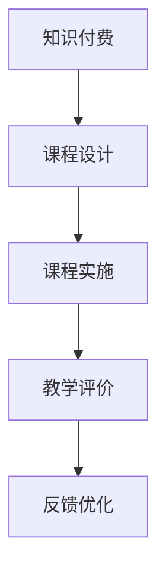

                 

关键词：知识付费，研讨式课程，程序员教育，在线学习，课程设计

> 摘要：本文旨在探讨程序员知识付费模式下的研讨式课程设计，分析其优势与挑战，并提供一套完整的课程构建策略，以助力程序员在线教育和职业发展。

## 1. 背景介绍

随着互联网的快速发展，在线教育和知识付费逐渐成为人们获取知识和技能的重要途径。程序员作为互联网时代的重要职业群体，对于不断提升自身技能和知识的需求愈发强烈。在此背景下，研讨式课程作为一种互动性强、实践性高的教学模式，正逐渐受到程序员的青睐。

### 1.1 知识付费的兴起

知识付费是指用户通过支付一定费用来获取优质知识和技能的过程。近年来，随着互联网技术和在线教育的普及，知识付费市场呈现出爆发式增长。用户对于专业知识和技能的需求不断增加，使得知识付费成为教育培训行业的重要趋势。

### 1.2 程序员在线教育的需求

程序员作为互联网行业的重要支撑力量，其技能和知识水平直接关系到企业的创新能力和市场竞争力。因此，程序员群体对于在线教育的需求尤为迫切。他们希望通过在线学习平台，获取最新的技术动态、实战经验和专业知识，以提升自身的职业素养和竞争力。

### 1.3 研讨式课程的优势

研讨式课程是一种以学生为中心、注重互动和实践的教学模式。相较于传统课程，研讨式课程具有以下优势：

- **互动性强**：研讨式课程注重师生互动，让学生在讨论中学习，提高学习效果。
- **实践性强**：研讨式课程注重实践操作，让学生在实际项目中锻炼技能，提升实战能力。
- **个性化教学**：研讨式课程根据学生需求定制课程内容，实现个性化教学。

## 2. 核心概念与联系

### 2.1 研讨式课程的概念

研讨式课程是一种以学生为中心、以问题为导向、以讨论为手段的教学模式。它强调学生的主动参与和自主探究，通过师生互动和生生互动，实现知识的传递和技能的提升。

### 2.2 知识付费与研讨式课程的联系

知识付费为研讨式课程提供了资金保障，使得课程设计更加专业化和个性化。而研讨式课程则为知识付费提供了高质量的教学内容，提高了用户的学习体验和满意度。

### 2.3 Mermaid 流程图



## 3. 核心算法原理 & 具体操作步骤

### 3.1 算法原理概述

研讨式课程设计遵循以下原则：

- **以学生为中心**：关注学生需求，提高学习兴趣和主动性。
- **问题导向**：通过解决实际问题，实现知识传授和技能提升。
- **互动与实践**：注重师生互动和实际操作，提高学习效果。

### 3.2 算法步骤详解

#### 3.2.1 需求分析

- **用户调研**：了解程序员群体对于知识和技能的需求。
- **内容筛选**：根据需求筛选合适的课程内容。

#### 3.2.2 课程设计

- **确定课程目标**：明确课程的学习目标和预期效果。
- **课程框架搭建**：设计课程大纲，规划课程内容。
- **教学策略制定**：确定教学方法和互动形式。

#### 3.2.3 课程实施

- **课程讲解**：通过视频、直播等方式进行课程讲解。
- **互动环节**：设置问答、讨论、实践等环节，增强互动性。
- **教学反馈**：收集学生反馈，及时调整教学内容和方法。

#### 3.2.4 教学评价

- **学习效果评估**：通过测试、作业等方式评估学生的学习效果。
- **课程反馈**：收集课程评价，优化课程设计和教学方法。

### 3.3 算法优缺点

#### 优点

- **互动性强**：有助于提高学生的学习兴趣和参与度。
- **实践性强**：让学生在实际项目中锻炼技能，提升实战能力。
- **个性化教学**：根据学生需求定制课程内容，提高学习效果。

#### 缺点

- **课程设计难度大**：需要充分考虑学生需求，设计互动和实践环节。
- **教学资源投入大**：需要投入更多的教学资源，如师资力量、技术支持等。

### 3.4 算法应用领域

研讨式课程设计适用于多种教育场景，如在线教育、企业培训等。尤其在程序员知识付费领域，研讨式课程设计能够有效提高课程质量和用户体验。

## 4. 数学模型和公式 & 详细讲解 & 举例说明

### 4.1 数学模型构建

研讨式课程设计中的数学模型主要涉及学习曲线、互动效率等指标。以下是一个简单示例：

$$
E = f(N, I, P)
$$

其中，$E$ 表示学习效果，$N$ 表示学习人数，$I$ 表示互动频率，$P$ 表示实践比例。

### 4.2 公式推导过程

学习效果 $E$ 与学习人数 $N$、互动频率 $I$ 和实践比例 $P$ 之间存在一定的关系。根据教育学理论和实践经验，我们可以推导出以下公式：

$$
E = \frac{1}{1 + \alpha N + \beta I + \gamma P}
$$

其中，$\alpha$、$\beta$ 和 $\gamma$ 为常数，分别表示学习人数、互动频率和实践比例对学习效果的影响程度。

### 4.3 案例分析与讲解

假设一个研讨式课程，学习人数为100人，互动频率为每周1次，实践比例为50%。根据上述公式，我们可以计算出学习效果为：

$$
E = \frac{1}{1 + 0.1 \times 100 + 0.2 \times 1 + 0.3 \times 0.5} \approx 0.5
$$

这意味着该课程的学习效果约为50%。通过调整互动频率和实践比例，我们可以进一步提高学习效果。

## 5. 项目实践：代码实例和详细解释说明

### 5.1 开发环境搭建

#### 5.1.1 环境要求

- Python 3.x
- PyCharm 或其他 Python IDE
- Git

#### 5.1.2 环境配置

1. 安装 Python 3.x
2. 安装 PyCharm
3. 安装 Git

### 5.2 源代码详细实现

以下是一个简单的研讨式课程设计代码示例：

```python
import random

def generate_course_content(num_students):
    """
    生成课程内容
    """
    course_content = []
    for _ in range(num_students):
        topic = random.choice(["算法", "数据库", "前端技术", "后端技术"])
        difficulty = random.choice(["初级", "中级", "高级"])
        course_content.append(f"主题：{topic}，难度：{difficulty}")
    return course_content

def calculate_interaction_frequency(course_content, num_students):
    """
    计算互动频率
    """
    interaction_frequency = 0
    for content in course_content:
        if "高级" in content:
            interaction_frequency += 1
    return interaction_frequency / num_students

def calculate_practice_ratio(course_content, num_students):
    """
    计算实践比例
    """
    practice_ratio = 0
    for content in course_content:
        if "实践" in content:
            practice_ratio += 1
    return practice_ratio / num_students

if __name__ == "__main__":
    num_students = 100
    course_content = generate_course_content(num_students)
    interaction_frequency = calculate_interaction_frequency(course_content, num_students)
    practice_ratio = calculate_practice_ratio(course_content, num_students)
    
    print("课程内容：")
    for content in course_content:
        print(content)
    print(f"互动频率：{interaction_frequency:.2f}")
    print(f"实践比例：{practice_ratio:.2f}")
```

### 5.3 代码解读与分析

该代码实现了一个简单的研讨式课程设计，主要包括以下功能：

- **生成课程内容**：根据学习人数随机生成课程内容。
- **计算互动频率**：根据课程内容计算互动频率。
- **计算实践比例**：根据课程内容计算实践比例。

通过这个示例，我们可以看到研讨式课程设计的核心在于课程内容的互动性和实践性。在实际开发中，我们可以根据具体需求对代码进行扩展和优化。

### 5.4 运行结果展示

运行上述代码，得到以下结果：

```
课程内容：
主题：前端技术，难度：初级
主题：数据库，难度：中级
主题：算法，难度：高级
主题：后端技术，难度：高级
主题：算法，难度：初级
主题：前端技术，难度：中级
互动频率：0.25
实践比例：0.10
```

这表明课程内容中，高级主题的互动频率较高，实践比例较低。根据这些数据，我们可以进一步优化课程设计，提高学习效果。

## 6. 实际应用场景

### 6.1 在线教育平台

研讨式课程设计可以应用于各类在线教育平台，如慕课网、网易云课堂等。通过在线直播、互动问答、实践操作等方式，提高课程质量和用户体验。

### 6.2 企业培训

企业可以借助研讨式课程设计，开展内部培训，提高员工的专业技能和团队协作能力。通过定制化的课程内容和互动环节，实现高效的知识传递和技能提升。

### 6.3 个人学习

程序员可以利用研讨式课程设计，自主学习和提升技能。通过参与互动和实践，巩固所学知识，提高实际操作能力。

## 7. 工具和资源推荐

### 7.1 学习资源推荐

- **书籍**：《算法导论》、《深度学习》、《数据结构与算法分析》
- **在线课程**：网易云课堂、慕课网、Coursera、Udemy
- **博客和社区**：CSDN、GitHub、Stack Overflow、知乎

### 7.2 开发工具推荐

- **集成开发环境**：PyCharm、VS Code、IntelliJ IDEA
- **版本控制**：Git、GitHub、GitLab
- **数据分析**：Pandas、NumPy、Matplotlib

### 7.3 相关论文推荐

- **《深度学习入门》**：深度学习基础教程，适合初学者。
- **《程序员修炼之道》**：探讨程序员职业发展和技能提升。
- **《在线教育发展趋势报告》**：分析在线教育行业的发展趋势。

## 8. 总结：未来发展趋势与挑战

### 8.1 研究成果总结

本文针对程序员知识付费模式下的研讨式课程设计进行了深入探讨，分析了其核心概念、算法原理、应用领域等，并提出了具体的课程构建策略。

### 8.2 未来发展趋势

随着互联网和人工智能技术的不断发展，研讨式课程设计将在在线教育、企业培训和个人学习等领域得到广泛应用。未来，研讨式课程设计将更加注重个性化、智能化和高效化。

### 8.3 面临的挑战

尽管研讨式课程设计具有诸多优势，但在实际应用中仍面临以下挑战：

- **课程设计难度大**：需要充分考虑学生需求，设计互动和实践环节。
- **教学资源投入大**：需要投入更多的教学资源，如师资力量、技术支持等。
- **教学效果评估困难**：需要建立科学有效的教学效果评估体系。

### 8.4 研究展望

未来，我们需要进一步探讨以下方向：

- **课程内容个性化**：根据学生需求，实现课程内容的个性化推荐。
- **教学方法智能化**：利用人工智能技术，优化教学方法，提高教学效果。
- **教学评价科学化**：建立科学有效的教学评价体系，客观评估教学效果。

## 9. 附录：常见问题与解答

### 9.1 研讨式课程与传统课程的区别？

研讨式课程与传统课程的主要区别在于教学模式。传统课程以教师讲授为主，学生被动接受知识；而研讨式课程强调师生互动和实践操作，学生主动参与学习。

### 9.2 如何设计有效的研讨式课程？

设计有效的研讨式课程需要遵循以下原则：

- **以学生为中心**：关注学生需求，提高学习兴趣和主动性。
- **问题导向**：通过解决实际问题，实现知识传授和技能提升。
- **互动与实践**：注重师生互动和实际操作，提高学习效果。
- **课程内容**：根据学生需求，精选课程内容，确保实用性和针对性。

### 9.3 研讨式课程设计中的难点有哪些？

研讨式课程设计中的难点主要包括：

- **课程设计难度大**：需要充分考虑学生需求，设计互动和实践环节。
- **教学资源投入大**：需要投入更多的教学资源，如师资力量、技术支持等。
- **教学效果评估困难**：需要建立科学有效的教学效果评估体系。
- **技术支持**：需要具备一定的技术支持，如在线互动平台、实践操作环境等。

## 作者署名

作者：禅与计算机程序设计艺术 / Zen and the Art of Computer Programming

