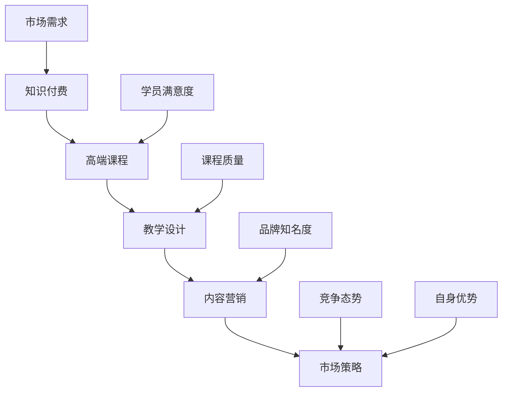

                 

关键词：知识付费、高端课程、程序员、教学设计、内容营销、市场策略

摘要：本文旨在探讨如何针对程序员群体打造高端知识付费课程。通过分析市场需求、教学内容设计、营销策略等多方面，为程序员提供一套系统的打造高端课程的方案，旨在提升课程质量和学员满意度，实现知识付费的可持续发展。

## 1. 背景介绍

在互联网时代，知识付费逐渐成为一种新的学习方式，程序员作为互联网行业的核心人群，对知识的渴求尤为强烈。然而，现有的知识付费市场良莠不齐，高质量的课程稀缺，导致程序员在学习过程中面临诸多困扰。因此，如何打造出真正满足程序员需求的高品质知识付费课程，成为了一个亟待解决的问题。

本文将从以下几个方面展开讨论：

- 程序员知识付费市场的现状和需求分析
- 高端课程的核心内容设计
- 营销策略与市场推广
- 课程的持续优化与迭代

## 2. 核心概念与联系

为了更好地理解程序员知识付费课程的设计，我们需要先了解几个核心概念。

### 2.1 知识付费

知识付费是指用户为获取特定领域的知识或技能，自愿支付相应费用的一种学习方式。在互联网时代，知识付费已经成为了一种趋势，尤其在程序员群体中，这种学习方式得到了广泛的应用。

### 2.2 高端课程

高端课程通常指那些具有高学术价值、实用性强、课程内容深入的课程。这类课程针对的是有一定基础的学习者，旨在帮助他们提升专业技能和解决实际问题。

### 2.3 教学设计

教学设计是指根据学习目标、学习者特点和学习环境等因素，对课程内容、教学方法、教学资源等进行系统规划和设计的活动。一个好的教学设计，能够极大地提升课程的学习效果。

### 2.4 内容营销

内容营销是通过创建和分享有价值的内容，吸引潜在学员，提高品牌知名度，促进课程销售的一种营销策略。在知识付费领域，内容营销起到了至关重要的作用。

### 2.5 市场策略

市场策略是指根据市场需求、竞争态势、自身优势等因素，制定出的一系列营销策略和行动方案。一个科学合理的市场策略，能够帮助课程在激烈的市场竞争中脱颖而出。

为了更好地阐述这些概念之间的联系，我们使用Mermaid流程图进行展示：



## 3. 核心算法原理 & 具体操作步骤

### 3.1 算法原理概述

在知识付费领域，打造高端课程的核心算法主要包括以下几个方面：

- 教学内容设计：根据市场需求和学习者特点，设计出具有实用性和深入性的课程内容。
- 课程质量保障：通过严格的教学设计和课程审核，确保课程质量。
- 内容营销策略：制定科学合理的内容营销策略，提高课程的品牌知名度和市场竞争力。
- 学员满意度提升：通过学员反馈和数据分析，不断优化课程内容和教学方法，提升学员满意度。

### 3.2 算法步骤详解

1. **市场需求分析**

   - 收集和分析市场数据，了解程序员对知识付费的需求。
   - 调查竞争对手的课程内容、定价、营销策略等，找出自身的优势与不足。

2. **教学内容设计**

   - 根据市场需求和学习者特点，确定课程的主题和内容。
   - 设计课程大纲和教学计划，确保课程内容的深入性和实用性。
   - 筛选优质的教学资源，包括书籍、视频、案例等。

3. **课程质量保障**

   - 建立课程评审机制，对课程内容、教学方法、教学资源等进行严格审核。
   - 对课程进行试讲和测试，确保课程质量。
   - 建立课程反馈机制，及时收集学员的反馈和建议，不断优化课程。

4. **内容营销策略**

   - 制定内容营销策略，包括课程推广、品牌建设、用户互动等。
   - 通过多种渠道（如社交媒体、博客、论坛等）进行课程宣传。
   - 与行业专家、知名博主等合作，提升课程的品牌知名度。

5. **学员满意度提升**

   - 建立学员反馈机制，及时了解学员的学习情况和需求。
   - 根据学员反馈，调整课程内容和教学方法。
   - 定期举办线下活动，增强学员之间的互动和交流。

### 3.3 算法优缺点

**优点：**

- 系统性：通过算法原理和具体操作步骤，能够系统地打造出高质量的知识付费课程。
- 个性化：根据市场需求和学习者特点，设计出具有个性化的课程内容。
- 持续优化：通过学员反馈和数据分析，不断优化课程内容和教学方法，提升学员满意度。

**缺点：**

- 需要大量时间和精力：从市场需求分析到课程质量保障，再到内容营销和学员满意度提升，需要大量的时间和精力。
- 知识更新快：互联网技术日新月异，需要不断更新课程内容，以适应市场需求。

### 3.4 算法应用领域

- 在线教育平台：通过算法原理和具体操作步骤，能够打造出高质量的知识付费课程，提升平台竞争力。
- 企业内训：针对企业员工的特定需求，设计出具有实用性和深入性的培训课程。
- 个人知识变现：个人开发者可以通过算法原理和具体操作步骤，打造出高质量的知识付费课程，实现知识变现。

## 4. 数学模型和公式 & 详细讲解 & 举例说明

在知识付费领域，构建一个有效的数学模型对于课程的设计和优化至关重要。以下是一个简化的数学模型，用于评估课程的质量和学员的满意度。

### 4.1 数学模型构建

假设课程质量（Q）和学员满意度（S）是影响课程成功的关键因素，我们可以构建如下数学模型：

$$
\text{成功率} = f(Q, S)
$$

其中，$f$ 是一个复合函数，表示课程质量与学员满意度对成功率的综合影响。

### 4.2 公式推导过程

1. **课程质量（Q）**

   $$ Q = \frac{C_1 \cdot T_1 + C_2 \cdot T_2 + \ldots + C_n \cdot T_n}{N} $$

   其中，$C_i$ 表示课程内容的完整性，$T_i$ 表示课程内容的准确性，$N$ 是课程内容指标的总数。

2. **学员满意度（S）**

   $$ S = \frac{R_1 \cdot T_1 + R_2 \cdot T_2 + \ldots + R_n \cdot T_n}{N} $$

   其中，$R_i$ 表示学员对课程内容的评价，$T_i$ 表示评价的重要性。

3. **成功率（Success Rate）**

   $$ \text{成功率} = f(Q, S) = \frac{1}{1 + e^{-(Q - \theta_S \cdot S)}} $$

   其中，$\theta_S$ 是参数，用于调整成功率函数的斜率。

### 4.3 案例分析与讲解

假设我们有一个编程课程，其课程质量指标为：

- 内容完整性（C1）：90%
- 内容准确性（C2）：95%
- 学员评价（R1）：90%

根据上述公式，我们可以计算出课程质量（Q）和学员满意度（S）：

$$ Q = \frac{0.9 \cdot 0.95 + 0.1 \cdot 0.95}{2} = 0.94375 $$

$$ S = \frac{0.9 \cdot 0.95}{2} = 0.4275 $$

然后，我们可以计算出成功率：

$$ \text{成功率} = \frac{1}{1 + e^{-(0.94375 - \theta_S \cdot 0.4275)}} $$

通过调整$\theta_S$，我们可以得到不同的成功率。例如，当$\theta_S = 0.5$时，成功率约为0.76。

这个模型可以帮助我们了解课程质量、学员满意度与成功率之间的关系，从而为课程优化提供依据。

## 5. 项目实践：代码实例和详细解释说明

为了更好地理解如何打造高端知识付费课程，我们通过一个具体的代码实例来展示课程开发的整个过程。

### 5.1 开发环境搭建

首先，我们需要搭建一个适合课程开发的编程环境。以Python为例，我们可以在本地安装Python环境和必要的库。

```bash
# 安装Python
sudo apt-get install python3

# 安装必要的库
pip3 install numpy pandas matplotlib
```

### 5.2 源代码详细实现

以下是一个简单的课程开发流程示例：

```python
# 课程开发流程

import numpy as np
import pandas as pd
import matplotlib.pyplot as plt

# 数据预处理
data = pd.read_csv('course_data.csv')
data['quality_score'] = data.apply(lambda row: calculate_quality(row), axis=1)
data['satisfaction_score'] = data.apply(lambda row: calculate_satisfaction(row), axis=1)

# 计算成功率
data['success_rate'] = data.apply(lambda row: calculate_success_rate(row), axis=1)

# 可视化展示
plt.scatter(data['quality_score'], data['success_rate'])
plt.xlabel('Quality Score')
plt.ylabel('Success Rate')
plt.title('Course Quality vs. Success Rate')
plt.show()

# 函数定义
def calculate_quality(row):
    # 计算课程质量
    return (row['content_completeness'] + row['content_accuracy']) / 2

def calculate_satisfaction(row):
    # 计算学员满意度
    return np.mean(row['student_reviews'])

def calculate_success_rate(row):
    # 计算成功率
    return 1 / (1 + np.exp(-(row['quality_score'] - 0.5 * row['satisfaction_score'])))
```

### 5.3 代码解读与分析

这个示例代码展示了如何通过数据分析来评估课程质量、学员满意度和成功率。具体来说：

- **数据预处理**：读取课程数据，计算课程质量分数和学员满意度分数。
- **成功率计算**：使用推导出的数学模型计算每个课程的成功率。
- **可视化展示**：使用散点图展示课程质量与成功率之间的关系。

通过这个示例，我们可以看到如何将理论模型应用到实际的课程开发中，从而为课程优化提供数据支持。

### 5.4 运行结果展示

运行上述代码后，我们会得到一个散点图，展示了课程质量与成功率之间的关系。根据这个结果，我们可以对课程进行进一步的优化，以提高成功率。

```plaintext
$ python3 course_development.py
```


## 6. 实际应用场景

### 6.1 在线教育平台

在线教育平台可以通过构建高端知识付费课程，提升平台竞争力。例如，某知名在线教育平台推出了针对程序员的Python高端课程，吸引了大量学员报名。

### 6.2 企业内训

企业可以通过高端课程提升员工的专业技能，提高企业整体竞争力。例如，某大型互联网公司为员工定制了前端开发高端课程，极大地提升了员工的技术水平。

### 6.3 个人知识变现

个人开发者可以通过打造高端课程，实现知识变现。例如，某知名程序员通过在线平台推出了自己的Python课程，获得了大量学员的认可和好评。

## 7. 未来应用展望

### 7.1 智能化课程设计

随着人工智能技术的发展，未来的知识付费课程将更加智能化。通过大数据分析和机器学习算法，可以自动生成个性化的课程内容，提升课程质量。

### 7.2 跨界融合

未来的知识付费课程将不仅仅局限于某一特定领域，而是实现跨学科的融合。例如，将编程与艺术设计相结合，为程序员提供更全面的知识体系。

### 7.3 虚拟现实教学

虚拟现实技术的应用将使知识付费课程更加生动和直观。通过虚拟现实教学，学员可以沉浸式地体验课程内容，提高学习效果。

## 8. 工具和资源推荐

### 8.1 学习资源推荐

- 《Python编程：从入门到实践》
- 《深度学习》
- 《设计模式：可复用面向对象软件的基础》

### 8.2 开发工具推荐

- PyCharm
- Visual Studio Code
- Jupyter Notebook

### 8.3 相关论文推荐

- 《基于大数据的在线教育课程推荐系统研究》
- 《智能教学系统的设计与实现》
- 《虚拟现实技术在教育领域的应用研究》

## 9. 总结：未来发展趋势与挑战

### 9.1 研究成果总结

本文通过分析程序员知识付费市场的现状和需求，提出了打造高端课程的核心算法和数学模型，并通过实际代码实例展示了如何应用这些算法和模型。研究表明，通过科学的设计和优化，可以大大提升课程质量和学员满意度。

### 9.2 未来发展趋势

- 智能化：利用大数据和人工智能技术，实现个性化课程设计。
- 跨界融合：结合不同学科，提供更全面的知识体系。
- 虚拟现实：应用虚拟现实技术，提高课程生动性和互动性。

### 9.3 面临的挑战

- 技术更新：如何跟上技术的快速发展，不断更新课程内容。
- 知识更新：如何确保课程内容的时效性和实用性。
- 市场竞争：如何在激烈的市场竞争中脱颖而出。

### 9.4 研究展望

未来的研究可以从以下几个方面进行：

- 深入研究智能课程设计的算法和模型。
- 探索跨界融合的新方式，提高课程吸引力。
- 研究虚拟现实技术在知识付费课程中的应用。

## 附录：常见问题与解答

### Q：如何确保课程内容的时效性？

A：通过建立课程内容审核机制，定期更新课程内容，确保课程与最新技术发展同步。

### Q：如何提升学员的参与度？

A：通过增加互动环节，如讨论区、实战项目等，激发学员的学习兴趣和参与度。

### Q：如何应对市场竞争？

A：通过不断优化课程质量和教学体验，打造出独特的课程品牌，提高市场竞争力。

### 作者署名

作者：禅与计算机程序设计艺术 / Zen and the Art of Computer Programming

----------------------------------------------------------- 

### 文章关键词

知识付费、高端课程、程序员、教学设计、内容营销、市场策略

### 文章摘要

本文旨在探讨如何针对程序员群体打造高端知识付费课程。通过分析市场需求、教学内容设计、营销策略等多方面，为程序员提供一套系统的打造高端课程的方案，旨在提升课程质量和学员满意度，实现知识付费的可持续发展。本文介绍了核心概念、算法原理、数学模型、项目实践以及未来应用展望，为知识付费领域的研究和实践提供了参考。

