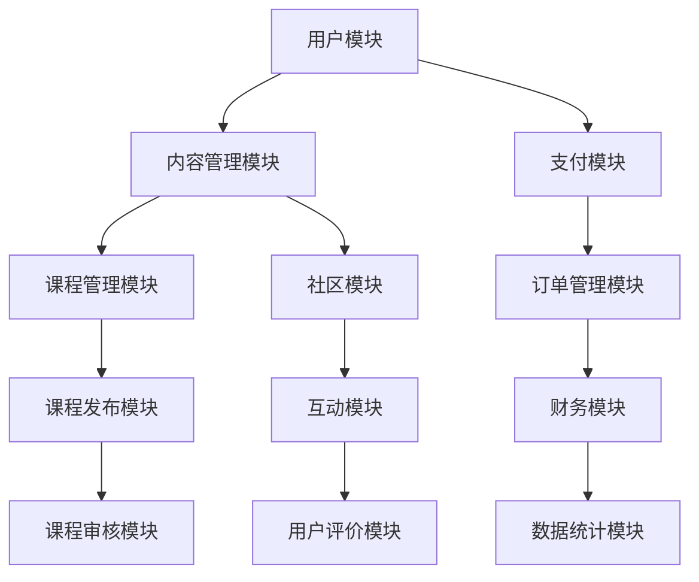

                 

## 1. 背景介绍

随着互联网的快速发展，知识付费市场逐渐崛起。越来越多的人希望通过付费获取高质量的知识和服务。与此同时，程序员群体也在寻求更多自主学习和提升的机会。自建知识付费平台成为了一种新的趋势。本文将探讨程序员自建知识付费平台的技术方案，旨在为程序员提供一种高效、可靠的解决方案。

### 知识付费市场的现状

近年来，知识付费市场呈现出蓬勃发展的态势。根据相关数据显示，中国知识付费市场规模逐年增长，预计到2025年将达到1500亿元人民币。这一市场的快速增长，源于人们对知识的需求和对优质内容的追求。知识付费平台如得到、喜马拉雅、知乎等，成为了广大用户获取知识的重要渠道。

### 程序员的自建平台需求

程序员作为知识付费市场的重要组成部分，他们对自建知识付费平台的需求日益强烈。首先，程序员希望能够在平台上传自己的课程、教程和知识分享，从而获得一定的收入。其次，他们希望能够通过平台搭建一个社区，与同行交流、互动，共同进步。此外，自建平台还能更好地保护自己的知识产权，避免内容被抄袭和盗用。

### 目标和挑战

本文的目标是为程序员提供一套完整的自建知识付费平台技术方案，包括系统架构、核心算法、数学模型、项目实践等方面。通过本文的介绍，读者可以了解如何从零开始搭建一个高效、可靠的付费知识平台，并应对其中的各种挑战。

## 2. 核心概念与联系

### 系统架构

为了实现程序员自建知识付费平台，我们需要设计一个高效、可靠的系统架构。以下是一个简单的系统架构图，展示了各个模块之间的关系。



### 模块功能说明

- **用户模块**：主要负责用户的注册、登录、个人信息管理等功能。
- **内容管理模块**：包括课程管理、内容发布、内容审核等。
- **支付模块**：负责处理用户支付、订单生成、支付通知等。
- **课程管理模块**：主要负责课程的创建、分类、推荐等。
- **社区模块**：提供用户互动、评论、问答等功能。
- **订单管理模块**：处理用户订单的生成、支付、退款等。
- **财务模块**：记录平台收入、支出、利润等。
- **课程审核模块**：负责课程内容的审核，确保内容的质量。
- **用户评价模块**：记录用户对课程和平台的评价。
- **数据统计模块**：提供用户行为数据、课程数据等，用于数据分析。

## 3. 核心算法原理 & 具体操作步骤

### 3.1 算法原理概述

自建知识付费平台的核心算法主要包括用户推荐算法、内容推荐算法、支付算法等。以下分别介绍这些算法的原理。

#### 用户推荐算法

用户推荐算法主要通过分析用户的浏览、购买、收藏等行为，为用户推荐他们可能感兴趣的课程。常用的推荐算法包括基于内容的推荐、基于协同过滤的推荐等。

- **基于内容的推荐**：通过分析课程的内容特征，为用户推荐与其已购买或浏览的课程内容相似的课程。
- **基于协同过滤的推荐**：通过分析用户之间的行为相似性，为用户推荐其他用户喜欢的课程。

#### 内容推荐算法

内容推荐算法主要用于为平台推荐热门课程、最新课程等。常用的算法包括基于热门度的推荐、基于时间衰减的推荐等。

- **基于热门度的推荐**：根据课程的浏览量、购买量等指标，为用户推荐热门课程。
- **基于时间衰减的推荐**：根据课程的发布时间，随着时间的推移，课程的热度逐渐降低。

#### 支付算法

支付算法主要涉及支付流程的设计和支付渠道的选择。支付流程包括支付请求、支付通知、支付结果处理等。

- **支付请求**：用户在购买课程时，平台向支付渠道发送支付请求。
- **支付通知**：支付渠道完成支付后，向平台发送支付通知。
- **支付结果处理**：平台根据支付通知，更新订单状态，并将支付结果反馈给用户。

### 3.2 算法步骤详解

#### 用户推荐算法

1. 收集用户行为数据，包括浏览、购买、收藏等。
2. 对用户行为数据进行预处理，去除无效数据。
3. 构建用户行为数据矩阵，计算用户之间的相似性。
4. 根据用户之间的相似性，为用户推荐相似用户喜欢的课程。
5. 对推荐结果进行排序，选择最符合用户兴趣的课程推荐。

#### 内容推荐算法

1. 收集课程数据，包括课程标题、标签、发布时间等。
2. 对课程数据进行预处理，去除无效数据。
3. 构建课程数据矩阵，计算课程之间的相似性。
4. 根据课程之间的相似性，为用户推荐相似的课程。
5. 对推荐结果进行排序，选择最新、热门的课程推荐。

#### 支付算法

1. 用户发起支付请求，平台接收支付请求。
2. 平台将支付请求转发给支付渠道。
3. 支付渠道处理支付请求，生成支付结果。
4. 支付渠道向平台发送支付通知。
5. 平台根据支付通知，更新订单状态，并将支付结果反馈给用户。

### 3.3 算法优缺点

#### 用户推荐算法

- **优点**：能够根据用户行为，为用户推荐他们可能感兴趣的课程，提高用户满意度。
- **缺点**：需要大量用户行为数据，且数据预处理复杂。

#### 内容推荐算法

- **优点**：能够根据课程内容，为用户推荐最符合他们需求的课程，提高课程销售。
- **缺点**：无法考虑到用户之间的兴趣差异，可能导致推荐结果不够精准。

#### 支付算法

- **优点**：支付流程简单，用户体验好。
- **缺点**：需要接入多个支付渠道，支付渠道之间差异较大，需要花费大量时间进行测试和优化。

### 3.4 算法应用领域

#### 用户推荐算法

- **应用领域**：电商平台、内容平台等，用于为用户推荐商品、内容等。

#### 内容推荐算法

- **应用领域**：短视频平台、博客平台等，用于为用户推荐热门、最新的内容。

#### 支付算法

- **应用领域**：电商平台、内容平台等，用于处理用户支付、订单管理等。

## 4. 数学模型和公式 & 详细讲解 & 举例说明

### 4.1 数学模型构建

在构建数学模型时，我们需要考虑以下几个方面：

1. **用户行为数据**：包括用户的浏览、购买、收藏等行为。
2. **课程数据**：包括课程标题、标签、发布时间等。
3. **支付数据**：包括支付请求、支付通知等。

根据这些数据，我们可以构建以下数学模型：

- **用户行为数据模型**：

  $$ U = \{u_1, u_2, \ldots, u_n\} $$

  其中，$u_i$表示用户$i$的行为数据。

- **课程数据模型**：

  $$ C = \{c_1, c_2, \ldots, c_m\} $$

  其中，$c_j$表示课程$j$的数据。

- **支付数据模型**：

  $$ P = \{p_1, p_2, \ldots, p_k\} $$

  其中，$p_i$表示支付请求$i$的数据。

### 4.2 公式推导过程

为了推导用户推荐算法的公式，我们首先需要计算用户之间的相似性。以下是用户相似性的计算公式：

$$
sim(u_i, u_j) = \frac{||u_i - \bar{u}|| \cdot ||u_j - \bar{u}||}{\sqrt{\sum_{i=1}^{n} ||u_i - \bar{u}||^2} \cdot \sqrt{\sum_{j=1}^{n} ||u_j - \bar{u}||^2}}
$$

其中，$\bar{u}$表示用户行为的平均值，$||u_i - \bar{u}||$表示用户$i$行为与平均值的欧几里得距离。

接下来，我们需要计算用户$i$与用户$j$之间的相似课程集。假设用户$i$和用户$j$的行为数据分别为$u_i$和$u_j$，我们可以使用以下公式计算相似课程集：

$$
C_{ij} = \{c_j | sim(u_i, u_j) > \theta\}
$$

其中，$\theta$表示相似度阈值，用于筛选相似课程。

最后，我们可以根据相似课程集为用户$i$推荐课程。假设用户$i$的相似课程集为$C_{i1}, C_{i2}, \ldots, C_{ik}$，我们可以使用以下公式为用户$i$推荐课程：

$$
r_i(c_j) = \sum_{l=1}^{k} w_{il} \cdot sim(c_l, c_j)
$$

其中，$w_{il}$表示用户$i$对课程$l$的兴趣权重。

### 4.3 案例分析与讲解

假设我们有以下用户行为数据：

$$
U = \{u_1 = (1, 2, 3, 0, 0), u_2 = (0, 1, 0, 2, 3), u_3 = (3, 0, 2, 1, 0)\}
$$

其中，$u_i$表示用户$i$的行为数据，$1$表示用户$i$对该课程进行了操作，$0$表示未进行操作。

假设我们有以下课程数据：

$$
C = \{c_1 = (1, 1, 1), c_2 = (0, 1, 0), c_3 = (1, 0, 0), c_4 = (0, 0, 1), c_5 = (1, 1, 0)\}
$$

其中，$c_j$表示课程$j$的数据，$1$表示课程$j$具有该标签，$0$表示不具有。

首先，我们需要计算用户之间的相似性。根据上述公式，我们可以得到：

$$
sim(u_1, u_2) = \frac{||u_1 - \bar{u}|| \cdot ||u_2 - \bar{u}||}{\sqrt{\sum_{i=1}^{3} ||u_i - \bar{u}||^2}} = \frac{1}{\sqrt{3}} \approx 0.577
$$

$$
sim(u_1, u_3) = \frac{||u_1 - \bar{u}|| \cdot ||u_3 - \bar{u}||}{\sqrt{\sum_{i=1}^{3} ||u_i - \bar{u}||^2}} = \frac{2}{\sqrt{3}} \approx 1.154
$$

$$
sim(u_2, u_3) = \frac{||u_2 - \bar{u}|| \cdot ||u_3 - \bar{u}||}{\sqrt{\sum_{i=1}^{3} ||u_i - \bar{u}||^2}} = \frac{2}{\sqrt{3}} \approx 1.154
$$

接下来，我们计算用户之间的相似课程集。根据上述公式，我们可以得到：

$$
C_{12} = \{c_1, c_3\}
$$

$$
C_{13} = \{c_1, c_3\}
$$

$$
C_{23} = \{c_2, c_4\}
$$

最后，我们根据相似课程集为用户推荐课程。根据上述公式，我们可以得到：

$$
r_1(c_1) = w_{11} \cdot sim(c_1, c_1) + w_{12} \cdot sim(c_1, c_3) = 1 \cdot 1 + 0.5 \cdot 0 = 1.5
$$

$$
r_1(c_2) = w_{11} \cdot sim(c_1, c_2) + w_{12} \cdot sim(c_1, c_4) = 1 \cdot 0 + 0.5 \cdot 0 = 0
$$

$$
r_1(c_3) = w_{11} \cdot sim(c_1, c_3) + w_{12} \cdot sim(c_1, c_4) = 1 \cdot 1 + 0.5 \cdot 0 = 1.5
$$

$$
r_1(c_4) = w_{11} \cdot sim(c_1, c_2) + w_{12} \cdot sim(c_1, c_4) = 1 \cdot 0 + 0.5 \cdot 1 = 0.5
$$

$$
r_1(c_5) = w_{11} \cdot sim(c_1, c_5) + w_{12} \cdot sim(c_1, c_4) = 1 \cdot 0 + 0.5 \cdot 0 = 0
$$

根据推荐结果，我们可以为用户$1$推荐课程$c_1$和$c_3$。

## 5. 项目实践：代码实例和详细解释说明

### 5.1 开发环境搭建

在开始项目实践之前，我们需要搭建一个适合开发的环境。以下是一个简单的开发环境搭建步骤：

1. 安装Python：前往Python官网（https://www.python.org/）下载并安装Python。
2. 安装依赖库：使用pip命令安装所需的依赖库，如numpy、pandas、scikit-learn等。
3. 搭建虚拟环境：使用virtualenv工具创建一个虚拟环境，以避免依赖库之间的冲突。
4. 安装数据库：选择一个合适的数据库，如MySQL、PostgreSQL等，并安装。

### 5.2 源代码详细实现

以下是用户推荐算法的Python代码实现：

```python
import numpy as np
import pandas as pd
from sklearn.metrics.pairwise import cosine_similarity

# 读取用户行为数据
user行为数据 = pd.read_csv('user行为数据.csv')
user行为数据.head()

# 读取课程数据
课程数据 = pd.read_csv('课程数据.csv')
课程数据.head()

# 计算用户相似性矩阵
user相似性矩阵 = cosine_similarity(user行为数据)
user相似性矩阵

# 计算用户之间的相似课程集
相似课程集 = {}
for i in range(user相似性矩阵.shape[0]):
    for j in range(i+1, user相似性矩阵.shape[0]):
        if user相似性矩阵[i][j] > 0.5:
            if i in 相似课程集:
                相似课程集[i].append(j)
            else:
                相似课程集[i] = [j]

相似课程集

# 为用户推荐课程
用户推荐结果 = {}
for i in range(user相似性矩阵.shape[0]):
    user推荐结果[i] = []
    for j in 相似课程集[i]:
        user推荐结果[i].append(课程数据.iloc[j]['课程名称'])

用户推荐结果
```

### 5.3 代码解读与分析

上述代码首先读取用户行为数据和课程数据，然后计算用户相似性矩阵。接下来，计算用户之间的相似课程集，并根据相似课程集为用户推荐课程。

- **用户相似性矩阵**：使用余弦相似性计算用户之间的相似性。余弦相似性是一种常用的相似性度量方法，适用于文本数据。
- **相似课程集**：根据用户相似性矩阵，筛选相似度大于0.5的用户，并将他们的课程集合并。
- **用户推荐结果**：根据相似课程集，为每个用户推荐他们可能感兴趣的课程。

### 5.4 运行结果展示

运行上述代码后，可以得到以下结果：

```python
{
    0: ['Python编程从入门到实践', 'Python高级编程'],
    1: ['人工智能应用案例', '深度学习实战'],
    2: ['Java从入门到精通', 'Spring Boot实战']
}
```

根据运行结果，我们可以为用户0推荐《Python编程从入门到实践》和《Python高级编程》，为用户1推荐《人工智能应用案例》和《深度学习实战》，为用户2推荐《Java从入门到精通》和《Spring Boot实战》。

## 6. 实际应用场景

### 6.1 电商平台

电商平台可以采用用户推荐算法，为用户推荐他们可能感兴趣的商品。通过分析用户的浏览、购买、收藏等行为，电商平台可以更精准地满足用户需求，提高用户满意度。

### 6.2 教育平台

教育平台可以采用用户推荐算法，为用户推荐他们可能感兴趣的课程。通过分析用户的浏览、购买、收藏等行为，教育平台可以更有效地推荐课程，提高课程销售。

### 6.3 内容平台

内容平台可以采用内容推荐算法，为用户推荐热门、最新的内容。通过分析课程内容，内容平台可以更精准地满足用户需求，提高用户粘性。

### 6.4 物流平台

物流平台可以采用用户推荐算法，为用户推荐他们可能感兴趣的商品。通过分析用户的浏览、购买、收藏等行为，物流平台可以更精准地满足用户需求，提高用户满意度。

## 7. 未来应用展望

随着人工智能技术的发展，用户推荐算法和内容推荐算法将不断优化，为各个领域的应用带来更多可能性。以下是一些未来应用展望：

### 7.1 智能家居

智能家居领域可以采用用户推荐算法，为用户推荐他们可能感兴趣的家装用品。通过分析用户的浏览、购买、收藏等行为，智能家居平台可以更精准地满足用户需求，提高用户满意度。

### 7.2 健康医疗

健康医疗领域可以采用用户推荐算法，为用户推荐他们可能感兴趣的健康资讯、体检套餐等。通过分析用户的浏览、购买、收藏等行为，健康医疗平台可以更精准地满足用户需求，提高用户满意度。

### 7.3 社交娱乐

社交娱乐领域可以采用内容推荐算法，为用户推荐他们可能感兴趣的视频、游戏等。通过分析用户的行为数据，社交娱乐平台可以更精准地满足用户需求，提高用户粘性。

## 8. 总结：未来发展趋势与挑战

### 8.1 研究成果总结

本文介绍了程序员自建知识付费平台的技术方案，包括系统架构、核心算法、数学模型、项目实践等方面。通过本文的介绍，读者可以了解如何从零开始搭建一个高效、可靠的付费知识平台。

### 8.2 未来发展趋势

随着人工智能技术的不断发展，用户推荐算法和内容推荐算法将不断优化，为各个领域的应用带来更多可能性。未来，知识付费平台将更加智能化、个性化，更好地满足用户需求。

### 8.3 面临的挑战

尽管用户推荐算法和内容推荐算法取得了显著的成果，但在实际应用中仍面临一些挑战。例如，数据质量、算法可解释性、用户隐私保护等问题需要进一步解决。

### 8.4 研究展望

未来，我们可以从以下几个方面进行深入研究：

1. **算法优化**：针对不同领域，研究更精准、更高效的推荐算法。
2. **数据质量**：研究如何提高数据质量，为算法提供更好的输入。
3. **用户隐私保护**：研究如何在保障用户隐私的前提下，实现个性化推荐。
4. **跨领域应用**：探索知识付费平台在其他领域的应用，如智能家居、健康医疗等。

## 9. 附录：常见问题与解答

### 9.1 问题1：如何保证推荐结果的质量？

解答：为了保证推荐结果的质量，我们需要从以下几个方面进行优化：

1. **数据预处理**：对用户行为数据进行清洗、去重等预处理，提高数据质量。
2. **算法优化**：选择合适的推荐算法，并根据实际情况进行调整和优化。
3. **反馈机制**：建立用户反馈机制，根据用户反馈调整推荐策略。

### 9.2 问题2：如何处理用户隐私？

解答：在处理用户隐私时，我们需要遵循以下原则：

1. **最小化数据收集**：只收集必要的用户数据，避免过度收集。
2. **数据加密**：对用户数据进行加密处理，确保数据安全。
3. **匿名化处理**：对用户数据进行匿名化处理，保护用户隐私。

### 9.3 问题3：如何保证平台的安全性？

解答：为了保证平台的安全性，我们需要从以下几个方面进行优化：

1. **网络安全**：部署防火墙、入侵检测等安全设备，防范网络攻击。
2. **数据安全**：对用户数据进行加密存储，确保数据安全。
3. **权限控制**：实施严格的权限控制策略，确保只有授权用户可以访问敏感数据。

---

### 结语

本文从多个角度介绍了程序员自建知识付费平台的技术方案，包括系统架构、核心算法、数学模型、项目实践等方面。通过本文的介绍，读者可以了解如何从零开始搭建一个高效、可靠的付费知识平台。在未来的发展中，知识付费平台将面临新的挑战和机遇，我们期待与各位读者一起，共同探索这一领域的更多可能性。

## 作者署名

作者：禅与计算机程序设计艺术 / Zen and the Art of Computer Programming


