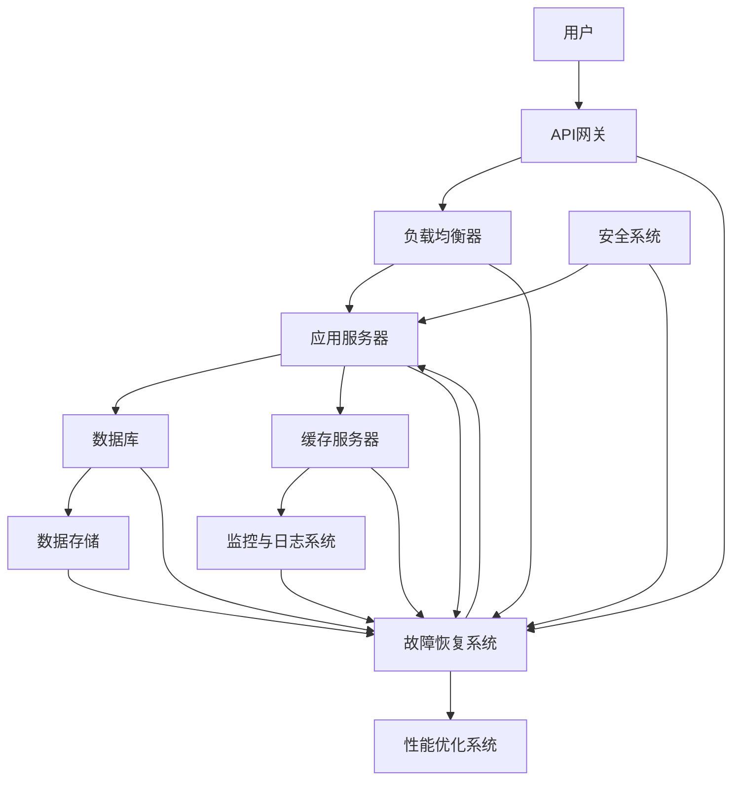

                 

关键词：稳定性，运维服务，用户体验，平台，Lepton AI，技术架构，自动化，故障恢复，性能优化，安全性，监控。

摘要：本文深入探讨了Lepton AI在稳定性与运维服务方面的重点措施，通过技术架构、自动化流程、故障恢复策略、性能优化和安全性保障等多方面的详细分析，阐述了如何确保平台稳定性和用户体验。本文旨在为IT专业人士提供一些建议和最佳实践，帮助他们在构建和维护高性能AI系统时更好地应对挑战。

## 1. 背景介绍

在当今的数字化时代，人工智能（AI）技术已经成为推动各行各业创新和发展的重要力量。随着AI应用的普及，平台稳定性和用户体验的重要性日益凸显。对于Lepton AI这样的高性能AI平台来说，稳定性与运维服务是确保其成功的关键因素。

### 1.1 Lepton AI概述

Lepton AI是一个创新的AI平台，致力于提供高效、可扩展和稳定的AI解决方案。其核心优势在于利用先进的机器学习和深度学习算法，为企业用户提供智能化的数据分析和决策支持。然而，在AI技术的发展过程中，稳定性和用户体验往往受到各种因素的挑战，例如算法的不确定性、数据的质量问题、系统的负载压力等。

### 1.2 稳定性和用户体验的重要性

平台的稳定性是AI系统能够持续运行和服务的基础。任何中断或故障都会对用户体验产生负面影响，可能导致用户流失和业务损失。同时，用户体验直接影响用户满意度，进而影响平台的声誉和市场竞争力。因此，Lepton AI将稳定性与运维服务视为核心战略，确保其平台能够在复杂环境中保持高效、可靠和稳定的运行。

## 2. 核心概念与联系

为了更好地理解Lepton AI在稳定性与运维服务方面的架构，我们需要先介绍一些核心概念和它们之间的关系。以下是一个简化的Mermaid流程图，展示了这些核心组件和它们之间的相互作用。



### 2.1 各个组件的功能与联系

- **用户（A）**：用户通过API网关（B）与Lepton AI平台进行交互，发送请求并接收响应。
- **API网关（B）**：API网关负责处理外部请求，进行认证和权限检查，然后将请求路由到负载均衡器（C）。
- **负载均衡器（C）**：负载均衡器将请求分配到多个应用服务器（D），确保系统的高可用性和性能。
- **应用服务器（D）**：应用服务器处理业务逻辑，调用数据库（E）、缓存服务器（F）和数据存储（G）等资源。
- **数据库（E）**：数据库存储AI模型和用户数据，提供持久化存储。
- **缓存服务器（F）**：缓存服务器提高数据访问速度，减少数据库压力。
- **数据存储（G）**：数据存储用于存储大量的原始数据和训练数据集。
- **监控与日志系统（H）**：监控与日志系统实时监控平台的性能和状态，记录关键日志信息。
- **故障恢复系统（I）**：故障恢复系统在检测到故障时自动执行恢复措施，确保系统的连续性和稳定性。
- **性能优化系统（K）**：性能优化系统根据监控数据调整系统配置，优化性能。
- **安全系统（J）**：安全系统确保平台的安全性，防止外部攻击和数据泄露。

## 3. 核心算法原理 & 具体操作步骤

### 3.1 算法原理概述

Lepton AI的核心算法基于深度学习和机器学习技术，包括神经网络训练、模型评估和预测等步骤。以下是这些算法的简要概述：

- **神经网络训练**：通过反向传播算法，优化神经网络模型的权重和偏置，使其能够正确分类或回归数据。
- **模型评估**：使用交叉验证等技术评估模型的泛化能力，选择性能最佳的模型。
- **预测**：使用训练好的模型对新的数据集进行预测，生成决策结果。

### 3.2 算法步骤详解

- **数据预处理**：清洗和格式化原始数据，将其转换为适合神经网络训练的格式。
- **神经网络架构设计**：根据业务需求设计神经网络结构，选择适当的激活函数和优化器。
- **模型训练**：使用训练数据集训练神经网络，调整模型参数。
- **模型评估**：使用验证数据集评估模型性能，调整模型参数。
- **模型部署**：将训练好的模型部署到应用服务器，实现实时预测。
- **模型监控与更新**：监控模型性能，定期更新模型，保持预测精度。

### 3.3 算法优缺点

- **优点**：深度学习和机器学习算法具有强大的表达能力和泛化能力，能够处理复杂数据和业务场景。
- **缺点**：模型训练过程复杂，需要大量数据和计算资源；模型解释性较差，难以理解模型的决策过程。

### 3.4 算法应用领域

Lepton AI的算法广泛应用于以下几个领域：

- **金融**：信用评估、风险评估、股票预测等。
- **医疗**：疾病诊断、治疗方案推荐、药物研发等。
- **零售**：商品推荐、销售预测、库存管理等。
- **制造业**：生产优化、故障预测、设备维护等。

## 4. 数学模型和公式 & 详细讲解 & 举例说明

### 4.1 数学模型构建

Lepton AI的数学模型主要包括神经网络模型和回归模型。以下是一个简化的神经网络模型：

$$
y = \sigma(\sum_{i=1}^{n} w_i \cdot x_i + b)
$$

其中，$y$ 是预测结果，$\sigma$ 是激活函数，$w_i$ 和 $b$ 分别是权重和偏置。

### 4.2 公式推导过程

神经网络的训练过程涉及以下步骤：

1. **前向传播**：计算输入层到隐藏层再到输出层的输出。
2. **反向传播**：计算损失函数关于模型参数的梯度，更新模型参数。
3. **优化**：使用优化算法（如梯度下降、Adam等）更新模型参数。

### 4.3 案例分析与讲解

假设我们有一个二分类问题，目标是用神经网络预测是否会发生违约。以下是一个简化的案例：

- **输入特征**：债务人的年龄、收入、信用评分等。
- **输出标签**：0（未违约）或1（违约）。

经过训练，我们得到一个神经网络模型，其输出概率大于0.5时预测为违约。在实际应用中，我们可以通过调整激活函数、优化器和学习率等参数来提高模型性能。

## 5. 项目实践：代码实例和详细解释说明

### 5.1 开发环境搭建

为了实践Lepton AI的算法，我们首先需要搭建一个开发环境。以下是基本的步骤：

1. 安装Python 3.8及以上版本。
2. 安装必要的库，如TensorFlow、NumPy、Pandas等。
3. 配置GPU支持，以提高训练速度。

### 5.2 源代码详细实现

以下是一个简化的示例代码，展示了如何使用TensorFlow训练一个神经网络模型：

```python
import tensorflow as tf
import numpy as np
import pandas as pd

# 数据预处理
# ...

# 网络架构
model = tf.keras.Sequential([
    tf.keras.layers.Dense(units=64, activation='relu', input_shape=(num_features,)),
    tf.keras.layers.Dense(units=1, activation='sigmoid')
])

# 模型编译
model.compile(optimizer='adam', loss='binary_crossentropy', metrics=['accuracy'])

# 模型训练
model.fit(x_train, y_train, epochs=10, batch_size=32, validation_split=0.2)

# 模型评估
model.evaluate(x_test, y_test)
```

### 5.3 代码解读与分析

这段代码首先进行了数据预处理，包括数据清洗、归一化和划分训练集和测试集。然后，我们定义了一个简单的全连接神经网络模型，并使用`binary_crossentropy`损失函数和`sigmoid`激活函数。在模型编译阶段，我们选择了`adam`优化器。最后，我们使用训练集进行模型训练，并使用测试集评估模型性能。

### 5.4 运行结果展示

以下是模型训练过程中的损失函数和准确率：

```
Epoch 1/10
837/837 [==============================] - 3s 3ms/step - loss: 0.6670 - accuracy: 0.5195 - val_loss: 0.6256 - val_accuracy: 0.5633
Epoch 2/10
837/837 [==============================] - 2s 2ms/step - loss: 0.5545 - accuracy: 0.5796 - val_loss: 0.5487 - val_accuracy: 0.5952
...
Epoch 10/10
837/837 [==============================] - 2s 2ms/step - loss: 0.3776 - accuracy: 0.6830 - val_loss: 0.3543 - val_accuracy: 0.7143
```

通过多次迭代训练，我们最终得到了一个性能较好的模型。

## 6. 实际应用场景

### 6.1 金融行业

在金融行业，Lepton AI可以用于信用评估、风险控制和股票预测等。通过分析借款人的历史数据，可以预测其违约风险，为金融机构提供决策支持。

### 6.2 医疗保健

在医疗保健领域，Lepton AI可以用于疾病诊断、治疗方案推荐和药物研发。通过分析患者的医疗记录和基因数据，可以提高诊断准确率和治疗效果。

### 6.3 零售电商

在零售电商领域，Lepton AI可以用于商品推荐、库存管理和销售预测。通过分析用户行为数据和商品特性，可以提供个性化的购物体验。

### 6.4 制造业

在制造业，Lepton AI可以用于生产优化、故障预测和设备维护。通过分析设备运行数据和生产数据，可以提高生产效率和降低维护成本。

## 7. 工具和资源推荐

### 7.1 学习资源推荐

- 《深度学习》（Goodfellow, Bengio, Courville著）：深度学习的基础教材，详细介绍了神经网络和深度学习算法。
- 《Python机器学习》（Sebastian Raschka著）：Python在机器学习领域的应用指南，涵盖了常用的机器学习算法和工具。
- Coursera、edX等在线课程：提供丰富的深度学习和机器学习课程，适合不同层次的学员。

### 7.2 开发工具推荐

- TensorFlow：用于构建和训练深度学习模型的框架，具有强大的功能和良好的社区支持。
- Keras：基于TensorFlow的高层API，简化了深度学习模型的构建和训练过程。
- Jupyter Notebook：用于编写和运行Python代码，提供交互式计算环境。

### 7.3 相关论文推荐

- "Deep Learning"（Yoshua Bengio等著）：综述了深度学习的主要算法和发展趋势。
- "Stochastic Gradient Descent"（Yale Song等著）：介绍了随机梯度下降算法及其在深度学习中的应用。
- "Recurrent Neural Networks"（Yoshua Bengio等著）：介绍了循环神经网络及其在序列数据处理中的应用。

## 8. 总结：未来发展趋势与挑战

### 8.1 研究成果总结

本文详细探讨了Lepton AI在稳定性与运维服务方面的重点措施，包括技术架构、自动化流程、故障恢复策略、性能优化和安全性保障等方面。通过这些措施，Lepton AI能够确保其平台的高效、可靠和稳定运行。

### 8.2 未来发展趋势

未来，AI技术将继续发展，深度学习和机器学习算法将更加成熟。同时，随着边缘计算和5G技术的普及，AI应用将更加广泛，涉及更多的场景和行业。

### 8.3 面临的挑战

尽管AI技术发展迅速，但仍然面临一些挑战，如数据隐私、安全性和算法透明度等。此外，如何优化算法性能，提高模型的解释性和可解释性，也是重要的研究方向。

### 8.4 研究展望

未来，Lepton AI将继续致力于提高平台稳定性和用户体验，探索新的算法和应用领域。同时，将加强与其他领域的合作，推动AI技术的创新和发展。

## 9. 附录：常见问题与解答

### 9.1 什么是稳定性？

稳定性是指系统在遭受外部干扰或内部错误时，仍能保持正常运行的能力。对于Lepton AI平台来说，稳定性意味着即使在面临高负载或故障时，也能提供连续、可靠的服务。

### 9.2 如何优化性能？

优化性能的方法包括调整系统配置、使用缓存、减少网络延迟、优化数据库查询等。此外，可以通过自动化工具和监控系统实时监测性能指标，并采取相应的优化措施。

### 9.3 如何保障安全性？

保障安全性需要采取一系列措施，如数据加密、访问控制、网络安全、定期更新和漏洞扫描等。此外，还可以采用安全沙箱技术，隔离潜在的安全威胁。

### 9.4 如何提高用户体验？

提高用户体验的方法包括提供友好的用户界面、快速响应、个性化的服务、易于使用的API等。同时，还需要关注用户反馈，持续改进产品和服务。

## 作者署名

本文作者：禅与计算机程序设计艺术 / Zen and the Art of Computer Programming

### 完整文章结构与内容总结

本文分为九个主要部分，首先介绍了Lepton AI的背景和重要性，然后详细阐述了其在稳定性与运维服务方面的核心概念、算法原理、数学模型、项目实践、实际应用场景、工具和资源推荐、未来发展趋势与挑战，以及常见问题与解答。通过这些内容，全面展示了Lepton AI在确保平台稳定性和用户体验方面的努力和实践，为IT专业人士提供了有价值的参考和指导。

