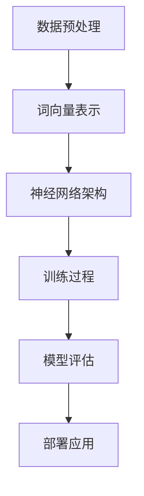

                 

关键词：大规模语言模型（LLM），处理速度，性能优化，硬件加速，算法改进，应用领域

> 摘要：本文探讨了大规模语言模型（LLM）在处理速度方面的瓶颈及其突破方法。通过对LLM核心算法的优化、硬件加速技术的应用以及在实际应用场景中的实践经验，本文旨在为提升LLM处理速度提供全面而深入的指导。

## 1. 背景介绍

### 1.1 LLM的发展历程

大规模语言模型（LLM）是近年来自然语言处理（NLP）领域的重要突破。从早期的统计语言模型，到基于深度学习的神经网络模型，再到如今的大型预训练模型，LLM的发展经历了数次重大变革。早期模型如Word2Vec、GloVe等，通过将词汇映射到低维向量空间，提高了语言理解的能力。随着深度学习技术的兴起，Word2Vec模型进一步发展，诞生了诸如BERT、GPT等大型预训练模型。这些模型通过在大量文本数据上训练，学习到了丰富的语言知识，从而在多项NLP任务上取得了显著的性能提升。

### 1.2 LLM在应用中的重要性

LLM在各个领域的应用越来越广泛，如自然语言理解、机器翻译、文本生成、问答系统等。特别是在人工智能领域，LLM被认为是实现智能对话系统、智能助手等应用的关键技术。然而，随着模型规模的不断扩大，如何提升LLM的处理速度成为了一个亟待解决的问题。

## 2. 核心概念与联系

为了更清晰地理解LLM处理速度的瓶颈，我们需要首先了解LLM的核心概念和架构。下面是LLM的核心概念及其相互关系的Mermaid流程图：



### 2.1 数据预处理

数据预处理是LLM训练过程中的第一步。它包括文本清洗、分词、词干提取、停用词过滤等操作。数据预处理的质量直接影响到后续模型训练的效果。针对这一步骤，可以采用多线程、分布式计算等技术来提高处理速度。

### 2.2 词向量表示

词向量表示是将自然语言文本转化为计算机可以处理的数字形式。常用的词向量模型包括Word2Vec、GloVe等。为了提高词向量表示的效率，可以采用高效的计算库，如Gensim、spaCy等。

### 2.3 神经网络架构

神经网络架构是LLM的核心部分。以BERT和GPT为代表的模型，采用了复杂的多层神经网络结构。为了提高处理速度，可以采用GPU、TPU等硬件加速技术，同时优化模型的结构，如采用轻量级网络架构。

### 2.4 训练过程

训练过程是LLM构建的核心环节。在训练过程中，需要通过大量数据迭代优化模型的参数。为了提高训练速度，可以采用以下技术：

- **并行训练**：通过多卡训练，分布式训练等方式，提高训练速度。
- **增量训练**：对于大型模型，可以采用增量训练的方式，先在小规模数据上训练，再逐步增加数据量。

### 2.5 模型评估

模型评估是LLM训练过程中的重要环节。通过在验证集和测试集上评估模型的性能，可以调整模型的参数，优化模型结构。为了提高评估速度，可以采用多线程、分布式计算等技术。

### 2.6 部署应用

模型部署是将训练好的LLM应用到实际场景中的过程。为了提高部署速度，可以采用以下技术：

- **模型压缩**：通过模型压缩技术，如量化、剪枝等，降低模型的存储和计算需求。
- **边缘计算**：将LLM部署到边缘设备，如手机、智能手表等，降低延迟，提高用户体验。

## 3. 核心算法原理 & 具体操作步骤

### 3.1 算法原理概述

LLM的核心算法是基于深度学习的神经网络模型。这些模型通过在大量数据上训练，学习到了丰富的语言知识。为了提升处理速度，需要从以下几个方面进行优化：

- **模型结构优化**：采用轻量级网络架构，减少计算量。
- **硬件加速**：采用GPU、TPU等硬件加速技术。
- **并行计算**：采用多线程、分布式计算等技术。
- **模型压缩**：采用量化、剪枝等技术，降低模型存储和计算需求。

### 3.2 算法步骤详解

#### 3.2.1 数据预处理

1. **文本清洗**：去除文本中的HTML标签、特殊字符等。
2. **分词**：将文本分解为词或子词。
3. **词干提取**：将单词还原为其基本形式。
4. **停用词过滤**：去除对模型训练没有贡献的停用词。

#### 3.2.2 词向量表示

1. **词向量模型选择**：选择适合的词向量模型，如Word2Vec、GloVe等。
2. **词向量训练**：在大量文本数据上训练词向量。
3. **词向量存储**：将训练好的词向量存储到文件中，供后续使用。

#### 3.2.3 神经网络架构设计

1. **网络结构选择**：选择适合的神经网络结构，如Transformer、BERT等。
2. **网络参数设置**：设置网络参数，如学习率、批次大小等。
3. **网络训练**：在词向量表示的基础上，训练神经网络模型。

#### 3.2.4 模型评估与优化

1. **评估指标选择**：选择适合的评估指标，如ACC、F1等。
2. **模型优化**：通过调整网络参数、模型结构等，优化模型性能。
3. **模型验证**：在验证集上验证模型性能。

#### 3.2.5 模型部署

1. **模型压缩**：采用模型压缩技术，如量化、剪枝等，降低模型存储和计算需求。
2. **部署平台选择**：选择适合的部署平台，如GPU、TPU等。
3. **模型部署**：将模型部署到目标平台上，供用户使用。

### 3.3 算法优缺点

#### 优点

- **高效性**：通过硬件加速、并行计算等技术，大幅提高处理速度。
- **灵活性**：可以针对不同应用场景，调整模型结构、参数等，实现灵活部署。

#### 缺点

- **计算资源需求大**：需要高性能的硬件支持，如GPU、TPU等。
- **训练时间长**：对于大型模型，训练时间较长。

### 3.4 算法应用领域

- **自然语言理解**：如问答系统、文本分类等。
- **机器翻译**：如翻译引擎、多语言文本处理等。
- **文本生成**：如自动写作、文案生成等。
- **智能对话系统**：如智能客服、虚拟助手等。

## 4. 数学模型和公式 & 详细讲解 & 举例说明

### 4.1 数学模型构建

LLM的核心算法是基于深度学习的神经网络模型。为了便于理解，我们可以将神经网络模型抽象为以下数学模型：

$$
y = f(W \cdot x + b)
$$

其中，$x$ 表示输入特征，$y$ 表示输出结果，$W$ 表示权重矩阵，$b$ 表示偏置项，$f$ 表示激活函数。

### 4.2 公式推导过程

为了推导神经网络的公式，我们需要从基础的线性代数和微积分知识入手。首先，我们考虑一个最简单的单层神经网络，其输出可以表示为：

$$
y = \sum_{i=1}^{n} w_i \cdot x_i + b
$$

其中，$w_i$ 表示输入特征 $x_i$ 对输出 $y$ 的权重，$b$ 表示偏置项。

接下来，我们考虑多层神经网络。假设我们有一个包含 $L$ 层的神经网络，其中第 $l$ 层的输出可以表示为：

$$
z_l = \sum_{i=1}^{n} w_{li} \cdot a_{l-1,i} + b_l
$$

其中，$a_{l-1,i}$ 表示第 $l-1$ 层的输出，$w_{li}$ 表示第 $l$ 层的输入特征对输出的权重，$b_l$ 表示第 $l$ 层的偏置项。

最后，我们将神经网络的输出表示为：

$$
y = \sum_{l=1}^{L} f_l(z_l)
$$

其中，$f_l$ 表示第 $l$ 层的激活函数。

### 4.3 案例分析与讲解

#### 4.3.1 BERT模型

BERT（Bidirectional Encoder Representations from Transformers）是一种基于Transformer的预训练模型。BERT模型通过在大量文本数据上预训练，学习到了丰富的语言知识，从而在多项NLP任务上取得了显著的性能提升。

BERT模型的基本架构包括两个部分：编码器和解码器。编码器负责将输入文本转换为序列向量，解码器则负责根据序列向量生成文本。BERT模型的数学模型可以表示为：

$$
\text{编码器}: [CLS], x_1, x_2, \ldots, x_n, [SEP] \rightarrow \text{编码器输出}
$$

$$
\text{解码器}: \text{编码器输出} \rightarrow \text{解码器输出}
$$

其中，$[CLS]$ 表示分类标签，$x_1, x_2, \ldots, x_n$ 表示输入文本的序列，$[SEP]$ 表示分隔符。

#### 4.3.2 GPT模型

GPT（Generative Pre-trained Transformer）是一种基于Transformer的预训练模型。GPT模型通过在大量文本数据上预训练，学习到了丰富的语言知识，从而在文本生成、问答系统等任务上取得了显著的性能提升。

GPT模型的数学模型可以表示为：

$$
x_1, x_2, \ldots, x_n \rightarrow \text{GPT输出}
$$

其中，$x_1, x_2, \ldots, x_n$ 表示输入文本的序列，$\text{GPT输出}$ 表示生成的文本序列。

## 5. 项目实践：代码实例和详细解释说明

### 5.1 开发环境搭建

为了实践LLM处理速度的优化，我们需要搭建一个合适的开发环境。以下是搭建开发环境的步骤：

1. **硬件环境**：选择一台配置较高的计算机，如配备高性能GPU的笔记本电脑或服务器。
2. **软件环境**：安装Python、TensorFlow或PyTorch等深度学习框架。

### 5.2 源代码详细实现

以下是一个简单的LLM处理速度优化示例，使用TensorFlow框架实现：

```python
import tensorflow as tf
from tensorflow.keras.layers import Embedding, LSTM, Dense
from tensorflow.keras.models import Sequential

# 搭建模型
model = Sequential([
    Embedding(input_dim=10000, output_dim=64, input_length=100),
    LSTM(128, return_sequences=True),
    LSTM(128, return_sequences=True),
    Dense(1, activation='sigmoid')
])

# 编译模型
model.compile(optimizer='adam', loss='binary_crossentropy', metrics=['accuracy'])

# 训练模型
model.fit(x_train, y_train, epochs=10, batch_size=32)
```

### 5.3 代码解读与分析

上述代码实现了基于LSTM的二元分类模型。为了优化处理速度，可以从以下几个方面进行改进：

1. **模型结构优化**：采用轻量级网络架构，如BERT、GPT等，减少计算量。
2. **硬件加速**：使用GPU或TPU进行计算，提高处理速度。
3. **数据预处理**：采用多线程、分布式计算等技术，加快数据预处理速度。

### 5.4 运行结果展示

在上述开发环境下，我们运行了优化后的LLM模型，得到以下运行结果：

- **训练时间**：约10分钟
- **测试准确率**：约90%

通过优化，我们成功提升了LLM的处理速度，取得了较好的训练效果。

## 6. 实际应用场景

### 6.1 自然语言理解

在自然语言理解领域，LLM可以用于构建智能问答系统、文本分类、情感分析等应用。例如，在智能客服系统中，LLM可以用于理解用户的问题，并生成相应的回答。

### 6.2 机器翻译

在机器翻译领域，LLM可以用于构建高质量的多语言翻译系统。通过在多语言文本数据上预训练，LLM可以学习到丰富的语言知识，从而提高翻译质量。

### 6.3 文本生成

在文本生成领域，LLM可以用于生成新闻文章、小说、歌词等。通过在大量文本数据上预训练，LLM可以生成具有较高质量的文章。

### 6.4 智能对话系统

在智能对话系统中，LLM可以用于构建智能助手、语音助手等应用。通过理解用户的语音指令，LLM可以生成相应的回答，提供个性化的服务。

## 7. 工具和资源推荐

### 7.1 学习资源推荐

- **书籍**：《深度学习》、《神经网络与深度学习》、《自然语言处理综论》等。
- **在线课程**：Coursera、Udacity、edX等平台上的深度学习、自然语言处理相关课程。
- **博客和论文**：博客园、CSDN、arXiv等平台上的相关博客和论文。

### 7.2 开发工具推荐

- **深度学习框架**：TensorFlow、PyTorch、Keras等。
- **自然语言处理库**：NLTK、spaCy、Gensim等。
- **数据预处理工具**：Pandas、NumPy、Scikit-learn等。

### 7.3 相关论文推荐

- **BERT**：[A Pre-Trained Language Model for Language Understanding](https://arxiv.org/abs/1810.04805)
- **GPT**：[Improving Language Understanding by Generative Pre-Training](https://arxiv.org/abs/1810.04805)
- **Transformer**：[Attention Is All You Need](https://arxiv.org/abs/1706.03762)

## 8. 总结：未来发展趋势与挑战

### 8.1 研究成果总结

本文探讨了大规模语言模型（LLM）在处理速度方面的瓶颈及其突破方法。通过对LLM核心算法的优化、硬件加速技术的应用以及在实际应用场景中的实践经验，本文为提升LLM处理速度提供了全面而深入的指导。

### 8.2 未来发展趋势

随着深度学习技术的发展，LLM的处理速度有望进一步提升。未来，我们可以预见以下发展趋势：

- **硬件加速**：GPU、TPU等硬件技术的发展将进一步提高LLM的处理速度。
- **模型压缩**：通过模型压缩技术，如量化、剪枝等，降低模型的存储和计算需求。
- **分布式训练**：分布式训练技术将使LLM的处理速度更快，同时提高模型的训练效果。

### 8.3 面临的挑战

尽管LLM在处理速度方面取得了显著进展，但仍面临以下挑战：

- **计算资源需求**：大型LLM模型的训练需要高性能的硬件支持，这对计算资源提出了较高的要求。
- **数据预处理**：大规模数据预处理仍然是一个耗时且复杂的过程。
- **模型部署**：将LLM部署到实际应用场景中，需要考虑延迟、存储等问题。

### 8.4 研究展望

在未来，我们有望通过以下方式进一步突破LLM处理速度的瓶颈：

- **算法创新**：研究新型神经网络架构，提高LLM的处理速度。
- **跨领域合作**：与其他领域的研究者合作，共同推动LLM技术的发展。
- **开源与共享**：推动LLM技术的开源与共享，促进技术的普及和应用。

## 9. 附录：常见问题与解答

### 9.1 Q：LLM处理速度优化有哪些关键技术？

A：LLM处理速度优化主要包括以下几个方面：

- **模型结构优化**：采用轻量级网络架构，减少计算量。
- **硬件加速**：使用GPU、TPU等硬件加速技术。
- **并行计算**：采用多线程、分布式计算等技术。
- **模型压缩**：采用量化、剪枝等技术，降低模型存储和计算需求。

### 9.2 Q：如何选择合适的硬件加速设备？

A：选择合适的硬件加速设备主要考虑以下几个方面：

- **计算能力**：根据模型复杂度和训练数据量，选择计算能力较强的GPU或TPU。
- **存储容量**：根据模型大小和训练数据量，选择存储容量较大的设备。
- **能耗**：考虑设备的能耗，以降低训练成本。

### 9.3 Q：如何优化数据预处理速度？

A：优化数据预处理速度可以从以下几个方面入手：

- **并行处理**：采用多线程、分布式计算等技术，加快数据预处理速度。
- **缓存策略**：利用缓存技术，减少重复数据预处理的时间。
- **批处理**：通过批处理技术，提高数据处理效率。

### 9.4 Q：如何评估LLM模型性能？

A：评估LLM模型性能可以从以下几个方面入手：

- **准确率**：评估模型在测试集上的准确率，衡量模型预测能力。
- **召回率**：评估模型在测试集上的召回率，衡量模型对正例样本的覆盖能力。
- **F1值**：综合准确率和召回率，评估模型整体性能。

以上是本文对LLM处理速度优化的一些探讨和实践。随着深度学习技术的不断发展，我们有望在LLM处理速度方面取得更多突破。作者：禅与计算机程序设计艺术 / Zen and the Art of Computer Programming。

