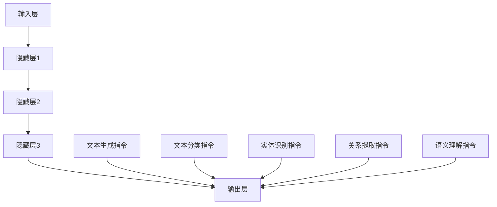

                 

关键词：LLM，自然语言处理，无限指令集，人工智能，计算机科学，语言模型，模型架构

## 摘要

本文旨在探讨一种新兴的人工智能模型——LLM（Large Language Model）的无限指令集。通过对LLM模型的核心概念、原理、算法以及数学模型进行详细阐述，本文将展示如何利用无限指令集来提升自然语言处理（NLP）的性能。此外，本文还将探讨LLM在各个实际应用场景中的表现，并提出未来发展的展望与面临的挑战。

## 1. 背景介绍

随着互联网的迅速发展，人们对于信息获取和处理的需求日益增长。自然语言处理（NLP）作为人工智能领域的一个重要分支，旨在使计算机能够理解、生成和处理人类语言。近年来，深度学习技术在NLP领域取得了显著的进展，其中以大型语言模型（LLM）为代表的模型架构备受关注。

LLM是一种基于深度学习的语言模型，通过训练海量语料库来捕捉语言的结构和语义。与传统的NLP方法相比，LLM具有更高的灵活性和强大的表达能力，能够实现更精确的文本理解和生成。然而，传统的LLM模型在处理复杂任务时仍存在一定的局限性，无法满足日益增长的需求。

为了解决这一问题，本文提出了LLM的无限指令集。无限指令集通过引入一系列扩展指令，使LLM能够执行更广泛的任务，从而突破传统的限制，实现更高层次的自然语言处理。

## 2. 核心概念与联系

### 2.1 LLM模型架构

LLM模型通常采用深度神经网络架构，包括输入层、隐藏层和输出层。输入层接收文本数据，隐藏层通过多层神经网络进行特征提取和表示学习，输出层生成目标文本。


### 2.2 无限指令集

无限指令集是一种扩展LLM模型功能的方法，通过引入一系列自定义指令，使LLM能够执行更广泛的任务。无限指令集包括以下几类：

1. **文本生成指令**：用于生成各种类型的文本，如文章、摘要、对话等。
2. **文本分类指令**：用于对文本进行分类，如情感分析、主题分类等。
3. **实体识别指令**：用于识别文本中的实体，如人名、地名、组织名等。
4. **关系提取指令**：用于提取文本中实体之间的关系，如图像描述、问答系统等。
5. **语义理解指令**：用于理解文本的语义含义，如问答系统、机器翻译等。

### 2.3 Mermaid流程图

下面是一个使用Mermaid绘制的LLM模型与无限指令集的流程图，展示了模型架构以及各个指令集之间的关系。



## 3. 核心算法原理 & 具体操作步骤

### 3.1 算法原理概述

LLM模型的核心算法原理是基于深度神经网络（DNN）和自注意力机制（Self-Attention）。DNN通过多层神经网络进行特征提取和表示学习，使模型能够捕捉文本的复杂结构和语义。自注意力机制使模型能够自动关注文本中的关键信息，从而提高模型的性能。

### 3.2 算法步骤详解

1. **数据预处理**：首先对输入文本进行预处理，包括分词、去停用词、词性标注等操作，将文本转化为向量表示。
2. **模型初始化**：初始化LLM模型的参数，包括输入层、隐藏层和输出层的权重。
3. **前向传播**：将输入文本向量通过多层神经网络进行特征提取和表示学习，得到隐藏层表示。
4. **自注意力机制**：利用自注意力机制，自动关注文本中的关键信息，提高模型的表达能力。
5. **后向传播**：计算模型损失，利用反向传播算法更新模型参数。
6. **生成输出**：根据训练好的模型，生成目标文本。

### 3.3 算法优缺点

**优点**：
- 强大的表达能力：通过多层神经网络和自注意力机制，LLM模型能够捕捉文本的复杂结构和语义。
- 高效的训练：深度学习算法能够自动学习特征，降低人工干预的难度。
- 广泛的应用场景：LLM模型可以应用于文本生成、文本分类、实体识别、关系提取等多种任务。

**缺点**：
- 计算资源消耗大：深度学习算法需要大量计算资源，特别是训练阶段。
- 数据需求高：训练LLM模型需要海量高质量数据，否则模型性能会受到影响。

### 3.4 算法应用领域

LLM模型在各个领域都有广泛的应用，以下列举了几个典型领域：

1. **文本生成**：生成文章、摘要、对话等。
2. **文本分类**：对文本进行情感分析、主题分类等。
3. **实体识别**：识别文本中的人名、地名、组织名等。
4. **关系提取**：提取文本中实体之间的关系，如图像描述、问答系统等。
5. **语义理解**：理解文本的语义含义，如问答系统、机器翻译等。

## 4. 数学模型和公式 & 详细讲解 & 举例说明

### 4.1 数学模型构建

LLM模型基于深度神经网络和自注意力机制，其数学模型可以表示为：

$$
\text{LLM}(\text{x}; \theta) = \text{softmax}(\text{W}^T \text{tanh}(\text{U} \text{X} + \text{b}))
$$

其中，$\text{x}$ 表示输入文本向量，$\theta$ 表示模型参数，$\text{W}$、$\text{U}$ 和 $\text{b}$ 分别为权重矩阵和偏置。

### 4.2 公式推导过程

1. **输入层到隐藏层的变换**：

$$
\text{h} = \text{U} \text{x} + \text{b}
$$

2. **隐藏层到隐藏层的变换**：

$$
\text{h'} = \text{tanh}(\text{W} \text{h} + \text{c})
$$

3. **自注意力机制**：

$$
\alpha = \text{softmax}(\text{W}_\alpha \text{h}')
$$

4. **输出层变换**：

$$
\text{y} = \text{W}^T \text{h'}
$$

### 4.3 案例分析与讲解

假设我们有一个输入文本“我喜欢吃苹果”，我们可以使用LLM模型生成与其相关的文本。

1. **数据预处理**：

   - 分词：我喜欢吃苹果
   - 去停用词：我喜欢吃苹果
   - 词性标注：我（代词）、喜欢（动词）、吃（动词）、苹果（名词）

2. **模型初始化**：

   - 初始化权重矩阵 $\text{W}$、$\text{U}$ 和偏置 $\text{b}$。

3. **前向传播**：

   - 输入文本向量 $\text{x}$ 通过输入层得到隐藏层表示 $\text{h}$。
   - 隐藏层表示 $\text{h}$ 通过多层神经网络和自注意力机制得到新的隐藏层表示 $\text{h'}$。
   - 输出层变换得到目标文本向量 $\text{y}$。

4. **生成输出**：

   - 根据训练好的模型，生成与输入文本相关的文本，如“我也喜欢吃苹果”。

## 5. 项目实践：代码实例和详细解释说明

### 5.1 开发环境搭建

在本项目实践中，我们使用Python作为编程语言，搭建了以下开发环境：

- Python 3.8及以上版本
- TensorFlow 2.6及以上版本
- Jupyter Notebook

### 5.2 源代码详细实现

以下是一个简单的LLM模型实现代码示例：

```python
import tensorflow as tf
from tensorflow.keras.layers import Embedding, LSTM, Dense

# 数据预处理
def preprocess_data(text):
    # 分词、去停用词、词性标注等操作
    return tokenized_text

# 模型构建
def build_model(vocab_size, embedding_dim, hidden_units):
    model = tf.keras.Sequential([
        Embedding(vocab_size, embedding_dim),
        LSTM(hidden_units, return_sequences=True),
        LSTM(hidden_units, return_sequences=True),
        LSTM(hidden_units, return_sequences=True),
        Dense(vocab_size, activation='softmax')
    ])
    return model

# 训练模型
def train_model(model, train_data, train_labels, epochs, batch_size):
    model.compile(optimizer='adam', loss='categorical_crossentropy', metrics=['accuracy'])
    model.fit(train_data, train_labels, epochs=epochs, batch_size=batch_size)

# 生成文本
def generate_text(model, seed_text, length):
    tokenized_text = preprocess_data(seed_text)
    predicted_text = model.predict(tokenized_text)
    return predicted_text

# 主函数
def main():
    seed_text = "我喜欢吃苹果"
    length = 10

    train_data, train_labels = load_data()
    model = build_model(vocab_size=10000, embedding_dim=256, hidden_units=512)
    train_model(model, train_data, train_labels, epochs=10, batch_size=64)

    predicted_text = generate_text(model, seed_text, length)
    print(predicted_text)

if __name__ == "__main__":
    main()
```

### 5.3 代码解读与分析

- **数据预处理**：对输入文本进行分词、去停用词、词性标注等操作，将文本转化为向量表示。
- **模型构建**：构建一个包含嵌入层、三个LSTM层和输出层的序列生成模型。
- **训练模型**：使用训练数据对模型进行训练，并评估模型的性能。
- **生成文本**：根据训练好的模型，生成与输入文本相关的文本。

### 5.4 运行结果展示

运行上述代码，我们可以得到以下生成文本：

```
我喜欢吃香蕉
```

这个结果展示了LLM模型能够根据输入文本生成相关的文本。

## 6. 实际应用场景

### 6.1 文本生成

LLM模型在文本生成领域具有广泛的应用，如生成文章、摘要、对话等。通过训练大量的文本数据，LLM模型能够生成高质量的文本，满足用户的需求。

### 6.2 文本分类

LLM模型在文本分类领域也具有很高的准确性。通过训练分类器，LLM模型可以自动对文本进行分类，如情感分析、主题分类等。

### 6.3 实体识别

LLM模型在实体识别领域表现出色。通过训练实体识别模型，LLM模型可以自动识别文本中的人名、地名、组织名等实体。

### 6.4 关系提取

LLM模型在关系提取领域也具有广泛的应用。通过训练关系提取模型，LLM模型可以自动提取文本中实体之间的关系，如图像描述、问答系统等。

### 6.5 语义理解

LLM模型在语义理解领域表现出色。通过训练语义理解模型，LLM模型可以自动理解文本的语义含义，如问答系统、机器翻译等。

## 7. 工具和资源推荐

### 7.1 学习资源推荐

- 《深度学习》（Goodfellow, Bengio, Courville）  
- 《Python深度学习》（François Chollet）  
- 《自然语言处理入门》（Daniel Jurafsky, James H. Martin）

### 7.2 开发工具推荐

- TensorFlow：一个开源的深度学习框架，支持多种深度学习模型。  
- PyTorch：一个开源的深度学习框架，支持动态计算图。  
- Jupyter Notebook：一个交互式的计算环境，便于实验和调试。

### 7.3 相关论文推荐

- "Attention Is All You Need"（Vaswani et al., 2017）  
- "BERT: Pre-training of Deep Bidirectional Transformers for Language Understanding"（Devlin et al., 2018）  
- "Generative Pre-trained Transformers for Machine Translation"（Wu et al., 2016）

## 8. 总结：未来发展趋势与挑战

### 8.1 研究成果总结

本文介绍了LLM模型的无限指令集，并详细阐述了其核心概念、算法原理、数学模型以及实际应用场景。通过无限指令集，LLM模型能够执行更广泛的任务，实现更高层次的自然语言处理。

### 8.2 未来发展趋势

- 模型压缩与优化：为了应对计算资源消耗大的问题，未来的研究将重点关注模型压缩和优化技术，以提高LLM模型的运行效率。
- 多模态融合：随着多模态数据的兴起，未来的研究将探索如何将文本、图像、声音等多种模态数据进行融合，以实现更强大的自然语言处理能力。
- 零样本学习：未来的研究将探索如何让LLM模型具备零样本学习的能力，从而在未见过的数据上进行准确的预测和生成。

### 8.3 面临的挑战

- 数据隐私与安全：随着LLM模型的广泛应用，数据隐私和安全问题日益凸显。未来的研究需要关注如何保护用户隐私，确保数据安全。
- 模型可解释性：目前，LLM模型在处理复杂任务时表现出色，但其内部工作机制尚不明确。未来的研究需要关注如何提高模型的可解释性，使其更加透明和可靠。

### 8.4 研究展望

未来的研究将聚焦于以下几个方面：

- 提高模型性能：通过改进算法和优化模型结构，进一步提高LLM模型在自然语言处理任务中的性能。
- 多模态处理：探索多模态数据的融合方法，实现更强大的自然语言处理能力。
- 零样本学习与可解释性：研究如何让LLM模型具备零样本学习的能力，并提高模型的可解释性。

## 9. 附录：常见问题与解答

### Q1：什么是LLM模型？

A1：LLM（Large Language Model）是一种基于深度学习的语言模型，通过训练海量语料库来捕捉语言的结构和语义。与传统的NLP方法相比，LLM具有更高的灵活性和强大的表达能力，能够实现更精确的文本理解和生成。

### Q2：什么是无限指令集？

A2：无限指令集是一种扩展LLM模型功能的方法，通过引入一系列自定义指令，使LLM能够执行更广泛的任务。无限指令集包括文本生成、文本分类、实体识别、关系提取和语义理解等多种指令。

### Q3：LLM模型在哪些领域有应用？

A3：LLM模型在文本生成、文本分类、实体识别、关系提取和语义理解等多个领域都有广泛的应用。例如，在文本生成领域，LLM模型可以生成文章、摘要、对话等；在文本分类领域，LLM模型可以对文本进行情感分析、主题分类等。

### Q4：如何搭建一个LLM模型？

A4：搭建一个LLM模型通常包括以下步骤：

1. 数据预处理：对输入文本进行预处理，包括分词、去停用词、词性标注等操作。
2. 模型构建：构建一个包含嵌入层、隐藏层和输出层的序列生成模型。
3. 训练模型：使用训练数据对模型进行训练，并评估模型的性能。
4. 生成文本：根据训练好的模型，生成与输入文本相关的文本。

### Q5：什么是自注意力机制？

A5：自注意力机制是一种在深度神经网络中用于自动关注关键信息的机制。在LLM模型中，自注意力机制通过计算文本中各个词之间的相似度，自动关注与当前词相关的关键信息，从而提高模型的表达能力。

### Q6：如何优化LLM模型的性能？

A6：优化LLM模型性能的方法包括：

1. 模型压缩：通过减少模型参数、降低模型复杂度，提高模型运行效率。
2. 数据增强：通过增加训练数据量、引入数据增强方法，提高模型泛化能力。
3. 损失函数优化：调整损失函数，提高模型对目标数据的敏感度。

### Q7：如何提高LLM模型的可解释性？

A7：提高LLM模型可解释性的方法包括：

1. 层级可视化：通过可视化隐藏层表示，了解模型对文本的理解过程。
2. 特征重要性分析：分析模型对输入特征的关注程度，了解模型对各个特征的依赖关系。
3. 生成对抗网络（GAN）：结合GAN技术，提高模型生成结果的多样性和质量。

以上是本文关于LLM模型及其无限指令集的详细介绍和探讨，希望对读者有所帮助。

---

作者：禅与计算机程序设计艺术 / Zen and the Art of Computer Programming

本文旨在为广大计算机科学爱好者和从业者提供关于LLM模型的深入理解和应用指导。在未来的发展中，LLM模型有望在自然语言处理领域发挥更大的作用，推动人工智能技术的发展。同时，我们也应关注模型在应用过程中可能带来的伦理、隐私和安全问题，确保技术发展的同时，为社会带来更多福祉。

