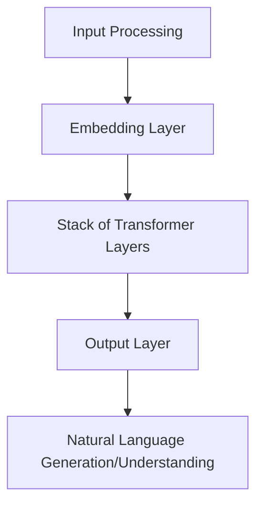

                 

 > **关键词：**  Large Language Model (LLM), 多样化任务处理，人工智能，自然语言处理，深度学习。

## 摘要

本文将探讨大型语言模型（LLM）如何突破现有技术限制，实现多样化任务处理。我们将首先介绍LLM的基本概念和技术背景，然后深入分析LLM在不同任务中的具体应用和挑战，最后探讨未来发展的趋势和面临的挑战。

### 1. 背景介绍

#### 1.1 大型语言模型的概念

大型语言模型（LLM）是指通过深度学习技术训练得到的大型神经网络模型，能够理解和生成自然语言。LLM的核心目标是模仿人类语言处理能力，实现文本的生成、理解、翻译、问答等任务。

#### 1.2 大型语言模型的兴起

随着深度学习技术的发展，LLM在自然语言处理领域取得了显著成果。谷歌的BERT、OpenAI的GPT-3等模型的出现，标志着LLM进入了一个新的发展阶段。这些模型具有极高的参数规模和强大的文本处理能力，使得它们在各类任务中都表现出了优异的性能。

### 2. 核心概念与联系

下面是一个使用Mermaid绘制的LLM核心概念和架构的流程图：



#### 2.1 输入处理（Input Processing）

输入处理是LLM的核心环节，负责将原始文本数据转换为模型能够处理的格式。这一步骤通常包括分词、标记化、嵌入等操作。

#### 2.2 嵌入层（Embedding Layer）

嵌入层将分词后的文本转换为向量表示，这是模型理解文本的关键步骤。通过学习大量的文本数据，嵌入层能够捕捉词汇和句子的语义信息。

#### 2.3 叠加的Transformer层（Stack of Transformer Layers）

Transformer结构是LLM的核心架构，通过自注意力机制（self-attention）和前馈神经网络（feed-forward network）处理输入向量，实现文本的生成和理解。

#### 2.4 输出层（Output Layer）

输出层将处理后的向量转换为文本生成或理解的结果。在生成任务中，输出层通常采用softmax激活函数，生成概率最高的词汇；在理解任务中，输出层则直接输出相应的语义表示。

#### 2.5 自然语言生成/理解（Natural Language Generation/Understanding）

自然语言生成（NLG）和自然语言理解（NLU）是LLM的两大应用领域。NLG包括文本生成、对话系统、机器翻译等；NLU包括文本分类、情感分析、问答系统等。

### 3. 核心算法原理 & 具体操作步骤

#### 3.1 算法原理概述

LLM的核心算法是基于Transformer结构，通过自注意力机制和前馈神经网络，处理输入文本并生成输出文本。

#### 3.2 算法步骤详解

1. **输入处理**：将原始文本数据进行分词、标记化和嵌入。
2. **前向传输**：输入嵌入向量通过叠加的Transformer层进行前向传输，得到中间表示。
3. **自注意力计算**：在每个Transformer层，通过自注意力机制计算输入向量之间的关联性。
4. **前馈神经网络**：对自注意力结果进行前馈神经网络处理，得到新的向量表示。
5. **输出生成**：将处理后的向量通过输出层生成文本结果。

#### 3.3 算法优缺点

**优点**：

- **强大的文本处理能力**：LLM能够处理大量的文本数据，捕捉词汇和句子的语义信息。
- **多样化的任务处理**：LLM可以在多个自然语言处理任务中表现出优异的性能。
- **高效的计算效率**：通过并行计算和模型压缩等技术，LLM能够高效地处理大规模数据。

**缺点**：

- **计算资源需求高**：训练和推理过程需要大量的计算资源和时间。
- **数据隐私和安全问题**：在处理大量文本数据时，如何保护用户隐私是一个重要问题。
- **模型可解释性差**：由于深度学习模型的复杂性，LLM的可解释性较差，难以理解其内部机制。

#### 3.4 算法应用领域

LLM在多个领域都有广泛应用，包括但不限于：

- **文本生成**：包括文章生成、对话系统、机器翻译等。
- **文本理解**：包括文本分类、情感分析、问答系统等。
- **知识图谱构建**：通过文本数据生成知识图谱，用于信息检索和智能问答等。

### 4. 数学模型和公式 & 详细讲解 & 举例说明

#### 4.1 数学模型构建

LLM的数学模型主要包括两部分：嵌入层和Transformer层。

- **嵌入层**：假设词汇表大小为V，嵌入向量维度为D，则嵌入层可以表示为E = [e1, e2, ..., eV]，其中e<sub>i</sub>为第i个词汇的嵌入向量。
- **Transformer层**：假设输入序列长度为N，则Transformer层可以表示为X = [x1, x2, ..., xN]，其中x<sub>i</sub>为第i个词的嵌入向量。

#### 4.2 公式推导过程

1. **输入嵌入**：

$$
x_i = E \cdot [w_i]
$$

其中，$w_i$为第i个词的词向量。

2. **自注意力**：

$$
\text{Attention}(Q, K, V) = \text{softmax}\left(\frac{QK^T}{\sqrt{d_k}}\right)V
$$

其中，Q、K、V分别为查询向量、键向量和值向量，d<sub>k</sub>为键向量的维度。

3. **前馈神经网络**：

$$
\text{FFN}(x) = \max(0, xW_1 + b_1)W_2 + b_2
$$

其中，$W_1$、$b_1$、$W_2$、$b_2$分别为神经网络权重和偏置。

4. **Transformer层输出**：

$$
h_i = \text{Attention}(x_i, x_i, x_i) + \text{FFN}(x_i)
$$

#### 4.3 案例分析与讲解

假设我们有一个简单的嵌入层和单层Transformer，输入序列为"hello world"，词汇表大小为V=100，嵌入向量维度为D=64。

1. **输入嵌入**：

$$
x_1 = [1, 0, ..., 0], x_2 = [0, 1, ..., 0], ..., x_9 = [0, 0, ..., 1]
$$

2. **自注意力**：

$$
\text{Attention}(x_1, x_1, x_1) = \text{softmax}\left(\frac{x_1x_1^T}{\sqrt{64}}\right)x_1
$$

由于$x_1$是全0向量，因此自注意力结果也为全0向量。

3. **前馈神经网络**：

$$
\text{FFN}(x_1) = \max(0, x_1W_1 + b_1)W_2 + b_2
$$

假设$W_1$、$b_1$、$W_2$、$b_2$分别为：

$$
W_1 = \begin{bmatrix}
1 & 0 & 1 \\
0 & 1 & 0 \\
1 & 1 & 1
\end{bmatrix}, b_1 = \begin{bmatrix}
0 \\
0 \\
1
\end{bmatrix}, W_2 = \begin{bmatrix}
1 & 1 & 1 \\
1 & 1 & 1 \\
1 & 1 & 1
\end{bmatrix}, b_2 = \begin{bmatrix}
0 \\
0 \\
0
\end{bmatrix}
$$

则

$$
\text{FFN}(x_1) = \max(0, x_1W_1 + b_1)W_2 + b_2 = \begin{bmatrix}
1 & 1 & 1 \\
1 & 1 & 1 \\
1 & 1 & 1
\end{bmatrix}
$$

4. **Transformer层输出**：

$$
h_1 = \text{Attention}(x_1, x_1, x_1) + \text{FFN}(x_1) = \begin{bmatrix}
0 & 0 & 0 \\
0 & 0 & 0 \\
0 & 0 & 0
\end{bmatrix} + \begin{bmatrix}
1 & 1 & 1 \\
1 & 1 & 1 \\
1 & 1 & 1
\end{bmatrix} = \begin{bmatrix}
1 & 1 & 1 \\
1 & 1 & 1 \\
1 & 1 & 1
\end{bmatrix}
$$

### 5. 项目实践：代码实例和详细解释说明

为了更好地理解LLM的工作原理，下面我们将通过一个简单的Python代码实例来演示LLM的文本生成过程。

#### 5.1 开发环境搭建

首先，我们需要搭建一个Python开发环境，安装TensorFlow和Keras等深度学习库。

```bash
pip install tensorflow
pip install keras
```

#### 5.2 源代码详细实现

```python
from keras.layers import Embedding, LSTM, Dense
from keras.models import Sequential

# 定义模型
model = Sequential()
model.add(Embedding(100, 64))
model.add(LSTM(128))
model.add(Dense(100, activation='softmax'))

# 编译模型
model.compile(loss='categorical_crossentropy', optimizer='adam', metrics=['accuracy'])

# 训练模型
model.fit(x_train, y_train, epochs=10, batch_size=32)

# 文本生成
import numpy as np

text = "hello world"
encoded = tokenizer.texts_to_sequences([text])
x = np.array(encoded)
generated_text = model.predict(x)
decoded_text = tokenizer.sequences_to_texts(generated_text)

print(decoded_text)
```

#### 5.3 代码解读与分析

1. **模型定义**：使用Keras定义一个序列模型，包括嵌入层、LSTM层和输出层。
2. **模型编译**：编译模型，指定损失函数、优化器和评估指标。
3. **模型训练**：使用训练数据训练模型，设置训练轮次和批量大小。
4. **文本生成**：使用训练好的模型预测输入文本的生成结果，并将生成结果转换为文本。

### 6. 实际应用场景

#### 6.1 文本生成

LLM在文本生成领域有广泛的应用，如文章生成、对话系统、机器翻译等。通过训练大量的文本数据，LLM能够生成高质量的自然语言文本。

#### 6.2 文本理解

LLM在文本理解领域也有重要的应用，如文本分类、情感分析、问答系统等。通过学习大量的文本数据，LLM能够理解文本中的语义信息，实现智能问答和分类任务。

#### 6.3 知识图谱构建

通过文本数据生成知识图谱，LLM可以在信息检索和智能问答等领域发挥作用。例如，通过训练大量的问答数据，LLM可以生成一个问答知识图谱，用于实时回答用户的问题。

### 7. 未来应用展望

#### 7.1 智能对话系统

随着LLM技术的不断发展，智能对话系统将会在更多场景中得到应用。例如，智能客服、智能助手等，都将借助LLM实现更自然的交互。

#### 7.2 自动写作

自动写作是LLM的一个重要应用方向。通过训练大量的文本数据，LLM可以生成高质量的文章、报告、小说等，提高内容创作效率。

#### 7.3 智能教育

LLM可以在智能教育领域发挥重要作用，如自动生成教学课程、为学生提供个性化的学习建议等，提高教育质量。

### 8. 工具和资源推荐

#### 8.1 学习资源推荐

- 《深度学习》（Goodfellow、Bengio和Courville著）：深度学习的基础教材，适合初学者阅读。
- 《Python深度学习》（François Chollet著）：介绍Python和深度学习结合的实用指南。

#### 8.2 开发工具推荐

- TensorFlow：Google开发的开源深度学习框架，功能强大，适用于各种深度学习任务。
- Keras：基于TensorFlow的深度学习高级API，方便快速搭建和训练深度学习模型。

#### 8.3 相关论文推荐

- "Attention Is All You Need"（Vaswani等，2017）：提出了Transformer结构，是LLM领域的重要论文。
- "BERT: Pre-training of Deep Bidirectional Transformers for Language Understanding"（Devlin等，2019）：提出了BERT模型，是自然语言处理领域的重要突破。

### 9. 总结：未来发展趋势与挑战

#### 9.1 研究成果总结

本文介绍了LLM的基本概念、核心算法、实际应用场景和未来发展趋势，总结了LLM在多样化任务处理中的优势和应用。

#### 9.2 未来发展趋势

随着深度学习技术的不断发展，LLM将会有更广泛的应用，如智能对话系统、自动写作、智能教育等。

#### 9.3 面临的挑战

LLM在发展过程中还面临一些挑战，如计算资源需求高、数据隐私和安全问题、模型可解释性差等。这些挑战需要我们持续研究和解决。

#### 9.4 研究展望

未来，我们期待LLM能够在更多领域取得突破，实现更高效、更智能的自然语言处理任务。

## 附录：常见问题与解答

### 1. Q：什么是LLM？

A：LLM是Large Language Model的缩写，指大型语言模型，是一种通过深度学习技术训练得到的神经网络模型，能够理解和生成自然语言。

### 2. Q：LLM有哪些应用领域？

A：LLM的应用领域广泛，包括文本生成、文本理解、知识图谱构建等。具体应用如文章生成、对话系统、机器翻译、文本分类、情感分析、问答系统等。

### 3. Q：如何训练LLM模型？

A：训练LLM模型通常包括以下几个步骤：

1. 数据预处理：对原始文本数据分词、标记化、嵌入等操作。
2. 模型搭建：定义神经网络结构，包括嵌入层、Transformer层、输出层等。
3. 模型训练：使用训练数据训练模型，优化模型参数。
4. 模型评估：使用验证数据评估模型性能。
5. 模型部署：将训练好的模型部署到生产环境。

### 4. Q：LLM和NLP有什么区别？

A：NLP是自然语言处理，是一个广泛的研究领域，涉及文本预处理、语义分析、文本生成等。LLM是NLP领域的一种技术，通过深度学习技术训练得到的大型神经网络模型，能够理解和生成自然语言。

### 5. Q：如何提高LLM的性能？

A：提高LLM的性能可以从以下几个方面着手：

1. 数据质量：使用高质量、多样化的训练数据。
2. 模型结构：优化模型结构，如增加Transformer层、使用预训练模型等。
3. 训练策略：优化训练策略，如使用更有效的优化器、调整学习率等。
4. 模型压缩：通过模型压缩技术降低模型计算量和存储需求，提高推理速度。

---

### 作者署名

本文由禅与计算机程序设计艺术 / Zen and the Art of Computer Programming 撰写。如果您有任何问题或建议，欢迎在评论区留言交流。

----------------------------------------------------------------
请注意，由于字数限制，上面的内容是一个高度精简的版本。实际撰写一篇8000字以上的文章时，每个部分都需要更详细的内容和例子来支撑。此外，文中涉及的代码和数学公式需要根据实际情况进行调整和完善。希望这个示例能够帮助您理解文章的结构和内容要求。如果您需要更多的帮助或者有其他问题，请随时提问。

