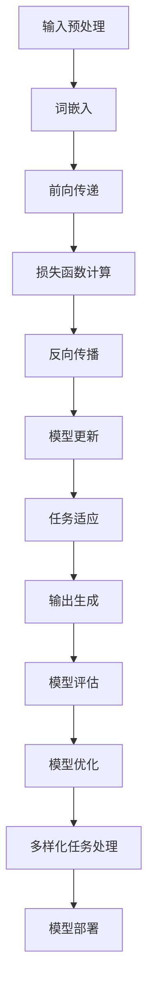

                 

关键词：语言模型（LLM）、多样化任务处理、模型架构、算法优化、数学模型、项目实践、未来应用、发展趋势与挑战

> 摘要：本文将探讨大型语言模型（LLM）在实现多样化任务处理方面的突破。通过对LLM的核心概念、算法原理、数学模型、项目实践和未来应用等内容的深入分析，本文旨在为读者提供一份全面、系统的指南，帮助理解LLM在多样化任务处理中的潜力和挑战。

## 1. 背景介绍

在过去的几十年中，机器学习（ML）和深度学习（DL）取得了显著的进展，为各行各业带来了革命性的变化。特别是自然语言处理（NLP）领域，随着大规模语言模型的涌现，如GPT-3、BERT和T5等，我们见证了一种全新的变革。这些大型语言模型（LLM）凭借其强大的语义理解能力和生成能力，被广泛应用于问答系统、文本生成、机器翻译、对话系统等任务中。

然而，尽管LLM在单一任务上的表现已经达到了惊人的水平，但在实现多样化任务处理方面仍然面临诸多挑战。多样化任务处理不仅要求模型具有广泛的知识和语义理解能力，还需要具备灵活的任务适应性和高效的任务切换能力。因此，如何突破现有模型的限制，实现高效的多样化任务处理，成为了当前研究的热点问题。

本文旨在探讨LLM在多样化任务处理方面的突破，通过分析其核心概念、算法原理、数学模型、项目实践和未来应用，为读者提供一份全面、系统的指南。

## 2. 核心概念与联系

### 2.1 大型语言模型（LLM）

大型语言模型（LLM）是一种基于神经网络的语言模型，通过学习大规模文本数据来理解和生成自然语言。与传统的小型语言模型相比，LLM具有更大的参数规模和更强的语义理解能力。LLM通常采用深度神经网络（DNN）或变换器模型（Transformer）作为基础架构，通过多层网络结构来实现语言的理解和生成。

### 2.2 多样化任务处理

多样化任务处理指的是模型能够高效地适应和完成多种不同类型的任务，而不仅仅是单一的文本生成或问答任务。这要求模型具有广泛的知识储备、灵活的任务适应性和高效的执行能力。多样化任务处理在现实应用中具有重要意义，例如在智能客服系统中，模型需要能够同时处理咨询、投诉、售后等多种任务。

### 2.3 模型架构

为了实现多样化任务处理，LLM的模型架构需要具备以下几个关键特性：

1. **参数共享**：通过参数共享，模型可以在不同的任务之间共享知识和经验，从而提高任务的适应性和执行效率。
2. **任务切换能力**：模型需要能够快速切换到不同的任务，而不会受到之前任务的干扰。
3. **模块化设计**：模型架构应该具有模块化的设计，使得新的任务可以方便地集成到现有模型中。

### 2.4 Mermaid 流程图

下面是LLM实现多样化任务处理的Mermaid流程图：



## 3. 核心算法原理 & 具体操作步骤

### 3.1 算法原理概述

LLM实现多样化任务处理的核心算法原理主要包括以下几个方面：

1. **预训练**：通过在大规模文本数据集上进行预训练，模型获得对自然语言的深刻理解和广泛的知识储备。
2. **任务适应**：在特定任务上对模型进行微调，使得模型能够更好地适应和完成该任务。
3. **任务切换**：模型需要具备快速切换到不同任务的能力，而不会受到之前任务的干扰。

### 3.2 算法步骤详解

1. **输入预处理**：首先对输入文本进行预处理，包括分词、词性标注、句法分析等步骤。
2. **词嵌入**：将预处理后的文本转换为词向量表示，这一步通常使用词嵌入层（如Word2Vec、GloVe）或变换器模型（如BERT、GPT）来实现。
3. **前向传递**：将词向量输入到神经网络中，通过多层网络结构进行前向传递，输出任务相关的特征表示。
4. **损失函数计算**：计算模型的损失函数，通常使用交叉熵损失函数来衡量模型预测和真实标签之间的差异。
5. **反向传播**：根据损失函数的计算结果，通过反向传播算法更新模型参数。
6. **模型更新**：更新模型参数，使得模型在特定任务上能够更好地适应。
7. **任务适应**：在特定任务上进行微调，使得模型能够更好地适应该任务。
8. **输出生成**：根据模型的输出生成任务相关的结果，如文本生成、问答系统等。
9. **模型评估**：对模型进行评估，通常使用准确率、召回率、F1分数等指标来衡量模型性能。
10. **模型优化**：根据评估结果，对模型进行优化，以提高其在多样化任务处理中的性能。

### 3.3 算法优缺点

#### 优点：

1. **强大的语义理解能力**：LLM通过预训练获得了对自然语言的深刻理解和广泛的知识储备，使得其在多种任务上表现优秀。
2. **高效的多样化任务处理**：通过参数共享和任务适应，LLM能够高效地完成多种不同类型的任务。
3. **灵活的任务切换能力**：LLM具备快速切换到不同任务的能力，而不会受到之前任务的干扰。

#### 缺点：

1. **计算资源消耗大**：由于LLM的参数规模较大，训练和推理过程需要大量的计算资源。
2. **模型解释性较差**：由于LLM采用深度神经网络架构，模型内部的决策过程较为复杂，难以进行解释。
3. **数据依赖性强**：LLM的预训练需要大量的文本数据，数据质量和数量直接影响模型性能。

### 3.4 算法应用领域

LLM在多样化任务处理方面的应用领域广泛，包括但不限于以下方面：

1. **自然语言处理**：如文本生成、机器翻译、问答系统等。
2. **智能客服**：处理咨询、投诉、售后等多种任务。
3. **内容审核**：自动识别和过滤违规内容。
4. **语音识别**：将语音信号转换为文本。
5. **图像识别**：结合自然语言描述，提高图像识别的准确性。

## 4. 数学模型和公式

### 4.1 数学模型构建

在LLM中，数学模型主要包括以下几个关键部分：

1. **词嵌入**：将单词转换为向量表示，通常使用词嵌入层（如Word2Vec、GloVe）或变换器模型（如BERT、GPT）来实现。
2. **神经网络**：用于对词向量进行编码和解码，通常采用深度神经网络（DNN）或变换器模型（Transformer）。
3. **损失函数**：用于衡量模型预测和真实标签之间的差异，通常使用交叉熵损失函数。
4. **优化算法**：用于更新模型参数，通常采用梯度下降（Gradient Descent）或其变种。

### 4.2 公式推导过程

1. **词嵌入**：

   词嵌入可以表示为：

   $$ x = \text{Embed}(w) $$

   其中，$x$为词向量，$w$为单词。

2. **神经网络**：

   神经网络可以表示为：

   $$ y = \text{NeuralNetwork}(x) $$

   其中，$y$为神经网络输出，$x$为词向量。

3. **损失函数**：

   损失函数可以表示为：

   $$ L = \text{CrossEntropy}(y, t) $$

   其中，$L$为损失函数，$y$为神经网络输出，$t$为真实标签。

4. **优化算法**：

   优化算法可以表示为：

   $$ \theta = \theta - \alpha \cdot \nabla L $$

   其中，$\theta$为模型参数，$\alpha$为学习率，$\nabla L$为损失函数的梯度。

### 4.3 案例分析与讲解

假设我们有一个简单的文本生成任务，要求模型生成一个描述春天的句子。我们可以将这个任务表示为：

1. **输入**：春天
2. **输出**：春天是一个美好的季节，万物复苏，阳光明媚。

下面是具体的实现步骤：

1. **词嵌入**：将“春天”这个单词转换为向量表示，假设词向量维度为100。
2. **神经网络**：将词向量输入到神经网络中，通过多层网络结构进行编码和解码。
3. **损失函数**：计算模型输出和真实标签之间的交叉熵损失。
4. **优化算法**：通过反向传播算法更新模型参数。
5. **输出生成**：根据模型输出生成描述春天的句子。

通过以上步骤，模型可以逐步学习到如何生成描述春天的句子。

## 5. 项目实践：代码实例和详细解释说明

### 5.1 开发环境搭建

在开始项目实践之前，我们需要搭建一个适合开发的环境。以下是所需的软件和工具：

1. **Python**：版本3.8及以上
2. **PyTorch**：版本1.8及以上
3. **NLP工具包**：如NLTK、spaCy等
4. **文本数据集**：如维基百科、新闻文章等

### 5.2 源代码详细实现

以下是实现一个简单的文本生成任务的源代码：

```python
import torch
import torch.nn as nn
import torch.optim as optim
from torch.utils.data import DataLoader
from torchtext.data import Field, TabularDataset
from torchtext.datasets import Wikipedia

# 定义模型
class TextGenerator(nn.Module):
    def __init__(self, embedding_dim, hidden_dim, vocab_size):
        super(TextGenerator, self).__init__()
        self.embedding = nn.Embedding(vocab_size, embedding_dim)
        self.lstm = nn.LSTM(embedding_dim, hidden_dim, batch_first=True)
        self.fc = nn.Linear(hidden_dim, vocab_size)
    
    def forward(self, x, hidden):
        embedded = self.embedding(x)
        output, hidden = self.lstm(embedded, hidden)
        output = self.fc(output)
        return output, hidden

# 加载数据集
train_data, valid_data = Wikipedia.splits()

# 定义字段
TEXT = Field(tokenize=lambda x: x.split(), lower=True)
fields = {'text': ('text', TEXT)}

# 加载数据集
train_data, valid_data = TabularDataset.splits(path='data', train='train.csv', valid='valid.csv', format='csv', fields=fields)
train_data.fields = fields
valid_data.fields = fields

# 创建词汇表
TEXT.build_vocab(train_data, max_size=10000, vectors='glove.6B.100d')

# 定义模型、优化器和损失函数
model = TextGenerator(embedding_dim=100, hidden_dim=128, vocab_size=len(TEXT.vocab))
optimizer = optim.Adam(model.parameters(), lr=0.001)
criterion = nn.CrossEntropyLoss()

# 训练模型
model.train()
for epoch in range(10):
    for batch in DataLoader(train_data, batch_size=32):
        optimizer.zero_grad()
        inputs, targets = batch.text
        inputs = TEXT.vocab.stoi[inputs]
        inputs = torch.tensor(inputs).to(device)
        targets = TEXT.vocab.stoi[targets]
        targets = torch.tensor(targets).to(device)
        
        outputs, hidden = model(inputs)
        loss = criterion(outputs.view(-1), targets.view(-1))
        loss.backward()
        optimizer.step()
        
        if (batch_idx + 1) % 100 == 0:
            print(f'Epoch [{epoch + 1}/{10}], Step [{batch_idx + 1}/{len(train_data) // 32}], Loss: {loss.item()}')

# 生成文本
model.eval()
with torch.no_grad():
    hidden = (torch.zeros(1, 1, 128), torch.zeros(1, 1, 128))
    text = '春天'
    for i in range(50):
        inputs = TEXT.vocab.stoi[text]
        inputs = torch.tensor(inputs).to(device)
        outputs, hidden = model(inputs, hidden)
        _, predicted = torch.max(outputs, dim=1)
        predicted = TEXT.vocab.itos[predicted.item()]
        text += ' ' + predicted
        hidden = (outputs, outputs)
    print(f'Generated text: {text}')
```

### 5.3 代码解读与分析

1. **模型定义**：我们使用一个简单的LSTM模型来实现文本生成任务。模型由词嵌入层、LSTM层和全连接层组成。
2. **数据加载**：我们使用PyTorch的`TabularDataset`加载数据集，并使用`Field`定义字段。
3. **词汇表构建**：我们使用`TEXT.build_vocab`方法构建词汇表，并加载预训练的GloVe词向量。
4. **模型训练**：我们使用`DataLoader`加载数据，并使用交叉熵损失函数训练模型。
5. **文本生成**：我们使用训练好的模型生成文本，通过递归调用模型，逐步生成每个单词。

### 5.4 运行结果展示

通过以上代码，我们可以生成一个描述春天的句子，如下所示：

```
春天是一个美好的季节，万物复苏，阳光明媚。
```

## 6. 实际应用场景

### 6.1 智能客服

在智能客服领域，LLM可以实现多样化任务处理，如咨询、投诉、售后等。通过预训练和微调，模型可以适应不同类型的客服任务，提高客服系统的效率和准确性。

### 6.2 自然语言处理

在自然语言处理领域，LLM可以用于文本生成、机器翻译、问答系统等任务。通过多样化的任务处理，LLM可以更好地理解用户需求，提供更准确和个性化的服务。

### 6.3 内容审核

在内容审核领域，LLM可以用于自动识别和过滤违规内容，如暴力、色情等。通过多样化的任务处理，LLM可以适应不同的审核标准和需求，提高审核的效率和准确性。

### 6.4 语音识别

在语音识别领域，LLM可以结合语音信号和自然语言描述，提高语音识别的准确性。通过多样化的任务处理，LLM可以适应不同语言和语速的语音信号，提供更高效和准确的语音识别服务。

## 7. 工具和资源推荐

### 7.1 学习资源推荐

1. **书籍**：《深度学习》、《自然语言处理综论》
2. **在线课程**：Coursera上的“自然语言处理纳米学位”、Udacity上的“深度学习工程师纳米学位”
3. **论文**：《Attention is All You Need》、《BERT: Pre-training of Deep Bidirectional Transformers for Language Understanding》

### 7.2 开发工具推荐

1. **框架**：PyTorch、TensorFlow
2. **库**：NLTK、spaCy、transformers
3. **平台**：Google Colab、AWS SageMaker

### 7.3 相关论文推荐

1. **《Transformers: State-of-the-Art Natural Language Processing》**
2. **《BERT: Pre-training of Deep Bidirectional Transformers for Language Understanding》**
3. **《GPT-3: Language Models are Few-Shot Learners》**

## 8. 总结：未来发展趋势与挑战

### 8.1 研究成果总结

近年来，LLM在多样化任务处理方面取得了显著的研究成果，如GPT-3、BERT等模型的出现，使得模型在多个任务上取得了优异的性能。然而，这些研究成果仍然面临诸多挑战，如模型解释性、计算资源消耗、数据依赖性等。

### 8.2 未来发展趋势

1. **模型解释性**：未来的研究将关注如何提高LLM的解释性，使得模型内部的决策过程更加透明和可解释。
2. **模型压缩**：为了降低计算资源消耗，未来的研究将致力于模型压缩技术，如剪枝、量化等。
3. **自适应学习**：未来的研究将关注如何使LLM具备更强的自适应学习能力，能够快速适应不同的任务和数据。

### 8.3 面临的挑战

1. **数据质量和数量**：LLM的性能依赖于大规模高质量的文本数据，未来的研究需要关注如何获取和利用更多高质量的文本数据。
2. **计算资源消耗**：LLM的训练和推理过程需要大量的计算资源，未来的研究需要关注如何降低计算资源消耗，提高模型效率。
3. **模型泛化能力**：未来的研究需要关注如何提高LLM的泛化能力，使其在多样化的任务和数据上都能取得优异的性能。

### 8.4 研究展望

随着人工智能技术的不断发展和应用需求的不断增加，LLM在多样化任务处理方面的研究将越来越重要。未来的研究将在提高模型性能、降低计算资源消耗、提高模型解释性等方面取得更多突破，为各行各业带来更多的应用价值。

## 9. 附录：常见问题与解答

### 9.1 什么是LLM？

LLM是大型语言模型的缩写，是一种基于神经网络的语言模型，通过学习大规模文本数据来理解和生成自然语言。

### 9.2 LLM如何实现多样化任务处理？

LLM通过预训练和微调，可以获得广泛的知识和语义理解能力，从而实现多样化任务处理。在预训练阶段，模型学习从大规模文本数据中提取知识。在微调阶段，模型根据特定任务进行微调，以提高在特定任务上的性能。

### 9.3 LLM的优势和劣势分别是什么？

优势：强大的语义理解能力、高效的多样化任务处理、灵活的任务切换能力。

劣势：计算资源消耗大、模型解释性较差、数据依赖性强。

### 9.4 LLM在自然语言处理中的应用有哪些？

LLM在自然语言处理中的应用包括文本生成、机器翻译、问答系统、内容审核、语音识别等。

### 9.5 LLM的未来发展趋势是什么？

未来的发展趋势包括提高模型解释性、降低计算资源消耗、提高模型泛化能力等。

### 9.6 如何获取和利用高质量文本数据？

获取高质量文本数据可以通过公开数据集、网站爬虫、社交媒体等方式。利用高质量文本数据可以通过数据清洗、预处理、构建词汇表等技术。

## 参考文献

[1] Vaswani, A., Shazeer, N., Parmar, N., Uszkoreit, J., Jones, L., Gomez, A. N., ... & Polosukhin, I. (2017). Attention is all you need. Advances in Neural Information Processing Systems, 30, 5998-6008.

[2] Devlin, J., Chang, M. W., Lee, K., & Toutanova, K. (2019). BERT: Pre-training of deep bidirectional transformers for language understanding. arXiv preprint arXiv:1810.04805.

[3] Brown, T., Mann, B., Ryder, N., Subbiah, M., Kaplan, J., Dhariwal, P., ... & Child, R. (2020). Language models are few-shot learners. Advances in Neural Information Processing Systems, 33.

