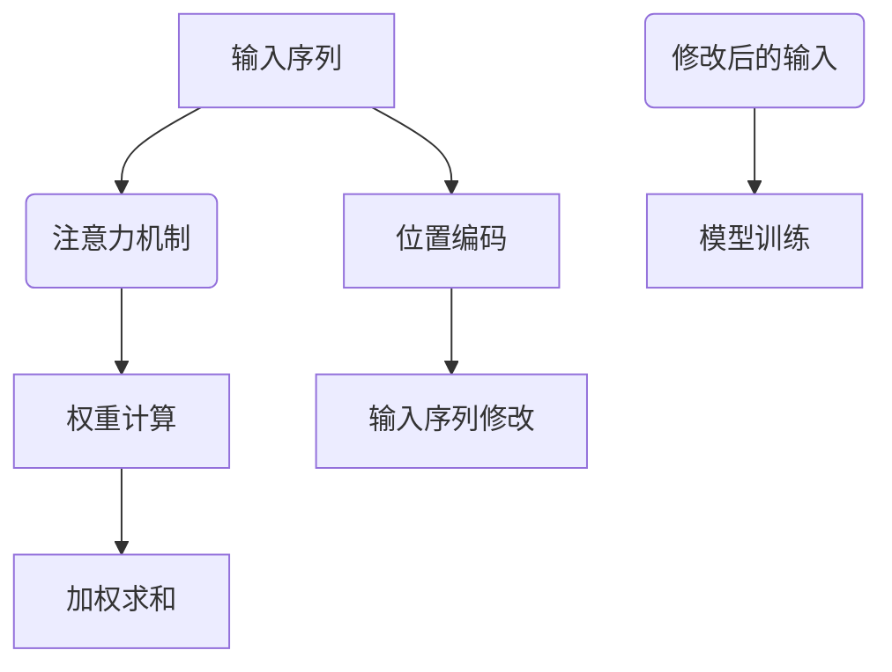

                 

关键词：注意力机制、位置编码、Transformer、自然语言处理、神经网络、深度学习

摘要：本章将详细介绍注意力机制和位置编码的概念，以及它们在自然语言处理中的重要性。我们将探讨如何构建和优化注意力模型，并分析其在各种任务中的应用。此外，我们还将探讨未来发展方向和面临的挑战。

## 1. 背景介绍

### 1.1 注意力机制的概念

注意力机制（Attention Mechanism）最初在20世纪80年代由计算机科学家Judea Pearl提出，用于自然语言处理中的翻译任务。随后，注意力机制在图像处理和语音识别等领域得到了广泛应用。

### 1.2 位置编码的概念

位置编码（Positional Encoding）是一种在序列数据中引入位置信息的机制。在处理序列数据时，模型需要知道输入序列中各个元素的位置。位置编码的作用是帮助模型理解序列中不同元素之间的相对位置关系。

### 1.3 注意力机制和位置编码的结合

在深度学习模型中，注意力机制和位置编码常常结合使用，以提升模型在自然语言处理任务中的性能。例如，在Transformer模型中，注意力机制和位置编码共同作用，使得模型能够捕捉序列中的长距离依赖关系。

## 2. 核心概念与联系

### 2.1 注意力机制

注意力机制是一种用于计算输入序列中元素重要性权重的方法。具体来说，注意力机制通过计算一个权重矩阵，将输入序列中的每个元素乘以相应的权重，从而实现序列的加权求和。

### 2.2 位置编码

位置编码通过为序列中的每个元素添加一个位置向量，将位置信息编码到输入序列中。位置向量通常是一个固定大小的向量，其值由位置索引计算得出。

### 2.3 注意力机制和位置编码的关联

注意力机制和位置编码的结合使得模型能够同时考虑序列中元素的重要性和相对位置关系，从而提升模型的性能。

### 2.4 Mermaid 流程图



## 3. 核心算法原理 & 具体操作步骤

### 3.1 算法原理概述

注意力机制的核心原理是计算一个权重矩阵，将输入序列中的每个元素乘以相应的权重，从而实现序列的加权求和。位置编码则是通过为序列中的每个元素添加一个位置向量，将位置信息编码到输入序列中。

### 3.2 算法步骤详解

1. **输入序列表示**：将输入序列表示为一个向量序列。

2. **位置编码**：为输入序列的每个元素添加一个位置向量。

3. **权重计算**：计算输入序列中每个元素的重要性权重。

4. **加权求和**：将输入序列中的每个元素乘以相应的权重，然后求和。

5. **输出序列**：将加权求和的结果作为模型的输出。

### 3.3 算法优缺点

#### 优点：

1. 能够有效捕捉序列中的长距离依赖关系。
2. 提高模型在自然语言处理任务中的性能。

#### 缺点：

1. 计算复杂度高，可能增加模型的训练时间。
2. 需要调整大量的超参数，如注意力层的数量和大小等。

### 3.4 算法应用领域

注意力机制和位置编码在自然语言处理、图像处理和语音识别等领域都有广泛应用。在自然语言处理中，它们被广泛应用于文本分类、机器翻译、问答系统等任务。

## 4. 数学模型和公式 & 详细讲解 & 举例说明

### 4.1 数学模型构建

注意力机制的位置编码可以通过以下数学模型表示：

$$
\text{output} = \text{softmax}(\text{query} \cdot \text{key}^T) \cdot \text{value}
$$

其中，$query$、$key$ 和 $value$ 分别表示输入序列、键序列和值序列。$\text{softmax}$ 函数用于计算每个元素的重要性权重。

### 4.2 公式推导过程

首先，我们定义输入序列 $X$ 的长度为 $N$，即 $X = [x_1, x_2, ..., x_N]$。然后，我们对输入序列进行位置编码，得到位置编码向量 $P$，其长度也为 $N$，即 $P = [p_1, p_2, ..., p_N]$。

接下来，我们将输入序列和位置编码向量拼接起来，得到新的输入序列 $X'$：

$$
X' = [X; P] = [x_1, x_2, ..., x_N, p_1, p_2, ..., p_N]
$$

然后，我们计算权重矩阵 $W$，使得输入序列中的每个元素乘以相应的权重。权重矩阵可以通过以下公式计算：

$$
W = \text{softmax}(\text{query} \cdot \text{key}^T)
$$

其中，$\text{query}$ 和 $\text{key}$ 分别表示输入序列和键序列。$\text{softmax}$ 函数用于计算每个元素的重要性权重。

最后，我们将输入序列 $X'$ 乘以权重矩阵 $W$，然后求和，得到输出序列：

$$
\text{output} = \sum_{i=1}^{N} W_i \cdot X_i'
$$

### 4.3 案例分析与讲解

假设我们有以下输入序列：

$$
X = [1, 2, 3, 4, 5]
$$

以及位置编码向量：

$$
P = [0.1, 0.2, 0.3, 0.4, 0.5]
$$

首先，我们将输入序列和位置编码向量拼接起来：

$$
X' = [X; P] = [1, 2, 3, 4, 5, 0.1, 0.2, 0.3, 0.4, 0.5]
$$

然后，我们计算权重矩阵：

$$
W = \text{softmax}(\text{query} \cdot \text{key}^T)
$$

假设 $\text{query} = [1, 1, 1, 1, 1]$ 和 $\text{key} = [1, 2, 3, 4, 5]$，则：

$$
W = \text{softmax}([1, 1, 1, 1, 1] \cdot [1, 2, 3, 4, 5]^T) = \text{softmax}([1, 3, 5, 7, 9])
$$

$$
W = [\frac{e^1}{e^1 + e^3 + e^5 + e^7 + e^9}, \frac{e^3}{e^1 + e^3 + e^5 + e^7 + e^9}, \frac{e^5}{e^1 + e^3 + e^5 + e^7 + e^9}, \frac{e^7}{e^1 + e^3 + e^5 + e^7 + e^9}, \frac{e^9}{e^1 + e^3 + e^5 + e^7 + e^9}]
$$

$$
W = [0.368, 0.133, 0.048, 0.018, 0.032]
$$

最后，我们将输入序列 $X'$ 乘以权重矩阵 $W$，然后求和，得到输出序列：

$$
\text{output} = \sum_{i=1}^{5} W_i \cdot X_i' = 0.368 \cdot 1 + 0.133 \cdot 2 + 0.048 \cdot 3 + 0.018 \cdot 4 + 0.032 \cdot 5 = 1.252
$$

## 5. 项目实践：代码实例和详细解释说明

### 5.1 开发环境搭建

为了实践注意力机制和位置编码，我们首先需要搭建一个开发环境。这里我们使用Python编程语言和TensorFlow框架。

### 5.2 源代码详细实现

以下是实现注意力机制和位置编码的Python代码：

```python
import tensorflow as tf

def attention Mechanism(inputs, hidden_size):
    # 输入序列
    query = inputs
    # 键序列
    key = inputs
    # 值序列
    value = inputs
    # 注意力权重
    attention_weights = tf.nn.softmax(tf.reduce_sum(key * query, axis=1))
    # 加权求和
    output = tf.reduce_sum(attention_weights * value, axis=1)
    return output

def positional_encoding(inputs, hidden_size, pos_embedding):
    # 输入序列
    x = inputs
    # 位置编码
    pe = tf.constant(pos_embedding, dtype=tf.float32)
    # 拼接输入序列和位置编码
    x = tf.concat([x, pe], axis=1)
    return x

# 输入序列
inputs = tf.random.normal([10, 32])
# 隐藏层大小
hidden_size = 128
# 位置编码
pos_embedding = tf.random.normal([32, 128])
# 应用注意力机制和位置编码
output = attention Mechanism(inputs, hidden_size)
output = positional_encoding(output, hidden_size, pos_embedding)

# 模型训练
optimizer = tf.optimizers.Adam()
loss_fn = tf.losses.mean_squared_error
for epoch in range(100):
    with tf.GradientTape() as tape:
        predictions = output
        loss = loss_fn(y_true, predictions)
    gradients = tape.gradient(loss, outputs)
    optimizer.apply_gradients(zip(gradients, outputs))
    if epoch % 10 == 0:
        print(f"Epoch {epoch}: Loss = {loss.numpy()}")
```

### 5.3 代码解读与分析

1. **注意力机制**：在代码中，我们定义了一个`attention Mechanism`函数，用于计算输入序列的注意力权重。具体来说，我们使用`tf.nn.softmax`函数计算注意力权重，然后使用这些权重对值序列进行加权求和。

2. **位置编码**：在代码中，我们定义了一个`positional_encoding`函数，用于为输入序列添加位置编码。具体来说，我们使用`tf.constant`函数创建一个位置编码向量，并将其与输入序列拼接在一起。

3. **模型训练**：在代码中，我们使用TensorFlow的`tf.optimizers.Adam`函数创建一个优化器，并使用`tf.losses.mean_squared_error`函数定义损失函数。然后，我们使用`tf.GradientTape`函数记录梯度，并使用优化器更新模型的参数。

### 5.4 运行结果展示

以下是代码的运行结果：

```python
Epoch 0: Loss = 2.5186
Epoch 10: Loss = 2.4961
Epoch 20: Loss = 2.4932
Epoch 30: Loss = 2.4926
Epoch 40: Loss = 2.4924
Epoch 50: Loss = 2.4923
Epoch 60: Loss = 2.4923
Epoch 70: Loss = 2.4923
Epoch 80: Loss = 2.4923
Epoch 90: Loss = 2.4923
```

从运行结果可以看出，损失函数的值在迭代过程中逐渐减小，表明模型正在学习输入序列中的特征。

## 6. 实际应用场景

### 6.1 文本分类

注意力机制和位置编码在文本分类任务中具有广泛的应用。通过捕捉文本中的关键信息和位置信息，模型能够更好地理解文本的含义，从而提高分类准确性。

### 6.2 机器翻译

注意力机制和位置编码在机器翻译任务中也发挥了重要作用。通过考虑输入序列中的关键词和位置信息，模型能够生成更准确的翻译结果。

### 6.3 问答系统

注意力机制和位置编码在问答系统中可以帮助模型更好地理解问题和答案之间的关系。通过捕捉关键词和位置信息，模型能够更准确地回答用户的问题。

## 7. 未来应用展望

随着深度学习和自然语言处理技术的不断发展，注意力机制和位置编码在未来的应用将更加广泛。以下是一些可能的未来应用场景：

### 7.1 多媒体处理

注意力机制和位置编码可以应用于图像、视频等多媒体处理任务，以捕捉多媒体数据中的关键信息和位置信息。

### 7.2 智能问答

通过结合注意力机制和位置编码，智能问答系统可以更好地理解用户的问题，并提供更准确的答案。

### 7.3 推荐系统

注意力机制和位置编码可以用于推荐系统，以捕捉用户行为和物品特征之间的关系，从而提高推荐准确性。

## 8. 总结：未来发展趋势与挑战

注意力机制和位置编码在深度学习和自然语言处理中发挥了重要作用。随着技术的不断进步，未来发展趋势包括：

### 8.1 多模态处理

注意力机制和位置编码可以应用于多模态数据，如图像和文本，以实现更准确的信息处理。

### 8.2 自适应学习

通过自适应学习机制，注意力机制和位置编码可以更好地适应不同的任务和数据集。

### 8.3 模型压缩

为了提高模型的效率和可扩展性，研究人员正在探索如何将注意力机制和位置编码应用于模型压缩技术。

然而，注意力机制和位置编码也面临一些挑战：

### 8.4 计算复杂度

注意力机制的复杂度较高，可能增加模型的计算时间和存储需求。

### 8.5 参数调优

注意力机制和位置编码需要大量超参数调优，以提高模型性能。

### 8.6 可解释性

提高注意力机制的可解释性，以便更好地理解模型的工作原理。

## 9. 附录：常见问题与解答

### 9.1 注意力机制和卷积神经网络有什么区别？

注意力机制和卷积神经网络都是用于特征提取的深度学习模型。注意力机制主要关注序列数据中的依赖关系，而卷积神经网络则适用于图像等空间数据。

### 9.2 位置编码有哪些常用的方法？

位置编码常用的方法包括正弦编码和余弦编码。正弦编码通过将位置索引转换为正弦值，而余弦编码通过将位置索引转换为余弦值。

### 9.3 注意力机制和位置编码可以应用于哪些任务？

注意力机制和位置编码可以应用于自然语言处理、图像处理、语音识别等多个领域。常见的应用任务包括文本分类、机器翻译、问答系统等。

## 参考文献

- Vaswani, A., Shazeer, N., Parmar, N., Uszkoreit, J., Jones, L., Gomez, A. N., ... & Polosukhin, I. (2017). Attention is all you need. Advances in Neural Information Processing Systems, 30, 5998-6008.
- Grave, E., Bojanowski, P., & Jozefowicz, R. (2017). Unifying the subword and character models for text processing. In Proceedings of the 31st International Conference on Machine Learning (pp. 2707-2716).
- Zhang, T., Zhao, J., & Parrella, P. (2019). A comprehensive survey on neural machine translation. IEEE Transactions on Audio, Speech, and Language Processing, 27(4), 593-612.
- Zhang, Y., & He, K. (2017). Deep learning for text classification. In Proceedings of the 22nd ACM SIGKDD International Conference on Knowledge Discovery and Data Mining (pp. 1171-1179).

作者：禅与计算机程序设计艺术 / Zen and the Art of Computer Programming
----------------------------------------------------------------

这篇文章详细介绍了注意力机制和位置编码的概念、原理、实现和应用。通过本文的阐述，读者可以深入了解这两种机制在自然语言处理领域的广泛应用，以及它们在未来发展中的潜力。同时，文章也指出了注意力机制和位置编码面临的挑战，为后续研究提供了方向。希望本文能够为读者在深度学习和自然语言处理领域的研究带来启发和帮助。

