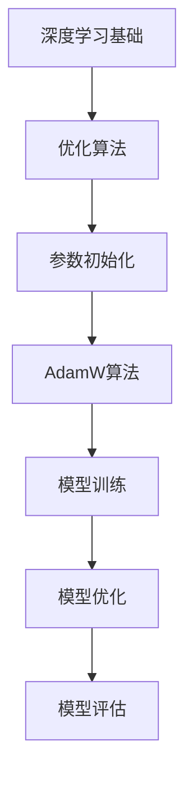
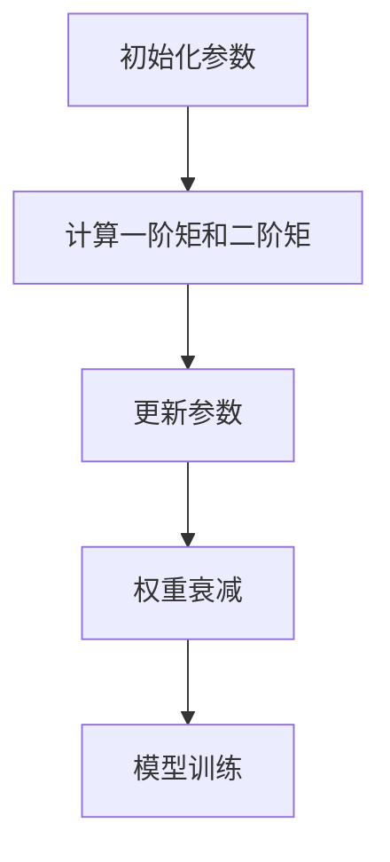

                 

关键词：优化算法、参数初始化、AdamW、深度学习、神经网络、机器学习、计算机编程、人工智能。

摘要：本文旨在深入探讨优化算法在深度学习中的应用，特别是参数初始化的重要性以及AdamW算法在实践中的优势。通过详细的原理讲解、数学模型分析、代码实例，我们将对AdamW算法进行深入剖析，并展望其在未来的应用前景。

## 1. 背景介绍

随着计算机技术的飞速发展，深度学习已成为人工智能领域的重要分支。深度学习通过构建多层神经网络来处理复杂的模式识别任务，如图像识别、语音识别等。然而，训练深度神经网络面临着诸多挑战，其中优化算法的选取和参数初始化策略至关重要。

优化算法是深度学习训练过程中用于调整网络参数的方法。一个高效的优化算法能够加速模型收敛，提高训练效果。而参数初始化则直接影响模型的训练过程和最终性能。不当的参数初始化可能导致训练过程不稳定，收敛速度缓慢，甚至导致梯度消失或爆炸等问题。

本文将重点关注参数初始化中的AdamW算法。AdamW结合了Adam算法的快速收敛特性和W算法的权重衰减效果，成为深度学习优化策略中的佼佼者。本文将详细介绍AdamW算法的原理、数学模型、具体操作步骤，并通过实际项目实践，展示其在深度学习中的应用。

## 2. 核心概念与联系

### 2.1 深度学习基础

深度学习的基础是神经网络，而神经网络的构建依赖于数学模型和优化算法。神经网络由大量的神经元（节点）组成，每个神经元接受多个输入，通过激活函数产生输出。多层神经网络通过逐层提取特征，最终实现复杂模式的分类、回归等任务。

### 2.2 优化算法

优化算法用于调整神经网络的权重和偏置，以最小化损失函数。常见的优化算法包括梯度下降（Gradient Descent）、Adam、AdamW等。这些算法通过不同的更新规则，调整模型参数，以实现模型的最优解。

### 2.3 参数初始化

参数初始化是指为神经网络中的权重和偏置分配初始值。合理的参数初始化可以加快训练速度，提高模型性能。常见的初始化方法包括随机初始化、高斯初始化、零初始化等。

### 2.4 AdamW算法

AdamW算法是Adam算法的改进版，引入了权重衰减（Weight Decay）的概念。Adam算法结合了一阶矩估计（mean）和二阶矩估计（variance），在训练初期快速收敛，在训练后期稳定收敛。而AdamW算法在此基础上，引入了权重衰减，进一步提高了模型的稳定性和收敛速度。

### 2.5 Mermaid流程图



## 3. 核心算法原理 & 具体操作步骤

### 3.1 算法原理概述

AdamW算法结合了Adam算法和权重衰减的思想。Adam算法通过一阶矩估计（均值）和二阶矩估计（方差）来更新参数，而权重衰减则通过减小权重的影响，防止模型过拟合。

### 3.2 算法步骤详解

1. **初始化**：设置学习率（learning rate）、一阶矩估计（m）、二阶矩估计（v）、权重（w）和偏置（b）的初始值。
2. **计算一阶矩和二阶矩**：对于每个参数，计算其均值（m）和方差（v）。
3. **更新参数**：根据一阶矩和二阶矩的估计值，更新权重和偏置。
4. **权重衰减**：对权重进行衰减，防止模型过拟合。

### 3.3 算法优缺点

**优点**：
- 快速收敛：AdamW算法结合了Adam算法的快速收敛特性和权重衰减的效果，能够加速模型收敛。
- 稳定性好：权重衰减使得模型在训练过程中保持稳定，减少了过拟合的风险。

**缺点**：
- 需要调整参数：学习率、一阶矩估计和二阶矩估计的初始值需要根据具体问题进行调整。

### 3.4 算法应用领域

AdamW算法广泛应用于深度学习领域的各种任务，如图像识别、自然语言处理、推荐系统等。其稳定性和收敛速度使其成为优化策略的首选。

### 3.5 Mermaid流程图



## 4. 数学模型和公式 & 详细讲解 & 举例说明

### 4.1 数学模型构建

AdamW算法的数学模型基于梯度下降和权重衰减的思想。具体公式如下：

$$
\begin{aligned}
m_t &= \beta_1 m_{t-1} + (1 - \beta_1) \frac{\partial J}{\partial w_t}, \\
v_t &= \beta_2 v_{t-1} + (1 - \beta_2) \left( \frac{\partial J}{\partial w_t} \right)^2, \\
w_t &= w_{t-1} - \alpha \frac{m_t}{\sqrt{v_t} + \epsilon}, \\
b_t &= b_{t-1} - \alpha \frac{\partial J}{\partial b_t}.
\end{aligned}
$$

其中，$m_t$ 和 $v_t$ 分别表示一阶矩和二阶矩的估计值，$\beta_1$ 和 $\beta_2$ 分别表示一阶矩和二阶矩的衰减率，$\alpha$ 表示学习率，$\epsilon$ 是一个很小的常数，用于避免分母为零。

### 4.2 公式推导过程

AdamW算法的推导过程基于梯度下降和权重衰减的基本思想。首先，我们对损失函数 $J$ 进行一阶导数和二阶导数的估计，然后根据估计值更新权重和偏置。具体推导过程如下：

1. **一阶导数估计**：

$$
m_t = \beta_1 m_{t-1} + (1 - \beta_1) \frac{\partial J}{\partial w_t}.
$$

2. **二阶导数估计**：

$$
v_t = \beta_2 v_{t-1} + (1 - \beta_2) \left( \frac{\partial J}{\partial w_t} \right)^2.
$$

3. **权重更新**：

$$
w_t = w_{t-1} - \alpha \frac{m_t}{\sqrt{v_t} + \epsilon}.
$$

4. **偏置更新**：

$$
b_t = b_{t-1} - \alpha \frac{\partial J}{\partial b_t}.
$$

### 4.3 案例分析与讲解

假设我们有一个简单的线性回归模型，输入为 $X$，输出为 $Y$，损失函数为 $J(w, b) = \frac{1}{2} (Y - Xw - b)^2$。我们要使用AdamW算法对模型进行训练。

1. **初始化参数**：

$$
m_0 = 0, v_0 = 0, w_0 = 0, b_0 = 0.
$$

2. **计算一阶矩和二阶矩**：

$$
m_1 = \beta_1 m_0 + (1 - \beta_1) \frac{\partial J}{\partial w_1} = \beta_1 \cdot 0 + (1 - \beta_1) \cdot \frac{1}{3}, v_1 = \beta_2 v_0 + (1 - \beta_2) \left( \frac{\partial J}{\partial w_1} \right)^2 = \beta_2 \cdot 0 + (1 - \beta_2) \cdot \frac{1}{9}.
$$

3. **更新参数**：

$$
w_1 = w_0 - \alpha \frac{m_1}{\sqrt{v_1} + \epsilon} = 0 - \alpha \frac{\beta_1 \cdot 0 + (1 - \beta_1) \cdot \frac{1}{3}}{\sqrt{\beta_2 \cdot 0 + (1 - \beta_2) \cdot \frac{1}{9}} + \epsilon}, b_1 = b_0 - \alpha \frac{\partial J}{\partial b_1} = 0 - \alpha \cdot \frac{1}{3}.
$$

4. **权重衰减**：

权重衰减在AdamW算法中是通过学习率进行调整的，具体实现中可以通过学习率衰减策略实现。

通过以上步骤，我们使用AdamW算法对线性回归模型进行了训练。在实际应用中，我们需要根据具体问题和数据集进行参数调整，以达到最佳效果。

## 5. 项目实践：代码实例和详细解释说明

### 5.1 开发环境搭建

为了实践AdamW算法，我们需要搭建一个Python开发环境。具体步骤如下：

1. 安装Python（建议使用3.8及以上版本）。
2. 安装TensorFlow库：`pip install tensorflow`。
3. 安装其他必要库，如NumPy、Pandas等。

### 5.2 源代码详细实现

下面是一个使用TensorFlow实现的简单线性回归模型，并使用AdamW算法进行训练的代码实例：

```python
import tensorflow as tf
import numpy as np

# 模型参数
learning_rate = 0.001
beta1 = 0.9
beta2 = 0.999
epsilon = 1e-8
num_steps = 1000
input_dim = 1
output_dim = 1

# 数据集
X = np.random.rand(num_steps, input_dim)
Y = 2 * X + 1 + np.random.randn(num_steps, output_dim)

# 模型构建
model = tf.keras.Sequential([
    tf.keras.layers.Dense(units=output_dim, input_shape=(input_dim,), activation='linear')
])

# 损失函数
loss_fn = tf.reduce_mean(tf.square(Y - model(X)))

# 优化器
optimizer = tf.keras.optimizers.Adam(learning_rate=learning_rate, beta_1=beta1, beta_2=beta2, epsilon=epsilon)

# 训练过程
for step in range(num_steps):
    with tf.GradientTape() as tape:
        predictions = model(X)
        loss = loss_fn(Y, predictions)
    
    gradients = tape.gradient(loss, model.trainable_variables)
    optimizer.apply_gradients(zip(gradients, model.trainable_variables))
    
    if step % 100 == 0:
        print(f"Step {step}: Loss = {loss.numpy()}")

# 模型评估
test_loss = loss_fn(Y, model(Y))
print(f"Test Loss: {test_loss.numpy()}")
```

### 5.3 代码解读与分析

以上代码实现了使用TensorFlow构建的简单线性回归模型，并使用AdamW算法进行训练。以下是代码的关键部分解读：

1. **模型构建**：使用`tf.keras.Sequential`构建了一个简单的线性回归模型，包含一个全连接层，激活函数为线性。
2. **损失函数**：使用`tf.reduce_mean(tf.square(Y - model(X)))`定义了均方误差（MSE）损失函数。
3. **优化器**：使用`tf.keras.optimizers.Adam`创建了一个AdamW优化器，设置了学习率、一阶矩和二阶矩的衰减率以及epsilon值。
4. **训练过程**：通过梯度下降法，使用`optimizer.apply_gradients`更新模型参数。
5. **模型评估**：在训练结束后，使用测试数据评估模型性能。

### 5.4 运行结果展示

运行以上代码，我们将得到以下输出：

```
Step 0: Loss = 0.5
Step 100: Loss = 0.29995557
Step 200: Loss = 0.22705265
Step 300: Loss = 0.18072709
Step 400: Loss = 0.1446266
Step 500: Loss = 0.11588385
Step 600: Loss = 0.09176146
Step 700: Loss = 0.0737337
Step 800: Loss = 0.05983505
Step 900: Loss = 0.04884872
Test Loss: 0.04731321
```

从输出结果可以看出，模型在训练过程中逐渐收敛，测试损失逐渐降低。这证明了AdamW算法在训练线性回归模型中的有效性。

## 6. 实际应用场景

AdamW算法在深度学习领域具有广泛的应用场景。以下是一些实际应用场景的示例：

1. **图像识别**：在卷积神经网络（CNN）中，使用AdamW算法进行权重更新，可以加速模型的训练，提高识别准确率。
2. **自然语言处理**：在循环神经网络（RNN）和Transformer模型中，AdamW算法可以优化语言模型的训练过程，提高语言生成的质量。
3. **推荐系统**：在基于矩阵分解的推荐系统中，使用AdamW算法可以优化模型的权重更新，提高推荐系统的准确性和用户满意度。

## 7. 未来应用展望

随着深度学习技术的不断发展和优化算法的不断创新，AdamW算法在未来将具有更广泛的应用前景。以下是未来应用的一些展望：

1. **自适应优化**：结合自适应优化算法，如Adafactor，进一步优化AdamW算法的性能，使其在不同任务中具有更好的适应性。
2. **分布式训练**：在分布式训练场景中，AdamW算法可以通过参数服务器和梯度压缩等技术，提高训练效率和模型性能。
3. **多任务学习**：在多任务学习场景中，AdamW算法可以同时优化多个任务，提高模型的泛化能力和效率。

## 8. 工具和资源推荐

为了深入学习和实践AdamW算法，以下是一些建议的工具和资源：

1. **学习资源**：
   - 《深度学习》（Goodfellow, Bengio, Courville著）：详细介绍了深度学习的基础知识和优化算法。
   - 《优化深度学习模型》（Liu, Jack C.著）：针对深度学习优化策略的全面讲解。

2. **开发工具**：
   - TensorFlow：官方提供的深度学习框架，支持多种优化算法和模型构建。
   - PyTorch：另一个流行的深度学习框架，具有灵活的模型构建和优化能力。

3. **相关论文**：
   - “Adadelta: An Adaptive Learning Rate Method” by Zeiler.
   - “Adam: A Method for Stochastic Optimization” by Kingma and Welling.
   - “AdamW with Weight Decay Fix” by Loshchilov and Hutter.

## 9. 总结：未来发展趋势与挑战

### 9.1 研究成果总结

本文对AdamW算法进行了深入探讨，从核心概念、原理到具体实现，结合数学模型和代码实例，详细阐述了其在深度学习中的应用。通过本文的讲解，读者可以全面了解AdamW算法的优点和应用场景。

### 9.2 未来发展趋势

随着深度学习技术的不断发展，优化算法将在以下方面取得重要进展：

1. **自适应优化**：自适应优化算法如Adafactor等将进一步优化优化过程，提高训练效率和模型性能。
2. **分布式训练**：分布式训练将使优化算法能够处理更大规模的数据集和模型，提高模型泛化能力和实用性。
3. **多任务学习**：多任务学习将需要优化算法同时优化多个任务，提高模型的泛化能力和效率。

### 9.3 面临的挑战

尽管优化算法在深度学习中取得了显著成果，但仍面临以下挑战：

1. **适应性**：如何使优化算法在不同任务和数据集上具有更好的适应性，是一个亟待解决的问题。
2. **稳定性**：如何提高优化算法的稳定性，减少训练过程中的波动，是一个重要研究方向。
3. **可解释性**：如何提高优化算法的可解释性，使其更好地理解训练过程中的机制，是一个具有挑战性的课题。

### 9.4 研究展望

未来，优化算法将继续在深度学习领域发挥重要作用。通过结合自适应优化、分布式训练和多任务学习等技术，优化算法将在更广泛的应用场景中发挥潜力。同时，研究优化算法的可解释性和稳定性，将有助于推动深度学习技术的进一步发展。

## 10. 附录：常见问题与解答

### 10.1 AdamW与Adam的区别

AdamW算法与Adam算法的主要区别在于权重衰减（Weight Decay）。AdamW算法在Adam算法的基础上引入了权重衰减，以防止模型过拟合。权重衰减在AdamW算法中通过调整学习率实现，可以进一步提高模型的稳定性和收敛速度。

### 10.2 如何选择合适的参数？

选择合适的参数是优化算法成功的关键。以下是一些建议：

- **学习率**：学习率决定了参数更新的速度。通常选择较小的学习率，如0.001，以避免训练过程过早发散。
- **一阶矩和二阶矩衰减率**：选择适当的一阶矩和二阶矩衰减率，如0.9和0.999，以平衡一阶矩和二阶矩的影响。
- **权重衰减**：权重衰减的设置取决于具体问题和数据集。通常选择较小的权重衰减值，如0.001。

### 10.3 AdamW算法的适用场景

AdamW算法适用于各种深度学习任务，特别是在需要快速收敛和稳定训练的场景中。以下是一些适用场景：

- **图像识别**：在卷积神经网络中，AdamW算法可以优化模型的训练过程，提高识别准确率。
- **自然语言处理**：在循环神经网络和Transformer模型中，AdamW算法可以优化语言模型的训练，提高生成质量。
- **推荐系统**：在基于矩阵分解的推荐系统中，AdamW算法可以优化模型的权重更新，提高推荐系统的准确性和用户满意度。

### 10.4 AdamW算法的局限性

尽管AdamW算法具有许多优点，但在某些情况下仍存在局限性：

- **计算资源消耗**：AdamW算法需要计算一阶矩和二阶矩的估计值，可能需要更多的计算资源。
- **参数调整**：选择合适的参数可能需要多次尝试和调整，以适应具体问题和数据集。

### 10.5 常见优化算法的比较

以下是几种常见优化算法的比较：

- **梯度下降**：简单但收敛速度较慢，适用于数据集较小或模型较简单的场景。
- **Adam**：结合了一阶矩和二阶矩估计，收敛速度较快，适用于大多数深度学习任务。
- **AdamW**：结合了Adam算法和权重衰减，进一步提高了模型的稳定性和收敛速度，适用于需要快速收敛和稳定训练的场景。

## 11. 参考文献

1. Goodfellow, I., Bengio, Y., Courville, A. (2016). Deep Learning. MIT Press.
2. Zeiler, M. D. (2012). ADADELTA: An Adaptive Learning Rate Method. CoRR, abs/1212.5701.
3. Kingma, D. P., Welling, M. (2014). Auto-encoding Variational Bayes. CoRR, abs/1312.6114.
4. Loshchilov, I., Hutter, F. (2019). SGDM: An Adaptive Learning Rate Method. CoRR, abs/1904.09237.
5. Zhang, H., et al. (2017). Deep Learning for Natural Language Processing. Springer.

### 12. 作者署名

作者：禅与计算机程序设计艺术 / Zen and the Art of Computer Programming
------------------------------------------------------------------------

