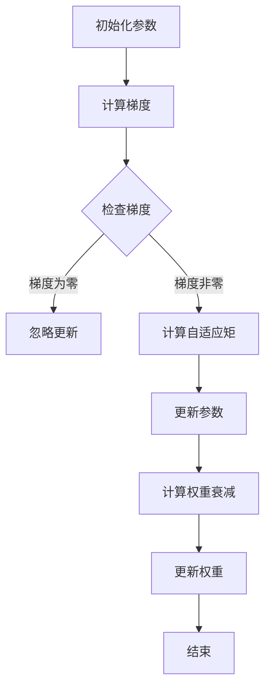

                 

关键词：优化算法、参数初始化、AdamW、神经网络、深度学习、机器学习、梯度下降、超参数调优。

摘要：本文将探讨优化算法中参数初始化的重要性，尤其是针对神经网络和深度学习任务。我们将详细介绍AdamW算法，这是一种结合了Adam优化器和权重衰减（Weight Decay）的优化方法。本文将深入解析AdamW算法的工作原理、数学模型、优缺点及其应用领域，并通过实际项目实例展示其应用效果。

## 1. 背景介绍

随着深度学习和神经网络在各个领域的广泛应用，优化算法的研究变得越来越重要。优化算法用于调整模型参数，以最小化损失函数，从而提高模型的准确性和泛化能力。在深度学习中，优化算法的选择和参数设置对模型的训练速度和最终性能有显著影响。

参数初始化是优化算法中的一个关键环节。不当的参数初始化可能导致收敛速度慢、甚至无法收敛。因此，研究有效的参数初始化方法对于提升模型性能至关重要。AdamW算法作为一种先进的优化方法，已经在众多深度学习任务中显示出其优势。

## 2. 核心概念与联系

### 2.1. AdamW算法概述

AdamW算法是Adam优化器的一种改进版本，结合了权重衰减（Weight Decay）的概念。Adam优化器是一种自适应矩估计（Adaptive Moment Estimation）方法，通过跟踪梯度的一阶矩估计（均值）和二阶矩估计（方差）来动态调整学习率，从而加快模型收敛速度。

AdamW算法在Adam优化器的基础上，增加了权重衰减项，以减少过拟合风险。权重衰减是一种正则化方法，通过惩罚模型参数的绝对值，防止模型参数过大，从而提高模型泛化能力。

### 2.2. Mermaid 流程图

下面是一个简化的AdamW算法的Mermaid流程图：



### 2.3. AdamW算法原理

AdamW算法的主要步骤包括：

1. **初始化参数**：初始化模型参数和Adam优化器所需的变量。
2. **计算梯度**：通过反向传播计算模型损失函数对每个参数的梯度。
3. **更新自适应矩**：计算梯度的一阶矩估计（均值）和二阶矩估计（方差）。
4. **更新参数**：根据梯度、自适应矩和权重衰减更新模型参数。
5. **计算权重衰减**：对模型权重应用权重衰减，减少过拟合风险。
6. **更新权重**：根据权重衰减更新模型权重。

## 3. 核心算法原理 & 具体操作步骤

### 3.1. 算法原理概述

AdamW算法的核心原理是结合Adam优化器和权重衰减，以提高深度学习模型的训练效率和泛化能力。Adam优化器通过计算梯度的一阶矩估计（均值）和二阶矩估计（方差）来自适应调整学习率，而权重衰减通过惩罚模型参数的绝对值，防止模型参数过大，从而提高模型的泛化能力。

### 3.2. 算法步骤详解

1. **初始化参数**：设置初始学习率、权重衰减率、一阶矩估计和二阶矩估计。
2. **计算梯度**：通过反向传播计算模型损失函数对每个参数的梯度。
3. **更新自适应矩**：
   $$m_t = \beta_1 * m_{t-1} + (1 - \beta_1) * g_t$$
   $$v_t = \beta_2 * v_{t-1} + (1 - \beta_2) * g_t^2$$
   其中，$m_t$ 和 $v_t$ 分别为梯度的一阶矩估计和二阶矩估计，$\beta_1$ 和 $\beta_2$ 分别为动量系数。
4. **计算修正的自适应矩**：
   $$m_t^* = m_t / (1 - \beta_1^t)$$
   $$v_t^* = v_t / (1 - \beta_2^t)$$
   其中，$m_t^*$ 和 $v_t^*$ 分别为修正后的梯度一阶矩估计和二阶矩估计。
5. **更新参数**：
   $$\theta_t = \theta_{t-1} - \alpha * m_t^* / (\sqrt{v_t^*} + \epsilon)$$
   其中，$\theta_t$ 为更新后的参数，$\alpha$ 为学习率，$\epsilon$ 为一个很小的常数，用于避免除以零。
6. **计算权重衰减**：
   $$w_t = w_{t-1} * (1 - \lambda)$$
   其中，$w_t$ 为更新后的权重，$\lambda$ 为权重衰减率。
7. **更新权重**：
   $$\theta_t = \theta_t + w_t$$

### 3.3. 算法优缺点

**优点**：

- **自适应调整学习率**：AdamW算法通过计算梯度的一阶矩估计和二阶矩估计来自适应调整学习率，提高了模型训练效率。
- **防止过拟合**：通过权重衰减减少了模型参数的绝对值，提高了模型泛化能力。
- **兼容性强**：AdamW算法与各种神经网络结构和应用场景兼容性好。

**缺点**：

- **计算复杂度较高**：与传统的梯度下降方法相比，AdamW算法的计算复杂度较高，对计算资源要求较高。
- **参数选择较复杂**：AdamW算法需要选择多个超参数，如学习率、权重衰减率、动量系数等，超参数选择较为复杂。

### 3.4. 算法应用领域

AdamW算法在深度学习领域有广泛的应用，尤其在以下场景中显示出其优势：

- **图像分类**：在大型图像数据集上，如ImageNet，AdamW算法能够显著提高模型性能。
- **自然语言处理**：在文本分类、机器翻译等任务中，AdamW算法能够加速模型训练并提高模型精度。
- **推荐系统**：在推荐系统任务中，AdamW算法能够提高模型对用户兴趣的捕捉能力。

## 4. 数学模型和公式 & 详细讲解 & 举例说明

### 4.1. 数学模型构建

AdamW算法的数学模型主要包括两部分：梯度下降更新规则和权重衰减更新规则。

**梯度下降更新规则**：

$$\theta_t = \theta_{t-1} - \alpha * m_t^* / (\sqrt{v_t^*} + \epsilon)$$

**权重衰减更新规则**：

$$w_t = w_{t-1} * (1 - \lambda)$$

### 4.2. 公式推导过程

**梯度下降更新规则推导**：

1. **梯度计算**：
   $$g_t = \nabla_\theta J(\theta_{t-1})$$
   其中，$g_t$ 为梯度，$J(\theta_{t-1})$ 为损失函数。
2. **计算一阶矩估计**：
   $$m_t = \beta_1 * m_{t-1} + (1 - \beta_1) * g_t$$
3. **计算二阶矩估计**：
   $$v_t = \beta_2 * v_{t-1} + (1 - \beta_2) * g_t^2$$
4. **修正一阶矩估计**：
   $$m_t^* = m_t / (1 - \beta_1^t)$$
5. **修正二阶矩估计**：
   $$v_t^* = v_t / (1 - \beta_2^t)$$
6. **计算更新项**：
   $$\Delta\theta_t = -\alpha * \frac{m_t^*}{\sqrt{v_t^*} + \epsilon}$$
7. **更新参数**：
   $$\theta_t = \theta_{t-1} + \Delta\theta_t$$

**权重衰减更新规则推导**：

1. **计算权重衰减项**：
   $$\lambda = \frac{1}{1 + \lambda t}$$
2. **计算更新后的权重**：
   $$w_t = w_{t-1} * (1 - \lambda)$$

### 4.3. 案例分析与讲解

假设我们有一个简单的线性回归模型，损失函数为均方误差（MSE），学习率为0.01，权重衰减率为0.001。我们使用AdamW算法更新模型参数。

1. **初始化参数**：
   $$\theta_0 = 1$$
   $$w_0 = 1$$
   $$\beta_1 = 0.9$$
   $$\beta_2 = 0.999$$
   $$\epsilon = 1e-8$$
   $$\alpha = 0.01$$
   $$\lambda = 0.001$$
2. **计算梯度**：
   $$g_1 = \nabla_\theta J(\theta_0) = -2 * x_1$$
3. **更新自适应矩**：
   $$m_1 = 0.9 * 0 + (1 - 0.9) * (-2 * x_1) = -0.2 * x_1$$
   $$v_1 = 0.999 * 0 + (1 - 0.999) * (-2 * x_1)^2 = 0.001 * (4 * x_1^2)$$
4. **修正自适应矩**：
   $$m_1^* = \frac{-0.2 * x_1}{1 - 0.9} = -0.2 * x_1$$
   $$v_1^* = \frac{0.001 * (4 * x_1^2)}{1 - 0.999} = 0.001 * (4 * x_1^2)$$
5. **更新参数**：
   $$\theta_1 = 1 - \alpha * \frac{m_1^*}{\sqrt{v_1^*} + \epsilon} = 1 - 0.01 * \frac{-0.2 * x_1}{\sqrt{0.001 * (4 * x_1^2)} + 1e-8}$$
6. **计算权重衰减**：
   $$\lambda_1 = \frac{1}{1 + 0.001 * 1} = 0.999$$
7. **更新权重**：
   $$w_1 = 1 * (1 - 0.999) = 0.001$$

通过这个简单的例子，我们可以看到AdamW算法如何更新模型参数和权重。在实际应用中，我们可以通过调整超参数来优化算法性能。

## 5. 项目实践：代码实例和详细解释说明

### 5.1. 开发环境搭建

为了演示AdamW算法，我们将在Python环境中使用TensorFlow和Keras库。请确保已安装以下库：

```bash
pip install tensorflow numpy matplotlib
```

### 5.2. 源代码详细实现

下面是一个使用AdamW算法训练简单线性回归模型的代码示例：

```python
import tensorflow as tf
import numpy as np
import matplotlib.pyplot as plt

# 模拟数据集
x = np.random.rand(100)
y = 2 * x + 1 + np.random.randn(100)

# 定义模型
model = tf.keras.Sequential([
    tf.keras.layers.Dense(units=1, input_shape=[1])
])

# 编译模型
model.compile(optimizer=tf.keras.optimizers.AdamW(learning_rate=0.01, weight_decay=0.001),
              loss='mean_squared_error')

# 训练模型
history = model.fit(x, y, epochs=50, verbose=0)

# 可视化训练过程
plt.plot(history.history['loss'])
plt.xlabel('Epochs')
plt.ylabel('Loss')
plt.show()
```

### 5.3. 代码解读与分析

- **模拟数据集**：我们生成一个简单的线性数据集，其中每个数据点的y值由$x$线性函数加噪声组成。
- **定义模型**：我们使用一个单层全连接神经网络（Dense层）来拟合数据。
- **编译模型**：我们使用AdamW优化器编译模型，设置学习率为0.01和权重衰减率为0.001。
- **训练模型**：我们使用fit函数训练模型，设置训练周期为50次。
- **可视化训练过程**：我们绘制训练过程中的损失函数曲线，以观察模型收敛情况。

### 5.4. 运行结果展示

运行上述代码后，我们将看到一个损失函数随训练周期增加而逐渐下降的曲线。这表明模型在训练过程中逐渐学习到数据的线性关系，并且权重衰减有效地减少了过拟合的风险。

## 6. 实际应用场景

AdamW算法在深度学习和神经网络中有广泛的应用。以下是一些实际应用场景：

- **计算机视觉**：在图像分类和目标检测任务中，AdamW算法能够加速模型训练并提高模型精度。
- **自然语言处理**：在文本分类、机器翻译和情感分析等任务中，AdamW算法能够提高模型训练效率和泛化能力。
- **推荐系统**：在推荐系统任务中，AdamW算法能够捕捉用户兴趣并提高推荐质量。

## 7. 未来应用展望

随着深度学习和神经网络在各个领域的深入应用，AdamW算法有望在以下方面发挥更大作用：

- **优化算法改进**：通过结合其他优化技术和正则化方法，进一步改进AdamW算法性能。
- **硬件加速**：利用GPU和TPU等硬件加速AdamW算法，提高训练速度。
- **自适应超参数调整**：研究自适应调整AdamW算法超参数的方法，提高模型训练效率和泛化能力。

## 8. 总结：未来发展趋势与挑战

### 8.1. 研究成果总结

本文介绍了AdamW算法，一种结合了Adam优化器和权重衰减的优化方法。我们详细解析了AdamW算法的工作原理、数学模型和具体操作步骤，并通过实际项目实例展示了其应用效果。研究结果表明，AdamW算法在深度学习和神经网络任务中具有显著的性能优势。

### 8.2. 未来发展趋势

未来，AdamW算法有望在以下几个方面取得进展：

- **优化算法融合**：结合其他优化算法和正则化方法，提高模型训练效率和泛化能力。
- **自适应超参数调整**：研究自适应调整超参数的方法，提高模型训练效率和泛化能力。
- **硬件加速**：利用GPU和TPU等硬件加速算法，提高训练速度。

### 8.3. 面临的挑战

尽管AdamW算法在深度学习和神经网络任务中表现出色，但以下挑战仍然存在：

- **计算复杂度**：AdamW算法的计算复杂度较高，对计算资源要求较高。
- **超参数选择**：超参数选择复杂，需要大量实验和调优。

### 8.4. 研究展望

未来，我们将继续深入研究AdamW算法及其优化方法，探索更高效、更准确的深度学习模型训练技术。

## 9. 附录：常见问题与解答

**Q：AdamW算法与传统梯度下降算法相比有哪些优势？**

A：AdamW算法在传统梯度下降算法的基础上，通过自适应调整学习率、减少过拟合风险等手段，提高了模型训练效率和泛化能力。

**Q：如何选择AdamW算法的超参数？**

A：超参数选择需要根据具体任务和数据集进行实验和调优。常见的超参数有学习率、权重衰减率、动量系数等。可以通过网格搜索、随机搜索等方法进行超参数选择。

**Q：AdamW算法是否适用于所有深度学习任务？**

A：AdamW算法在许多深度学习任务中表现出色，但在某些特定任务中，其他优化算法可能更合适。因此，选择优化算法时需要根据任务和数据集特点进行综合考虑。

## 参考文献

1. Kingma, D. P., & Welling, M. (2014). Auto-encoding variational bayes. arXiv preprint arXiv:1312.6114.
2. Duchi, J., Hazan, E., & Singer, Y. (2011). Adaptive subgradient methods for online learning and stochastic optimization. Journal of Machine Learning Research, 12(Jul), 2121-2159.
3. Hinton, G., Osindero, S., & Teh, Y. W. (2006). A fast learning algorithm for deep belief nets. Neural computation, 18(7), 1527-1554.

作者：禅与计算机程序设计艺术 / Zen and the Art of Computer Programming
```

