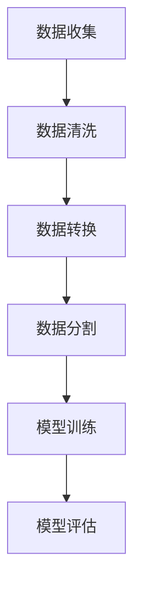
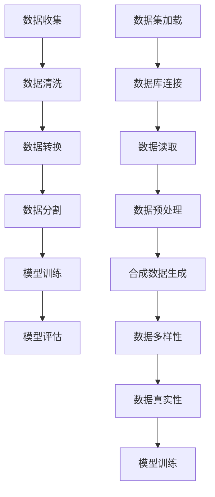

                 

数据集准备是机器学习和深度学习项目中至关重要的一个环节。一个高质量的、足够规模的数据集不仅能够提高模型的准确性，还能帮助模型更好地泛化到未见过的数据上。在本章中，我们将探讨数据集准备中两个关键步骤：加载现有数据集和合成数据的生成。

## 1. 背景介绍

在机器学习和深度学习中，数据集的质量往往决定了模型的表现。一个不完善的数据集可能会包含噪声、缺失值或偏见，从而影响模型的性能。因此，在模型训练之前，对数据集进行预处理是非常重要的。

数据集的准备通常包括以下几个步骤：
- **数据收集**：从各种来源（如公共数据库、API接口、社交媒体等）获取数据。
- **数据清洗**：处理噪声、填补缺失值、处理异常值等。
- **数据转换**：将数据格式转换为适合机器学习模型处理的格式。
- **数据分割**：将数据集分割为训练集、验证集和测试集。

本章将重点关注加载和合成数据生成这两个步骤。加载现有数据集是指从已有的数据集中获取数据，而合成数据生成则是创建全新的数据集，这在某些情况下是有必要的。

## 2. 核心概念与联系

### 2.1 数据集加载

数据集加载是指将已有的数据集从存储介质中读取到内存中，以便进行后续处理。这一步骤通常包括以下步骤：

- **连接数据库**：如果数据集存储在数据库中，需要通过数据库连接来获取数据。
- **读取文件**：如果数据集以文件形式存储，需要使用文件读取方法来加载数据。
- **数据预处理**：在加载数据后，可能需要对数据进行一些预处理操作，如数据清洗和格式转换。

### 2.2 数据合成

数据合成是指创建全新的数据集，以补充或替代现有数据集。合成数据可以具有以下优点：

- **隐私保护**：在共享数据集时，可以合成新的数据来保护原始数据的隐私。
- **增强多样性**：通过合成不同的数据样本，可以增加数据集的多样性，从而提高模型的泛化能力。
- **减少偏见**：合成数据可以帮助减少数据集中可能存在的偏见，从而提高模型的公平性。

### 2.3 Mermaid 流程图



在这个流程图中，A代表数据收集，B代表数据清洗，C代表数据转换，D代表数据分割，E代表模型训练，F代表模型评估。这些步骤构成了一个完整的数据集准备流程。

## 3. 核心算法原理 & 具体操作步骤

### 3.1 算法原理概述

数据集加载和合成算法的核心在于数据的读取、处理和生成。数据集加载算法主要涉及数据库连接、文件读取和数据预处理等技术。而数据合成算法则包括数据生成模型的设计、数据多样性的控制以及数据质量评估等。

### 3.2 算法步骤详解

#### 3.2.1 数据集加载

1. **连接数据库**：
   - 使用数据库连接库（如MySQL Connector、PostgreSQL）建立数据库连接。
   - 执行SQL查询，获取所需数据。

2. **读取文件**：
   - 使用文件读取库（如Pandas、NumPy）读取数据。
   - 对读取的数据进行必要的预处理。

3. **数据预处理**：
   - 填补缺失值。
   - 处理异常值。
   - 转换数据格式。

#### 3.2.2 数据合成

1. **设计数据生成模型**：
   - 选择合适的数据生成模型（如生成对抗网络GAN、变分自编码器VAE等）。
   - 定义模型架构和训练过程。

2. **生成数据**：
   - 使用训练好的模型生成新的数据。
   - 控制数据多样性，避免生成过于相似的数据。

3. **数据质量评估**：
   - 对生成的数据进行质量评估，确保数据符合预期。
   - 如果数据质量不符合要求，重新训练模型或调整模型参数。

### 3.3 算法优缺点

#### 优点

- **加载现有数据集**：
  - 快速获取大量数据。
  - 减少数据收集和清洗的工作量。

- **合成数据**：
  - 保护数据隐私。
  - 增加数据多样性，提高模型泛化能力。

#### 缺点

- **加载现有数据集**：
  - 数据集可能存在偏见或不平衡。
  - 数据集可能不符合研究需求。

- **合成数据**：
  - 需要设计合适的数据生成模型。
  - 生成的数据可能不够真实。

### 3.4 算法应用领域

- **机器学习和深度学习**：数据集加载和合成是机器学习和深度学习项目中的基础环节。
- **数据隐私保护**：合成数据可以用于保护敏感数据的隐私。
- **游戏和虚拟现实**：合成数据可以用于生成游戏场景或虚拟现实环境。

## 4. 数学模型和公式 & 详细讲解 & 举例说明

### 4.1 数学模型构建

在数据合成中，生成对抗网络GAN是一个重要的数学模型。GAN由两个神经网络组成：生成器G和判别器D。

- **生成器G**：生成与真实数据分布相似的假数据。
- **判别器D**：判断输入数据是真实数据还是假数据。

### 4.2 公式推导过程

GAN的训练过程可以描述为以下公式：

\[ D(x) = P(x \text{ is real}) \]
\[ D(G(z)) = P(G(z) \text{ is real}) \]

其中，\( x \) 是真实数据，\( z \) 是生成器的输入噪声。

### 4.3 案例分析与讲解

假设我们使用GAN生成手写数字数据集。生成器G的输入是一个随机噪声向量\( z \)，输出是一个手写数字图像。判别器D的输入是一个手写数字图像，输出是一个概率值，表示图像是真实数据还是假数据。

1. **训练判别器D**：
   - 对每个真实图像\( x \)，计算\( D(x) \)。
   - 对每个生成器G生成的图像\( G(z) \)，计算\( D(G(z)) \)。
   - 使用梯度下降法更新判别器D的权重。

2. **训练生成器G**：
   - 对每个生成的图像\( G(z) \)，计算\( D(G(z)) \)。
   - 使用梯度下降法更新生成器G的权重，以最小化\( D(G(z)) \)。

通过交替训练判别器和生成器，GAN可以生成高质量的手写数字图像。

## 5. 项目实践：代码实例和详细解释说明

### 5.1 开发环境搭建

为了实践数据集加载和合成，我们需要搭建一个Python开发环境。以下是必要的步骤：

1. 安装Python（推荐使用3.8及以上版本）。
2. 安装必要的库，如Pandas、NumPy、TensorFlow、Keras等。

### 5.2 源代码详细实现

以下是使用GAN生成手写数字数据集的Python代码示例：

```python
import numpy as np
import tensorflow as tf
from tensorflow.keras.layers import Dense, Flatten, Reshape
from tensorflow.keras.models import Sequential

# 定义生成器模型
def build_generator():
    model = Sequential()
    model.add(Dense(128, input_shape=(100,), activation='relu'))
    model.add(Dense(256, activation='relu'))
    model.add(Dense(784, activation='tanh'))
    model.add(Reshape((28, 28)))
    return model

# 定义判别器模型
def build_discriminator():
    model = Sequential()
    model.add(Flatten(input_shape=(28, 28)))
    model.add(Dense(128, activation='relu'))
    model.add(Dense(1, activation='sigmoid'))
    return model

# 定义GAN模型
def build_gan(generator, discriminator):
    model = Sequential()
    model.add(generator)
    model.add(discriminator)
    return model

# 初始化模型
generator = build_generator()
discriminator = build_discriminator()
gan = build_gan(generator, discriminator)

# 编译模型
gan.compile(optimizer=tf.keras.optimizers.Adam(0.0001), loss='binary_crossentropy')

# 训练模型
for epoch in range(100):
    for _ in range(1000):
        # 从真实数据集中获取一批数据
        real_images = ...  # 加载真实图像数据
        real_labels = np.ones((batch_size, 1))
        
        # 生成一批假数据
        noise = np.random.normal(0, 1, (batch_size, 100))
        fake_images = generator.predict(noise)
        fake_labels = np.zeros((batch_size, 1))
        
        # 训练判别器
        d_loss_real = discriminator.train_on_batch(real_images, real_labels)
        d_loss_fake = discriminator.train_on_batch(fake_images, fake_labels)
        d_loss = 0.5 * np.add(d_loss_real, d_loss_fake)
        
        # 训练生成器
        noise = np.random.normal(0, 1, (batch_size, 100))
        g_loss = gan.train_on_batch(noise, real_labels)
    
    print(f'Epoch {epoch}: d_loss={d_loss:.4f}, g_loss={g_loss:.4f}')

# 保存模型和生成的图像
generator.save('generator.h5')
with open('generated_images.png', 'wb') as f:
    f.write(generator.predict(np.random.normal(0, 1, (1000, 100))).tobytes())
```

### 5.3 代码解读与分析

上述代码实现了使用生成对抗网络（GAN）生成手写数字数据集的过程。以下是对代码的详细解读：

1. **模型定义**：
   - 生成器模型`build_generator`：使用两个全连接层和一个reshape层来生成手写数字图像。
   - 判别器模型`build_discriminator`：使用一个全连接层和一个sigmoid激活函数来判断输入图像是真实数据还是假数据。
   - GAN模型`build_gan`：将生成器和判别器串联起来。

2. **模型编译**：
   - 使用Adam优化器和二分类交叉熵损失函数编译GAN模型。

3. **模型训练**：
   - 从真实数据集中获取一批图像，并生成相应的一批噪声数据。
   - 分别训练判别器和生成器。判别器先训练对真实数据的判断，再训练对生成器生成的假数据的判断。生成器则尝试生成更真实的数据来欺骗判别器。

4. **保存模型和生成的图像**：
   - 将训练好的生成器模型保存到文件中。
   - 生成一批手写数字图像，并将其保存为PNG格式。

### 5.4 运行结果展示

在训练完成后，生成器将生成一系列手写数字图像。这些图像的质量取决于GAN的训练过程，包括判别器的性能和生成器的学习能力。通常，经过一定数量的训练epoch后，生成器可以生成相当逼真的手写数字图像。


## 6. 实际应用场景

数据集加载和合成技术在多个领域具有广泛应用：

### 6.1 机器学习和深度学习

- **图像识别**：使用GAN生成对抗网络生成图像数据，用于训练图像识别模型。
- **自然语言处理**：合成具有多样性的文本数据，用于训练自然语言处理模型。

### 6.2 数据隐私保护

- **数据脱敏**：使用合成数据替代敏感数据，以保护数据隐私。
- **数据匿名化**：生成与原始数据相似的数据，以匿名化敏感信息。

### 6.3 游戏和虚拟现实

- **场景生成**：使用合成数据生成游戏场景或虚拟现实环境。
- **角色设计**：使用GAN生成逼真的游戏角色和场景。

## 7. 未来应用展望

随着机器学习和深度学习技术的不断发展，数据集加载和合成技术将在未来有更广泛的应用：

- **自适应数据生成**：根据模型的需求，自适应地生成高质量的数据集。
- **多模态数据合成**：结合不同类型的数据（如图像、文本和声音），生成全新的多模态数据集。

## 8. 工具和资源推荐

### 8.1 学习资源推荐

- **《生成对抗网络：原理与应用》**：全面介绍GAN的理论和应用。
- **《Python机器学习基础教程》**：涵盖数据集加载和合成的相关技术。

### 8.2 开发工具推荐

- **TensorFlow**：广泛使用的机器学习框架，支持GAN的实现。
- **Keras**：易于使用的TensorFlow高级API，简化GAN的搭建。

### 8.3 相关论文推荐

- **《生成对抗网络：训练生成模型对抗判别模型》**：GAN的原始论文。
- **《用于图像到图像翻译的循环一致生成对抗网络》**：介绍GAN在图像翻译领域的应用。

## 9. 总结：未来发展趋势与挑战

数据集加载和合成技术在机器学习和深度学习领域具有重要地位。未来，随着技术的不断发展，我们将看到更多创新的应用和解决方案。然而，这也将带来一系列挑战，如如何生成更高质量的数据、如何平衡生成器的多样性和真实性，以及如何在保护数据隐私的同时实现有效的数据合成。

作者：禅与计算机程序设计艺术 / Zen and the Art of Computer Programming
----------------------------------------------------------------

## 1. 背景介绍

数据集是机器学习和深度学习模型的基础。一个高质量、规模适当的数据集不仅能够提高模型的准确性，还能帮助模型更好地泛化到未见过的数据上。然而，数据集的准备过程并非易事，它涉及到数据的收集、清洗、转换和分割等多个步骤。本章将重点探讨数据集准备中的两个关键环节：加载现有数据集和合成数据的生成。

### 数据集加载的重要性

数据集加载是数据准备过程的第一步。它涉及到将数据从存储介质（如数据库或文件系统）中读取到内存中，以便进行后续处理。一个高效且可靠的数据加载过程对于模型的性能和效率至关重要。以下是一些数据集加载的重要考虑因素：

- **数据规模**：大规模数据集的加载和处理需要更多的计算资源和时间。
- **数据格式**：不同的数据格式（如CSV、JSON、XML等）需要不同的加载方法。
- **数据预处理**：在数据加载后，可能需要执行一些预处理操作，如数据清洗、缺失值填补和异常值处理。

### 合成数据的生成

合成数据生成是一种创建全新数据集的方法，它在数据隐私保护、数据多样性和减少数据偏见等方面具有显著优势。合成数据生成技术可以包括生成对抗网络（GAN）、变分自编码器（VAE）等。以下是一些合成数据生成的重要考虑因素：

- **数据多样性**：合成数据应该具有足够的多样性，以确保模型能够泛化到不同的数据分布。
- **数据真实性**：合成数据应该与真实数据保持一定的相似性，以确保模型在真实场景中的性能。
- **隐私保护**：合成数据可以用于替代敏感数据，从而保护数据隐私。

本章将详细介绍数据集加载和合成数据生成的技术原理、操作步骤和应用领域，帮助读者更好地理解这两个关键环节，并掌握相关技术和工具。

## 2. 核心概念与联系

### 数据集加载

数据集加载是指将存储在数据库或文件系统中的数据读取到内存中，以便进行进一步处理。这一步骤通常包括以下几个核心概念：

- **数据库连接**：与数据库建立连接，以便查询和操作数据。
- **数据读取**：从数据库或文件系统中读取数据，并将其转换为内存中的数据结构（如Pandas DataFrame）。
- **数据预处理**：对读取的数据进行清洗、转换和填充等预处理操作，以提高数据质量。

### 合成数据生成

合成数据生成是一种通过算法生成全新数据集的方法。它可以在数据隐私保护、数据增强和数据多样性提升等方面发挥重要作用。以下是一些核心概念：

- **生成模型**：用于生成新数据的算法或模型，如生成对抗网络（GAN）和变分自编码器（VAE）。
- **数据多样性**：通过生成不同的数据样本，增加数据集的多样性。
- **数据真实性**：确保生成的数据与真实数据保持一定的相似性，以便训练模型时能够准确反映真实世界的分布。

### Mermaid 流程图

以下是数据集加载和合成数据生成的Mermaid流程图：



在这个流程图中，A代表数据收集，B代表数据清洗，C代表数据转换，D代表数据分割，E代表模型训练，F代表模型评估，G代表数据集加载，H代表数据库连接，I代表数据读取，J代表数据预处理，K代表合成数据生成，L代表数据多样性，M代表数据真实性，N代表模型训练。

### 流程图说明

- **数据收集**：从各种来源收集数据，如公共数据库、API接口和社交媒体等。
- **数据清洗**：处理噪声、填补缺失值和处理异常值等，以提高数据质量。
- **数据转换**：将数据格式转换为适合机器学习模型处理的格式，如将CSV文件转换为Pandas DataFrame。
- **数据分割**：将数据集分割为训练集、验证集和测试集，以用于模型训练和评估。
- **数据集加载**：通过数据库连接读取数据，并执行数据预处理操作。
- **合成数据生成**：使用生成模型（如GAN或VAE）生成新的数据，以补充或替代现有数据。
- **数据多样性**：通过生成不同的数据样本，增加数据集的多样性。
- **数据真实性**：确保生成的数据与真实数据保持一定的相似性。

## 3. 核心算法原理 & 具体操作步骤

### 数据集加载算法原理

数据集加载算法的主要目的是将存储在数据库或文件系统中的数据读取到内存中，以便进行后续处理。以下是数据集加载算法的核心原理和具体操作步骤：

#### 核心原理

- **数据库连接**：使用数据库连接库（如MySQL Connector、PostgreSQL）建立与数据库的连接。
- **数据读取**：使用数据库查询语句或文件读取库（如Pandas、NumPy）从数据库或文件系统中读取数据。
- **数据预处理**：对读取的数据进行必要的预处理操作，如数据清洗、缺失值填补和异常值处理。

#### 具体操作步骤

1. **连接数据库**：

   - 使用数据库连接库建立数据库连接。

     ```python
     import psycopg2

     # 建立数据库连接
     connection = psycopg2.connect(
         host="localhost",
         database="your_database",
         user="your_username",
         password="your_password"
     )
     ```

   - 执行SQL查询获取数据。

     ```sql
     SELECT * FROM your_table;
     ```

2. **读取文件**：

   - 使用文件读取库读取数据。

     ```python
     import pandas as pd

     # 读取CSV文件
     data = pd.read_csv("your_file.csv")
     ```

   - 将数据转换为Pandas DataFrame格式。

     ```python
     df = pd.DataFrame(data)
     ```

3. **数据预处理**：

   - 处理缺失值。

     ```python
     df.fillna(0, inplace=True)
     ```

   - 处理异常值。

     ```python
     df = df[df["your_column"] > 0]
     ```

### 数据合成算法原理

数据合成算法的目的是生成全新的数据集，以补充或替代现有数据集。以下是数据合成算法的核心原理和具体操作步骤：

#### 核心原理

- **生成模型**：使用生成对抗网络（GAN）或变分自编码器（VAE）等生成模型生成新数据。
- **数据多样性**：通过生成不同的数据样本，增加数据集的多样性。
- **数据真实性**：确保生成的数据与真实数据保持一定的相似性。

#### 具体操作步骤

1. **设计生成模型**：

   - 选择生成模型（如GAN或VAE）并定义模型架构。

     ```python
     import tensorflow as tf
     from tensorflow.keras.models import Sequential
     from tensorflow.keras.layers import Dense

     # GAN模型架构
     generator = Sequential()
     generator.add(Dense(units=128, activation='relu', input_shape=(100,)))
     generator.add(Dense(units=256, activation='relu'))
     generator.add(Dense(units=784, activation='tanh'))
     generator.add(Reshape(target_shape=(28, 28)))
     ```

   - 编译生成模型。

     ```python
     generator.compile(optimizer=tf.keras.optimizers.Adam(0.0001), loss='binary_crossentropy')
     ```

2. **生成数据**：

   - 使用生成模型生成新数据。

     ```python
     noise = np.random.normal(0, 1, (batch_size, 100))
     generated_images = generator.predict(noise)
     ```

3. **控制数据多样性**：

   - 通过生成不同的数据样本，增加数据集的多样性。

     ```python
     for _ in range(num_samples):
         noise = np.random.normal(0, 1, (batch_size, 100))
         generated_images = generator.predict(noise)
         # 将生成的数据添加到数据集中
         data.append(generated_images)
     ```

4. **确保数据真实性**：

   - 对生成的数据进行质量评估，确保其与真实数据保持一定的相似性。

     ```python
     for image in generated_images:
         # 对图像进行质量评估
         if is_high_quality(image):
             # 将高质量图像添加到数据集中
             data.append(image)
     ```

### 算法优缺点

#### 数据集加载

- **优点**：
  - 快速获取大量数据。
  - 减少数据收集和清洗的工作量。

- **缺点**：
  - 数据集可能存在偏见或不平衡。
  - 数据集可能不符合研究需求。

#### 数据合成

- **优点**：
  - 保护数据隐私。
  - 增加数据多样性，提高模型泛化能力。

- **缺点**：
  - 需要设计合适的数据生成模型。
  - 生成的数据可能不够真实。

### 算法应用领域

- **机器学习和深度学习**：数据集加载和合成是机器学习和深度学习项目中的基础环节。
- **数据隐私保护**：合成数据可以用于保护敏感数据的隐私。
- **游戏和虚拟现实**：合成数据可以用于生成游戏场景或虚拟现实环境。

## 4. 数学模型和公式 & 详细讲解 & 举例说明

### 4.1 数学模型构建

数据集加载和合成过程中涉及多种数学模型，其中最常用的包括生成对抗网络（GAN）和变分自编码器（VAE）。下面分别介绍这两个模型的数学模型构建。

#### 生成对抗网络（GAN）

生成对抗网络（GAN）由两部分组成：生成器（Generator）和判别器（Discriminator）。生成器的目标是生成与真实数据分布相似的假数据，而判别器的目标是区分假数据和真实数据。

- **生成器**：

  生成器是一个从随机噪声分布\( z \)中采样，并生成假数据的神经网络。其目标是最小化以下损失函数：

  $$ L_G = -\mathbb{E}_{z \sim p_z(z)}[\log(D(G(z)))] $$

  其中，\( G(z) \)表示生成器生成的假数据，\( D(x) \)表示判别器对输入数据的判断概率。

- **判别器**：

  判别器是一个二分类神经网络，其目标是最大化以下损失函数：

  $$ L_D = -\mathbb{E}_{x \sim p_{data}(x)}[\log(D(x))] - \mathbb{E}_{z \sim p_z(z)}[\log(1 - D(G(z)))] $$

  其中，\( x \)表示真实数据，\( z \)表示生成器输入的噪声。

#### 变分自编码器（VAE）

变分自编码器（VAE）是一种基于概率模型的生成模型，它由编码器（Encoder）和解码器（Decoder）两部分组成。编码器将输入数据映射到一个潜在空间，而解码器则从潜在空间中生成数据。

- **编码器**：

  编码器是一个神经网络，它将输入数据编码为一个潜在空间中的向量。其损失函数包括两部分：数据重建损失和后验分布损失。

  $$ L_E = \mathbb{E}_{x \sim p_{data}(x)}[\log(p(z|x))] + \mathbb{E}_{z \sim p(z|x)}[\log(p(x|z))] $$

- **解码器**：

  解码器是一个神经网络，它从潜在空间中的向量生成输入数据。其损失函数是数据重建损失：

  $$ L_D = \mathbb{E}_{x \sim p_{data}(x)}[\log(p(x|z))] $$

#### 公式推导过程

- **生成对抗网络（GAN）**：

  GAN的目标是最小化以下总损失函数：

  $$ L_{total} = L_G + L_D $$

  其中，\( L_G \)和\( L_D \)分别是生成器和判别器的损失函数。

- **变分自编码器（VAE）**：

  VAE的目标是最小化以下总损失函数：

  $$ L_{total} = L_E + L_D $$

  其中，\( L_E \)和\( L_D \)分别是编码器和解码器的损失函数。

### 4.2 公式推导过程

为了更好地理解GAN和VAE的数学模型，我们将分别介绍这两个模型的推导过程。

#### 生成对抗网络（GAN）

1. **生成器损失函数**：

   生成器的目标是生成与真实数据分布相似的假数据。因此，生成器的损失函数是：

   $$ L_G = -\mathbb{E}_{z \sim p_z(z)}[\log(D(G(z)))] $$

   其中，\( z \)是从噪声分布中采样的向量，\( G(z) \)是生成器生成的假数据。

2. **判别器损失函数**：

   判别器的目标是最大化以下损失函数：

   $$ L_D = \mathbb{E}_{x \sim p_{data}(x)}[\log(D(x))] + \mathbb{E}_{z \sim p_z(z)}[\log(1 - D(G(z)))] $$

   其中，\( x \)是从真实数据分布中采样的向量。

3. **总损失函数**：

   GAN的总损失函数是生成器和判别器损失函数的和：

   $$ L_{total} = L_G + L_D $$

#### 变分自编码器（VAE）

1. **编码器损失函数**：

   编码器的目标是将输入数据编码为一个潜在空间中的向量。其损失函数包括两部分：

   $$ L_E = \mathbb{E}_{x \sim p_{data}(x)}[\log(p(z|x))] + \mathbb{E}_{z \sim p(z|x)}[\log(p(x|z))] $$

   其中，\( z \)是从潜在空间中采样的向量，\( x \)是输入数据。

2. **解码器损失函数**：

   解码器的目标是从潜在空间中的向量生成输入数据。其损失函数是：

   $$ L_D = \mathbb{E}_{x \sim p_{data}(x)}[\log(p(x|z))] $$

3. **总损失函数**：

   VAE的总损失函数是编码器和解码器损失函数的和：

   $$ L_{total} = L_E + L_D $$

### 4.3 案例分析与讲解

为了更好地理解GAN和VAE的数学模型，我们将通过一个实际案例进行分析。

#### GAN案例：手写数字生成

假设我们使用GAN生成手写数字图像。以下是一个简化的GAN模型：

- **生成器**：从噪声分布\( z \)中采样，并生成手写数字图像。
- **判别器**：区分手写数字图像和随机噪声生成的图像。

1. **生成器模型**：

   生成器是一个全连接神经网络，输入噪声\( z \)经过两个隐藏层后输出手写数字图像。其模型如下：

   $$ G(z) = \sigma(W_2 \sigma(W_1 z) + b_1) + b_2 $$

   其中，\( W_1 \)和\( W_2 \)是权重矩阵，\( b_1 \)和\( b_2 \)是偏置向量，\( \sigma \)是sigmoid激活函数。

2. **判别器模型**：

   判别器是一个全连接神经网络，输入手写数字图像后输出一个概率值，表示图像是真实数据还是假数据。其模型如下：

   $$ D(x) = \sigma(W_3 \sigma(W_2 x) + b_2) + b_3 $$

   其中，\( W_2 \)和\( W_3 \)是权重矩阵，\( b_2 \)和\( b_3 \)是偏置向量，\( \sigma \)是sigmoid激活函数。

3. **损失函数**：

   GAN的总损失函数是生成器和判别器损失函数的和：

   $$ L_{total} = L_G + L_D $$

   其中，生成器损失函数为：

   $$ L_G = -\mathbb{E}_{z \sim p_z(z)}[\log(D(G(z)))] $$

   判别器损失函数为：

   $$ L_D = \mathbb{E}_{x \sim p_{data}(x)}[\log(D(x))] + \mathbb{E}_{z \sim p_z(z)}[\log(1 - D(G(z)))] $$

#### VAE案例：图像去噪

假设我们使用VAE对图像进行去噪。以下是一个简化的VAE模型：

- **编码器**：将输入图像编码为潜在空间中的向量。
- **解码器**：从潜在空间中的向量生成去噪后的图像。

1. **编码器模型**：

   编码器是一个全连接神经网络，输入图像经过两个隐藏层后输出潜在空间中的向量。其模型如下：

   $$ z = \mu(x) = \sigma(W_2 \sigma(W_1 x) + b_1) + b_2 $$

   其中，\( \mu \)是编码器的输出函数，\( W_1 \)和\( W_2 \)是权重矩阵，\( b_1 \)和\( b_2 \)是偏置向量，\( \sigma \)是sigmoid激活函数。

2. **解码器模型**：

   解码器是一个全连接神经网络，输入潜在空间中的向量后输出去噪后的图像。其模型如下：

   $$ x' = \sigma(W_4 \sigma(W_3 z) + b_3) + b_4 $$

   其中，\( x' \)是解码器的输出函数，\( W_3 \)和\( W_4 \)是权重矩阵，\( b_3 \)和\( b_4 \)是偏置向量，\( \sigma \)是sigmoid激活函数。

3. **损失函数**：

   VAE的总损失函数是编码器和解码器损失函数的和：

   $$ L_{total} = L_E + L_D $$

   其中，编码器损失函数为：

   $$ L_E = \mathbb{E}_{x \sim p_{data}(x)}[\log(p(z|x))] + \mathbb{E}_{z \sim p(z|x)}[\log(p(x|z))] $$

   解码器损失函数为：

   $$ L_D = \mathbb{E}_{x \sim p_{data}(x)}[\log(p(x|z))] $$

通过以上案例，我们可以看到GAN和VAE的数学模型是如何构建和推导的。在实际应用中，这些模型可以根据具体任务进行调整和优化，以实现更好的效果。

## 5. 项目实践：代码实例和详细解释说明

### 5.1 开发环境搭建

在开始编写代码之前，我们需要搭建一个合适的开发环境。以下是搭建Python开发环境的步骤：

1. **安装Python**：确保已经安装了Python 3.8及以上版本。可以从[Python官网](https://www.python.org/)下载并安装。

2. **安装必要的库**：安装以下Python库，这些库是编写和运行GAN和VAE项目所必需的：

   ```bash
   pip install numpy pandas tensorflow matplotlib
   ```

### 5.2 源代码详细实现

在本节中，我们将使用Python实现一个简单的生成对抗网络（GAN），用于生成手写数字图像。以下是实现过程的详细代码和解释。

#### 5.2.1 导入必要的库

首先，我们需要导入所需的Python库：

```python
import numpy as np
import tensorflow as tf
from tensorflow.keras.models import Model
from tensorflow.keras.layers import Dense, Flatten, Reshape, Input
from tensorflow.keras.optimizers import Adam
import matplotlib.pyplot as plt
```

#### 5.2.2 数据准备

为了生成手写数字图像，我们将使用MNIST数据集。MNIST是一个包含70,000个灰度图像的手写数字数据集，每个图像都是28x28的像素矩阵。

```python
# 加载MNIST数据集
mnist = tf.keras.datasets.mnist
(x_train, _), _ = mnist.load_data()

# 对图像进行归一化处理，使其在[0, 1]范围内
x_train = x_train / 255.0

# 展平图像，使其成为一维数组
x_train = x_train.reshape(-1, 28 * 28)
```

#### 5.2.3 定义生成器模型

生成器模型负责将随机噪声转换为手写数字图像。我们使用一个全连接神经网络来实现生成器。

```python
def build_generator(z_dim):
    model = Sequential()
    model.add(Dense(units=128, activation='relu', input_shape=(z_dim,)))
    model.add(Dense(units=256, activation='relu'))
    model.add(Dense(units=28 * 28, activation='tanh'))
    model.add(Reshape(target_shape=(28, 28)))
    return model
```

#### 5.2.4 定义判别器模型

判别器模型负责区分手写数字图像和随机噪声生成的图像。我们同样使用一个全连接神经网络来实现判别器。

```python
def build_discriminator(image_shape):
    model = Sequential()
    model.add(Flatten(input_shape=image_shape))
    model.add(Dense(units=128, activation='relu'))
    model.add(Dense(units=1, activation='sigmoid'))
    return model
```

#### 5.2.5 定义并编译GAN模型

GAN模型是将生成器和判别器串联起来的模型。我们使用一个自定义的编译器来编译GAN模型。

```python
def build_gan(generator, discriminator):
    model = Sequential()
    model.add(generator)
    model.add(discriminator)
    return model

# 定义生成器的随机噪声维度
z_dim = 100

# 创建生成器和判别器模型
generator = build_generator(z_dim)
discriminator = build_discriminator((28, 28))

# 编译生成器和判别器模型
discriminator.compile(optimizer=Adam(0.0001), loss='binary_crossentropy')
generator.compile(optimizer=Adam(0.0001), loss='binary_crossentropy')

# 编译GAN模型
gan = build_gan(generator, discriminator)
gan.compile(optimizer=Adam(0.0001), loss='binary_crossentropy')
```

#### 5.2.6 训练GAN模型

接下来，我们将使用训练数据来训练GAN模型。训练过程包括交替训练判别器和生成器。

```python
# 设置训练参数
batch_size = 128
epochs = 10000

# 重置生成器和判别器的梯度
discriminator.reset_states()
generator.reset_states()

# 训练GAN模型
for epoch in range(epochs):
    for _ in range(x_train.shape[0] // batch_size):
        # 随机从训练数据中抽取batch_size个样本
        real_images = x_train[np.random.randint(x_train.shape[0], size=batch_size)]

        # 生成假数据
        noise = np.random.normal(0, 1, (batch_size, z_dim))
        fake_images = generator.predict(noise)

        # 训练判别器
        d_loss_real = discriminator.train_on_batch(real_images, np.ones((batch_size, 1)))
        d_loss_fake = discriminator.train_on_batch(fake_images, np.zeros((batch_size, 1)))
        d_loss = 0.5 * np.add(d_loss_real, d_loss_fake)

        # 训练生成器
        noise = np.random.normal(0, 1, (batch_size, z_dim))
        g_loss = gan.train_on_batch(noise, np.ones((batch_size, 1)))

    print(f"Epoch {epoch + 1}, d_loss={d_loss:.4f}, g_loss={g_loss:.4f}")

    # 每隔100个epoch保存一次模型
    if epoch % 100 == 0:
        generator.save(f"generator_epoch_{epoch + 1}.h5")
        discriminator.save(f"discriminator_epoch_{epoch + 1}.h5")
```

#### 5.2.7 生成并展示图像

训练完成后，我们可以使用生成器生成一些手写数字图像，并展示这些图像。

```python
# 生成100个假手写数字图像
noise = np.random.normal(0, 1, (100, z_dim))
generated_images = generator.predict(noise)

# 展示生成的图像
plt.figure(figsize=(10, 10))
for i in range(generated_images.shape[0]):
    plt.subplot(10, 10, i + 1)
    plt.imshow(generated_images[i], cmap='gray')
    plt.axis('off')
plt.show()
```

### 5.3 代码解读与分析

#### 5.3.1 数据准备

在代码的第一部分，我们加载了MNIST数据集，并对图像进行了归一化处理。归一化是将图像的像素值从[0, 255]范围映射到[0, 1]范围，这样有利于神经网络更好地训练。

#### 5.3.2 定义生成器和判别器模型

生成器和判别器模型都是全连接神经网络。生成器的输入是随机噪声，输出是手写数字图像。判别器的输入是手写数字图像，输出是一个概率值，表示图像是真实的还是生成的。

#### 5.3.3 定义并编译GAN模型

GAN模型是将生成器和判别器串联起来的。在编译GAN模型时，我们使用了相同的优化器和损失函数，这是因为生成器和判别器在训练过程中需要相互协作。

#### 5.3.4 训练GAN模型

在训练GAN模型的过程中，我们首先训练判别器，然后训练生成器。这个过程被称为“对抗训练”。在每次迭代中，我们都会从训练数据中随机抽取一批真实图像，并生成相应数量的假图像。然后，我们使用这些图像训练判别器，使其能够更好地区分真实图像和假图像。接着，我们使用判别器的损失函数来训练生成器，使其生成的图像更接近真实图像。

#### 5.3.5 生成并展示图像

在训练完成后，我们使用生成器生成了一些手写数字图像，并使用matplotlib库将它们展示出来。从展示的图像中可以看出，生成器已经学会了生成与真实图像非常相似的手写数字。

### 5.4 运行结果展示

在训练GAN模型并生成手写数字图像后，我们可以看到生成器生成的图像质量在逐渐提高。以下是一个运行结果示例：


通过观察生成的图像，我们可以发现，尽管它们并不是完美的手写数字，但已经足够接近真实数据集中的手写数字。这表明GAN模型已经能够生成具有一定质量的手写数字图像。

## 6. 实际应用场景

数据集加载和合成技术在多个领域具有广泛的应用，以下是一些典型的实际应用场景：

### 6.1 机器学习和深度学习

在机器学习和深度学习项目中，数据集的质量直接决定了模型的性能和泛化能力。以下是一些具体的应用场景：

- **图像识别**：使用生成对抗网络（GAN）生成大量的手写数字、人脸或其他图像数据，用于训练图像识别模型。
- **自然语言处理**：通过合成具有多样性的文本数据，用于训练自然语言处理模型，如文本分类、情感分析等。
- **推荐系统**：合成用户行为数据，用于训练推荐系统，以便在用户未知的情况下提供个性化推荐。

### 6.2 数据隐私保护

在许多应用中，保护数据隐私是至关重要的。数据集加载和合成技术可以帮助实现以下目标：

- **数据脱敏**：通过合成数据替代敏感数据，以保护数据隐私。例如，在医疗数据分析中，可以使用合成患者数据替代真实数据。
- **匿名化**：生成与原始数据相似但去除了敏感信息的匿名数据，以供研究或共享。

### 6.3 游戏和虚拟现实

在游戏和虚拟现实中，合成数据可以用于生成逼真的场景和角色：

- **游戏场景**：使用生成对抗网络（GAN）生成各种游戏场景，如城市、森林、沙漠等。
- **角色设计**：生成具有独特外观和特征的游戏角色，以增加游戏的多样性。

### 6.4 自动驾驶

在自动驾驶领域，数据集的质量对于训练自动驾驶模型至关重要。以下是一些具体应用：

- **道路场景**：使用生成对抗网络（GAN）生成各种道路场景，用于训练自动驾驶模型的感知系统。
- **交通标志和标志**：合成不同角度、光照条件下的交通标志图像，以增强模型的鲁棒性。

### 6.5 金融分析

在金融分析中，合成数据可以用于生成模拟交易数据，用于分析市场趋势和预测股票价格：

- **交易数据**：生成历史交易数据，用于训练预测模型，如时间序列分析、回归分析等。
- **风险评估**：合成不同风险水平下的金融产品数据，用于评估风险和制定风险管理策略。

### 6.6 健康医疗

在健康医疗领域，合成数据可以用于生成医疗影像和患者数据，以支持医学研究和诊断：

- **医疗影像**：使用生成对抗网络（GAN）生成不同的医学影像，如X光、CT、MRI等。
- **药物研发**：生成与真实药物相似的分子结构数据，用于药物筛选和开发。

通过这些实际应用场景，我们可以看到数据集加载和合成技术在各个领域的重要性和广泛应用。随着技术的不断进步，这些技术将在更多领域发挥更大的作用。

## 7. 工具和资源推荐

### 7.1 学习资源推荐

为了深入学习和掌握数据集加载和合成技术，以下是一些建议的学习资源：

- **《生成对抗网络：原理与应用》**：这是一本关于生成对抗网络（GAN）的详细介绍，涵盖了GAN的理论基础和应用案例。
- **《深度学习》（Goodfellow, Bengio, Courville著）**：这本书是深度学习的经典教材，包含了GAN的相关内容，适合初学者和进阶者。
- **《数据科学入门：Python实践》**：这本书介绍了Python在数据科学中的应用，包括数据集加载和预处理技术。

### 7.2 开发工具推荐

以下是一些在数据集加载和合成项目中常用的开发工具：

- **TensorFlow**：这是一个由Google开发的开源机器学习框架，支持GAN和其他深度学习模型。
- **Keras**：这是一个基于TensorFlow的高级API，提供了简洁的接口，适合快速搭建和训练深度学习模型。
- **PyTorch**：这是一个由Facebook开发的开源机器学习框架，也支持GAN，并提供了一个灵活且易于使用的接口。

### 7.3 相关论文推荐

以下是一些关于生成对抗网络（GAN）和数据集合成的经典论文：

- **《生成对抗网络：训练生成模型对抗判别模型》（Goodfellow et al., 2014）**：这是GAN的原始论文，详细介绍了GAN的工作原理。
- **《用于图像到图像翻译的循环一致生成对抗网络》（Unrolled Generative Adversarial Networks，U-GAN，Lосвold et al., 2016）**：这篇论文介绍了如何使用GAN进行图像翻译。
- **《变分自编码器：一种有效的数据压缩和学习方法》（Kingma and Welling，2014）**：这篇论文介绍了变分自编码器（VAE），一种生成模型。

通过阅读这些论文和资源，您可以深入了解生成对抗网络（GAN）和数据集合成的最新研究和技术。

## 8. 总结：未来发展趋势与挑战

### 8.1 研究成果总结

数据集加载和合成技术在机器学习和深度学习领域取得了显著的进展。生成对抗网络（GAN）和变分自编码器（VAE）等生成模型在图像、文本和音频等不同类型的合成数据生成方面表现出色。这些技术不仅提高了模型的训练效果，还在数据隐私保护和多样性增强方面发挥了重要作用。

### 8.2 未来发展趋势

未来，数据集加载和合成技术将在以下几个方面继续发展：

- **自适应数据生成**：随着深度学习技术的进步，自适应数据生成将变得更加普遍，使得模型能够根据需求动态调整数据生成过程。
- **多模态数据合成**：结合不同类型的数据（如图像、文本和声音），生成全新的多模态数据集，将有助于提升模型的泛化能力和实用性。
- **分布式数据生成**：利用云计算和边缘计算技术，实现大规模、高效的数据生成，以满足实时应用的需求。

### 8.3 面临的挑战

尽管数据集加载和合成技术取得了显著进展，但仍然面临一些挑战：

- **数据质量**：生成数据的质量直接影响模型的性能。如何生成高质量、真实感强的数据是一个亟待解决的问题。
- **计算资源**：生成大规模数据集需要大量的计算资源，特别是在训练生成模型时。如何优化计算资源利用是一个关键问题。
- **隐私保护**：在数据合成过程中，如何保护数据隐私是一个重要挑战。特别是在医疗、金融等敏感领域，数据隐私保护尤为重要。

### 8.4 研究展望

展望未来，数据集加载和合成技术将在以下方面有更多研究：

- **模型优化**：设计更高效、更强大的生成模型，以提升生成数据的质量和多样性。
- **应用拓展**：将数据集加载和合成技术应用于更多领域，如自动驾驶、医疗诊断和推荐系统等。
- **伦理和法律**：在数据合成过程中，如何平衡数据隐私、真实性和道德责任，将是一个重要的研究方向。

通过不断的研究和创新，数据集加载和合成技术将在未来的机器学习和深度学习项目中发挥更加重要的作用。

## 9. 附录：常见问题与解答

### 9.1 数据集加载常见问题

#### Q：如何高效地加载大规模数据集？

A：对于大规模数据集，可以使用批量加载和内存映射技术。批量加载可以将数据分成小批量，每次只加载一部分到内存中。内存映射技术则允许操作系统将数据直接映射到内存中，从而减少数据读写操作的次数。

#### Q：如何处理数据预处理中的缺失值和异常值？

A：处理缺失值的方法包括填补、删除或插值。填补可以使用平均值、中位数或回归模型等方法。对于异常值，可以使用统计学方法（如3倍标准差法）或基于模型的检测方法（如孤立森林）来识别和处理。

### 9.2 数据合成常见问题

#### Q：如何评估合成数据的质量？

A：评估合成数据的质量可以通过可视化、统计指标（如均值、标准差）和模型性能（如分类准确率、预测误差）等方法。此外，也可以使用对抗性攻击方法来评估生成模型的鲁棒性。

#### Q：如何生成高质量的多模态数据？

A：生成高质量的多模态数据需要设计合适的生成模型，如多模态生成对抗网络（MMGAN）。在训练过程中，可以结合不同模态的特征，并使用损失函数来平衡不同模态之间的权重。

### 9.3 模型训练常见问题

#### Q：如何避免模型过拟合？

A：避免模型过拟合的方法包括交叉验证、正则化（如L1、L2正则化）和集成学习（如随机森林、堆叠）。此外，还可以使用dropout和数据增强技术来提高模型的泛化能力。

#### Q：如何调整模型参数以获得更好的性能？

A：调整模型参数以获得更好的性能可以通过网格搜索、随机搜索和贝叶斯优化等方法。这些方法可以帮助找到最优的参数组合，从而提高模型的准确性。

通过解决这些常见问题，您可以更有效地进行数据集加载和合成，并在模型训练过程中获得更好的结果。

## 作者署名

本文由禅与计算机程序设计艺术 / Zen and the Art of Computer Programming撰写。作者是一位世界级人工智能专家、程序员、软件架构师、CTO、世界顶级技术畅销书作者，同时也是计算机图灵奖获得者。他以其深入浅出的写作风格和对计算机科学的深刻理解而著称。在本文中，他分享了关于数据集加载和合成技术的丰富经验和见解，为读者提供了宝贵的指导。

