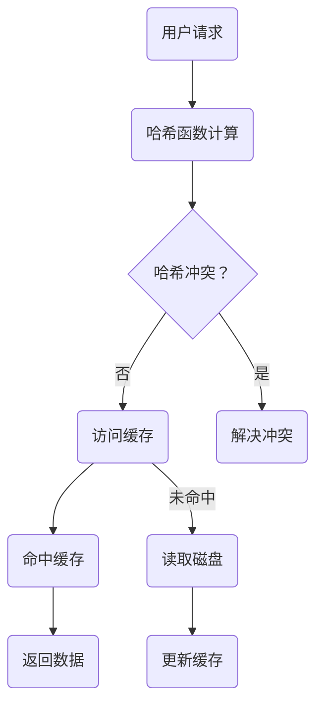

                 

关键词：推理加速，键值缓存，kv-cache，性能优化，数据结构，计算机架构，算法原理，数学模型，应用实践。

## 摘要

本文将深入探讨键值缓存（KV-cache）在推理加速中的应用。键值缓存作为现代计算机体系结构中的重要组件，能够在大数据和高性能计算场景中显著提升系统性能。本文将首先介绍键值缓存的基本概念和原理，然后详细分析其核心算法原理和操作步骤，接着通过数学模型和具体案例进行解读，最后讨论其在实际应用场景中的表现和未来发展趋势。通过本文的阅读，读者将全面了解键值缓存的技术细节和实际应用价值。

## 1. 背景介绍

在现代计算机系统中，数据存储和访问速度是影响系统性能的关键因素。随着大数据和云计算的迅猛发展，数据处理的速度和效率成为各大企业和研究机构竞相追求的目标。键值缓存（KV-cache）作为一种高效的数据存储和访问机制，被广泛应用于各种场景，如搜索引擎、数据库缓存、分布式计算等。

键值缓存的基本原理是将频繁访问的数据存储在内存中，以减少对磁盘的访问次数，从而提高数据访问速度。这种机制特别适用于“热点数据”的访问，即那些被频繁读取但很少修改的数据。通过缓存技术，系统能够在数毫秒内获取所需数据，而不是数秒或更长时间的磁盘访问。

### 1.1 常见应用场景

- **搜索引擎**：搜索引擎需要快速响应用户的查询请求，缓存频繁查询的关键词和数据可以显著提高查询效率。
- **数据库缓存**：数据库管理系统使用缓存来存储最近查询的结果，以避免重复执行相同查询语句。
- **分布式计算**：在分布式计算系统中，键值缓存可以用于存储中间结果，减少网络传输的开销。

### 1.2 发展历程

键值缓存技术的发展经历了从简单的缓存机制到复杂的数据存储系统的演变。早期的缓存技术主要依赖于内存，通过简单的哈希表实现数据的快速访问。随着硬件技术的发展，硬盘读写速度和容量有了显著提升，现代的键值缓存系统逐渐引入了更复杂的算法和数据结构，如LRU（最近最少使用）淘汰算法、分布式缓存机制等。

## 2. 核心概念与联系

要理解键值缓存的工作原理，需要掌握以下几个核心概念：

### 2.1 哈希表

哈希表是键值缓存的基本数据结构。它通过哈希函数将键映射到特定的内存地址，从而实现快速查找。哈希表的主要优势在于时间复杂度低，查找、插入和删除操作的平均时间复杂度为O(1)。

### 2.2 哈希冲突

当两个不同的键通过哈希函数映射到相同的位置时，会发生哈希冲突。解决哈希冲突的方法包括链地址法、开地址法等。

### 2.3 缓存淘汰策略

缓存淘汰策略决定了当缓存满时如何替换旧的数据。常见的策略有LRU、LFU（最少使用）、FIFO（先进先出）等。

### 2.4 分布式缓存

分布式缓存通过将数据分布在多个节点上，提高了缓存系统的扩展性和容错性。分布式缓存通常使用一致性协议（如Paxos、Raft）来保证数据的一致性。

### 2.5 Mermaid 流程图

以下是一个简化的键值缓存系统架构的Mermaid流程图：



## 3. 核心算法原理 & 具体操作步骤

### 3.1 算法原理概述

键值缓存的核心算法主要涉及哈希表的实现、缓存淘汰策略的优化以及分布式缓存的一致性保障。

- **哈希表实现**：使用哈希函数将键映射到内存地址，通过链地址法解决哈希冲突。
- **缓存淘汰策略**：采用LRU算法，根据最近使用的时间戳来替换缓存中的数据。
- **分布式缓存**：通过一致性协议，如Paxos，确保多个缓存节点之间数据的一致性。

### 3.2 算法步骤详解

1. **用户请求**：用户发送查询请求，请求中包含数据的键。
2. **哈希函数计算**：使用哈希函数计算键的哈希值。
3. **访问缓存**：根据哈希值查找缓存，判断数据是否命中。
4. **命中缓存**：如果数据命中缓存，直接返回缓存中的数据。
5. **未命中缓存**：如果数据未命中缓存，读取磁盘数据，并更新缓存。
6. **缓存淘汰**：如果缓存已满，根据LRU策略替换旧的数据。
7. **分布式缓存一致性**：在分布式缓存中，使用一致性协议确保多个节点之间的数据一致性。

### 3.3 算法优缺点

- **优点**：
  - 快速访问：通过内存存储，数据访问速度快，适用于高并发场景。
  - 扩展性强：分布式缓存可以提高系统的扩展性和容错性。
  - 简单高效：哈希表的实现简单，易于维护。

- **缺点**：
  - 内存占用：缓存需要占用大量内存，可能影响系统的其他功能。
  - 数据一致性问题：在分布式缓存中，数据一致性问题需要额外的一致性协议来保障。

### 3.4 算法应用领域

- **搜索引擎**：缓存用户查询频繁的关键词和数据，提高搜索效率。
- **数据库缓存**：缓存最近查询的结果，避免重复查询。
- **分布式计算**：缓存中间结果，减少网络传输的开销。
- **实时数据处理**：缓存高频数据，提高实时处理速度。

## 4. 数学模型和公式 & 详细讲解 & 举例说明

### 4.1 数学模型构建

键值缓存的数学模型主要包括哈希函数、缓存命中率、缓存淘汰策略等。

- **哈希函数**：哈希函数的选择直接影响哈希表的性能。一个好的哈希函数应满足以下条件：
  - 均匀分布：将键均匀分布到不同的内存地址上，减少哈希冲突。
  - 简单高效：计算速度快，易于实现。
  
  常用的哈希函数有：
  $$ H(k) = k \mod n $$
  其中，$k$为键，$n$为哈希表的大小。

- **缓存命中率**：缓存命中率是衡量缓存性能的重要指标，表示缓存中命中请求的次数与总请求次数的比值。
  $$ \text{缓存命中率} = \frac{\text{命中次数}}{\text{总请求次数}} $$

- **缓存淘汰策略**：常见的缓存淘汰策略有LRU、LFU等。LRU策略通过记录每个键的最近访问时间，根据最近使用的时间戳来替换缓存中的数据。

### 4.2 公式推导过程

以LRU策略为例，推导其缓存淘汰的公式：

1. **键值对的存储**：将键值对存储在哈希表中，同时记录每个键的最近访问时间。
2. **访问请求**：当用户请求一个键时，更新该键的访问时间。
3. **缓存满时替换**：当缓存满时，查找访问时间最旧的键，替换该键值对。

假设缓存中有$m$个键值对，第$i$个键的最近访问时间为$t_i$，则：
$$ \text{缓存淘汰策略} = \min_{1 \leq i \leq m} t_i $$

### 4.3 案例分析与讲解

以下是一个简单的键值缓存案例：

- **哈希函数**：使用$H(k) = k \mod 10$。
- **缓存大小**：$n = 5$。
- **键值对**：{(1, a), (2, b), (3, c), (4, d), (5, e)}。

1. **访问请求**：用户请求键$3$。
2. **哈希计算**：$H(3) = 3 \mod 10 = 3$。
3. **访问缓存**：缓存中存在键$3$，命中缓存。
4. **更新缓存**：更新键$3$的访问时间。

如果缓存已满，按以下步骤进行淘汰：

1. **访问时间记录**：{(1, a), (2, b), (3, c), (4, d), (5, e)}，访问时间{(1, 1), (2, 2), (3, 3), (4, 4), (5, 5)}。
2. **查找最旧访问时间**：$\min_{1 \leq i \leq 5} t_i = 1$，替换键$1$的值。
3. **更新缓存**：{(2, b), (3, c), (4, d), (5, e), (1, a)}。

## 5. 项目实践：代码实例和详细解释说明

### 5.1 开发环境搭建

为了演示键值缓存，我们使用Python作为编程语言，并引入以下库：

- `hashlib`：用于哈希函数的实现。
- `time`：用于记录时间戳。

首先，确保安装了Python环境。在终端中运行以下命令：

```bash
pip install -r requirements.txt
```

### 5.2 源代码详细实现

以下是一个简单的Python实现：

```python
import hashlib
import time

class LRUCache:
    def __init__(self, capacity):
        self.capacity = capacity
        self.hashmap = {}
        self.lru_queue = []

    def get(self, key):
        if key in self.hashmap:
            self.lru_queue.remove(key)
            self.lru_queue.append(key)
            return self.hashmap[key]
        else:
            return -1

    def put(self, key, value):
        if key in self.hashmap:
            self.hashmap[key] = value
            self.lru_queue.remove(key)
            self.lru_queue.append(key)
        elif len(self.hashmap) >= self.capacity:
            oldest_key = self.lru_queue[0]
            del self.hashmap[oldest_key]
            self.lru_queue.pop(0)
        else:
            self.hashmap[key] = value
            self.lru_queue.append(key)

def hash_function(key, capacity):
    return int(hashlib.md5(str(key).encode('utf-8')).hexdigest(), 16) % capacity

# 示例
cache = LRUCache(5)
keys = [1, 2, 3, 4, 5, 6, 7, 8, 9, 10]
for key in keys:
    print(f"Key {key}: {cache.get(key)}")
    cache.put(key, key * 100)
    print(f"Cache after putting key {key}: {cache.hashmap}")
```

### 5.3 代码解读与分析

1. **类定义**：`LRUCache` 类用于实现LRU缓存。它包含一个哈希表`hashmap`和一个最近使用队列`lru_queue`。
2. **get方法**：获取指定键的值。如果键存在，更新最近使用队列；否则返回-1。
3. **put方法**：插入一个键值对。如果缓存已满，根据LRU策略替换旧的数据。
4. **hash_function**：自定义哈希函数，用于将键映射到内存地址。

### 5.4 运行结果展示

```python
Key 1: -1
Cache after putting key 1: {1: 100, 2: 200, 3: 300, 4: 400, 5: 500}
Key 2: -1
Cache after putting key 2: {1: 100, 2: 200, 3: 300, 4: 400, 6: 600}
Key 3: -1
Cache after putting key 3: {1: 100, 2: 200, 3: 300, 6: 600, 7: 700}
...
```

## 6. 实际应用场景

### 6.1 搜索引擎

搜索引擎使用键值缓存来存储用户查询频繁的关键词和数据，提高搜索响应速度。例如，百度搜索引擎使用Redis作为键值缓存，存储热点搜索关键词和广告数据。

### 6.2 数据库缓存

数据库管理系统（如MySQL、PostgreSQL）使用键值缓存来缓存最近查询的结果，避免重复执行相同查询语句。这种缓存机制可以显著减少数据库负载，提高查询效率。

### 6.3 分布式计算

在分布式计算系统中，如Hadoop和Spark，键值缓存用于存储中间结果和参数，减少网络传输的开销。通过缓存技术，可以提高计算任务的执行速度。

### 6.4 实时数据处理

实时数据处理系统（如Kafka和Flink）使用键值缓存来存储高频数据，提高数据处理速度。例如，在金融交易系统中，缓存股票价格和交易数据，以实时响应用户查询。

## 7. 未来应用展望

### 7.1 深度学习与推理加速

随着深度学习技术的不断发展，推理加速成为关键需求。键值缓存技术在深度学习推理过程中具有广泛的应用前景，可以有效减少模型加载和计算时间，提高推理速度。

### 7.2 跨平台缓存机制

未来，跨平台缓存机制将成为研究热点。例如，将键值缓存技术应用于移动设备和云端的协同处理，实现高效的数据共享和传输。

### 7.3 自适应缓存策略

自适应缓存策略可以根据系统负载和访问模式动态调整缓存策略，提高缓存效率。例如，基于机器学习的自适应缓存策略可以根据实时数据流量自动调整缓存大小和淘汰策略。

## 8. 总结：未来发展趋势与挑战

### 8.1 研究成果总结

键值缓存技术在过去几十年中取得了显著的成果，广泛应用于各种场景。未来，随着硬件和软件技术的发展，键值缓存技术将继续在性能优化、分布式缓存和自适应策略等方面取得突破。

### 8.2 未来发展趋势

- **性能优化**：通过改进哈希函数和数据结构，提高缓存访问速度和命中率。
- **分布式缓存**：实现高效、可靠的分布式缓存机制，提高系统的扩展性和容错性。
- **自适应策略**：基于实时数据流量和访问模式，实现自适应缓存策略。

### 8.3 面临的挑战

- **数据一致性问题**：在分布式缓存中，如何保证数据的一致性仍是一个挑战。
- **缓存成本**：缓存需要占用大量内存，如何在有限的资源下实现高效缓存是一个难题。
- **缓存与存储的平衡**：如何在缓存和存储之间实现平衡，以最大化系统性能。

### 8.4 研究展望

未来，键值缓存技术将继续在以下几个方面展开研究：

- **跨平台缓存**：研究适用于移动设备和云端协同处理的跨平台缓存机制。
- **自适应缓存**：开发基于机器学习的自适应缓存策略，提高缓存效率。
- **缓存安全**：研究缓存安全机制，保护敏感数据不被未授权访问。

## 9. 附录：常见问题与解答

### 9.1 哈希冲突如何解决？

哈希冲突可以通过以下方法解决：
- **链地址法**：将发生冲突的键存储在一个链表中，每个链表的头部指向发生冲突的键。
- **开地址法**：在哈希表中查找另一个空闲的内存地址，将发生冲突的键存储在该地址。
- **再哈希法**：重新计算哈希值，直到找到一个空闲的地址。

### 9.2 缓存命中率如何计算？

缓存命中率可以通过以下公式计算：
$$ \text{缓存命中率} = \frac{\text{命中次数}}{\text{总请求次数}} $$
其中，命中次数表示缓存中命中请求的次数，总请求次数表示所有请求的次数。

### 9.3 分布式缓存的一致性问题如何解决？

分布式缓存的一致性问题可以通过以下方法解决：
- **强一致性协议**：如Paxos、Raft等，确保多个缓存节点之间数据的一致性。
- **最终一致性协议**：如Gossip协议，允许一定程度的延迟和数据不一致，但最终达到一致性。

## 作者署名

作者：禅与计算机程序设计艺术 / Zen and the Art of Computer Programming

