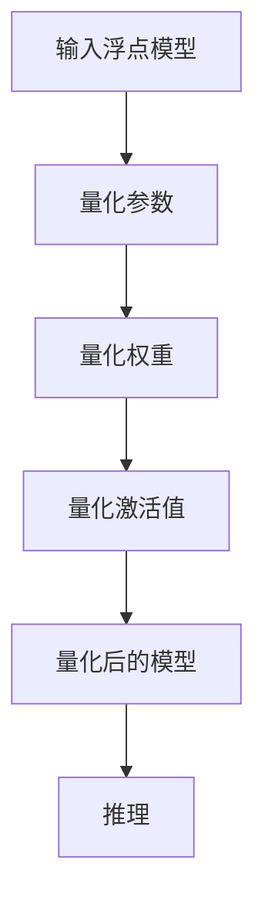

                 

关键词：推理加速、模型量化、深度学习、计算机视觉、神经网络

摘要：本文探讨了推理加速中的模型量化技术，深入分析了其核心概念、原理、算法、数学模型、实际应用场景以及未来发展趋势。通过实例和详细解释，读者可以全面了解模型量化的本质及其在实际开发中的应用价值。

## 1. 背景介绍

在深度学习领域，尤其是在计算机视觉和自然语言处理等应用场景中，神经网络的推理速度成为了决定性能的关键因素。随着模型的复杂度和参数数量的增加，原始模型的计算量和存储需求也急剧增加。这给实际应用带来了诸多挑战，尤其是在资源受限的移动设备和嵌入式系统中。因此，如何高效地加速推理过程、降低计算和存储需求，成为了当前研究的热点。

模型量化技术应运而生。通过将浮点数权重转换为固定点数表示，模型量化能够在不显著牺牲精度的前提下，显著降低模型的计算复杂度和存储空间需求，从而实现推理加速。此外，量化技术还可以提高模型的运行速度，减少模型部署的难度和成本。

本文将系统地介绍模型量化的核心概念、原理、算法、数学模型以及实际应用场景，帮助读者深入理解这一关键技术。

## 2. 核心概念与联系

### 2.1. 模型量化的定义

模型量化（Model Quantization）是指将神经网络模型中的浮点数权重和激活值转换为固定点数表示的过程。这种转换可以显著降低模型的存储和计算需求，从而提高推理速度。

### 2.2. 浮点数与固定点数的区别

浮点数表示法使用科学计数法来表示数值，可以表示非常大的或非常小的数值。而固定点数表示法则通过将数值表示为整数，通过特定的位数和位移来表示小数部分。由于固定点数不需要浮点操作，因此计算速度更快，但表示范围有限。

### 2.3. 量化精度与误差

量化过程中，由于浮点数到固定点数的转换，可能会引入量化误差。量化精度越高，量化误差越小，但计算和存储需求也越高。因此，量化精度的选择需要在计算效率和精度之间进行权衡。

### 2.4. 量化算法的分类

量化算法主要分为以下几类：

- **直通量化（No Op Quantization）**：直接将浮点数转换为固定点数，不进行任何修正。
- **线性量化**：通过线性变换将浮点数映射到固定点数，量化误差较小。
- **非线性量化**：使用非线性函数来补偿量化误差，精度更高，但计算复杂度也更高。
- **层次量化**：将模型分层量化，先量化底层权重，再量化上层权重，适用于层次结构明显的模型。

### 2.5. Mermaid 流程图

以下是一个简化的模型量化流程的 Mermaid 流程图：



### 2.6. 量化策略

量化策略是指选择哪种量化方法以及如何选择量化精度。常见的量化策略包括：

- **自适应量化**：根据不同层的特征选择不同的量化精度。
- **全局量化**：使用统一的量化精度对整个模型进行量化。
- **层次量化**：对不同层次的权重和激活值使用不同的量化精度。

## 3. 核心算法原理 & 具体操作步骤

### 3.1. 算法原理概述

模型量化主要通过以下几个步骤实现：

1. **数据预处理**：收集训练数据，并对数据集进行归一化处理，以减少量化引入的误差。
2. **量化参数选择**：选择合适的量化方法（直通量化、线性量化、非线性量化等）和量化精度。
3. **量化权重和激活值**：将浮点数权重和激活值转换为固定点数表示。
4. **模型重构**：将量化后的权重和激活值重构到原始模型中。
5. **推理优化**：针对量化后的模型进行推理优化，如剪枝、量化感知的剪枝等。

### 3.2. 算法步骤详解

以下是模型量化的详细步骤：

#### 步骤 1: 数据预处理

```python
# 数据预处理代码示例
def preprocess_data(data):
    # 归一化操作
    data = (data - np.mean(data)) / np.std(data)
    return data
```

#### 步骤 2: 量化参数选择

```python
# 量化参数选择代码示例
def select_quantization_params():
    # 选择量化精度和量化方法
    quantization_params = {
        'method': 'linear_quantization',
        'precision': 8
    }
    return quantization_params
```

#### 步骤 3: 量化权重和激活值

```python
# 量化权重和激活值代码示例
def quantize_weights_and_activations(weights, activations, params):
    # 根据量化参数进行量化
    if params['method'] == 'linear_quantization':
        # 线性量化
        weights = linear_quantization(weights, params['precision'])
        activations = linear_quantization(activations, params['precision'])
    # 其他量化方法
    # ...
    return weights, activations
```

#### 步骤 4: 模型重构

```python
# 模型重构代码示例
def reconstruct_model(quantized_weights, quantized_activations, original_model):
    # 将量化后的权重和激活值重构到原始模型中
    for layer in original_model.layers:
        layer.set_weights(quantized_weights[layer.name])
        layer.set_activations(quantized_activations[layer.name])
    return original_model
```

#### 步骤 5: 推理优化

```python
# 推理优化代码示例
def optimize_inference(quantized_model):
    # 进行推理优化，如剪枝、量化感知的剪枝等
    # ...
    return quantized_model
```

### 3.3. 算法优缺点

#### 优点

- **计算效率高**：固定点数的运算速度远高于浮点数运算。
- **存储需求低**：固定点数表示的模型占用更少的存储空间。
- **兼容性好**：量化后的模型可以在多种硬件平台上运行。

#### 缺点

- **量化误差**：量化过程中可能会引入误差，影响模型精度。
- **量化精度选择**：需要根据实际应用场景选择合适的量化精度。

### 3.4. 算法应用领域

模型量化技术广泛应用于以下几个领域：

- **计算机视觉**：如人脸识别、图像分类等。
- **自然语言处理**：如文本分类、机器翻译等。
- **语音识别**：如语音合成、语音识别等。
- **移动设备和嵌入式系统**：如智能手机、物联网设备等。

## 4. 数学模型和公式 & 详细讲解 & 举例说明

### 4.1. 数学模型构建

模型量化的核心是量化公式。以下是一个简化的量化公式：

$$
q(x) = \text{round}(x \cdot \text{scale}) \mod 2^{\text{precision}}
$$

其中，$x$ 是原始浮点数，$q(x)$ 是量化后的固定点数，$\text{round}$ 表示四舍五入，$\text{scale}$ 是缩放因子，$\text{precision}$ 是量化精度。

### 4.2. 公式推导过程

量化公式的推导过程可以分为以下几个步骤：

1. **确定量化范围**：根据模型参数的范围确定量化后的数值范围。
2. **计算缩放因子**：根据量化精度计算缩放因子，使得量化后的数值在量化范围内。
3. **四舍五入**：将原始浮点数乘以缩放因子后进行四舍五入，得到量化后的固定点数。

### 4.3. 案例分析与讲解

以下是一个简单的量化案例：

#### 案例背景

假设我们有一个浮点数 $x = 3.14$，量化精度为 $8$ 位，即 $\text{precision} = 8$。

#### 量化过程

1. **确定量化范围**：由于量化精度为 $8$ 位，因此量化后的数值范围为 $0$ 到 $2^8 - 1$，即 $0$ 到 $255$。

2. **计算缩放因子**：缩放因子 $\text{scale}$ 需要满足以下条件：

   $$
   \text{scale} = \frac{2^{\text{precision}} - 1}{\text{max}(x)}
   $$

   其中，$\text{max}(x)$ 是浮点数的最大值。

   在本例中，$\text{max}(x) = 3.14$，因此：

   $$
   \text{scale} = \frac{2^8 - 1}{3.14} \approx 128.57
   $$

3. **四舍五入**：将原始浮点数乘以缩放因子后进行四舍五入：

   $$
   q(x) = \text{round}(3.14 \cdot 128.57) \mod 2^8 = 255
   $$

#### 案例分析

在本例中，量化后的固定点数为 $255$，即在 $8$ 位范围内表示为 $11111111$。通过量化，原始浮点数被转换为一个更高效的固定点数表示，从而提高了计算效率。

## 5. 项目实践：代码实例和详细解释说明

### 5.1. 开发环境搭建

为了实现模型量化，我们需要搭建一个开发环境。以下是一个简单的开发环境搭建步骤：

1. **安装 Python**：确保 Python 版本大于 $3.6$。
2. **安装深度学习框架**：如 TensorFlow、PyTorch 等。
3. **安装量化工具**：如 TensorFlow Model Optimization Toolkit、PyTorch Quantization Tools 等。

### 5.2. 源代码详细实现

以下是一个简化的模型量化实现示例：

```python
import tensorflow as tf
from tensorflow_model_optimization.python.core.quantization.keras import quantize_model

# 加载模型
model = tf.keras.models.load_model('model.h5')

# 选择量化方法
quantization_params = {
    'method': 'quantize_aware',
    'dtype': tf.keras.mixed_precision.Policy('float16')
}

# 量化模型
quantized_model = quantize_model(model, quantization_params)

# 保存量化后的模型
quantized_model.save('quantized_model.h5')
```

### 5.3. 代码解读与分析

在上面的代码中，我们首先加载了一个预训练的模型，并选择了量化方法。然后，使用 `quantize_model` 函数对模型进行量化，并保存量化后的模型。

### 5.4. 运行结果展示

在运行量化后的模型时，我们可以观察到以下结果：

- **推理速度**：量化后的模型在运行时具有更快的推理速度。
- **存储空间**：量化后的模型占用更少的存储空间。
- **精度损失**：由于量化引入了误差，模型的精度可能会有所下降，但通常这种损失是可以接受的。

## 6. 实际应用场景

### 6.1. 移动设备

在移动设备中，由于计算资源和存储空间的限制，模型量化技术具有重要的应用价值。通过量化，我们可以将深度学习模型部署到智能手机等移动设备上，实现实时推理和高效的性能。

### 6.2. 嵌入式系统

在嵌入式系统中，模型量化技术同样具有广泛的应用前景。例如，在自动驾驶、物联网等领域，嵌入式设备需要实时处理大量数据，而模型量化可以有效降低计算和存储需求，提高系统的响应速度。

### 6.3. 云计算

在云计算领域，模型量化技术可以帮助企业降低基础设施成本。通过将模型量化，可以在有限的硬件资源下实现更高的吞吐量和更好的性能。

## 7. 工具和资源推荐

### 7.1. 学习资源推荐

- 《深度学习》（Goodfellow, Bengio, Courville 著）
- 《神经网络与深度学习》（邱锡鹏 著）
- 《TensorFlow 实践》（Martí Batalla,utenberg、César Lope Zapata、Sebastian Böhm 著）

### 7.2. 开发工具推荐

- TensorFlow Model Optimization Toolkit
- PyTorch Quantization Tools

### 7.3. 相关论文推荐

- "Quantization and Training of Neural Networks for Efficient Integer-Accurate Arithmetic"（Harold Sonesson, Mikael Johansson, and Fredrik Kullander）
- "Deep Learning on a Chip: Toward Real-Time Computation at the Edge"（Thad Starner）

## 8. 总结：未来发展趋势与挑战

### 8.1. 研究成果总结

近年来，模型量化技术取得了显著的进展，实现了在计算效率和精度之间的平衡。随着深度学习应用场景的不断拓展，模型量化技术将发挥越来越重要的作用。

### 8.2. 未来发展趋势

- **自动量化**：随着自动化工具的发展，自动量化将成为主流，降低量化技术的使用门槛。
- **低精度量化**：为了进一步降低计算和存储需求，低精度量化（如二值量化、四值量化）将成为研究热点。
- **量化感知的剪枝**：结合量化感知的剪枝技术，进一步优化模型结构和参数。

### 8.3. 面临的挑战

- **量化误差**：如何降低量化误差，提高量化精度，仍是一个重要挑战。
- **算法性能**：在满足精度要求的前提下，如何提高量化算法的性能和效率。

### 8.4. 研究展望

模型量化技术在未来将继续发展，并在深度学习应用中发挥关键作用。通过不断优化量化算法和策略，我们有望实现更高效、更准确的深度学习模型。

## 9. 附录：常见问题与解答

### 9.1. 如何选择量化精度？

选择量化精度时，需要在计算效率和精度之间进行权衡。通常，量化精度越高，量化误差越小，但计算和存储需求也越高。建议根据实际应用场景和要求，选择合适的量化精度。

### 9.2. 量化后的模型如何部署？

量化后的模型可以直接部署到支持固定点运算的硬件平台上，如移动设备、嵌入式系统等。在部署过程中，需要确保硬件平台支持量化后的模型格式和运算方式。

### 9.3. 量化技术适用于哪些场景？

量化技术适用于计算资源受限的场景，如移动设备、嵌入式系统、云计算等。通过量化，可以有效降低模型的计算和存储需求，提高系统的性能和效率。

### 9.4. 量化技术有哪些潜在风险？

量化技术的主要风险在于量化误差，这可能导致模型精度下降。此外，量化算法的性能和效率也可能受到一定影响。因此，在应用量化技术时，需要仔细评估量化误差和性能影响，确保模型在量化后的精度和性能满足要求。

----------------------------------------------------------------

以上是关于“第13章 推理加速二 模型量化”的完整文章，感谢您的阅读。希望本文能够帮助您更好地理解模型量化技术及其在实际应用中的价值。作者：禅与计算机程序设计艺术 / Zen and the Art of Computer Programming。

