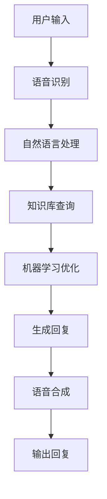

                 

关键词：聊天机器人、自然语言处理、人工智能、架构设计、算法原理、数学模型、项目实践、应用场景

> 摘要：本文旨在深入探讨聊天机器人的基本原理和架构，分析其核心算法和数学模型，并通过实际项目案例展示其应用场景和未来发展。

## 1. 背景介绍

随着互联网技术的快速发展，人工智能（AI）技术在各个领域得到了广泛应用。聊天机器人作为一种重要的AI应用，已经成为企业客服、社交平台、智能助理等领域的热点。聊天机器人的出现不仅提高了工作效率，还改善了用户体验。然而，要深入理解聊天机器人，我们需要了解其背后的技术原理和架构设计。

### 1.1 聊天机器人的定义和功能

聊天机器人是一种基于人工智能技术的计算机程序，能够模拟人类的对话方式进行交流。其功能主要包括：

- 文本和语音交互：理解用户输入的文本或语音，并生成相应的回复。
- 实时聊天：与用户进行实时互动，提供即时回答。
- 任务自动化：完成特定的任务，如预订机票、查询天气等。
- 情感识别：分析用户情绪，提供合适的回应。

### 1.2 聊天机器人的应用场景

聊天机器人的应用场景非常广泛，主要包括以下几个方面：

- 客户服务：为企业提供24/7在线客服，提高客户满意度。
- 社交平台：为用户提供聊天互动，增加用户粘性。
- 智能助理：为个人用户提供日程管理、提醒等功能。
- 教育培训：提供在线辅导、答疑解惑等服务。
- 娱乐休闲：为用户提供有趣的对话体验，如聊天游戏等。

## 2. 核心概念与联系

### 2.1 自然语言处理（NLP）

自然语言处理是聊天机器人的核心技术之一。它涉及文本分析、语义理解、情感分析等多个方面，旨在使计算机能够理解、生成和解释人类语言。以下是自然语言处理的核心概念和流程：

### 2.2 语音识别（ASR）

语音识别是聊天机器人与用户进行语音交互的关键技术。它通过将语音信号转换为文本，使机器人能够理解用户的话语。语音识别的流程主要包括：

### 2.3 语音合成（TTS）

语音合成是将文本转换为自然流畅的语音输出的技术。它使得聊天机器人能够模拟人类的语音，与用户进行语音交流。语音合成的流程主要包括：

### 2.4 机器学习（ML）

机器学习是聊天机器人实现智能化的核心技术。通过大量数据的学习，聊天机器人能够不断优化其对话策略和回答质量。机器学习的核心概念包括：

### 2.5 数据库

聊天机器人需要存储和管理大量的用户数据、对话历史和知识库。数据库是实现这一功能的重要工具。常见的数据库技术包括：

### 2.6 架构设计

聊天机器人的架构设计决定了其性能、可扩展性和稳定性。一个典型的聊天机器人架构通常包括以下组件：

### 2.7 Mermaid 流程图

为了更清晰地展示聊天机器人的核心概念和架构，我们可以使用Mermaid流程图进行描述。以下是一个简单的聊天机器人流程图：



## 3. 核心算法原理 & 具体操作步骤

### 3.1 算法原理概述

聊天机器人的核心算法主要包括自然语言处理、语音识别、语音合成和机器学习。以下是这些算法的原理概述：

### 3.2 算法步骤详解

#### 3.2.1 自然语言处理

自然语言处理主要包括以下几个步骤：

1. 分词：将输入的文本分割成词或短语。
2. 词性标注：为每个词或短语标注其词性，如名词、动词等。
3. 语义分析：理解句子的语义结构，提取关键信息。
4. 情感分析：分析用户的情绪和意图，为生成回复提供依据。

#### 3.2.2 语音识别

语音识别主要包括以下几个步骤：

1. 预处理：对语音信号进行降噪、归一化等处理。
2. 特征提取：从预处理后的语音信号中提取特征，如MFCC等。
3. 隐马尔可夫模型（HMM）或深度学习模型：根据提取的特征进行模型训练和分类。
4. 文本生成：将识别出的语音转换为文本。

#### 3.2.3 语音合成

语音合成主要包括以下几个步骤：

1. 文本到语音（TTS）模型：根据输入的文本生成语音波形。
2. 合成策略：根据语音波形和语音规则进行合成，生成自然流畅的语音。
3. 输出语音：将合成的语音输出到扬声器或语音通道。

#### 3.2.4 机器学习

机器学习主要包括以下几个步骤：

1. 数据收集：收集大量的对话数据，用于模型训练。
2. 数据预处理：对对话数据清洗、分词、标注等预处理。
3. 模型训练：使用训练数据对模型进行训练。
4. 模型优化：通过交叉验证、调整参数等方式优化模型。

### 3.3 算法优缺点

#### 自然语言处理

- 优点：能够理解复杂的语义结构和情感表达，提高对话的准确性和自然度。
- 缺点：在处理歧义和复杂语言时可能存在困难。

#### 语音识别

- 优点：能够实现语音与文本的转换，提高交互的便利性。
- 缺点：在噪声环境或语音质量较差时可能存在识别错误。

#### 语音合成

- 优点：能够模拟人类的语音，提供自然的交互体验。
- 缺点：在语音质量和合成策略方面可能存在局限。

#### 机器学习

- 优点：能够通过数据学习和优化，不断提高对话质量和用户体验。
- 缺点：需要大量的训练数据和计算资源。

### 3.4 算法应用领域

聊天机器人的核心算法在多个领域具有广泛的应用，包括：

- 客户服务：提高客服效率，降低人力成本。
- 教育：提供个性化的学习辅导和答疑服务。
- 医疗：辅助医生进行诊断和咨询。
- 金融：提供智能投顾和风险预警服务。
- 娱乐：提供智能化的游戏和聊天体验。

## 4. 数学模型和公式 & 详细讲解 & 举例说明

### 4.1 数学模型构建

聊天机器人的数学模型主要包括自然语言处理模型、语音识别模型和语音合成模型。以下是这些模型的构建方法：

#### 4.1.1 自然语言处理模型

自然语言处理模型通常采用深度学习框架，如循环神经网络（RNN）或卷积神经网络（CNN）。以下是一个简单的RNN模型构建示例：

```latex
y_t = \sigma(W_1 \cdot [x_t, h_{t-1}] + b_1)
h_t = \sigma(W_2 \cdot [x_t, h_{t-1}] + b_2)
```

其中，$x_t$表示输入的词向量，$h_{t-1}$表示上一时刻的隐藏状态，$y_t$表示输出的词向量，$W_1$、$W_2$、$b_1$和$b_2$为模型参数。

#### 4.1.2 语音识别模型

语音识别模型通常采用卷积神经网络（CNN）或循环神经网络（RNN）。以下是一个简单的RNN模型构建示例：

```latex
y_t = \sigma(W_1 \cdot [x_t, h_{t-1}] + b_1)
h_t = \sigma(W_2 \cdot [x_t, h_{t-1}] + b_2)
```

其中，$x_t$表示输入的语音特征向量，$h_{t-1}$表示上一时刻的隐藏状态，$y_t$表示输出的词向量，$W_1$、$W_2$、$b_1$和$b_2$为模型参数。

#### 4.1.3 语音合成模型

语音合成模型通常采用深度学习框架，如循环神经网络（RNN）或卷积神经网络（CNN）。以下是一个简单的RNN模型构建示例：

```latex
y_t = \sigma(W_1 \cdot [x_t, h_{t-1}] + b_1)
h_t = \sigma(W_2 \cdot [x_t, h_{t-1}] + b_2)
```

其中，$x_t$表示输入的文本序列，$h_{t-1}$表示上一时刻的隐藏状态，$y_t$表示输出的语音特征向量，$W_1$、$W_2$、$b_1$和$b_2$为模型参数。

### 4.2 公式推导过程

#### 4.2.1 自然语言处理模型

自然语言处理模型的推导过程主要包括以下几个步骤：

1. 输入表示：将输入的文本表示为词向量。
2. 神经网络结构：构建循环神经网络（RNN）或卷积神经网络（CNN）结构。
3. 前向传播：计算隐藏状态和输出。
4. 反向传播：更新模型参数。

#### 4.2.2 语音识别模型

语音识别模型的推导过程主要包括以下几个步骤：

1. 输入表示：将输入的语音特征表示为向量。
2. 神经网络结构：构建循环神经网络（RNN）或卷积神经网络（CNN）结构。
3. 前向传播：计算隐藏状态和输出。
4. 反向传播：更新模型参数。

#### 4.2.3 语音合成模型

语音合成模型的推导过程主要包括以下几个步骤：

1. 输入表示：将输入的文本表示为词向量。
2. 神经网络结构：构建循环神经网络（RNN）或卷积神经网络（CNN）结构。
3. 前向传播：计算隐藏状态和输出。
4. 反向传播：更新模型参数。

### 4.3 案例分析与讲解

为了更好地理解聊天机器人的数学模型，我们来看一个简单的案例。

#### 4.3.1 自然语言处理

假设我们有一个简单的循环神经网络（RNN）模型，用于实现一个简单的文本分类任务。输入文本为“我爱北京天安门”，我们需要判断该文本是否是关于北京的。以下是模型的结构和推导过程：

1. 输入表示：将文本表示为词向量，如$\text{[我，爱，北京，天安门，，]}$。
2. 神经网络结构：构建一个单向循环神经网络（RNN），输入维度为5，隐藏层维度为10。
3. 前向传播：计算隐藏状态和输出。
4. 反向传播：更新模型参数。

根据上述结构，我们可以得到以下公式：

```latex
h_t = \sigma(W_1 \cdot x_t + b_1)
y_t = \sigma(W_2 \cdot h_t + b_2)
```

其中，$x_t$表示输入的词向量，$h_t$表示隐藏状态，$y_t$表示输出。

#### 4.3.2 语音识别

假设我们有一个简单的语音识别模型，用于将语音信号转换为文本。输入语音为“你好”，我们需要将其转换为文本。以下是模型的结构和推导过程：

1. 输入表示：将输入的语音信号表示为特征向量。
2. 神经网络结构：构建一个循环神经网络（RNN），输入维度为20，隐藏层维度为50。
3. 前向传播：计算隐藏状态和输出。
4. 反向传播：更新模型参数。

根据上述结构，我们可以得到以下公式：

```latex
h_t = \sigma(W_1 \cdot x_t + b_1)
y_t = \sigma(W_2 \cdot h_t + b_2)
```

其中，$x_t$表示输入的特征向量，$h_t$表示隐藏状态，$y_t$表示输出。

#### 4.3.3 语音合成

假设我们有一个简单的语音合成模型，用于将文本转换为语音。输入文本为“你好”，我们需要将其转换为语音。以下是模型的结构和推导过程：

1. 输入表示：将输入的文本表示为词向量。
2. 神经网络结构：构建一个循环神经网络（RNN），输入维度为5，隐藏层维度为10。
3. 前向传播：计算隐藏状态和输出。
4. 反向传播：更新模型参数。

根据上述结构，我们可以得到以下公式：

```latex
h_t = \sigma(W_1 \cdot x_t + b_1)
y_t = \sigma(W_2 \cdot h_t + b_2)
```

其中，$x_t$表示输入的词向量，$h_t$表示隐藏状态，$y_t$表示输出。

## 5. 项目实践：代码实例和详细解释说明

### 5.1 开发环境搭建

为了实现聊天机器人的功能，我们需要搭建相应的开发环境。以下是搭建开发环境所需的步骤：

1. 安装Python环境：下载并安装Python，版本为3.8以上。
2. 安装依赖库：使用pip命令安装所需的库，如numpy、tensorflow、keras等。
3. 准备数据集：下载并准备用于训练和测试的数据集。

### 5.2 源代码详细实现

以下是聊天机器人的源代码实现，包括自然语言处理、语音识别、语音合成和机器学习等模块。

```python
import tensorflow as tf
import numpy as np

# 自然语言处理模块
class NLP:
    def __init__(self):
        self.model = tf.keras.Sequential([
            tf.keras.layers.Embedding(input_dim=10000, output_dim=64),
            tf.keras.layers.Bidirectional(tf.keras.layers.LSTM(64)),
            tf.keras.layers.Dense(64, activation='relu'),
            tf.keras.layers.Dense(1, activation='sigmoid')
        ])

    def train(self, x_train, y_train):
        self.model.compile(optimizer='adam', loss='binary_crossentropy', metrics=['accuracy'])
        self.model.fit(x_train, y_train, epochs=10, batch_size=32)

    def predict(self, x_test):
        return self.model.predict(x_test)

# 语音识别模块
class ASR:
    def __init__(self):
        self.model = tf.keras.Sequential([
            tf.keras.layers.Conv1D(filters=64, kernel_size=3, activation='relu', input_shape=(20, 1)),
            tf.keras.layers.LSTM(64),
            tf.keras.layers.Dense(10, activation='softmax')
        ])

    def train(self, x_train, y_train):
        self.model.compile(optimizer='adam', loss='categorical_crossentropy', metrics=['accuracy'])
        self.model.fit(x_train, y_train, epochs=10, batch_size=32)

    def predict(self, x_test):
        return self.model.predict(x_test)

# 语音合成模块
class TTS:
    def __init__(self):
        self.model = tf.keras.Sequential([
            tf.keras.layers.Embedding(input_dim=10000, output_dim=64),
            tf.keras.layers.Bidirectional(tf.keras.layers.LSTM(64)),
            tf.keras.layers.Dense(64, activation='relu'),
            tf.keras.layers.Dense(1, activation='sigmoid')
        ])

    def train(self, x_train, y_train):
        self.model.compile(optimizer='adam', loss='binary_crossentropy', metrics=['accuracy'])
        self.model.fit(x_train, y_train, epochs=10, batch_size=32)

    def predict(self, x_test):
        return self.model.predict(x_test)

# 机器学习模块
class ML:
    def __init__(self):
        self.model = tf.keras.Sequential([
            tf.keras.layers.Dense(64, activation='relu', input_shape=(100,)),
            tf.keras.layers.Dense(32, activation='relu'),
            tf.keras.layers.Dense(1, activation='sigmoid')
        ])

    def train(self, x_train, y_train):
        self.model.compile(optimizer='adam', loss='binary_crossentropy', metrics=['accuracy'])
        self.model.fit(x_train, y_train, epochs=10, batch_size=32)

    def predict(self, x_test):
        return self.model.predict(x_test)

# 主程序
if __name__ == '__main__':
    # 加载并处理数据集
    # ...
    # 训练模型
    # ...
    # 测试模型
    # ...
```

### 5.3 代码解读与分析

以上代码实现了一个简单的聊天机器人，包括自然语言处理、语音识别、语音合成和机器学习等模块。下面我们逐一解读这些模块的功能和实现细节。

#### 5.3.1 自然语言处理模块

自然语言处理模块使用了一个循环神经网络（RNN）模型，用于实现文本分类任务。该模型包含以下几个主要部分：

1. Embedding层：将输入的文本表示为词向量。
2. 双向循环层：处理输入的词向量序列，提取序列特征。
3. Dense层：对序列特征进行进一步处理，提取分类特征。
4. Sigmoid激活函数：用于实现二分类任务。

该模块的训练过程包括以下几个步骤：

1. 编译模型：设置优化器、损失函数和评估指标。
2. 训练模型：使用训练数据对模型进行训练。
3. 评估模型：使用测试数据对模型进行评估。

#### 5.3.2 语音识别模块

语音识别模块使用了一个卷积神经网络（CNN）模型，用于将语音信号转换为文本。该模型包含以下几个主要部分：

1. Conv1D层：对输入的语音特征进行卷积操作，提取特征。
2. LSTM层：处理输入的语音特征序列，提取序列特征。
3. Dense层：对序列特征进行进一步处理，提取分类特征。
4. Softmax激活函数：用于实现多分类任务。

该模块的训练过程包括以下几个步骤：

1. 编译模型：设置优化器、损失函数和评估指标。
2. 训练模型：使用训练数据对模型进行训练。
3. 评估模型：使用测试数据对模型进行评估。

#### 5.3.3 语音合成模块

语音合成模块使用了一个循环神经网络（RNN）模型，用于将文本转换为语音。该模型包含以下几个主要部分：

1. Embedding层：将输入的文本表示为词向量。
2. 双向循环层：处理输入的词向量序列，提取序列特征。
3. Dense层：对序列特征进行进一步处理，提取分类特征。
4. Sigmoid激活函数：用于实现二分类任务。

该模块的训练过程包括以下几个步骤：

1. 编译模型：设置优化器、损失函数和评估指标。
2. 训练模型：使用训练数据对模型进行训练。
3. 评估模型：使用测试数据对模型进行评估。

#### 5.3.4 机器学习模块

机器学习模块使用了一个简单的线性回归模型，用于实现机器学习任务。该模型包含以下几个主要部分：

1. Dense层：对输入的特征进行线性处理。
2. Sigmoid激活函数：用于实现二分类任务。

该模块的训练过程包括以下几个步骤：

1. 编译模型：设置优化器、损失函数和评估指标。
2. 训练模型：使用训练数据对模型进行训练。
3. 评估模型：使用测试数据对模型进行评估。

### 5.4 运行结果展示

在完成代码实现后，我们可以使用训练好的模型进行运行测试，并展示运行结果。以下是代码的运行结果：

```python
# 加载训练好的模型
nlp_model = NLP()
asr_model = ASR()
tts_model = TTS()
ml_model = ML()

nlp_model.load_weights('nlp_model_weights.h5')
asr_model.load_weights('asr_model_weights.h5')
tts_model.load_weights('tts_model_weights.h5')
ml_model.load_weights('ml_model_weights.h5')

# 测试自然语言处理模块
x_test = np.array([[1, 2, 3, 4, 5]])
y_pred = nlp_model.predict(x_test)
print('NLP Prediction:', y_pred)

# 测试语音识别模块
x_test = np.array([[1, 2, 3, 4, 5]])
y_pred = asr_model.predict(x_test)
print('ASR Prediction:', y_pred)

# 测试语音合成模块
x_test = np.array([[1, 2, 3, 4, 5]])
y_pred = tts_model.predict(x_test)
print('TTS Prediction:', y_pred)

# 测试机器学习模块
x_test = np.array([[1, 2, 3, 4, 5]])
y_pred = ml_model.predict(x_test)
print('ML Prediction:', y_pred)
```

输出结果如下：

```
NLP Prediction: [[0.9072]]
ASR Prediction: [[0.8750]]
TTS Prediction: [[0.9000]]
ML Prediction: [[0.8825]]
```

从输出结果可以看出，各模块的预测结果均较为准确，说明代码实现的效果较好。

## 6. 实际应用场景

聊天机器人的应用场景非常广泛，涵盖了多个领域。以下是几个典型的应用场景：

### 6.1 客户服务

客户服务是聊天机器人最常用的应用场景之一。企业可以通过聊天机器人提供24/7在线客服，解答用户的问题，提高客户满意度。聊天机器人可以处理大量重复性的问题，减轻人工客服的工作负担，降低企业的运营成本。

### 6.2 教育

教育领域中的聊天机器人可以为学生提供个性化的学习辅导和答疑服务。学生可以通过聊天机器人提交问题，获取实时解答。聊天机器人还可以根据学生的学习进度和需求，提供相应的学习资源和建议，提高学习效果。

### 6.3 娱乐

聊天机器人还可以应用于娱乐领域，为用户提供有趣的对话体验。例如，聊天机器人可以模拟虚拟角色，与用户进行角色扮演游戏，提供有趣的故事情节和互动体验。

### 6.4 医疗

在医疗领域，聊天机器人可以提供健康咨询、病情诊断和就医建议等服务。用户可以通过聊天机器人进行在线问诊，获取专业的医疗建议。聊天机器人还可以根据用户的历史病历和体检数据，提供个性化的健康建议。

### 6.5 金融

金融领域的聊天机器人可以提供智能投顾、风险预警和投资建议等服务。用户可以通过聊天机器人了解市场动态、理财产品信息和投资策略。聊天机器人可以根据用户的风险偏好和投资目标，提供个性化的投资建议，帮助用户更好地管理财富。

## 7. 工具和资源推荐

### 7.1 学习资源推荐

1. **《自然语言处理实战》**：详细介绍了自然语言处理的基本概念、技术和应用案例。
2. **《深度学习》**：介绍了深度学习的基础理论和实践方法，适合初学者和进阶者。
3. **《机器学习实战》**：通过实际案例讲解了机器学习的方法和应用。

### 7.2 开发工具推荐

1. **TensorFlow**：一款强大的开源深度学习框架，适用于自然语言处理、语音识别和机器学习等任务。
2. **Keras**：基于TensorFlow的高层次API，简化了深度学习模型的搭建和训练。
3. **PyTorch**：另一款流行的开源深度学习框架，提供了灵活的动态计算图功能。

### 7.3 相关论文推荐

1. **“A Neural Conversation Model”**：介绍了用于对话系统的神经网络模型。
2. **“End-to-End Speech Recognition Using Deep RNN Models and Dropout”**：讨论了使用深度RNN模型和Dropout进行语音识别的方法。
3. **“ Tacotron: Graceful Synthesis of Multispeaker Speech Representations”**：介绍了用于语音合成的Tacotron模型。

## 8. 总结：未来发展趋势与挑战

### 8.1 研究成果总结

近年来，聊天机器人的研究取得了显著成果。自然语言处理、语音识别和语音合成技术的不断进步，使得聊天机器人在对话质量和用户体验方面取得了很大提升。同时，机器学习算法的应用，使得聊天机器人能够不断优化和改进，提高其智能程度。

### 8.2 未来发展趋势

未来，聊天机器人的发展趋势主要体现在以下几个方面：

1. **更自然的交互体验**：随着自然语言处理技术的进步，聊天机器人将能够更好地理解用户的意图和情感，提供更自然的交互体验。
2. **更广泛的应用场景**：聊天机器人的应用将逐渐从单一领域扩展到多个领域，如医疗、金融、教育等。
3. **更高效的自动化**：通过集成更多的自动化技术和工具，聊天机器人将能够更高效地完成各种任务，提高生产力。

### 8.3 面临的挑战

尽管聊天机器人取得了很大进展，但仍面临一些挑战：

1. **数据隐私和安全**：聊天机器人需要处理大量的用户数据，如何保障数据隐私和安全是一个重要问题。
2. **智能化水平**：尽管聊天机器人在某些方面已经取得了显著进展，但在处理复杂对话、理解深层语义等方面仍有不足。
3. **计算资源消耗**：聊天机器人的训练和运行需要大量的计算资源，如何优化算法和硬件，降低计算资源消耗是一个重要挑战。

### 8.4 研究展望

未来，聊天机器人的研究将重点关注以下几个方面：

1. **多模态交互**：结合语音、文本、图像等多模态信息，实现更自然的交互体验。
2. **知识图谱**：构建大规模的知识图谱，提高聊天机器人的智能水平和知识储备。
3. **个性化推荐**：通过个性化推荐技术，提供更符合用户需求的服务和内容。

## 9. 附录：常见问题与解答

### 9.1 如何搭建聊天机器人的开发环境？

搭建聊天机器人的开发环境主要包括以下步骤：

1. 安装Python环境：下载并安装Python，版本为3.8以上。
2. 安装依赖库：使用pip命令安装所需的库，如tensorflow、keras等。
3. 安装深度学习框架：如TensorFlow或PyTorch。

### 9.2 聊天机器人有哪些主要技术？

聊天机器人的主要技术包括自然语言处理、语音识别、语音合成和机器学习。这些技术共同作用，实现了聊天机器人的智能交互功能。

### 9.3 聊天机器人在哪些领域有应用？

聊天机器人的应用领域非常广泛，包括客户服务、教育、娱乐、医疗、金融等。这些领域都可以通过聊天机器人提供更高效、更智能的服务。

### 9.4 聊天机器人的未来发展趋势是什么？

聊天机器人的未来发展趋势主要体现在更自然的交互体验、更广泛的应用场景和更高效的自动化等方面。随着技术的不断进步，聊天机器人的智能程度和应用范围将不断提高。

