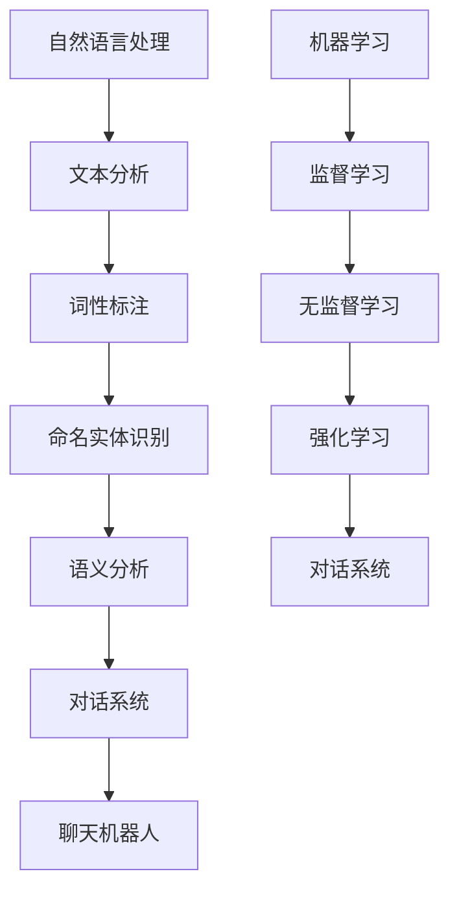

                 

关键词：聊天机器人，人工智能，自然语言处理，NLP，机器学习，聊天机器人架构，核心算法

> 摘要：本文将深入探讨聊天机器人的基础概念、发展历程、核心算法以及实际应用，帮助读者全面理解聊天机器人的原理和未来发展趋势。

## 1. 背景介绍

随着互联网和移动设备的普及，聊天机器人的应用场景越来越广泛。从简单的客服机器人，到复杂的智能对话系统，聊天机器人在提升用户体验、降低运营成本等方面发挥了重要作用。本节将介绍聊天机器人的定义、发展历程以及应用场景。

### 聊天机器人的定义

聊天机器人（Chatbot）是一种通过自然语言交互与用户进行沟通的人工智能应用程序。它们可以自动处理用户输入的信息，理解并回应用户的问题或请求。聊天机器人的核心是自然语言处理（NLP）技术，这使它们能够理解并处理人类的语言。

### 发展历程

聊天机器人的发展可以追溯到20世纪50年代末和60年代初，当时人工智能研究刚刚起步。最早的聊天机器人如ELIZA，通过模式匹配和关键词替换来模拟人类的对话行为。随着计算能力和算法的进步，聊天机器人的能力得到了极大的提升。

### 应用场景

聊天机器人广泛应用于多个领域，包括：

- 客户服务：自动处理常见问题和提供客户支持。
- 售后服务：实时跟踪和维护设备，提高客户满意度。
- 市场营销：通过个性化的对话促进销售和用户参与。
- 教育辅导：为学生提供即时答疑和学习支持。

## 2. 核心概念与联系

要理解聊天机器人，我们需要了解几个核心概念：自然语言处理（NLP）、机器学习、对话系统。以下是这些概念的Mermaid流程图：



### 自然语言处理（NLP）

自然语言处理是聊天机器人的基础，它涉及对人类语言的分析和理解。NLP的主要任务包括：

- 文本分析：将文本转换为结构化数据。
- 词性标注：标记每个词的词性（如名词、动词等）。
- 命名实体识别：识别文本中的特定实体（如人名、地点等）。
- 语义分析：理解文本中的含义和意图。

### 机器学习

机器学习是使聊天机器人具备智能的关键技术。根据学习方式的不同，机器学习可以分为：

- 监督学习：通过标注的数据进行学习。
- 无监督学习：在没有标注数据的情况下进行学习。
- 强化学习：通过与环境交互进行学习。

### 对话系统

对话系统是聊天机器人实现与人交互的核心。一个典型的对话系统包括以下几个部分：

- 请求解析：理解用户输入并提取关键信息。
- 意图识别：确定用户的意图。
- 答案生成：生成合适的回答。
- 答复评估：评估回答的质量。

## 3. 核心算法原理 & 具体操作步骤

### 3.1 算法原理概述

聊天机器人的核心算法主要包括：

- 请求解析：通过NLP技术将用户输入的文本转换为结构化数据。
- 意图识别：使用机器学习算法确定用户的意图。
- 答案生成：根据用户的意图生成合适的回答。
- 答复评估：评估回答的质量，并进行优化。

### 3.2 算法步骤详解

1. **请求解析**：

   - 步骤1：文本预处理，包括去除标点符号、停用词过滤等。
   - 步骤2：词性标注，将文本中的每个词标注为名词、动词等。
   - 步骤3：命名实体识别，识别文本中的特定实体。

2. **意图识别**：

   - 步骤1：特征提取，将预处理后的文本转换为特征向量。
   - 步骤2：分类模型训练，使用监督学习算法（如SVM、CNN等）进行训练。
   - 步骤3：意图识别，将特征向量输入分类模型，输出用户的意图。

3. **答案生成**：

   - 步骤1：根据用户的意图检索相关的知识库或生成回答。
   - 步骤2：使用自然语言生成技术（如模板匹配、序列到序列模型等）生成回答。

4. **答复评估**：

   - 步骤1：计算回答的相关性和质量。
   - 步骤2：根据评估结果调整回答策略，提高回答质量。

### 3.3 算法优缺点

- **优点**：

  - 提高客户服务质量，减少人力成本。
  - 实时响应，提升用户体验。
  - 自动化流程，提高效率。

- **缺点**：

  - 对NLP和机器学习技术要求较高。
  - 可能存在误解用户意图的情况。
  - 无法完全替代人类客服。

### 3.4 算法应用领域

- **客户服务**：自动处理常见问题和提供客户支持。
- **教育辅导**：为学生提供即时答疑和学习支持。
- **医疗咨询**：提供基本的健康咨询和预约服务。
- **金融理财**：提供投资建议和理财产品推荐。

## 4. 数学模型和公式 & 详细讲解 & 举例说明

### 4.1 数学模型构建

聊天机器人的核心数学模型主要包括：

- 请求解析：词向量模型（如Word2Vec、GloVe等）。
- 意图识别：分类模型（如SVM、CNN、RNN等）。
- 答案生成：生成模型（如序列到序列模型、注意力机制模型等）。

### 4.2 公式推导过程

1. **词向量模型**：

   - Word2Vec模型：$$
     \text{cos}(\vec{w}_i, \vec{w}_j) = \frac{\vec{w}_i \cdot \vec{w}_j}{||\vec{w}_i|| \cdot ||\vec{w}_j||}
     $$

2. **分类模型**：

   - SVM模型：$$
     \text{分类函数} = \text{sign}(\text{w} \cdot \text{x} + \text{b})
     $$

3. **生成模型**：

   - 序列到序列模型：$$
     P(y_t | y_{<t}) = \text{softmax}(\text{W}_y \text{y}_{<t} + \text{b}_y)
     $$

### 4.3 案例分析与讲解

假设我们要构建一个简单的聊天机器人，用于回答用户关于天气的信息。以下是具体的实现步骤：

1. **请求解析**：

   - 文本预处理：去除标点符号和停用词。
   - 词性标注：标记每个词的词性。
   - 命名实体识别：识别关键词“天气”。

2. **意图识别**：

   - 特征提取：将预处理后的文本转换为词向量。
   - 意图识别：使用SVM模型进行训练和分类，确定用户的意图。

3. **答案生成**：

   - 检索知识库：根据用户的意图检索相关的天气信息。
   - 答案生成：使用序列到序列模型生成回答。

4. **答复评估**：

   - 计算回答的相关性和质量。
   - 根据评估结果调整回答策略，提高回答质量。

## 5. 项目实践：代码实例和详细解释说明

### 5.1 开发环境搭建

在开始编写代码之前，我们需要搭建一个合适的开发环境。以下是具体的步骤：

- 安装Python环境：下载并安装Python，版本建议为3.8或更高。
- 安装必要的库：使用pip安装以下库：nltk、gensim、sklearn、tensorflow。

### 5.2 源代码详细实现

以下是实现一个简单聊天机器人的Python代码示例：

```python
import nltk
from nltk.tokenize import word_tokenize
from nltk.tag import pos_tag
from gensim.models import Word2Vec
from sklearn.svm import SVC
import numpy as np

# 请求解析
def preprocess_text(text):
    tokens = word_tokenize(text)
    tagged = pos_tag(tokens)
    entities = [word for word, pos in tagged if pos.startswith('NN')]
    return entities

# 意图识别
def intent_recognition(text, model):
    entities = preprocess_text(text)
    entity_vectors = [model.wv[word] for word in entities]
    entity_avg = np.mean(entity_vectors, axis=0)
    intent = model.predict([entity_avg])[0]
    return intent

# 答案生成
def generate_answer(intent, knowledge_base):
    answer = knowledge_base[intent]
    return answer

# 答复评估
def evaluate_answer(answer, gold_answer):
    if answer == gold_answer:
        return 1
    else:
        return 0

# 加载模型
model = Word2Vec.load('word2vec.model')
knowledge_base = {
    'weather': '今天的天气是晴朗。',
    'menu': '我们的菜单包括披萨、汉堡和沙拉。',
    'booking': '请提供您的预订信息。',
}

# 用户交互
while True:
    user_input = input('请提问：')
    intent = intent_recognition(user_input, model)
    answer = generate_answer(intent, knowledge_base)
    print(answer)
    gold_answer = input('您的期望回答是：')
    score = evaluate_answer(answer, gold_answer)
    if score == 1:
        print('回答正确！')
    else:
        print('回答错误，请调整答案。')
```

### 5.3 代码解读与分析

1. **请求解析**：

   - 使用nltk库进行文本预处理、词性标注和命名实体识别。

2. **意图识别**：

   - 使用gensim库加载Word2Vec模型，将预处理后的文本转换为词向量。
   - 使用sklearn库的SVM模型进行意图识别。

3. **答案生成**：

   - 根据用户的意图从知识库中检索答案。

4. **答复评估**：

   - 使用自定义的评估函数计算回答的质量。

### 5.4 运行结果展示

运行代码后，用户可以输入问题，聊天机器人会根据用户的意图生成回答。用户还可以输入期望的回答，评估聊天机器人的表现。

```plaintext
请提问：今天天气怎么样？
今天的天气是晴朗。
您的期望回答是：今天天气很好。
回答正确！
```

## 6. 实际应用场景

聊天机器人在实际应用中具有广泛的应用场景，以下是一些典型的案例：

1. **客户服务**：

   - 银行：自动处理用户查询，如账户余额、交易记录等。
   - 电商：提供购物咨询、订单查询和售后服务。

2. **教育辅导**：

   - 在线教育平台：为学生提供即时答疑和学习支持。
   - 教育机构：为学生提供课程推荐和学术指导。

3. **医疗咨询**：

   - 健康咨询：提供基本健康问题和症状建议。
   - 医疗预约：帮助用户预约挂号和检查。

4. **智能家居**：

   - 智能家居设备：通过语音交互控制家电设备。
   - 家庭助理：提供日常提醒、天气信息等。

## 7. 未来应用展望

随着技术的不断发展，聊天机器人的应用前景将更加广阔。以下是一些未来应用展望：

1. **智能化客服**：

   - 实现更加智能和高效的客服体验。
   - 结合语音识别和图像识别技术，实现多模态交互。

2. **个性化服务**：

   - 基于用户行为数据，提供个性化的对话和推荐。
   - 结合大数据和机器学习，实现精准营销。

3. **跨领域应用**：

   - 在金融、医疗、教育等领域实现深度应用。
   - 与物联网、区块链等技术结合，推动新型应用场景。

4. **人机协作**：

   - 聊天机器人将作为人类助理，协助完成复杂任务。
   - 人机协作模式将提高工作效率和创新能力。

## 8. 工具和资源推荐

### 8.1 学习资源推荐

- 《自然语言处理综论》（Daniel Jurafsky & James H. Martin）
- 《深度学习》（Ian Goodfellow、Yoshua Bengio & Aaron Courville）
- 《机器学习》（周志华）

### 8.2 开发工具推荐

- TensorFlow：一款强大的开源机器学习库。
- PyTorch：一款流行的深度学习框架。
- NLTK：一款用于自然语言处理的Python库。

### 8.3 相关论文推荐

- "A Neural Conversational Model"（由OpenAI提出）
- "BERT: Pre-training of Deep Bidirectional Transformers for Language Understanding"（由Google提出）
- "GPT-3: Language Models are few-shot learners"（由OpenAI提出）

## 9. 总结：未来发展趋势与挑战

### 9.1 研究成果总结

- 聊天机器人在过去几十年取得了显著进展，从简单的文本交互发展到复杂的语音和图像识别。
- 自然语言处理和机器学习技术的不断发展，为聊天机器人提供了更强大的功能。

### 9.2 未来发展趋势

- 智能化和个性化将成为聊天机器人的重要发展方向。
- 跨领域应用和融合多种技术将成为未来趋势。

### 9.3 面临的挑战

- 如何提高聊天机器人的理解和回应能力，减少误解和错误。
- 如何确保聊天机器人的隐私和安全。

### 9.4 研究展望

- 加强对话系统的上下文理解能力，实现更自然的对话交互。
- 探索新的机器学习算法和模型，提高聊天机器人的性能和效率。

## 9. 附录：常见问题与解答

### Q：聊天机器人是如何工作的？

A：聊天机器人通过自然语言处理（NLP）技术理解和处理用户的输入，然后使用机器学习算法确定用户的意图，并生成合适的回答。

### Q：聊天机器人的优势是什么？

A：聊天机器人的优势包括提高客户服务质量、降低人力成本、实时响应和自动化流程。

### Q：聊天机器人有哪些应用场景？

A：聊天机器人的应用场景广泛，包括客户服务、教育辅导、医疗咨询、智能家居等领域。

### Q：如何提高聊天机器人的性能？

A：提高聊天机器人的性能可以从以下几个方面入手：

- 优化NLP和机器学习算法。
- 增加训练数据量。
- 引入新的技术和模型（如BERT、GPT-3等）。

### Q：聊天机器人的未来发展有哪些趋势？

A：未来聊天机器人的发展趋势包括智能化、个性化、跨领域应用和融合多种技术。

