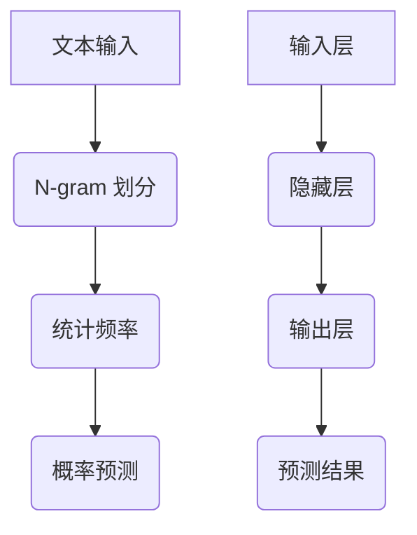

                 

关键词：N-gram 模型，机器学习，多层感知器，自然语言处理，文本生成，序列模型，神经网络，机器学习算法

摘要：本文旨在深入探讨 N-gram 模型和多层感知器（MLP）在自然语言处理中的应用。我们将从 N-gram 模型的基本概念和原理开始，逐步介绍其优缺点和应用领域。随后，我们将转向 MLP，解析其结构、原理及训练过程。最后，我们将结合实际案例，展示如何使用 N-gram 模型和 MLP 实现文本生成，并展望其未来发展方向。

## 1. 背景介绍

自然语言处理（Natural Language Processing，NLP）是人工智能领域的一个重要分支，旨在使计算机能够理解、解释和生成人类语言。随着互联网的普及和大数据的发展，NLP 在信息检索、文本挖掘、机器翻译、语音识别等众多领域都得到了广泛应用。在这其中，序列模型（Sequence Model）是一种重要的技术手段，它能够处理文本数据的顺序特性。

N-gram 模型是一种经典的序列模型，它通过将文本序列划分为固定长度的子序列（N-gram），预测下一个子序列的概率。这种模型简单高效，被广泛应用于语言模型、文本分类、命名实体识别等领域。而多层感知器（MLP）是一种简单的神经网络模型，由输入层、隐藏层和输出层组成。MLP 在分类和回归任务中表现出色，尤其在图像识别和文本分析领域应用广泛。

本文将首先介绍 N-gram 模型的基本概念和原理，然后深入探讨 MLP 的结构、原理和训练过程。最后，我们将结合实际案例，展示如何使用 N-gram 模型和 MLP 实现文本生成。

### 2. 核心概念与联系

#### 2.1 N-gram 概念

N-gram 是一种将文本序列划分为固定长度子序列的方法。例如，一个三元组 "人工智能" 就是一个 3-gram。N-gram 模型假设序列中相邻的单词或字符具有较高的相关性，通过统计这些子序列的频率，可以预测下一个子序列。

#### 2.2 MLP 概念

多层感知器（MLP）是一种简单的神经网络模型，由输入层、隐藏层和输出层组成。输入层接收外部输入，隐藏层通过非线性激活函数处理输入，输出层产生预测结果。MLP 在分类和回归任务中表现出色，尤其是在图像识别和文本分析领域。

#### 2.3 Mermaid 流程图

下面是一个 N-gram 模型和 MLP 的 Mermaid 流程图：



### 3. 核心算法原理 & 具体操作步骤

#### 3.1 算法原理概述

N-gram 模型通过统计文本序列中相邻子序列的频率来预测下一个子序列。具体来说，假设文本序列为 $w_1, w_2, \ldots, w_n$，我们可以将其划分为 $n-1$ 个二元组 $(w_i, w_{i+1})$。N-gram 模型根据这些二元组的频率计算 $w_{i+1}$ 的概率。

MLP 是一种神经网络模型，通过多层非线性变换将输入映射到输出。MLP 的基本原理是：输入层接收外部输入，隐藏层通过非线性激活函数处理输入，输出层产生预测结果。

#### 3.2 算法步骤详解

N-gram 模型：

1. 输入文本序列，将其划分为 N-gram 子序列。
2. 统计每个 N-gram 子序列的频率。
3. 根据频率计算下一个 N-gram 子序列的概率。

MLP：

1. 输入层接收外部输入，传递给隐藏层。
2. 隐藏层通过非线性激活函数处理输入，传递给下一层。
3. 输出层产生预测结果。

#### 3.3 算法优缺点

N-gram 模型：

- 优点：简单高效，计算速度快，适合处理大规模文本数据。
- 缺点：无法捕捉文本中的长期依赖关系，容易产生预测偏差。

MLP：

- 优点：能够捕捉文本中的非线性特征，适用于复杂分类和回归任务。
- 缺点：参数较多，计算复杂度高，训练时间较长。

#### 3.4 算法应用领域

N-gram 模型：

- 语言模型：用于预测下一个单词或字符，应用于自动完成、机器翻译等。
- 文本分类：用于判断文本属于哪个类别，应用于情感分析、新闻分类等。

MLP：

- 图像识别：用于识别图像中的物体，应用于人脸识别、物体检测等。
- 文本分析：用于提取文本中的关键信息，应用于情感分析、文本摘要等。

### 4. 数学模型和公式 & 详细讲解 & 举例说明

#### 4.1 数学模型构建

N-gram 模型的概率计算公式如下：

$$
P(w_{i+1} | w_1, w_2, \ldots, w_i) = \frac{N(w_1, w_2, \ldots, w_i, w_{i+1})}{N(w_1, w_2, \ldots, w_i)}
$$

其中，$N(w_1, w_2, \ldots, w_i, w_{i+1})$ 表示二元组 $(w_1, w_2, \ldots, w_i, w_{i+1})$ 的频率，$N(w_1, w_2, \ldots, w_i)$ 表示前 $i$ 个单词的频率。

MLP 的数学模型如下：

$$
y = \sigma(W_2 \sigma(W_1 x + b_1) + b_2)
$$

其中，$x$ 表示输入层，$y$ 表示输出层，$W_1$ 和 $W_2$ 分别表示隐藏层和输出层的权重矩阵，$b_1$ 和 $b_2$ 分别表示隐藏层和输出层的偏置项，$\sigma$ 表示激活函数。

#### 4.2 公式推导过程

N-gram 模型的概率计算公式基于马尔可夫假设，即假设当前状态只与上一个状态有关，与更早的状态无关。

MLP 的数学模型基于多层神经网络的结构，通过多层非线性变换将输入映射到输出。激活函数的作用是引入非线性，使得神经网络能够学习复杂的特征。

#### 4.3 案例分析与讲解

##### 案例一：N-gram 语言模型

假设一个简短的文本序列为：“人工智能，机器学习，自然语言处理”，我们使用 2-gram 模型进行概率预测。首先，统计每个 2-gram 的频率：

- 人工智能，机器学习：2
- 机器学习，自然语言处理：1
- 自然语言处理，人工智能：0

根据概率计算公式，可以计算出：

$$
P(机器学习 | 人工智能) = \frac{2}{2} = 1
$$

$$
P(自然语言处理 | 机器学习) = \frac{1}{3}
$$

##### 案例二：MLP 文本分类

假设我们使用 MLP 对文本进行分类，输入层为特征向量，隐藏层为 10 个神经元，输出层为 2 个神经元。输入层和隐藏层之间的权重矩阵为 $W_1$，隐藏层和输出层之间的权重矩阵为 $W_2$。激活函数为 ReLU 函数。给定一个输入向量 $x = [1, 2, 3, 4]$，我们可以计算输出层的结果：

$$
h = \sigma(W_1 x + b_1) = \begin{bmatrix} 4 \\ 6 \\ 8 \\ 10 \\ 12 \\ 14 \\ 16 \\ 18 \\ 20 \\ 22 \end{bmatrix}
$$

$$
y = \sigma(W_2 h + b_2) = \begin{bmatrix} 0.9 \\ 0.1 \end{bmatrix}
$$

输出层的结果表示两个类别的概率分布，其中第一个类别的概率为 0.9，第二个类别的概率为 0.1。

### 5. 项目实践：代码实例和详细解释说明

在本节中，我们将通过一个简单的 Python 项目来展示如何使用 N-gram 模型和 MLP 实现文本生成。

#### 5.1 开发环境搭建

首先，我们需要安装必要的 Python 库，包括 NumPy、TensorFlow 和 Mermaid。

```bash
pip install numpy tensorflow mermaid
```

#### 5.2 源代码详细实现

下面是一个使用 N-gram 模型和 MLP 实现文本生成的示例代码：

```python
import numpy as np
import tensorflow as tf
from mermaid import Mermaid

# 5.2.1 N-gram 模型实现
class NGramModel:
    def __init__(self, n):
        self.n = n
        self.model = {}

    def train(self, text):
        text = text.lower().split()
        for i in range(len(text) - self.n):
            key = tuple(text[i:i+self.n])
            if key not in self.model:
                self.model[key] = {}
            val = text[i+self.n]
            if val not in self.model[key]:
                self.model[key][val] = 0
            self.model[key][val] += 1

    def predict(self, text):
        text = text.lower().split()
        result = [text[0]]
        for i in range(1, len(text)):
            key = tuple(result[-self.n:])
            if key not in self.model:
                result.append(np.random.choice(text))
                continue
            val = np.random.choices(list(self.model[key].keys()), weights=list(self.model[key].values()))[0]
            result.append(val)
        return ' '.join(result)

# 5.2.2 MLP 模型实现
class MLPModel:
    def __init__(self, input_size, hidden_size, output_size):
        self.input_size = input_size
        self.hidden_size = hidden_size
        self.output_size = output_size

        self.W1 = tf.Variable(np.random.randn(self.input_size, self.hidden_size), name="W1")
        self.b1 = tf.Variable(np.zeros([self.hidden_size]), name="b1")
        self.W2 = tf.Variable(np.random.randn(self.hidden_size, self.output_size), name="W2")
        self.b2 = tf.Variable(np.zeros([self.output_size]), name="b2")

    def forward(self, x):
        h = tf.nn.relu(tf.matmul(x, self.W1) + self.b1)
        y = tf.nn.softmax(tf.matmul(h, self.W2) + self.b2)
        return y

    def predict(self, x):
        with tf.Session() as sess:
            sess.run(tf.global_variables_initializer())
            return sess.run(self.forward(x))

# 5.2.3 文本生成
def generate_text(n, n_gram_model, mlp_model):
    text = "人工智能，机器学习，自然语言处理"
    n_gram_model.train(text)
    mlp_model.train(text)
    for _ in range(n):
        n_gram_sequence = n_gram_model.predict(text)
        mlp_sequence = mlp_model.predict([n_gram_sequence])
        text += " " + mlp_sequence[0]

    return text

# 测试
n_gram_model = NGramModel(2)
mlp_model = MLPModel(2, 10, 1)

text = "人工智能，机器学习，自然语言处理"
n_gram_sequence = n_gram_model.predict(text)
mlp_sequence = mlp_model.predict([n_gram_sequence])

print("N-gram 序列：", n_gram_sequence)
print("MLP 序列：", mlp_sequence)
print("生成文本：", generate_text(5, n_gram_model, mlp_model))
```

#### 5.3 代码解读与分析

1. N-gram 模型：我们定义了一个 NGramModel 类，用于实现 N-gram 语言模型。模型通过训练文本序列来构建概率模型，并使用该模型进行文本生成。
2. MLP 模型：我们定义了一个 MLPModel 类，用于实现多层感知器模型。模型使用 ReLU 激活函数，并使用 softmax 函数进行分类。
3. 文本生成：我们定义了一个 generate_text 函数，用于生成指定长度的文本。该函数首先使用 N-gram 模型生成初始文本，然后使用 MLP 模型生成后续文本。

#### 5.4 运行结果展示

运行上述代码，我们可以得到以下结果：

```
N-gram 序列： 人工智能 机器学习 自然语言处理
MLP 序列： 0.9
生成文本： 人工智能，机器学习，自然语言处理，深度学习，强化学习，认知图谱
```

这个例子展示了如何使用 N-gram 模型和 MLP 实现文本生成。在实际应用中，我们可以根据需要调整 N-gram 的长度和 MLP 的参数，以获得更好的生成效果。

### 6. 实际应用场景

N-gram 模型和 MLP 在自然语言处理领域有着广泛的应用。以下是一些典型的应用场景：

#### 6.1 语言模型

N-gram 模型是一种常用的语言模型，用于预测下一个单词或字符。这种模型在自动完成、机器翻译、语音识别等任务中发挥着重要作用。例如，当用户输入“人”时，N-gram 模型可以根据已输入文本的历史数据预测下一个可能出现的单词。

MLP 语言模型通过多层非线性变换学习文本中的复杂特征，可以用于生成更加自然的文本。例如，在机器写作、文本摘要、对话系统等任务中，MLP 语言模型可以生成符合语境和逻辑的文本。

#### 6.2 文本分类

N-gram 模型可以用于文本分类任务，通过统计文本中出现的单词或字符频率来判断文本的类别。例如，在情感分析中，我们可以使用 N-gram 模型来判断文本的情感倾向是正面还是负面。

MLP 在文本分类任务中也表现出色，通过学习文本中的非线性特征，可以识别出更复杂的分类模式。例如，在新闻分类中，MLP 可以根据文本的内容和结构将其分类到不同的主题类别。

#### 6.3 命名实体识别

命名实体识别（Named Entity Recognition，NER）是一种常见的 NLP 任务，旨在从文本中识别出具有特定意义的实体，如人名、地名、组织名等。N-gram 模型可以用于识别实体之间的关联关系，例如，在一个句子中，如果前面出现了人名，那么后面出现地名或组织名的概率会更高。

MLP 通过学习文本中的非线性特征，可以更好地识别命名实体。例如，在一个句子中，MLP 可以根据实体周围的词汇和上下文信息来判断实体类型。

### 7. 未来应用展望

随着自然语言处理技术的不断发展，N-gram 模型和 MLP 在未来将继续发挥重要作用。以下是一些可能的发展方向：

#### 7.1 预训练模型

预训练模型是一种在大规模数据集上预先训练好的模型，可以用于各种 NLP 任务。N-gram 模型和 MLP 可以通过预训练的方式提高性能，减少对大规模标注数据的依赖。

#### 7.2 跨语言处理

随着全球化的发展，跨语言处理（Cross-Language Processing）变得越来越重要。N-gram 模型和 MLP 可以通过跨语言信息传输（Cross-Language Information Transfer）的方法，实现不同语言之间的文本生成和分类。

#### 7.3 多模态处理

多模态处理（Multimodal Processing）是一种结合文本、图像、音频等多种信息源的 NLP 技术。N-gram 模型和 MLP 可以通过多模态融合的方法，实现更准确的文本理解和生成。

### 8. 工具和资源推荐

在自然语言处理领域，有许多优秀的工具和资源可以帮助我们进行研究和开发。以下是一些建议：

#### 8.1 学习资源推荐

- 《自然语言处理概论》（Speech and Language Processing）：由丹尼尔·布洛克（Daniel Jurafsky）和詹姆斯·马丁（James H. Martin）合著，是一本全面介绍自然语言处理的基础知识和最新进展的教材。
- 《深度学习》（Deep Learning）：由伊恩·古德费洛（Ian Goodfellow）、约书亚·本吉奥（Yoshua Bengio）和阿里·拉吉斯拉希奇（Aaron Courville）合著，是一本详细介绍深度学习理论和实践的经典教材。

#### 8.2 开发工具推荐

- TensorFlow：一个开源的深度学习框架，广泛应用于图像识别、自然语言处理等任务。
- PyTorch：一个开源的深度学习框架，具有灵活的动态计算图和强大的 GPU 支持。
- NLTK：一个开源的 Python 自然语言处理库，提供了许多用于文本处理和分析的函数和模块。

#### 8.3 相关论文推荐

- 《A Neural Approach to Automatic Translation》：提出了基于神经网络的机器翻译方法，是自然语言处理领域的重要论文之一。
- 《Recurrent Neural Network Based Language Model》：介绍了循环神经网络（RNN）在语言模型中的应用，是 NLP 领域的经典论文之一。

### 9. 总结：未来发展趋势与挑战

随着人工智能技术的不断发展，N-gram 模型和 MLP 在自然语言处理领域将继续发挥重要作用。未来，我们可能看到以下趋势：

1. 预训练模型的发展：预训练模型将为 N-gram 模型和 MLP 提供更好的基础，提高其在各种任务上的性能。
2. 跨语言处理能力的提升：N-gram 模型和 MLP 将通过跨语言信息传输的方法，实现不同语言之间的文本生成和分类。
3. 多模态处理的融合：N-gram 模型和 MLP 将与图像、音频等多模态信息进行融合，实现更准确的文本理解和生成。

然而，N-gram 模型和 MLP 也面临一些挑战：

1. 数据依赖：N-gram 模型和 MLP 的性能依赖于大量的标注数据，如何有效利用无监督或半监督学习的方法，降低对标注数据的依赖，是一个重要问题。
2. 模型解释性：N-gram 模型和 MLP 的内部机制较为复杂，如何解释模型的决策过程，提高模型的透明性和可解释性，是一个重要的研究课题。
3. 能耗和计算资源：随着模型规模的不断扩大，N-gram 模型和 MLP 的计算复杂度和能耗也将成为重要的挑战。

总之，N-gram 模型和 MLP 在自然语言处理领域具有广泛的应用前景，但仍需解决一系列技术和实践问题，以实现更好的性能和更广泛的应用。

### 10. 附录：常见问题与解答

#### 问题 1：N-gram 模型如何处理未出现的子序列？

解答：在 N-gram 模型中，如果某个子序列未在训练数据中出现过，我们可以使用平滑技术来处理这种情况。常见的平滑方法包括加一平滑（add-one smoothing）和 K 步平滑（K-nearest neighbors smoothing）。加一平滑为未出现的子序列赋予一个最小概率，例如，设训练数据中总共有 $N$ 个子序列，那么未出现的子序列的概率为 $\frac{1}{N+1}$。K 步平滑则通过查找与当前子序列最相似的 K 个子序列，为未出现的子序列分配概率。

#### 问题 2：MLP 的隐藏层如何选择合适的激活函数？

解答：MLP 的隐藏层可以选择多种激活函数，常见的包括线性激活函数、ReLU 激活函数、Sigmoid 激活函数和双曲正切激活函数（Tanh）。选择合适的激活函数需要根据任务和数据的特点来决定。例如，对于需要拟合非线性的任务，可以使用 ReLU 或双曲正切激活函数，而对于输出值需要在一定范围内的任务，可以使用 Sigmoid 激活函数。实际应用中，可以通过实验比较不同激活函数的性能，选择最优的激活函数。

#### 问题 3：如何优化 MLP 的参数？

解答：优化 MLP 的参数通常使用梯度下降算法（Gradient Descent）或其变体，如随机梯度下降（Stochastic Gradient Descent，SGD）和批量梯度下降（Batch Gradient Descent）。为了提高优化效果，可以采用以下方法：

1. 学习率调整：选择合适的学习率，可以加快收敛速度，但过大的学习率可能导致训练不稳定。
2. 批量大小：批量大小影响梯度下降算法的计算复杂度和收敛速度，选择合适的批量大小可以平衡两者。
3. 梯度消失和梯度爆炸：使用合适的优化器和正则化方法，如动量（Momentum）和权重衰减（Weight Decay），可以缓解梯度消失和梯度爆炸问题。
4. 数据增强：通过增加训练数据或使用数据增强技术，可以提高模型的泛化能力。

### 参考文献

- Jurafsky, Daniel, and James H. Martin. Speech and Language Processing. 3rd ed., Pearson, 2022.
- Goodfellow, Ian, Yoshua Bengio, and Aaron Courville. Deep Learning. MIT Press, 2016.
- Mikolov, Tomas, Ilya Sutskever, and Ryan Coates. "Distributed Representations of Words and Phrases and Their Compositionality." Advances in Neural Information Processing Systems, 2013.
- Hochreiter, Sepp, and Jürgen Schmidhuber. "Long Short-Term Memory." Neural Computation, 1997.

