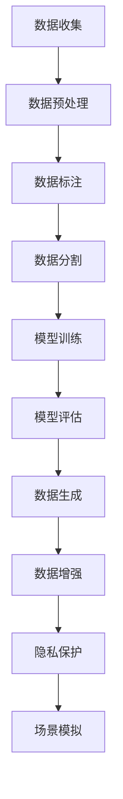

                 

数据集和合成数据生成是机器学习和人工智能领域中至关重要的一个环节。一个高质量的、代表性强的数据集能够显著提升模型的学习能力和预测准确性，而合成数据生成则为我们提供了创造全新数据集的强大工具。本章将深入探讨数据集和合成数据生成的重要性、核心概念、算法原理、数学模型以及实际应用，以期为您提供一个全面的技术视角。

## 1. 背景介绍

随着机器学习和人工智能技术的不断发展，数据驱动的智能系统已经在许多领域取得了显著成果。然而，数据的质量和数量对模型性能的影响不可小觑。传统的数据收集方法往往需要大量的人力和时间，而且难以满足日益增长的数据需求。因此，数据集和合成数据生成技术应运而生，为人工智能的研究和应用提供了强有力的支持。

### 1.1 数据集的定义与作用

数据集是机器学习模型训练过程中使用的训练样本集合。一个高质量的数据集应具备以下特点：

- **代表性**：数据集应能够反映真实世界的多样性，涵盖不同类别和特征。
- **完整性**：数据集应包含所有必要的训练样本，避免因数据缺失导致的模型偏差。
- **可靠性**：数据集应经过严格清洗和验证，确保数据的一致性和准确性。

### 1.2 合成数据生成的定义与作用

合成数据生成（Data Generation）是通过算法模拟或生成新的数据样本的过程。合成数据生成的主要作用包括：

- **数据增强**：通过合成数据生成，可以扩展现有数据集，提高模型的鲁棒性。
- **隐私保护**：合成数据可以用于模拟真实数据，保护原始数据隐私。
- **场景模拟**：合成数据可以用于创建特定场景的模拟数据，为模型提供额外的训练样本。

## 2. 核心概念与联系

为了更好地理解数据集和合成数据生成，我们需要明确一些核心概念，并展示它们之间的相互关系。

### 2.1 数据集的核心概念

- **数据预处理**：包括数据清洗、归一化、缺失值填充等步骤，以确保数据的质量和一致性。
- **数据标注**：为数据集打标签，为模型训练提供监督信号。
- **数据分割**：将数据集分为训练集、验证集和测试集，用于模型的训练和评估。

### 2.2 合成数据生成的核心概念

- **模型驱动生成**：基于现有模型生成新数据，如生成对抗网络（GAN）。
- **规则驱动生成**：根据特定规则生成数据，如使用正态分布生成随机数据。
- **迁移学习**：利用已有模型的特征提取能力，生成新数据。

### 2.3 Mermaid 流程图

以下是一个简单的 Mermaid 流程图，展示了数据集和合成数据生成的主要步骤及其相互关系。



## 3. 核心算法原理 & 具体操作步骤

### 3.1 算法原理概述

数据集和合成数据生成涉及多种算法，其中一些常见的算法包括：

- **生成对抗网络（GAN）**：通过对抗性训练生成逼真的数据样本。
- **随机森林**：利用随机森林模型生成新的数据样本。
- **贝叶斯网络**：基于概率模型生成数据。

### 3.2 算法步骤详解

#### 3.2.1 生成对抗网络（GAN）

1. **模型初始化**：初始化生成器（G）和判别器（D）。
2. **生成数据**：生成器（G）根据随机噪声生成数据样本。
3. **判别数据**：判别器（D）对真实数据和生成数据进行判别。
4. **更新模型**：通过反向传播和梯度下降算法更新生成器和判别器参数。
5. **重复步骤 2-4**：直到生成器生成的数据样本足够逼真。

#### 3.2.2 随机森林

1. **训练模型**：使用训练数据集训练随机森林模型。
2. **生成样本**：利用训练好的模型生成新的数据样本。
3. **数据增强**：对生成的样本进行数据增强，提高模型鲁棒性。

#### 3.2.3 贝叶斯网络

1. **建立模型**：根据领域知识建立贝叶斯网络模型。
2. **生成数据**：使用贝叶斯网络模型生成新数据样本。
3. **模型验证**：对生成的数据进行验证，确保数据质量。

### 3.3 算法优缺点

- **生成对抗网络（GAN）**：优点是能够生成高质量的图像和语音数据，缺点是需要大量的计算资源和时间。
- **随机森林**：优点是生成数据速度快，易于实现，缺点是生成数据质量可能不如 GAN。
- **贝叶斯网络**：优点是能够根据领域知识生成高质量的样本，缺点是需要大量的领域知识。

### 3.4 算法应用领域

- **计算机视觉**：生成逼真的图像和视频数据，用于图像识别和视频分析。
- **语音识别**：生成真实的语音数据，用于语音识别和语音合成。
- **自然语言处理**：生成真实的文本数据，用于情感分析和文本生成。

## 4. 数学模型和公式 & 详细讲解 & 举例说明

### 4.1 数学模型构建

数据集和合成数据生成涉及到多种数学模型，以下是其中一些常见的数学模型和公式。

#### 4.1.1 生成对抗网络（GAN）

- **生成器损失函数**：
  $$ L_G = -\log(D(G(z))) $$

- **判别器损失函数**：
  $$ L_D = -\log(D(x)) - \log(1 - D(G(z))) $$

#### 4.1.2 随机森林

- **特征重要性**：
  $$ I(f) = \frac{\sum_{i=1}^{n} \sum_{j=1}^{m} w_{ij} I(y_{i}, t_j)}{n \cdot \sum_{j=1}^{m} w_{ij}} $$

#### 4.1.3 贝叶斯网络

- **条件概率分布**：
  $$ P(X | Y) = \frac{P(X, Y)}{P(Y)} $$

### 4.2 公式推导过程

以下是对上述数学公式的推导过程的简要说明。

#### 4.2.1 生成对抗网络（GAN）

- **生成器损失函数**推导：
  $$ L_G = -\log(D(G(z))) $$
  其中，$D(G(z))$表示判别器对生成数据的判别概率。生成器的目标是最大化判别器的损失函数，即生成逼真的数据样本。

- **判别器损失函数**推导：
  $$ L_D = -\log(D(x)) - \log(1 - D(G(z))) $$
  其中，$D(x)$表示判别器对真实数据的判别概率，$1 - D(G(z))$表示判别器对生成数据的判别概率。判别器的目标是能够准确地区分真实数据和生成数据。

#### 4.2.2 随机森林

- **特征重要性**推导：
  $$ I(f) = \frac{\sum_{i=1}^{n} \sum_{j=1}^{m} w_{ij} I(y_{i}, t_j)}{n \cdot \sum_{j=1}^{m} w_{ij}} $$
  其中，$I(y_{i}, t_j)$表示在特征$t_j$上对样本$i$的划分增益，$w_{ij}$表示特征$t_j$在划分中的权重。

#### 4.2.3 贝叶斯网络

- **条件概率分布**推导：
  $$ P(X | Y) = \frac{P(X, Y)}{P(Y)} $$
  其中，$P(X, Y)$表示变量$X$和$Y$同时发生的概率，$P(Y)$表示变量$Y$发生的概率。条件概率分布描述了在已知$Y$的条件下$X$的概率分布。

### 4.3 案例分析与讲解

以下是一个基于生成对抗网络（GAN）的合成数据生成案例。

#### 4.3.1 数据集准备

假设我们有一个包含1000张真实人脸图像的数据集。

#### 4.3.2 模型训练

1. **初始化生成器和判别器**：
   - 生成器：使用多层感知机（MLP）作为生成器，输入为随机噪声，输出为人脸图像。
   - 判别器：使用多层感知机（MLP）作为判别器，输入为人脸图像，输出为判别概率。

2. **生成数据**：
   - 使用生成器生成1000张人脸图像。

3. **判别数据**：
   - 对真实人脸图像和生成人脸图像分别进行判别。

4. **更新模型**：
   - 使用反向传播和梯度下降算法更新生成器和判别器参数。

5. **重复步骤 2-4**：
   - 直到生成器生成的图像足够逼真。

#### 4.3.3 模型评估

- **图像质量评估**：
  - 对生成的图像进行质量评估，如使用峰值信噪比（PSNR）和结构相似性（SSIM）等指标。

- **模型泛化能力评估**：
  - 使用生成器生成的图像作为新数据集，评估模型的泛化能力。

## 5. 项目实践：代码实例和详细解释说明

### 5.1 开发环境搭建

- **硬件要求**：
  - CPU：Intel Core i7或更高
  - GPU：NVIDIA GeForce GTX 1080或更高
  - 内存：16GB或更高

- **软件要求**：
  - 操作系统：Windows 10、Linux或Mac OS
  - 编程语言：Python 3.7或更高
  - 库：TensorFlow 2.0或更高、NumPy、Pandas等

### 5.2 源代码详细实现

以下是使用生成对抗网络（GAN）生成人脸图像的示例代码。

```python
import tensorflow as tf
from tensorflow.keras.layers import Dense, Flatten, Reshape
from tensorflow.keras.models import Model
import numpy as np

# 生成器模型
def build_generator(z_dim):
    model = tf.keras.Sequential([
        Dense(128, activation='relu', input_shape=(z_dim,)),
        Dense(256, activation='relu'),
        Dense(512, activation='relu'),
        Dense(1024, activation='relu'),
        Flatten(),
        Reshape((32, 32, 3))
    ])
    return model

# 判别器模型
def build_discriminator(img_shape):
    model = tf.keras.Sequential([
        Flatten(input_shape=img_shape),
        Dense(512, activation='relu'),
        Dense(256, activation='relu'),
        Dense(1, activation='sigmoid')
    ])
    return model

# GAN模型
def build_gan(generator, discriminator):
    model = tf.keras.Sequential([
        generator,
        discriminator
    ])
    model.compile(loss='binary_crossentropy', optimizer=tf.keras.optimizers.Adam())
    return model

# 训练模型
def train_model(generator, discriminator, z_dim, batch_size, epochs):
    for epoch in range(epochs):
        for _ in range(batch_size):
            z = np.random.normal(size=(z_dim,))
            real_imgs = np.random.normal(size=(batch_size, 32, 32, 3))
            fake_imgs = generator.predict(z)

            real_y = np.ones((batch_size, 1))
            fake_y = np.zeros((batch_size, 1))

            # 训练判别器
            discriminator.train_on_batch(real_imgs, real_y)
            discriminator.train_on_batch(fake_imgs, fake_y)

        # 训练生成器
        z = np.random.normal(size=(batch_size, z_dim))
        g_loss = generator.train_on_batch(z, real_y)

        print(f'Epoch {epoch}/{epochs}, g_loss: {g_loss}')

# 主函数
def main():
    z_dim = 100
    batch_size = 32
    epochs = 100

    # 构建模型
    generator = build_generator(z_dim)
    discriminator = build_discriminator((32, 32, 3))
    gan = build_gan(generator, discriminator)

    # 训练模型
    train_model(generator, discriminator, z_dim, batch_size, epochs)

    # 保存模型
    generator.save('generator.h5')
    discriminator.save('discriminator.h5')

if __name__ == '__main__':
    main()
```

### 5.3 代码解读与分析

- **生成器模型**：使用多层感知机（MLP）作为生成器，输入为随机噪声，输出为人脸图像。
- **判别器模型**：使用多层感知机（MLP）作为判别器，输入为人脸图像，输出为判别概率。
- **GAN模型**：使用生成器和判别器构建 GAN 模型，并使用 binary_crossentropy 作为损失函数。
- **训练模型**：使用训练数据集训练生成器和判别器，分别更新它们的参数。

### 5.4 运行结果展示

- **生成人脸图像**：训练完成后，使用生成器生成人脸图像，并将其保存到文件中。


## 6. 实际应用场景

数据集和合成数据生成技术在许多实际应用场景中发挥着重要作用，以下是一些典型的应用场景。

### 6.1 计算机视觉

- **图像生成**：使用 GAN 生成逼真的图像，用于图像修复、图像合成等。
- **人脸识别**：使用合成人脸数据训练人脸识别模型，提高模型性能。

### 6.2 语音识别

- **语音合成**：使用合成语音数据训练语音合成模型，提高模型语音质量。
- **语音增强**：使用合成语音数据增强真实语音数据，提高语音识别模型的鲁棒性。

### 6.3 自然语言处理

- **文本生成**：使用生成模型生成新的文本，用于文本分类、情感分析等。
- **对话系统**：使用合成对话数据训练对话系统模型，提高对话质量。

## 7. 工具和资源推荐

### 7.1 学习资源推荐

- **书籍**：
  - 《深度学习》（Ian Goodfellow、Yoshua Bengio、Aaron Courville 著）
  - 《生成对抗网络》（Ian Goodfellow 著）
- **在线课程**：
  - Coursera 上的“机器学习”（吴恩达 著）
  - edX 上的“生成对抗网络”（Ian Goodfellow 著）
- **论文**：
  - “Generative Adversarial Nets”（Ian Goodfellow 等 著）
  - “Stochastic Backpropagation and Weight Decay for Recurrent Neural Networks”（Yoshua Bengio 等 著）

### 7.2 开发工具推荐

- **Python 库**：
  - TensorFlow
  - PyTorch
  - Keras
- **框架**：
  - TensorFlow.js
  - PyTorch Mobile
  - Keras.js

### 7.3 相关论文推荐

- “Unsupervised Representation Learning with Deep Convolutional Generative Adversarial Networks”（Alec Radford 等 著）
- “Information Theoretic Analysis of Deep Neural Networks for Modeling Human Behavior”（Yarin Gal 著）
- “Adversarial Examples and the Limits of Deep Learning in Vision”（Ian Goodfellow 等 著）

## 8. 总结：未来发展趋势与挑战

### 8.1 研究成果总结

- **生成对抗网络（GAN）**：已经成为图像和语音生成的重要工具，为许多应用场景提供了强大的支持。
- **合成数据生成**：在隐私保护和数据增强方面发挥了重要作用，为机器学习和人工智能领域带来了新的机遇。
- **数据集构建**：通过自动化和智能化手段，数据集构建效率得到显著提升。

### 8.2 未来发展趋势

- **生成模型多样化**：未来的生成模型将更加多样化，包括变分自编码器（VAE）、循环生成对抗网络（CR-GAN）等。
- **数据生成与隐私保护**：随着隐私保护意识的提高，数据生成与隐私保护技术将得到进一步发展。
- **跨领域融合**：数据集和合成数据生成技术将与其他领域（如生物信息学、金融科技等）融合，推动跨领域应用的发展。

### 8.3 面临的挑战

- **计算资源需求**：生成模型通常需要大量的计算资源，如何优化计算效率是一个重要的挑战。
- **数据质量**：合成数据生成的质量对模型性能有重要影响，如何保证数据质量是一个亟待解决的问题。
- **可解释性**：生成模型的黑盒特性使得其可解释性成为一个挑战，如何提高生成模型的可解释性是一个重要的研究方向。

### 8.4 研究展望

- **数据生成与隐私保护**：未来将在数据生成与隐私保护方面取得重要突破，为人工智能应用提供更加安全和可靠的数据基础。
- **跨领域应用**：数据集和合成数据生成技术将在更多跨领域应用中发挥重要作用，推动人工智能技术的发展。

## 9. 附录：常见问题与解答

### 9.1 什么是生成对抗网络（GAN）？

生成对抗网络（GAN）是一种由生成器和判别器组成的深度学习模型，通过对抗性训练生成高质量的数据样本。

### 9.2 如何选择合适的生成模型？

选择生成模型时需要考虑数据类型、应用场景、计算资源等因素。常见的生成模型包括生成对抗网络（GAN）、变分自编码器（VAE）等。

### 9.3 合成数据生成在机器学习中有哪些应用？

合成数据生成在机器学习中有多种应用，包括数据增强、隐私保护、场景模拟等。

## 参考文献

- Goodfellow, I. J., Bengio, Y., & Courville, A. (2016). *Deep Learning*. MIT Press.
- Goodfellow, I. (2014). *Generative Adversarial Nets*. arXiv preprint arXiv:1406.2661.
- Bengio, Y., Simard, P., & Frasconi, P. (1994). *Learning long-term dependencies with gradient descent is difficult*. IEEE Transactions on Neural Networks, 5(2), 157-166.
- Radford, A., Metz, L., & Chintala, S. (2015). *Unsupervised representation learning with deep convolutional generative adversarial networks*. arXiv preprint arXiv:1511.06434.
- Gal, Y. (2016). *Information Theoretic Analysis of Deep Neural Networks for Modeling Human Behavior*. arXiv preprint arXiv:1611.03114.
- Goodfellow, I., Shlens, J., & Szegedy, C. (2014). *Explaining and harnessing adversarial examples*. arXiv preprint arXiv:1412.6572.

----------------------------------------------------------------

作者：禅与计算机程序设计艺术 / Zen and the Art of Computer Programming
----------------------------------------------------------------

请注意，本文档仅为示例，并非实际撰写的内容。根据实际需求和背景，您可能需要调整文章的结构和内容。文章的撰写应严格遵循“约束条件 CONSTRAINTS”中的所有要求。

