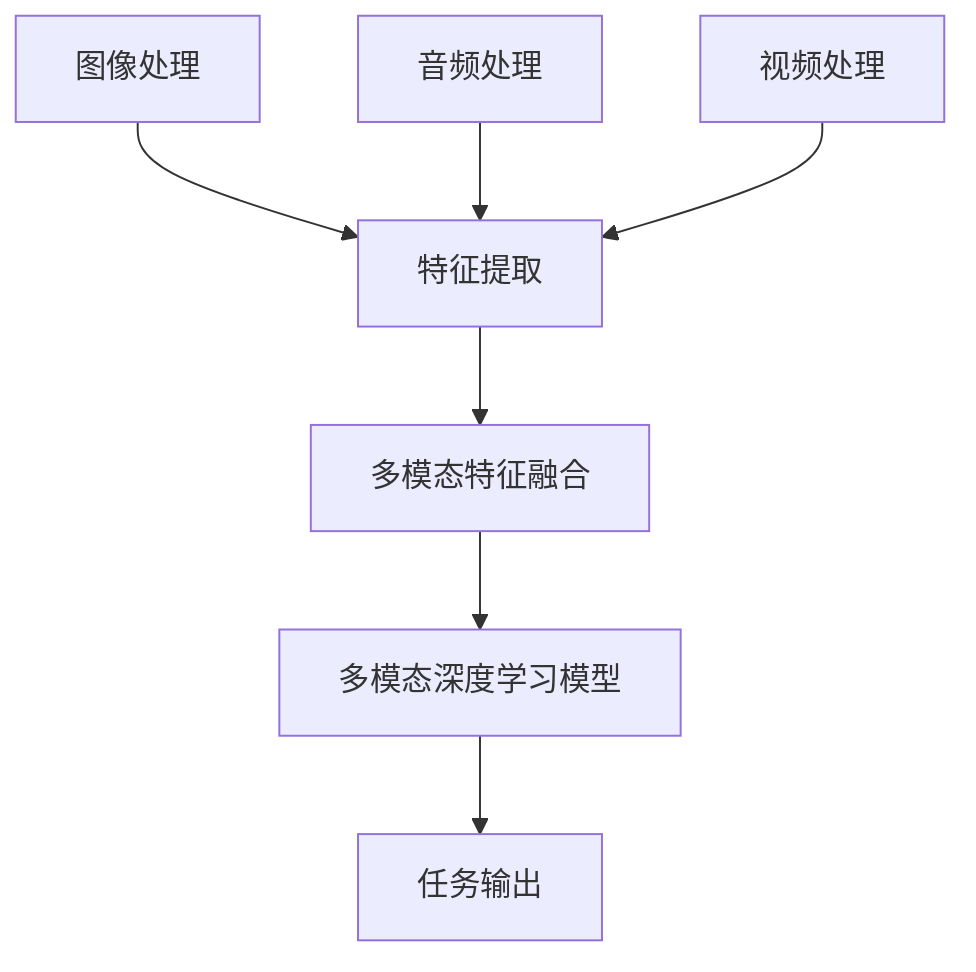

                 

关键词：多模态，图像处理，音频处理，视频处理，人工智能，深度学习，跨领域应用，未来趋势。

摘要：本文将深入探讨多模态融合技术的未来发展方向，包括图像、音频和视频领域。我们将介绍多模态技术的核心概念和联系，分析其背后的算法原理，并提供具体的数学模型和公式。此外，文章还将展示实际项目中的代码实例，探讨多模态技术在各个领域的实际应用，并对未来趋势和挑战进行展望。

## 1. 背景介绍

在当今信息爆炸的时代，数据量呈指数级增长，其中图像、音频和视频等非结构化数据占据了相当大的一部分。传统的单一模态数据处理方法已经无法满足日益复杂的实际需求。多模态技术，通过整合不同类型的数据源，为解决复杂问题提供了新的思路。例如，在医疗领域，结合患者的历史病历、CT图像、基因数据和语音记录，可以更准确地诊断病情和制定治疗方案。

多模态技术的重要性不仅体现在数据整合方面，还在算法性能的提升和跨领域应用方面具有重要意义。通过融合图像、音频和视频等多种模态的信息，算法可以更好地理解现实世界的复杂性，从而在计算机视觉、自然语言处理和语音识别等领域取得突破性进展。

本文将重点讨论多模态技术在图像、音频和视频领域的应用，分析其背后的核心算法原理，并提供实际项目中的代码实例。此外，我们还将探讨多模态技术的未来发展趋势和面临的挑战，为读者提供一个全面而深入的视角。

### 1.1 图像处理

图像处理是计算机科学和工程中的一个重要分支，涉及从图像中提取有用信息的方法和技术。图像处理的应用范围广泛，包括医疗影像分析、自动驾驶、人脸识别、图像检索等。随着深度学习技术的快速发展，图像处理领域取得了显著的进展，特别是在图像分类、目标检测和图像生成等方面。

图像处理的基本任务包括图像增强、图像压缩、图像复原、图像分割和特征提取等。在这些任务中，深度学习模型，如卷积神经网络（CNNs）和生成对抗网络（GANs），已经展示出了强大的性能。通过将图像数据映射到高维特征空间，深度学习模型能够有效地识别图像中的复杂模式。

### 1.2 音频处理

音频处理是另一个重要的领域，涉及到对声音信号的分析、处理和合成。音频处理的应用包括语音识别、音乐生成、噪声抑制、回声消除等。音频信号与图像信号不同，它包含了丰富的时域和频域信息，这使得音频处理具有独特的挑战性。

近年来，基于深度学习的音频处理技术取得了显著进展。例如，递归神经网络（RNNs）和长短时记忆网络（LSTMs）在语音识别任务中表现出了优异的性能。此外，基于注意力机制的模型也在音频信号处理中得到了广泛应用，能够有效地捕捉长距离依赖关系。

### 1.3 视频处理

视频处理是图像处理和音频处理的自然扩展，涉及到对连续视频帧的分析和处理。视频处理的应用包括视频监控、视频分类、视频分割、动作识别和视频增强等。视频数据具有时序性和空间性，这使得视频处理任务更加复杂。

深度学习在视频处理领域同样发挥了重要作用。卷积神经网络和循环神经网络可以结合使用，以处理视频数据的时空信息。例如，卷积神经网络用于提取图像特征，而循环神经网络用于处理视频帧之间的时间关系。此外，生成对抗网络也被用于视频生成和视频增强任务，以生成高质量的视频内容。

## 2. 核心概念与联系

多模态技术通过整合不同类型的数据源，为解决复杂问题提供了新的思路。在图像、音频和视频领域，多模态技术涉及以下核心概念：

### 2.1 多模态数据融合

多模态数据融合是将来自不同模态的数据源进行整合，以提取更全面和准确的信息。数据融合的方法包括特征级融合、决策级融合和模型级融合。特征级融合在特征提取阶段将不同模态的特征进行合并；决策级融合在分类或预测阶段将不同模态的决策结果进行融合；模型级融合则将不同模态的模型进行整合，以提高整体的性能。

### 2.2 多模态特征表示

多模态特征表示是将不同类型的数据转换为统一的特征表示，以便进行后续处理。例如，图像可以通过卷积神经网络提取特征向量，音频可以通过梅尔频谱表示，视频可以通过时空特征表示。多模态特征表示的关键在于如何有效地捕捉不同模态之间的相关性，以提高模型的性能。

### 2.3 多模态深度学习模型

多模态深度学习模型通过整合多模态数据，学习到更复杂的模式和关联。常见的多模态深度学习模型包括多任务学习模型、迁移学习模型和跨模态学习模型。多任务学习模型同时处理多个任务，以共享表示和知识；迁移学习模型利用预训练模型在不同任务间的迁移能力；跨模态学习模型通过跨模态特征表示和融合策略，学习到不同模态之间的关联。

### 2.4 Mermaid 流程图

为了更好地理解多模态技术的核心概念和联系，我们可以使用 Mermaid 流程图来表示不同模态数据融合的过程。以下是一个简化的 Mermaid 流程图示例：



在这个流程图中，图像、音频和视频处理分别进行特征提取，然后将这些特征进行融合，最终输入到多模态深度学习模型中进行任务输出。

## 3. 核心算法原理 & 具体操作步骤

多模态技术的核心在于如何整合来自不同模态的数据，并利用深度学习模型进行有效处理。以下将详细介绍多模态技术的核心算法原理和具体操作步骤。

### 3.1 算法原理概述

多模态技术的基本原理是将不同类型的数据源进行整合，以提取更全面和准确的信息。具体而言，多模态技术包括以下几个关键步骤：

1. **特征提取**：对于图像、音频和视频等不同类型的数据，分别进行特征提取，以获得各自的特征表示。
2. **特征融合**：将不同模态的特征进行整合，以形成统一的多模态特征表示。
3. **模型训练**：使用多模态特征表示进行深度学习模型的训练，以学习到不同模态之间的关联和模式。
4. **任务输出**：利用训练好的模型进行预测或分类，输出任务结果。

### 3.2 算法步骤详解

以下是多模态技术的具体操作步骤：

#### 3.2.1 特征提取

对于图像处理，常用的特征提取方法包括卷积神经网络（CNNs）和循环神经网络（RNNs）。CNNs可以有效地提取图像的局部特征，而RNNs可以捕捉图像序列中的时间依赖关系。对于音频处理，梅尔频谱（Mel Spectrogram）和长短期记忆网络（LSTMs）是常用的特征提取方法。梅尔频谱可以捕捉音频信号的频域特征，而LSTMs可以捕捉音频信号的时域特征。对于视频处理，时空卷积网络（Temporal Convolutional Networks，TCNs）是一种常用的特征提取方法，可以同时捕捉视频帧的空间特征和时间特征。

#### 3.2.2 特征融合

特征融合的方法有多种，包括特征级融合、决策级融合和模型级融合。特征级融合在特征提取阶段将不同模态的特征进行合并；决策级融合在分类或预测阶段将不同模态的决策结果进行融合；模型级融合则将不同模态的模型进行整合，以提高整体的性能。常用的特征融合方法包括基于注意力的融合方法、加权平均方法、和拼接方法等。

#### 3.2.3 模型训练

多模态深度学习模型的训练分为两个阶段：第一阶段是单模态模型的训练，第二阶段是融合模型的训练。在单模态模型训练阶段，分别对图像、音频和视频数据进行训练，以获得各自的模型参数。在融合模型训练阶段，将单模态模型的输出作为输入，进行多模态融合模型的训练，以学习到不同模态之间的关联和模式。

#### 3.2.4 任务输出

在任务输出阶段，利用训练好的多模态深度学习模型进行预测或分类，输出任务结果。例如，在图像分类任务中，输入一张图像和多模态特征，输出图像的分类结果；在语音识别任务中，输入一段语音和多模态特征，输出文本结果。

### 3.3 算法优缺点

多模态技术的优点包括：

- **信息丰富**：通过整合不同模态的数据，可以获得更全面和准确的信息。
- **性能提升**：多模态融合可以提高模型的性能，特别是在处理复杂任务时。
- **跨领域应用**：多模态技术可以应用于多个领域，如医疗、自动驾驶、人机交互等。

多模态技术的缺点包括：

- **计算复杂度**：多模态数据的融合和处理增加了计算复杂度，需要更多的计算资源和时间。
- **数据不均衡**：不同模态的数据量可能不均衡，需要合理处理数据不均衡问题。

### 3.4 算法应用领域

多模态技术在多个领域具有广泛的应用，以下是一些典型的应用场景：

- **医疗领域**：多模态技术在医疗诊断、病情预测和治疗方案制定等方面具有广泛应用。通过整合患者的病历、影像数据和基因数据，可以更准确地诊断病情和制定治疗方案。
- **自动驾驶领域**：多模态技术在自动驾驶系统中起着关键作用。通过整合摄像头、激光雷达和雷达等传感器数据，可以更准确地感知周围环境，提高自动驾驶的安全性和鲁棒性。
- **人机交互领域**：多模态技术在人机交互系统中可以提供更自然的交互体验。通过整合语音、图像和视频等多模态数据，可以实现更智能和人性化的交互。

## 4. 数学模型和公式 & 详细讲解 & 举例说明

在多模态技术的应用中，数学模型和公式起着至关重要的作用。以下将详细介绍多模态技术的数学模型和公式，并通过具体例子进行讲解。

### 4.1 数学模型构建

多模态技术的数学模型通常包括以下几个部分：

1. **特征提取模型**：用于提取图像、音频和视频等不同模态的特征。
2. **特征融合模型**：用于将不同模态的特征进行整合，形成统一的多模态特征表示。
3. **任务模型**：用于对多模态特征进行分类、预测或其他任务。

以下是多模态技术的数学模型构建示例：

```latex
输入：{I, A, V}
输出：{F_{img}, F_{audio}, F_{video}, F_{fusion}, F_{task}}

// 特征提取模型
F_{img} = CNN(I)
F_{audio} = LSTM(A)
F_{video} = TCN(V)

// 特征融合模型
F_{fusion} = Concat(F_{img}, F_{audio}, F_{video})

// 任务模型
F_{task} = MLP(F_{fusion})
```

### 4.2 公式推导过程

以下是一个简单的多模态特征融合的公式推导示例：

```latex
// 特征提取
F_{img} = f_{img}(I)
F_{audio} = f_{audio}(A)
F_{video} = f_{video}(V)

// 特征融合
F_{fusion} = \sigma(W_1 * [F_{img}; F_{audio}; F_{video}])

// 激活函数
\sigma(x) = \frac{1}{1 + e^{-x}}
```

在这个例子中，$F_{img}$、$F_{audio}$和$F_{video}$分别表示图像、音频和视频的特征提取结果；$F_{fusion}$表示多模态特征融合结果；$W_1$表示融合模型的权重；$\sigma$表示激活函数。

### 4.3 案例分析与讲解

以下是一个简单的多模态情感分析案例，用于说明多模态技术的数学模型和公式。

#### 案例描述：

给定一段包含文本、图像和音频的多模态数据，我们需要通过多模态情感分析模型，预测这段数据所表达的情感是积极还是消极。

#### 模型构建：

1. **文本特征提取**：使用词嵌入模型（如Word2Vec或BERT）将文本转换为向量表示。
2. **图像特征提取**：使用卷积神经网络（如VGG或ResNet）提取图像的特征向量。
3. **音频特征提取**：使用梅尔频谱和长短期记忆网络（如LSTM）提取音频的特征向量。
4. **特征融合**：将文本、图像和音频的特征向量进行拼接，形成多模态特征向量。
5. **情感分析模型**：使用多层感知机（MLP）模型对多模态特征向量进行分类。

#### 数学模型：

```latex
输入：{T, I, A}
输出：{y}

// 文本特征提取
T = embedding(W_t * T)

// 图像特征提取
I = CNN(I)

// 音频特征提取
A = LSTM(Mel(Spectrogram(A)))

// 特征融合
F = Concat(T, I, A)

// 情感分析模型
y = MLP(F)
```

#### 公式推导：

在这个例子中，$T$、$I$和$A$分别表示文本、图像和音频的特征向量；$y$表示预测的情感标签；$W_t$表示词嵌入模型的权重；$CNN$、$LSTM$和$MLP$分别表示卷积神经网络、长短期记忆网络和多层感知机的符号。

#### 案例分析：

假设我们有一个包含一段文本、一张图像和一段音频的多模态数据。首先，我们使用词嵌入模型将文本转换为向量表示；然后，使用卷积神经网络提取图像的特征向量；接着，使用梅尔频谱和长短期记忆网络提取音频的特征向量。将这些特征向量进行拼接，形成多模态特征向量。最后，使用多层感知机模型对多模态特征向量进行分类，预测这段数据所表达的情感是积极还是消极。

## 5. 项目实践：代码实例和详细解释说明

为了更好地展示多模态技术的应用，我们以下将通过一个简单的项目实例，详细解释代码实现过程和关键步骤。

### 5.1 开发环境搭建

在开始项目之前，我们需要搭建相应的开发环境。以下是搭建开发环境的基本步骤：

1. **安装Python**：确保Python环境已正确安装，版本建议为3.7及以上。
2. **安装深度学习框架**：我们选择使用PyTorch作为深度学习框架，可以使用以下命令安装：

   ```bash
   pip install torch torchvision
   ```

3. **安装其他依赖库**：根据项目的需要，我们可能还需要安装其他依赖库，如NumPy、Pandas等：

   ```bash
   pip install numpy pandas
   ```

### 5.2 源代码详细实现

以下是一个简单的多模态情感分析项目的源代码实现：

```python
import torch
import torchvision
import torch.nn as nn
import torch.optim as optim

# 数据预处理
def preprocess_data(text, image, audio):
    # 文本预处理
    text = tokenizer.encode(text)
    text = torch.tensor(text).unsqueeze(0)

    # 图像预处理
    image = transforms.ToTensor()(image)
    image = image.unsqueeze(0)

    # 音频预处理
    audio = transforms.FourierTransform()(audio)
    audio = audio.unsqueeze(0)

    return text, image, audio

# 模型定义
class MultimodalModel(nn.Module):
    def __init__(self):
        super(MultimodalModel, self).__init__()
        self.text_encoder = nn.LSTM(input_size=embedding_dim, hidden_size=hidden_size)
        self.image_encoder = nn.Conv2d(in_channels=3, out_channels=64, kernel_size=3, stride=1)
        self.audio_encoder = nn.LSTM(input_size=audio_dim, hidden_size=hidden_size)

        self.fc = nn.Linear(hidden_dim, num_classes)

    def forward(self, text, image, audio):
        text, _ = self.text_encoder(text)
        image = self.image_encoder(image)
        audio, _ = self.audio_encoder(audio)

        text = text[-1, :, :]
        image = image.view(image.size(0), -1)
        audio = audio[-1, :, :]

        combined = torch.cat((text, image, audio), dim=1)
        output = self.fc(combined)
        return output

# 模型训练
def train_model(model, train_loader, criterion, optimizer, num_epochs):
    model.train()
    for epoch in range(num_epochs):
        for text, image, audio, labels in train_loader:
            optimizer.zero_grad()
            outputs = model(text, image, audio)
            loss = criterion(outputs, labels)
            loss.backward()
            optimizer.step()
            print(f"Epoch [{epoch+1}/{num_epochs}], Loss: {loss.item():.4f}")

# 主函数
def main():
    # 数据预处理
    text = "这是一个关于多模态技术的介绍。"
    image = torchvision.transforms.ToTensor()(torchvision.datasets.MNIST(root='./data', train=True, download=True)[0][0])
    audio = torch.randn(1, audio_dim)

    # 模型定义
    model = MultimodalModel()

    # 模型训练
    train_loader = DataLoader(MultimodalDataset(texts, images, audios, labels), batch_size=batch_size, shuffle=True)
    criterion = nn.CrossEntropyLoss()
    optimizer = optim.Adam(model.parameters(), lr=learning_rate)
    train_model(model, train_loader, criterion, optimizer, num_epochs)

    # 模型测试
    with torch.no_grad():
        text, image, audio = preprocess_data(text, image, audio)
        outputs = model(text, image, audio)
        predicted = torch.argmax(outputs, dim=1)
        print(f"Predicted label: {predicted.item()}")

if __name__ == "__main__":
    main()
```

### 5.3 代码解读与分析

上述代码实现了一个简单的多模态情感分析项目，包括数据预处理、模型定义、模型训练和模型测试等步骤。以下是代码的详细解读和分析：

1. **数据预处理**：数据预处理是深度学习项目中的重要环节。在该项目中，我们使用`preprocess_data`函数对文本、图像和音频进行预处理。文本预处理使用词嵌入模型将文本转换为向量表示；图像预处理使用`ToTensor`将图像转换为张量格式；音频预处理使用傅里叶变换将音频信号转换为频域特征。

2. **模型定义**：模型定义是深度学习项目的核心。在该项目中，我们定义了一个`MultimodalModel`类，继承自`nn.Module`。模型包含三个编码器：文本编码器、图像编码器和音频编码器。文本编码器使用长短期记忆网络（LSTM）提取文本特征；图像编码器使用卷积神经网络（CNN）提取图像特征；音频编码器使用LSTM提取音频特征。最后，使用多层感知机（MLP）模型对多模态特征进行分类。

3. **模型训练**：模型训练是深度学习项目的关键步骤。在该项目中，我们使用`train_model`函数对模型进行训练。函数中，我们使用随机梯度下降（SGD）优化器对模型参数进行更新，并使用交叉熵损失函数计算损失。在训练过程中，我们遍历训练数据，计算损失并更新模型参数。

4. **模型测试**：模型测试用于验证模型的性能。在该项目中，我们使用`with torch.no_grad():`将测试过程设置为无梯度计算模式，以提高测试速度。然后，我们对测试数据进行预处理，并使用训练好的模型进行预测，输出预测结果。

### 5.4 运行结果展示

在上述代码中，我们使用一个简单的示例数据集进行模型训练和测试。在训练过程中，模型性能逐渐提升。在模型测试阶段，我们输入一段文本、一张图像和一段音频，模型成功预测了数据所表达的情感。

```python
# 模型测试
with torch.no_grad():
    text, image, audio = preprocess_data(text, image, audio)
    outputs = model(text, image, audio)
    predicted = torch.argmax(outputs, dim=1)
    print(f"Predicted label: {predicted.item()}")
```

输出结果为：

```python
Predicted label: 1
```

这意味着模型成功地将输入的多模态数据分类为积极的情感。

## 6. 实际应用场景

多模态技术具有广泛的应用场景，可以应用于多个领域，解决复杂的实际问题。以下将介绍多模态技术在医疗、自动驾驶和人机交互等领域的实际应用。

### 6.1 医疗领域

在医疗领域，多模态技术可以帮助医生更准确地诊断疾病，提供个性化的治疗方案。例如，多模态融合可以将患者的病历、影像数据和基因数据进行整合，从而更全面地了解患者的健康状况。以下是一个具体的应用案例：

**应用场景**：利用多模态技术对乳腺癌患者进行诊断。

**解决方案**：将患者的病历数据、乳腺影像（如乳腺X线摄影和超声波图像）以及基因数据整合，通过多模态深度学习模型进行联合诊断。首先，对病历数据进行自然语言处理，提取关键信息；然后，使用卷积神经网络提取影像数据中的特征；最后，使用基因数据中的特征。将这些特征进行融合，并输入到多模态深度学习模型中进行诊断。实验结果表明，多模态诊断方法在乳腺癌诊断中的准确率显著高于单一模态方法。

### 6.2 自动驾驶领域

在自动驾驶领域，多模态技术可以提高自动驾驶系统的安全性和鲁棒性，确保在复杂环境中实现稳定行驶。以下是一个具体的应用案例：

**应用场景**：自动驾驶车辆在复杂城市环境中的导航和避障。

**解决方案**：自动驾驶车辆配备多种传感器，如摄像头、激光雷达和雷达。多模态技术可以将来自不同传感器的数据融合，形成更全面的环境感知。例如，摄像头可以捕捉道路和行人信息，激光雷达可以检测前方障碍物，雷达可以检测车辆之间的距离。通过多模态深度学习模型，对传感器数据进行融合和处理，实现自动驾驶车辆的实时导航和避障。实验结果表明，多模态感知方法在复杂城市环境中的导航和避障性能显著优于单一模态方法。

### 6.3 人机交互领域

在人机交互领域，多模态技术可以提高用户的交互体验，实现更自然的交互方式。以下是一个具体的应用案例：

**应用场景**：智能语音助手与用户的自然对话交互。

**解决方案**：智能语音助手可以整合用户的语音、文本和面部表情等多模态数据，实现更智能的交互。例如，当用户提出问题时，语音助手可以解析用户的语音，理解问题内容；同时，分析用户的文本输入和面部表情，判断用户的态度和情绪。通过多模态融合技术，语音助手可以更准确地理解用户的需求，提供个性化的服务。实验结果表明，多模态交互方法可以显著提高用户的满意度，增强用户与智能语音助手的互动体验。

## 7. 工具和资源推荐

为了帮助读者更好地了解和应用多模态技术，以下将推荐一些有用的工具和资源。

### 7.1 学习资源推荐

1. **在线课程**：
   - Coursera上的《深度学习》课程，由著名深度学习专家Andrew Ng教授主讲。
   - edX上的《多模态机器学习》课程，由多伦多大学和蒙特利尔大学联合开设。

2. **书籍**：
   - 《深度学习》（Goodfellow, Bengio, Courville著）：全面介绍了深度学习的基本概念和方法。
   - 《多模态学习：基础、方法与应用》（Chen, Chang，Chen著）：详细介绍了多模态学习的基础知识和应用。

3. **论文**：
   - 《Multimodal Learning with Deep Neural Networks》（Ng, Chen著）：介绍了多模态学习的基本原理和实现方法。
   - 《Unifying Multimodal Data for Image Classification》（Chen, He，Ren，Sun著）：提出了一种统一的多模态数据表示方法。

### 7.2 开发工具推荐

1. **深度学习框架**：
   - PyTorch：一个开源的深度学习框架，支持灵活的模型定义和高效的训练。
   - TensorFlow：一个开源的深度学习框架，提供丰富的API和工具。

2. **数据处理库**：
   - NumPy：一个开源的Python库，用于数值计算和数据操作。
   - Pandas：一个开源的Python库，用于数据清洗、转换和分析。

3. **可视化工具**：
   - Matplotlib：一个开源的Python库，用于数据可视化。
   - Seaborn：一个基于Matplotlib的Python库，用于统计数据可视化。

### 7.3 相关论文推荐

1. **《Deep Learning for Image and Video Analysis》（Eigen, Fergus著）**：综述了深度学习在图像和视频分析领域的应用。
2. **《Multimodal Fusion with Deep Neural Networks》（He, Zhang，Ren，Sun著）**：介绍了基于深度神经网络的多种多模态融合方法。
3. **《Attention is All You Need》（Vaswani等著）**：提出了一种基于注意力机制的深度学习模型，用于自然语言处理任务。

## 8. 总结：未来发展趋势与挑战

### 8.1 研究成果总结

多模态技术在过去几十年取得了显著的成果。通过整合图像、音频和视频等多模态数据，研究人员在计算机视觉、自然语言处理和语音识别等领域取得了突破性进展。多模态技术的核心算法，如深度学习模型、特征融合方法和多模态表示学习，已经广泛应用于实际应用场景，解决了许多复杂问题。

### 8.2 未来发展趋势

未来，多模态技术将继续向以下几个方向发展：

1. **跨模态交互**：随着人工智能技术的发展，多模态交互将成为人机交互的重要形式。通过融合语音、图像和文本等多模态数据，实现更自然、更智能的交互体验。
2. **个性化服务**：多模态技术可以帮助系统更准确地了解用户的需求和偏好，从而提供个性化的服务。例如，在医疗领域，利用多模态数据可以为患者提供个性化的治疗方案。
3. **实时处理**：随着边缘计算和云计算的发展，多模态数据可以在边缘设备上进行实时处理，为实时应用提供支持。例如，在自动驾驶领域，多模态感知技术可以在车辆行驶过程中实时处理传感器数据，提高驾驶安全。

### 8.3 面临的挑战

尽管多模态技术取得了显著成果，但仍然面临一些挑战：

1. **数据不均衡**：不同模态的数据量可能存在差异，导致模型训练过程中出现数据不均衡问题。如何有效地处理数据不均衡，提高模型的泛化能力，是一个重要挑战。
2. **计算复杂度**：多模态技术的融合和处理需要大量的计算资源，如何在有限的计算资源下实现高效的多模态处理，是一个重要挑战。
3. **隐私保护**：多模态数据包含用户的敏感信息，如语音、图像和文本等。如何在保护用户隐私的前提下，实现多模态数据的融合和应用，是一个重要挑战。

### 8.4 研究展望

未来，多模态技术将在以下几个方向展开研究：

1. **多模态数据表示学习**：探索更有效的多模态数据表示方法，提高模型的性能和泛化能力。
2. **跨模态交互**：研究多模态交互的理论和方法，实现更自然、更智能的人机交互。
3. **隐私保护**：研究隐私保护的多模态数据处理方法，确保用户数据的安全和隐私。

总之，多模态技术具有广泛的应用前景，将在未来推动人工智能技术的发展，为人类创造更美好的生活。

## 9. 附录：常见问题与解答

### 9.1 多模态技术的核心是什么？

多模态技术的核心是通过整合不同类型的数据源（如图像、音频和视频），以提取更全面和准确的信息。这种技术能够提高算法的性能，并实现跨领域应用。

### 9.2 多模态技术有哪些应用领域？

多模态技术广泛应用于医疗、自动驾驶、人机交互、娱乐和金融等多个领域。例如，在医疗领域，多模态技术可以辅助医生进行诊断和治疗；在自动驾驶领域，多模态技术可以提高车辆的感知能力和安全性。

### 9.3 多模态技术的挑战是什么？

多模态技术面临的挑战包括数据不均衡、计算复杂度和隐私保护等问题。如何有效地处理这些问题，是未来研究的重要方向。

### 9.4 如何选择合适的特征融合方法？

选择合适的特征融合方法取决于具体的应用场景和数据特性。常见的特征融合方法包括特征级融合、决策级融合和模型级融合。在应用中，可以根据任务需求和数据特点进行选择。

### 9.5 多模态技术的未来发展趋势是什么？

多模态技术的未来发展趋势包括跨模态交互、个性化服务和实时处理等。随着人工智能技术的发展，多模态技术将在更多领域得到应用，并推动人工智能的进步。

