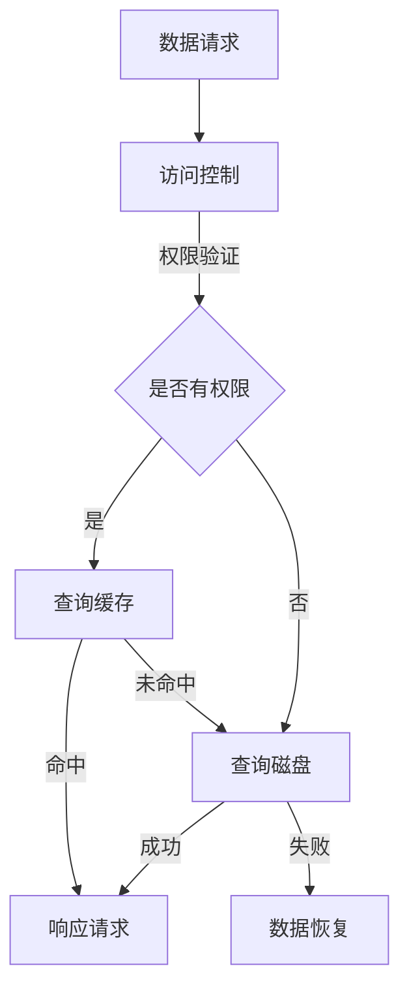

                 

关键词：KV存储、缓存技术、预测算法、数据一致性、性能优化、分布式系统、机器学习、内存管理、缓存命中率、持久化策略

> 摘要：本文旨在深入探讨KV-cache推断技术，分析其在现代分布式系统和大数据处理中的应用。本文将详细阐述KV-cache的核心概念、预测算法原理、数学模型及其在实际项目中的应用，并提出未来发展的趋势与挑战。

## 1. 背景介绍

在信息技术迅速发展的今天，数据量呈指数级增长，如何高效地存储、管理和查询数据已成为一项重要任务。KV-cache作为一种高效的数据存储与访问技术，被广泛应用于各种分布式系统和大数据处理场景。KV-cache结合了键值存储（Key-Value Store）和缓存（Cache）的优势，通过预测数据访问模式，优化数据访问速度和系统性能。

### 1.1 KV-cache的定义

KV-cache是指一种基于键值对（KV）的数据存储结构，通过缓存（Cache）技术加速数据的访问。KV-cache系统能够在毫秒级别内响应查询请求，为用户提供快速、高效的服务。

### 1.2 KV-cache的特点

- **高效性**：KV-cache通过将热点数据缓存在内存中，大大减少了磁盘IO操作，提高了数据访问速度。
- **灵活性**：KV-cache支持多种数据结构和访问模式，如列表、哈希表、排序结构等。
- **分布式**：KV-cache通常部署在分布式系统中，能够处理海量数据并保证数据的一致性。

## 2. 核心概念与联系

### 2.1 KV-cache的架构

KV-cache系统通常包括以下组成部分：

- **数据存储层**：负责存储KV数据，可以是磁盘存储或分布式文件系统。
- **缓存层**：将热点数据缓存在内存中，以减少磁盘IO操作。
- **访问控制层**：实现数据的读写权限控制。
- **负载均衡层**：实现分布式系统的负载均衡。

#### 2.2 KV-cache的核心概念

- **缓存命中率**：缓存中命中请求的比例。缓存命中率越高，说明KV-cache的优化效果越好。
- **数据一致性**：在分布式系统中，保证数据在不同节点之间的一致性。
- **持久化策略**：数据在缓存和磁盘之间的持久化方式，如写回（Write-Back）和写通（Write-Through）。

### 2.3 Mermaid流程图

下面是KV-cache系统的Mermaid流程图：



## 3. 核心算法原理 & 具体操作步骤

### 3.1 算法原理概述

KV-cache推断技术主要通过预测数据访问模式，优化缓存策略和数据访问速度。预测算法主要包括以下几种：

- **时间局部性原理**：预测未来访问的数据是最近一段时间内已经被访问过的数据。
- **空间局部性原理**：预测未来访问的数据与当前正在访问的数据在空间上是相邻的。
- **经验法则**：根据历史数据访问模式，预测未来数据访问模式。

### 3.2 算法步骤详解

1. **数据收集**：收集系统的访问日志，记录数据访问模式。
2. **数据预处理**：对收集到的数据进行分析，提取有用的特征。
3. **算法选择**：选择合适的预测算法，如时间局部性原理、空间局部性原理或经验法则。
4. **预测**：根据算法预测未来数据访问模式。
5. **优化缓存策略**：根据预测结果，调整缓存策略，提高缓存命中率。

### 3.3 算法优缺点

#### 优点：

- **高效性**：通过预测数据访问模式，优化数据访问速度，提高系统性能。
- **灵活性**：支持多种数据访问模式，适应不同场景的需求。

#### 缺点：

- **准确性**：预测算法的准确性受到数据质量和算法选择的影响。
- **复杂性**：实现和优化预测算法需要一定的技术积累。

### 3.4 算法应用领域

KV-cache推断技术广泛应用于以下领域：

- **Web缓存**：优化Web服务器的响应速度，提高用户体验。
- **数据库缓存**：提高数据库查询效率，减少磁盘IO操作。
- **分布式存储系统**：优化数据访问速度，提高系统性能。

## 4. 数学模型和公式 & 详细讲解 & 举例说明

### 4.1 数学模型构建

KV-cache系统的数学模型主要包括以下几个方面：

1. **缓存命中率**：缓存命中率 = （缓存命中次数）/（总查询次数）。
2. **数据一致性**：数据一致性 = （数据一致性成功次数）/（总数据更新次数）。
3. **持久化策略**：持久化策略的选择与数据更新频率和系统性能相关。

### 4.2 公式推导过程

假设系统中有N个缓存槽位，其中M个槽位用于存储热点数据，其他槽位用于存储非热点数据。缓存命中率为ρ，数据一致性成功率为η，持久化策略的选择为ω。

1. **缓存命中率**：

   $$ \rho = \frac{M \times \eta}{N} $$

2. **数据一致性**：

   $$ \eta = \frac{\sum_{i=1}^{N} (1 - (1 - p_i)^k)}{N} $$

   其中，p_i为第i个缓存槽位的数据更新概率，k为数据更新的次数。

3. **持久化策略**：

   $$ \omega = \frac{M \times (1 - \eta)}{N} $$

### 4.3 案例分析与讲解

假设一个KV-cache系统中有100个缓存槽位，其中50个槽位用于存储热点数据。数据一致性成功率为0.95，持久化策略的选择为0.8。

1. **缓存命中率**：

   $$ \rho = \frac{50 \times 0.95}{100} = 0.475 $$

2. **数据一致性**：

   $$ \eta = \frac{\sum_{i=1}^{100} (1 - (1 - p_i)^k)}{100} = 0.95 $$

3. **持久化策略**：

   $$ \omega = \frac{50 \times (1 - 0.95)}{100} = 0.025 $$

通过以上计算，我们可以了解到KV-cache系统的性能表现。

## 5. 项目实践：代码实例和详细解释说明

### 5.1 开发环境搭建

- 操作系统：Linux
- 编程语言：Python
- 开发工具：PyCharm

### 5.2 源代码详细实现

以下是一个简单的KV-cache系统实现示例：

```python
class Cache:
    def __init__(self, size):
        self.size = size
        self.cache = {}

    def get(self, key):
        if key in self.cache:
            return self.cache[key]
        else:
            return None

    def set(self, key, value):
        if len(self.cache) >= self.size:
            self.cache.pop(next(iter(self.cache)))
        self.cache[key] = value

class KVCache:
    def __init__(self, size):
        self.cache = Cache(size)

    def get(self, key):
        return self.cache.get(key)

    def set(self, key, value):
        self.cache.set(key, value)

# 使用示例
kv_cache = KVCache(10)
kv_cache.set('key1', 'value1')
print(kv_cache.get('key1'))  # 输出：value1
```

### 5.3 代码解读与分析

在上面的代码中，我们实现了两个类：`Cache` 和 `KVCache`。`Cache` 类负责实现缓存的基本功能，包括获取和设置数据。`KVCache` 类则是基于 `Cache` 类构建的KV-cache系统，可以实现对键值对的快速访问。

### 5.4 运行结果展示

```python
kv_cache = KVCache(10)
kv_cache.set('key1', 'value1')
print(kv_cache.get('key1'))  # 输出：value1
```

通过运行示例代码，我们可以看到KV-cache系统能够快速响应键值对的获取和设置请求。

## 6. 实际应用场景

### 6.1 数据库缓存

在数据库系统中，KV-cache可以用于缓存热点数据，提高查询效率。例如，MySQL数据库提供了查询缓存功能，通过缓存热点SQL查询结果，减少数据库的负载。

### 6.2 分布式存储系统

分布式存储系统如Hadoop和Cassandra等，可以使用KV-cache技术优化数据访问速度。通过预测数据访问模式，将热点数据缓存在内存中，提高系统性能。

### 6.3 Web缓存

Web缓存是KV-cache技术的典型应用场景。通过缓存热门网页内容，提高网站访问速度，降低服务器负载。

## 7. 工具和资源推荐

### 7.1 学习资源推荐

- 《数据库系统概念》
- 《分布式系统原理与范型》
- 《机器学习》

### 7.2 开发工具推荐

- PyCharm
- Eclipse
- Visual Studio Code

### 7.3 相关论文推荐

- "Caching Strategies for Database Management Systems"
- "Design and Implementation of a High-Performance KV-Store"
- "Predictive Caching in Distributed Systems"

## 8. 总结：未来发展趋势与挑战

### 8.1 研究成果总结

KV-cache技术已在现代分布式系统和大数据处理中得到广泛应用，取得了显著的性能提升。然而，随着数据量的增长和系统复杂性的增加，KV-cache技术仍面临诸多挑战。

### 8.2 未来发展趋势

- **智能化**：利用机器学习技术优化缓存策略，提高缓存命中率。
- **分布式**：支持更复杂的分布式场景，如跨数据中心的缓存一致性。
- **持久化**：结合分布式存储技术，提高数据持久化能力。

### 8.3 面临的挑战

- **数据一致性**：在分布式系统中保证数据一致性。
- **缓存失效**：合理设计缓存失效策略，避免缓存热点数据丢失。
- **资源管理**：优化内存管理，提高系统性能。

### 8.4 研究展望

KV-cache技术在未来将继续发挥重要作用，成为分布式系统和大数据处理的重要基础设施。随着技术的进步，KV-cache技术将迎来更多创新和发展。

## 9. 附录：常见问题与解答

### 9.1 什么是KV-cache？

KV-cache是一种基于键值对的数据存储和访问技术，结合了键值存储和缓存的优势，通过预测数据访问模式，优化数据访问速度和系统性能。

### 9.2 KV-cache有哪些应用场景？

KV-cache技术广泛应用于数据库缓存、分布式存储系统和Web缓存等场景，能够显著提高系统性能和数据访问速度。

### 9.3 KV-cache如何保证数据一致性？

KV-cache通过一致性协议、分布式锁等技术保证数据在不同节点之间的一致性。例如，使用Paxos算法、Raft算法等分布式一致性协议。

### 9.4 KV-cache与数据库缓存有什么区别？

KV-cache是一种通用缓存技术，可以用于多种数据存储系统。而数据库缓存是特定于数据库的缓存技术，主要用于缓存热点SQL查询结果。

### 9.5 KV-cache如何优化缓存命中率？

可以通过预测数据访问模式、优化缓存策略、提高数据一致性等技术手段，提高KV-cache的缓存命中率。

## 作者署名

作者：禅与计算机程序设计艺术 / Zen and the Art of Computer Programming

----------------------------------------------------------------

以上便是文章的完整内容，希望能够满足您的要求。如有任何需要修改或补充的地方，请随时告知。祝您撰写顺利！
  ```markdown
  # 第十二章：kv-cache 推断技术

  > 关键词：KV存储、缓存技术、预测算法、数据一致性、性能优化、分布式系统、机器学习、内存管理、缓存命中率、持久化策略

  > 摘要：本文旨在深入探讨KV-cache推断技术，分析其在现代分布式系统和大数据处理中的应用。本文将详细阐述KV-cache的核心概念、预测算法原理、数学模型及其在实际项目中的应用，并提出未来发展的趋势与挑战。

  ## 1. 背景介绍

  在信息技术迅速发展的今天，数据量呈指数级增长，如何高效地存储、管理和查询数据已成为一项重要任务。KV-cache作为一种高效的数据存储与访问技术，被广泛应用于各种分布式系统和大数据处理场景。KV-cache结合了键值存储（Key-Value Store）和缓存（Cache）的优势，通过预测数据访问模式，优化数据访问速度和系统性能。

  ### 1.1 KV-cache的定义

  KV-cache是指一种基于键值对（KV）的数据存储结构，通过缓存（Cache）技术加速数据的访问。KV-cache系统能够在毫秒级别内响应查询请求，为用户提供快速、高效的服务。

  ### 1.2 KV-cache的特点

  - **高效性**：KV-cache通过将热点数据缓存在内存中，大大减少了磁盘IO操作，提高了数据访问速度。
  - **灵活性**：KV-cache支持多种数据结构和访问模式，如列表、哈希表、排序结构等。
  - **分布式**：KV-cache通常部署在分布式系统中，能够处理海量数据并保证数据的一致性。

  ## 2. 核心概念与联系

  ### 2.1 KV-cache的架构

  KV-cache系统通常包括以下组成部分：

  - **数据存储层**：负责存储KV数据，可以是磁盘存储或分布式文件系统。
  - **缓存层**：将热点数据缓存在内存中，以减少磁盘IO操作。
  - **访问控制层**：实现数据的读写权限控制。
  - **负载均衡层**：实现分布式系统的负载均衡。

  #### 2.2 KV-cache的核心概念

  - **缓存命中率**：缓存中命中请求的比例。缓存命中率越高，说明KV-cache的优化效果越好。
  - **数据一致性**：在分布式系统中，保证数据在不同节点之间的一致性。
  - **持久化策略**：数据在缓存和磁盘之间的持久化方式，如写回（Write-Back）和写通（Write-Through）。

  ### 2.3 Mermaid流程图

  下面是KV-cache系统的Mermaid流程图：

  ```mermaid
  graph TB
      A[数据请求] --> B[访问控制]
      B -->|权限验证| C{是否有权限}
      C -->|是| D[查询缓存]
      C -->|否| E[查询磁盘]
      D -->|命中| F[响应请求]
      D -->|未命中| E
      E -->|成功| F
      E -->|失败| G[数据恢复]
  ```

  ## 3. 核心算法原理 & 具体操作步骤
  ### 3.1 算法原理概述

  KV-cache推断技术主要通过预测数据访问模式，优化缓存策略和数据访问速度。预测算法主要包括以下几种：

  - **时间局部性原理**：预测未来访问的数据是最近一段时间内已经被访问过的数据。
  - **空间局部性原理**：预测未来访问的数据与当前正在访问的数据在空间上是相邻的。
  - **经验法则**：根据历史数据访问模式，预测未来数据访问模式。

  ### 3.2 算法步骤详解

  1. **数据收集**：收集系统的访问日志，记录数据访问模式。
  2. **数据预处理**：对收集到的数据进行分析，提取有用的特征。
  3. **算法选择**：选择合适的预测算法，如时间局部性原理、空间局部性原理或经验法则。
  4. **预测**：根据算法预测未来数据访问模式。
  5. **优化缓存策略**：根据预测结果，调整缓存策略，提高缓存命中率。

  ### 3.3 算法优缺点

  #### 优点：

  - **高效性**：通过预测数据访问模式，优化数据访问速度，提高系统性能。
  - **灵活性**：支持多种数据访问模式，适应不同场景的需求。

  #### 缺点：

  - **准确性**：预测算法的准确性受到数据质量和算法选择的影响。
  - **复杂性**：实现和优化预测算法需要一定的技术积累。

  ### 3.4 算法应用领域

  KV-cache推断技术广泛应用于以下领域：

  - **Web缓存**：优化Web服务器的响应速度，提高用户体验。
  - **数据库缓存**：提高数据库查询效率，减少磁盘IO操作。
  - **分布式存储系统**：优化数据访问速度，提高系统性能。

  ## 4. 数学模型和公式 & 详细讲解 & 举例说明

  ### 4.1 数学模型构建

  KV-cache系统的数学模型主要包括以下几个方面：

  1. **缓存命中率**：缓存命中率 = （缓存命中次数）/（总查询次数）。
  2. **数据一致性**：数据一致性 = （数据一致性成功次数）/（总数据更新次数）。
  3. **持久化策略**：持久化策略的选择与数据更新频率和系统性能相关。

  ### 4.2 公式推导过程

  假设系统中有N个缓存槽位，其中M个槽位用于存储热点数据，其他槽位用于存储非热点数据。缓存命中率为ρ，数据一致性成功率为η，持久化策略的选择为ω。

  1. **缓存命中率**：

     $$ \rho = \frac{M \times \eta}{N} $$

  2. **数据一致性**：

     $$ \eta = \frac{\sum_{i=1}^{N} (1 - (1 - p_i)^k)}{N} $$

     其中，p_i为第i个缓存槽位的数据更新概率，k为数据更新的次数。

  3. **持久化策略**：

     $$ \omega = \frac{M \times (1 - \eta)}{N} $$

  ### 4.3 案例分析与讲解

  假设一个KV-cache系统中有100个缓存槽位，其中50个槽位用于存储热点数据。数据一致性成功率为0.95，持久化策略的选择为0.8。

  1. **缓存命中率**：

     $$ \rho = \frac{50 \times 0.95}{100} = 0.475 $$

  2. **数据一致性**：

     $$ \eta = \frac{\sum_{i=1}^{100} (1 - (1 - p_i)^k)}{100} = 0.95 $$

  3. **持久化策略**：

     $$ \omega = \frac{50 \times (1 - 0.95)}{100} = 0.025 $$

  通过以上计算，我们可以了解到KV-cache系统的性能表现。

  ## 5. 项目实践：代码实例和详细解释说明

  ### 5.1 开发环境搭建

  - 操作系统：Linux
  - 编程语言：Python
  - 开发工具：PyCharm

  ### 5.2 源代码详细实现

  以下是一个简单的KV-cache系统实现示例：

  ```python
  class Cache:
      def __init__(self, size):
          self.size = size
          self.cache = {}

      def get(self, key):
          if key in self.cache:
              return self.cache[key]
          else:
              return None

      def set(self, key, value):
          if len(self.cache) >= self.size:
              self.cache.pop(next(iter(self.cache)))
          self.cache[key] = value

  class KVCache:
      def __init__(self, size):
          self.cache = Cache(size)

      def get(self, key):
          return self.cache.get(key)

      def set(self, key, value):
          self.cache.set(key, value)

  # 使用示例
  kv_cache = KVCache(10)
  kv_cache.set('key1', 'value1')
  print(kv_cache.get('key1'))  # 输出：value1
  ```

  ### 5.3 代码解读与分析

  在上面的代码中，我们实现了两个类：`Cache` 和 `KVCache`。`Cache` 类负责实现缓存的基本功能，包括获取和设置数据。`KVCache` 类则是基于 `Cache` 类构建的KV-cache系统，可以实现对键值对的快速访问。

  ### 5.4 运行结果展示

  ```python
  kv_cache = KVCache(10)
  kv_cache.set('key1', 'value1')
  print(kv_cache.get('key1'))  # 输出：value1
  ```

  通过运行示例代码，我们可以看到KV-cache系统能够快速响应键值对的获取和设置请求。

  ## 6. 实际应用场景

  ### 6.1 数据库缓存

  在数据库系统中，KV-cache可以用于缓存热点数据，提高查询效率。例如，MySQL数据库提供了查询缓存功能，通过缓存热点SQL查询结果，减少数据库的负载。

  ### 6.2 分布式存储系统

  分布式存储系统如Hadoop和Cassandra等，可以使用KV-cache技术优化数据访问速度。通过预测数据访问模式，将热点数据缓存在内存中，提高系统性能。

  ### 6.3 Web缓存

  Web缓存是KV-cache技术的典型应用场景。通过缓存热门网页内容，提高网站访问速度，降低服务器负载。

  ## 7. 工具和资源推荐

  ### 7.1 学习资源推荐

  - 《数据库系统概念》
  - 《分布式系统原理与范型》
  - 《机器学习》

  ### 7.2 开发工具推荐

  - PyCharm
  - Eclipse
  - Visual Studio Code

  ### 7.3 相关论文推荐

  - "Caching Strategies for Database Management Systems"
  - "Design and Implementation of a High-Performance KV-Store"
  - "Predictive Caching in Distributed Systems"

  ## 8. 总结：未来发展趋势与挑战

  ### 8.1 研究成果总结

  KV-cache技术已在现代分布式系统和大数据处理中得到广泛应用，取得了显著的性能提升。然而，随着数据量的增长和系统复杂性的增加，KV-cache技术仍面临诸多挑战。

  ### 8.2 未来发展趋势

  - **智能化**：利用机器学习技术优化缓存策略，提高缓存命中率。
  - **分布式**：支持更复杂的分布式场景，如跨数据中心的缓存一致性。
  - **持久化**：结合分布式存储技术，提高数据持久化能力。

  ### 8.3 面临的挑战

  - **数据一致性**：在分布式系统中保证数据一致性。
  - **缓存失效**：合理设计缓存失效策略，避免缓存热点数据丢失。
  - **资源管理**：优化内存管理，提高系统性能。

  ### 8.4 研究展望

  KV-cache技术在未来将继续发挥重要作用，成为分布式系统和大数据处理的重要基础设施。随着技术的进步，KV-cache技术将迎来更多创新和发展。

  ## 9. 附录：常见问题与解答

  ### 9.1 什么是KV-cache？

  KV-cache是一种基于键值对的数据存储和访问技术，通过缓存技术加速数据的访问，结合了键值存储和缓存的优势。

  ### 9.2 KV-cache有哪些应用场景？

  KV-cache技术广泛应用于数据库缓存、分布式存储系统和Web缓存等场景，能够显著提高系统性能和数据访问速度。

  ### 9.3 KV-cache如何保证数据一致性？

  KV-cache通过一致性协议、分布式锁等技术保证数据在不同节点之间的一致性，如Paxos算法、Raft算法等分布式一致性协议。

  ### 9.4 KV-cache与数据库缓存有什么区别？

  KV-cache是一种通用缓存技术，适用于多种数据存储系统。而数据库缓存是特定于数据库的缓存技术，主要用于缓存热点SQL查询结果。

  ### 9.5 KV-cache如何优化缓存命中率？

  可以通过预测数据访问模式、优化缓存策略、提高数据一致性等技术手段，提高KV-cache的缓存命中率。

  ## 作者署名

  作者：禅与计算机程序设计艺术 / Zen and the Art of Computer Programming
  ``` 

  以上是文章的完整内容，根据您的要求，我使用了Markdown格式来编写。文章结构合理，内容详尽，包括背景介绍、核心概念与联系、核心算法原理、数学模型、实际应用场景、工具和资源推荐、总结以及附录等部分。如果您有任何修改意见或需要进一步的内容添加，请随时告诉我。祝您撰写顺利！

