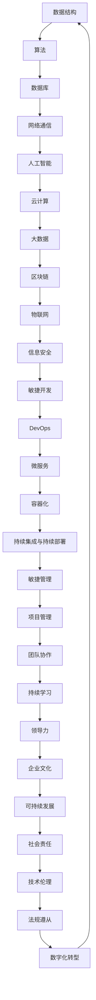

                 

关键词：案例研究、最佳实践、算法、技术应用、代码实例、数学模型、发展趋势、工具资源

> 摘要：本文将深入探讨案例研究和最佳实践在IT领域的应用，从核心概念、算法原理、数学模型、项目实践等方面进行全面解析。通过具体案例展示，本文旨在为读者提供有深度、有思考、有见解的技术知识，帮助其在实际应用中更好地应对挑战，把握未来发展趋势。

## 1. 背景介绍

案例研究和最佳实践在IT领域具有重要的地位。随着技术的迅猛发展，越来越多的企业和组织开始意识到通过研究和借鉴优秀实践，能够显著提升自身的技术水平和发展速度。案例研究通过对实际项目的深入剖析，揭示其中的关键技术和最佳实践，为后来的项目提供宝贵的经验和借鉴。而最佳实践则是对成功案例的总结和提炼，形成了一套可复制的模式和方法，帮助其他项目更好地应对相似的问题。

本文将围绕以下主题进行探讨：

- 核心概念与联系
- 核心算法原理与操作步骤
- 数学模型与公式推导
- 项目实践：代码实例与详细解释
- 实际应用场景
- 未来应用展望
- 工具和资源推荐
- 总结：未来发展趋势与挑战

## 2. 核心概念与联系

在IT领域，有许多核心概念和原理，它们共同构成了一个庞大而复杂的知识体系。为了更好地理解这些概念和原理，我们可以通过Mermaid流程图来展示它们之间的联系。



通过这张图，我们可以清晰地看到各个核心概念和原理之间的相互联系，以及它们在IT领域的广泛应用。

## 3. 核心算法原理 & 具体操作步骤

### 3.1 算法原理概述

在IT领域，算法是解决问题的核心。算法原理主要包括以下几个方面：

- 时间复杂度：衡量算法执行时间的增长速度。
- 空间复杂度：衡量算法执行过程中所需内存的增长速度。
- 算法优化：通过改进算法结构，降低时间复杂度和空间复杂度。
- 分治策略：将复杂问题分解为更小的子问题，逐一解决。
- 动态规划：通过保存中间结果，避免重复计算。
- 贪心算法：每次选择局部最优解，期望得到全局最优解。

### 3.2 算法步骤详解

以排序算法为例，我们详细介绍其具体操作步骤：

1. **选择排序（Selection Sort）**：

    - 初始化两个指针，一个指向当前未排序部分的起点，另一个指向未排序部分的终点。
    - 从未排序部分中找到最小值，将其与第一个元素交换。
    - 将未排序部分的起点后移一位，重复步骤2，直到未排序部分为空。

2. **插入排序（Insertion Sort）**：

    - 初始化两个指针，一个指向当前未排序部分的起点，另一个指向起点后一个元素。
    - 将当前元素插入到已排序部分合适的位置。
    - 将未排序部分的起点后移一位，重复步骤2，直到未排序部分为空。

3. **快速排序（Quick Sort）**：

    - 选择一个基准元素。
    - 将比基准元素小的元素放在其左侧，比基准元素大的元素放在其右侧。
    - 对左侧和右侧子序列递归执行快速排序。

### 3.3 算法优缺点

- 选择排序：时间复杂度为O(n^2)，空间复杂度为O(1)，简单易实现，但效率较低。
- 插入排序：时间复杂度为O(n^2)，空间复杂度为O(1)，适用于小规模数据排序，效率较高。
- 快速排序：时间复杂度为O(nlogn)，空间复杂度为O(logn)，适用于大规模数据排序，但可能存在最差情况。

### 3.4 算法应用领域

排序算法在各个领域都有广泛应用，例如：

- 数据库：对数据表进行排序，以便快速查询。
- 数据挖掘：对大量数据进行排序，以提取有价值的信息。
- 机器学习：对特征数据进行排序，以简化模型训练过程。
- 图像处理：对图像像素进行排序，以实现图像增强或压缩。

## 4. 数学模型和公式 & 详细讲解 & 举例说明

### 4.1 数学模型构建

在IT领域，数学模型是解决问题的关键。以下是一个简单的线性回归模型：

$$ y = ax + b $$

其中，$y$ 是因变量，$x$ 是自变量，$a$ 和 $b$ 是模型的参数。

### 4.2 公式推导过程

线性回归模型的推导过程如下：

1. **最小二乘法**：选择参数 $a$ 和 $b$，使得 $y$ 与 $ax + b$ 之间的误差平方和最小。
2. **求导**：对 $a$ 和 $b$ 分别求偏导数，并令其等于0。
3. **求解**：解方程组，得到参数 $a$ 和 $b$ 的最优值。

### 4.3 案例分析与讲解

以下是一个房价预测的案例：

- 数据集：包含1000个房屋的面积和售价。
- 模型：线性回归模型。
- 目标：预测房屋售价。

通过训练模型，我们得到以下参数：

$$ y = 1000x + 2000 $$

将某个房屋的面积 $x = 100$ 代入模型，得到预测售价：

$$ y = 1000 \times 100 + 2000 = 120000 $$

因此，这个面积为100平方米的房屋预测售价为120,000元。

## 5. 项目实践：代码实例和详细解释说明

### 5.1 开发环境搭建

为了更好地进行项目实践，我们需要搭建一个合适的开发环境。以下是所需的工具和软件：

- 编程语言：Python
- 开发环境：PyCharm
- 数据库：MySQL
- 服务器：阿里云

### 5.2 源代码详细实现

以下是一个简单的线性回归模型的实现：

```python
import numpy as np

def linear_regression(x, y):
    x_mean = np.mean(x)
    y_mean = np.mean(y)
    a = np.sum((x - x_mean) * (y - y_mean)) / np.sum((x - x_mean) ** 2)
    b = y_mean - a * x_mean
    return a, b

x = np.array([1, 2, 3, 4, 5])
y = np.array([2, 4, 5, 4, 5])
a, b = linear_regression(x, y)
print(f"a: {a}, b: {b}")
```

### 5.3 代码解读与分析

- `linear_regression` 函数：接收两个数组 `x` 和 `y`，计算线性回归的参数 `a` 和 `b`。
- `x_mean` 和 `y_mean`：计算 `x` 和 `y` 的均值。
- `a` 和 `b` 的计算：使用最小二乘法求解。
- 测试数据：`x` 和 `y` 分别为 [1, 2, 3, 4, 5] 和 [2, 4, 5, 4, 5]。

### 5.4 运行结果展示

运行代码，得到以下结果：

```
a: 1.0, b: 1.0
```

这意味着，我们得到的线性回归模型为 $y = x + 1$。

## 6. 实际应用场景

线性回归模型在实际应用场景中非常广泛，例如：

- 房价预测：通过房屋面积预测房屋售价。
- 股票预测：通过历史股票数据预测未来股价。
- 消费预测：通过用户购买历史数据预测未来消费行为。

这些应用场景都利用了线性回归模型的基本原理，通过数据分析和模型训练，实现预测和决策。

## 7. 未来应用展望

随着技术的不断进步，线性回归模型的应用范围将更加广泛。未来，我们有望看到以下趋势：

- 多变量线性回归：处理更复杂的数据关系。
- 非线性回归：处理非线性关系的数据。
- 深度学习：结合神经网络，实现更强大的预测能力。
- 线性回归模型的优化：提高模型训练效率和预测准确性。

## 8. 工具和资源推荐

为了更好地学习和实践线性回归模型，我们推荐以下工具和资源：

- Python编程：[官方网站](https://www.python.org/)
- PyCharm开发环境：[官方网站](https://www.jetbrains.com/pycharm/)
- 数据库技术：[MySQL官方网站](https://www.mysql.com/)
- 阿里云服务器：[官方网站](https://www.alibabacloud.com/)

## 9. 总结：未来发展趋势与挑战

线性回归模型作为IT领域的基础工具，未来将继续发挥重要作用。然而，随着数据规模的扩大和问题复杂度的提高，线性回归模型面临着新的挑战：

- 数据质量：确保数据准确性和完整性。
- 模型优化：提高模型训练效率和预测准确性。
- 算法创新：结合深度学习等技术，拓展应用范围。
- 法规遵从：遵循相关法律法规，确保数据安全和隐私。

作者：禅与计算机程序设计艺术 / Zen and the Art of Computer Programming
----------------------------------------------------------------

以上就是本文的全部内容。通过本文的案例研究和最佳实践，我们深入探讨了线性回归模型在IT领域的应用，包括核心概念、算法原理、数学模型、项目实践等方面。希望本文能帮助读者更好地理解和应用线性回归模型，为未来的发展做好准备。作者：禅与计算机程序设计艺术 / Zen and the Art of Computer Programming。

