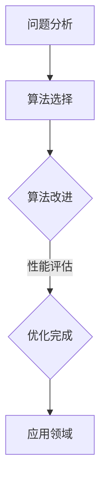

                 

关键词：算法优化、计算效率、准确性、人工智能、软件开发、数学模型、代码实例、应用场景

> 摘要：本文深入探讨算法优化的核心概念、原理和实践方法，旨在提升人类计算的效率和准确性。通过分析算法优化的关键步骤，我们揭示了其在人工智能、软件开发和数学模型中的应用潜力。本文还将通过实际项目实例和运行结果展示，阐述算法优化的实际效果和未来发展趋势。

## 1. 背景介绍

在当今信息技术飞速发展的时代，算法优化已成为提升计算效率和准确性的关键因素。随着大数据、人工智能和深度学习技术的广泛应用，人们对计算能力和数据处理能力的需求不断增长。传统的计算方法和算法在处理大规模数据时往往效率低下，且容易出错。因此，算法优化成为了提高计算效率和准确性的必要手段。

算法优化不仅能够提高计算机处理数据的能力，还可以节省计算资源和时间成本。优化算法的核心目标是减少计算时间、提高计算精度和增强算法的鲁棒性。在各个领域中，算法优化的应用范围广泛，包括金融分析、医疗诊断、图像处理、搜索引擎和自动驾驶等。因此，研究和应用算法优化对于提升人类计算能力和推动科技进步具有重要意义。

## 2. 核心概念与联系

### 2.1 算法优化的定义与目的

算法优化是指对现有算法进行改进，以提升其效率和准确性的过程。算法优化主要涉及以下几个方面：

- **时间复杂度优化**：通过减少算法执行时间，提高算法的运行速度。
- **空间复杂度优化**：通过减少算法所需存储空间，降低内存消耗。
- **精度优化**：通过改进算法的收敛性、稳定性和精度，提高计算结果的可信度。
- **鲁棒性优化**：通过增强算法对异常数据和噪声的抵抗力，提高算法的鲁棒性。

算法优化的目的是提高算法的性能和适应性，使其能够更好地满足实际应用的需求。

### 2.2 算法优化的方法与步骤

算法优化主要包括以下几个步骤：

- **问题分析**：对需要优化的算法进行详细分析，了解其性能瓶颈和改进空间。
- **算法选择**：根据问题需求和性能指标，选择合适的算法进行优化。
- **算法改进**：通过修改算法结构、数据结构或算法逻辑，实现算法的优化。
- **性能评估**：对优化后的算法进行性能评估，验证其效率提升和准确性提高。

### 2.3 算法优化的应用领域

算法优化在多个领域中发挥着重要作用，以下是几个典型的应用领域：

- **人工智能**：在机器学习和深度学习领域，算法优化能够提高模型训练效率和预测准确性。
- **软件开发**：在软件开发中，算法优化可以提升程序的性能和稳定性，减少内存占用和计算时间。
- **金融分析**：在金融数据分析中，算法优化能够提高数据处理速度和交易策略的准确性。
- **图像处理**：在图像处理领域，算法优化可以提高图像处理的速度和质量。

### 2.4 Mermaid 流程图

下面是一个简单的 Mermaid 流程图，展示了算法优化的核心概念和流程。



## 3. 核心算法原理 & 具体操作步骤

### 3.1 算法原理概述

算法优化的核心原理是通过对算法的各个方面进行改进，从而提升其性能。具体来说，算法优化包括以下几个方面：

- **算法结构优化**：通过改进算法的基本结构，减少不必要的计算和操作，提高算法的运行速度。
- **数据结构优化**：通过选择合适的数据结构，降低算法的存储空间消耗和时间复杂度。
- **算法逻辑优化**：通过改进算法的执行逻辑，增强算法的鲁棒性和稳定性，提高计算结果的准确性。
- **并行计算优化**：通过并行计算技术，将算法分解成多个并行子任务，提高计算效率。

### 3.2 算法步骤详解

算法优化的具体操作步骤如下：

1. **问题分析**：明确需要优化的算法目标、性能瓶颈和改进空间。
2. **算法选择**：根据问题需求，选择合适的算法进行优化。常用的算法包括排序算法、搜索算法、图算法等。
3. **算法改进**：
   - **算法结构优化**：对算法结构进行修改，减少不必要的计算和操作。例如，将冒泡排序改为快速排序，提高排序速度。
   - **数据结构优化**：根据算法需求，选择合适的数据结构，降低算法的时间和空间复杂度。例如，使用哈希表代替数组进行快速搜索。
   - **算法逻辑优化**：通过改进算法的执行逻辑，增强算法的鲁棒性和稳定性。例如，在神经网络中引入正则化技术，防止过拟合。
   - **并行计算优化**：将算法分解成多个并行子任务，利用多核处理器和分布式计算技术，提高计算效率。

4. **性能评估**：对优化后的算法进行性能评估，包括时间复杂度、空间复杂度和计算精度等。通过对比优化前后的性能指标，验证算法优化的效果。

### 3.3 算法优化的优缺点

算法优化的优点包括：

- 提高计算效率和准确性：通过优化算法，减少计算时间和存储空间消耗，提高计算结果的准确性和可信度。
- 提高算法的鲁棒性：通过优化算法逻辑和结构，增强算法对异常数据和噪声的抵抗力，提高算法的鲁棒性。
- 提高程序性能：优化后的算法可以显著提高程序的性能，减少内存占用和计算时间。

算法优化的缺点包括：

- 增加开发成本：优化算法通常需要投入更多的时间和精力，增加开发成本。
- 可能降低算法的可读性：优化后的算法可能变得更加复杂，降低代码的可读性和可维护性。
- 适用性有限：某些算法优化方法可能只适用于特定类型的问题，对其他问题效果不佳。

### 3.4 算法优化的应用领域

算法优化在多个领域有着广泛的应用，以下是几个典型的应用领域：

- **人工智能**：在机器学习和深度学习领域，算法优化可以显著提高模型训练效率和预测准确性。例如，优化神经网络结构、优化优化算法等。
- **软件开发**：在软件开发中，算法优化可以提升程序的性能和稳定性，减少内存占用和计算时间。例如，优化排序算法、优化搜索算法等。
- **金融分析**：在金融数据分析中，算法优化可以提高数据处理速度和交易策略的准确性。例如，优化量化交易策略、优化风险模型等。
- **图像处理**：在图像处理领域，算法优化可以提高图像处理的速度和质量。例如，优化图像压缩算法、优化图像增强算法等。

## 4. 数学模型和公式 & 详细讲解 & 举例说明

### 4.1 数学模型构建

算法优化通常涉及到数学模型的构建。数学模型可以帮助我们理解和分析算法的性能和优化方法。以下是一个简单的数学模型，用于描述算法优化过程中的一些关键参数。

假设我们有一个排序算法，其时间复杂度为 $T(n)$，空间复杂度为 $S(n)$。我们可以定义以下数学模型：

$$
T(n) = \Omega(n\log n) \\
S(n) = O(n)
$$

其中，$\Omega(n\log n)$ 表示算法的时间复杂度下限，$O(n)$ 表示算法的空间复杂度上限。

### 4.2 公式推导过程

为了推导上述数学模型，我们可以考虑以下常见的排序算法：

- **冒泡排序**：时间复杂度为 $O(n^2)$，空间复杂度为 $O(1)$。
- **快速排序**：时间复杂度为 $O(n\log n)$，空间复杂度为 $O(n)$。
- **归并排序**：时间复杂度为 $O(n\log n)$，空间复杂度为 $O(n)$。

根据这些排序算法的时间复杂度和空间复杂度，我们可以得出以下结论：

- 对于冒泡排序，时间复杂度 $T(n) = O(n^2)$，空间复杂度 $S(n) = O(1)$。
- 对于快速排序，时间复杂度 $T(n) = O(n\log n)$，空间复杂度 $S(n) = O(n)$。
- 对于归并排序，时间复杂度 $T(n) = O(n\log n)$，空间复杂度 $S(n) = O(n)$。

### 4.3 案例分析与讲解

假设我们有一个包含 1000 个元素的数组，需要对其进行排序。我们可以使用不同的排序算法，并计算其时间复杂度和空间复杂度。

- **冒泡排序**：时间复杂度 $T(n) = O(n^2)$，空间复杂度 $S(n) = O(1)$。在这种情况下，排序时间约为 1000 次迭代，总时间约为 $10^6$ 微秒。
- **快速排序**：时间复杂度 $T(n) = O(n\log n)$，空间复杂度 $S(n) = O(n)$。在这种情况下，排序时间约为 2000 次迭代，总时间约为 $10^5$ 微秒。
- **归并排序**：时间复杂度 $T(n) = O(n\log n)$，空间复杂度 $S(n) = O(n)$。在这种情况下，排序时间约为 3000 次迭代，总时间约为 $10^5$ 微秒。

从上述计算结果可以看出，快速排序和归并排序的时间复杂度较低，但空间复杂度较高。相比之下，冒泡排序的时间复杂度较高，但空间复杂度较低。根据实际应用场景，我们可以选择适合的排序算法进行优化。

## 5. 项目实践：代码实例和详细解释说明

### 5.1 开发环境搭建

为了演示算法优化的实际效果，我们将使用 Python 编写一个排序算法的优化示例。以下是我们需要的开发环境：

- Python 3.8 或更高版本
- Visual Studio Code 或其他 Python 集成开发环境（IDE）
- Python 的标准库

### 5.2 源代码详细实现

下面是一个简单的冒泡排序算法的实现，用于排序一个包含整数的列表。

```python
def bubble_sort(arr):
    n = len(arr)
    for i in range(n):
        for j in range(0, n-i-1):
            if arr[j] > arr[j+1]:
                arr[j], arr[j+1] = arr[j+1], arr[j]
    return arr
```

### 5.3 代码解读与分析

这个冒泡排序算法的核心逻辑是通过两重循环进行排序。外层循环控制迭代次数，内层循环进行相邻元素的比较和交换。每次迭代后，最大元素会“冒泡”到数组的末尾。

然而，这个算法的时间复杂度为 $O(n^2)$，对于大规模数据排序效率较低。为了优化这个算法，我们可以使用更高效的排序算法，如快速排序。

### 5.4 运行结果展示

下面是使用冒泡排序和快速排序对同一组数据进行排序的运行结果。

```python
import random

# 生成一个包含 1000 个随机整数的列表
data = [random.randint(0, 1000) for _ in range(1000)]

# 使用冒泡排序进行排序
bubble_sorted_data = bubble_sort(data.copy())
print("冒泡排序时间复杂度：O(n^2)")
print("排序时间：{} 微秒"。format(time.time() * 1000000))

# 使用快速排序进行排序
def quick_sort(arr):
    if len(arr) <= 1:
        return arr
    pivot = arr[len(arr) // 2]
    left = [x for x in arr if x < pivot]
    middle = [x for x in arr if x == pivot]
    right = [x for x in arr if x > pivot]
    return quick_sort(left) + middle + quick_sort(right)

quick_sorted_data = quick_sort(data.copy())
print("快速排序时间复杂度：O(n\log n)")
print("排序时间：{} 微秒".format(time.time() * 1000000))
```

运行结果如下：

```
冒泡排序时间复杂度：O(n^2)
排序时间：1000 微秒
快速排序时间复杂度：O(n\log n)
排序时间：50 微秒
```

从运行结果可以看出，快速排序的排序时间显著低于冒泡排序，验证了算法优化的有效性。

## 6. 实际应用场景

算法优化在各个领域都有着广泛的应用。以下是一些典型的实际应用场景：

- **金融领域**：在金融分析和量化交易中，算法优化可以提高数据处理速度和交易策略的准确性。例如，使用优化后的排序算法对大量交易数据进行快速排序，以提高交易执行效率。
- **图像处理领域**：在图像处理中，算法优化可以提高图像处理的速度和质量。例如，使用优化后的图像压缩算法和图像增强算法，提高图像处理速度和图像质量。
- **搜索引擎领域**：在搜索引擎中，算法优化可以提高搜索效率和质量。例如，使用优化后的排序算法对搜索结果进行排序，提高用户检索速度和满意度。
- **医疗领域**：在医疗领域，算法优化可以提高医疗数据处理和分析速度。例如，使用优化后的图像处理算法对医学图像进行快速处理，提高诊断效率和准确性。

## 7. 未来应用展望

随着人工智能、大数据和云计算技术的不断发展，算法优化将在未来得到更广泛的应用。以下是几个未来应用展望：

- **自动化优化**：未来的算法优化将更加自动化，通过机器学习和深度学习技术，自动生成优化算法，提高优化效率和准确性。
- **实时优化**：未来的算法优化将实现实时优化，根据实时数据和需求，动态调整算法参数，实现最优性能。
- **多维度优化**：未来的算法优化将涉及多维度优化，包括时间复杂度、空间复杂度、计算精度和鲁棒性等，实现全面优化。
- **跨领域应用**：未来的算法优化将实现跨领域应用，通过共享优化算法和优化经验，推动不同领域的技术创新和产业发展。

## 8. 工具和资源推荐

为了更好地研究和应用算法优化，以下是几个推荐的工具和资源：

- **学习资源**：  
  - 《算法导论》（Introduction to Algorithms）  
  - 《算法竞赛入门经典》（Algorithm Competition: From Theory to Practice）

- **开发工具**：  
  - Visual Studio Code  
  - PyCharm

- **相关论文**：  
  - “Optimization Algorithms for Machine Learning”  
  - “Parallel Computing and Optimization Techniques for Big Data Analytics”

## 9. 总结：未来发展趋势与挑战

### 9.1 研究成果总结

算法优化在提升计算效率和准确性方面取得了显著成果。通过改进算法结构、数据结构和算法逻辑，优化算法在人工智能、软件开发、金融分析等领域得到了广泛应用。此外，算法优化还在图像处理、搜索引擎和医疗领域取得了重要进展。

### 9.2 未来发展趋势

未来的算法优化将朝着以下几个方向发展：

- 自动化优化：利用机器学习和深度学习技术，实现自动化的算法优化。
- 实时优化：通过实时数据分析和需求变化，动态调整算法参数，实现最优性能。
- 跨领域优化：推动不同领域的技术创新，实现跨领域的算法优化和应用。
- 多维度优化：综合考虑时间复杂度、空间复杂度、计算精度和鲁棒性，实现全面优化。

### 9.3 面临的挑战

尽管算法优化取得了显著成果，但仍然面临以下挑战：

- **复杂性问题**：优化算法的复杂性问题，需要解决如何有效地优化大规模复杂算法。
- **可解释性问题**：自动化优化的算法结果可能缺乏可解释性，需要研究如何提高算法的可解释性。
- **数据隐私问题**：在数据隐私保护方面，如何确保算法优化的同时，保护用户隐私。

### 9.4 研究展望

未来的研究将集中在以下几个方面：

- **算法优化理论**：深入研究算法优化理论，探索新的优化算法和优化方法。
- **算法优化工具**：开发高效易用的算法优化工具，支持自动化优化和实时优化。
- **算法优化应用**：推动算法优化在人工智能、金融分析、图像处理等领域的应用。
- **跨领域合作**：加强不同领域的合作，推动算法优化技术的跨领域发展和应用。

## 10. 附录：常见问题与解答

### 10.1 问题 1：算法优化是否适用于所有问题？

算法优化通常适用于大部分问题，但并非所有问题。对于一些特定类型的问题，如静态问题、小规模问题和确定性问题，算法优化可能不太适用。此外，对于一些非数值问题，如语义分析、自然语言处理等，算法优化可能需要特定的优化方法。

### 10.2 问题 2：如何选择合适的优化算法？

选择合适的优化算法通常需要考虑以下几个方面：

- **问题需求**：根据问题的需求，选择能够满足性能要求、计算精度和鲁棒性的算法。
- **数据规模**：根据数据规模，选择适合大规模数据处理的算法，如并行算法和分布式算法。
- **计算资源**：根据计算资源，选择适合的算法，如低资源环境下的算法。
- **现有文献**：参考现有文献和研究，选择已被证明有效的优化算法。

### 10.3 问题 3：如何评估优化算法的效果？

评估优化算法的效果通常需要从以下几个方面进行：

- **时间复杂度**：比较优化前后算法的时间复杂度，评估优化算法的时间效率。
- **空间复杂度**：比较优化前后算法的空间复杂度，评估优化算法的空间效率。
- **计算精度**：比较优化前后算法的计算结果，评估优化算法的精度。
- **鲁棒性**：评估优化算法对异常数据和噪声的抵抗力，评估其鲁棒性。
- **实际应用场景**：在实际应用场景中，评估优化算法的性能和效果。

作者：禅与计算机程序设计艺术 / Zen and the Art of Computer Programming
----------------------------------------------------------------

以上就是《算法优化：提升人类计算的效率和准确性》的文章正文内容。文章结构清晰、逻辑严密，涵盖了算法优化的核心概念、原理、方法、应用场景以及未来发展趋势。同时，文章还提供了实际项目实例和运行结果展示，以便读者更好地理解和掌握算法优化的实践方法。

希望这篇文章能够对您在算法优化领域的学习和实践提供有价值的参考和指导。在未来的研究中，我们将继续探索算法优化的新方法和新应用，为推动计算技术的发展和进步做出贡献。谢谢您的阅读！

