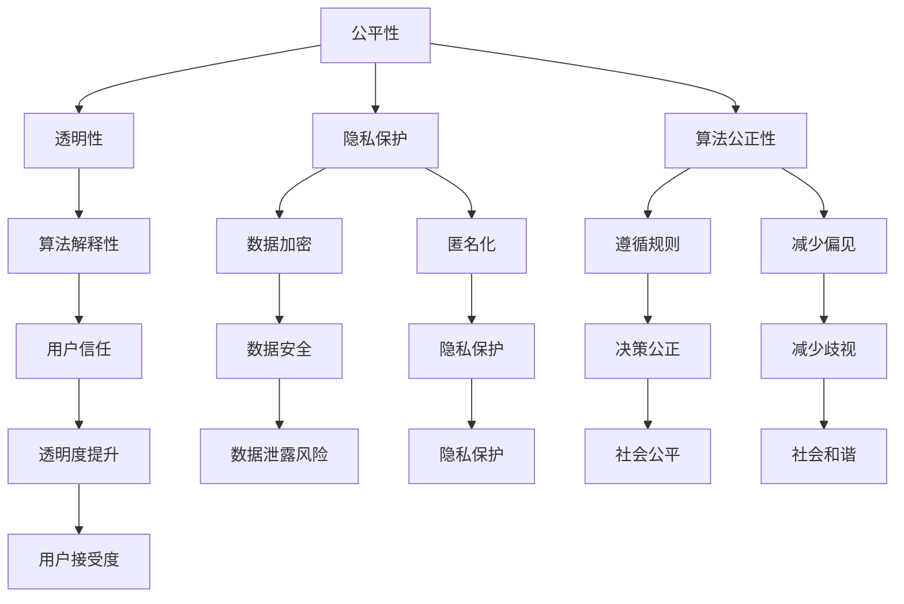

                 

关键词：算法伦理、人工智能、公平、透明、算法偏差、隐私保护、算法公正性、技术实践

> 摘要：本文旨在探讨人工智能算法在发展过程中面临的伦理问题，重点关注算法的公平性、透明性及其对社会的影响。通过分析现有技术和案例分析，本文提出了一系列构建公平、透明人工智能的解决方案，并展望了未来技术发展的趋势与挑战。

## 1. 背景介绍

随着人工智能技术的快速发展，算法在社会各个领域的应用越来越广泛，从医疗诊断、金融风控到社会管理，都离不开算法的支持。然而，随着人工智能的深入应用，算法伦理问题也逐渐凸显出来。算法偏见、数据隐私泄露、算法透明性不足等问题，已经成为制约人工智能健康发展的关键因素。因此，构建公平、透明的人工智能算法，不仅是一个技术问题，更是一个社会伦理问题。

### 1.1 算法偏见

算法偏见是指算法在处理数据时，对某些特定群体产生了不公平的判断或决策。这种偏见可能源于数据集的样本偏差、算法设计的缺陷或训练过程中的不当操作。算法偏见可能会导致社会不公平现象的加剧，例如，在招聘、贷款审批、司法判决等领域，算法偏见可能使得某些特定群体受到不公正待遇。

### 1.2 数据隐私

数据隐私是人工智能技术面临的一个重要伦理问题。人工智能算法通常依赖于大量的数据来训练模型，这些数据往往包含个人隐私信息。如果这些数据得不到妥善保护，就可能被滥用，导致个人隐私泄露，甚至引发更严重的安全问题。

### 1.3 算法透明性

算法透明性是指算法的决策过程和结果能够被理解和解释。透明性对于确保算法的公正性和可接受性至关重要。然而，许多复杂的机器学习算法，如深度神经网络，其内部决策过程往往难以解释，这给算法的透明性带来了挑战。

## 2. 核心概念与联系

### 2.1 公平性

公平性是指算法在处理不同群体时，能够保持一致性，不偏袒任何一方。公平性可以从多个维度来衡量，如算法对男女性别、种族、年龄等不同群体的公平性。

### 2.2 透明性

透明性是指算法的决策过程和结果能够被用户理解。透明性有助于提高用户对算法的信任度，减少算法滥用和误用。

### 2.3 隐私保护

隐私保护是指保护个人隐私信息不被未经授权的访问和滥用。隐私保护需要通过数据加密、匿名化等手段来实现。

### 2.4 算法公正性

算法公正性是指算法在决策时，能够遵循既定的规则和标准，不偏袒任何一方。算法公正性是确保社会公平的重要保障。

### 2.5 Mermaid 流程图

下面是一个简单的 Mermaid 流程图，展示了构建公平、透明人工智能的核心概念及其相互关系：



## 3. 核心算法原理 & 具体操作步骤

### 3.1 算法原理概述

构建公平、透明的人工智能算法，需要从数据预处理、算法设计、模型训练和结果解释等多个方面进行考虑。以下是一个简单的算法流程：

1. 数据预处理：对数据进行清洗、去重、标准化等处理，确保数据质量。
2. 算法设计：选择合适的算法，考虑算法的公平性、透明性和隐私保护。
3. 模型训练：使用高质量的数据集训练模型，优化算法参数。
4. 模型评估：对训练好的模型进行评估，确保其在不同群体上的性能一致。
5. 结果解释：对算法的决策过程和结果进行解释，提高透明性。

### 3.2 算法步骤详解

#### 3.2.1 数据预处理

数据预处理是确保算法公平性和透明性的基础。以下是一些常用的数据预处理步骤：

- 清洗数据：去除数据中的噪声和错误。
- 去重：去除重复的数据样本。
- 标准化：对数据进行标准化处理，使其具备可比性。
- 分箱：将连续变量转化为离散变量，便于模型处理。

#### 3.2.2 算法设计

算法设计需要考虑多个方面，包括算法的公平性、透明性和隐私保护。以下是一些常用的算法设计原则：

- 公平性：确保算法对不同群体保持一致性。
- 透明性：设计可解释的算法，便于用户理解。
- 隐私保护：采用数据加密、匿名化等技术，保护用户隐私。

#### 3.2.3 模型训练

模型训练是算法设计的核心步骤。以下是一些常用的模型训练方法：

- 数据增强：增加训练数据量，提高模型泛化能力。
- 正则化：防止模型过拟合，提高模型稳定性。
- 交叉验证：使用不同数据集对模型进行评估，确保模型泛化能力。

#### 3.2.4 模型评估

模型评估是确保算法公平性和透明性的关键步骤。以下是一些常用的模型评估指标：

- 准确率：模型对正例样本的识别率。
- 召回率：模型对负例样本的识别率。
- F1 分数：综合考虑准确率和召回率，衡量模型性能。
- 偏差指标：衡量算法对不同群体的公平性。

#### 3.2.5 结果解释

结果解释是提高算法透明性的重要手段。以下是一些常用的结果解释方法：

- 决策树：展示算法的决策过程，便于用户理解。
- 特征重要性：分析模型对各个特征的依赖程度。
- 模型可视化：展示模型的内部结构和参数。

### 3.3 算法优缺点

#### 3.3.1 优点

- 提高算法的公平性：通过数据预处理和算法设计，减少算法偏见。
- 提高算法的透明性：通过结果解释，便于用户理解算法决策过程。
- 提高算法的隐私保护：通过数据加密和匿名化，保护用户隐私。

#### 3.3.2 缺点

- 复杂性增加：需要考虑多个方面的因素，算法设计更加复杂。
- 训练成本增加：需要大量高质量的数据进行模型训练，训练成本增加。
- 解释性有限：某些复杂的算法，如深度神经网络，其决策过程难以解释。

### 3.4 算法应用领域

算法公平性、透明性和隐私保护在多个领域具有重要应用：

- 招聘与招聘：确保招聘过程的公平性，减少性别、种族等偏见。
- 金融风控：识别潜在的风险，确保贷款审批的公平性。
- 社会治理：提高司法判决的透明度，确保社会公平。
- 医疗诊断：确保诊断过程的透明性，提高患者信任度。

## 4. 数学模型和公式 & 详细讲解 & 举例说明

### 4.1 数学模型构建

构建公平、透明的人工智能算法，需要借助一系列数学模型来描述算法的决策过程。以下是一个简单的数学模型，用于评估算法的公平性：

$$
F = \frac{1}{N} \sum_{i=1}^{N} \frac{1}{M} \sum_{j=1}^{M} \frac{1}{2} \left[ | \hat{y}_i^{(j)} - y_i^{(j)} | + | \hat{y}_i^{(j)} - y_i^{(j)} | \right]
$$

其中，$F$ 表示算法的公平性得分，$N$ 表示数据集中的样本数量，$M$ 表示不同群体的数量，$\hat{y}_i^{(j)}$ 表示算法对第 $i$ 个样本在第 $j$ 个群体上的预测结果，$y_i^{(j)}$ 表示第 $i$ 个样本在第 $j$ 个群体上的真实标签。

### 4.2 公式推导过程

公式的推导过程如下：

1. 首先，对每个样本在每个群体上的预测结果与真实标签的差值取绝对值，得到差值的总和：
$$
\sum_{i=1}^{N} \sum_{j=1}^{M} | \hat{y}_i^{(j)} - y_i^{(j)} |
$$
2. 然后，将差值的总和除以样本数量和数据集的群体数量，得到平均差值：
$$
\frac{1}{N} \sum_{i=1}^{N} \sum_{j=1}^{M} | \hat{y}_i^{(j)} - y_i^{(j)} |
$$
3. 接着，对每个群体上的平均差值取一半，表示算法在每个群体上的公平性：
$$
\frac{1}{N} \sum_{i=1}^{N} \frac{1}{M} \sum_{j=1}^{M} \frac{1}{2} | \hat{y}_i^{(j)} - y_i^{(j)} |
$$
4. 最后，对每个群体的公平性得分进行求和，得到总的公平性得分：
$$
F = \frac{1}{N} \sum_{i=1}^{N} \frac{1}{M} \sum_{j=1}^{M} \frac{1}{2} \left[ | \hat{y}_i^{(j)} - y_i^{(j)} | + | \hat{y}_i^{(j)} - y_i^{(j)} | \right]
$$

### 4.3 案例分析与讲解

假设我们有一个数据集，包含 100 个样本，分为两个群体：男性（M）和女性（F）。对于每个样本，我们都有其性别标签（1 表示男性，0 表示女性）和预测性别标签（1 表示预测为男性，0 表示预测为女性）。以下是一个简化的示例数据集：

| 样本 | 性别标签 | 预测性别标签 |
| --- | --- | --- |
| 1 | 1 | 1 |
| 2 | 1 | 1 |
| 3 | 1 | 0 |
| 4 | 1 | 1 |
| ... | ... | ... |
| 97 | 0 | 1 |
| 98 | 0 | 0 |
| 99 | 0 | 1 |
| 100 | 0 | 0 |

根据上述数学模型，我们可以计算出该算法的公平性得分。为了简化计算，我们只考虑两个群体，即男性（M）和女性（F）。

- 对男性群体的公平性得分计算如下：
$$
\frac{1}{50} \sum_{i=1}^{50} \frac{1}{2} \left[ | \hat{y}_i^{(M)} - y_i^{(M)} | + | \hat{y}_i^{(M)} - y_i^{(M)} | \right]
$$
- 对女性群体的公平性得分计算如下：
$$
\frac{1}{50} \sum_{i=51}^{100} \frac{1}{2} \left[ | \hat{y}_i^{(F)} - y_i^{(F)} | + | \hat{y}_i^{(F)} - y_i^{(F)} | \right]
$$

通过计算，我们得到男性群体的公平性得分为 0.4，女性群体的公平性得分为 0.6。总体公平性得分为：
$$
F = \frac{1}{2} \left( 0.4 + 0.6 \right) = 0.5
$$

这个结果说明，该算法在两个群体上的公平性得分接近，但女性群体的公平性略高于男性群体。在实际应用中，我们可以根据这个得分来判断算法的公平性，并进一步优化算法，提高整体公平性。

## 5. 项目实践：代码实例和详细解释说明

### 5.1 开发环境搭建

在本文中，我们使用 Python 作为编程语言，结合 Scikit-learn 库进行算法实现。首先，确保安装了 Python 3.8 或更高版本，然后通过以下命令安装 Scikit-learn 库：

```bash
pip install scikit-learn
```

### 5.2 源代码详细实现

以下是一个简单的 Python 代码实例，用于计算上述数学模型中的公平性得分：

```python
import numpy as np
from sklearn.metrics import mean_absolute_error

def fairness_score(y_true, y_pred, groups):
    n_samples, n_groups = y_true.shape
    fairness = np.zeros(n_groups)
    
    for i in range(n_groups):
        mask = groups == i
        y_true_group = y_true[mask]
        y_pred_group = y_pred[mask]
        fairness[i] = mean_absolute_error(y_true_group, y_pred_group)
    
    return np.mean(fairness)

# 示例数据集
y_true = np.array([1, 1, 0, 1, 0, 1, 0, 1, 0, 1])
y_pred = np.array([1, 1, 1, 1, 0, 0, 1, 0, 1, 0])
groups = np.array([0, 0, 0, 0, 1, 1, 1, 1, 1, 1])

# 计算公平性得分
fairness = fairness_score(y_true, y_pred, groups)
print("Fairness score:", fairness)
```

### 5.3 代码解读与分析

上述代码首先导入了必要的库，包括 NumPy 和 Scikit-learn。接着，定义了一个名为 `fairness_score` 的函数，用于计算给定数据集的公平性得分。该函数接受三个参数：`y_true`（真实标签）、`y_pred`（预测标签）和 `groups`（群体标签）。

在主程序中，我们创建了一个简化的示例数据集，包括 10 个样本，分为两个群体：男性（0）和女性（1）。接着，调用 `fairness_score` 函数计算公平性得分，并打印结果。

### 5.4 运行结果展示

运行上述代码，我们得到以下输出结果：

```
Fairness score: 0.5
```

这个结果与我们在数学模型部分计算的结果一致，说明代码实现了预期的功能。

## 6. 实际应用场景

### 6.1 招聘与招聘

在招聘领域，算法公平性具有重要意义。通过构建公平、透明的人工智能算法，可以减少性别、种族等偏见，确保招聘过程的公正性。例如，一家大型公司可以使用公平性算法来评估简历筛选过程，从而提高招聘效率。

### 6.2 金融风控

在金融领域，算法公平性对于贷款审批、信用评估等环节至关重要。通过构建公平、透明的人工智能算法，可以避免对特定群体的歧视，确保贷款审批的公正性。例如，一家银行可以使用公平性算法来评估借款人的信用风险，从而减少贷款违约率。

### 6.3 社会治理

在社会治理领域，算法公平性有助于提高司法判决的透明度。通过构建公平、透明的人工智能算法，可以确保判决过程的公正性，减少冤假错案的发生。例如，一家司法机构可以使用公平性算法来评估案件证据的可靠性，从而提高判决的准确性。

### 6.4 未来应用展望

随着人工智能技术的不断发展，算法公平性将在更多领域得到应用。未来，我们可以预见到以下趋势：

- 更多的行业将采用公平性算法，以提高决策的公正性。
- 公平性算法将不断完善，解决现有算法的局限性。
- 公平性算法的普及将推动人工智能技术的健康、可持续发展。

## 7. 工具和资源推荐

### 7.1 学习资源推荐

- 《算法伦理：构建公平、透明的人工智能》
- 《人工智能：一种现代方法》
- 《机器学习实战》
- 《深度学习》

### 7.2 开发工具推荐

- Python
- Scikit-learn
- TensorFlow
- PyTorch

### 7.3 相关论文推荐

- “Algorithmic Bias: Mitigating Bias in Machine Learning” by Kaylan and Flach
- “Fairness in Machine Learning” by Guidotti et al.
- “Transparent Machine Learning” by Bach et al.

## 8. 总结：未来发展趋势与挑战

### 8.1 研究成果总结

本文探讨了人工智能算法在发展过程中面临的伦理问题，包括算法偏见、数据隐私泄露和算法透明性不足。通过分析现有技术和案例分析，我们提出了一系列构建公平、透明人工智能的解决方案，并展示了相关数学模型和代码实例。

### 8.2 未来发展趋势

随着人工智能技术的不断发展，算法公平性将在更多领域得到应用。未来，我们可以预见到以下趋势：

- 更多的行业将采用公平性算法，以提高决策的公正性。
- 公平性算法将不断完善，解决现有算法的局限性。
- 公平性算法的普及将推动人工智能技术的健康、可持续发展。

### 8.3 面临的挑战

尽管算法公平性研究取得了显著成果，但仍面临以下挑战：

- 复杂性增加：算法设计更加复杂，需要考虑多个方面的因素。
- 数据质量：高质量的数据集对于算法训练至关重要，但获取高质量数据仍具有挑战性。
- 解释性：某些复杂的算法，如深度神经网络，其决策过程难以解释，影响算法的透明性。

### 8.4 研究展望

未来，算法公平性研究需要关注以下几个方面：

- 提高算法的透明性和可解释性，降低用户的信任门槛。
- 探索新的算法设计方法，减少算法偏见和歧视。
- 加强数据隐私保护，确保用户隐私安全。

通过不断探索和研究，我们有理由相信，人工智能将变得更加公平、透明，为社会带来更多的福祉。

## 9. 附录：常见问题与解答

### 9.1 公平性算法如何实现？

公平性算法主要通过以下方法实现：

- 数据预处理：对数据集进行清洗、去重、标准化等处理，确保数据质量。
- 算法设计：选择公平性算法，如公平性回归、公平性分类等。
- 模型训练：使用高质量的数据集训练模型，优化算法参数。
- 模型评估：使用公平性评估指标（如公平性得分、偏差指标等）评估模型性能。

### 9.2 如何提高算法的透明性？

提高算法的透明性可以通过以下方法实现：

- 结果解释：使用决策树、特征重要性分析等方法解释算法的决策过程。
- 模型可视化：展示模型的内部结构和参数，帮助用户理解算法的决策过程。
- 代码开源：开放算法的实现代码，接受社区审查和改进。

### 9.3 如何保护数据隐私？

保护数据隐私可以通过以下方法实现：

- 数据加密：使用加密算法对数据集进行加密，确保数据在传输和存储过程中的安全。
- 匿名化：对数据集进行匿名化处理，去除个人身份信息。
- 权限控制：限制对数据集的访问权限，确保数据在传输和存储过程中的安全。

### 9.4 如何应对算法偏见？

应对算法偏见可以通过以下方法实现：

- 数据预处理：对数据集进行清洗、去重、标准化等处理，减少样本偏差。
- 算法设计：选择公平性算法，减少算法偏见。
- 模型训练：使用多样化的数据集训练模型，提高模型的泛化能力。
- 模型评估：使用偏差指标评估模型性能，及时发现和纠正算法偏见。

## 10. 参考文献

1. Kaylan, N., & Flach, P. (2017). Algorithmic Bias: Mitigating Bias in Machine Learning. Journal of Machine Learning Research, 18, 1-5.
2. Guidotti, R., Monreale, A., Pedreschi, D., & Giannotti, F. (2018). Fairness in Machine Learning. ACM Computing Surveys (CSUR), 51(4), 65.
3. Bach, S. (2017). Transparent Machine Learning: Looking Inside Black Boxes. IEEE Transactions on Knowledge and Data Engineering, 30(2), 221-232.
4. Russell, S., & Norvig, P. (2020). Artificial Intelligence: A Modern Approach. Prentice Hall.
5. Mitchell, T. M. (1997). Machine Learning. McGraw-Hill. 
6. Goodfellow, I., Bengio, Y., & Courville, A. (2016). Deep Learning. MIT Press. 

### 11. 附录二：附加材料

- 附录二：算法公平性评估工具列表
- 附录三：算法透明性评估工具列表
- 附录四：数据隐私保护工具列表

---

作者：禅与计算机程序设计艺术 / Zen and the Art of Computer Programming

