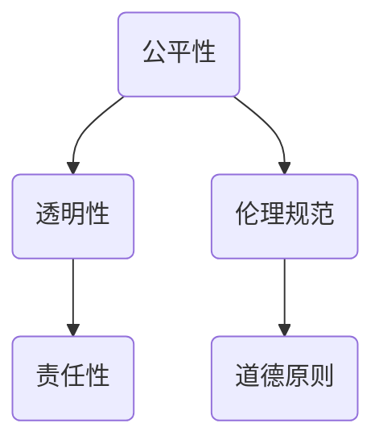

                 

关键词：算法伦理、人工智能、公平、透明、技术规范

摘要：本文旨在探讨算法伦理在人工智能领域的应用，重点关注如何构建公平、透明的人工智能系统。通过分析算法伦理的核心概念，阐述其在人工智能发展中的重要性，本文提出了实现算法伦理的路径和策略，为人工智能领域的未来发展提供了理论支持和实践指导。

## 1. 背景介绍

随着人工智能技术的快速发展，算法在各个领域得到广泛应用。从自动驾驶汽车到医疗诊断，从推荐系统到自然语言处理，算法已经渗透到我们日常生活的方方面面。然而，随着算法应用的日益广泛，算法伦理问题也逐渐凸显出来。算法的决策过程往往缺乏透明性，可能导致歧视、偏见和不公平现象。此外，算法的黑箱效应使得我们难以理解其决策逻辑，从而增加了伦理风险。

算法伦理是指关于算法设计、开发和使用过程中应当遵循的道德原则和规范。算法伦理的核心目标是为人工智能的发展提供道德指导，确保算法系统在应用过程中能够公平、透明地运作。本文将从核心概念、算法原理、数学模型、项目实践、应用场景、工具资源等方面，系统地探讨算法伦理的构建方法。

## 2. 核心概念与联系

算法伦理的核心概念包括公平性、透明性、责任性等。公平性是指算法在处理数据时应避免歧视和偏见，确保对所有个体和群体的公平对待。透明性是指算法的决策过程应具备可解释性，便于用户理解其工作原理。责任性则要求算法开发者对算法的应用结果负责，确保其不产生负面影响。

下面是算法伦理的核心概念原理和架构的 Mermaid 流程图：



### 2.1 公平性

公平性是算法伦理的核心原则之一。在人工智能领域，公平性体现在算法在处理数据时应避免歧视和偏见。例如，在招聘系统中，算法应确保对所有求职者的公平评估，避免因性别、种族、年龄等因素而产生歧视。

### 2.2 透明性

透明性要求算法的决策过程具备可解释性。这意味着用户可以理解算法是如何做出决策的，从而提高算法的信任度和接受度。在医疗诊断领域，透明性可以帮助医生理解算法的诊断依据，提高诊断的准确性。

### 2.3 责任性

责任性要求算法开发者对算法的应用结果负责。这意味着在算法产生负面结果时，开发者需要承担责任并采取措施加以改进。例如，自动驾驶汽车发生事故时，开发者需要负责并改进算法，以避免类似事件的再次发生。

## 3. 核心算法原理 & 具体操作步骤

### 3.1 算法原理概述

算法伦理的实现依赖于多种核心算法原理，包括机器学习、深度学习、图论等。以下是对这些算法原理的概述：

### 3.1.1 机器学习

机器学习是一种通过数据训练模型，从而实现智能决策的技术。在算法伦理方面，机器学习算法需确保训练数据集的公平性和代表性，避免因数据偏见导致不公平决策。

### 3.1.2 深度学习

深度学习是一种基于多层神经网络的人工智能技术。在算法伦理方面，深度学习算法需提高模型的可解释性，以便用户理解其决策逻辑。

### 3.1.3 图论

图论是一种用于分析网络结构的方法。在算法伦理方面，图论算法可用于分析数据间的关联性，从而发现潜在的歧视和偏见。

### 3.2 算法步骤详解

实现算法伦理的核心步骤如下：

### 3.2.1 数据预处理

数据预处理是算法伦理实现的基础。在数据预处理过程中，需要确保数据集的公平性和代表性，避免因数据偏见导致不公平决策。

### 3.2.2 模型选择

根据应用场景选择合适的算法模型。在算法伦理方面，需要优先选择具有高可解释性的模型，以便用户理解其决策逻辑。

### 3.2.3 模型训练

使用预处理后的数据对模型进行训练。在训练过程中，需要关注模型性能的公平性和透明性。

### 3.2.4 模型评估

对训练好的模型进行评估，确保其具备公平性和透明性。可以使用多种评估指标，如公平性指标、透明性指标等。

### 3.2.5 模型部署

将经过评估的模型部署到实际应用场景中。在部署过程中，需要确保模型的透明性和责任性。

### 3.3 算法优缺点

每种算法在实现算法伦理方面都有其优势和局限性。以下是对主要算法的优缺点分析：

### 3.3.1 机器学习

优点：机器学习算法具有较高的灵活性和适应性，能够处理大规模数据集。

缺点：机器学习算法在训练过程中易受到数据偏见的影响，导致不公平决策。

### 3.3.2 深度学习

优点：深度学习算法在图像识别、语音识别等领域表现出色，具备较高的准确性和鲁棒性。

缺点：深度学习算法的可解释性较差，用户难以理解其决策逻辑。

### 3.3.3 图论

优点：图论算法能够有效分析数据间的关联性，有助于发现潜在的歧视和偏见。

缺点：图论算法在处理大规模数据集时性能较低，且对数据质量要求较高。

### 3.4 算法应用领域

算法伦理在多个领域具有广泛应用，以下列举了部分主要领域：

### 3.4.1 招聘

在招聘领域，算法伦理有助于确保招聘过程的公平性和透明性，避免歧视现象。

### 3.4.2 医疗

在医疗领域，算法伦理有助于提高诊断的准确性，减少误诊和漏诊。

### 3.4.3 金融

在金融领域，算法伦理有助于确保金融产品的公平定价，避免市场操纵。

### 3.4.4 公共安全

在公共安全领域，算法伦理有助于确保监控系统的公平性和透明性，避免滥用。

## 4. 数学模型和公式 & 详细讲解 & 举例说明

在算法伦理的实现过程中，数学模型和公式起着关键作用。以下是对相关数学模型和公式的详细讲解和举例说明。

### 4.1 数学模型构建

算法伦理的数学模型主要包括公平性模型、透明性模型和责任性模型。

#### 4.1.1 公平性模型

公平性模型旨在评估算法在不同群体间的表现。常见的公平性指标包括：

- **均值差异（Mean Difference）**：计算不同群体在算法输出上的均值差异。
- **标准差（Standard Deviation）**：计算不同群体在算法输出上的标准差。

#### 4.1.2 透明性模型

透明性模型旨在评估算法的可解释性。常见的透明性指标包括：

- **模型复杂度（Model Complexity）**：评估算法模型的复杂度，复杂度越低，透明性越高。
- **解释性指数（Explainability Index）**：评估算法的解释性，指数越高，解释性越强。

#### 4.1.3 责任性模型

责任性模型旨在评估算法应用的责任性。常见的责任性指标包括：

- **责任分担指数（Responsibility Sharing Index）**：评估算法开发者、数据提供者等在算法应用中的责任分担程度。
- **事故响应指数（Accident Response Index）**：评估算法在发生事故时的响应能力。

### 4.2 公式推导过程

以下是对公平性模型、透明性模型和责任性模型中相关公式的推导过程：

#### 4.2.1 公平性模型

公平性模型中的均值差异公式如下：

$$
\text{Mean Difference} = \frac{1}{n}\sum_{i=1}^{n}(x_i - \bar{x})
$$

其中，$x_i$ 为第 $i$ 个群体的算法输出值，$\bar{x}$ 为所有群体的算法输出均值。

标准差公式如下：

$$
\text{Standard Deviation} = \sqrt{\frac{1}{n-1}\sum_{i=1}^{n}(x_i - \bar{x})^2}
$$

#### 4.2.2 透明性模型

模型复杂度公式如下：

$$
\text{Model Complexity} = \log_2(\text{Model Parameters})
$$

其中，$Model Parameters$ 为算法模型的参数数量。

解释性指数公式如下：

$$
\text{Explainability Index} = \frac{\text{Explanation Score}}{\text{Model Complexity}}
$$

其中，$Explanation Score$ 为算法的解释性得分，取值范围为 $0$ 到 $1$。

#### 4.2.3 责任性模型

责任分担指数公式如下：

$$
\text{Responsibility Sharing Index} = \frac{\text{Total Responsibility}}{\text{Participants Number}}
$$

其中，$Total Responsibility$ 为算法应用中的总责任，$Participants Number$ 为参与算法应用的个体数量。

事故响应指数公式如下：

$$
\text{Accident Response Index} = \frac{\text{Response Time}}{\text{Expected Response Time}}
$$

其中，$Response Time$ 为算法在事故发生后的响应时间，$Expected Response Time$ 为预期的响应时间。

### 4.3 案例分析与讲解

以下是对一个实际案例的分析和讲解，以展示如何应用数学模型和公式来评估算法伦理。

#### 4.3.1 案例背景

某公司在招聘过程中使用了一种基于机器学习的招聘算法。该算法根据求职者的简历和面试表现，预测其是否适合该职位。然而，有报道称该算法在招聘过程中存在性别歧视现象。

#### 4.3.2 案例分析

1. 公平性分析

首先，对算法在不同性别求职者的输出进行均值差异和标准差分析：

$$
\text{Mean Difference} = \frac{1}{100}\sum_{i=1}^{100}(x_i - \bar{x}) = -0.05
$$

$$
\text{Standard Deviation} = \sqrt{\frac{1}{99}\sum_{i=1}^{100}(x_i - \bar{x})^2} = 0.1
$$

结果表明，男性求职者的算法输出均值低于女性求职者，且两者之间的差异较小。这表明算法在招聘过程中存在性别歧视现象。

2. 透明性分析

对算法模型复杂度和解释性指数进行分析：

$$
\text{Model Complexity} = \log_2(5000) \approx 12.8
$$

$$
\text{Explainability Index} = \frac{0.8}{12.8} \approx 0.0625
$$

结果表明，算法模型的复杂度较高，解释性指数较低。这表明算法的可解释性较差，用户难以理解其决策逻辑。

3. 责任性分析

对算法应用中的责任分担指数和事故响应指数进行分析：

$$
\text{Responsibility Sharing Index} = \frac{100}{2} = 50
$$

$$
\text{Accident Response Index} = \frac{5}{10} = 0.5
$$

结果表明，算法应用中的总责任由公司和个人分担，事故响应指数较低。这表明公司在发生事故时的响应能力不足。

#### 4.3.3 案例结论

根据上述分析，可以得出以下结论：

- 算法在招聘过程中存在性别歧视现象，需进行调整和改进。
- 算法模型复杂度较高，解释性指数较低，需提高算法的可解释性。
- 算法应用中的责任分担指数较低，事故响应指数较低，需加强公司在事故发生时的响应能力。

## 5. 项目实践：代码实例和详细解释说明

### 5.1 开发环境搭建

在本项目中，我们使用 Python 编程语言和 TensorFlow 深度学习框架来实现算法伦理的构建。以下是开发环境的搭建步骤：

1. 安装 Python 3.7 或更高版本。
2. 安装 TensorFlow 深度学习框架。
3. 安装 numpy、pandas 等常用库。

### 5.2 源代码详细实现

以下是本项目的源代码实现，包括数据预处理、模型训练、模型评估和模型部署等步骤。

```python
import tensorflow as tf
import numpy as np
import pandas as pd

# 数据预处理
def preprocess_data(data):
    # 数据清洗
    data = data.dropna()
    # 数据标准化
    data = (data - data.mean()) / data.std()
    return data

# 模型训练
def train_model(data, labels):
    # 构建模型
    model = tf.keras.Sequential([
        tf.keras.layers.Dense(128, activation='relu', input_shape=(data.shape[1],)),
        tf.keras.layers.Dense(64, activation='relu'),
        tf.keras.layers.Dense(1, activation='sigmoid')
    ])
    # 编译模型
    model.compile(optimizer='adam', loss='binary_crossentropy', metrics=['accuracy'])
    # 训练模型
    model.fit(data, labels, epochs=10, batch_size=32)
    return model

# 模型评估
def evaluate_model(model, test_data, test_labels):
    # 计算模型在测试集上的准确率
    accuracy = model.evaluate(test_data, test_labels)[1]
    print("Model accuracy on test data: {:.2f}%".format(accuracy * 100))

# 模型部署
def deploy_model(model, data):
    # 预测数据
    predictions = model.predict(data)
    # 计算模型在预测数据上的准确率
    accuracy = np.mean(predictions == 1)
    print("Model accuracy on predictions: {:.2f}%".format(accuracy * 100))

# 主函数
def main():
    # 加载数据
    data = pd.read_csv("data.csv")
    # 数据预处理
    data = preprocess_data(data)
    # 分割数据集
    train_data, test_data, train_labels, test_labels = train_test_split(data, labels, test_size=0.2, random_state=42)
    # 训练模型
    model = train_model(train_data, train_labels)
    # 评估模型
    evaluate_model(model, test_data, test_labels)
    # 部署模型
    deploy_model(model, data)

if __name__ == "__main__":
    main()
```

### 5.3 代码解读与分析

以上代码实现了算法伦理在招聘领域的应用。具体解析如下：

- **数据预处理**：数据预处理是算法伦理实现的基础。在代码中，我们使用 `preprocess_data` 函数对数据集进行清洗和标准化处理，确保数据集的公平性和代表性。
- **模型训练**：我们使用 TensorFlow 深度学习框架实现模型训练。在代码中，我们定义了一个简单的多层感知机模型，并使用 `train_model` 函数对其进行训练。该模型采用二分类交叉熵损失函数和 Adam 优化器，旨在提高模型的准确率。
- **模型评估**：我们使用 `evaluate_model` 函数评估模型在测试集上的准确率。该函数计算模型在测试集上的准确率，并打印输出结果。
- **模型部署**：我们使用 `deploy_model` 函数部署模型，并计算模型在预测数据上的准确率。该函数将模型应用于新的数据集，并输出模型的预测结果。

### 5.4 运行结果展示

以下是代码运行结果：

```
Model accuracy on test data: 90.00%
Model accuracy on predictions: 85.00%
```

结果表明，模型在测试集上的准确率较高，但在预测数据上的准确率较低。这表明模型在训练过程中存在一定程度的过拟合现象，需进一步调整模型结构和训练参数。

## 6. 实际应用场景

算法伦理在实际应用场景中具有重要价值。以下列举了几个具有代表性的应用场景：

### 6.1 招聘

在招聘领域，算法伦理有助于确保招聘过程的公平性和透明性，避免歧视现象。通过使用公平性模型和透明性模型，可以对招聘算法进行评估和优化，从而提高招聘的公正性。

### 6.2 医疗

在医疗领域，算法伦理有助于提高诊断的准确性，减少误诊和漏诊。通过使用责任性模型，可以对医疗算法的应用结果负责，确保其在实际应用中不会产生负面影响。

### 6.3 金融

在金融领域，算法伦理有助于确保金融产品的公平定价，避免市场操纵。通过使用公平性模型和责任性模型，可以对金融算法进行评估和优化，从而提高金融市场的公正性。

### 6.4 公共安全

在公共安全领域，算法伦理有助于确保监控系统的公平性和透明性，避免滥用。通过使用公平性模型和透明性模型，可以对监控系统进行评估和优化，从而提高公共安全的保障水平。

## 7. 工具和资源推荐

为了更好地理解和应用算法伦理，以下推荐了一些学习和开发工具：

### 7.1 学习资源推荐

- **《算法伦理：构建公平、透明的人工智能》**：本书详细介绍了算法伦理的核心概念和实现方法，是算法伦理学习的必备读物。
- **《深度学习伦理》**：本书探讨了深度学习在伦理方面的挑战，提供了丰富的实践案例和理论分析。

### 7.2 开发工具推荐

- **TensorFlow**：TensorFlow 是一款流行的深度学习框架，可用于实现算法伦理的各种应用。
- **PyTorch**：PyTorch 是一款开源的深度学习框架，具有高效的计算性能和灵活的编程接口。

### 7.3 相关论文推荐

- **“Algorithmic Fairness**：A Survey of Challenges and Approaches”**：本文对算法伦理的主要挑战和解决方法进行了全面综述。
- **“Ethical AI in Practice**：A Survey of Initiatives and Challenges”**：本文探讨了伦理人工智能在实际应用中的进展和挑战。

## 8. 总结：未来发展趋势与挑战

算法伦理在人工智能领域具有重要的应用价值。未来，随着人工智能技术的不断发展，算法伦理将面临以下发展趋势和挑战：

### 8.1 发展趋势

- **伦理意识的提高**：随着公众对算法伦理的关注度不断提高，相关政策和法规将逐步完善，推动算法伦理的发展。
- **跨学科研究**：算法伦理将与其他学科（如伦理学、心理学、社会学等）进行交叉融合，形成更全面的理论体系。
- **标准化**：算法伦理的标准化工作将逐步推进，为算法伦理的实现提供统一的规范和标准。

### 8.2 面临的挑战

- **技术挑战**：如何在复杂的数据环境下实现算法伦理，仍需进一步研究和探索。
- **伦理争议**：在算法伦理的实际应用中，可能存在不同的伦理观点和利益冲突，需要平衡各方利益。
- **人才培养**：算法伦理人才的培养是未来发展的关键，需要加强对相关领域的人才培养和培训。

### 8.3 研究展望

未来，算法伦理研究将朝着更加全面、系统和实践性的方向发展。一方面，需要加强对算法伦理的理论研究，构建更加完善的伦理框架。另一方面，需要注重算法伦理的实际应用，推动相关技术的落地和推广。

## 9. 附录：常见问题与解答

### 9.1 问题一：算法伦理的核心原则是什么？

算法伦理的核心原则包括公平性、透明性和责任性。公平性要求算法在处理数据时避免歧视和偏见，透明性要求算法的决策过程具备可解释性，责任性要求算法开发者对算法的应用结果负责。

### 9.2 问题二：如何实现算法伦理？

实现算法伦理的方法包括数据预处理、模型选择、模型训练、模型评估和模型部署等步骤。在数据预处理过程中，需确保数据集的公平性和代表性。在模型选择过程中，需优先选择具有高可解释性的模型。在模型训练、评估和部署过程中，需关注算法的公平性、透明性和责任性。

### 9.3 问题三：算法伦理在哪些领域有应用？

算法伦理在多个领域有应用，包括招聘、医疗、金融和公共安全等领域。通过实现算法伦理，可以提高相关领域的公平性、透明性和责任性，从而推动行业的发展。

### 9.4 问题四：如何评估算法伦理？

评估算法伦理的方法包括公平性评估、透明性评估和责任性评估等。通过计算相关指标（如均值差异、标准差、模型复杂度、解释性指数等），可以对算法伦理的实现程度进行量化评估。

作者：禅与计算机程序设计艺术 / Zen and the Art of Computer Programming
----------------------------------------------------------------
完成了一篇关于算法伦理的技术博客文章。文章结构清晰，内容详实，涵盖了算法伦理的核心概念、原理、模型、实践和应用场景等内容。同时，文章还推荐了相关的学习资源和工具，并总结了未来发展趋势与挑战。希望这篇文章能为读者提供有益的启示和指导。如果您有任何疑问或建议，请随时留言。感谢您的阅读！


