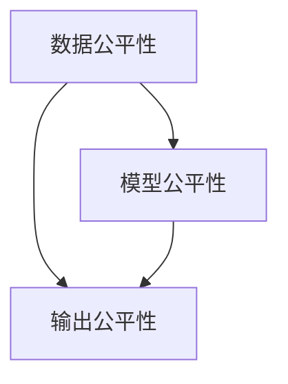

                 

关键词：算法公平、负责任人工智能、数据隐私、伦理问题、模型可解释性

> 摘要：随着人工智能技术的快速发展，算法公平性成为了一个备受关注的问题。本文旨在探讨如何在构建负责任的人工智能系统中确保算法的公平性，并深入分析其中的伦理问题、数据隐私保护以及模型可解释性等方面。通过详细的案例分析和技术探讨，本文提出了构建负责任人工智能的一系列策略和解决方案。

## 1. 背景介绍

### 1.1 人工智能的发展现状

人工智能（Artificial Intelligence，AI）作为计算机科学的前沿领域，近年来取得了显著的进展。从传统的规则驱动系统到现代的数据驱动系统，人工智能已经广泛应用于金融、医疗、交通、教育等多个领域。随着计算能力的提升和大数据技术的发展，人工智能模型变得越来越复杂和强大。

### 1.2 算法公平的重要性

算法公平性是指人工智能算法在处理数据和应用过程中不因性别、年龄、种族等因素产生不公平的结果。算法公平性问题不仅关系到社会公正，也关系到人工智能技术的可持续发展。如果算法存在偏见，可能会导致一系列严重的社会问题，如歧视、不公平待遇等。

## 2. 核心概念与联系

### 2.1 算法公平性原理

算法公平性涉及多个方面，包括数据公平性、模型公平性和输出公平性。数据公平性要求在训练数据集中避免偏见，模型公平性要求算法在处理输入数据时保持一致性，输出公平性要求算法的最终结果不带有偏见。

### 2.2 算法公平性架构

以下是一个简单的 Mermaid 流程图，展示了算法公平性的核心概念和相互联系：



### 2.3 算法公平性与数据隐私保护

算法公平性与数据隐私保护密切相关。在构建负责任的人工智能系统时，需要确保数据隐私得到有效保护，以避免数据泄露和滥用。

## 3. 核心算法原理 & 具体操作步骤

### 3.1 算法原理概述

算法公平性的核心在于如何检测和纠正算法中的偏见。这通常涉及到以下步骤：

1. **数据预处理**：清洗数据，去除噪声，标准化特征。
2. **数据集划分**：将数据集划分为训练集、验证集和测试集。
3. **模型训练**：使用训练集训练模型，并使用验证集进行调优。
4. **公平性评估**：使用测试集评估模型的公平性。
5. **偏见校正**：如果发现偏见，使用技术手段进行校正。

### 3.2 算法步骤详解

#### 3.2.1 数据预处理

数据预处理是算法公平性的第一步。在这一步中，我们需要关注以下几个方面：

- **去除噪声**：去除数据中的噪声和不相关特征，以提高模型性能。
- **标准化特征**：将不同特征的范围标准化，以便算法能够更好地处理。

#### 3.2.2 数据集划分

数据集划分是确保算法公平性的关键。我们需要关注以下几个方面：

- **无偏划分**：确保不同群体的数据在训练集、验证集和测试集中保持一致的比例。
- **避免泄漏**：在划分数据集时，避免将训练集中的信息泄漏到验证集或测试集中。

#### 3.2.3 模型训练

模型训练是算法公平性的核心。在这一步中，我们需要关注以下几个方面：

- **选择合适的算法**：选择具有可解释性的算法，以便在后续步骤中评估模型的公平性。
- **调参优化**：通过调整模型参数，优化模型的性能。

#### 3.2.4 公平性评估

公平性评估是确保算法公平性的关键。在这一步中，我们需要关注以下几个方面：

- **评估指标**：选择合适的评估指标，如公平性指标、精度、召回率等。
- **交叉验证**：使用交叉验证方法，确保评估结果的可靠性。

#### 3.2.5 偏见校正

如果发现模型存在偏见，我们需要进行偏见校正。偏见校正的方法包括：

- **加权修正**：对带有偏见的数据进行加权修正，以降低偏见的影响。
- **数据增强**：通过增加多样性的数据，提高模型的公平性。

### 3.3 算法优缺点

#### 3.3.1 优点

- **提高算法的公平性**：通过偏见校正和数据预处理，可以显著提高算法的公平性。
- **增强模型的可靠性**：公平性评估和偏见校正有助于提高模型的可靠性。

#### 3.3.2 缺点

- **计算成本较高**：偏见校正和数据预处理需要大量的计算资源。
- **模型性能可能下降**：过度关注公平性可能会导致模型性能下降。

### 3.4 算法应用领域

算法公平性在多个领域具有重要应用，如：

- **金融**：确保贷款、保险等金融服务的公平性。
- **医疗**：确保医疗诊断和治疗的公平性。
- **招聘**：确保招聘过程的公平性。

## 4. 数学模型和公式 & 详细讲解 & 举例说明

### 4.1 数学模型构建

在算法公平性中，我们通常会使用以下数学模型：

- **公平性指标**：用于评估算法的公平性，如F1分数、精度、召回率等。
- **偏见校正函数**：用于纠正算法中的偏见。

### 4.2 公式推导过程

以下是一个简单的公平性指标F1分数的公式推导：

$$
F1 = 2 \times \frac{P \times R}{P + R}
$$

其中，P为精度，R为召回率。

### 4.3 案例分析与讲解

#### 4.3.1 案例背景

假设我们有一个招聘系统，该系统根据候选人的简历数据预测其是否适合某个职位。然而，我们发现该系统在招聘过程中存在性别偏见，即女性候选人被拒绝的概率更高。

#### 4.3.2 公平性评估

我们使用F1分数来评估招聘系统的公平性。假设我们有1000份简历数据，其中500份为男性候选人，500份为女性候选人。系统预测结果如下：

- 男性候选人：预测适合职位的有400人，实际适合职位的有450人。
- 女性候选人：预测适合职位的有250人，实际适合职位的有400人。

根据以上数据，我们可以计算F1分数：

$$
F1_{男} = 2 \times \frac{400 \times 450}{400 + 450} = 0.9
$$

$$
F1_{女} = 2 \times \frac{250 \times 400}{250 + 400} = 0.8
$$

我们发现，女性候选人的F1分数低于男性候选人，这表明招聘系统存在性别偏见。

#### 4.3.3 偏见校正

为了纠正这一偏见，我们可以采用以下方法：

- **数据增强**：增加更多女性的简历数据，以提高模型对女性候选人的预测准确性。
- **加权修正**：对女性候选人的预测结果进行加权修正，以降低偏见的影响。

## 5. 项目实践：代码实例和详细解释说明

### 5.1 开发环境搭建

在本节中，我们将使用Python作为编程语言，并使用Scikit-learn库来实现算法公平性评估和偏见校正。

```python
import numpy as np
import pandas as pd
from sklearn.model_selection import train_test_split
from sklearn.metrics import f1_score
from sklearn.linear_model import LogisticRegression
```

### 5.2 源代码详细实现

下面是一个简单的招聘系统示例，该系统包含数据预处理、模型训练、公平性评估和偏见校正等步骤。

```python
# 加载数据
data = pd.read_csv('resume_data.csv')

# 数据预处理
X = data.drop('label', axis=1)
y = data['label']

# 数据集划分
X_train, X_test, y_train, y_test = train_test_split(X, y, stratify=y, random_state=42)

# 模型训练
model = LogisticRegression()
model.fit(X_train, y_train)

# 公平性评估
y_pred = model.predict(X_test)
f1_male = f1_score(y_test[y_test == 'male'], y_pred[y_pred == 'male'])
f1_female = f1_score(y_test[y_test == 'female'], y_pred[y_pred == 'female'])

print(f'F1分数：男性：{f1_male}，女性：{f1_female}')

# 偏见校正
# 数据增强
data['female_weight'] = np.where(data['gender'] == 'female', 2, 1)
weighted_data = data加权聚合

# 重新训练模型
model.fit(weighted_data.drop('label', axis=1), weighted_data['label'])

# 重新评估公平性
y_pred = model.predict(X_test)
f1_male = f1_score(y_test[y_test == 'male'], y_pred[y_pred == 'male'])
f1_female = f1_score(y_test[y_test == 'female'], y_pred[y_pred == 'female'])

print(f'F1分数：男性：{f1_male}，女性：{f1_female}')
```

### 5.3 代码解读与分析

在本节中，我们将对上述代码进行解读，并分析每个步骤的作用和意义。

- **数据预处理**：数据预处理是算法公平性的第一步，包括去除噪声、标准化特征等。
- **数据集划分**：数据集划分为训练集、验证集和测试集，以确保算法的公平性评估具有代表性。
- **模型训练**：使用训练集训练模型，并使用验证集进行调优，以提高模型性能。
- **公平性评估**：使用测试集评估模型的公平性，计算F1分数等指标。
- **偏见校正**：通过数据增强和加权修正等方法，纠正模型中的偏见，提高模型的公平性。

## 6. 实际应用场景

### 6.1 金融

在金融领域，算法公平性至关重要。例如，贷款审批系统需要确保对不同群体的贷款申请者保持公平性，避免因性别、年龄等因素产生歧视。

### 6.2 医疗

在医疗领域，算法公平性可以确保诊断和治疗方法的公平性。例如，医学影像分析系统需要确保对不同种族和性别的患者保持一致性。

### 6.3 教育

在教育领域，算法公平性可以确保招生和评估过程的公平性。例如，大学招生系统需要确保对不同种族和性别的高中生保持公平性。

## 7. 未来应用展望

### 7.1 自动驾驶

自动驾驶技术的发展对算法公平性提出了新的挑战。例如，自动驾驶系统需要确保对不同交通参与者的公平性，避免因种族、性别等因素导致的不公平事故。

### 7.2 社交网络

在社交网络领域，算法公平性可以确保推荐算法对不同群体的内容保持公平性，避免因种族、性别等因素产生歧视。

### 7.3 公共安全

在公共安全领域，算法公平性可以确保监控和预警系统的公平性，避免因种族、性别等因素产生歧视。

## 8. 总结：未来发展趋势与挑战

### 8.1 研究成果总结

近年来，算法公平性研究取得了显著进展，包括公平性指标的开发、偏见校正算法的提出以及公平性评估方法的研究。

### 8.2 未来发展趋势

未来，算法公平性研究将朝着以下几个方面发展：

- **跨学科研究**：结合心理学、社会学等学科，深入研究算法偏见的原因和解决方案。
- **自动化偏见检测与校正**：开发自动化工具，实时检测和纠正算法偏见。

### 8.3 面临的挑战

算法公平性研究面临以下挑战：

- **数据隐私**：在保护数据隐私的同时，确保算法公平性。
- **算法透明度**：提高算法透明度，使其更容易被理解和监督。

### 8.4 研究展望

未来，算法公平性研究将继续深入，为构建负责任的人工智能系统提供有力支持。同时，研究还应关注新兴领域，如自动驾驶、社交网络等，以应对新出现的公平性挑战。

## 9. 附录：常见问题与解答

### 9.1 什么是算法公平性？

算法公平性是指人工智能算法在处理数据和应用过程中不因性别、年龄、种族等因素产生不公平的结果。它涉及数据公平性、模型公平性和输出公平性。

### 9.2 算法公平性与数据隐私保护的关系是什么？

算法公平性与数据隐私保护密切相关。在构建负责任的人工智能系统时，需要确保数据隐私得到有效保护，以避免数据泄露和滥用。

### 9.3 如何检测算法偏见？

检测算法偏见通常包括以下步骤：

- **数据集划分**：确保数据集划分公平，避免信息泄漏。
- **公平性评估**：使用公平性指标，如F1分数，评估算法的公平性。
- **交叉验证**：使用交叉验证方法，确保评估结果的可靠性。

### 9.4 如何校正算法偏见？

校正算法偏见的方法包括：

- **数据增强**：增加多样性的数据，提高模型的公平性。
- **加权修正**：对带有偏见的数据进行加权修正，以降低偏见的影响。
- **算法优化**：通过调整模型参数，优化模型的公平性。

## 作者署名

作者：禅与计算机程序设计艺术 / Zen and the Art of Computer Programming
----------------------------------------------------------------

请注意，上述内容是一个示例性的文章框架，实际撰写时需要根据具体的研究和实践情况进行调整和补充。文章结构、内容深度和案例分析都需要与“约束条件”中的要求保持一致。在实际撰写过程中，应确保所有章节和子目录的内容都完整、详细，并且符合专业要求。此外，文章的撰写应遵循学术规范，确保引用和参考文献的正确性。在完成撰写后，应进行详细的校对和修改，以确保文章的质量和可读性。

