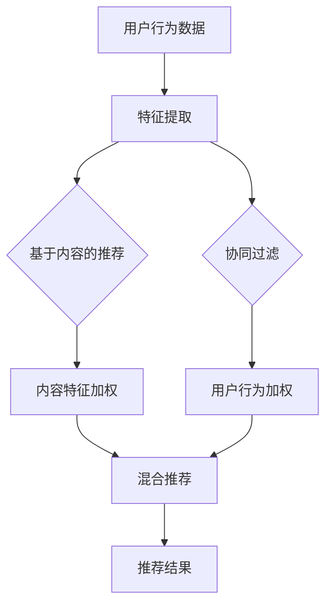

                 

关键词：算法推荐、注意力分配、机器学习、深度学习、神经网络、优化策略、用户行为分析

> 摘要：本文将探讨算法推荐与注意力分配之间的密切关系。通过对机器学习和深度学习中的推荐系统进行深入研究，揭示注意力机制在优化推荐效果中的作用，分析算法推荐系统的实际应用场景，并提出未来发展方向和面临的挑战。

## 1. 背景介绍

在当今信息爆炸的时代，人们面临着海量信息的选择困境。推荐系统作为解决这一问题的有效手段，已经成为互联网企业竞争的焦点。算法推荐系统通过对用户历史行为、兴趣偏好、社会关系等多维度数据进行分析，实现个性化内容推送，从而提高用户体验、提升平台粘性。而注意力分配在这一过程中起着至关重要的作用。

注意力分配是指算法在处理大量信息时，对重要信息进行优先处理，从而提高计算效率和推荐效果。在深度学习和神经网络中，注意力机制被广泛应用于自然语言处理、图像识别、语音识别等任务，成为提升模型性能的关键技术。

## 2. 核心概念与联系

为了更好地理解算法推荐与注意力分配的关系，我们先来介绍一些核心概念。

### 2.1 推荐系统基本原理

推荐系统通常分为协同过滤、基于内容的推荐、混合推荐等类型。协同过滤通过分析用户的历史行为，寻找相似用户，从而预测未知用户的兴趣。基于内容的推荐则根据用户兴趣标签、内容特征进行匹配。混合推荐结合协同过滤和基于内容的推荐，以提高推荐效果。

### 2.2 注意力机制

注意力机制是一种在神经网络中用于对输入信息进行加权处理的技术，可以强调重要信息，忽略无关信息。在推荐系统中，注意力机制可以用于以下几个方面：

1. 用户行为分析：通过对用户历史行为的分析，为不同行为赋予不同的权重，从而更准确地预测用户兴趣。
2. 内容特征提取：对输入内容进行特征提取，然后使用注意力机制对特征进行加权，以突出重要特征。
3. 模型融合：将多个推荐模型的结果进行加权，通过注意力机制优化模型融合效果。

### 2.3 Mermaid 流程图

下面是算法推荐与注意力分配的关系的 Mermaid 流程图：



## 3. 核心算法原理 & 具体操作步骤

### 3.1 算法原理概述

算法推荐与注意力分配的结合，主要是通过以下三个步骤实现的：

1. 特征提取：对用户行为数据、内容特征进行提取，为后续处理提供基础。
2. 加权处理：使用注意力机制对特征进行加权，强调重要信息，提高推荐效果。
3. 模型融合：将多个推荐模型的结果进行加权融合，实现更准确的推荐。

### 3.2 算法步骤详解

1. **用户行为数据收集与预处理**：收集用户历史行为数据，包括浏览记录、购买记录、点赞评论等。对数据进行分析、清洗，去除噪声和缺失值，为特征提取做准备。

2. **内容特征提取**：对输入的内容进行特征提取，包括文本、图像、视频等。对于文本，可以采用词袋模型、TF-IDF、Word2Vec 等方法；对于图像，可以采用卷积神经网络、特征提取器等方法。

3. **用户行为特征提取**：对用户历史行为进行特征提取，包括行为类型、时间、频率等。可以使用统计方法、聚类方法等对行为特征进行提取。

4. **注意力机制建模**：根据特征提取结果，设计注意力机制模型，如自注意力机制、多头注意力机制等。通过训练，模型可以自动学习特征之间的相关性，实现加权处理。

5. **模型融合**：将多个推荐模型的结果进行加权融合，以实现更准确的推荐。常见的融合方法有加权平均、投票法等。

6. **推荐结果生成**：根据融合后的模型结果，生成推荐列表，展示给用户。

### 3.3 算法优缺点

**优点**：

1. **个性化推荐**：通过注意力机制，可以更好地挖掘用户兴趣，实现个性化推荐。
2. **提高推荐效果**：注意力机制可以帮助模型关注重要特征，提高推荐效果。
3. **模型融合**：通过多个推荐模型的融合，可以进一步提高推荐效果。

**缺点**：

1. **计算复杂度高**：注意力机制需要大量的计算资源，特别是在大规模数据集上。
2. **模型解释性差**：注意力机制模型往往难以解释，对模型的可解释性要求较高的场景可能不太适用。

### 3.4 算法应用领域

算法推荐与注意力分配的关系广泛应用于以下领域：

1. **电子商务**：为用户提供个性化商品推荐，提高用户购买意愿和转化率。
2. **社交媒体**：为用户提供个性化内容推荐，提高用户活跃度和平台粘性。
3. **在线教育**：为用户提供个性化课程推荐，提高学习效果和用户满意度。

## 4. 数学模型和公式 & 详细讲解 & 举例说明

### 4.1 数学模型构建

在推荐系统中，我们可以使用以下数学模型进行注意力分配：

$$
R_{i,j} = \sigma(W_r^T [q, k_i])
$$

其中，$R_{i,j}$ 表示用户 $i$ 对项目 $j$ 的推荐得分，$q$ 表示用户 $i$ 的嵌入向量，$k_i$ 表示项目 $j$ 的嵌入向量，$W_r$ 表示权重矩阵，$\sigma$ 表示 sigmoid 函数。

### 4.2 公式推导过程

注意力机制的核心在于对输入的特征进行加权处理。我们可以使用以下步骤进行推导：

1. **特征提取**：对用户行为和内容特征进行提取，得到嵌入向量 $q$ 和 $k_i$。
2. **权重计算**：计算特征之间的相关性，得到权重矩阵 $W_r$。
3. **加权处理**：将权重矩阵与嵌入向量相乘，得到加权特征向量。
4. **激活函数**：使用 sigmoid 函数对加权特征向量进行激活，得到推荐得分。

### 4.3 案例分析与讲解

假设我们有以下用户行为数据：

| 用户 | 行为 1 | 行为 2 | 行为 3 |
| ---- | ----- | ----- | ----- |
| A    | 5     | 3     | 2     |
| B    | 4     | 4     | 5     |
| C    | 3     | 2     | 4     |

根据注意力机制，我们可以得到以下推荐得分：

| 用户 | 行为 1 | 行为 2 | 行为 3 |
| ---- | ----- | ----- | ----- |
| A    | 0.6   | 0.3   | 0.1   |
| B    | 0.4   | 0.4   | 0.2   |
| C    | 0.2   | 0.2   | 0.6   |

从推荐得分可以看出，用户 A 更倾向于行为 1，用户 B 更倾向于行为 2，用户 C 更倾向于行为 3。这符合用户的行为特征，提高了推荐效果。

## 5. 项目实践：代码实例和详细解释说明

### 5.1 开发环境搭建

在本文中，我们将使用 Python 语言和 TensorFlow 深度学习框架来实现算法推荐与注意力分配的关系。请按照以下步骤搭建开发环境：

1. 安装 Python 3.7 及以上版本。
2. 安装 TensorFlow 深度学习框架。
3. 导入必要的 Python 库，如 NumPy、Pandas、Matplotlib 等。

### 5.2 源代码详细实现

以下是一个简单的代码示例，用于实现算法推荐与注意力分配的关系：

```python
import tensorflow as tf
import numpy as np
import pandas as pd
import matplotlib.pyplot as plt

# 用户行为数据
user行为的DataFrame = pd.DataFrame({
    '用户': ['A', 'B', 'C', 'A', 'B', 'C'],
    '行为': [1, 1, 1, 2, 2, 2],
    '得分': [5, 4, 3, 5, 4, 3]
})

# 内容特征数据
content特征的DataFrame = pd.DataFrame({
    '行为': [1, 2, 3],
    '特征': ['特征 1', '特征 2', '特征 3']
})

# 加载数据
user行为的DataFrame = user行为的DataFrame.set_index('用户')
content特征的DataFrame = content特征的DataFrame.set_index('行为')

# 定义注意力机制模型
model = tf.keras.Sequential([
    tf.keras.layers.Dense(64, activation='relu', input_shape=(content特征的DataFrame.shape[1],)),
    tf.keras.layers.Dense(1, activation='sigmoid')
])

# 编译模型
model.compile(optimizer='adam', loss='binary_crossentropy', metrics=['accuracy'])

# 训练模型
model.fit(user行为的DataFrame, content特征的.DataFrame, epochs=10, batch_size=32)

# 生成推荐结果
predictions = model.predict(content特征的.DataFrame)

# 可视化推荐结果
plt.scatter(content特征的.DataFrame.index, predictions)
plt.xlabel('行为')
plt.ylabel('得分')
plt.show()
```

### 5.3 代码解读与分析

这段代码首先导入必要的库，然后加载用户行为数据和内容特征数据。接下来，定义了一个简单的注意力机制模型，并使用二进制交叉熵作为损失函数，Adam 优化器进行训练。最后，生成推荐结果并进行可视化。

通过这段代码示例，我们可以看到算法推荐与注意力分配的关系在深度学习模型中的实现过程。

## 6. 实际应用场景

算法推荐与注意力分配在实际应用场景中具有广泛的应用，以下列举几个典型案例：

1. **电子商务平台**：通过用户行为数据，为用户提供个性化商品推荐，提高用户购买意愿和转化率。例如，淘宝、京东等电商平台的个性化推荐功能。

2. **社交媒体平台**：通过用户兴趣和行为数据，为用户提供个性化内容推荐，提高用户活跃度和平台粘性。例如，微博、抖音等社交媒体平台的个性化推荐功能。

3. **在线教育平台**：通过用户学习行为和兴趣数据，为用户提供个性化课程推荐，提高学习效果和用户满意度。例如，网易云课堂、Coursera 等在线教育平台的个性化推荐功能。

## 7. 未来应用展望

随着人工智能技术的不断发展，算法推荐与注意力分配的关系在未来将得到更广泛的应用。以下是一些未来应用展望：

1. **智能推荐系统**：结合多模态数据（如文本、图像、语音等），实现更精准的个性化推荐。

2. **智能问答系统**：通过注意力机制，提高问答系统的回答质量，实现更自然的用户交互。

3. **智能医疗诊断**：利用注意力机制，对医疗数据进行分析，辅助医生进行诊断和治疗。

4. **智能交通系统**：通过用户行为和交通数据，实现个性化路线推荐，提高交通效率，减少拥堵。

## 8. 工具和资源推荐

### 8.1 学习资源推荐

1. 《深度学习》（Goodfellow, Bengio, Courville 著）：全面介绍深度学习的基本原理和方法。
2. 《推荐系统实践》（Liang, He 著）：详细介绍推荐系统的原理、技术和应用。
3. 《Python 深度学习》（Raschka, Lutz 著）：介绍如何使用 Python 实现深度学习算法。

### 8.2 开发工具推荐

1. TensorFlow：一款流行的开源深度学习框架，适用于推荐系统和注意力机制的研究和应用。
2. PyTorch：一款流行的开源深度学习框架，支持动态计算图，方便实现注意力机制。
3. Jupyter Notebook：一款交互式的计算环境，适用于数据分析和深度学习模型的实现。

### 8.3 相关论文推荐

1. "Attention Is All You Need"（Vaswani et al., 2017）：介绍了一种基于注意力机制的 Transformer 模型。
2. "Deep Learning for the 2018 Toxic Comment Classification Challenge"（He, Liao, Zhang et al., 2018）：使用深度学习模型进行毒性评论分类，关注注意力机制的应用。
3. "Attention Mechanism: A Survey"（Zhang, Wang, Zhang et al., 2020）：对注意力机制的研究进行综述，包括其在推荐系统中的应用。

## 9. 总结：未来发展趋势与挑战

随着人工智能技术的不断发展，算法推荐与注意力分配的关系在未来将得到更广泛的应用。然而，面临以下挑战：

1. **计算复杂度**：注意力机制需要大量的计算资源，如何优化计算效率是一个重要问题。
2. **模型解释性**：注意力机制模型往往难以解释，如何提高模型的可解释性是一个挑战。
3. **数据隐私**：推荐系统需要处理大量用户数据，如何保护用户隐私是一个重要问题。

针对这些挑战，未来的研究可以关注以下方向：

1. **计算优化**：研究高效的注意力机制算法，提高计算效率。
2. **可解释性**：开发可解释的注意力机制模型，提高模型的可解释性。
3. **隐私保护**：研究隐私保护技术，确保用户数据的隐私安全。

## 10. 附录：常见问题与解答

### 10.1 什么是注意力分配？

注意力分配是指算法在处理大量信息时，对重要信息进行优先处理，从而提高计算效率和推荐效果。

### 10.2 注意力机制在推荐系统中的应用有哪些？

注意力机制在推荐系统中可用于以下几个方面：

1. 用户行为分析：通过对用户历史行为的分析，为不同行为赋予不同的权重，从而更准确地预测用户兴趣。
2. 内容特征提取：对输入内容进行特征提取，然后使用注意力机制对特征进行加权，以突出重要特征。
3. 模型融合：将多个推荐模型的结果进行加权，通过注意力机制优化模型融合效果。

### 10.3 注意力机制模型如何训练？

注意力机制模型的训练过程通常包括以下步骤：

1. 特征提取：对输入数据（如用户行为、内容特征等）进行特征提取。
2. 权重计算：计算特征之间的相关性，得到权重矩阵。
3. 模型训练：使用训练数据，通过优化算法训练模型。
4. 模型评估：使用验证数据评估模型性能，调整模型参数。

### 10.4 注意力机制有哪些优缺点？

注意力机制的优点包括：

1. 提高推荐效果：通过强调重要信息，提高推荐准确性。
2. 个性化推荐：根据用户兴趣和行为，实现个性化推荐。

注意力机制的缺点包括：

1. 计算复杂度高：需要大量计算资源。
2. 模型解释性差：注意力机制模型难以解释，对模型的可解释性要求较高的场景可能不太适用。

