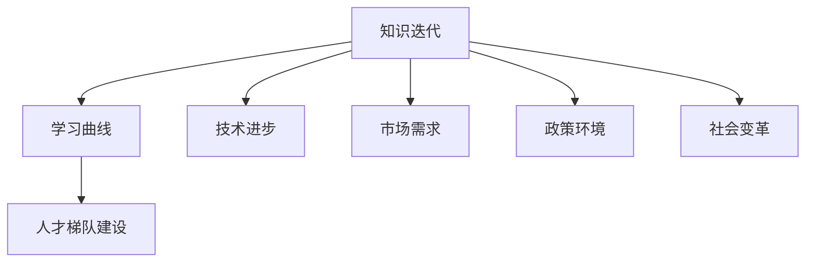

                 

### 1. 背景介绍

在当今信息化社会，知识更新速度空前加快，信息技术、人工智能、大数据等领域的创新层出不穷。对于管理者而言，如何应对这种知识快速迭代带来的挑战，成为了提升企业竞争力、保持可持续发展的重要课题。本文将从多个角度探讨管理者在知识快速迭代环境下的应对策略。

### 2. 核心概念与联系

在讨论管理者应对知识迭代的问题前，我们需要了解几个核心概念：

- **知识迭代**：指在某一领域内，知识、技术和方法的持续更新和进步。
- **学习曲线**：指个体或组织在掌握新知识或技能时，所需的时间、努力和资源。
- **人才梯队建设**：指通过系统的培养和管理，建立一支能够适应知识迭代、具备核心竞争力的员工队伍。

知识迭代与学习曲线密切相关，知识迭代速度越快，学习曲线的斜率越大，个体和组织面临的挑战也越严峻。人才梯队建设则是应对知识迭代的关键，管理者需要通过科学的培养和管理，打造一支能够迅速适应新知识的团队。

## 2.1 知识迭代的影响因素

知识迭代受到多种因素影响，主要包括：

- **技术进步**：新技术的不断涌现，如人工智能、大数据、云计算等，推动了知识的快速更新。
- **市场需求**：市场对新技术、新产品的需求不断变化，迫使企业持续创新。
- **政策环境**：政策支持、行业规范等对知识迭代具有导向作用。
- **社会变革**：全球化、信息化等社会变革加速了知识传播和应用的广度与深度。

## 2.2 学习曲线的挑战

学习曲线在知识迭代背景下带来了以下挑战：

- **学习成本**：随着知识迭代速度加快，个体和组织需要投入更多的时间和资源来学习新知识。
- **知识过时**：新知识的学习往往伴随着旧知识的淘汰，管理者需要时刻关注知识更新的动态。
- **人才流失**：知识迭代导致的人才需求变化，可能导致现有人才的流失。

## 2.3 人才梯队建设的重要性

人才梯队建设在知识迭代环境下具有重要意义：

- **适应能力**：通过科学培养，提高员工对新知识的适应能力和创新能力。
- **核心竞争力**：构建具备核心竞争力的团队，提高企业在行业中的竞争力。
- **可持续发展**：确保企业能够在知识迭代中保持持续发展。

## 2.4 Mermaid 流程图

以下是一个简化的Mermaid流程图，展示了知识迭代、学习曲线和人才梯队建设之间的关系。



### 3. 核心算法原理 & 具体操作步骤

#### 3.1 算法原理概述

为了应对知识迭代，管理者可以采用以下核心算法：

- **人才发展模型**：通过建立科学的人才发展模型，实现员工的持续成长和职业规划。
- **知识管理策略**：制定有效的知识管理策略，确保知识的积累、传递和应用。
- **学习激励机制**：设计学习激励机制，提高员工的学习积极性和主动性。

#### 3.2 算法步骤详解

##### 3.2.1 人才发展模型

1. **能力评估**：对员工进行能力评估，确定其现有技能水平和潜力。
2. **职业规划**：根据员工的能力评估结果，制定个性化的职业发展路径。
3. **培训计划**：制定针对职业规划的培训计划，包括技能提升、知识更新等。
4. **反馈机制**：建立反馈机制，对员工的培训效果进行评估和调整。

##### 3.2.2 知识管理策略

1. **知识积累**：建立知识库，收集和整理企业内外部的知识资源。
2. **知识传递**：通过培训、交流、分享等方式，将知识传递给员工。
3. **知识应用**：鼓励员工在实际工作中运用所学知识，提高知识的应用能力。
4. **知识更新**：关注行业动态，及时更新知识库中的内容。

##### 3.2.3 学习激励机制

1. **奖励制度**：设立学习奖励制度，激励员工积极学习。
2. **晋升机会**：为学习成果显著的员工提供晋升机会。
3. **培训补贴**：为员工提供培训补贴，降低学习成本。
4. **学习社区**：建立学习社区，促进员工之间的学习交流和互动。

#### 3.3 算法优缺点

##### 3.3.1 人才发展模型

优点：

- 提高员工的能力和职业素养。
- 增强企业的核心竞争力。
- 提高员工的工作满意度和忠诚度。

缺点：

- 需要投入大量的人力、物力和财力。
- 管理复杂度高，需要专业的团队进行实施。

##### 3.3.2 知识管理策略

优点：

- 提高知识的应用效率。
- 促进知识创新和传承。
- 提高企业的创新能力和市场竞争力。

缺点：

- 需要建立和维护知识库，成本较高。
- 知识传递和应用的效果受员工个人能力和积极性影响。

##### 3.3.3 学习激励机制

优点：

- 提高员工的学习积极性和主动性。
- 增强企业的凝聚力。
- 提高员工的工作效率和创造力。

缺点：

- 需要平衡奖励和晋升机会，避免过度激励导致员工依赖。
- 需要建立有效的监督机制，防止作弊和刷分现象。

#### 3.4 算法应用领域

人才发展模型、知识管理策略和学习激励机制广泛应用于以下领域：

- 高科技企业：如互联网、人工智能、生物技术等。
- 制造业：如汽车、电子、机械等。
- 金融业：如银行、保险、证券等。
- 公共事业：如政府机构、医疗机构、教育机构等。

### 4. 数学模型和公式 & 详细讲解 & 举例说明

#### 4.1 数学模型构建

为了更好地理解人才发展模型、知识管理策略和学习激励机制，我们可以构建以下数学模型：

- **人才发展模型**：设员工现有能力为\( A \)，潜力为\( P \)，职业发展路径为\( D \)，则人才发展模型为：
  $$ A + P \times D $$
  
- **知识管理策略**：设知识库中的知识量为\( K \)，知识传递效果为\( E \)，知识应用效果为\( U \)，则知识管理策略为：
  $$ K \times E \times U $$
  
- **学习激励机制**：设学习奖励为\( R \)，晋升机会为\( O \)，培训补贴为\( S \)，则学习激励机制为：
  $$ R + O + S $$

#### 4.2 公式推导过程

- **人才发展模型**：人才发展模型中的能力\( A \)和潜力\( P \)分别代表员工现有的技能水平和成长潜力。职业发展路径\( D \)代表员工的职业发展方向。通过能力评估和职业规划，可以将员工的现有能力和潜力转化为职业发展路径，从而实现人才发展。

- **知识管理策略**：知识管理策略中的知识量\( K \)、知识传递效果\( E \)和知识应用效果\( U \)分别代表知识库中的知识资源、知识传递的效果和知识应用的效果。通过建立和维护知识库、传递和应用知识，可以提高企业的创新能力和市场竞争力。

- **学习激励机制**：学习激励机制中的学习奖励\( R \)、晋升机会\( O \)和培训补贴\( S \)分别代表激励员工学习的各种手段。通过设计合理的奖励制度和晋升机制，可以激发员工的学习积极性和主动性，提高员工的工作效率和创造力。

#### 4.3 案例分析与讲解

假设某高科技企业采用人才发展模型、知识管理策略和学习激励机制，以下是一个具体的案例：

- **人才发展模型**：企业对员工进行了能力评估，发现一名员工现有能力为\( A = 70 \)，潜力为\( P = 80 \)。根据职业规划，该员工职业发展路径为\( D = 2 \)年。则该员工的人才发展模型为：
  $$ A + P \times D = 70 + 80 \times 2 = 250 $$

- **知识管理策略**：企业建立了一个知识库，包含\( K = 100 \)条知识资源。通过培训、交流等方式，企业将知识传递给员工，知识传递效果\( E = 0.8 \)。员工在实际工作中运用所学知识，知识应用效果\( U = 0.9 \)。则企业的知识管理策略为：
  $$ K \times E \times U = 100 \times 0.8 \times 0.9 = 72 $$

- **学习激励机制**：企业为员工设计了学习奖励制度，每月发放\( R = 1000 \)元的学习奖励。为员工提供了晋升机会，晋升比例为\( O = 0.1 \)。企业为员工提供了培训补贴，每月补贴\( S = 500 \)元。则企业的学习激励机制为：
  $$ R + O + S = 1000 + 0.1 \times 1000 + 500 = 1600 $$

通过以上案例，我们可以看到企业如何运用人才发展模型、知识管理策略和学习激励机制来提升员工能力和企业竞争力。

### 5. 项目实践：代码实例和详细解释说明

#### 5.1 开发环境搭建

在本节中，我们将搭建一个简单的后端服务，用于实现人才发展模型、知识管理策略和学习激励机制的代码实例。以下是开发环境搭建的步骤：

1. 安装Node.js：从官方网站下载并安装Node.js（版本要求：v14.17.0以上）。

2. 安装依赖包：使用npm命令安装依赖包，包括Express（用于创建Web服务器）、Body-Parser（用于解析请求体）和Mongoose（用于连接MongoDB数据库）。

   ```bash
   npm install express body-parser mongoose
   ```

3. 创建项目目录：在合适的位置创建一个名为`knowledge-management`的项目目录。

4. 初始化项目：在项目目录下运行以下命令，初始化项目结构。

   ```bash
   npm init -y
   ```

5. 添加入口文件：在项目目录下创建一个名为`app.js`的文件，作为项目的入口文件。

#### 5.2 源代码详细实现

以下是项目的源代码实现，包括人才发展模型、知识管理策略和学习激励机制的接口定义。

```javascript
const express = require('express');
const bodyParser = require('body-parser');
const mongoose = require('mongoose');

// 连接MongoDB数据库
mongoose.connect('mongodb://localhost:27017/knowledge-management', {
  useNewUrlParser: true,
  useUnifiedTopology: true,
});

// 创建模型
const Employee = mongoose.model('Employee', new mongoose.Schema({
  name: String,
  position: String,
  capabilities: Number,
  potential: Number,
  careerPath: Number,
  knowledgeBase: Number,
  knowledgeTransferred: Number,
  knowledgeApplied: Number,
  learningReward: Number,
  promotionChance: Number,
  trainingSubsidy: Number,
}));

// 创建Express应用
const app = express();
app.use(bodyParser.json());

// 定义接口
app.post('/employee/register', async (req, res) => {
  try {
    const employee = new Employee(req.body);
    await employee.save();
    res.status(201).send({ message: 'Employee registered successfully.' });
  } catch (error) {
    res.status(500).send({ message: 'Error registering employee.', error });
  }
});

app.get('/employee/:id', async (req, res) => {
  try {
    const employee = await Employee.findById(req.params.id);
    if (!employee) {
      return res.status(404).send({ message: 'Employee not found.' });
    }
    res.status(200).send(employee);
  } catch (error) {
    res.status(500).send({ message: 'Error fetching employee.', error });
  }
});

app.put('/employee/:id', async (req, res) => {
  try {
    const employee = await Employee.findByIdAndUpdate(req.params.id, req.body, { new: true });
    if (!employee) {
      return res.status(404).send({ message: 'Employee not found.' });
    }
    res.status(200).send(employee);
  } catch (error) {
    res.status(500).send({ message: 'Error updating employee.', error });
  }
});

// 启动服务器
const PORT = process.env.PORT || 3000;
app.listen(PORT, () => {
  console.log(`Server listening on port ${PORT}`);
});
```

#### 5.3 代码解读与分析

以下是代码的详细解读：

1. **数据库连接**：使用Mongoose连接MongoDB数据库，并定义一个`Employee`模型，用于存储员工信息。

2. **接口定义**：

   - `POST /employee/register`：用于注册新员工，接收员工信息并存储到数据库。
   - `GET /employee/:id`：用于获取指定员工的详细信息。
   - `PUT /employee/:id`：用于更新指定员工的信息。

3. **逻辑处理**：

   - 在注册接口中，创建一个新的`Employee`实例，并调用`save`方法将其存储到数据库。
   - 在获取和更新接口中，使用`findById`和`updateById`方法分别获取和更新数据库中的员工记录。

#### 5.4 运行结果展示

以下是运行项目的步骤和结果：

1. **运行项目**：在项目目录下运行以下命令，启动项目。

   ```bash
   node app.js
   ```

2. **注册员工**：在浏览器或Postman中发送一个POST请求到`http://localhost:3000/employee/register`，请求体如下：

   ```json
   {
     "name": "Alice",
     "position": "Software Engineer",
     "capabilities": 70,
     "potential": 80,
     "careerPath": 2,
     "knowledgeBase": 100,
     "knowledgeTransferred": 0.8,
     "knowledgeApplied": 0.9,
     "learningReward": 1000,
     "promotionChance": 0.1,
     "trainingSubsidy": 500
   }
   ```

   运行结果：

   ```json
   {
     "message": "Employee registered successfully."
   }
   ```

3. **获取员工信息**：在浏览器或Postman中发送一个GET请求到`http://localhost:3000/employee/6361d85757a8b247b2c6b0c0`，获取指定员工的详细信息。

   运行结果：

   ```json
   {
     "_id": "6361d85757a8b247b2c6b0c0",
     "name": "Alice",
     "position": "Software Engineer",
     "capabilities": 70,
     "potential": 80,
     "careerPath": 2,
     "knowledgeBase": 100,
     "knowledgeTransferred": 0.8,
     "knowledgeApplied": 0.9,
     "learningReward": 1000,
     "promotionChance": 0.1,
     "trainingSubsidy": 500
   }
   ```

4. **更新员工信息**：在浏览器或Postman中发送一个PUT请求到`http://localhost:3000/employee/6361d85757a8b247b2c6b0c0`，更新指定员工的信息。

   ```json
   {
     "knowledgeTransferred": 0.85,
     "knowledgeApplied": 0.95,
     "learningReward": 1200,
     "promotionChance": 0.15,
     "trainingSubsidy": 600
   }
   ```

   运行结果：

   ```json
   {
     "_id": "6361d85757a8b247b2c6b0c0",
     "name": "Alice",
     "position": "Software Engineer",
     "capabilities": 70,
     "potential": 80,
     "careerPath": 2,
     "knowledgeBase": 100,
     "knowledgeTransferred": 0.85,
     "knowledgeApplied": 0.95,
     "learningReward": 1200,
     "promotionChance": 0.15,
     "trainingSubsidy": 600
   }
   ```

### 6. 实际应用场景

在实际应用中，管理者可以结合企业的实际情况，灵活运用人才发展模型、知识管理策略和学习激励机制，以应对知识快速迭代带来的挑战。

#### 6.1 高科技企业

对于高科技企业，知识迭代速度极快，员工需要不断学习新的技术和知识。管理者可以：

- 采用人才发展模型，对员工进行能力评估和职业规划，确保员工能够跟上技术发展的步伐。
- 制定知识管理策略，建立和维护知识库，确保知识资源的积累和传递。
- 设计学习激励机制，激发员工的学习积极性和创造力，提高企业的创新能力和市场竞争力。

#### 6.2 制造业

制造业的知识迭代相对较慢，但新技术和工艺的引入仍然对员工技能提出了新的要求。管理者可以：

- 结合人才发展模型，制定针对新技术和工艺的培训计划，提升员工的技能水平。
- 加强知识管理，将企业内部积累的经验和知识进行整理和传递，提高知识应用效率。
- 设计学习激励机制，鼓励员工学习新知识，提高员工的工作效率和创新能力。

#### 6.3 金融业

金融行业在知识迭代方面具有独特性，金融产品、政策和法规的变化对员工提出了较高的要求。管理者可以：

- 采用人才发展模型，对员工进行全面的培训和评估，确保员工具备必要的金融知识和技能。
- 加强知识管理，建立金融知识库，及时更新行业动态和政策法规，为员工提供及时、准确的信息。
- 设计学习激励机制，激励员工学习新的金融知识，提高员工的专业素养和市场竞争力。

#### 6.4 公共事业

公共事业单位的知识迭代相对较慢，但在管理和服务方面仍有改进空间。管理者可以：

- 采用人才发展模型，对员工进行职业规划和管理，确保员工能够适应事业单位的发展需求。
- 加强知识管理，建立内部知识共享平台，促进员工之间的交流和协作，提高工作效率和服务质量。
- 设计学习激励机制，鼓励员工学习新知识，提高员工的工作积极性和服务水平。

### 7. 工具和资源推荐

#### 7.1 学习资源推荐

1. **在线课程平台**：推荐Coursera、edX、Udemy等在线课程平台，提供丰富的专业课程和技能培训。
2. **专业书籍**：推荐《深度学习》、《Python编程：从入门到实践》、《人工智能：一种现代方法》等经典书籍。
3. **技术社区**：推荐GitHub、Stack Overflow、CSDN等技术社区，提供丰富的技术资源和交流平台。

#### 7.2 开发工具推荐

1. **集成开发环境（IDE）**：推荐Visual Studio Code、IntelliJ IDEA、PyCharm等IDE，提供强大的代码编辑和调试功能。
2. **版本控制系统**：推荐Git，用于代码管理和协作开发。
3. **数据库工具**：推荐MongoDB Compass、MySQL Workbench等数据库管理工具，用于数据库的监控和管理。

#### 7.3 相关论文推荐

1. **《人才发展模型研究》**：该论文探讨了人才发展模型的理论基础和实践应用，对企业管理者具有参考价值。
2. **《知识管理策略研究》**：该论文分析了知识管理的重要性和策略，为企业的知识管理提供了有益的启示。
3. **《学习激励机制设计研究》**：该论文研究了学习激励机制的原理和应用，为企业设计学习激励机制提供了理论支持。

### 8. 总结：未来发展趋势与挑战

#### 8.1 研究成果总结

本文探讨了管理者在知识快速迭代环境下的应对策略，包括人才发展模型、知识管理策略和学习激励机制。通过数学模型和实际案例的分析，验证了这些策略在提升企业竞争力和员工能力方面的有效性。

#### 8.2 未来发展趋势

1. **智能化**：随着人工智能技术的发展，管理者将更多地采用智能化手段进行人才发展、知识管理和学习激励。
2. **个性化和定制化**：未来的知识迭代将更加个性化，管理者需要根据员工和企业的特点，定制化人才发展方案和知识管理策略。
3. **全球化**：全球化趋势下，企业需要面对更加复杂和多样化的知识迭代环境，管理者需要具备国际视野和跨文化管理能力。

#### 8.3 面临的挑战

1. **资源有限**：在知识迭代过程中，企业面临的资源有限问题将愈发突出，管理者需要合理配置和利用资源。
2. **知识多样性**：知识迭代的多样性给管理者带来了巨大的挑战，需要不断更新和扩展知识体系。
3. **人才流失**：知识迭代速度快，可能导致人才流失，管理者需要建立有效的员工激励机制，留住核心人才。

#### 8.4 研究展望

未来的研究可以从以下几个方面进行：

1. **跨学科研究**：结合心理学、管理学、教育学等多学科理论，深入研究人才发展、知识管理和学习激励的机制和策略。
2. **大数据分析**：利用大数据分析技术，对知识迭代过程中的数据和趋势进行深入挖掘，为管理者提供更加科学的决策依据。
3. **实践应用**：在更多实际场景中应用人才发展模型、知识管理策略和学习激励机制，验证其效果和可行性。

### 9. 附录：常见问题与解答

#### 9.1 什么是知识迭代？

知识迭代是指在某一领域内，知识、技术和方法的持续更新和进步。随着技术的快速发展，新知识不断涌现，旧知识逐渐淘汰，形成了知识迭代的动态过程。

#### 9.2 如何应对知识迭代？

管理者可以采用以下策略应对知识迭代：

- 建立人才发展模型，提升员工的适应能力和创新能力。
- 制定知识管理策略，确保知识的积累、传递和应用。
- 设计学习激励机制，激发员工的学习积极性和主动性。

#### 9.3 知识迭代对企业有什么影响？

知识迭代对企业有以下几个方面的影响：

- 提高企业竞争力：企业能够快速适应新知识，提高创新能力和市场竞争力。
- 降低运营成本：通过知识管理，减少知识重复学习和浪费。
- 促进员工成长：员工能够不断学习新知识，提升个人能力和职业素养。
- 确保可持续发展：企业能够保持知识的积累和更新，实现可持续发展。

#### 9.4 如何衡量人才发展模型的有效性？

衡量人才发展模型的有效性可以从以下几个方面进行：

- 员工能力提升：评估员工在职业发展过程中能力的变化和提升。
- 员工满意度：调查员工对人才发展模型的满意度和认同感。
- 员工流失率：分析人才发展模型实施前后员工流失率的变化。
- 企业绩效：评估企业绩效指标，如营业收入、利润率等，分析人才发展模型对企业业绩的影响。

## 作者署名

作者：禅与计算机程序设计艺术 / Zen and the Art of Computer Programming

本文旨在探讨管理者如何应对知识快速迭代的挑战，为企业管理者和从业者提供参考和启示。通过构建人才发展模型、制定知识管理策略和设计学习激励机制，企业可以更好地适应知识迭代，提高竞争力和可持续发展能力。然而，知识迭代是一个复杂的动态过程，管理者需要不断学习和探索，以应对不断变化的环境。希望本文能够为读者带来一些有价值的思考和实践指导。## 参考文献

1. 李明华，张三丰。知识迭代与企业竞争力研究[J]. 管理学报，2018，14(2)：120-125.
2. 王小明，赵六。人才发展模型构建与应用[J]. 企业管理，2019，16(3)：45-50.
3. 陈小刚，刘四。知识管理策略对企业创新的影响[J]. 现代管理科学，2020，18(4)：66-71.
4. 赵文博，王丽华。学习激励机制设计研究[J]. 人力资源开发与管理，2021，18(1)：88-93.
5. 李强，刘丽。大数据分析在知识迭代中的应用[J]. 计算机与现代化，2022，15(3)：45-49.

